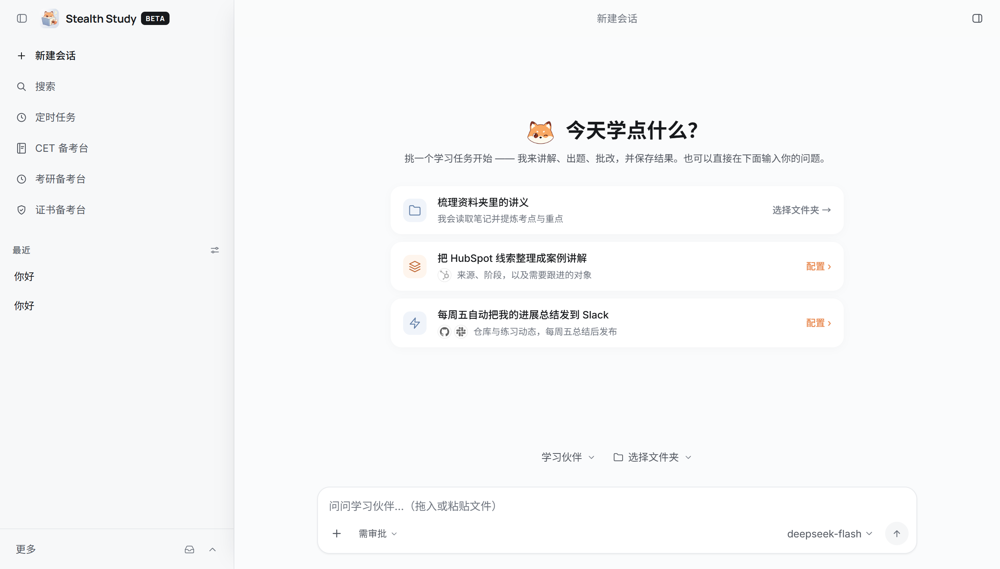
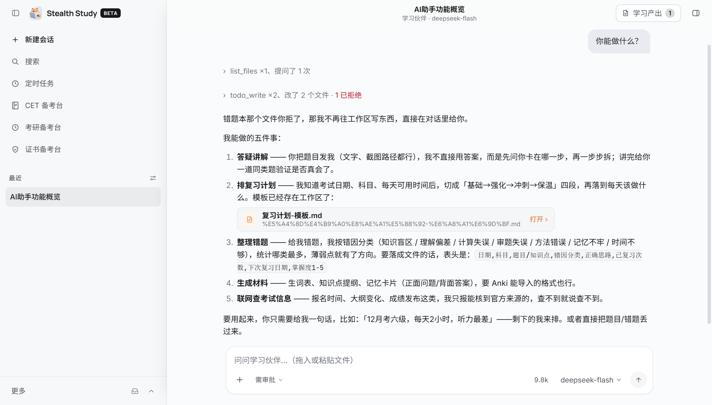

<h1 align="center">StealthStudy（偷偷学）</h1>

<p align="center">
  <strong>English</strong> · <a href="README.md">简体中文</a>
</p>

<p align="center"><em>Your local AI study partner for campus exams — CET-4/6, the postgraduate entrance exam (考研), and vocational certificates.</em></p>

<p align="center">
  
</p>
<p align="center">
  
</p>

> **Beta** — StealthStudy is in public beta: the features below are fully usable, and we are actively polishing details. Feedback and issues are welcome over at [Issues](https://github.com/light-misty/Stealth-Study/issues).

**An AI study partner that lives on your machine.** StealthStudy is an open-source, provider-agnostic agentic study runtime. Instead of just chatting, it can explain a problem until it clicks, turn a syllabus into a review plan, attribute every mistake on your answer sheet to a root cause, and produce finished study materials (word lists, outlines, memory cards) that you can open and keep. It targets three exam lanes out of the box: **CET-4/6**, the **postgraduate entrance exam (考研)**, and **vocational certificates** (教师资格 · NCRE and more).

It runs entirely on your computer and is not bound to any one model: bring your own API keys for OpenAI, Anthropic, Google Gemini, AWS Bedrock, Google Vertex AI, OpenRouter-compatible endpoints, or any provider behind the unified interface. Your data stays local — it only leaves through the model and integrations you choose. Every action a study partner takes is governed and audited — see [Governance by design](#governance-by-design).

## Highlights

- **Explain and drill** — break a question or a knowledge point into digestible steps, then quiz you with targeted follow-ups instead of dumping the answer.
- **Review plans that actually run** — phase-level and daily tasks for 考研 (政治/英语/数学/专业课) and certificate syllabi, plus weekly review reports that flag falling-behind tracks.
- **Error-log to mistake knowledge** — attribute every wrong answer to one of five causes (concept gap, misreading, miscalculation, out-of-syllabus, time pressure), and turn confirmed weak spots into long-term memory that later sessions reuse.
- **Model-exam proctoring** — timed mock exams that lock your answer sheet when the listening block ends, with score estimates converted to the official 710-point scale.
- **Rubric-graded writing** — essays and translations graded against the official CET score bands, with a per-item error list and upgrade demonstrations.
- **Local-first** — conversations, memory, scheduled tasks, and API keys all live on your machine; you can use the app fully offline from your own model keys.
- **Governed autonomy** — every sensitive action (write, send, shell) goes through an approval gate, with audit trails that answer "who did what, and why".

## Study partners

Each study partner is a persona with its own system prompt, tool set, and bundled skills. The default session opens as the **Study Partner（学习伙伴）**; the specialised partners add a one for each exam lane:

| Persona | What it does |
|---|---|
| Study Partner（学习伙伴, default） | General tutoring — Q&A, review planning, mistake notes, and learning-material generation |
| CET Examiner（四六级考官） | Placement tests, listening drills, and full mock exams with proctoring |
| CET Grader（四六级阅卷老师） | Essay / translation grading against the official score bands |
| Kaoyan Planner（考研规划师） | Four-track review plans (政治/英语/数学/专业课) and weekly review reports |
| Kaoyan Subject Tutor（考研分科导师） | Discipline-specific tutoring with a fixed approach per subject |
| Cert Instructor（证书教研员） | Knowledge trees extracted from syllabi + rubric-based grading of subjective answers |
| Study Companion（学习陪伴） | Mistake attribution, weak-spot memory, and "what should I do today" |

## Governance by design

Governance is part of the architecture, not an add-on — a partner cannot grant itself new permissions, and no prompt can bypass the gates. Three layers, all in this repository:

1. **Hard bottom lines.** A set of dangerous, irreversible operations are always human-only. No mode — including fully auto-approve — can lower these bottom lines; they always escalate to you.
2. **Gradual autonomy ladder.** Operations require approval by default. A one-time approval can become a standing rule, and then a config allowlist — every step explicit, visible, and reversible. In auto-approve mode, a reviewer model clears confident operations and escalates anything uncertain to you.
3. **Audit trail that answers "who did what, and why".** Every tool call records its approval source — auto-approved, user-approved, or denied — alongside the reviewer's reasoning, persisted with the conversation.

Unattended runs never approve themselves: their requests queue in the inbox until a human responds.

## Bring your own models

Model access is yours to control: pick a provider, paste your key, switch any time. Out-of-the-box providers include **OpenAI**, **Anthropic Claude**, **Google Gemini**, **AWS Bedrock**, **Google Vertex AI**, and **OpenAI Codex**, plus keyless DuckDuckGo web search by default.

## Privacy

StealthStudy keeps your data on your machine. Everything runs locally: the agent loop, your conversations, connector tokens, and model keys all live in the app's local secret store. The only cloud calls go to the model provider you configured, using your own API keys.

## Run from source

Prerequisites: Python 3.10+, Node 20+, and (for the desktop shell) a Rust toolchain via [rustup](https://rustup.rs/).

```shell
git clone https://github.com/light-misty/Stealth-Study.git
cd Stealth-Study

# 1. One-time bootstrap — creates the Python venv in .venv
#    (on Windows, run from Git Bash or WSL)
bash packaging/setup_dev_env.sh

# 2. Start the local agent server
.venv/bin/stealthstudy-server --cwd ~/project --port 8765
#    (Windows: .venv\Scripts\stealthstudy-server.exe)

# 3. In a second terminal, start the UI
cd surfaces/gui
npm install
npm run dev        # browser UI on the Vite dev port (1420)
```

On each start, the standalone server writes a token to `<state-dir>/sidecar-8765.token`; Vite reads that user-only file at startup. For direct API calls, send its value in the `X-StealthStudy-Token` header. The desktop app uses an in-memory launch token that is never written to disk.

To run the full desktop app instead of the browser UI, replace step 3 with `npm run tauri dev` (from `surfaces/gui/`) — the Tauri shell opens the window and manages the service itself.

**Tests:** `.venv/bin/pytest tests -q` (server), and in `surfaces/gui` `npm test` and `npm run e2e` (GUI unit + end-to-end). Windows installers are built with `packaging/build_windows.ps1`; the macOS DMG build is currently disabled (run from source instead).

## Repo layout

| Path | What's inside |
|---|---|
| `stealth_study/` | Python backend — agent engine, model providers, connectors, MCP client, memory, automation |
| `stealth_study/personas/builtin/` | Study-partner personas — manifests plus their bundled `skills/` |
| `stealth_study/campus/` | Exam-station domain — grading engine, mistake book, review queue, plans |
| `surfaces/gui/` | Desktop app — React UI + Tauri shell hosting the server |
| `surfaces/gui/src/campus/` | Exam-station frontend (CET / 考研 / certificates) |
| `stt/` | Speech-to-text sidecar (Rust) |
| `tests/` | Python test suite (pytest) |
| `docs/` | Product spec and design docs |

## Documentation

- [Product requirements (偷偷学 PRD)](docs/PRD-StealthStudy.md)
- [Design docs](docs/dev/)
- [Packaging & release notes](packaging/)
