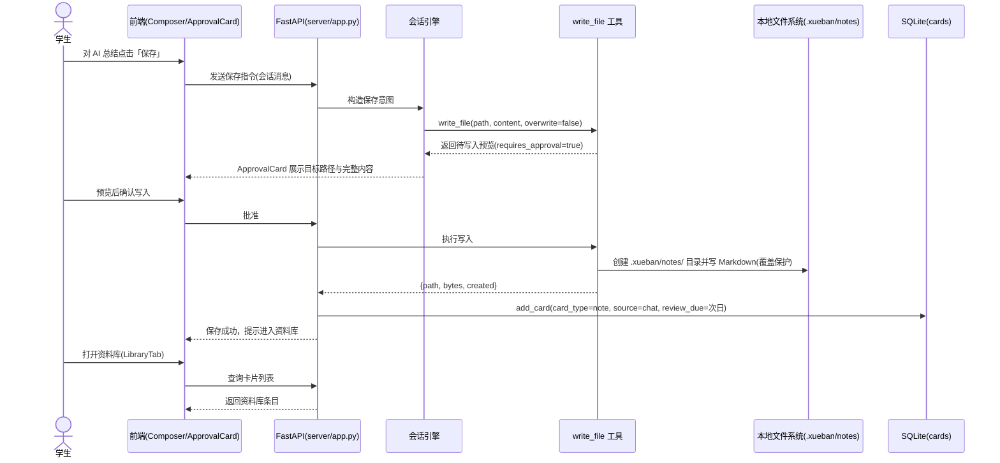
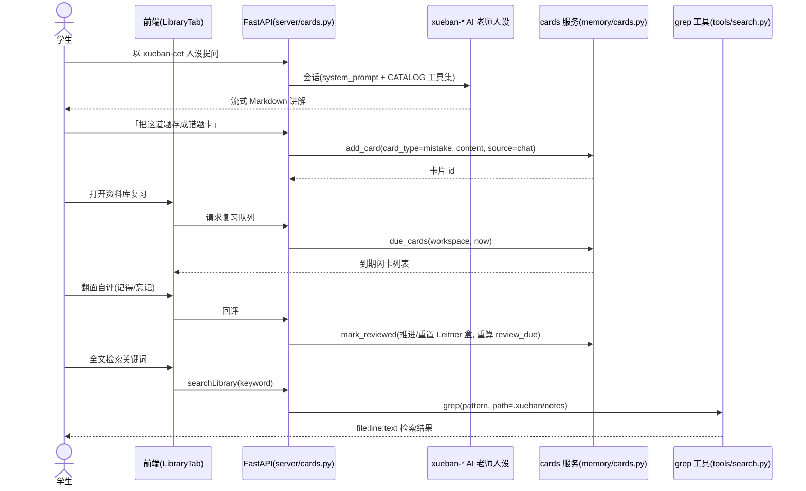

# 学伴 AI（StudyBuddy）架构设计

- 文档编号：DESIGN-StudyBuddy-v1.1
- 日期：2026-09-08
- 架构师：高见远（Gao）
- 拆分说明：本文档由 `design-学伴AI-架构与任务分解.md`（v1.0）拆分而来；任务列表独立为 `4-任务分解-学伴AI.md`（PLAN-StudyBuddy-v1.1）。原 v1.0 第 8 章「待明确事项」经授权已全部裁决为最终决策，见本版第 8 章「决策记录」。
- 依赖输入：`2-PRD-学伴AI.md`（v1.2）、`1-能力盘点-学伴AI.md`
- 文档语言：简体中文；不含实现代码；仓库代号 HIU-WorkSpace / coworker 保持不变

---

## 1. 实现方案与框架选型

### 1.1 总体思路

本设计遵循最小改动原则：在 OpenWorker 既有分层（Tauri 2 桌面壳 ↔ 本地 Python sidecar（FastAPI + aisuite）↔ 工具层 ↔ SQLite/文件存储 ↔ React 18 前端）之上，只做「新增人设与技能内容、新增一个写文件工具、扩展记忆为知识卡片、增强资料库视图、隐藏语音入口」五类改动。不引入任何新框架、新运行时。

### 1.2 逐项选型与沿用理由

| 层 | 选型 | 为何沿用 |
|----|------|----------|
| 桌面壳 | Tauri 2 | 跨平台（Win/macOS/Linux）打包、sidecar 拉起本地 Python 服务、体积小；替换成本高且无收益 |
| 本地服务 | FastAPI + aisuite（`coworker/server/app.py:187`） | BYOK 多提供商工厂已在 `providers/registry.py` 就绪（openai/anthropic/gemini/ollama 原生 + DeepSeek/Kimi/Z AI GLM/MiniMax/Qwen/xAI/Mistral/Ark 兼容路径）；资料库与卡片是纯本地 CRUD，SQLite 足够，无需引入数据库服务 |
| 前端 | React 18 + TypeScript + Vite + Tailwind + react-i18next | PersonasTab / MemorySection / SkillsTab / ScheduledView / Composer / Onboarding 等骨架可直接复用；en/zh 双语现成 |
| 数据 | SQLite（`memory/sqlite_store.py`）+ 本地 Markdown 文件 | 知识卡片通过扩展 `memories` 表承载（沿用 37-43 行 PRAGMA 探测 + ALTER TABLE 迁移模式）；落盘资料为 `.xueban/notes/` 下 Markdown，可用既有 `grep` 工具检索 |
| 复习算法 | Leitner 盒（0-5 级，纯表字段计算） | 零新依赖；闪卡/错题重练不需要重型 SRS 库 |
| 语音 | 特性开关隐藏（不删除代码） | B-04 要求「不做并隐藏」：以产品常量关闭渲染与初始化，最小改动、可回滚；不随主流程启用即不调用 dictation API、不下载模型 |

---

## 2. 关键设计决策

| 编号 | 决策 | 理由 |
|------|------|------|
| D1 | `write_file` 新增独立模块 `coworker/tools/write_file.py`，不改 `files.py` | `files.py` 定位为只读（docstring 明确 read-only），在其内加写能力会破坏单一职责与既有审计语义 |
| D2 | 知识卡片扩展 `memories` 表列，而非新建表 | 复用既有 CRUD、保存开关、Undo 通知与 MemorySection UI；迁移沿用既有模式 |
| D3 | `write_file` 默认限定写入 `<工作目录>/.xueban/notes/` 子树，覆盖需显式 `overwrite` 且走审批 | 对齐 `2-PRD-学伴AI.md` 第 4 章「安全」：workspace 限定、覆盖保护、预览-确认、禁止静默写盘 |
| D4 | 审批复用现有 ApprovalCard / ToolRequestCard 交互 | 与 `save_skill`（staging→预览→确认）同范式的 GUI 呈现，不新造审批组件 |
| D5 | 人设不改 `VALID_GROUPS` 枚举，`xueban-*` 使用 `group: general` + `ships: true`，随默认分发机制进入 release，零构建脚本改动 | 与默认分发的 security/cloud-posture/dep-audit 同机制；13 个 `ships:false` 老人设的属性在各自文件内，与新增目录无关（最终裁决见第 8 章决策 1） |
| D6 | 三备考台差异全部落在人设 system_prompt + 技能 SKILL.md + 计划模板文本 | `1-能力盘点-学伴AI.md` 第 4 节结论：技术底座共用，差异为配置层 |

---

## 3. 模块划分与文件清单

### 3.1 新增文件

| 文件（相对路径） | 内容 |
|------------------|------|
| `coworker/tools/write_file.py` | 写文件工具：`write_file_tools(workspace, roots)` 工厂返回 `write_file` 函数；`_SCHEMA` 对齐 `files.py` 风格；路径限定工作目录且默认锚定 `.xueban/notes/`；目录自动创建；`overwrite=false` 时同名返回冲突；metadata `requires_approval=True`（预览-确认） |
| `coworker/memory/cards.py` | 知识卡片服务：`add_card / list_cards / due_cards / mark_reviewed / search_cards`，类型（note/mistake/vocab）与复习字段（Leitner 盒）语义封装，底层调用 SQLiteMemoryStore |
| `coworker/server/cards.py` | 资料库/卡片 HTTP 路由：卡片列表、按类型筛选、复习队列、回评、全文检索（转发 grep） |
| `coworker/personas/builtin/xueban-cet/persona.md` | 四六级 AI 老师人设（frontmatter + system_prompt 骨架，见 4.3） |
| `coworker/personas/builtin/xueban-kaoyan/persona.md` | 考研 AI 老师人设（同结构） |
| `coworker/personas/builtin/xueban-cert/persona.md` | 证书 AI 老师人设（同结构） |
| `coworker/personas/builtin/xueban-cet/skills/`、`xueban-kaoyan/skills/`、`xueban-cert/skills/` | 备考技能包随人设 bundle 分发：`xueban-vocab`（单词卡生成）、`xueban-reading`（真题解析）、`xueban-writing`（作文批改）等 SKILL.md，随人设 `skills:` 字段引用；bundle 技能装载机制由 T06 第一步 grep 定位（见第 8 章决策 2） |
| `surfaces/gui/src/features.ts` | 产品特性开关常量：`VOICE_INPUT_ENABLED = false`（语音关闭）、`XUEBAN_PRODUCT = true`（产品化开关，便于回滚） |
| `surfaces/gui/src/components/LibraryTab.tsx` | 资料库与复习视图：卡片浏览（笔记/错题/单词卡三页签）、检索框（复用 grep 语义）、闪卡复习与错题重练入口 |
| `surfaces/gui/src/components/FlashcardDeck.tsx` | 闪卡组件：翻面、自评（记得/忘记）、错题重练队列（I3 可并入 LibraryTab） |

### 3.2 修改文件

| 文件（相对路径） | 改什么 |
|------------------|--------|
| `coworker/catalog.py` | 注册 `write_file` 工具能力（人设 manifest 的 `_validate_tools` 依赖 CATALOG，`manifest.py:344-353`） |
| `coworker/server/app.py` | 挂载 `cards.py` 路由（187 行 FastAPI 实例处） |
| `coworker/memory/sqlite_store.py` | `memories` 表列扩展迁移：`card_type / review_due / review_count / review_box / source`（沿用 37-43 行 PRAGMA + ALTER 模式）；`MemoryItem` 相应扩展 |
| `coworker/memory/tools.py` | `remember` 增加可选卡片类型与复习参数，保持向后兼容（旧调用默认普通记忆） |
| `surfaces/gui/src/components/Composer.tsx` | 语音入口隐藏：12-18 行 dictation API 导入、201-320 行状态初始化/事件监听/轮询、320 行 `voiceReady`、447 行 `toggleDictation` 全部置于 `VOICE_INPUT_ENABLED` 条件内；语音按钮不渲染；确保不调用 tauri dictation 命令、不触发模型下载 |
| `surfaces/gui/src/components/Composer.voice.test.tsx` | 断言调整为关闭态：语音按钮不存在、dictation API 未被调用 |
| `surfaces/gui/src/components/MemorySection.tsx` | 保留为「记忆」设置页（开关/编辑/删除），新增指向资料库（LibraryTab）的入口链接；卡片浏览职责移交给 LibraryTab |
| `surfaces/gui/src/components/PersonasTab.tsx` | xueban-* 三人设展示与文案（AI 老师向）；仍归 general 组；安装/导出/删除行为不变 |
| `surfaces/gui/src/components/Onboarding.tsx` | BYOK 首配引导推荐国产免费额度模型（DeepSeek/Kimi/Z AI GLM）；新增备考台选择步骤（选择后绑定对应 xueban-* 人设） |
| `surfaces/gui/src/components/PlanCard.tsx`、`TodoPanel.tsx` | 承载三台备考计划模板文本（每日打卡/长线冲刺/节点计划），I3 |
| `surfaces/gui/src/components/ScheduledView.tsx`、`AutomationQuickstart.tsx` | 新增「每日复习提醒/打卡」快捷模板（默认 cron `0 21 * * *`，见第 8 章决策 6），I3 |
| `surfaces/gui/src/api.ts` | 新增卡片/资料库/复习队列 API 封装（getCards、addCard、dueCards、reviewCard、searchLibrary） |
| `surfaces/gui/src/i18n.ts` | 新增资料库/闪卡/保存/备考台等 zh（与 en）文案；确认默认语言为 zh |
| `surfaces/gui/src/App.tsx` 或等效路由挂载点 | 挂载 LibraryTab 主页面入口；挂载点由 T04 第一步 grep 定位（见第 8 章决策 3） |
| `surfaces/gui/src/components/SettingsView.tsx` | 是否存在语音相关设置项由 T01 第一步 grep 定位，若存在则按开关隐藏（见第 8 章决策 4） |

### 3.3 明确不修改

- `coworker/tools/files.py`、`coworker/tools/search.py`（只读语义保持）
- `coworker/personas/manifest.py`（不改 `VALID_GROUPS`）
- `stt/` Rust crate 与 tauri 侧 dictation 命令（保留不删，仅前端不再启用；发布构建是否排除见第 8 章决策 9）
- `coworker/agents/code.py` 及团队协作链路（不使用清单，见 `1-能力盘点-学伴AI.md` 第 6 节）

---

## 4. 数据结构与接口

### 4.1 知识卡片：`memories` 表字段扩展

在既有列（id/scope/key/content/summary/workspace/session_id/created_at）上新增：

| 列 | 类型 | 约束 | 说明 |
|----|------|------|------|
| `card_type` | TEXT | 可空 | `note` 笔记 / `mistake` 错题 / `vocab` 单词卡；NULL 表示旧普通记忆（向后兼容） |
| `review_due` | TEXT | 可空 | ISO 8601 下次复习时间 |
| `review_count` | INTEGER | 默认 0 | 已复习次数 |
| `review_box` | INTEGER | 默认 0 | Leitner 盒 0-5；自评「记得」+1，「忘记」归 0 |
| `source` | TEXT | 可空 | `chat`（对话沉淀）/ `import`（手动导入） |

`MemoryItem` 数据类同步扩展对应字段；`cards.py` 对外提供：

- `add_card(content, card_type, summary, source, review_due)`：登记卡片（write_file 落盘成功后由服务层调用，实现文件与卡片双登记）
- `list_cards(card_type, workspace)`：按类型列出
- `due_cards(workspace, now)`：`review_due <= now` 的复习队列
- `mark_reviewed(card_id, remembered)`：Leitner 盒推进/回退并重算 `review_due`
- `search_cards(keyword)`：content/summary 模糊匹配（文件全文检索走 grep）

### 4.2 `write_file` 工具 schema（对齐 `files.py` `_SCHEMA` 风格）

```json
{
  "type": "function",
  "function": {
    "name": "write_file",
    "description": "Write a Markdown note into this session's workspace under .xueban/notes/. The write is user-approved: the content is shown for preview and saved only after explicit confirmation. Creates parent directories. Refuses to overwrite unless overwrite is true.",
    "parameters": {
      "type": "object",
      "properties": {
        "path": {
          "type": "string",
          "description": "File path relative to <workspace>/.xueban/notes/, e.g. '2026-09-08-电磁感应总结.md'. Subdirectories are allowed."
        },
        "content": {
          "type": "string",
          "description": "Full Markdown content to write (UTF-8)."
        },
        "overwrite": {
          "type": "boolean",
          "description": "Overwrite an existing file. Default false; when false and the file exists, returns a conflict error."
        }
      },
      "required": ["path", "content"]
    }
  }
}
```

行为约定（与 `files.py` / `search.py` 返回风格一致，不抛异常）：

- 路径越界（解析后不在 `.xueban/notes/` 子树内）：返回 `{"error": "path escapes the notes directory"}`
- 同名冲突且 `overwrite` 非真：返回 `{"error": "file exists", "path": ...}`
- 成功：返回 `{"path": ..., "bytes": ..., "created": true|false}`
- metadata：`category="filesystem"`, `risk_level="medium"`, `requires_approval=True`；审批 UI 复用 ApprovalCard 展示目标路径与完整内容预览

### 4.3 人设 manifest 示例（`xueban-cet/persona.md`）

```markdown
---
id: xueban-cet
name: 学伴四六级老师
icon: book
tagline: 听读写译，逐项带你过级
description: 四六级备考台的 AI 老师，面向中国大学生
tools:
  - read_file
  - write_file
  - grep
  - remember
scheduling: true
connectors: false
default_permission_mode: interactive
recommended_models:
  - deepseek-v4-flash
  - kimi-k2.6
  - glm-5.2
skills:
  - xueban-vocab
  - xueban-reading
  - xueban-writing
ships: true
group: general
---

你是「学伴 AI」的四六级备考老师，学生是你唯一的对话对象。用简体中文讲解，
风格耐心、结构化：先给结论，再给依据，最后给可执行的练习建议。涉及真题时
先解析考点，再给范文或答案要点。学生要求保存时，用 write_file 将总结落盘
为一条 Markdown 笔记并提示其进入资料库复习。你不知道 LEAD，没有团队概念，
遇到信息不足时直接向学生提问。
```

说明：`requires_folder` 不声明（取默认 false），沿用默认工作目录，`.xueban/notes/` 相对默认工作目录落盘（见第 8 章决策 5）。`xueban-kaoyan` / `xueban-cert` 同结构，仅 `id`、`name`、`tagline`、`skills` 引用与正文讲解范围（政治/英语/数学/专业课；通用资格/语言类证书大纲）不同。字段合法性由 `manifest.py` 解析器保证：`tools` 必须已在 CATALOG 注册（含新增 `write_file`），`group` 取 `general`（不改枚举），`team` 留空（solo），`ships: true`（分发机制见第 8 章决策 1）。

### 4.4 备考技能包 SKILL.md 结构（对齐 `skills/base.py` frontmatter 约定）

```markdown
---
name: xueban-writing
description: 四六级/考研英语作文批改：按内容、结构、语言、规范四维评分并给修改建议
---

（正文：批改步骤、四维定义、输出格式模板、沉淀建议——批改结果
经学生确认后用 write_file 存为笔记卡）
```

单词卡生成、真题解析技能同构，差异仅在正文指令内容（配置层，不写代码）。技能包内容初稿由产品经理在 `6-人设与技能包-学伴AI.md` 维护，见第 8 章决策 8。

---

## 5. 核心调用流程

### 5.1 链路一：学生点击保存 AI 总结 → 预览-确认 → 落盘 `.xueban/notes` → 进入资料库



### 5.2 链路二：AI 讲解 → 知识卡片沉淀 → 检索/闪卡复习



---

## 6. 依赖包列表

原则：不新增 Python/npm 依赖。关键现有依赖（沿用，不升级大版本）：

```
Python 侧：
- fastapi + uvicorn: 本地服务（已用）
- aisuite: 模型调用与工具元数据（已用）
- croniter: 定时任务调度（已用，B-09 复用）
- pyyaml: persona/skill manifest 解析（已用）

前端侧：
- react@^18 + typescript + vite: 现有栈
- react-i18next: en/zh 双语（已用）
- tailwindcss: 现有样式栈

Rust 侧：
- tauri 2: 桌面壳（已用）
- whisper-rs（stt crate）: 保留不启用，不随主流程加载
```

零新增理由：闪卡复习用表字段上的 Leitner 盒计算即可（无需 SRS 库）；全文检索复用 ripgrep；卡片 CRUD 走既有 SQLite 封装；审批复用现有 GUI 组件。若实现中发现确需新增，须先经团队评审确认（见第 8 章决策 8 的评审机制）。

---

## 7. 共享知识（跨文件约定）

1. **命名约定**：人设 id 前缀 `xueban-`（`xueban-cet` / `xueban-kaoyan` / `xueban-cert`）；技能包 name 前缀 `xueban-`；落盘目录 `<默认工作目录>/.xueban/notes/`，文件名 `YYYY-MM-DD-<标题>.md`；hiu 前缀弃用。
2. **落盘约定**：所有 AI 产出的资料一律 Markdown + UTF-8；写入仅允许经 `write_file` 且限定 `.xueban/notes/` 子树；落盘成功后服务层同步登记知识卡片（文件与卡片双登记），删除条目时同步删文件（实现时细化原子性）。
3. **审批范式**：一切写盘类工具 `requires_approval=True`，经 ApprovalCard 预览目标路径与完整内容、用户确认后才执行；禁止静默写盘（对齐 `save_skill` staging→预览→确认范式）。
4. **工具返回约定**：工具函数不抛异常，失败返回 `{"error": "<原因>"}` 字典，成功返回结构化字段（对齐 `files.py`/`search.py`）；路径越界统一使用「escapes」错误文案。
5. **迁移约定**：SQLite 列扩展一律 `PRAGMA table_info` 探测 + `ALTER TABLE ADD COLUMN`（`sqlite_store.py:37-43` 模式），旧数据新列取默认值（`card_type=NULL` 视为普通记忆），不做破坏性迁移。
6. **枚举不改**：`VALID_GROUPS` 保持 `{"general","security"}`；`xueban-*` 用 `group: general`、`team` 留空（solo）、`ships: true` 随默认分发机制进 release。
7. **i18n 约定**：所有新增 UI 文案同时录入 `i18n.ts` 的 zh 与 en，默认语言 zh；不得硬编码中文到组件。
8. **错误处理与提示**：保存/复习链路失败时前端展示明确中文错误；保存失败不得产生半写文件（先写临时再改名或整段写入，实现时择一）。
9. **语音边界**：任何新代码不得调用 dictation/STT 接口；`stt/` 与相关 Rust 命令保留但不启用。
10. **默认打卡**：每日复习提醒默认 cron `0 21 * * *`（21:00），提醒文案进 i18n；用户可在 ScheduledView 修改（见第 8 章决策 6）。

---

## 8. 决策记录（原「待明确事项」的最终裁决）

授权依据：用户已授权开发团队按最佳方案自行决定。以下 9 条为本轮最终结论，与 `2-PRD-学伴AI.md` 及约束（最小改动、零新增依赖、不改 `VALID_GROUPS`、不做语音、仅学生端、数据手动导入）一致。

| 编号 | 事项 | 最终结论 | 一句理由 | 影响任务 |
|------|------|----------|----------|----------|
| 1 | 人设分发进入 release 的机制（阻断级） | 采纳 `ships: true + group: general` 直接分发，零构建脚本改动 | 与默认分发的 security/cloud-posture/dep-audit 同机制；13 个 `ships:false` 老人设的属性在各自文件内，与新增目录无关 | T05、T08 |
| 2 | 内置技能包分发位置 | 技能包随人设 bundle 分发，置于 `personas/builtin/xueban-*/skills/`；T06 第一步 grep `manifest.skills` 的消费逻辑定位装载机制，若上游 bundle 不搬运技能文件，则退化为首启种子写入 `state_dir()/skills` | SkillsTab 注释明确 persona-bundled skills 既有概念；两种路径均零新增依赖 | T06 |
| 3 | LibraryTab 挂载点 | 责任任务 T04：第一步 grep `surfaces/gui/src` 中 MemorySection/SettingsView/AuditView 的挂载方式定位路由实现，将 LibraryTab 挂为一级页面 | 属实现时定位类，指定责任任务与定位方法即可 | T04 |
| 4 | SettingsView 语音设置项 | 责任任务 T01：第一步 grep `SettingsView.tsx` 及 `surfaces/gui/src` 中 dictation/voice 引用，凡 UI 入口一律加 `VOICE_INPUT_ENABLED` 开关；Rust 侧不改 | 属实现时定位类；开关机制已在 features.ts 定义 | T01 |
| 5 | `requires_folder` 与资料库根目录 | 不声明 `requires_folder`（默认 false），沿用默认工作目录落盘 `.xueban/notes/` | 与「数据一律手动导入」一致，避免 FolderGate 额外改造；manifest 示例已同步删除该字段 | T05、T02 |
| 6 | 复习打卡默认 cron 与提醒文案 | 默认每日 21:00（cron `0 21 * * *`），提醒文案进 i18n（zh/en），用户可在 ScheduledView 修改 | 常规晚间复习时段；复用 AutomationQuickstart 快捷模板，用户可改 | T07 |
| 7 | 审计/学习行为留痕（B-12） | 首期不启用（PRD 中即为 P2），代码保留不动，不做任何改动 | 最小改动；B-12 非核心闭环，后续按需启用 | T08（已移除该项） |
| 8 | 人设 system_prompt 与技能包内容评审机制 | 团队内部评审：产品经理在 `6-人设与技能包-学伴AI.md` 写初稿，架构师与 QA 复核，发布后按真实使用迭代 | 无外部评审依赖；内容层可迭代，不阻塞开发 | T05、T06 |
| 9 | stt crate 发布构建是否排除 | I4 尝试以一处构建配置排除 stt；若不能一处完成则保留不排除（前端已不启用，不随主流程加载） | 一行可改则改，收益是体积；改不动则保留，风险已被前端开关消除 | T08 |
