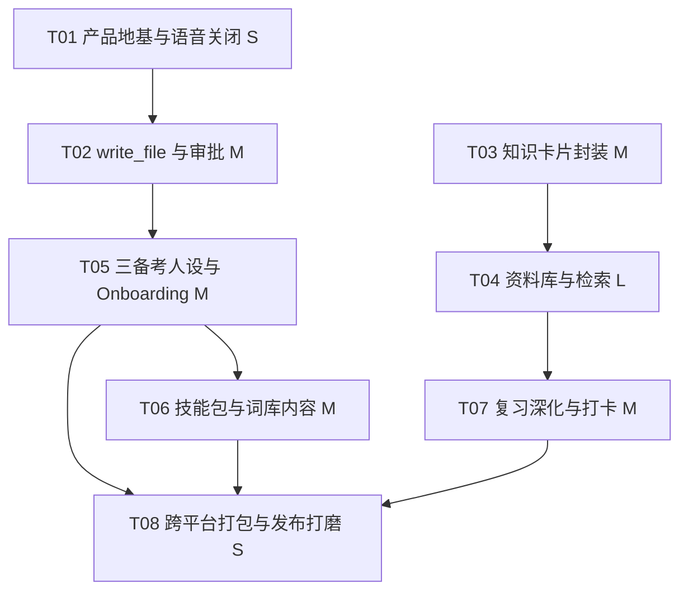

# 学伴 AI（StudyBuddy）任务分解

- 文档编号：PLAN-StudyBuddy-v1.1
- 日期：2026-09-08
- 规划：高见远（Gao）
- 拆分说明：本文档由 `design-学伴AI-架构与任务分解.md`（v1.0）第 5 章独立而成；设计依据与决策记录见 `3-架构设计-学伴AI.md`（DESIGN-StudyBuddy-v1.1，第 8 章）。
- 依赖输入：`2-PRD-学伴AI.md`（v1.2）、`3-架构设计-学伴AI.md`
- 文档语言：简体中文；禁止 git 操作，提交由交付总监负责

---

## 1. 任务列表（有序，含依赖）

规模：XS/S/M/L。任务映射 `2-PRD-学伴AI.md` 的 B-xx/C1-xx/C2-xx/C3-xx 编号与迭代 I1-I4。

| 任务 ID | 任务名 | 迭代 | PRD 映射 | 主要文件 | 依赖 | 规模 |
|---------|--------|------|----------|----------|------|------|
| T01 | 产品地基与语音关闭：features.ts 开关、Composer 语音入口隐藏、默认中文确认；第一步 grep 定位 SettingsView 语音项（决策 4） | I1 | B-02、B-04 | 新增 `surfaces/gui/src/features.ts`；修改 `Composer.tsx`、`Composer.voice.test.tsx`、`i18n.ts`、（如存在语音项）`SettingsView.tsx` | 无 | S |
| T02 | write_file 写文件工具与预览-确认审批：工具模块、CATALOG 注册、审批链路 | I1 | B-05 | 新增 `coworker/tools/write_file.py`；修改 `coworker/catalog.py`、审批呈现（复用 ApprovalCard/ToolRequestCard） | T01 | M |
| T03 | 知识卡片记忆封装：表列扩展迁移、cards 服务、HTTP 路由、api.ts | I1 | B-07 | 新增 `coworker/memory/cards.py`、`coworker/server/cards.py`；修改 `memory/sqlite_store.py`、`memory/tools.py`、`server/app.py`、`surfaces/gui/src/api.ts` | 无 | M |
| T04 | 资料库与复习视图骨架 + 资料导入与检索；第一步 grep 定位页面挂载点（决策 3） | I1 | B-06（一期）、B-13、B-14 | 新增 `LibraryTab.tsx`；修改 `MemorySection.tsx`（入口链接）、路由挂载点、`i18n.ts` | T03 | L |
| T05 | 三备考人设与 Onboarding：xueban-* 人设目录（不设 requires_folder，见决策 5）、BYOK 国产模型推荐、备考台选择 | I1 | B-11、B-01、C1-01/C2-01/C3-01（骨架） | 新增 `personas/builtin/xueban-{cet,kaoyan,cert}/persona.md`；修改 `Onboarding.tsx`、`PersonasTab.tsx` | T02（tools 引用 write_file 需先注册） | M |
| T06 | 备考技能包与词库内容：SKILL.md 内容随人设 bundle 分发（决策 2），第一步 grep 定位 bundle 技能装载机制；内容初稿见 `6-人设与技能包-学伴AI.md`（决策 8） | I2 | B-08、C1-02~04、C2-02~03、C3-02~03 | 新增 `personas/builtin/xueban-*/skills/` 各 SKILL.md；人设 `skills:` 引用微调 | T05 | M |
| T07 | 复习深化与计划打卡：闪卡/错题重练、计划模板、每日复习提醒（默认 cron `0 21 * * *`，见决策 6） | I3 | B-06（二期）、B-09、B-10、C1-05、C2-04、C3-04 | 新增 `FlashcardDeck.tsx`；修改 `LibraryTab.tsx`、`PlanCard.tsx`、`TodoPanel.tsx`、`ScheduledView.tsx`、`AutomationQuickstart.tsx`、`cards.py`（复习队列） | T04 | M |
| T08 | 跨平台打包与发布打磨：Tauri 打包配置与发布验证（人设经 `ships:true` 随默认机制分发，无需构建脚本改动，见决策 1；B-12 首期不启用，见决策 7；尝试以一处构建配置排除 stt，见决策 9） | I4 | R5 | Tauri 打包配置、（可行时）stt 排除配置 | T05、T06、T07 | S |

---

## 2. 任务依赖图

I1 由 T01-T05 构成；T03 与 T01/T02 可并行，T04/T05 汇合后进入 I2/I3。

---

## 3. 迭代映射说明

| 迭代 | 包含任务 | 目标 | 工作量 |
|------|----------|------|--------|
| I1 核心闭环打通 | T01、T02、T03、T04、T05 | 语音关闭、write_file 落盘、知识卡片、资料库骨架与检索、三个人设骨架 | L |
| I2 人设与技能内容 | T06 | 三台技能包与词库内容（配置层） | M |
| I3 复习体验深化 | T07 | 闪卡/错题重练、计划与打卡 | M |
| I4 打磨与分发 | T08 | 跨平台打包、发布验证 | S |

与 `2-PRD-学伴AI.md` 第 7 章的对应：I1 = B-01/B-02/B-03/B-04/B-05/B-06/B-07/B-11/B-13；I2 = C1/C2/C3 技能与词库；I3 = B-09/B-10 与复习深化；I4 = 打包与发布（原 R2 经决策 1 消除、B-12 经决策 7 首期不启用）。

---

## 4. I1 准出条件

以 `5-测试计划-学伴AI.md` 中 I1 冒烟用例为准，最低须满足：

1. B-04：界面上无任何语音入口，Composer 语音按钮不渲染，dictation API 未被调用。
2. B-05：对 AI 总结触发「保存」，经预览-确认后落盘 `.xueban/notes/`，目录自动创建、同名覆盖有保护。
3. B-06/B-07：资料库可按类型浏览卡片，卡片含类型与复习字段，检索可用。
4. B-11：三个 xueban-* 人设在 PersonasTab 可选并生效，`VALID_GROUPS` 枚举未改动。
5. B-13/B-14：手动导入资料可被只读读取并进入 grep 检索范围。

I1 通过后进入 I2；I2/I3 准出条件由 QA 在 `5-测试计划-学伴AI.md` 中按对应验收条款细化。
