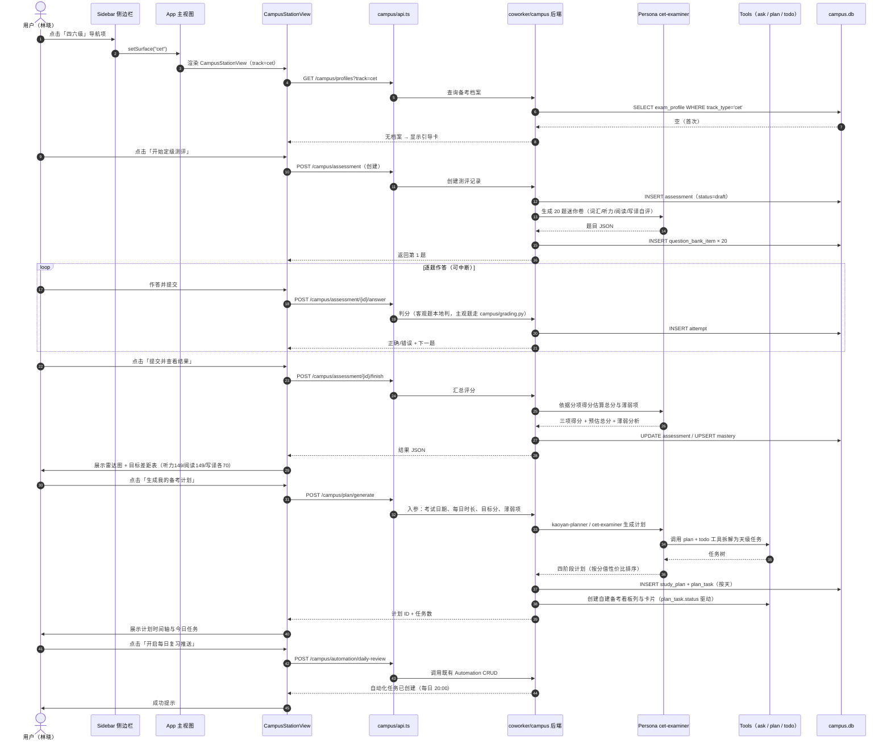
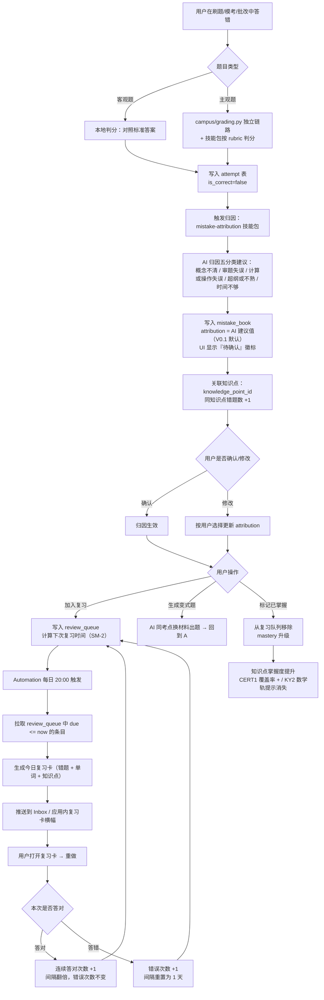
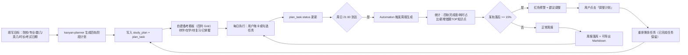
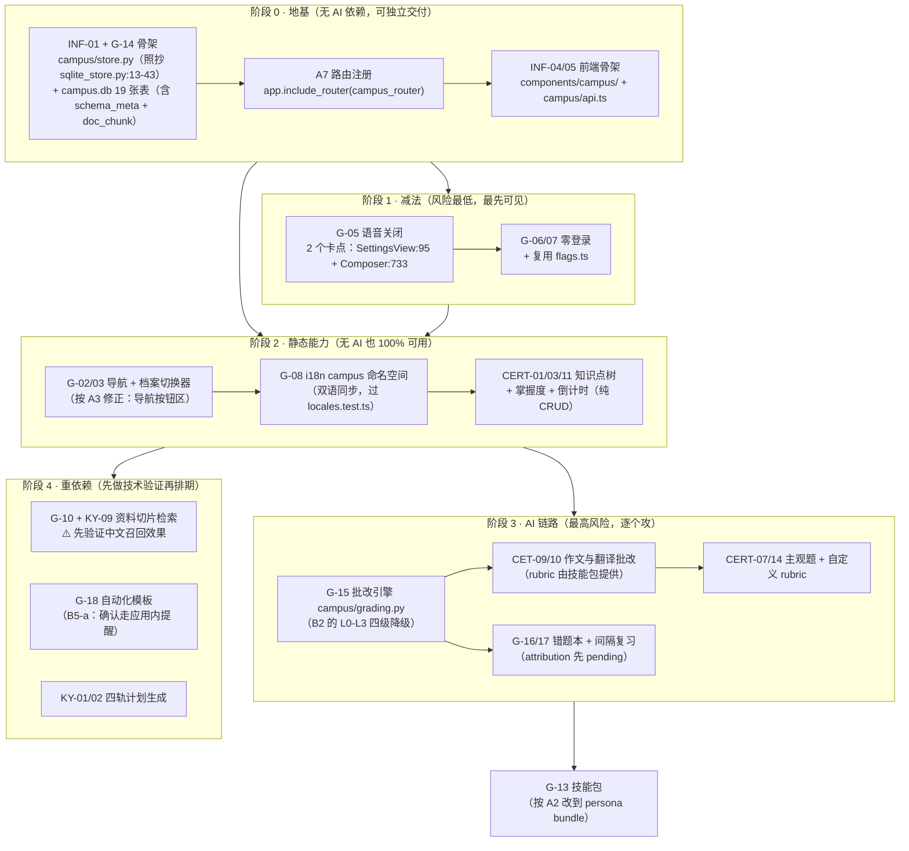

# 学业工友（CampusWorker）— 产品需求文档

> 基于开源项目 **OpenWorker（项目代号 coworker）** 的二次开发 PRD
> 定位：把一台"给工程师用的多智能体工作台"，**新增**出一条"给大学生用的备考工作台"。

---

## 0. 文档信息

| 项 | 内容 |
|---|---|
| 文档名称 | 学业工友 CampusWorker 产品需求文档（PRD） |
| 版本 | **v1.3（微修订：五档评分 / tools 白名单 / dev 指针，待开发排期）** |
| 日期 | 2026-09-08 |
| 作者 | 许清楚（产品经理） |
| 技术评审 | 高见远（架构师）—— 评审意见保留在 §13，未删改 |
| 状态 | 已完成技术可行性评审（**Conditional GO**）→ 已按评审修订 → 待开发排期 |
| 基线代码 | `D:\DeskTop\HIU-WorkSpace`（OpenWorker / coworker，Tauri 2 桌面应用） |
| 相关文档 | `docs/config.example.toml`、`docs/AUTOMATION-SCHEDULING.md`（项目内已有） |
| 变更原则 | **只做加法**：新增目录 / 新增表 / 新增文件 / 新增配置项；不删除、不重构既有模块 |

### 0.0 变更摘要

> **v1.1 主线**：把 §13 架构师评审中"与代码事实不符"的部分全部吸收进正文，共修订 12 类 A/B 项 + 3 项产品决策。
> **v1.2 主线**：统一 KY-03 看板口径为自建（消除 v1.1 遗留的双向同步表述），与开发文档 01-系统架构设计 ADR-11 对齐。
> **v1.3 主线**：配合 dev/05-人设与技能包设计.md（`1dd08bd`）的事实性修正 —— 作文评分改官方五档、manifest `tools` 白名单约束、§6.3 增补 dev/02 实现指针。

#### v1.3 修订（2026-09-08，微修订）

| # | 修订内容 | 章节 |
|---|---|---|
| 1 | 作文评分档位更正：**"四档"全部改为"官方五档（14/11/8/5/2 分档）"**，与四六级官方评分档位及 dev/05 §4 的 rubric 对齐。涉及 3 处：§3.1-2 `cet-essay-grading` 描述、§6.3 `attempt.grading_json` 示例的 rubric 字段值、§10.1 T5 缓解措施 | §3.1、§6.3、§10.1 |
| 2 | §3.1-6 工具集更正：**`ask` / `plan` / `subagent` 是引擎层运行时工具，不在 manifest `tools` 白名单（catalog 仅 6 个合法值）内**；写进 manifest 会抛 `ManifestError` 打断注册表加载（= 启动失败）。改为两类表述：白名单内组合（如 `[files, search, todo]`）进 manifest；`plan`/`ask`/`subagent` 由引擎运行时提供、无需声明。§3.1.1 规范表 `tools` 行同步收紧 | §3.1、§3.1.1 |
| 3 | §6.3 末尾补实现指针：「实现级字段细化（`degrade_level`、`attribution` 默认 `pending`、`fail_reason` 等 7 项）见 `docs/dev/02-数据库设计.md` §8，以该文档为准」 | §6.3 |
| 4 | 版本号 v1.2 → **v1.3**；§13.8 补 v1.3 小节 | §0、§13.8 |

#### v1.2 修订（2026-09-08）

| 修订内容 | 涉及章节 |
|---|---|
| 统一 KY-03 口径为「**自建备考看板**（前端四列 Grid + `plan_task.status`），不依赖 Teams board 双向同步；`board_card_id` 保留但 V0.x 不写值，V0.2 评估只读同步；**仍复用** Teams journal 记录学习日志」。同步修正正文 6 处残留表述：§4.4 KY1（"写入 Teams 看板"→ 自建看板）、§4.8 KY-03 行、§5.1 流程图、§5.3 流程图、§6.1 存储决策表、§4.6 差异对照表（"Teams（看板）"→"Teams（journal）"）；§11.1 增补决策 D5 | §0、§4.4、§4.6、§4.8、§5.1、§5.3、§6.1、§11.1 |

#### v1.1 修订（相对 v1.0 Draft）

| 类别 | 修订内容 | 涉及章节 |
|---|---|---|
| **A 类 技术事实纠错** | ① Reviewer 不是批改器 → 新建独立 `campus/grading.py`；② 技能包改投人设 bundle；③ 导航改到 `Sidebar.tsx:1033-1067` 按钮区；④ 配置改走 `flags.ts` + `campus/config.py`；⑤ 人设 manifest 三条硬约束（`ships`/`group`/`team`）；⑥ 模型自检改为静态推荐清单 + `response_format` 试错；⑦ 补后端路由注册 `include_router`；⑧ Compaction 改为按页切片 + 目录路由检索；⑨ PDF 扫描件判空标 failed | §3.1、§3.2、§3.3、§4.3–4.5、§6、§7.1、§10 |
| **B 类 验收与范围** | ① CET-09 一致性只在推荐模型上承诺；② KY-09 改为切片检索验收；③ KY-03 看板降级为自建只读列表；④ `campus.db` 17 → **19** 张（+`schema_meta` +`doc_chunk`）；⑤ G-05 语音关闭收敛到 **2 个卡点**，明确禁止改 24 个命中文件 | §3.3.1、§4.3–4.5、§6.2、§8 |
| **产品决策** | ① **V0.1 三个备考台同时上线**（用户已拍板不分期），改为在 V0.1 内部做优先级分层；② **新增 V0.0 技术验证里程碑（1 周）**；③ **CERT-13 采用"应用内提醒"**，不加 Tauri 通知插件，守住只做加法 | §8.1、§8.2、§11.1 |
| **需求池** | 复杂度上调 6 条，新增 5 条（路由注册 / schema 版本 / 模型推荐清单 / 置信度定义 / 切片检索），改验收 5 条。总数 66 → **71 条** | §4.8 |

### 0.1 本文档的阅读对象

- **架构师**：重点看 §3（技术支撑点映射）、§6（数据结构）、§4.8（需求池）、§4.9（不做的事）、§10（风险）
- **前端工程师**：重点看 §3.2（前端扩展点）、§4.2–§4.5（页面级需求）、§5（流程）
- **后端工程师**：重点看 §3.1（能力复用）、§6（新增表结构）、§4.8 中 INF 前缀需求
- **用户 / 主理人**：重点看 §1（定位）、§2（调研与痛点）、§8（路线图）、§11（待拍板问题）

### 0.2 全篇标记约定

本文档每条改动型需求都会带上标记：

| 标记 | 含义 |
|---|---|
| 【新增】 | 新建文件 / 新建目录 / 新建表 / 新建配置项 / 新增 i18n key。不触碰既有代码逻辑 |
| 【隐藏/关闭】 | 通过 Feature Flag 关闭入口与可见性，**保留代码文件与函数**，仅短路渲染与路由 |
| 【新增·单行插入】 | 在既有文件中**插入一行**（v1.1 全篇仅 1 处：`server/app.py` 的 `app.include_router`）。纯插入、不改任何既有行、不改变既有行为 |
| 【复用】 | 完全不改代码，直接调用既有能力 |

> **本文档不包含任何【修改】级需求。** 若评审发现必须修改既有文件，需回到 §11 走变更申请，由主理人决定是否突破"只做加法"约束。
>
> **v1.1 特别约束（架构师评审后收紧，工程师必须遵守）：**
> 1. **【隐藏/关闭】只允许"短路"，不允许"删除"**。语音关键词命中 24 个文件，但**实际只需 2 个卡点**（§3.3.1）—— **禁止**去改其余 22 个文件。
> 2. **`coworker/reviewer.py` 是权限链路的一部分，禁止任何改动**（§3.1-7）。批改走新建的 `campus/grading.py`。
> 3. 数据层**禁止 `ALTER` 既有表、禁止写入 `coworker.db`**（§6.1）。
> 4. 新增后端接口**必须在 `server/app.py` 的 `create_app()` 内插入一行 `include_router`**（§3.2 R7），否则接口不可达。

---

## 1. 项目背景与重构定位

### 1.1 原项目 OpenWorker 是什么

OpenWorker 是一个 **Tauri 2 本地优先（local-first）桌面应用**：Python FastAPI 后端 + React 18 / TypeScript / Vite 5 / Tailwind CSS 3 前端，内置 i18next 中英双语与 Vitest 测试。它的核心是"**多智能体协作工作台**"：

- 用 **Persona（人设）** 定义不同角色的 AI 同事（`coworker/personas/builtin/` 下 17 个内置人设，每个是 `manifest.md` + `skills/`）；
- 用 **Skills（技能包）** 把可复用的工作方法固化为能力；
- 用 **Teams 看板 + Journal** 管理任务与过程记录；
- 用 **Automation（croniter 调度）** 做定时/周期任务；
- 用 **Memory（SQLite）** 做长期记忆；
- 通过 **Providers 路由** 对接 OpenAI / Anthropic / Gemini / Bedrock / Vertex / Codex / **Ollama**；
- 通过 **Tools**（files / search / shell / git / todo / plan / ask / subagent）操作本地与网络；
- 有 Reviewer、PDF 解析、Compaction（长上下文压缩）、权限引擎与审计日志。

一句话：**它是一个"能带团队干活、能定时干活、能记住事、能本地跑"的 Agent 运行时。**

### 1.2 为什么它适合被改造成学习应用

| 学习的本质需求 | OpenWorker 已有的对应能力 | 结论 |
|---|---|---|
| 需要"老师 / 助教 / 阅卷人"等不同角色 | Persona 人设系统（17 个内置，目录式新增） | **零侵入映射** |
| 需要"作文批改 / 真题精讲 / 错题归因"等固定方法 | Skills 技能包系统 | **零侵入封装** |
| 需要"每天背单词 / 间隔复习 / 考前冲刺" | Automation + croniter 完整 CRUD 与调度 | **直接承载** |
| 需要"记住我的薄弱点、错题、进度" | Memory（SQLite 持久化） | **直接承载** |
| 需要"离线 / 不花钱 / 数据不外传" | Ollama 本地模型 + local-first 架构 | **核心竞争力** |
| 需要"导入课件 / 真题 PDF / 笔记" | PDF 支持 + attachments + files 工具 | **直接可用** |
| 需要"长周期答疑一整本专业课教材" | Compaction 长上下文压缩 | **直接可用** |
| 需要"备考任务看板 / 学习日志" | Teams board + journal | **直接映射** |

**结论：这不是"从零做一个学习 App"，而是"给一个已经成熟的 Agent 运行时，加一层学习场景的 UI + 数据 + 技能包 + 人设"。** 绝大部分底层能力不需要写第二遍。

### 1.3 新产品定位

> **一句话定位：**
> **学业工友 = 装在电脑里的本地备考作战室 —— 不登录、不联网也能用、数据只存在自己硬盘上的四六级 / 考研 / 证书 AI 备考台。**

三条差异化支柱：

1. **本地优先（Local-first）**：默认数据不出本机；可完全离线（Ollama）运行；无账号、无云端同步、无学习行为被采集。
2. **Agent 驱动而非题库驱动**：不做"又一个题库 App"，而是让 AI 人设（考官 / 助教 / 阅卷老师）**基于用户自己导入的资料**做定级、规划、批改、归因。
3. **一台三用、各有打法**：四六级重"短周期高频冲刺"，考研重"长周期多科目异构管理"，证书重"知识点树 + 刷题 + 报名节点"。不是一套模板换三次皮。

**产品名建议（待用户拍板，见 §11 Q1）**：

| 候选 | 中文名 | 英文名 | 说明 |
|---|---|---|---|
| **A（推荐）** | 学业工友 | CampusWorker | 延续 Coworker 品牌语义，"工友"有陪伴感，易记 |
| B | 备考台 | PrepDesk | 直白，功能导向 |
| C | 学霸工坊 | StudyForge | 更年轻化，但与工程品牌断裂 |

### 1.4 目标用户分层

| 分层 | 典型人群 | 占比估计 | 核心诉求 | 备考周期 | 付费意愿 |
|---|---|---|---|---|---|
| **L1 四六级党** | 大一 / 大二本科生（部分大三补考） | 最广 | 425 分过线 / 刷 500+、听力救命、作文模板 | 4–12 周，考前一波流 | 低（倾向免费/自带 Key） |
| **L2 考研党** | 大三下 – 大四（含二战 / 三战往届生） | 中 | 长线规划、三/四科异构推进、专业课自命题资料处理、进度不失控 | 6–18 个月 | 中高（愿为规划与批改付费） |
| **L3 证书党** | 全学段（大二–大四 + 研究生） | 广而散 | 考纲知识点覆盖、刷题与错题归因、别错过报名/缴费/准考证节点 | 2–6 个月 / 每证 | 中（证书刚性强） |

> 关键洞察：**同一用户在不同学期会横跨多个分层**（大二考四级 → 大三考教资 → 大四考研）。因此产品必须支持**多备考档案并存**（见 §6.1 `exam_profile`），而不是"选一个考试然后锁死"。

### 1.5 重构前后对比表

| 维度 | 重构前：OpenWorker（coworker） | 重构后：学业工友（CampusWorker） |
|---|---|---|
| 产品性质 | 通用多智能体工程协作工作台 | 工程工作台（保留）+ 大学生备考工作台（新增） |
| 目标用户 | 开发者 / 工程团队 | + 大学生（四六级 / 考研 / 证书党） |
| 核心角色 | test-worker、swe-lead、design-worker 等工程人设 | 保留全部工程人设 + **新增** CET 考官、考研规划师、阅卷老师、证书教研员等学习人设 |
| 知识来源 | 代码仓库、文档、工作区文件 | + 真题 PDF、课件、笔记、考纲、用户自建题库 |
| 时间视角 | 当前任务 / 近期交付 | + 长周期备考（周 / 月 / 季度）与考试倒计时 |
| 调度用途 | 定时跑脚本、巡检 | + 每日复习推送、间隔重复、报名节点提醒 |
| 记忆用途 | 项目上下文 | + 错题本、薄弱知识点、学习档案 |
| 界面语言 | 英文为主 + 中文 | 中文优先，新增 `campus.*` i18n 命名空间，zh/en 同步 |
| 账号体系 | 有 Cloud 登录 / 连接器 OAuth | **无登录**；核心链路零账号；连接器降级为可选增强 |
| 语音输入 | 有（whisper-rs 离线 STT） | **关闭并隐藏**（代码保留，flag 关闭） |
| 数据边界 | 本地 + 可选云端连接器 | **默认 100% 本地**；联网仅用于模型调用与资料检索（可关） |
| 商业模式 | 开源项目 | 开源 / 自用，本文档不含付费设计（见 §4.9） |

### 1.6 核心铁律与"加法原则"的执行口径

**铁律**：不删除或大幅修改项目已有的任何功能模块，仅通过新增方式扩展功能。

**执行口径（三条判定规则）：**

1. **能放到新文件里的，一律放新文件。** 新页面 → `surfaces/gui/src/components/campus/*.tsx`；新后端逻辑 → `coworker/campus/*.py`；新人设 → `coworker/personas/builtin/<new-id>/`；新技能 → `coworker/skills/campus/*`；新数据 → 新库文件 `campus.db`。
2. **必须触碰既有文件时的最小侵入形式**：只在既有组件的**渲染入口 / 路由分支 / 列表常量**处加一层**条件短路**，不改任何既有函数的内部逻辑、不改既有数据结构、不改既有 API 契约。
3. **减法需求一律用 Feature Flag，不用删除。** 见 §3.3。

---

## 2. 需求调研与用户痛点分析

> **数据说明**：中国教育考试网（neea.edu.cn）与各考试官方**不发布统一的全国通过率**。下述通过率均为机构估算或高校公开样本，**口径不一致、差异较大**，本报告以区间表述并明确标注来源与年份，不做单一数字断言。凡未能找到权威来源的，直接写"未公布 / 不确定"。

### 2.1 市场规模与考试事实卡（硬数据）

#### 2.1.1 大学英语四六级（CET）

| 项 | 数据 | 来源 / 年份 |
|---|---|---|
| 主办方 | 教育部教育考试院 | 中国教育考试网 cet.neea.edu.cn |
| 考试频次 | 笔试每年 2 次（6 月、12 月）；口试每年 2 次（5 月、11 月） | 中国教育考试网，2025–2026 公告 |
| 2026 下半年笔试 / 口试日期 | 12 月 12 日 / 11 月 21–22 日 | 中国教育考试网，2026 |
| 四级笔试时长与时段 | 125 分钟，09:00–11:20 | 中国教育考试网，2025/2026 |
| 六级笔试时长与时段 | 130 分钟，15:00–17:25 | 中国教育考试网，2025/2026 |
| 总分 / 常模参照 | 710 分，无官方及格线；425 分为报考六级与社会普遍认可的"通过"参考线 | 新东方四六级整理，2026；官方未设及格线 |
| 分值结构 | 写作 106.5（15%）+ 听力 248.5（35%）+ 阅读 248.5（35%）+ 翻译 106.5（15%） | 新东方四六级整理，2026 |
| 听力细分（四级） | 短篇新闻 7 题 ×7.1；长对话 8 题 ×7.1；听力篇章 10 题 ×14.2 | 同上 |
| 阅读细分 | 选词填空 10 题 ×3.55；长篇匹配 10 题 ×7.1；仔细阅读 10 题 ×14.2 | 同上 |
| 报名规模 | 网传"年报名超 2000 万人次、2024 下半年约 1100 万" | academicjobs.com 转述，**未获官方证实，存疑** |
| 通过率 | 官方不公布。机构估算区间分歧大：一说四级 40%–45%、六级 30%–35%；另一说四级 25%–35%、六级 10%–20% | 新东方四六级网，2026；academicjobs.com，2026。**口径冲突，采用"区间 + 存疑"表述** |
| 校际差异 | 985 高校四级通过率可达 70%+，部分普通院校低于 30% | 新东方四六级网，2026（机构估算） |
| 失分重灾区 | 听力平均得分率不足 50%；裸考或临时突击通过率不足 20% | 新东方四六级网，2026 |

**对产品的启示**：① 听力 + 阅读 = 70% 分值，产品必须把资源压在这两块；② 选词填空单题仅 3.55 分，模考模块应内置"性价比排序"提示；③ 425 分是明确目标函数，可据此做"目标拆解 —— 听力需 ~149 分 / 阅读需 ~149 分 / 写译各 ~70 分"。

#### 2.1.2 全国硕士研究生招生考试（考研）

| 项 | 数据 | 来源 / 年份 |
|---|---|---|
| 报名人数趋势 | 2023 年 474 万（峰值）→ 2024 年 438 万 → 2025 年 388 万 → 2026 年 343 万，**三连降** | 教育部官方公布数据，经新东方考研网 / 媒体整理，2026 |
| ⚠️ 数据冲突 | 另有报道称"2026 年报名 388 万，较上年减少 50 万"，与上文 343 万口径不一致 | 今日头条财经号，2026。**需以教育部最终统计公报为准，本文档标注为不确定** |
| 过线率 | 约 31.7%（过国家线人数约 109 万） | 新东方考研网整理，2026（估算） |
| 统考录取率 | 约 14%（统考录取约 48 万 / 最终录取约 76 万含推免） | 同上（估算） |
| 调剂成功率 | 约 18% | 同上（估算） |
| 985 统考录取率 | 约 5%–8%；211 约 12%–15% | 同上（估算） |
| 往届生占比 | 2026 年预计超 55%，热门专业二战三战占比可超 70% | 同上 |
| 国家线动向 | 2026 年 16 个学科上涨、4 持平、4 下降；文学 A 区 354、教育学 347 | 同上 |
| 初试总分 | 主流 500 分制；管理类专硕 300 分制 | 中国研究生招生信息网，经新东方整理，2026 |
| 政治（100 分） | 单选 16×1 + 多选 17×2 + 分析题 5×10 = 50；马原 22%、毛概 13%、新思想 22%、史纲 15%、思修 15%、时政 13% | 新东方考研网，2026 |
| 英语一（100 分） | 完形 10 + 阅读 40 + 新题型 10 + 翻译 10 + 写作 30 | 同上 |
| 英语二（100 分） | 完形 10 + 阅读 40 + 新题型 10 + 翻译 15 + 写作 25 | 同上 |
| 数学（150 分） | 数一：高数 60% + 线代 20% + 概率 20%；数二：高数 80% + 线代 20%（无概率）；数三：高数 60% + 线代 20% + 概率 20%（偏经济应用） | 同上 |
| 专业课 | 业务课一/二各 150（多为院校自命题）；教育学/历史学/医学等合并为 300 分专业基础综合 | 同上 |
| 管理类联考 | 管综 200 + 英语二 100 = 300 分，不考政治与高数 | 同上 |

**对产品的启示**：① 考研是**典型的多科目异构长周期项目**——政治靠时政+背诵、英语靠长期积累、数学靠刷题与错题、专业课靠自命题资料，四门打法完全不同，产品必须分轨；② 统考录取率 ~14% 意味着"进度失控"是首要杀手，进度追踪与周报是刚需；③ 专业课自命题资料（PDF/扫描件）处理是 AI 最能发挥价值、现有 App 最薄弱的环节。

#### 2.1.3 证书类（以教资、NCRE 为主）

| 证书 | 关键数据 | 来源 / 年份 |
|---|---|---|
| **中小学教师资格证** | 2025 年笔试报名约 **1200 万**（2019 年约 380 万，数年增长约 217%）；非师范生占比 63% | 媒体援引教育部考试中心数据，2026（估算） |
| 教资笔试通过率 | 约 **28.3%**（2023 年 31.5% → 2024 年 29.8% → 2025 年 28.3%，三连降）；学段差异：幼儿园 34.5%、小学 26.8%、初中 24.3%、高中 21.7% | 媒体报道援引《中国教育考试年报》，2025–2026（机构估算，官方未公布） |
| 教资面试通过率 | 约 60%–70% | 同上（口径分歧：一说 65%，一说 70%） |
| 教资全程拿证率 | 约 **18.8%**（笔试 × 面试） | 媒体测算，2026 |
| 教资考试节奏 | 笔试每年 2 次（3 月、9 月），面试 5 月 / 12 月 | 中国教育考试网 NTCE |
| 教资新动向 | 2025 年教育部要求将**数字素养**纳入中小学教师资格考试考察范畴 | 教育部办公厅通知，2025 |
| **全国计算机等级考试（NCRE）** | 自 2025 年起全年开考 **2 次**（3 月、9 月），3 月开考全部级别全部科目 | 教育部教育考试院，2025 |
| NCRE 二级 | 上机 120 分钟，24 个科目可选（C / Java / Python / C++ / MS Office 高级应用 / WPS Office 高级应用 / MySQL / Web 等） | 中国教育考试网，2025 |
| NCRE 成绩等第 | 优秀 90–100 / 良好 80–89 / 及格 60–79 / 不及格 0–59 | 中国教育考试网 |
| NCRE 报考人数与通过率 | **官方未公布，本报告不做估算** | — |
| 法考 / CPA / 雅思托福 | 本报告未获取足够权威数据，不列数字 | 见 §11 Q6 |

**对产品的启示**：① 教资这类"笔试 + 面试双阶段、通过率 <30%"的证书，最大价值在**考纲知识点树的覆盖率可视**与**主观题（简答/论述/材料分析）批改**；② NCRE 是**上机实操型**，纯刷题 App 帮不上忙，产品应提供"操作步骤拆解 + 环境自查 + 时间分配"而非题海；③ **报名/缴费/准考证/考试四个节点极易错过**（教资一年两次、NCRE 一年两次、各省报名时间不同），这是低成本高价值的提醒场景。

### 2.2 用户画像（Persona）

#### Persona 1：林晓（L1 四六级党 · 大二 · 二本 · 三战四级）

- **背景**：某二本院校市场营销专业大二学生，高考英语 92 分（满分 150）。已考两次四级，最好一次 411 分，差 14 分。
- **设备**：一台 8GB 内存的轻薄本，没有独立显卡；不舍得买付费 AI 会员。
- **典型场景故事**：
  > 晚上 11 点，晓刚刷完短视频，愧疚地打开背单词 App 打卡 20 个词，然后关掉。她知道自己听力烂（上一次听力只拿了 108 分），但**不知道该从哪练起**——真题听力听过两遍就背下答案了，再做没意义。作文她背了三篇模板，可一上考场就写不出话。买过 19.9 元的"四级冲刺课"，看完就忘。最要命的是：**她不知道自己现在到底是什么水平，也不知道离 425 还差多少具体动作。**
- **核心诉求**：① 明确"我还差多少分、差在哪一项"；② 每天只给我 30 分钟能做完的具体任务；③ 作文有人改。
- **对产品的要求**：能离线或低成本用（自带 Key / Ollama），界面中文，不要社交打卡，不要打卡排行榜带来的焦虑。

#### Persona 2：陈默（L2 考研党 · 大三下 · 双非一本 → 目标 211 计算机专硕）

- **背景**：双非一本计算机科学与技术，大三下开始备考，目标某 211 计算机专硕（英二 + 数二 + 408 或自命题）。往届生占比超 55% 的大环境下，他清楚自己是在跟二战选手竞争。
- **设备**：一台游戏本（16GB + RTX 4060），愿意为效率工具付费，也在本地跑过 Ollama。
- **典型场景故事**：
  > 陈默的备考资料散落在五个地方：B 站收藏夹（政治强化班）、网盘（数学讲义 PDF）、微信文件传输助手（专业课真题扫描件）、Notion（自己搭的进度表，两周没更新了）、纸质笔记本（错题）。今天他做了一套数二模拟卷，错了 9 道，**其中有 3 道是同一个知识点（分部积分）**——但他不会知道，因为错题只是散落在卷子上。他最焦虑的问题是：**"我现在这个进度，到底能不能上岸？"** 以及 **"408 和我目标院校的自命题，到底该按哪个复习？"**
- **核心诉求**：① 四门科目异构进度一屏可见；② 错题自动聚合成"薄弱知识点"，而不是散落；③ 专业课扫描件 PDF 能直接问答；④ 每周自动生成进度复盘。
- **对产品的要求**：本地处理扫描件（隐私 + 大文件），长期（跨月）记忆，能导出计划到日历。

#### Persona 3：苏晴（L3 证书党 · 大三 · 师范生 · 教资高中语文 + NCRE 二级 MS Office）

- **背景**：省属师范汉语言文学专业大三，同期备考高中语文教资（笔试通过率仅 21.7%）与 NCRE 二级 MS Office。教资笔试 9 月，NCRE 9 月，两场考试在一周内。
- **设备**：普通笔记本，学校网速一般。
- **典型场景故事**：
  > 苏晴昨天才发现：**教资笔试报名已经结束两天了**。她是在刷小红书时看到的。她有一份 200 页的《教育知识与能力》PDF 和一个刷题小程序，小程序只告诉她"正确率 62%"，**不告诉她 62% 是丢在哪一章**。她背了"德育原则"但答题时和"教学原则"混了。她想要的东西很简单：**一张能打勾的考纲清单**（哪章会了、哪章没会），以及**一个不会让她再错过报名的提醒**。
- **核心诉求**：① 考纲知识点树 + 掌握度打勾；② 错题按知识点归因汇总；③ 报名 / 缴费 / 准考证 / 考试节点提醒；④ 主观题（简答/论述/材料分析、教案设计）AI 批改。
- **对产品的要求**：多证书并存不打架，提醒要准（各省时间不同，要允许自己填日期）。

#### Persona 4（补充画像）：周远（跨层用户 · 大一 → 大四）

- **背景**：大一过四级（480），大二考六级（目标 520）+ NCRE 二级 Python，大三考教资，大四考研。
- **诉求**：**一个工具陪四年**，而不是每换一个考试就换一个 App、资料全部流失。
- **对产品的启示**：必须支持**多备考档案并存 + 归档**，且学习档案（词量、错题、知识点掌握度）跨档案可继承（如四级的词汇基础在考研英语中复用）。

### 2.3 用户旅程痛点清单

严重度定义：**高** = 直接决定成败或导致弃用；**中** = 显著影响效率；**低** = 体验瑕疵。

#### 阶段一：备考前（决策与准备期）

| # | 痛点 | 严重度 | 现有工具为何解决不了 |
|---|---|---|---|
| P1 | **不知道自己当前水平**：没有低成本的定级测评，只能靠"上次考了多少分"这种滞后信息 | 高 | 背单词 App 的词汇量测试只测"认不认识"，不测"能不能在听力/阅读里用"；机构定级测评要留手机号 |
| P2 | **不知道该用什么资料**：真题、词汇书、网课、讲义散落各处，选择成本极高 | 高 | 资料平台靠内容营销推荐，不做个性化筛选 |
| P3 | **计划做不出来或做出来就废**：Notion 模板 / Excel 计划表需要自己填，两周后必弃 | 高 | 模板只给结构不给内容；AI 对话给的建议是"一段话"，不是"一条条可勾选、带日期的任务" |
| P4 | **目标不量化**：只知道"我要过四级"，不知道"听力要拿 149 分" | 中 | 极少工具把总分目标拆成分项得分目标 |
| P5 | **报名节点靠人肉记忆**：各省报名时间不同、一年两次、错过等半年 | 高 | 日历需要自己录入；机构提醒要关注公众号并留手机号 |

#### 阶段二：备考中（执行期）

| # | 痛点 | 严重度 | 现有工具为何解决不了 |
|---|---|---|---|
| P6 | **每天不知道该干什么**：打开 App 只有"继续背单词"，没有"今天的任务" | 高 | 背单词 App 单维度；计划工具不生成任务 |
| P7 | **错题散落、不会归因**：错题在卷子上/在 App 的"错题本"里，但只有题目没有"为什么错" | 高 | 主流 App 错题本=收藏夹，不做归因分类（概念不清/审题失误/计算错/超纲/时间不够） |
| P8 | **不知道薄弱知识点在哪**：只知道"我数学不好"，不知道"我分部积分不好" | 高 | 错题本不按知识点聚合；就算聚合了也不反馈到计划里 |
| P9 | **主观题无人批改**：作文、翻译、政治分析题、教资论述/教案，写了没人看 | 高 | 人工批改贵；通用 AI 对话需要自己每次写一大段 prompt，且不会保留评分标准 |
| P10 | **专业课自命题资料无法处理**：扫描件 PDF、手写笔记，搜不到、问不了 | 高 | 通用 AI 有文件大小与上下文限制；本地资料要上传到云端（隐私顾虑） |
| P11 | **多科目进度失控**：考研四门、证书多科，顾此失彼 | 高 | 单科 App 各自为战；通用看板不给"备考"语义 |
| P12 | **复习不按遗忘曲线**：背完就忘，或者反复背已经会的 | 中 | 墨墨等算法强但只覆盖单词，不覆盖错题与知识点 |
| P13 | **长对话上下文炸掉**：问一整章专业课，AI 前面说的后面就忘了 | 中 | 通用 AI 有上下文窗口限制，长对话会丢信息 |
| P14 | **真题做完就废**：真题听过/做过一遍就记住答案，第二遍无效 | 中 | 缺少"变式生成"（同考点换材料） |
| P15 | **数据隐私顾虑**：把未发表的论文思路、自己的成绩和错题传到云端 | 中 | 云端 AI 产品默认上传 |

#### 阶段三：临考（冲刺期）

| # | 痛点 | 严重度 | 现有工具为何解决不了 |
|---|---|---|---|
| P16 | **没有真实流程的计时模考**：四六级有"听力一结束就收答题卡1"这种流程约束，普通计时器模拟不了 | 高 | 通用番茄钟不做考试流程；机构模考要报班 |
| P17 | **时间分配没练过**：不知道作文该留 25 分钟、仔细阅读每篇 10 分钟 | 高 | 靠经验传授，无工具内化 |
| P18 | **冲刺期抓不住重点**：考前一周不知道该复习什么 | 中 | 错题本没有"考前必看"筛选 |
| P19 | **考场低级失误**：忘带耳机、条形码贴错、答题卡答错位置 | 中 | 非知识问题，但每年大量考生栽在这；无工具提醒 |
| P20 | **心态崩了没人管**：焦虑、想弃考 | 中 | 本产品**明确不做心理辅导**（见 §4.9），仅通过"进度可见"间接缓解 |

#### 阶段四：考后（复盘期）

| # | 痛点 | 严重度 | 现有工具为何解决不了 |
|---|---|---|---|
| P21 | **考完就空白**：成绩出来前 2 个月不知道该干嘛（尤其考研：等初试成绩 → 等复试线 → 准备复试/调剂） | 中 | 信息平台靠刷帖 |
| P22 | **错题本不用了**：考完就丢，下次重头再来 | 中 | 缺归档与跨考试继承（四级词汇 → 考研英语） |
| P23 | **无法量化进步**：不知道"我这三个月到底进步了多少" | 低 | 缺历史曲线 |

### 2.4 竞品与现有方案分析

| 类别 | 代表产品 | 解决了什么 | 留了什么空白 | 与本产品关系 |
|---|---|---|---|---|
| **背单词 App** | 百词斩、墨墨背单词、不背单词、扇贝单词 | 词汇记忆算法成熟（艾宾浩斯/个性化预测）、词库全、打卡生态 | 只覆盖"词汇"一个维度；错题/作文/听力/规划全无；离线能力弱；数据绑账号 | **不是竞品，是被集成的对象**：本产品做词表调度时，算法思路参考墨墨/扇贝，但不重复造轮子（V0.1 用简化的 SM-2 间隔重复，不追求算法领先） |
| **考研机构 App** | 新东方、文都、海文等 | 课程体系、师资、真题库、院校库 | 重内容轻工具；计划靠班主任；资料与批改在体系内闭环，无法导入自己的资料；多数需付费 | **差异化点**：本产品不提供课程，只做"个人备考操作系统"，且能处理用户**自己的**资料 |
| **通用 AI 对话** | ChatGPT / Claude / DeepSeek / 豆包 | 答疑、批改、规划都能做 | ① 无持久记忆（每次重来）；② 无固定评分标准（批改风格飘）；③ 无结构化数据（错题不落表）；④ 资料上传有隐私顾虑；⑤ 不离线 | **核心替代对象**：本产品 = 通用 AI + 持久化 + 结构化 + 本地化 + 备考语义封装 |
| **笔记 / 知识管理** | Notion、Obsidian、语雀 | 自由搭建、模板生态、双向链接 | 搭建成本高（P3）；不自动生成内容；无 AI 批改；无考试语义 | **部分替代**：本产品的"学习档案/知识点树"吸收其结构，但由系统自动生成而非用户手搭 |
| **间隔重复工具** | Anki | 算法与自定义性极强 | 上手门槛高；制卡痛苦；无 AI 生成；无考试语义 | **能力参考**：本产品的复习调度参考其间隔思想，但卡片由 AI 从错题自动生成（降低制卡成本） |
| **题库 App** | 各类刷题小程序、粉笔、猿题库 | 题量大、判分快、有正确率统计 | 只有客观题；归因浅（只有"正确率"）；无主观题批改；不处理自有资料 | **差异化点**：本产品主观题批改 + 归因分类 + 自有资料问答 |
| **AI 学习助手新品** | 各类"AI 学习机 / AI 自习室" | 硬件捆绑、督学、机构运营 | 偏 K12 与机构场景；价格高；非本地；不面向大学生自主备考 | 本产品聚焦**大学生自主备考 + 本地运行 + 零成本** |

**市场空白总结（本产品的四个机会点）：**

1. **"自己的资料" + "持久记忆" + "本地运行"三者同时满足** —— 云端 AI 做不到本地，本地笔记软件做不到 AI 批改，背单词 App 做不到自有资料。
2. **错题 → 知识点归因 → 反馈到计划** 的闭环 —— 现有工具止步于"错题本=收藏夹"。
3. **主观题（作文/翻译/政治分析题/教资论述/教案）稳定批改** —— 需要固化评分标准（Skills），通用 AI 做不到每次一致。
4. **多考试档案并存、跨考试继承** —— 一个工具陪四年，而非一个考试一个 App。

### 2.5 关键产品假设（待验证，见 §11 Q7）

| # | 假设 | 若假设不成立的应对 |
|---|---|---|
| A1 | 大学生愿意为了"数据本地 + 零登录"接受**自行配置模型 Key 或安装 Ollama** 的成本 | 提供"一键检查 + 分步指引 + 模型能力矩阵"；若门槛过高，则需提供内置免费额度（会破坏本地优先，需重新决策） |
| A2 | 用户手上有可导入的备考资料（PDF / 扫描件 / 笔记） | 若没有，则"资料问答"价值下降，重心转向"AI 出题 + 批改" |
| A3 | 三个备考台的差异化打法比"一套通用模板"更有价值 | 若开发成本过高，退化为"通用备考台 + 三个配置包"（降级方案已在 §8 路线图中预留） |

---

## 3. 技术支撑点映射（"以已有 AI 功能为核心扩展"的证据）

### 3.1 已有能力 → 学习场景 → 新增功能 对照表

| # | 已有能力（真实路径） | 现状 | 对学习场景的复用价值 | 新增的学习功能（本 PRD 提出） | 侵入性 |
|---|---|---|---|---|---|
| 1 | **Persona 人设系统** `coworker/personas/builtin/`（17 个内置，每个 = `manifest.md` + `skills/`） | 目录式，新增即生效 | 直接映射"AI 考官 / 助教 / 阅卷老师 / 规划师" | **【新增】6 个学习人设目录**：`cet-examiner`（四六级考官）、`cet-grader`（四六级阅卷/写作翻译批改）、`kaoyan-planner`（考研规划师）、`kaoyan-subject-tutor`（考研分科导师）、`cert-instructor`（证书教研员）、`study-companion`（学习陪伴/答疑）。每个仅含 `manifest.md` + `skills/<name>/SKILL.md`。**必须遵守 §3.1.1 人设 manifest 编写规范，否则 6 个会全部隐身** | **零侵入**（新增目录） |
| 2 | **Skills 技能系统** `coworker/skills/`（base.py, store.py） | **只扫两个落点**：`state_dir()/skills`（`skills/store.py:87`）与 `<workspace>/.coworker/skills`（`:93`、`agent.py:184-188`）；`_base()` 只认 global/project 两档（`:96-107`），**不存在"内置包目录"** | 把批改/精讲/归因固化为**可复用、可一致执行**的方法 | **【新增】7 个技能包，投放到「人设 bundle」落点**（v1.1 修正）：`cet-essay-grading`（作文批改，含**官方五档评分标准：14/11/8/5/2 分档**）、`cet-translation-grading`（汉译英逐句批改）、`cet-listening-drill`（听力精听/听写）、`mistake-attribution`（错题五分类归因）、`kaoyan-weekly-review`（周报复盘）、`cert-knowledge-tree`（考纲知识点树生成）、`mock-exam-proctor`（计时模考流程）。<br>**落点**：`coworker/personas/builtin/<persona-id>/skills/<name>/SKILL.md`（`registry.py:184-192` 支持 `skills/` 同级目录；`manager.py:5830-5843` 的 `persona_skill_scope()` 会把它作为 `extra_skill_dirs` 注入 `SkillLoader`；`skills/base.py:45-48` 按 `<dir>/<name>/SKILL.md` 发现）<br>**备选**：首次启动播种到 `state_dir()/skills/` | **零侵入**（新增目录，且放在**会被扫描**的位置） |

> **v1.1 修订说明**：v1.0 写的是"新建 `coworker/skills/campus/`"，架构师核验后确认**该目录不会被任何代码扫描，建了是死代码**（§13.2 R9）。已改为投放到人设 bundle。评分标准（rubric）内容本身不变，只是**存放位置**改了。
| 3 | **Automation 自动化/定时任务** `coworker/automation/`（models.py, scheduler.py, store.py, tools.py，croniter） | 完整 CRUD + 调度 + Run 记录 | 承载"每日复习推送""间隔重复提醒""考前冲刺计划""报名节点提醒" | **【新增】四个自动化模板**（通过既有 automation CRUD 创建）：① 每日复习推送（每日 20:00）② 艾宾浩斯复习队列（每日/隔日，可配）③ 每周进度复盘（每周日 21:00）④ 考试节点 D-30/D-7/D-1 提醒。**不新增调度器，只新增模板定义与创建入口** | **零侵入**（调用既有 API） |
| 4 | **Memory 记忆存储** `coworker/memory/`（sqlite_store.py → `state_dir()/coworker.db` 的 `memories` 表；tools.py；settings.py） | SQLite + 工具调用 | 承载"薄弱知识点长期记忆""学习档案摘要" | **【复用】** 用于 LLM 侧的语义记忆（如"用户听力篇章弱、分部积分常错"）；**【新增】** 结构化数据另建 `campus.db`（见 §6），**不修改 `memories` 表结构** | 复用 + 新增独立库 |
| 5 | **多模型 Provider 路由** `coworker/providers/`（openai/anthropic/gemini/bedrock/vertex/codex/**ollama**，router.py, capabilities.py, matrix.py）<br>⚠️ `ModelCapabilities` 仅 5 个字段（tools/vision/pdf/parallel_tool_calls/streaming，`base.py:81-90`），**无 json_mode / structured_output 标记**；`matrix.py` **无 Ollama 条目** | 已有路由；**能力矩阵不含结构化输出标记** | 离线/低成本运行对大学生**极其关键**；可按任务选模型（批改用强模型、出题用便宜模型） | **【复用】** 全部复用。**【新增】** ① `coworker/campus/models.py` 维护**静态推荐清单** `{task → [推荐模型, 最低可用模型]}`（替代做不到的运行时自检）；② UI 明示"该功能建议使用 XX 及以上模型"；③ 结构化输出能力通过 `provider.complete(**{"response_format": {"type":"json_object"}})` **实际试错**判定（Ollama 走 `OpenAIProvider`，`registry.py:197-201`；`openai_provider.py:189-193` 原样透传 `**settings`），失败则去掉该参数重试一次（注意 `openai_provider.py:92-120` 的 `_param_fix_retry` 对未列举参数会 re-raise，必须 try/except） | 复用 + 新增文件 |
| 6 | **工具集** `coworker/tools/`（files.py, search.py, shell.py, git.py, todo.py, plan.py, ask.py, subagent.py）<br>⚠️ **v1.3 更正**：manifest 的 `tools` 白名单（catalog）**仅 6 个合法值**（`files` / `search` / `shell` / `git` / `todo` 等文件系工具）；`ask` / `plan` / `subagent` **不在白名单内** —— 它们是**引擎层运行时工具**，写进 manifest `tools` 字段会抛 `ManifestError` **打断注册表加载（= 启动失败）**，同 §3.1.1 的 `group` 陷阱 | 已有；**manifest 可写的是白名单子集，运行时另有引擎层工具** | 资料导入、真题检索、计划拆解 | **【复用】两类，落点不同**：<br>**① 进 manifest `tools` 字段（白名单内，如 `[files, search, todo]`）**：`files`（导入/读取 PDF 与笔记）、`search`（联网查报名时间与考纲变动）、`todo`（任务清单）<br>**② 引擎层运行时提供，不进 manifest，无需声明即可用**：`plan`（学习计划拆解）、`ask`（定级测评中向用户提问）、`subagent`（多科目并行处理）<br>**红线**：学习人设的 manifest `tools` 字段只写白名单内组合，绝不写 `plan`/`ask`/`subagent`（见 §3.1.1 规范表） | 零侵入（复用） |
| 7 | ~~**Reviewer 评审器**~~ `coworker/reviewer.py` —— **v1.1 更正：它不是批改器，是"动作安全闸门"**<br>输入签名固定 `review(*, request, history, tool_name, arguments, provenance)`（`reviewer.py:349-357`），**无 rubric 参数**；提示词为模块级硬编码常量（`:287`）；输出 `Verdict` 仅 `verdict`/`reason`/token（`:180-200`）；`parse_verdict` 只接受 `allow/deny/unsure` 三枚举（`:177, 207-229`） | **不可用**于批改；且它是权限链路一部分（`config.py:45-54` 的 Auto-Approve/Shadow 依赖它，`:203` fail-closed） | v1.0 误以为"天然对应 AI 阅卷"——**此判断错误，已推翻** | **【新增】** `coworker/campus/grading.py`：**独立链路，不走 reviewer**。自己组装 messages（system = rubric，user = 题目 + 作答）→ 调 `provider.complete(...)` → 自己 parse JSON → 维度分 / 错误清单 / 示范段落 → 失败重试 1 次 → 降级纯文本 → 落 `attempt.grading_json`。<br>仅**借鉴** reviewer 的工程模式（`reviewer.py:349-396`）：`asyncio.wait_for` 超时、异常兜底不抛、`**settings` 透传、token 计量。<br>**红线：禁止修改 `reviewer.py`**（会污染安全语义，且 `auto_approve_shadow` 会把批改结果写进审计日志） | 新增文件，独立实现（**不再"复用"**） |
| 8 | **PDF 支持** `coworker/pdf_support.py`、`coworker/attachments.py`<br>⚠️ **扫描件（无文字层）会静默返回空字符串而非报错**（`pdf_support.py:102-104` 文档字符串原文："Scanned PDFs legitimately return `""`"；`:116-119` `text = page.extract_text() or ""`，全空时 chunks 为空） | 有文字层的 PDF 解析可用；**扫描件静默失败**；加密 PDF 能正确报错（`:92-96`） | 真题 PDF、课件、笔记导入解析 | **【复用】** 有文字层 PDF 的抽取。**【新增】** `coworker/campus/library.py`：① 按页切片（pypdf 逐页提取，天然带 `page_no`）② **显式判空**：`if not (text or "").strip(): parse_status = "failed"，reason = "无文字层（疑似扫描件）"` ③ 两级检索（L1 目录路由 / L2 关键词召回）<br>**OCR 不进 V0.x**（Tesseract 需系统二进制、PaddleOCR 300MB+，均不适合 Tauri 打包；若将来做只考虑 RapidOCR）。V0.3 优先评估**视觉模型兜底**（复用既有 `rasterize()` + `FALLBACK_MODES`，`pdf_support.py:33, 164+`，但 `RASTER_MAX_PAGES = 100`） | 复用 + 新增文件（**判空为强制要求**） |
| 9 | **Teams 看板 + Journal** `coworker/teams/`<br>⚠️ 状态**固定六态** `open/in_progress/blocked/review/done/canceled`（`model.py:16-22`）；`EDGES[DONE] = set()` 即 **`done` 是终态回不去**（`:31-38`）；space **绑定工作区文件夹**（`:79-84`）且无创建 space 的 API | 看板可用，但"备考语义"不匹配 | v1.0 想映射"备考任务看板"——**语义冲突，降级** | **【降级·见 KY-03】** 备考看板**自建**（前端一个四列 CSS Grid + `campus.db` 的 `plan_task.status`），保留 `board_card_id` 字段但 **V0.x 不使用**。**【复用】** journal 记录每日学习日志（这部分仍可用） | 复用 journal；**看板不再依赖 Teams** |
| 10 | **Compaction 长上下文压缩** `coworker/compaction.py`<br>⚠️ 触发阈值 = `min(0.8 × 窗口, 250_000)`，Ollama 上仅 **102,400 token**（`:23-26, 60-68`）；触发后**把旧内容摘要掉**（`:391`） | 是**事后**压缩机制，不是"让大文档塞得进去"的机制；且**有损** | v1.0 设想"整本教材答疑不炸上下文"——**此判断错误，已推翻** | **【改为·新增】** `coworker/campus/library.py` 做**按页切片 + 两级检索**：<br>**L1 目录路由（主力）**：把"章节/页标题清单"喂模型 → 模型选出最相关的 N 页 → 只取这 N 页原文 → 回答。✅ 天然给出页码引用 ✅ prompt 短、7B 可靠 ✅ 零新依赖<br>**L2 关键词召回（补充）**：SQLite FTS5（Python 内置 sqlite3 自带）bigram，或 Python 侧 BM25 打分。⚠️ 中文无空格，unicode61 对中文效果差，需 bigram 或退化为 LIKE + 打分<br>**❌ 不引入 embedding / 向量依赖**（与"本地轻量 + 复杂度适中"冲突）<br>Compaction 仍可在"单页精讲"等小上下文场景自然生效，但**不再是 KY-09 的承重机制** | 新增检索层（数据层不变，仅加 `doc_chunk` 表） |
| 11 | **权限引擎 / 审计** `coworker/permissions.py`, `coworker/audit.py` | 已有 | 本地优先、数据可控、可审计（用户能看到 AI 干了什么） | **【复用】** 学习场景的所有文件操作走既有权限引擎；**【新增】** 一条审计分类标签 `campus`（若审计支持分类则配置，否则不改） | 复用 |
| 12 | **国际化** `surfaces/gui/src/locales/{zh,en}.json` | 已有 zh/en | 新页面必须双语 | **【新增】** 在既有 zh/en 文件中**追加** `campus.*` 命名空间 key（只追加，不修改既有 key） | 追加式修改（见 §3.2 注） |
| 13 | **设置页 tab 机制** `SettingsView.tsx`（第 58 行 tab 类型 union，第 78 行 tab 列表） | 已有 | 承载"备考偏好设置" | **【新增】** 追加一个 tab `campus`（备考偏好：默认考试档案、每日学习时长、提醒时间、模型选择）。**注**：需在第 58 行类型 union 与第 78 行列表中各追加一项 —— 这是本文档**唯一允许的两行追加式改动**，见 §3.2 R4 |
| 14 | **侧边栏导航按钮区** `Sidebar.tsx:1033-1067`（**v1.1 更正落点**）<br>⚠️ v1.0 误认的第 33 行 `SURFACES` **不是导航菜单**，它是"人设手风琴 + 会话列表"的兜底（`:853-862` 只在 personas 未加载时生效；`:1080-1121` 点头部只展开**不切 surface**）—— 往里追加会得到 3 个"假人设" | 真正的导航是一组独立 `<button>` 行（New session / Search / Automations） | 承载三个备考台入口 | **【新增】** 在该按钮区**追加 3 个 `<button>`**（照抄 Automations 行的写法）。图标 `book` / `clock` / `shield` **三个都真实存在**（`Icon.tsx:11/16/36`），无需新增图标类型。<br>**注意**：`SURFACES` 的 `label` 是硬编码英文（`:34-36`），**新按钮的 label 必须走 `t()`**，否则违反 G5 | **零侵入**（追加按钮） |
| 15 | **主视图路由** `App.tsx` | 三元链在 `:1756-1793`；**`surface` 的 state 类型联合在 `:276-278`** | 承载新页面渲染 | **【新增】2 处插入点**：① 扩展 `surface` 类型联合（`:276-278`）加入 `"cet" \| "kaoyan" \| "cert"`；② 在三元链**追加** 3 个分支（`:1785` 后）渲染 `CampusStationView` 并通过 prop 传 `track`。**只扩展类型联合不加分支（或反之）都会 TS 编译失败** | **零侵入**（2 处追加） |
| 16 | **API 封装 / 类型** `surfaces/gui/src/api.ts`、`types.ts` | 已有（2542 / 263 行）；`api.ts:8-18` 的 `httpBase()` / `apiToken()` 只读 `globalThis.__COWORKER_HTTP__` / `__COWORKER_API_TOKEN__` | 前后端契约 | **【新增】** 新建 `surfaces/gui/src/campus/api.ts` 与 `campus/types.ts`，**不动既有 api.ts / types.ts**；照抄 3 行读取 `httpBase`/`apiToken` 即可，无需 import 既有模块 | 零侵入（新文件） |
| 17 | **后端路由挂载** `coworker/server/app.py`<br>⚠️ **v1.0 完全漏了这一项** | `app.py:187` 是**单个 `FastAPI()` 实例**；**2882 行 / 180 条路由全部内联**；**全项目无任何 `APIRouter` / `include_router` 先例** | 新增约 40 个 campus 接口**必须**在此挂载，否则接口全部 404 | **【新增·单行插入】** 新建 `coworker/campus/routes.py`（`APIRouter`），并在 `create_app()` 内插入一行 `app.include_router(campus_router)`。<br>这是 v1.1 **全篇唯一一处"单行插入既有文件"**，纯插入、不改任何既有行、不改变既有行为 | **零侵入**（1 行插入 + 新文件） |

### 3.1.1 人设 manifest 编写规范（v1.1 新增 —— 照抄会全军覆没，必须遵守）

> 架构师核验发现三条**静默失败**陷阱：现有 14/14 个 markdown 人设**全部是 `ships: false`**，工程师照抄现有人设做模板 = **6 个新人设全部不可见**。

| 字段 | 规则 | 违反后果 | 证据 |
|---|---|---|---|
| `ships` | **必须显式写 `ships: true`，或干脆省略**（默认值是 `True`） | 写 `false` 或照抄现有人设 → 人设**不可见**（除非设环境变量 `OPENWORKER_UNSHIPPED=1`） | `registry.py:247-250` `_visible = e.ships or include_unshipped()`；`manifest.py:91, 337` 默认 True；`registry.py:30-37` 环境变量要求 |
| `group` | **只能填 `general` 或 `security`** | 写 `campus` 会抛 `ManifestError`，**打断整个注册表加载**（不只是自己挂掉，是全挂） | `manifest.py:29` |
| `team` | **不要填 `worker`** | 会导致 `default_surfaced = False` | `registry.py:211` |
| `icon` | 只能取 `personaIcon.tsx:19-33` 的 `NAMED` 集合 | ⚠️ 该集合**不含 `book`**（含 `shield`/`clock`/`pencil`/`table`）→ 写 `icon: book` 会**静默回退**成 `sparkle` | `personaIcon.tsx:19-33` |
| `id` / `name` / `tagline` / `description` | 必填，语义见现有人设 | 缺失会解析失败 | `manifest.py:337` |
| `tools` | **只能填 manifest 白名单（catalog）内的 6 个合法值**（如 `[files, search, todo]`）。**禁止写 `plan` / `ask` / `subagent`** —— 它们是引擎层运行时工具，不在白名单内；写错会抛 `ManifestError` **打断注册表加载（= 启动失败）**。学习场景**不需要** `shell` 的一律不给 | 写入白名单外的工具名 → `ManifestError` 打断整个注册表加载；给多余工具会扩大权限面 | `manifest.py` catalog；dev/05-人设与技能包设计.md |
| `recommended_models` | 填 §3.1-5 静态推荐清单里的模型 id | 填不存在的 id 会走到默认模型 | `manifest.md` 既有字段 |

**6 个学习人设的推荐字段值：**

| 人设 id | ships | group | team | icon | 承载技能包 |
|---|---|---|---|---|---|
| `cet-examiner` | `true` | `general` | （不填） | `pencil` | `mock-exam-proctor`, `cet-listening-drill` |
| `cet-grader` | `true` | `general` | （不填） | `pencil` | `cet-essay-grading`, `cet-translation-grading` |
| `kaoyan-planner` | `true` | `general` | （不填） | `table` | `kaoyan-weekly-review` |
| `kaoyan-subject-tutor` | `true` | `general` | （不填） | `table` | `mistake-attribution` |
| `cert-instructor` | `true` | `general` | （不填） | `shield` | `cert-knowledge-tree`, `mistake-attribution` |
| `study-companion` | `true` | `general` | （不填） | `clock` | `mistake-attribution` |

> **验收**：新增 6 个目录后，不设任何环境变量，人设列表中**应能看到全部 6 个**；且既有 14 个人设的可见性**不发生变化**。

### 3.2 前端扩展点清单（工程师落地用）

> **最小侵入原则**：下表 R1–R11 是对既有文件的**唯一允许改动**，全部为"追加 / 短路 / 单行插入"，不改既有逻辑。
> **v1.1 修订**：R2（导航落点）、R7（补路由挂载）、R9（技能包落点）、R10（配置机制）四条按架构师核验结果重写。

| 编号 | 文件 | 改动形式 | 说明（v1.1 已按架构师核验修正） |
|---|---|---|---|
| **R1** | `surfaces/gui/src/App.tsx` | **3 处追加**：import（顶部）+ `surface` 类型联合（`:276-278`）+ 三元链分支（`:1785` 后） | ⚠️ v1.0 只写了 1 处。**类型联合必须同步扩展**，否则 TS 编译不过。渲染 `CampusStationView`，prop 传 `track` 区分三台 |
| **R1b** | `surfaces/gui/src/components/SettingsView.tsx` | **短路**：`:95` 过滤 `voice` tab；`:151` 的 `tab === "voice" ? <VoiceInputSection/>` 短路 | ⚠️ v1.0 行号有偏差：`settingsTab` 的**类型联合在 `App.tsx:263-265`**，`App.tsx:267` 是 `openSettings()` 的参数类型；真正的短路点在 SettingsView |
| **R2** | `surfaces/gui/src/components/Sidebar.tsx` **`:1033-1067` 导航按钮区** | **追加 3 个 `<button>`** | ⚠️ **v1.0 的落点（第 33 行 `SURFACES`）是错的** —— 那里是人设手风琴兜底，追加会得到 3 个"假人设"。照抄 Automations 行写法；**label 必须走 `t()`**（`SURFACES` 的 label 是硬编码英文，不能直接抄） |
| **R3** | `surfaces/gui/src/components/SettingsView.tsx` | **`:58` 类型 union + `:70-78` `SET_TABS` 列表各追加 1 项** `campus`；**`:128-153` 渲染三元链追加分支**；`:95` 过滤 `voice` | ✅ 架构师核验为"本 PRD 最干净的扩展点"，行号精确。注意 `SET_TABS.icon` 是窄字面量联合（`:69`：`"sliders"\|"code"\|"mic"\|"archive"\|"sparkle"\|"book"\|"refresh"`）—— **`book` 已在其中，直接用** |
| **R4** | `surfaces/gui/src/locales/zh.json`、`en.json` | **追加** `campus.*` 命名空间 | ⚠️ **有自动化测试门禁**：`locales.test.ts:31-38` 强制 zh/en key 集合**完全相等**，漏一个语言 CI 直接红。必须双语同步追加 |
| **R5** | 新建 `surfaces/gui/src/components/campus/` 目录 | 全新文件 | 见 §4.2 组件清单 |
| **R6** | 新建 `surfaces/gui/src/campus/` 目录（api / types / hooks / utils） | 全新文件 | 不修改既有 `api.ts` / `types.ts`；照抄 `api.ts:8-18` 的 3 行读取 `httpBase`/`apiToken` 即可 |
| **R7** | 新建 `coworker/campus/` 后端包 **+ `server/app.py` 单行插入** | 全新文件 + **【新增·单行插入】** | ⚠️ **v1.0 完全漏了路由挂载**：`app.py:187` 单 `FastAPI()` 实例、180 条内联路由、无 `APIRouter` 先例。必须新建 `coworker/campus/routes.py` 并在 `create_app()` 内插入 1 行 `app.include_router(campus_router)` |
| **R8** | 新建 `coworker/personas/builtin/cet-examiner/` 等 6 个目录 | 全新目录 | 见 §3.1-1。**必须遵守 §3.1.1 的 manifest 编写规范**（`ships` / `group` / `team` / `icon` 四条），否则 6 个全部隐身或打断注册表加载 |
| **R9** | 技能包 → **`coworker/personas/builtin/<id>/skills/<name>/SKILL.md`** | 全新目录（**换落点**） | ❌ **v1.0 的 `coworker/skills/campus/` 不会被任何代码扫描**（`skills/store.py:87, 96-107, 122-135`），建了是死代码。改为人设 bundle（`registry.py:184-192` + `manager.py:5830-5843` + `skills/base.py:45-48`）。备选：首次启动播种到 `state_dir()/skills/` |
| **R10** | **前端**：`surfaces/gui/src/flags.ts` 追加 `showVoice()` / `showLogin()`<br>**后端**：新建 `coworker/campus/config.py` | 追加函数 / 新增文件（**换机制**） | ⚠️ **v1.0 的"分层 TOML `[features]`"不成立**：`config.toml` 是**扁平 KV**（`config.py:132-157` 只认 18 个顶层 key），写 section 会被**静默忽略**（好处：不破坏既有逻辑）。<br>**改为两轨**：① 前端开关**复用既有 Feature Flag 机制** `flags.ts:8-19`（`flag(key, fallback)` 读 localStorage，`showPersonas()` 是已上线先例）—— **零新增依赖、连配置文件都不用动、天然可逆**；② 后端 `campus.*` 偏好由 `campus/config.py` 自己 `tomllib.load(global_config_path())` 读嵌套表 |
| **R11** | 新建 `coworker/campus/library.py`（切片 + 检索） | 全新文件 | ⚠️ v1.0 把检索寄托在 Compaction 上，**该寄托不成立**（§3.1-10）。此文件是 G-10 / KY-09 的实际承重，工作量约为原估的 2–3 倍 |

**改动点汇总（v1.1）**：

- 对既有文件的改动共 **7 处**：`App.tsx` 3 处、`Sidebar.tsx` 1 处、`SettingsView.tsx` 3 处（含 R3 的 3 行）、`server/app.py` 1 行、`flags.ts` 2 个函数、`locales/*.json` 2 处追加。
- **除 `flags.ts` 的 2 个函数与 `app.py` 的 1 行外，其余全部是"追加常量 / 追加分支 / 短路条件"**，不改任何既有逻辑分支。
- **明确禁止**：修改 `reviewer.py`、`pdf_support.py`、`automation/`、`teams/`、既有 `api.ts` / `types.ts`、既有 `coworker.db` 表结构。

### 3.3 减法需求的处置决策（语音 / 登录）—— 与"禁止删除"铁律的自洽说明

> 这是本文档**唯一存在原则张力**的部分，此处给出明确、可自洽的产品决策。

#### 3.3.1 决策结论

**统一策略：入口隐藏 + 能力禁用 + 代码保留（Feature Flag 屏蔽），不做物理删除。**

| 需求 | 处置 | 具体做法 | 标记 |
|---|---|---|---|
| **A. 语音识别** | **关闭并隐藏**，**只需 2 个卡点** | ①【新增】前端开关 `showVoice()` = `flag("voice", false)`，追加在既有 `surfaces/gui/src/flags.ts:8-19`（`flag(key, fallback)` 读 localStorage；`showPersonas()` 是已上线先例）—— **零新增依赖、连配置文件都不用动、天然可逆**<br>②【隐藏/关闭·卡点 1】`SettingsView.tsx:95` 的 tab 过滤：`SET_TABS.filter(tab => tab.key !== "voice")`（**本仓库已有同款先例**：`.filter((tab) => tab.key !== "personas")`）<br>③【隐藏/关闭·卡点 2】`Composer.tsx:733-757` 的麦克风按钮短路（这是**唯一功能入口**；其余语音代码全挂在 `dictation?.recording` / `voiceReady` 之下，录不了就没有后续）<br>④【保留】Rust 侧 `stt/` crate（`ocw-stt`, whisper-rs + cpal）**保留在仓库中**，不参与默认构建 / 不初始化 / 不下载模型；通过 Cargo feature `enable-stt`（默认 off）控制<br>⑤【保留】`Composer.voice.test.tsx` 等测试文件保留（改测 flag 关闭路径，或标注 skip）<br>⑥【保留】i18n voice 文案保留（不删 key，只是无入口渲染） | 【隐藏/关闭】+【新增】flag 函数 |
| **B. 登录功能** | **完全去除（用户可感知层面）** | ①【新增】前端开关 `showLogin()` = `flag("login", false)`（同上，追加在 `flags.ts`）<br>②【隐藏/关闭】`CloudSignIn.tsx`、`AccessSection.tsx` 的登录/账号区由 flag 短路<br>③【隐藏/关闭】`Onboarding.tsx` 中的登录/注册步骤跳过<br>④【隐藏/关闭】`Sidebar.tsx:1242` 附近 `cloud?.signed_in` 账户区不渲染<br>⑤【隐藏/关闭】Connectors 的 OAuth 入口默认折叠且不展示"登录"字样；连接器整体归入 Integrations，核心学习链路不依赖<br>⑥【保留】`tauri.ts` / `api.auth.test.ts` 等文件与函数保留<br>⑦【保留】i18n 文案保留 | 【隐藏/关闭】+【新增】flag 函数 |

> ### ⛔ v1.1 强约束：**不要去改那 24 个命中文件**
>
> 架构师实测：grep "voice\|stt\|whisper\|transcri" 命中 **24 个文件**。v1.0 据此描述为"横跨 18+ 文件"，容易误导工程师做大范围改动。
>
> **实际只需上面 2 个卡点，语音即彻底不可达。** 原因：设置 tab 被过滤 → 用户进不去语音设置页（无法下载模型、无法测麦克风）；麦克风按钮被短路 → **唯一的录制入口消失** → 其余代码（`Transcript.tsx`、`Markdown.tsx`、`ApprovalCard.tsx`、`ToolRequestCard.tsx`、`BoardWakeCard.tsx`、`RightRail.tsx`、`humanize.ts`、`itemsFromMessages.ts`、`usage.ts`、`types.ts` 等）全挂在 `dictation?.recording` / `voiceReady` 之下，**永远不会进入执行路径**。
>
> **明确禁止**：以"清理语音"为名修改/删除上述 22 个文件中的任何既有逻辑。这既是最小侵入，也是铁律要求。
>
> **反过来**：若只做其中 1 个卡点，语音仍可通过另一条路径触达 —— **2 个卡点必须同时做**。

#### 3.3.2 为什么这与"不删除已有功能模块"铁律自洽

**三条论证：**

1. **语义界定：铁律保护的是"功能模块"，不是"入口可见性"。**
   铁律的意图是**不让二次开发破坏 OpenWorker 已有的能力资产**（Persona / Skills / Automation / Memory / Providers / Tools / Teams / Reviewer / PDF / Compaction / Permissions / Audit）——这些是**下游依赖可复用的能力单元**，删除它们会造成不可逆的能力损失。
   而"语音输入"和"云登录"在本产品中的属性是**入口型 / 账号型设施**：它们不被任何其他模块依赖，关闭它们**不会导致任何既有能力失效**。用户要求的"关闭并隐藏"，指向的是**用户可感知的入口与可见性**，而非代码资产。

2. **效果等价：在用户可感知层面，"隐藏"与"删除"完全等价。**
   Flag 关闭后：无入口、无菜单项、无设置 tab、无按钮、无下载提示、无麦克风请求、无账号区、无网络请求。
   按"可观测行为"判定，产品已经**彻底没有语音识别功能、彻底不需要登录**，满足用户的原始诉求。

3. **风险与合规：删除的成本远高于保留，且保留带来可逆性。**
   语音相关代码横跨 18+ 个前端文件与一个独立 Rust crate，物理删除意味着大规模改动既有文件、删除测试用例、破坏 i18n 完整性 —— 这恰恰**最严重地违反"不大幅修改已有功能"**。
   保留 + Flag 屏蔽的代价是"若干 `&& FEATURES.voice` 短路判断"，风险近乎为零，且**未来若用户改变主意（如要做"英语口语跟读打分"），一行配置即可恢复**。

**明确的产品承诺：**
> 本 PRD 交付后，用户在任何界面路径上都**看不到、点不到、触发不了**语音识别功能；产品**不需要也不提供**任何形式的注册 / 登录即可使用全部学习功能。
> 同时，`stt/` crate、语音相关源文件、语音相关 i18n 文案**一个都不删**，保留在仓库中，可通过配置重新启用。

#### 3.3.3 "连接器 OAuth 算不算登录"的边界定义

**边界结论：核心学习链路零登录；连接器为可选增强，且不影响主流程。**

| 能力 | 是否需要登录 / 账号 | 说明 |
|---|---|---|
| 三个备考台全部功能（定级、计划、资料、刷题、批改、错题、模考、提醒） | **完全不需要** | 纯本地数据 + 本地/自带 Key 的模型调用 |
| 模型调用 | 需要**用户自己的 API Key** 或本地 Ollama | **这不是本产品的"登录"**：Key 只存在本机配置中，不经过本产品任何服务器 |
| 联网搜索（查报名时间等） | 不需要登录本产品 | 走既有 `search` 工具 |
| Cloud 连接器 / Gmail / Slack / Github / Calendar OAuth | **可选** | 默认折叠在 Integrations 内；**不授权也能 100% 使用学习功能**；本产品不提供"用第三方账号登录学业工友"的路径 |
| 云同步 / 多端同步 | **不做** | 见 §4.9 |

**判定规则（供架构师执行）**：任何需要"学业工友自有账号体系"的功能一律不做；任何"用户拿自己的凭据去接第三方服务"的功能，保留但必须满足"不授权 = 功能完全可用"。

---

## 4. 功能需求

### 4.1 功能全景图

```mermaid
flowchart TD
    ROOT["学业工友 CampusWorker<br/>本地优先 · 零登录 · Agent 驱动"]

    ROOT --> G["全局层 GLOBAL"]
    ROOT --> S1["四六级备考台 CET"]
    ROOT --> S2["考研备考台 KAOYAN"]
    ROOT --> S3["证书备考台 CERT"]
    ROOT --> S4["扩展位 RESERVED<br/>V0.x 不做 UI"]

    G --> G1["G1 品牌与更名"]
    G --> G2["G2 导航与备考档案切换"]
    G --> G3["G3 本地优先与隐私面板"]
    G --> G4["G4 零登录与语音关闭"]
    G --> G5["G5 中英双语 campus 命名空间"]
    G --> G6["G6 备考偏好设置"]
    G --> G7["G7 统一资料库"]

    S1 --> C1["CET1 定级与目标拆解"]
    S1 --> C2["CET2 高频词冲刺"]
    S1 --> C3["CET3 听力精练"]
    S1 --> C4["CET4 写译批改工坊"]
    S1 --> C5["CET5 真题计时模考"]

    S2 --> K1["KY1 长线规划器"]
    S2 --> K2["KY2 分科异构工作台"]
    S2 --> K3["KY3 专业课资料问答"]
    S2 --> K4["KY4 进度追踪与周报"]
    S2 --> K5["KY5 目标院校档案"]

    S3 --> T1["CERT1 考纲知识点树"]
    S3 --> T2["CERT2 题库与刷题"]
    S3 --> T3["CERT3 错题归因与错题本"]
    S3 --> T4["CERT4 报名节点提醒"]
    S3 --> T5["CERT5 主观题批改"]

    S4 --> E1["数据模型以 track_type 枚举预留<br/>配置驱动，第 4 场景零后端改动"]

    SHARED["共享底座 SHARED<br/>错题本 · 间隔复习调度 · 知识点掌握度 · 自动化提醒"]
    S1 --> SHARED
    S2 --> SHARED
    S3 --> SHARED
```



### 4.2 全局层需求（GLOBAL）

#### G1 品牌与更名 【新增】

- **页面有什么**：应用标题、窗口标题、关于页展示新产品名（默认"学业工友 CampusWorker"，可在配置中改回）。
- **点击后发生什么**：无交互，仅展示。
- **数据存哪**：**【新增】** 配置 `campus.brand.name` / `campus.brand.subtitle`；不修改既有品牌常量，新增一层覆盖读取。
- **验收标准**：
  - 启动后窗口标题与侧边栏顶部显示新产品名；
  - 把 `campus.brand` 清空后，回退到原 OpenWorker 品牌（证明既有逻辑未被破坏）。

#### G2 导航与备考档案切换 【新增】

- **页面有什么**：
  - 侧边栏 `Sidebar.tsx:1033-1067` 的**导航按钮区**（New session / Search / Automations 所在那一行）**追加**一组"备考台"按钮：四六级 / 考研 / 证书（图标 `book` / `clock` / `shield`，三者均已在 `Icon.tsx:11/16/36` 存在，无需新增图标类型）。
  - 侧边栏顶部或备考台页面顶部有**备考档案切换器**（下拉），可切换/新建/归档档案（如"2026-12 四级"、"2027 考研"、"教资高中语文"）。
- **点击后发生什么**：点击导航按钮 → `surface` 切换为 `cet` / `kaoyan` / `cert` → 主区域渲染 `CampusStationView`；切换档案 → 该台内所有数据（计划/错题/掌握度）随之切换。
- **数据存哪**：档案列表存 `campus.db` 的 `exam_profile` 表；当前选中档案存 `campus.db` 的 `app_state`。
- **⚠️ 实现注意（v1.1 修正）**：
  - **不要**在 `Sidebar.tsx:33` 的 `SURFACES` 常量里追加 —— 那是"人设手风琴 + 会话列表"的兜底，追加会得到 3 个"假人设"，且点击只展开不切 surface。
  - 新按钮的 label **必须走 `t()` 读 `campus.*` i18n key**（`SURFACES` 的 label 是硬编码英文，不可照抄）。
  - `App.tsx` 必须**同时**改 2 处：`:276-278` 的 `surface` 类型联合 + `:1785` 后的三元链分支。
- **验收标准**：
  - 既有三个 surface（cowork/chat/code）与人设手风琴行为完全不变；
  - 三个新导航按钮可正常切换，且**切换的是主视图而非展开列表**（这是 v1.0 落点会犯的错）；
  - 至少同时存在 2 个档案时可切换且数据互不串台（**每个查询必须带 `profile_id`** —— 这是横切关注点，容易漏）；
  - 关闭应用再打开，选中档案保持；
  - 切成英文界面后，三个按钮文案同步变英文。

#### G3 本地优先与隐私面板 【新增】

- **页面有什么**：备考偏好设置页（`campus` tab）中有一块"数据与隐私"卡片，明确列出：
  - 数据存放位置（可点击在文件管理器中打开）；
  - 本次会话是否有对外网络请求（模型调用域名白名单）；
  - "离线模式"开关（打开后禁用联网搜索与云端模型，仅允许 Ollama）。
- **点击后发生什么**：点击路径 → 打开系统文件管理器；切换离线模式 → 立即生效并提示。
- **数据存哪**：`campus.db` 的 `app_state`（离线模式）；网络请求白名单读取既有 provider 配置。
- **⚠️ 实现注意（v1.1）**：`state_dir()` 在 Windows 11 解析为 **`%APPDATA%\coworker`**（`secrets.py:28-44`），是**隐藏目录**。"在文件管理器中打开"**必须用 `explorer.exe` 直接打开该完整路径**，不能只打开 `%APPDATA%`，否则用户找不到。
- **验收标准**：
  - 隐私面板显示的目录与实际 `campus.db` 落点一致（Windows 下为 `C:\Users\<用户名>\AppData\Roaming\coworker`）；
  - 点击后能正确打开该隐藏目录（而非只打开父目录）；
  - 离线模式开启后，联网搜索与云端模型调用被拒绝并给出明确提示（不静默失败）。

#### G4 零登录与语音关闭 【隐藏/关闭】+【新增】

- 见 §3.3。
- **验收标准（可测）**：
  1. 全应用（含设置页所有 tab、侧边栏、输入框、右键菜单）通过人工遍历 + 代码 grep，**不存在任何可见的语音入口**；
  2. 设置页 tab 列表中**不存在** "语音" / "Voice" 项；
  3. 应用冷启动后**无任何麦克风权限请求**；
  4. 首次启动到进入四六级备考台，**全程无任何登录/注册/授权页面**；
  5. 不配置任何账号即可完成 §5.1 全流程（定级 → 计划 → 生成任务）；
  6. `stt/` 目录与 `Composer.voice.test.tsx` 等文件仍存在于仓库（证明未删除）；
  7. 在 localStorage 中把对应 flag 改为 `true` 后（开发者模式），语音入口重新出现（证明可逆）—— **注意开关走的是 `flags.ts` 的 localStorage，不是 config.toml**（v1.1 修正）；
  8. **代码审查项**：diff 中**不得出现**对 `Transcript.tsx` / `Markdown.tsx` / `ApprovalCard.tsx` / `ToolRequestCard.tsx` / `BoardWakeCard.tsx` / `RightRail.tsx` / `humanize.ts` / `itemsFromMessages.ts` / `usage.ts` 的改动（证明只做了 2 个卡点）。

#### G5 中英双语 【新增】

- **页面有什么**：所有新增 UI 文案支持 zh / en。
- **点击后发生什么**：切换语言（既有机制）→ 新增页面文案同步切换。
- **数据存哪**：`surfaces/gui/src/locales/{zh,en}.json` **追加** `campus.*` key。
- **⚠️ 有自动化门禁（v1.1）**：`locales.test.ts:31-38` 强制 **zh/en 的 key 集合完全相等**，任何一侧漏 key 都会导致 CI 直接红。**必须双语同步追加**。侧边栏新增导航按钮的 label 也必须走 `t()`（`SURFACES` 的硬编码英文写法不可照抄）。
- **验收标准**：切换语言后，三个备考台与导航按钮无中文硬编码残留；既有文案无变化；`locales.test.ts` 通过。

#### G6 备考偏好设置 【新增】

- **页面有什么**：设置页新增 `campus` tab，含：
  - 默认备考档案；
  - 每日可用学习时长（默认 60 分钟）；
  - 每日复习推送时间（默认 20:00）；
  - 各任务推荐模型（批改 / 出题 / 讲解 三类，默认继承全局）—— 取值来自 §3.1-5 的**静态推荐清单** `coworker/campus/models.py`；
  - 间隔重复强度（宽松 / 标准 / 激进）。
- **数据存哪**：`campus.db` 的 `app_state` 表（JSON 值）。**注意**：备考偏好**不写 `config.toml`** —— 该文件是扁平 KV（`config.py:132-157` 只认 18 个顶层 key），写 section 会被静默忽略（v1.1 修正）。
- **验收标准**：设置项持久化（重启后保持）；修改后计划生成与提醒时间随之变化；切换推荐模型后批改走新模型。

#### G7 统一资料库 【新增】（跨三台共享）

- **页面有什么**：一个"资料库"面板，显示已导入的 PDF / Markdown / 文本（名称、页数、导入时间、关联档案、解析状态：`pending` / `ready` / `failed`）。支持拖拽导入。`failed` 状态必须展示**失败原因**。
- **点击后发生什么**：导入 → 后端解析 → **按页切片**（pypdf 逐页提取，天然带 `page_no`）→ 切片写入 `doc_chunk` → 状态变为 `ready` → 该资料可在对应备考台中被引用（专业课问答、考点抽取、出题）。
- **⚠️ 强制要求：扫描件判空（v1.1 新增）**
  - 既有 `pdf_support.py:102-104` 对**扫描件（无文字层）静默返回空字符串**，不抛异常（`text = page.extract_text() or ""`，全空时 chunks 为空返回 `""`）。
  - 这比报错更危险：若只看异常判断，扫描件会被标成 `ready`，随后问答产生**幻觉**。
  - `coworker/campus/library.py` **必须**显式判空：`if not (text or "").strip(): parse_status = "failed"; reason = "无文字层（疑似扫描件）"`。
  - **用户可见提示文案**：「该 PDF 没有文字层（疑似扫描件/图片型），暂时无法解析。请改用有文字层的电子版，或手动录入关键内容。」
  - **OCR 不进 V0.x**（Tesseract 需系统二进制、PaddleOCR 300MB+ 均不适合 Tauri 打包）；V0.3 优先评估**视觉模型兜底**（复用既有 `rasterize()`，但 `RASTER_MAX_PAGES = 100`，仅适合关键页精读）。
- **数据存哪**：文件落在**【新增】** `state_dir()/campus/library/`；元信息落在 `campus.db` 的 `source_doc` 表，切片落在 `doc_chunk` 表。**不写工作区，不改动既有 `pdf_support.py` / attachments 逻辑**（通过新增入口调用既有解析）。
- **验收标准**：
  1. 导入一个 20 页有文字层 PDF 后状态变 `ready`，`doc_chunk` 行数 ≈ 页数；
  2. 基于该 PDF 提问能返回**带页码引用**的答案；
  3. **导入一份扫描件 PDF → 状态为 `failed` 且展示上述提示文案**（**关键**：不能被标成 `ready`）；
  4. 导入加密 PDF → 状态为 `failed`，展示既有错误消息（`pdf_support.py:92-96` 已能正确报错）；
  5. 删除资料后文件、`source_doc`、`doc_chunk` 记录一并清理；
  6. 100 页 PDF 解析在 60 秒内完成，且过程不阻塞 UI（后台异步 + 进度展示）。

---

### 4.3 四六级备考台（CET Station）

**定位**：短周期（4–12 周）、高频打点、以 425 分为目标函数的冲刺型工作台。
**五个核心模块：**

#### CET1 定级与目标拆解 【新增】

- **页面有什么**：
  - 首次进入时的引导卡："先花 10 分钟做个定级测评"。
  - 测评面板：约 20 题迷你卷（词汇 6 + 听力理解 4 + 阅读 5 + 写作/翻译自评 5），**逐题作答、可中断续做**。
  - 结果页：**分项雷达图**（听力 / 阅读 / 写译）+ **预估当前总分** + **目标差距表**（例：目标 425 → 听力需 149（做对 14–17 题）/ 阅读需 149（仔细阅读对 7–8 题）/ 写译各 70）。
- **点击后发生什么**：
  - 点"开始测评" → 创建 `assessment` 记录 → 逐题渲染 → 答完提交 → 后端用 `cet-examiner` 人设评分 → 写入 `mastery`（分项掌握度）与 `exam_profile.target_score`。
  - 点"生成我的备考计划" → 调 `plan` 工具 + `cet-examiner` → 生成 `study_plan` + `plan_task`（按天）。
- **数据存哪**：`campus.db` → `assessment` / `mastery` / `study_plan` / `plan_task`。
- **复用**：Persona（`cet-examiner`）、Tools（`ask` 用于问卷、`plan` 用于拆解）、Providers。
- **用户故事**：
  - 作为**三战四级的林晓**，我希望花 10 分钟知道我离 425 差在哪一项，以便把有限时间投到最值钱的题型上。
  - Given 我完成定级测评，When 我看到结果页，Then 我应看到听力/阅读/写译三项的预估得分与到达 425 的差距。
- **验收标准**：
  1. 测评可中断续做（关掉应用再打开，进度保留）；
  2. 结果页三项得分 + 目标差距表均非空且数字自洽（三项之和 ≈ 预估总分）；
  3. 生成的计划覆盖到考试日期，每天任务数 ≥1，且**按分值性价比排序**（仔细阅读与听力篇章优先）；
  4. 整个流程**无需登录、无语音入口**。

#### CET2 高频词冲刺 【新增】

- **页面有什么**：
  - 今日词表卡片（新词 + 待复习），每个词卡显示：词、音标、释义、**真题例句**（来自导入真题优先，否则 AI 生成）、我的掌握标记（认识 / 模糊 / 不认识）。
  - 进度条：今日 X/Y；累计已掌握 Z 词。
  - "真题高频词"筛选（按近 N 年真题词频排序）。
- **点击后发生什么**：标记"不认识" → 该词进入明日的复习队列（间隔重复）；点"生成助记" → AI 生成个人化助记（写入 `memory`）。
- **数据存哪**：`campus.db` → `vocab_item`（词表） + `review_queue`（复习队列，含下次复习时间、间隔、连续答对次数）。
- **复用**：Memory（助记长期记忆）、Automation（每日推送）、Tools（files 导入自定义词表）。
- **用户故事**：作为林晓，我希望每天只背 30 个词且都是我真题里会遇到的，以便不做无用功。
- **验收标准**：
  1. 标记"不认识"后该词出现在次日复习队列，标记"认识"三次后不再出现；
  2. 支持导入自定义词表（CSV/Markdown，一行一词）；
  3. 每日 20:00 收到复习推送（自动化模板创建成功并触发）；
  4. 复习算法：连续答对 n 次 → 间隔按 1/2/4/7/15 天递增（简化 SM-2），**不追求算法领先**。

#### CET3 听力精练 【新增】

- **页面有什么**：
  - 听力材料列表（来自导入真题音频/文本，或 AI 生成的短篇新闻/长对话/讲座文本）。
  - 精听工作台：三栏 —— ① 播放控制区（**注意：本产品不做语音识别，播放依赖用户自带音频文件与系统播放器，见下方约束**）② 文本（可遮蔽）③ 题目。
  - 听写模式：输入你听到的句子 → 与原文比对 → 标红差异。
- **重要约束（与"关闭语音识别"保持一致）**：
  - 本模块**不提供语音转文字、不提供发音评分、不调用 `stt`**。
  - 音频播放：若导入的真题包含音频文件，使用**浏览器/系统原生 audio 播放**（HTML5 `<audio>`），这是**文件播放能力，不是语音识别能力**。
  - 无音频文件时，模块降级为**文本精听 + 听写自测**（用户看文本/听自己读，输入句子比对）。
- **点击后发生什么**：选择材料 → 进入精听 → 提交答案 → `cet-examiner` 判分 + 讲解（错因：连读未辨 / 关键词漏听 / 同义替换未识别）→ 错词与错句入错题本。
- **数据存哪**：`campus.db` → `question_bank_item`（听力题）+ `attempt` + `mistake_book`。
- **复用**：PDF/attachments（导入真题文本）、Skills（`cet-listening-drill`）、Persona。
- **用户故事**：作为林晓，我希望知道我听力到底错在"没听清"还是"没听懂"，以便针对性练。
- **验收标准**：
  1. 全程无麦克风调用、无 STT 接口请求；
  2. 提交后给出逐题对错 + 错因分类 + 原文定位；
  3. 错题一键进入错题本；
  4. 无音频文件时模块仍可用（文本精听模式）。

#### CET4 写译批改工坊 【新增】

- **页面有什么**：
  - 左侧：作文/翻译题目（真题题库 + AI 生成）+ 输入框（字数实时统计）。
  - 右侧：批改结果卡 —— **分项得分**（内容/结构/语言，或翻译的准确性/流畅度）、**错误清单**（原文 → 修改建议 → 错误类型）、**升格示范段落**、**我的常见错误 TOP3**（跨历史批改统计）。
  - 模板库：书信/图表/议论文等模板卡片，可一键插入到输入框。
- **点击后发生什么**：点"提交批改" → 调 `coworker/campus/grading.py`（**独立批改链路**：注入 `cet-essay-grading` / `cet-translation-grading` 技能包提供的 rubric → `provider.complete(...)` → parse JSON）→ 返回结构化 JSON → 渲染 + 落库 → 错误项自动入错题本（按错误类型归因）。
- **数据存哪**：`campus.db` → `attempt`（含原文、批改 JSON、分数）+ `mistake_book`。
- **复用**：**新建 `campus/grading.py`（核心）** —— **不复用 `reviewer.py`**（它是动作安全闸门，不可用于批改，且是权限链路一部分，禁止改动，见 §3.1-7）、技能包（评分标准固化）、Memory（记住用户常犯错误，下次批改重点关注）。
- **用户故事**：作为林晓，我希望我写的作文有人按四六级的标准改，并且告诉我老毛病是什么，以便考前改掉。
- **验收标准**：
  1. **一致性（分模型承诺，v1.1 修订）**：在**推荐模型**（云端强模型 / Ollama ≥14B）上，同一篇作文提交两次，分项得分**波动不超过 1 档**；在本地 7B/8B 上，改为"同一篇连批 3 次，取中位数展示，且 UI 标注『本地模型评分仅供参考』"（**不承诺 1 档**）；
  2. 错误清单每条含原文片段、修改建议、错误类型，可点击定位到原文；
  3. "我的常见错误 TOP3"在批改 ≥3 次后非空；
  4. 批改结果可导出为 Markdown；
  5. **工程验收（v1.1 新增）**：diff 中**不得出现对 `coworker/reviewer.py` 的任何改动**；批改请求可携带 `response_format={"type":"json_object"}`，当模型/服务不支持该参数时自动降级去掉重试（不崩溃）。

#### CET5 真题计时模考 【新增】

- **页面有什么**：
  - 考前清单卡（**考务提醒**：三证、耳机与调频、2B 铅笔、条形码位置、9:00 后禁止入场等 —— 对应痛点 P19，纯静态清单 + 可勾选）。
  - 模考控制台：选择真题套卷 → 开始 → **阶段化倒计时**：
    - 阶段一 作文（30 分钟，四级 09:10–09:40）
    - 阶段二 听力（25 分钟，**结束即"收答题卡1"，不可回看**）
    - 阶段三 阅读 + 翻译（70 分钟，顺序自定）
  - 答题区：按题型分块，单选/填空/作文输入。
  - 交卷后：估分卡（按四六级分值规则估算）+ 分项得分率 + 错题入本。
- **点击后发生什么**：开始 → 计时器跨阶段自动推进（可暂停一次，最多 3 分钟）→ 阶段二结束弹窗提示"答题卡1已收，不可返回" → 交卷 → 判分 → 落库。
- **数据存哪**：`campus.db` → `mock_exam` / `attempt`。
- **复用**：Skills（`mock-exam-proctor`）、Tools（`todo` 生成考务清单）、`campus/grading.py`（主观题判分，独立链路，非 reviewer）。
- **用户故事**：作为林晓，我希望在真实流程下练一次，以便考试时不至于手忙脚乱。
- **验收标准**：
  1. 阶段二（听力）结束后，阶段一的作答**不可修改**（模拟收卡），UI 明确提示；
  2. 计时准确，跨阶段自动切换；刷新页面后计时状态可恢复；
  3. 交卷后估分与分项得分率非空，错题进入错题本；
  4. 考务清单可勾选且状态持久化。

---

### 4.4 考研备考台（KAOYAN Station）

**定位**：长周期（6–18 个月）、**多科目异构**、以"进度不失控"为核心目标的作战室。
**五个核心模块：**

#### KY1 长线规划器 【新增】

- **页面有什么**：
  - 顶部：考试日期倒计时 + 目标总分 + 四轨（政治 / 英语 / 数学 / 专业课）目标分。
  - 阶段化甘特/时间轴：**基础期 → 强化期 → 真题期 → 冲刺期**，每期起止与每科重点。
  - 计划生成表单：目标院校、专业、考数几、英一/英二、是否考数学、每日可用时长、开始日期。
- **点击后发生什么**：填表 → `kaoyan-planner` 人设 + `plan` 工具 → 生成**四轨并行**的 `study_plan`（每轨独立阶段），并生成 `plan_task`（周级 + 日级）→ 写入**自建备考看板**（四列：待学/在学/待复习/已掌握）。
- **数据存哪**：`campus.db` → `study_plan`（含 `track` 字段区分轨）+ `plan_task`；看板由 `plan_task.status` 驱动，**前端自建**。
- **复用**：Persona（`kaoyan-planner`）、Tools（plan/todo）、Automation（周报）。
- **用户故事**：作为陈默，我希望输入目标院校和科目后得到一份分科目的阶段计划，以便不必自己搭 Notion。
- **验收标准**：
  1. 选择"考数二 + 英二"与"不考数学 + 两门专业课"生成的计划结构**明显不同**（证明异构，需对比测试）；
  2. 计划覆盖到考试日期，周级任务数 = 周数，每轨都有任务（不会某轨为空）；
  3. 任务出现在**自建备考看板**，拖动卡片状态会写回 `plan_task.status`；
  4. 修改考试日期后，计划可一键重排（不丢失已完成任务）。

#### KY2 分科异构工作台 【新增】

**四个子轨，各有不同界面与 AI 打法（这是本台的核心差异化）：**

| 子轨 | 界面 | AI 打法 | 数据 |
|---|---|---|---|
| **政治** | 时政卡片流 + 章节清单 + 分析题练习区 | 时政→理论映射（今年 1–11 月时政对应考点）；分析题按"点—析—结"结构批改 | `knowledge_point` + `question_bank_item` |
| **英语** | 长难句拆解器 + 阅读精析 + 写作（小作文/大作文） | 长难句：句子→主干/从句/修饰标注；阅读：题干定位 + 选项干扰类型分析；写作：英一/英二分别批改 | `question_bank_item` + `attempt` |
| **数学** | 章节知识点树 + 题目/解题区 + 错题本（数学维度） | 解题：分步引导（先给思路提示，再给完整解）；错题：按知识点（如"分部积分"）聚合 | `knowledge_point`（考纲章节）+ `mistake_book` |
| **专业课** | 资料列表 + 问答区 + 真题/自命题录入 | 基于导入资料的**切片检索问答**（v1.1：不再依赖 Compaction）+ 自命题真题录入与解析 | `source_doc` + `doc_chunk` + `question_bank_item` |

- **点击后发生什么**：切换子轨 → 渲染对应界面 → 各轨的操作分别落库到共享结构（`question_bank_item` / `attempt` / `mistake_book`），用 `subject` 字段区分。
- **数据存哪**：`campus.db`（见上表），统一用 `subject ∈ {politics, english, math, major}`。
- **复用**：Persona（`kaoyan-subject-tutor`）、Skills、`campus/grading.py`（批改）、PDF + 新增切片检索层（资料）。
- **用户故事**：作为陈默，我希望政治的时政和数学的错题在同一屏但用完全不同的方式处理，以便不混为一谈。
- **验收标准**：
  1. 四个子轨界面不同、操作不同，但数据落到同一套表（用 `subject` 区分）；
  2. 数学错题本能按知识点聚合（同一知识点 ≥2 题时显示"这个知识点你有 N 道错题"）；
  3. 政治分析题批改返回结构化得分点（按"点—析—结"给分）；
  4. 长难句拆解返回主干/从句/修饰三段，且可保存到笔记。

#### KY3 专业课资料问答 【新增】

- **页面有什么**：
  - 资料列表（G7 资料库按档案过滤）+ 问答区（对话流，带引用标注）。
  - 每个回答下方显示引用来源（资料名 + 页码/段落），可点击跳转。
  - "基于本章生成 5 道题"按钮。
- **点击后发生什么**：提问 → 后端按**切片检索**定位相关页 → 只取这 N 页原文调模型 → 返回带**页码引用**的答案；点"生成题目" → 生成 `question_bank_item` 并进入刷题。
- **⚠️ 实现方式（v1.1 重大修订，替代 v1.0 的 Compaction 方案）**：
  - v1.0 写"长上下文走 Compaction"——架构师核验后**推翻**：触发阈值在 Ollama 上仅 **102,400 token**（`compaction.py:23-26, 60-68`），一份 200 页中文教材 ≈ 15 万+ token **单独就超限**；且 Compaction 是**事后压缩**，会把旧内容**摘要掉**（`:391`）——**摘要会丢页码**，与本模块"带页码引用"直接冲突。
  - 改为**两级检索**（`coworker/campus/library.py`，全项目无检索基础设施，需从零建）：
    - **L1 目录路由（主力）**：把"章节/页标题清单"喂给模型 → 模型选出最相关的 N 页 → 只取这 N 页原文 → 回答。天然带页码、prompt 短（7B 可靠）、零新依赖；
    - **L2 关键词召回（补充）**：SQLite FTS5（Python 内置）+ **bigram**（中文无空格分词，unicode61 对中文效果差），或 Python 侧 BM25；
    - **❌ 不引入 embedding / 向量依赖**（与"本地轻量 + 复杂度适中"冲突）。
  - 检索效果属**最大技术不确定项**，已前置到 **V0.0 技术验证里程碑**（§8.2）做中文召回 spike，不达标不排期。
- **数据存哪**：`campus.db` → `source_doc`（元信息）+ `doc_chunk`（页级切片）+ 问答记录进 `attempt` / journal。
- **复用**：**PDF 抽取（有文字层）**、Tools（files）、Persona。**Compaction 降级为可选**：仅在"单页/单章精讲"等小上下文场景自然生效，不再是承重机制。
- **用户故事**：作为陈默，我希望直接问我那份 200 页的专业课 PDF，并且答案告诉我在第几页，以便我能回去核对。
- **验收标准**：
  1. 上传 ≥50 页有文字层 PDF，**按页切片**后连续追问 10 轮，每轮答案一致且互不矛盾（页级切片 + 检索，不依赖长上下文）；
  2. 每个回答至少 1 条可点击引用（资料名 + 页码），**点击可定位到对应页**；
  3. 生成题目后可直接作答并判分；
  4. 全程离线可用（Ollama 场景），单轮回答 ≤10 秒（云端）；
  5. **召回质量**：对 10 个预设问题（覆盖文档不同章节），L1 路由选中的页码与人工标注的相关页重合率 ≥60%（该阈值在 V0.0 spike 后可调）。

#### KY4 进度追踪与周报 【新增】

- **页面有什么**：
  - 进度总览卡：四轨完成度环形图 + 连续打卡天数 + 距考试天数。
  - 周度热力图（近 12 周每日任务完成数）。
  - 周报卡片（自动生成，可展开）：本周完成 / 未完成 / 各轨耗时占比 / 新增错题 TOP 知识点 / 下周建议。
  - **风险预警**：当某轨完成度落后计划 ≥15% 时，显示红色提示 + "调整计划"按钮。
- **点击后发生什么**：每周日 21:00 自动化触发周报生成（也可手动点"生成本周周报"）；点"调整计划" → 重排剩余任务。
- **数据存哪**：`campus.db` → `plan_task.status` / `weekly_report`；自动化任务走既有 Automation。
- **复用**：**Automation（核心）**、Teams journal、Persona（`kaoyan-planner`）。
- **用户故事**：作为陈默，我希望每周自动有人告诉我"你这周进度落后了"，以便及时补救而不是考前十天发现来不及。
- **验收标准**：
  1. 自动化任务创建后按 cron 触发，生成周报落库；
  2. 落后 ≥15% 时风险预警出现，点"调整计划"后剩余任务被重排且已完成任务不丢失；
  3. 热力图数据与实际任务完成记录一致；
  4. 周报可导出 Markdown。

#### KY5 目标院校档案 【新增】

- **页面有什么**：一个档案卡：院校 / 专业 / 学硕专硕 / 考试科目（政治/英语/数学/专业课及代码）/ 招生人数 / 推免比例 / 历年复试线 / 我的备注 / 参考书目。
  - **明确**：本模块**不内置院校数据库**（数据获取与合规风险高，见 §4.9），只做**用户自填 + 可粘贴**的结构化笔记。
  - 提供"从剪贴板导入"按钮：粘贴一段招生简章文本 → `kaoyan-planner` 抽取关键字段 → 预填表单 → 用户确认。
- **点击后发生什么**：保存 → 写入 `school_profile` 表 → 计划生成时读取（影响科目与阶段）。
- **数据存哪**：`campus.db` → `school_profile`。
- **复用**：Persona（信息抽取）、Tools（search，可选联网核对）。
- **用户故事**：作为陈默，我希望把目标院校的科目和参考书录进来，并且计划能据此调整，以便不按错的方向复习。
- **验收标准**：
  1. 粘贴招生简章文本后能抽取出 ≥3 个字段并预填；
  2. 修改科目后，KY1 计划可重排；
  3. 无网络时仍可手动填写并保存。

---

### 4.5 证书备考台（CERT Station）

**定位**：**知识点树 + 刷题 + 报名节点**，以"考纲覆盖率可视"和"不漏节点"为核心。
**五个核心模块：**

#### CERT1 考纲知识点树 【新增】

- **页面有什么**：
  - 左侧：可折叠的**考纲知识点树**（章 → 节 → 点），每个节点有掌握度标记（未学 / 模糊 / 已掌握，三色）+ 该节点下的题目数与错题数。
  - 右侧：选中节点后的详情（知识点说明、关联题目、我的错题）。
  - 顶部：**覆盖率进度条**（已掌握节点 / 总节点）+ "薄弱章节 TOP5"。
  - 支持：① 手动增删改节点；② 粘贴考纲文本 → `cert-instructor` 自动生成树；③ 导入 Markdown 大纲。
- **点击后发生什么**：标记掌握度 → 更新 `mastery` → 覆盖率与薄弱排行实时刷新；点"生成树" → 解析文本 → 批量写入 `knowledge_point`。
- **数据存哪**：`campus.db` → `knowledge_point`（自关联 `parent_id` 形成树）+ `mastery`。
- **复用**：Persona（`cert-instructor`）、Skills（`cert-knowledge-tree`）、PDF（考纲 PDF 导入）。
- **用户故事**：作为苏晴，我希望有一张能打勾的考纲清单，以便知道自己哪章还没看。
- **验收标准**：
  1. 粘贴 1000 字考纲文本后能生成 ≥2 层、≥15 个节点的树；
  2. 手动标记掌握度后覆盖率实时更新；
  3. 节点可拖拽/移动、可删除（删除时提示关联题目将变为"未分类"而非报错）；
  4. 多个证书档案各自独立树，互不干扰。

#### CERT2 题库与刷题 【新增】

- **页面有什么**：
  - 题库列表（按知识点 / 题型 / 难度筛选）。
  - 刷题会话：单题卡（题干 → 选项/输入框 → 提交 → 解析）+ 会话进度（X/Y）+ 计时。
  - 三种来源：① 用户导入（Markdown / CSV 格式题库）② AI 基于知识点生成 ③ 基于导入资料生成。
  - 题型支持：单选、多选、判断、填空、简答、论述、材料分析、教案设计、实操步骤（NCRE）。
- **点击后发生什么**：开始刷题 → 逐题作答 → 客观题本地自动判分、主观题调 `campus/grading.py` 批改 → 提交后写入 `attempt` → 错题进入 CERT3。
- **数据存哪**：`campus.db` → `question_bank_item` / `question_option`（可选） / `attempt`。
- **复用**：**`campus/grading.py`（主观题，独立链路）**、Skills、PDF（资料出题）、Tools（files 导入）。
- **用户故事**：作为苏晴，我希望刷到的题能按我正在学的章节来，而不是随机抽。
- **验收标准**：
  1. 按知识点筛选后，题目全部属于该知识点及其子节点；
  2. 客观题判分即时；主观题返回结构化评分（得分点 + 建议）；
  3. 导入 100 题的 Markdown 题库成功且可正常作答；
  4. 计时与进度在刷新后保持。

#### CERT3 错题归因与错题本 【新增】（三台共享，本台为主场）

- **页面有什么**：
  - 错题列表（按时间 / 知识点 / 归因类型筛选），每条显示：题目、我的答案、正确答案、**归因标签**、错误次数、上次复习时间、下次复习时间。
  - **归因五分类（固定枚举）**：`概念不清` / `审题失误` / `计算或操作失误` / `超纲或不熟` / `时间不够`。**V0.1 采用"AI 建议 + 用户确认"模式**（见下）。
  - 顶部：**归因分布饼图** + "我的头号杀手"（占比最高的归因类型）。
  - 操作：加入复习队列 / 跳过 / 标记为已掌握 / 生成变式题。
- **点击后发生什么**：点"生成变式" → AI 同考点换材料出题 → 直接作答；点"加入复习" → 写入 `review_queue`，按间隔重复推送。
- **数据存哪**：`campus.db` → `mistake_book`（含 `attribution` 字段）+ `review_queue`。
- **复用**：**Memory（长期记忆薄弱点）**、**Automation（复习推送）**、Skills（`mistake-attribution`）、`campus/grading.py`。
- **⚠️ 归因交互模式（v1.1 修订）**：
  - **V0.1：`attribution` 默认 `pending`，AI 给出建议标签，用户一键确认或修改。** 不做全自动落库。理由：五分类在 7B 模型上稳定度差（架构师 §13.3 B2），且"全自动 + 高置信度"需要**未校准的置信度**（让模型自报 0.82 不可用）。
  - `attribution_confidence` 字段保留但 **V0.1 不落值**；若落值，只存模型自报值并在 UI 标注"未校准，仅供参考"（其产生方式由新增需求 INF-12 定义，见 §4.8）。
  - V0.2+：若积累 ≥100 条人工标注，可评估升级为"高置信度自动落库"。
- **用户故事**：作为苏晴，我希望知道我是"不会"还是"看错题"，以便对症下药。
- **验收标准**：
  1. 每条错题必有归因标签：V0.1 为"AI 建议 + 用户确认"（**未确认前显示 `pending` 徽标**），用户可修改；
  2. 归因分布图与列表筛选联动（`pending` 单独计一类，不混入五分类）；
  3. 同一知识点错题 ≥2 条时，列表顶部提示"该知识点你有 N 道错题"；
  4. 加入复习队列后，次日应用内复习卡包含该题；
  5. 三台（CET/KY/CERT）的错题都能汇入同一个错题本，用 `track_type` + `subject` 区分；
  6. **准确率指标延后**：≥70% 自动打标准确率需先建立 **≥100 条人工标注集**方可验证，V0.1 不承诺该指标。

#### CERT4 报名节点提醒 【新增】（v1.1 决策：应用内提醒）

- **页面有什么**：
  - 时间轴卡片：报名开始 / 报名截止 / 缴费截止 / 准考证打印 / 考试日 / 成绩查询 —— 每个节点显示日期与"还剩 N 天"。
  - **常驻提醒区（v1.1 新增）**：侧边栏 / 首屏常驻**最近节点倒计时卡**；节点 ≤7 天时显示**红点 + 加粗**；节点当日/逾期显示横幅条（App 内，非 OS 通知）。
  - 支持：① 手动填写；② 从证书模板预填（模板只含"通常月份"，如"教资笔试 3 月/9 月，报名通常在考前 2 个月"，**明确标注为参考值，需用户核对**）；③ 一键创建 3 条 `once` 类型自动化任务（D-30 / D-7 / D-1）。
- **点击后发生什么**：点"创建提醒" → 用既有 Automation 创建 3 个 `once` 任务（`schedule.kind="once"` + `fire_at`，比 cron 更适合一次性节点）→ 到点触发时**生成一条 Inbox 条目 + 应用内横幅**；App 启动时检查"今天是否有节点到期/已错过"并弹出横幅。
- **⚠️ 产品决策（v1.1，已拍板）：采用"应用内提醒"，不加 OS 桌面通知**
  - **事实基础（架构师核验）**：桌面通知通道**不存在** —— `Cargo.toml:15-25` 无 `tauri-plugin-notification`；`_notify_task_done()`（`manager.py:4957-4990`）只走 **WebSocket（App 必须开着）+ 连接器**；且调度器运行在 **Python sidecar 内，App 关闭则不运行**，错过任务只在下次启动补跑（`scheduler.py:4-6`）。另：每次触发会真的跑一个 Agent（模型调用成本）。
  - **为什么不加 Tauri 通知插件**：改 `Cargo.toml` + `capabilities/` + Rust 注册 + Python 回调属**【修改】级**改动，是全 PRD 唯一可能突破"只做加法"铁律的决策点。权衡结论：
    - 报名节点的真实痛点是"**忘了这件事存在**"，而不是"没在 OS 层被叫醒"——常驻倒计时卡 + 到期红点 + 启动时横幅，已能覆盖"打开应用就看到"的主路径；
    - 用户每天打开应用复习（北极星指标 WASD ≥4 天），应用内触达频率足够；
    - 为一个非核心功能突破铁律、承担 Tauri 插件的构建与权限风险，不划算。
  - **补偿设计**：`cert_deadline` 增加**启动检查**逻辑（打开 App 即比对 `date <= today` 的节点并横幅提示，含"已错过 N 天"），弥补"App 关闭期间不提醒"的缺口；节点逾期 3 天以上仍显示"已错过"状态，避免用户彻底遗忘。
  - **若未来用户反馈强烈**：以独立变更申请立项 `tauri-plugin-notification`（见 §11.2 Q13），不阻塞本版本。
- **数据存哪**：`campus.db` → `cert_deadline`；提醒任务走既有 `coworker/automation/`（`once` 类型）。
- **复用**：**Automation（核心）**、既有 Inbox、Tools（search 可选联网核对时间）。
- **用户故事**：作为苏晴，我希望打开应用第一眼就能看到"距离教资报名截止还有 3 天"，以便不再因为刷小红书才知道报名结束了。
- **验收标准**：
  1. 手动填写日期后时间轴与倒计时正确；
  2. 点击创建提醒后，自动化列表中出现 3 条 `once` 任务且 `fire_at` 正确；
  3. **（v1.1 改写）App 打开时，若当日有到期节点，首屏出现应用内横幅，内容含节点名与剩余/超出天数**；不存在 OS 级通知承诺；
  4. 证书模板预填的日期明确标注"参考值，请以官方公告为准"；
  5. 节点逾期后仍显示"已错过 N 天"状态，可手动标记为已处理。

#### CERT5 主观题批改 【新增】

- **页面有什么**：
  - 题目输入（简答/论述/材料分析/教案设计/实操步骤描述）。
  - 批改结果：**得分点清单**（每个得分点：命中/部分命中/未命中 + 说明）+ 总分 + 结构建议 + 示范答案要点。
  - 支持自定义评分标准（用户可粘贴评分细则，批改时作为 rubric）。
- **点击后发生什么**：提交 → `coworker/campus/grading.py`（独立链路）+ `cert-instructor` 人设 → 结构化 JSON → 渲染落库 → 未命中得分点自动关联到知识点并标记"未掌握"。
- **数据存哪**：`campus.db` → `attempt`（含 rubric 与批改 JSON）+ `mastery`（自动降级未命中知识点）。
- **复用**：**`campus/grading.py`（核心，独立链路，非 reviewer）**、Skills、Persona。
- **用户故事**：作为苏晴，我希望我的教案设计有人按教资的评分点改，以便知道漏了哪几条。
- **验收标准**：
  1. 返回得分点清单，每条含状态与说明；
  2. 提供自定义 rubric 入口，使用自定义 rubric 后批改结果按 rubric 组织；
  3. 未命中得分点关联的知识点在 CERT1 树中被标记为"待加强"；
  4. 同一份答案重复提交两次，得分点判定一致（**推荐模型上**；本地 7B/8B 取 3 次中位数，同 CET-09 约定）。

### 4.6 三台差异对照表（证明不是换皮）

| 维度 | 四六级备考台 | 考研备考台 | 证书备考台 |
|---|---|---|---|
| **时间尺度** | 4–12 周，天级 | 6–18 个月，周/阶段级 | 2–6 个月，天/周级 |
| **目标函数** | 425 分（可改），**分项得分目标** | 目标总分 + 四轨分目标 + 复试线 | 考纲覆盖率 + 通过/等第 |
| **组织骨架** | **题型**（听力/阅读/写译） | **科目轨**（政治/英语/数学/专业课） | **知识点树**（章/节/点） |
| **核心动作** | 定级 → 冲刺 → 模考 | 规划 → 分轨执行 → 周报复盘 | 覆盖 → 刷题 → 归因 |
| **AI 主玩法** | **批改**（作文/翻译按固定标准）+ 定级测评 + 变式题 | **规划与重排**（长线、异构、预警）+ 长资料问答 + 分科讲解 | **知识点抽取与归因** + 主观题 rubric 批改 + 节点提醒 |
| **数据重心** | `attempt`（批改） + `vocab_item` + `review_queue` + `mock_exam` | `study_plan` + `plan_task` + `source_doc` + `weekly_report` + `school_profile` | `knowledge_point` + `question_bank_item` + `mistake_book` + `cert_deadline` |
| **独特模块（其他台没有）** | 真题**阶段化计时模考**（模拟收答题卡）、考务清单、高频词 | 四轨异构工作台、专业课资料问答、目标院校档案、风险预警 | 考纲知识点树（覆盖率）、归因五分类饼图、报名节点时间轴 |
| **最依赖的已有能力** | `campus/grading.py`（批改）、Skills（评分标准）、Memory（常犯错误） | Automation（周报）、Teams（**仅 journal** 记录学习日志；看板已改为自建）、新增切片检索层（资料）、PDF | Skills（知识点抽取）、`campus/grading.py`（rubric）、Automation（节点提醒，`once`） |
| **成功定义** | 模考估分从 <425 提升到 ≥425；写译批改 ≥5 次 | 周任务完成率 ≥80%；落后预警后 7 天内回到计划 | 考纲覆盖率 ≥90%；头号杀手归因占比下降 |

### 4.7 第四个场景位的论证

**用户原话是"四六级 / 考研 / 证书等"**，是否需要预留第四位？

**结论：预留"扩展位"，但 V0.x 不做 UI；只做两件事。**

1. **数据层【新增】**：`exam_profile.track_type` 使用**字符串枚举**（`cet` / `kaoyan` / `cert` / `other`），新增场景无需改表结构。所有学习表（`study_plan` / `mistake_book` / `knowledge_point` / `attempt`）都带 `track_type` 与 `subject` 字段，第 4 个场景复用同一套表。
2. **配置层【新增】**：`coworker/campus/tracks.py` 中用一个**声明式配置字典**描述每个场景（id / 名称 / i18n key / 启用的模块列表 / 默认人设 / 默认考试结构）。第 4 个场景 = 往字典里加一项 + 提供对应的模块实现。

**不做的**：不在 V0.x 猜测第四场景是什么（考公？雅思托福？期末冲刺？），不建空壳页面。

**理由**：① 用户需求用"等"字，说明是可扩展而非已确定；② 猜测并做一个空壳页面的成本（UI + i18n + 测试）远高于收益；③ 数据层与配置层的预留已经让"加第四场景"只需增量开发，满足了可扩展性诉求；④ 避免无限扩张。

**建议**：在 V1.0 之后，基于实际使用数据（哪个考试被手动填在"其他"里最多）决定第四场景。见 §11 Q4。

### 4.8 需求池

> 优先级：P0 = MVP 必须有；P1 = 应该有；P2 = 锦上添花。
> 复杂度：低 = 1–3 人日；中 = 3–8 人日；高 = >8 人日。
> 标记：【新增】/【隐藏/关闭】/【复用】

#### 全局层

| 需求ID | 所属模块 | 需求描述 | 优先级 | 复用已有能力 | 复杂度 | 验收标准 | 标记 |
|---|---|---|---|---|---|---|---|
| G-01 | G1 品牌 | 应用更名与品牌覆盖配置 | P1 | 配置系统 | 低 | 见 G1 | 【新增】 |
| G-02 | G2 导航 | 侧边栏追加 3 个备考台入口 | P0 | Sidebar 导航按钮区 `:1033-1067`（非 `SURFACES` 常量，后者是人设手风琴兜底） | 低 | 三入口可切换，既有三项不变 | 【新增】 |
| G-03 | G2 导航 | 备考档案切换器（新建/切换/归档） | P0 | — | 中 | 多档案并存不串数据，重启保持 | 【新增】 |
| G-04 | G3 隐私 | 数据目录展示 + 离线模式开关 | P1 | 配置 + providers | 中 | 离线模式下云端调用被明确拒绝 | 【新增】 |
| G-05 | G4 减法 | 语音关闭：`flags.ts` 追加 `showVoice()` + **2 个卡点短路**（`SettingsView.tsx:95` 过滤 voice tab；`Composer.tsx:733-757` 麦克风按钮） | P0 | **flags.ts**（既有） | 低 | 无语音入口、无麦克风请求；**卡点之外不得有 diff** | 【新增】+【隐藏/关闭】 |
| G-06 | G4 减法 | 登录去除：`flags.ts` 追加 `showLogin()` + 登录 UI 短路 | P0 | **flags.ts**（既有） | 低 | 无登录/注册/账号区 | 【新增】+【隐藏/关闭】 |
| G-07 | G4 减法 | 连接器 OAuth 降级为可选且不阻断主流程 | P0 | 既有连接器 | 低 | 不授权时学习功能 100% 可用 | 【隐藏/关闭】 |
| G-08 | G5 i18n | `campus.*` 命名空间 zh/en 追加 | P0 | i18next | 中 | 双语无硬编码残留；过 `locales.test.ts` 门禁 | 【新增】 |
| G-09 | G6 设置 | 备考偏好设置 tab（时长/推送时间/模型/间隔强度） | P1 | SettingsView tab 机制 | 中 | 设置持久化且生效 | 【新增】 |
| G-10 | G7 资料库 | 资料导入（PDF/MD/TXT）、**按页切片 + 扫描件判空**入索引 | P0 | PDF 支持（pypdf 抽取） + files | **高**（v1.1 上调） | 20 页 PDF 就绪且可带页码问答；扫描件 → `failed` + 提示文案 | 【新增】 |
| G-11 | G7 资料库 | 资料列表管理与删除 | P1 | files | 低 | 删除后文件与记录清理 | 【新增】 |
| G-12 | 人设 | 6 个学习人设目录（**含 manifest 编写规范**，见 §3.1.1） | P0 | Persona 系统 | 中 | 不设环境变量下 6 个人设全部可见；既有 14 个人设可见性不变 | 【新增】 |
| G-13 | 技能 | 7 个学习技能包（批改/精听/归因/周报/知识点树/模考/讲解），**落点为人设 bundle** | P0 | Skills 系统 | 高 | 技能可被对应 Persona 加载并执行（`<id>/skills/<name>/SKILL.md`） | 【新增】 |
| G-14 | 后端 | `coworker/campus/` 包骨架 + `campus.db` 建表（含 `schema_meta` 版本管理） | P0 | — | **高**（v1.1 上调） | 表结构按 §6 建立（19 张），既有库不受影响 | 【新增】 |
| G-15 | 后端 | `coworker/campus/grading.py`：**独立结构化批改链路**（非 reviewer） | P0 | Providers（`response_format` 透传） | **高**（v1.1 上调） | 批改返回结构化 JSON；推荐模型上两次一致；7B 走 L1 填空式解析 | 【新增】 |
| G-16 | 共享 | 统一错题本（三台汇入，按 track/subject 区分） | P0 | Memory + `grading.py` | 中 | 三台错题均可见且筛选正确 | 【新增】 |
| G-17 | 共享 | 间隔复习调度器（简化 SM-2）+ `review_queue` | P0 | Automation | 中 | 队列按间隔生成，应用内复习卡可达 | 【新增】 |
| G-18 | 共享 | 4 个自动化模板（每日复习/周报/冲刺/节点提醒 `once`） | P0 | Automation | 中 | 模板可一键创建，cron / `fire_at` 正确 | 【新增】 |
| G-19 | 模型 | **静态模型推荐清单** `coworker/campus/models.py`（`{task → [推荐, 最低可用]}`） | P0 | — | 低 | 设置页按任务展示推荐模型；UI 明示"该功能建议使用 XX 及以上模型" | 【新增】 |

#### 四六级备考台

| 需求ID | 所属模块 | 需求描述 | 优先级 | 复用已有能力 | 复杂度 | 验收标准 | 标记 |
|---|---|---|---|---|---|---|---|
| CET-01 | CET1 | 定级测评问卷（20 题，可中断续做） | P0 | Persona + ask 工具 | 中 | 进度可恢复，结果三项得分 | 【新增】 |
| CET-02 | CET1 | 目标拆解表（425 分 → 分项得分目标） | P0 | Persona + plan 工具 | 中 | 分项数字自洽，和为预估总分 | 【新增】 |
| CET-03 | CET1 | 自动生成天级备考计划（按性价比排序） | P0 | plan/todo 工具 | 中 | 覆盖到考试日，每日 ≥1 任务 | 【新增】 |
| CET-04 | CET2 | 真题高频词表 + 每日词卡 | P0 | files + Memory | 中 | 词卡含真题例句，可标记掌握度 | 【新增】 |
| CET-05 | CET2 | 间隔复习队列与每日推送 | P0 | Automation + Memory | 中 | 见 G-17 | 【新增】 |
| CET-06 | CET2 | 自定义词表导入（CSV/MD） | P2 | files | 低 | 导入成功且可学习 | 【新增】 |
| CET-07 | CET3 | 听力精听工作台（文本/音频 + 题目） | P1 | attachments + HTML5 audio | 中 | 无 STT 调用，降级可用 | 【新增】 |
| CET-08 | CET3 | 听写比对与错因分类 | P2 | Skills | 中 | 差异标红，错因三分类 | 【新增】 |
| CET-09 | CET4 | 作文批改（分项得分 + 错误清单 + 升格示范） | P0 | **`campus/grading.py`** + Skills | **高+**（v1.1 上调，拆"批改引擎"与"CET 评分标准"两个子任务） | 推荐模型上两次分差 ≤1 档；7B 连批 3 次取中位数 + UI 标注 | 【新增】 |
| CET-10 | CET4 | 翻译逐句批改 | P1 | **`campus/grading.py`** + Skills | 中 | 逐句给出修改建议 | 【新增】 |
| CET-11 | CET4 | 作文模板库与一键插入 | P1 | — | 低 | 插入后字数统计更新 | 【新增】 |
| CET-12 | CET4 | 我的常见错误 TOP3（跨批改统计） | P1 | Memory | 中 | ≥3 次批改后非空 | 【新增】 |
| CET-13 | CET5 | 阶段化计时模考（作文/听力/阅读翻译三阶段） | P1 | Skills + todo | 高 | 听力阶段后作文不可改 | 【新增】 |
| CET-14 | CET5 | 模考估分与分项得分率 | P1 | `grading.py` | 中 | 估分非空，错题入本 | 【新增】 |
| CET-15 | CET5 | 考务清单（三证/耳机/条形码等） | P1 | todo | 低 | 可勾选且持久化 | 【新增】 |

#### 考研备考台

| 需求ID | 所属模块 | 需求描述 | 优先级 | 复用已有能力 | 复杂度 | 验收标准 | 标记 |
|---|---|---|---|---|---|---|---|
| KY-01 | KY1 | 规划表单（院校/专业/数几/英几/时长/日期） | P0 | — | 低 | 字段完整且持久化 | 【新增】 |
| KY-02 | KY1 | 四轨并行阶段计划生成（基础/强化/真题/冲刺） | P0 | Persona + plan 工具 | 高 | 异构组合生成不同计划 | 【新增】 |
| KY-03 | KY1 | **自建备考看板**（前端四列 Grid：待学/在学/待复习/已掌握），拖卡写回 `plan_task.status`；**不依赖 Teams board**（其状态固定六态、`done` 为终态、space 绑定工作区文件夹，语义不匹配，见 §13.5-B4） | P1 | — | 中 | 拖卡写回任务状态；`board_card_id` 字段保留但 V0.x 不写值 | 【新增】 |
| KY-04 | KY1 | 修改考试日期后一键重排 | P1 | plan 工具 | 中 | 已完成任务不丢失 | 【新增】 |
| KY-05 | KY2 | 政治轨（时政卡 + 章节 + 分析题"点—析—结"批改） | P1 | Persona + `grading.py` | 中 | 结构化得分点 | 【新增】 |
| KY-06 | KY2 | 英语轨（长难句拆解 + 阅读精析 + 写作批改） | P1 | Persona + `grading.py` | 中 | 长难句三段标注 | 【新增】 |
| KY-07 | KY2 | 数学轨（考纲章节树 + 分步解题 + 错题按知识点聚合） | P0 | Persona + `grading.py` | 中 | 同知识点错题聚合提示 | 【新增】 |
| KY-08 | KY2 | 专业课轨（真题录入 + 解析） | P1 | Persona | 中 | 录入后可作答判分 | 【新增】 |
| KY-09 | KY3 | 专业课资料问答（**按页切片 + 目录路由检索**，带页码引用） | P0 | **PDF + 新增切片检索层**（Compaction 降级为可选） | **高+**（v1.1 上调） | 10 轮追问带页码引用且一致；召回重合率 ≥60%（V0.0 spike 校准） | 【新增】 |
| KY-10 | KY3 | 基于资料一键生成题目 | P1 | Persona | 中 | 生成题可直接作答 | 【新增】 |
| KY-11 | KY4 | 进度总览（四轨完成度 + 打卡 + 热力图） | P0 | — | 中 | 数据与实际任务一致 | 【新增】 |
| KY-12 | KY4 | 自动生成周报（cron 触发） | P0 | **Automation** + journal | 中 | 周报按时生成且可导出 | 【新增】 |
| KY-13 | KY4 | 落后预警（≥15%）与一键调整计划 | P1 | plan 工具 | 中 | 预警触发，重排不丢已完成 | 【新增】 |
| KY-14 | KY5 | 目标院校档案（自填 + 简章抽取预填） | P2 | Persona（抽取）+ search | 中 | 抽取 ≥3 字段 | 【新增】 |

#### 证书备考台

| 需求ID | 所属模块 | 需求描述 | 优先级 | 复用已有能力 | 复杂度 | 验收标准 | 标记 |
|---|---|---|---|---|---|---|---|
| CERT-01 | CERT1 | 考纲知识点树（多层，手动增删改） | P0 | — | 中 | 树可增删改，删除不报错 | 【新增】 |
| CERT-02 | CERT1 | 从文本/PDF/大纲自动生成知识点树 | P0 | Persona + Skills + PDF | 高 | ≥2 层 ≥15 节点 | 【新增】 |
| CERT-03 | CERT1 | 掌握度三态标记 + 覆盖率进度 + 薄弱章节 TOP5 | P0 | — | 中 | 实时刷新 | 【新增】 |
| CERT-04 | CERT2 | 题库导入（MD/CSV） | P0 | files | 中 | 100 题导入可作答 | 【新增】 |
| CERT-05 | CERT2 | 按知识点筛选刷题会话（含计时与进度） | P0 | — | 中 | 筛选准确，刷新保持 | 【新增】 |
| CERT-06 | CERT2 | AI 基于知识点生成题目 | P1 | Persona | 中 | 题目与知识点相关 | 【新增】 |
| CERT-07 | CERT2 | 主观题批改（简答/论述/材料分析/教案/实操步骤） | P0 | **`campus/grading.py`** | **高+**（v1.1 上调） | 结构化得分点；推荐模型上两次判定一致 | 【新增】 |
| CERT-08 | CERT3 | 错题本（五分类归因，**V0.1 为 AI 建议 + 用户确认**，`attribution` 默认 `pending`） | P0 | `grading.py` + Skills | **高+**（v1.1 上调） | 每条错题有归因标签（未确认显示 `pending`）；≥70% 准确率延后到 ≥100 条人工标注集建立后验证 | 【新增】 |
| CERT-09 | CERT3 | 归因分布图与"头号杀手" | P1 | — | 低 | 与筛选联动；`pending` 单独计一类 | 【新增】 |
| CERT-10 | CERT3 | 变式题生成（同考点换材料） | P1 | Persona | 中 | 变式题考点一致 | 【新增】 |
| CERT-11 | CERT4 | 报名节点时间轴与倒计时 | P0 | — | 低 | 倒计时正确 | 【新增】 |
| CERT-12 | CERT4 | 证书日期模板预填（标注参考值） | P2 | — | 低 | 有"以官方为准"提示 | 【新增】 |
| CERT-13 | CERT4 | 一键创建 D-30/D-7/D-1 自动化提醒 | P0 | **Automation** | 中 | 3 条任务 cron 正确且触发 | 【新增】 |
| CERT-14 | CERT5 | 自定义评分标准（rubric）与按 rubric 批改 | P1 | `grading.py` | 中 | 结果按 rubric 组织 | 【新增】 |
| CERT-15 | CERT5 | 未命中得分点自动降级关联知识点掌握度 | P1 | — | 中 | 树中标记"待加强" | 【新增】 |

#### 数据与基础设施

| 需求ID | 所属模块 | 需求描述 | 优先级 | 复用已有能力 | 复杂度 | 验收标准 | 标记 |
|---|---|---|---|---|---|---|---|
| INF-01 | 数据 | `campus.db` 建表（**19 张**，见 §6），不动 `coworker.db`；含 `PRAGMA journal_mode=WAL` 与单长连接 + `RLock` 模式（照抄 `sqlite_store.py:13-43`） | P0 | — | **高**（v1.1 上调） | 建表成功，既有库无变化；并发读写不报 `database is locked` | 【新增】 |
| INF-02 | 数据 | 学习数据导出（Markdown / JSON / CSV） | P1 | files | 低 | 导出完整可再导入 | 【新增】 |
| INF-03 | 数据 | 学习数据导入（备份恢复） | P2 | files | 中 | 导入后数据一致 | 【新增】 |
| INF-04 | 前端 | `components/campus/` 组件目录与路由接入（`App.tsx` 2 处） | P0 | App.tsx 类型联合 + 三元链 | 低 | 路由可切换 | 【新增】 |
| INF-05 | 前端 | `campus/api.ts` + `campus/types.ts`（不动既有 api.ts/types.ts） | P0 | — | 中 | 类型完整 | 【新增】 |
| INF-06 | 测试 | 新组件 Vitest 测试（对齐既有测试风格；`campus.*` 双语 key 对齐过 `locales.test.ts`） | P1 | Vitest | 中 | 覆盖率 ≥ 既有平均 | 【新增】 |
| INF-07 | 测试 | 语音/登录关闭路径的回归测试（含"2 个卡点之外不得有 diff"的代码审查项） | P1 | Vitest | 低 | flag 关闭时无相关渲染 | 【新增】 |
| INF-08 | 配置 | 前端 flag（`flags.ts` 追加 `showVoice()`/`showLogin()`）+ 后端 `campus/config.py` 嵌套表读取 | P0 | **flags.ts**（既有） | 低 | 配置项生效；`config.toml` 不被写入 | 【新增】 |
| INF-09 | 后端 | **路由挂载**：新建 `coworker/campus/routes.py`（`APIRouter`），在 `server/app.py` 的 `create_app()` 内插入 1 行 `app.include_router(campus_router)` | P0 | FastAPI | 低 | 全部 campus 接口可达（v1.0 漏项，v1.1 补） | 【新增·单行插入】 |
| INF-10 | 数据 | `doc_chunk` 页级切片表 + 两级检索实现（L1 目录路由 / L2 FTS5-bigram 或 BM25） | P0 | sqlite3（内置） | **高** | 见 G-10 / KY-09 验收 | 【新增】 |
| INF-11 | 数据 | 批改一致性评测脚手架（同一篇跑 N 次比对分差） | P1 | — | 中 | 能输出"分差分布"报告，支撑 CET-09/CERT-07 验收 | 【新增】 |
| INF-12 | 数据 | `attribution_confidence` 的产生方式定义（V0.1 不落值或落"模型自报未校准值"并标注） | P2 | — | 低 | 字段语义在 §6.3 明确，UI 如实标注 | 【新增】 |

**需求统计**：共 **71 条**（v1.0 为 66 条；v1.1 新增 G-19 / INF-09 / INF-10 / INF-11 / INF-12，上调复杂度 6 条：G-10、G-14、G-15、CET-09、CERT-07、CERT-08）。

### 4.9 明确不做的事（Out of Scope）

| # | 不做 | 理由 |
|---|---|---|
| 1 | **语音识别 / 语音输入 / 发音评分 / 口语跟读打分** | 用户明确要求关闭；且与 `stt` crate 相关，保留代码但禁用。未来若要做口语，需重新走需求评审 |
| 2 | **用户注册 / 登录 / 账号体系 / 云同步 / 多端同步** | 用户明确要求去除；本地优先定位 |
| 3 | **社交 / UGC / 学习打卡排行榜 / 学习小组 / 分享** | 加剧焦虑（与用户画像洞察冲突）；引入内容审核与服务器成本 |
| 4 | **付费 / 订阅 / 内购 / 商品** | 超出本项目范围；需独立商业设计 |
| 5 | **在线课程播放 / 视频流 / 直播** | 需要内容供给与版权，与"Agent 驱动而非课程驱动"定位冲突 |
| 6 | **内置真题库 / 教材 PDF 分发** | **版权风险**（见 §10.3）。产品只提供"用户导入自己的资料"能力 |
| 7 | **内置院校数据库 / 分数线数据库** | 数据获取成本高、时效风险与合规风险高；改为用户自填 + 简章抽取 |
| 8 | **训练 / 微调自有模型** | 用户明确要求"复杂度适中"；且本地算力不可控 |
| 9 | **实时多人协作** | 本地单机定位；无服务器 |
| 10 | **移动端 App** | 桌面端优先；Tauri 移动生态不成熟 |
| 11 | **心理辅导 / 情绪陪伴** | 超出备考工具边界，且有伦理风险 |
| 12 | **自动报名 / 代报名 / 抢考位** | 涉及第三方系统自动化，合规与稳定性风险 |
| 13 | **答案正确性担保** | AI 可能出错。产品必须在批改/解析结果上标注"AI 生成，仅供参考，请以官方答案为准" |

---

## 5. 关键用户流程

### 5.1 流程一：首次进入四六级备考台 → 定级测评 → 生成个性化计划



**关键异常分支：**

| 异常 | 表现 | 处理 |
|---|---|---|
| 未配置任何模型 | 定级测评点不动 | 引导到设置页配置 Key 或 Ollama，并展示**静态功能可用清单**（哪些功能无模型也能用，v1.1：不再承诺"能力矩阵"运行时检测） |
| 测评中途关闭应用 | 重开后 | 从 `assessment.status=draft` 恢复，续做 |
| 模型返回非 JSON | 结果页报错 | 后端重试一次 + 降级为纯文本展示，不崩溃 |
| 未选择考试日期 | 生成计划按钮禁用 | 提示先设置考试日期 |

### 5.2 流程二：错题归因 → 自动入错题本 → 定时复习推送



### 5.3 流程三：考研长线计划生成与周报复盘（补充）



---

## 6. 数据结构与状态设计（产品视角）

### 6.1 存储决策

| 决策 | 内容 | 理由 |
|---|---|---|
| **库文件** | **【新增】** `state_dir()/campus.db`（与既有 `state_dir()/coworker.db` 平级，**独立文件**） | 不修改 `memories` 表结构，不动 `coworker.db`；备份/删除学习数据不影响既有功能 |
| **文件目录** | **【新增】** `state_dir()/campus/library/`（资料原件与切片）、`state_dir()/campus/exports/`（导出） | 同上 |
| **语义记忆** | **【复用】** 既有 `memories` 表（`coworker.db`）存"用户薄弱点"等供 LLM 检索的自然语言记忆 | 复用既有能力，不重复建语义索引 |
| **任务看板** | **【新增·自建】** `campus.db` 的 `plan_task.status` + 前端四列 CSS Grid（待学/在学/待复习/已掌握）；`board_card_id` 字段保留但 V0.x 不写值，V0.2 再评估对 Teams 看板做只读同步。**【复用】** 既有 Teams **journal** 记录学习日志（该部分语义匹配，继续用） | Teams 看板状态**固定六态**（`teams/model.py:16-22`）、`done` 是**终态回不去**（`EDGES[DONE]=set()`，`:31-38`）、space **绑定工作区文件夹**而非备考档案（`:79-84`）且无创建 space 的 API —— 三处语义硬冲突，故自建（详见 §13.5-B4） |
| **调度** | **【复用】** 既有 Automation 表 | 不自建调度 |

> 架构师需确认 `state_dir()` 的实际解析路径，以决定 `campus.db` 的最终落点。产品侧只要求：**与既有库同目录、独立文件、可单独删除而不影响主程序**。~~（v1.1 已确认，见下）~~

> **【架构师已确认 · 详见 §13.3 B6】** ✅ `state_dir()` 见 `coworker/secrets.py:28-44`：
> `$COWORKER_STATE_DIR` → Windows `%APPDATA%\coworker` → 其他 `~/.config/coworker`。
> **本用户环境（Windows 11）实测落点 = `C:\Users\<用户名>\AppData\Roaming\coworker`**。
> 既有库确认为 `state_dir()/coworker.db`（`cli.py:45`、`conversations.py:82`、`server/manager.py:220`）。
> 因此 `campus.db` 定为 **`C:\Users\<用户名>\AppData\Roaming\coworker\campus.db`** ——
> 与既有库同目录 ✅、独立文件 ✅、可单独删除且不被任何既有代码引用 ✅，产品侧三条要求全部满足。
> ⚠️ Windows 提醒：`AppData\Roaming` 是隐藏目录，G-03 的「在文件管理器中打开」应直接用 `explorer.exe` 打开该绝对路径。

### 6.2 新增表清单（全部为 `campus.db` 内新表，共 19 张）

| 表名 | 用途 | 关联 |
|---|---|---|
| `app_state` | KV 形式的全局偏好与当前选中档案 | — |
| `exam_profile` | 备考档案（一次备考 = 一个档案） | 所有表的外键根 |
| `school_profile` | 考研目标院校档案 | `exam_profile` |
| `source_doc` | 导入资料元信息 | `exam_profile` |
| `doc_chunk` | 资料按页切片（pypdf 逐页，带 `page_no`），用于按页检索问答 | `source_doc` |
| `knowledge_point` | 知识点树（自关联） | `exam_profile` |
| `mastery` | 知识点/分项掌握度 | `exam_profile`, `knowledge_point` |
| `study_plan` | 学习计划（含轨/阶段） | `exam_profile` |
| `plan_task` | 计划任务（周/日级） | `study_plan` |
| `vocab_item` | 词汇条目（CET） | `exam_profile` |
| `question_bank_item` | 题库条目（全场景） | `exam_profile`, `knowledge_point` |
| `attempt` | 作答与批改记录 | `exam_profile`, `question_bank_item` |
| `mistake_book` | 错题本 | `exam_profile`, `attempt` |
| `review_queue` | 间隔复习队列 | `exam_profile`, `mistake_book`/`vocab_item` |
| `mock_exam` | 模考会话（CET） | `exam_profile` |
| `assessment` | 定级测评 | `exam_profile` |
| `weekly_report` | 周报（KY） | `exam_profile` |
| `cert_deadline` | 报名/考试节点 | `exam_profile` |
| `schema_meta` | schema 版本管理（单版本号记录），支持 V0.2 字段迁移 | — |

> 上表共 19 张（含 `app_state`、`doc_chunk`、`schema_meta`），均为 `CREATE TABLE IF NOT EXISTS` 新建，不 ALTER 任何既有表。`doc_chunk` 为切片检索（§13-A3/§3.1-10）所需，`schema_meta` 为版本迁移（INF-01）所需。

### 6.3 核心表字段设计

#### `exam_profile`（备考档案 —— 数据模型的根）

```jsonc
{
  "id": "uuid",
  "track_type": "cet | kaoyan | cert | other",   // 字符串枚举，为第 4 场景预留
  "cert_type": "teaching | ncre | law | cpa | other | null",
  "title": "2026年12月 四级",
  "level": "cet4 | cet6 | null",
  "exam_date": "2026-12-12",
  "target_score": 425,
  "current_estimate": 411,
  "subjects": ["listening", "reading", "writing_translation"],  // JSON 数组，考研为轨、证书为科目
  "daily_minutes": 60,
  "status": "active | archived | finished",
  "created_at": "iso8601",
  "updated_at": "iso8601"
}
```

#### `study_plan` / `plan_task`（计划与任务）

```jsonc
// study_plan
{
  "id": "uuid",
  "profile_id": "uuid",
  "track": "overall | politics | english | math | major | null",  // 考研用；CET/证书为 null 或题型
  "stage": "foundation | intensive | pastpaper | sprint | null",
  "start_date": "2026-09-08",
  "end_date": "2026-12-12",
  "goal_desc": "基础期：词汇 + 听力篇章精练",
  "source": "ai_generated | manual",
  "created_at": "iso8601"
}

// plan_task
{
  "id": "uuid",
  "plan_id": "uuid",
  "profile_id": "uuid",
  "title": "精听 2024年6月真题 听力 Passage 2",
  "detail": "markdown",
  "subject": "listening | reading | ... | politics | english | math | major",
  "scheduled_date": "2026-09-08",
  "est_minutes": 30,
  "priority": 1,                 // 1=高（高分值题型/落后科目优先）
  "status": "todo | doing | review | done | skipped",
  "board_card_id": "string | null",   // v1.1 保留字段，V0.x 不写值；V0.2 评估对 Teams 看板做只读同步
  "completed_at": "iso8601 | null"
}
```

#### `knowledge_point` / `mastery`（知识点树与掌握度）

```jsonc
// knowledge_point（自关联形成树）
{
  "id": "uuid",
  "profile_id": "uuid",
  "parent_id": "uuid | null",
  "title": "德育原则",
  "desc": "markdown | null",
  "order_index": 12,
  "source": "manual | ai_generated | imported",
  "question_count": 8,      // 冗余计数，列表页免 join
  "mistake_count": 3
}

// mastery
{
  "id": "uuid",
  "profile_id": "uuid",
  "point_id": "uuid | null",       // null 表示"分项"级掌握度（如 CET 的 listening）
  "dimension": "concept | listening | reading | writing | translation | null",
  "level": "unknown | fuzzy | mastered",   // 三态
  "score_0_100": 62,
  "evidence": "近 5 次作答正确率 3/5；最近错因：概念不清",
  "updated_at": "iso8601"
}
```

#### `mistake_book` / `review_queue`（错题与复习队列 —— 三台共享核心）

```jsonc
// mistake_book
{
  "id": "uuid",
  "profile_id": "uuid",
  "attempt_id": "uuid",
  "question_id": "uuid | null",
  "track_type": "cet | kaoyan | cert",
  "subject": "listening | math | ...",
  "point_id": "uuid | null",
  "attribution": "concept_unclear | misread | calculation_or_operation | out_of_scope | time_short | pending",
  "attribution_confidence": null,   // v1.1：V0.1 不落值（null）；若落值仅存"模型自报未校准值"且 UI 标注，见 INF-12
  "attribution_confirmed": false,   // v1.1 新增：AI 建议 vs 用户确认。V0.1 交互 = AI 建议 + 用户确认
  "wrong_count": 3,
  "last_wrong_at": "iso8601",
  "resolved": false,
  "note": "我自己的备注"
}

// review_queue（间隔复习队列，简化 SM-2）
{
  "id": "uuid",
  "profile_id": "uuid",
  "item_type": "mistake | vocab | knowledge_point",
  "item_id": "uuid",
  "due_at": "2026-09-09T20:00:00",
  "interval_days": 2,
  "streak_right": 1,        // 连续答对次数
  "ease": 2.5,              // 可选，若不做则恒为 2.5
  "status": "pending | done | dropped",
  "last_reviewed_at": "iso8601 | null"
}
```

**间隔规则（简化 SM-2，V0.1 固定，不做算法调优）：**

| 本次结果 | 间隔变化 | 连续答对 |
|---|---|---|
| 答对（第 1 次） | 1 天 | 1 |
| 答对（连续 2） | 2 天 | 2 |
| 答对（连续 3） | 4 天 | 3 |
| 答对（连续 4） | 7 天 | 4 |
| 答对（连续 ≥5） | 15 天 | n |
| 答错 | 重置为 1 天 | 0 |

#### `attempt`（作答与批改 —— 贯穿全场景）

```jsonc
{
  "id": "uuid",
  "profile_id": "uuid",
  "question_id": "uuid | null",
  "track_type": "cet | kaoyan | cert",
  "subject": "writing | translation | math | ...",
  "session_type": "practice | mock | assessment | grading",
  "mock_exam_id": "uuid | null",
  "user_answer": "text | json",
  "is_correct": false,
  "score": 68.5,
  "max_score": 106.5,
  "grading_json": {
    "rubric": "四六级作文官方五档评分（14/11/8/5/2 分档）",
    "parse_level": "L0 | L1 | L2 | L3",   // v1.1 新增：记录本次批改走的是哪级解析（见 §7.7）
    "dimensions": [
      { "name": "内容", "score": 12, "max": 15, "comment": "..." },
      { "name": "结构", "score": 10, "max": 15, "comment": "..." },
      { "name": "语言", "score": 11, "max": 15, "comment": "..." }
    ],
    "errors": [
      { "original": "I thinks", "suggestion": "I think", "type": "主谓一致", "offset": 12 }
    ],
    "model_answer_outline": "..."
  },
  "model_used": "anthropic:claude-...",
  "created_at": "iso8601"
}
```

> `grading_json` 的**结构由技能包（§3.1-2）固定**，这是"两次批改一致"的保证。

#### `cert_deadline` / `source_doc` / `assessment` / `weekly_report` / `mock_exam` / `vocab_item` / `school_profile`（要点）

| 表 | 关键字段 |
|---|---|
| `schema_meta` | `version`（int，单行）, `applied_at`。启动时校验：库版本 > 代码版本 → 提示升级应用；代码版本 > 库版本 → 顺序执行迁移脚本（迁移脚本随版本增量发布，均只操作 `campus.db`） |
| `doc_chunk` | `doc_id`, `page_no`, `chunk_index`, `text`, `char_count`。**页级切片**，`page_no` 是 KY-09 页码引用的数据来源；L2 检索在 `text` 上建 FTS5-bigram 虚拟表（索引，不计入业务表数） |
| `cert_deadline` | `profile_id`, `node_type`（报名开始/截止/缴费截止/准考证/考试/成绩）, `date`, `is_reference`（模板预填=true，需展示"以官方为准"）, `automation_ids`（JSON 数组，关联创建的自动化任务）, `acknowledged`（v1.1 新增：已错过节点可标记为已处理） |
| `source_doc` | `profile_id`, `title`, `file_path`（相对 `campus/library/`）, `file_type`, `page_count`, `parse_status`（pending/ready/failed）, `parse_reason`（v1.1 新增：failed 时的用户可见原因，如"无文字层（疑似扫描件）"）, `chunk_count`, `imported_at` |
| `assessment` | `profile_id`, `status`（draft/finished）, `question_ids`（JSON）, `answers`（JSON）, `scores`（JSON：分项）, `estimate_total`, `finished_at` |
| `weekly_report` | `profile_id`, `week_start`, `week_end`, `completion_rate`（JSON：各轨）, `top_mistake_points`（JSON）, `suggestion`, `content_md` |
| `mock_exam` | `profile_id`, `paper_title`, `started_at`, `current_stage`（writing/listening/reading）, `stage_deadline`, `locked_stages`（JSON：已锁定的阶段）, `status`, `estimate_score` |
| `vocab_item` | `profile_id`, `word`, `phonetic`, `meaning`, `example`, `example_source`（真题/AI）, `freq_rank`, `mastery`（unknown/fuzzy/mastered） |
| `school_profile` | `profile_id`, `school`, `major`, `degree_type`（学硕/专硕）, `subjects`（JSON：科目与代码）, `enroll_count`, `recommend_ratio`, `past_scores`（JSON）, `books`（JSON）, `note` |

> **实现级字段指针（v1.3）**：本节为产品视角的字段设计；实现级字段细化（`degrade_level`、`attribution` 默认 `pending`、`fail_reason` 等 7 项）见 **`docs/dev/02-数据库设计.md` §8，以该文档为准**。两者不一致时以 dev/02 为实现准绳，PRD 仅保留产品语义定义。

### 6.4 状态机

**`plan_task.status`**
```
todo ──开始──> doing ──完成──> review ──复习通过──> done
  │              │                │
  └──跳过──> skipped              └──再次复习──> review
  └──改期──> todo（scheduled_date 变更）
```

**`exam_profile.status`**
```
active ──归档──> archived ──恢复──> active
active ──考完──> finished（只读，数据保留可导出）
```

**`mock_exam` 阶段流转（CET）**
```
writing(30min) ──时间到──> listening(25min) ──时间到──> [锁定 writing + listening] ──> reading_translation(70min) ──交卷──> graded
```

**`source_doc.parse_status`**
```
pending ──解析成功──> ready
pending ──解析失败──> failed（展示失败原因，可重试/删除）
```

---

## 7. 非功能需求

### 7.1 性能

| 场景 | 指标 | 说明 |
|---|---|---|
| 冷启动到可交互 | ≤ 3 秒（本地 SQLite，无网络依赖） | 学习数据不阻塞首屏 |
| 备考台切换 | ≤ 300ms | 本地数据，无网络 |
| 定级测评单题提交 | ≤ 2 秒（云端模型）/ ≤ 8 秒（本地 Ollama 7B，CPU） | 本地场景需展示进度条而非转圈 |
| 作文批改（800 词） | ≤ 15 秒（云端）/ ≤ 60 秒（本地 7B） | 超时给出"模型响应慢，可切换模型"提示 |
| 资料解析（100 页 PDF） | ≤ 60 秒，后台异步，不阻塞 UI | 展示解析进度 |
| 资料问答（10 轮） | 单轮 ≤ 10 秒（云端）/ ≤ 30 秒（本地 7B） | **切片检索**（L1 目录路由只送相关页，非全文入上下文）；v1.1 修订，不再依赖 Compaction |
| 错题本列表（1000 条） | 首屏 ≤ 500ms | 分页/虚拟滚动 |

**本地模型（Ollama）场景的专门要求：**
- 所有 AI 调用必须有**超时 + 可中断**；
- **结构化输出能力判定（v1.1 修订）**：既有 `providers/capabilities.py` / `matrix.py` **没有**结构化输出标记（`base.py:81-90` 仅 5 个字段；`matrix.py` 无 Ollama 条目），**不做运行时自检**。改为：① §3.1-5 的**静态推荐清单**；② `grading.py` 用 `response_format={"type":"json_object"}` **实际试错**（Ollama 走 `OpenAIProvider`，`**settings` 原样透传；不支持时 `_param_fix_retry` 会 re-raise，须 try/except 后去掉该参数重试一次）；
- **批改降级四级（L0–L3，写入 `coworker/campus/grading.py`，v1.1 新增）**：

| 级别 | 触发条件 | 做法 |
|---|---|---|
| L0 强约束 | 云端强模型 / Ollama ≥14B | `response_format=json_object` + 完整 JSON Schema 示例 + `temperature=0` |
| **L1 填空式（弱模型主路径）** | Ollama 7B/8B | **不让模型自由生成 JSON**。给它一个已填好键名的模板（`内容分: ___\|结构分: ___\|错误1原文: ___` …），用行/标记解析（正则 + 分隔符），缺字段用默认值补齐而非整体失败 |
| L2 逐维度拆分 | L1 仍不稳定 | 一次调用只问一个维度（"只输出内容分，0-15 的整数"）。调用次数 ×3，但每次输出极短，7B 稳定度大幅提升 |
| L3 放弃结构化 | 连续 2 次解析失败 | 降级为纯文本展示 + UI 标注"AI 返回格式异常，结果可能不完整" |

- 解析级别写入 `attempt.grading_json.parse_level`，便于评估各档成功率（V0.0 里程碑的度量对象，见 §8.2）；
- 提供**任务 × 模型推荐清单**（批改用强模型、出题用便宜模型），写入人设 manifest 的 `recommended_models` 与 §3.1-5 的静态表。

### 7.2 离线可用性

| 能力 | 离线是否可用 | 说明 |
|---|---|---|
| 三个备考台全部数据查看/编辑 | ✅ 完全可用 | 纯本地 SQLite |
| 词汇复习、错题复习、知识点树 | ✅ 完全可用 | 不依赖模型 |
| 刷题（已导入题库）客观题判分 | ✅ 完全可用 | 本地判分 |
| 主观题批改、AI 讲解、AI 出题、定级测评 | ⚠️ 需 Ollama 本地模型 | 无本地模型时，按钮禁用并提示原因 |
| 联网搜索（报名时间核对） | ❌ 不可用 | 明确提示"离线模式已开启" |
| 自动化提醒 | ✅ 完全可用 | 本地 cron / `once`；提醒呈现为**应用内横幅与 Inbox 条目**（v1.1 决策，无 OS 通知，见 CERT4） |
| 资料导入与解析 | ✅ 完全可用 | 本地 PDF 解析与切片（有文字层） |

### 7.3 隐私与数据安全

- **默认数据 100% 存本机**，路径可在隐私面板查看与打开；
- **无遥测、无行为上报、无崩溃上报**（除非用户显式开启 —— 本 PRD 不做）；
- 唯一的对外请求是**用户自己配置的模型 API**，请求域名可在隐私面板查看；
- 导入的资料**不复制出 `state_dir()/campus/library/`**（除非用户指定）；
- 提供**一键删除全部学习数据**（删除 `campus.db` + `campus/` 目录），删除后主程序功能不受影响；
- 导出为明文（Markdown / JSON / CSV），用户可读可迁移。

### 7.4 可访问性（Accessibility）

- 所有交互元素可键盘访问，`Tab` 顺序合理；
- 颜色不作为唯一信息载体（掌握度三态同时用颜色 + 图标 + 文字）；
- 对比度满足 WCAG AA（正文 ≥ 4.5:1）；
- 支持系统字号缩放，备考台在 1280×720 及以上分辨率可用；
- 计时器提供**声音提示开关**（这是提示音播放，不是语音识别，与 §3.3 不冲突）。

### 7.5 国际化

- 新增 UI 全部走 `campus.*` i18n key，无硬编码；
- zh 为默认，en 完整对齐；
- 日期/数字按 locale 格式化；
- **考试相关术语**（如"仔细阅读""长篇阅读匹配""业务课一"）需在术语表中统一，避免 zh/en 不一致。

### 7.6 错误与降级

| 错误场景 | 表现（必须明确，不静默失败） |
|---|---|
| 未配置任何模型 | 设置页与备考台顶部显示引导条："配置模型后即可使用 AI 功能"，并列出可用功能（词汇、错题、知识点树、刷题客观题）与不可用功能 |
| 模型 Key 失效 / 额度不足 | 明确报错 + 跳转到模型设置，不重试死循环 |
| Ollama 未启动 | 提示"未检测到本地模型服务"，提供启动指引链接 |
| 网络不可用（非离线模式） | 提示"网络不可用，已切换为仅本地功能" |
| PDF 解析失败 | 资料卡片显示 failed + 失败原因 + 重试/删除按钮 |
| AI 返回非预期格式 | 后端重试 1 次；仍失败则降级为纯文本展示 + 标注"AI 返回格式异常，结果可能不完整" |
| `campus.db` 损坏 | 提示并提供"重建学习数据库"（保留文件备份），**不影响主程序** |
| 磁盘空间不足 | 导入资料前检查，提示并阻止 |

**通用原则**：所有 AI 生成内容（批改、解析、计划、讲解）在 UI 上标注"AI 生成，仅供参考"。

---

## 8. MVP 范围与迭代路线

### 8.1 MVP 成功定义（P0 最小可用集）

> **MVP 标准：一个没考过的二本大二学生，装上后不配置任何账号（可配一个模型 Key 或 Ollama），能在 30 分钟内完成四六级定级测评、看到自己的分数差距、拿到一份到考试日的每日计划，并且第二天晚上 8 点在应用内收到复习卡。**
> **v1.1 修订：用户已拍板 V0.1 三个备考台同时上线（不分期），不再采用 v1.0 的"V0.1 仅四六级"方案；优先级切分移到 V0.1 内部（见 §8.2）。**

**P0 需求清单：** 见 §4.8 中标记为 P0 的条目。按模块聚合：

- **全局**：G-02/03（导航 + 档案）、G-05/06/07（语音关闭 + 零登录）、G-08（i18n）、G-10（资料导入 + 切片 + 扫描件判空）、G-12/13（人设 + 技能，人设 bundle 落点）、G-14/15/19（后端骨架 + 批改链路 + 模型推荐清单）、G-16/17/18（错题本 + 复习调度 + 自动化模板）、INF-01/04/05/08/09/10（建表 + 前端骨架 + flag + **路由挂载** + 切片检索）
- **CET**：CET-01/02/03（定级 + 拆解 + 计划）、CET-04/05（高频词 + 复习）、CET-09（作文批改）
- **KY**：KY-01/02（规划表单 + 四轨计划）、KY-07（数学轨）、KY-09（资料问答，切片检索）、KY-11/12（进度 + 周报）
- **CERT**：CERT-01/02/03（知识点树）、CERT-04/05（题库 + 刷题）、CERT-07（主观题批改）、CERT-08（错题归因，AI 建议 + 用户确认）、CERT-11/13（节点 + 应用内提醒）

**V0.1 内部优先级分层（三台不分期，但推进有先后 —— 依赖关系决定）：**

| 层 | 内容 | 依据 |
|---|---|---|
| L0 地基 | INF-01/09、G-14、INF-04/05、INF-08 | 无 AI 依赖，可独立交付 |
| L1 减法 | G-05/06/07（语音/登录/连接器） | 风险最低、最先可被用户验证 |
| L2 静态 | G-02/03、G-08、CERT-01/03/11 | 无模型也 100% 可用 |
| L3 AI 链路 | G-15（**全局瓶颈，必须先做**）→ CET-09 → CERT-07/14 → G-16/17 | CET-09/10、CERT-07/14、KY-05/06、CERT-08 全挂在 `grading.py` 上 |
| L4 重依赖 | G-10/KY-09（切片检索，**先过 V0.0 spike 再排期**）、G-18、KY-01/02 | 最高风险 |

### 8.2 迭代路线

| 版本 | 主题 | 范围 | 关键交付 | 建议周期 |
|---|---|---|---|---|
| **V0.0（技术验证，新增）** | **先验证承重墙，再排期** | 见 §13.6 / §13-A 类结论 | ① 真实 Ollama 7B 跑 20 篇作文，量 L0/L1/L2 三档 JSON 解析成功率与批改一致性；② 中文 PDF 按页切片召回 spike；③ `app.include_router` 冒烟 | **1 周** |
| **V0.1（MVP）** | **三个备考台同时上线（用户已拍板不分期）** | 全局层 P0 + CET / KY / CERT **全量 P0**（共 34 条）<br>内部按优先级分层推进：**CET 先行**（定级→目标拆解→计划→高频词→作文批改）→ **KY 跟进**（四轨计划→数学轨→资料问答→周报）→ **CERT 收尾**（知识点树→题库刷题→主观题批改→错题归因→节点提醒）；三组共享统一错题本 / 间隔复习调度 / 4 个自动化模板 | · 语音/登录彻底隐藏（收敛至 2 个卡点，见 §3.3.1）<br>· 三台入口均开放，首屏聚焦"今天学什么"<br>· 统一错题本 + 每日复习推送 + 报名节点应用内提醒<br>· `campus.db`（19 张表）与 6 人设 / 7 技能包 | 6–8 周 |
| **V0.2** | **深化差异化与体验** | P1 中优先级最高的部分 | · CET 计时模考（模拟收答题卡）+ 听力精练 + 翻译批改<br>· KY 落后≥15% 预警 + 专业课看板只读同步<br>· CERT 变式题生成 + rubric 强化 + 归因分布图<br>· 视觉模型兜底（扫描件无文字层场景）<br>· 资料库检索增强 | +4–6 周 |
| **V0.3** | **打磨与开放能力** | 其余 P1 + 选定 P2 | · 数据导出/导入、备份到指定文件夹（缓解 P6）<br>· 更多证书类型（教资/NCRE 之外的预留枚举）<br>· 性能与 Ollama 全链路打磨 | +4 周 |
| **V1.0** | **稳定版** | 全部 P0 + 选定 P1 + P2（视反馈）+ 测试补齐 + 性能优化 | · 三台完整能力<br>· Vitest 覆盖对齐既有水平<br>· Ollama 全链路验证<br>· 中英双语完整<br>· 隐私面板与一键清除 | +3–4 周 |

### 8.3 降级预案（应对假设 A3 不成立）

若"三台差异化打法"开发成本过高：

- **降级方案**：保留**一个通用备考台** + **三个配置包**（CET / KY / CERT 的配置差异体现在：默认科目轨、默认模块开关、默认人设、默认评分标准）。
- 触发条件：V0.2 结束时若三台共用代码率 < 60%，说明差异化为伪差异，则合并。
- 数据层不变（本来就是同一套表），因此降级成本主要在 UI 层。

---

## 9. 成功指标

### 9.1 北极星指标

> **周活跃备考天数（Weekly Active Study Days, WASD）**
> 定义：一个用户在一周内**至少完成 1 个学习任务**的天数（0–7）。
> 目标：V1.0 后，活跃用户的周均 WASD ≥ 4 天。

**为什么是它**：本产品解决的核心痛点是"坚持不下去 / 进度失控"（P3、P6、P11）。WASD 同时反映**有用**（愿意打开）与**有效**（真的完成了任务），且不被"打开 App 发呆"虚增。

### 9.2 分层指标

| 层级 | 指标 | 定义 | 目标（V1.0 后 3 个月） |
|---|---|---|---|
| **参与度** | 日活任务完成率 | 当日完成任务数 / 当日计划任务数 | ≥ 70% |
| | 单用户周均学习时长 | 任务实际耗时之和 | ≥ 4 小时 |
| | 自动化提醒打开率 | 推送被点击 / 推送总数 | ≥ 40% |
| | **逾期节点被看见率**（v1.1 新增） | 节点到期后 7 天内被打开应用看到的比例（分活跃/低活跃用户群观测） | 活跃用户 ≥ 90%；低活跃用户单独观测 —— **该指标直接检验 D2（应用内提醒）决策的盲区，若低活跃用户错过率显著偏高，触发 §11.2 Q13 重新评估 OS 通知立项** |
| **学习效果** | 定级/模考估分提升 | 两次测评/模考估分差 | 四级用户 8 周内 +30 分 |
| | 错题再错率 | 复习队列中再次答错的比例 | 逐轮下降，第 3 轮 ≤ 20% |
| | 考纲覆盖率（证书） | 已掌握节点 / 总节点 | 考前 ≥ 90% |
| | 主观题批改次数 | 人均累计 | ≥ 8 次 / 备考周期 |
| **留存** | 次周留存 | 本周活跃用户中下周仍活跃 | ≥ 60% |
| | 备考周期完成率 | 走到考试日仍 active 的档案比例 | ≥ 50% |
| | 跨考试复用率 | 使用 ≥2 个备考档案的用户比例 | ≥ 35% |
| **性能** | 冷启动到可交互 | — | ≤ 3 秒 |
| | AI 任务 P90 耗时（云端） | 批改/讲解 | ≤ 20 秒 |
| | 崩溃/异常率 | 每千次会话 | ≤ 5 |
| **信任** | 一键清除使用率 | — | 不作为正向指标，但需可观测 |
| | 离线可用功能占比 | 离线可用功能 / 总功能 | ≥ 60% |

### 9.3 反指标（不该涨的）

- 日均打开次数过高（>10 次）而任务完成率低 → 说明产品焦虑化，需检查推送策略；
- 计划重排次数 / 用户 > 3 次/月 → 说明计划生成质量差，而不是用户真的需要重排。

---

## 10. 风险与依赖

### 10.1 技术风险

| # | 风险 | 影响 | 概率 | 缓解措施 |
|---|---|---|---|---|
| T1 | **本地模型（Ollama 7B/8B）能力不足**：作文批改、错题归因、知识点抽取在弱模型上质量差，甚至无法输出结构化 JSON | 高 —— 直接决定"离线可用"卖点是否成立 | 高 | ① 用**静态推荐清单**（按模型族硬编码能力，因 `capabilities.py` 仅有 5 字段且无 `json_mode` 标记、`matrix.py` 无 Ollama 条目，无法运行时自检），并通过向 OpenAI 兼容端点传 `response_format={"type":"json_object"}` 试错探测；② 为弱模型设计"填空式 prompt + 标记解析"四级降级（L0 强约束→L1 填空模板→L2 逐维度拆分→L3 弃结构化），见 §13-A2；③ 在 UI 明示"该功能建议使用 XX 及以上模型"；④ 关键功能（批改）默认走云端，本地仅做可选降级 |
| T2 | **检索层从零建且中文效果未知**：全项目无任何检索基础设施（无 FTS5、无 embedding，已 grep 确认）；中文无空格分词，FTS5 unicode61 对中文效果差；Compaction **不能**替代（触发阈值 Ollama 上仅 102,400 token，且摘要会丢页码，见 §3.1-10） | 高 —— KY-09 是考研台 P0 | 中 | ① **已改方案**：按页切片 + 两级检索（L1 目录路由 / L2 bigram）；② **V0.0 里程碑先做中文召回 spike**（§8.2），召回重合率不达标不排期；③ 不引入 embedding 依赖；④ Compaction 降级为"单页精讲"等小上下文场景的可选增强 |
| T3 | **PDF 解析质量**：扫描件（图片型 PDF）无文字层 | 高 —— 考研专业课大量是扫描件 | 中 | ① 既有 `pdf_support.py:102-104` 对扫描件**静默返回空串**（比报错更危险）→ `library.py` **强制判空标 failed** + 提示文案（G-10 验收 3）；② OCR 不进 V0.x（Tesseract 需系统二进制、PaddleOCR 300MB+，均不适合 Tauri 打包）；③ V0.2 优先评估**视觉模型兜底**（复用既有 `rasterize()`，`RASTER_MAX_PAGES=100`，仅适合关键页精读）；④ 若将来做 OCR 只考虑 RapidOCR（~15MB + onnxruntime ~40MB） |
| T4 | **结构化输出不稳定**：模型不按 JSON schema 返回 | 中 | 高 | ① 提示词固化在技能包中；② 后端做 JSON 修复重试（1 次）；③ 关键字段缺失时降级为纯文本 + 标注；④ 记录失败率作为模型能力评估输入 |
| T5 | **批改一致性**：同一篇作文两次批改分差大 | 中 —— 直接影响用户信任 | 中 | ① 评分标准写进技能包（**官方五档**/分项 rubric，14/11/8/5/2 分档）；② 温度设低；③ 输出必须含得分点级证据；④ **分模型承诺**（v1.1）：验收"波动 ≤1 档"只在云端/≥14B 上承诺，7B/8B 改为连批 3 次取中位数 + UI 标注"本地模型评分仅供参考"；⑤ INF-11 评测脚手架持续量测 |
| T6 | **`campus.db` 与既有 `coworker.db` 的并发/锁** | 低 | 低 | 独立文件，各自连接；沿用既有 `check_same_thread=False` + 锁模式 |
| T7 | **前端改动引入回归**（App.tsx / Sidebar.tsx / SettingsView.tsx 均有追加） | 中 | 中 | ① 改动限制为追加与短路；② 既有测试必须全绿；③ 新增 flag 关闭路径的回归测试（INF-07） |
| T8 | **`stt` crate 的构建体积与依赖** | 低（不参与构建则无影响） | 低 | 通过 Cargo feature 默认 off；若无法隔离，则至少保证不初始化、不下载模型 |

### 10.2 产品风险

| # | 风险 | 影响 | 概率 | 缓解措施 |
|---|---|---|---|---|
| P1 | **配置模型 Key 的门槛劝退用户**（假设 A1） | 高 | 中 | ① 首次启动的分步引导（推荐 Ollama 一条命令）；② 明确"无模型也能用"的功能清单（L0–L2 层全部功能，见 §8.1 分层）；③ §3.1-5 静态推荐清单 + UI 明示"建议使用 XX 及以上模型" |
| P2 | **功能过多导致复杂**（用户明确要求复杂度适中） | 中 | 中 | ① 每个备考台锁死 5 个模块，V0.1 三台同开但首屏聚焦"今天学什么"、通过场景 Tab 切换而非全展开；② 首屏只暴露"今天干什么"，其余折叠；③ 每个模块 ≤3 个主要操作 |
| P3 | **三个台实际是同一套东西**（假设 A3） | 中 | 中 | §8.3 降级预案；V0.2 结束做共用代码率复盘 |
| P4 | **AI 给出错误的备考建议（如错误报名时间、错误分数线）** | 高 —— 可信度崩塌 | 中 | ① 所有 AI 生成内容标注"仅供参考"；② 报名日期默认"参考值，以官方为准"；③ 不内置院校/分数线数据库；④ 关键节点提供官方链接入口 |
| P5 | **用户没有可导入的资料**（假设 A2） | 中 | 中 | 重心可切换为"AI 出题 + 批改"；题库支持纯 AI 生成 |
| P6 | **"不登录"导致用户换机数据全丢** | 中 | 高 | 强化导出/导入（INF-02/03 提到 P1），提供"备份到指定文件夹" |

### 10.3 合规风险

| # | 风险 | 说明 | 应对 |
|---|---|---|---|
| L1 | **真题 / 教材 PDF 版权** | 分发受版权保护的真题、教材、讲义属侵权 | **产品不内置、不分发任何真题与教材内容**。所有资料由用户自行导入、仅存本机、不外传。产品只提供"导入—解析—问答—出题"能力。UI 中提示"请仅导入你有权使用的资料" |
| L2 | **AI 生成题目与真题高度相似** | 若生成题直接复现真题原文，存在复制风险 | 生成题时要求"同考点换材料"（变式题），不复述真题原文；导入的真题仅本机可见 |
| L3 | **考试数据（分数线/报名人数/通过率）的准确性与时效** | 引用错误数据会误导用户 | 不在产品内展示任何未标注来源与年份的考试数据；本 PRD 中所有数据均标注来源与年份，落地到产品时必须一并展示来源 |
| L4 | **个人信息处理** | 本地存储，无上传 | 天然合规；但导出文件可能含个人信息，导出时提示 |
| L5 | **教育类应用的备案/资质** | 若作为分发产品可能涉及 | 本项目定位自用/开源，不涉及在线教育服务；若未来分发需独立评估（已列为待确认 Q8） |

### 10.4 依赖

| 依赖 | 说明 | 风险 |
|---|---|---|
| `coworker/automation/` 的 cron / `once` 调度 | 每日复习与节点提醒完全依赖 | ✅ 调度本身可用（`scheduler.py`，sidecar 内 30 秒 tick）。**⚠️ 两个已知限制（v1.1 决策已采纳）**：① 无 OS 桌面通知通道（`Cargo.toml` 无 `tauri-plugin-notification`），提醒呈现为**应用内横幅 + Inbox 条目**（CERT4）；② App 关闭时 sidecar 不运行，错过任务**下次启动补跑**（`scheduler.py:4-6`）→ 已用"启动检查 + 逾期状态补偿"缓解 |
| `coworker/campus/grading.py`（新建，而非改 reviewer.py） | 作文/主观题批改需自定义 rubric | `reviewer.py` **并非批改器而是动作安全闸门**（见 §13-A1），不可注入 rubric；批改链路走独立新建的 `campus/grading.py`，绝不动 reviewer.py |
| `coworker/teams/` 看板 API | KY-03 看板同步依赖 | 状态固定六态、`done` 为终态、space 绑定真实文件夹（见 §13）；采用 PRD 已预留的"自建只读列表"降级，不依赖双向同步 |
| 静态模型推荐清单（非 capabilities/matrix 运行时探测） | 模型能力自检依赖 | `capabilities.py` 仅有 5 字段且无 `json_mode` 标记、`matrix.py` 无 Ollama 条目，无法运行时自检；改用静态清单 + `response_format` 试错（见 §13-A2） |
| Ollama（外部） | 离线场景 | 用户自行安装，产品只做检测与指引 |
| `flags.ts`（既有 Feature Flag 机制） | 语音/登录开关的落点 | 无风险（localStorage，已上线先例 `showPersonas()`）；**不写 `config.toml`**（扁平 KV，写 section 会被静默忽略） |
| SQLite FTS5（Python 内置 sqlite3 自带） | L2 关键词召回 | 中文需 bigram 分词，效果需 V0.0 spike 验证；不达标则仅保留 L1 目录路由 |

---

## 11. 决策记录与待确认问题

### 11.1 已拍板决策记录（v1.1）

| # | 决策 | 结论 | 日期 | 落点 |
|---|---|---|---|---|
| D1 | **V0.1 是否分期上线三台？** | **三个备考台同时上线，不分期**（用户拍板）。优先级切分移到 V0.1 内部（L0 地基 → L1 减法 → L2 静态 → L3 AI → L4 重依赖），开发周期上调至 6–8 周 | 2026-09-08 | §8.1、§8.2、Q9 |
| D2 | **CERT-13 提醒走哪条路？** | **应用内提醒**：侧边栏/首屏常驻倒计时卡 + 到期红点 + 启动检查横幅 + Inbox 条目。**不加 `tauri-plugin-notification`**。取舍：① 报名节点的真实痛点是"忘了这件事存在"，常驻倒计时已覆盖主路径；② 用户日均打开应用（北极星 WASD ≥4 天），应用内触达足够；③ 为一个非核心功能突破"只做加法"铁律并承担 Tauri 插件的构建/权限风险，不划算。补偿：逾期节点仍显示"已错过 N 天"。若未来用户反馈强烈，走 §11.2 Q13 独立立项 | 2026-09-08 | §4.5 CERT4、§10.4 |
| D3 | **是否插入 V0.0 技术验证里程碑？** | **插入，1 周**。理由：AI 批改链路（`grading.py`）是三台共同地基、"离线可用"卖点的承重墙，而它目前建立在两个都未验证的前提上（弱模型结构化输出、中文 PDF 召回）。V0.0 内容：① 真实 Ollama 7B 跑 20 篇作文，量 L0/L1/L2 三档 JSON 解析成功率与批改一致性；② 中文 PDF 按页切片召回 spike；③ `app.include_router` 冒烟。V0.0 结论直接决定 L3/L4 的验收标准与排期 | 2026-09-08 | §8.2 |
| D4 | **`campus.db` 表数 17 → 19 是否接受？** | **接受并扩展**：+`schema_meta`（版本管理，架构师建议，解决 V0.2 加字段撞墙问题）+`doc_chunk`（页级切片，A3 检索方案所需，`page_no` 是页码引用的数据来源）。共 **19 张**。均 `CREATE TABLE IF NOT EXISTS`，不 ALTER 既有表 | 2026-09-08 | §6.2、INF-01/10 |
| D5 | **KY-03 看板走 Teams 还是自建？** | **自建备考看板**（前端四列 Grid + `plan_task.status`），不依赖 Teams board 双向同步；`board_card_id` 保留但 V0.x 不写值，V0.2 评估只读同步；**仍复用** Teams journal 记录学习日志。理由：Teams 状态固定六态、`done` 为终态回不去、space 绑定工作区文件夹而非备考档案，三处语义硬冲突 | 2026-09-08 | §4.4 KY1/KY-03、§6.1 |
| D6 | **语音/登录处置方式？** | **Flag 屏蔽 + 代码保留**，不物理删除（用户确认）。且收敛至 **2 个卡点**（`SettingsView.tsx:95` + `Composer.tsx:733-757`），明确禁止改其余 22 个命中文件；开关走既有 `flags.ts`（localStorage），不写 `config.toml` | 2026-09-08 | §3.3.1、G-05/06 |
| D7 | **模型供给方式？** | **用户自配 API Key 或本地 Ollama**，不做内置免费额度（用户确认）。批改等 AI 功能在无模型时明确禁用并列出可用功能清单 | 2026-09-08 | §7.2、Q3 |

### 11.2 仍待确认问题

| # | 问题 | 选项 | 建议 | 阻塞级别 |
|---|---|---|---|---|
| **Q1** | 产品名用什么？ | A 学业工友 CampusWorker / B 备考台 PrepDesk / C 学霸工坊 StudyForge | **A**（延续 Coworker 品牌，且"工友"贴合陪伴感） | 低（可后置） |
| **Q2** | ~~语音与登录的处置是否接受"Flag 屏蔽 + 代码保留"？~~ **【已决策 D6】** | — | Flag 屏蔽保留代码 | 已解决 |
| **Q3** | ~~是否接受"必须自配 Key 或装 Ollama 才能批改/讲解/规划"？~~ **【已决策 D7】** | — | 接受 | 已解决 |
| **Q4** | 第四个场景位：现在定义还是以后再说？ | A 只做数据与配置层预留（推荐）/ B 现在就定第四个（考公？雅思？期末？） | **A**。见 §4.7 | 中 |
| **Q5** | 考研台的"目标院校档案"是否要联网抓取院校数据？ | A 不联网，仅用户自填 + 简章抽取（推荐）/ B 联网抓取 | **A**。B 有数据源稳定性与合规风险 | 中 |
| **Q6** | 证书台首批支持哪些证书？ | A 教资 + NCRE（推荐）/ B 再加 法考/CPA/雅思托福 | **A**。本 PRD 对法考/CPA/雅思未做充分调研（数据不足），贸然支持风险高。以 `cert_type` 枚举预留 | 中 |
| **Q7** | §2.5 的三个产品假设，是否同意作为设计前提？ | 同意 / 需调整 | 建议同意，并在 V0.1 后用真实用户验证 | 中 |
| **Q8** | 本产品的分发范围？（自用 / 实验室内部 / 公开发布） | — | 影响合规评估（L5）与品牌更名范围 | 中 |
| **Q9** | ~~V0.1 是否只开放四六级一个台？~~ **【已决策 D1】** | — | 三台同上，内部分层 | 已解决 |
| **Q10** | 考研台是否需要支持"管理类联考 300 分制"（管综 200 + 英二 100）？ | A V1.0 支持 / B 先不支持（推荐） | **B**。属长尾，先做 500 分制主流 | 低 |
| **Q11** | 是否需要支持"学习计划导出到系统日历（ics）"？ | A 需要 / B 不需要（推荐 V0.x 不做） | **B**。优先做应用内提醒；ics 列为 V1.0+ 候选 | 低 |
| **Q12** | 本 PRD 引用的考试数据（部分为机构估算且口径冲突），是否需要在产品内统一展示来源与"以官方为准"提示？ | A 需要（推荐）/ B 不需要 | **A**。见合规风险 L3 | 中 |
| **Q13** | **（v1.1 新增）** 若 CERT4 应用内提醒（D2）上线后用户仍强烈要求 OS 级通知，是否立项 `tauri-plugin-notification`？ | A 立项（属【修改】级，需走变更申请）/ B 维持应用内提醒 | 暂缓。**先上线 D2 方案观察反馈**，避免为非核心功能突破铁律 | 低 |

---

## 附录 A：资料来源

> 说明：以下来源中，官方站点（neea.edu.cn / 中国教育考试网）为**一手**；新东方等机构文章为**二手整理**，其对官方大纲与分值结构的转述可信度较高，但**通过率、报名人数等统计类数字存在口径差异**，已在正文中标注。

### 官方来源（一手）

1. 中国教育考试网 · 全国大学英语四、六级考试（CET） — https://cet.neea.edu.cn
   - 引用于：考试频次、2026 下半年笔试 12 月 12 日 / 口试 11 月 21–22 日、四级 09:00–11:20、六级 15:00–17:25
2. 中国教育考试网 · 全国计算机等级考试（NCRE） — https://ncre.neea.edu.cn
   - 引用于：2025 年起全年开考 3 月、9 月两次；二级上机 120 分钟；24 个科目；等第划分（优秀 90–100 / 良好 80–89 / 及格 60–79）
3. 中国研究生招生信息网 — https://yz.chsi.com.cn（经二手转述引用科目与分值结构）
4. 教育部办公厅《关于组织实施数字化赋能教师发展行动的通知》（2025）— 数字素养纳入教资考试考察范畴
5. 西安交通大学研究生院《关于 2025 年上半年全国大学英语四、六级考试报名的通知》（2025-03）
   - 引用于：CET4 达 425 分方可报考 CET6；报名费标准

### 机构与媒体来源（二手，标注年份）

6. 新东方四六级网《四级考试满分710分，各题型分值分布一张图看懂》（2026-08）— https://cet4-6.xdf.cn/202608/15364321.html
   - 引用于：写作 106.5(15%) / 听力 248.5(35%) / 阅读 248.5(35%) / 翻译 106.5(15%)；各题型单题分值；425 分目标拆解（听力 ~149 / 阅读 ~149 / 写译各 ~70）
7. 新东方四六级网《四六级通过率到底是多少？真实数据告诉你答案》（2026-07）— https://cet4-6.xdf.cn/202607/15302020.html
   - 引用于：四级通过率约 40%–45%、六级约 30%–35%（机构估算）；985 高校四级可达 70%+；听力得分率不足 50%；裸考通过率不足 20%
8. 新东方教育头条《四六级通过率到底是多少？全国平均数据院校差异分析》（2026-04）— https://mtoutiao.xdf.cn/cet4-6/202604/15157862.html
   - 引用于：官方不公布统一通过率；2024 年四级平均通过率 42.7%（据称来自官方白皮书，**未获证实**）
9. AcademicJobs《2025下半年CET四六级成绩查询：完整指南》（2026）— https://www.academicjobs.com/higher-education-news/2025-cet227-academicjobs-6383
   - 引用于：CET 年报名超 2000 万、2024 下半年约 1100 万（**未获官方证实**）；另一套通过率口径（四级 25–35%、六级 10–20%）—— **与来源 7 冲突，已在正文标注**
10. 新东方考研网《2026考研大数据出炉：报名人数、过线率、调剂成功率全解析》（2026-07）— https://kaoyan.xdf.cn/202607/15259032.html
    - 引用于：2026 报名 343 万（较 2025 年 388 万降 45 万）；过线率 31.7%；统考录取率约 14%；调剂成功率约 18%
11. 今日头条《26考研报名人数下降50万，为何985分数线不降反升？》（2026）— https://m.toutiao.com/article/7571750268842082816
    - 引用于：**与来源 10 冲突的"2026 年 388 万"口径**；往届生占比超 55%
12. 新东方考研网《27考研科目与分数全解析》（2026-05）— https://kaoyan.xdf.cn/202605/15180255.html
    - 引用于：政治题型与分值；英一/英二结构差异；数一/二/三 内容占比；300 分制与 500 分制
13. 天任教育《考研公共课与专业课全解析》（2026）— https://m.tianrenedu.com.cn/changshi/728948.html
    - 引用于：统考专业课 300 分科目（333/312/313/306）与 150 分科目（408/199）
14. 搜狐/今日头条 援引《中国教育考试年报》关于教资的数据（2025–2026）
    - 引用于：2025 年教资报名约 1200 万；笔试通过率约 28.3%（2023→2025 三连降）；学段差异（高中 21.7% 最低）；面试通过率 60%–70%；全程拿证率约 18.8%
    - **注意**：28.3% 被部分来源标注为"机构估算"，官方未公布单次精确通过率，已在正文标注
15. 教育界杂志社《2026国内英语单词记忆赛道排名及市场格局》（2026）— https://m.jyjzzs.com/view.php?aid=175355
    - 引用于：竞品格局（百词斩、墨墨、扇贝、不背单词等）
16. 网易《背单词软件推荐 2026｜主流背单词 app 优缺点对比》（2026）— https://www.163.com/dy/article/L5DOOMHP0536M5ZB.html
    - 引用于：各背单词 App 的优缺点与适配人群
17. 搜狐《挑抗遗忘的背单词App，只要看这四个指标》（2026-09）— https://learning.sohu.com/a/1068007358_122542400
    - 引用于：主流产品的间隔重复与错词加权机制（用于 §2.4 竞品分析与 CET2 算法参考）

### 未能获取可靠数据的项（明确声明不确定）

- 四六级**官方统一通过率**：教育部考试中心未定期公布，网传数字口径差异大（25%–45%），本报告采用区间 + 存疑表述
- 四六级**官方报名人数**：未找到权威发布，网传"年超 2000 万人次"未获证实
- NCRE **报考人数与通过率**：官方未公布，未做估算
- 2026 考研报名人数：存在 **343 万** 与 **388 万** 两种报道口径，需以教育部最终统计公报为准
- 法考 / CPA / 雅思托福 的报考规模与通过率：本报告未做充分调研，未列数字

---

## 附录 B：术语表（zh / en，供 i18n 统一）

| 中文 | English | 说明 |
|---|---|---|
| 备考台 | Station | 三个场景页面的总称 |
| 备考档案 | Exam Profile | 一次备考的完整上下文 |
| 定级测评 | Placement Assessment | CET1 |
| 目标拆解 | Target Breakdown | 把总分拆成分项目标 |
| 知识点树 | Knowledge Tree | CERT1 |
| 掌握度 | Mastery | unknown / fuzzy / mastered |
| 错题本 | Mistake Book | 三台共享 |
| 归因 | Attribution | 五分类 |
| 复习队列 | Review Queue | 间隔重复 |
| 间隔重复 | Spaced Repetition | 简化 SM-2 |
| 变式题 | Variant Question | 同考点换材料 |
| 计时模考 | Proctored Mock Exam | CET5 |
| 覆盖率 | Coverage Rate | 已掌握节点/总节点 |
| 长线规划 | Long-horizon Plan | KY1 |
| 轨（科目轨） | Track | 政治/英语/数学/专业课 |
| 周报 | Weekly Review | KY4 |
| 落后预警 | Lag Alert | 落后 ≥15% |
| 报名节点 | Deadline Node | CERT4 |
| 评分标准 | Rubric | 批改依据 |
| 得分点 | Scoring Point | 主观题批改单位 |
| 资料库 | Library | G7 |

---

**文档结束 — v1.0 Draft**

---

## 13. 技术可行性评估（架构师评审 · 高见远）

> **评审日期**：2026-09-08
> **基线代码**：`D:\DeskTop\HIU-WorkSpace`（OpenWorker / coworker）
> **评审方法**：逐条到源码中核验，所有结论均给出 `文件路径:行号` 证据。无法确证的地方标注"不确定"。
> **未修改任何项目源代码**，仅在本 PRD 内追加本节 + 在原文相关处补注【架构师修正】。

### 13.1 评审结论

> ## 判定：**可行但需调整**（Conditional GO）
>
> **一句话理由**：产品的"加法式扩展"大方向成立 —— 侧边栏 / 设置页 / 人设 / i18n / 独立 `campus.db` 五条主路径的扩展点**真实存在且可零侵入追加**；但 PRD 中有 **6 处关键技术依赖与代码事实不符**（其中 3 处是"能力不存在"级别），若按现状进入开发，会在 V0.1 中期集中爆雷。

**判定为"可行"的硬证据（5 条主路径已验证可零侵入追加）：**

| 路径 | 证据 | 结论 |
|---|---|---|
| 新增独立库 `campus.db` | `coworker/memory/sqlite_store.py:14-22` 的 store 类**接受任意 path 参数**并自建连接 | 新写一个同类 store 即可，不碰 `coworker.db` |
| 独立库落点 | `coworker/secrets.py:28-44` → Windows 11 解析为 `%APPDATA%\coworker` | `campus.db` 与 `coworker.db` 同目录、独立文件、可单独删除 ✅ 满足产品要求 |
| 人设目录式新增 | `coworker/personas/registry.py:176-192` `_load_dir()` 扫描 `<dir>/<id>/manifest.md` + 同级 `skills/` | 新增目录**确实零代码生效** |
| 设置页 tab 增删改 | `SettingsView.tsx:95` **已有同款先例**：`const tabs = personas ? SET_TABS : SET_TABS.filter((tab) => tab.key !== "personas")` | "过滤 tab" 是本仓库**已验证的惯用法**，不是新发明 |
| i18n 追加 | `locales/zh.json` 顶层为扁平命名空间；`locales.test.ts:31-38` 强制 zh/en key 完全对齐 | 追加 `campus.*` 可行，且有自动化测试兜底 |

**判定为"需调整"的核心问题（详见 13.2 / 13.3）：**

| # | 问题 | 严重度 | 性质 |
|---|---|---|---|
| 1 | `coworker/reviewer.py` **不是批改器，是动作安全闸门**，无法注入 rubric | 🔴 阻断 | 能力不存在 |
| 2 | `coworker/skills/campus/` **不是被扫描目录**，建了也是死代码 | 🔴 阻断 | 扩展点不存在 |
| 3 | `providers/capabilities.py` / `matrix.py` **没有结构化输出能力标记**，做不了运行时自检 | 🟠 高 | 能力不存在 |
| 4 | `Sidebar.tsx:33` 的 `SURFACES` **不是导航菜单**，是"人设手风琴 + 会话列表"，追加 3 项会得到 3 个假人设 | 🟠 高 | 扩展点理解错误 |
| 5 | `config.toml` **是扁平 KV，不支持 `[section]`**，分层 TOML 配置会被静默忽略 | 🟠 高 | 扩展点不存在 |
| 6 | 桌面通知通道**不存在**，`Automation` 的通知只走 WebSocket + 连接器 | 🟠 高 | 能力不存在 |

**次要但必须知道的问题：**
- `coworker/server/app.py` 有 **2882 行 / 180 条内联路由，无 `APIRouter`**，新增 ~40 个 campus 接口必须在此插入一行 `app.include_router(...)`（PRD 完全没有这一项工作）。
- 全项目**没有任何向量检索 / 全文索引（无 FTS5、无 embedding）**，KY-09 的"资料问答 + 页码引用"所需检索层要从零建。

---

### 13.2 扩展点核验结果（R1–R10 逐条）

> 图例：✅ 真实可行 ｜ ⚠️ 需调整（扩展点存在但 PRD 描述有误）｜ ❌ 按 PRD 描述不可行

| 编号 | PRD 声称 | 核验结论 | 关键证据 |
|---|---|---|---|
| **R1** | `App.tsx` 追加三元链分支（约 1785 行 `surface === "persona"` 后） | ⚠️ **可行，但 PRD 漏了一处** | 三元链确实在 `App.tsx:1756-1793`，追加分支是纯插入 ✅；**但 `surface` 的 state 类型联合在 `App.tsx:276-278`（`"session" \| "scheduled" \| "integrations" \| "audit" \| "inbox" \| "persona" \| "settings"`）必须同步扩展**，否则 TS 编译不过。共 **2 处**插入点，不是 1 处 |
| **R1b** | `App.tsx` 第 267 行附近 `settingsTab` 的 `"voice"` 分支短路 | ⚠️ 行号有偏差 | `settingsTab` 的**类型联合在 263-265 行**，第 267 行是 `openSettings()` 的参数类型。实际短路点在 `SettingsView.tsx:151`（`tab === "voice" ? <VoiceInputSection/>`）+ 95 行的 tab 过滤 |
| **R2** | `Sidebar.tsx:33` `SURFACES` 追加 3 项，`{key,label,icon,cls}` 结构 | ⚠️ **结构对，但语义搞错了 —— 这是最需要纠正的一条** | ① 结构 ✅ 完全如 PRD 所说（`Sidebar.tsx:33`，`{key,label,icon:IconName,cls}`）<br>② 图标 ✅ `book` / `clock` / `shield` **三个都真实存在**：`Icon.tsx:11`(book)、`:16`(clock)、`:36`(shield)<br>③ ❌ **但 `SURFACES` 不是导航菜单**：`Sidebar.tsx:853-862` 显示它只在 `personas` 未加载时作为兜底；加载后列表由人设驱动。且 `Sidebar.tsx:1080-1121` 的渲染是**"手风琴头 + 会话列表"**，点头部只展开/浏览，**不切换 surface**<br>④ 真正的导航是 `Sidebar.tsx:1033-1067` 的一组**独立 `<button>` 行**（New session / Search / Automations）<br>⑤ `label` 是**硬编码英文字符串**（`:34-36` "Coworker"/"Chat"/"Code"），不走 i18n —— 直接写"四六级"会违反 G5 |
| **R3** | `SettingsView.tsx:58` tab union + `:78` tab 列表各追加 `campus`，并过滤 `voice` | ✅ **真实可行，且是本 PRD 中核验下来最干净的一个扩展点** | ① `SetTab` 联合类型在 **58 行** ✅ PRD 行号精确<br>② `SET_TABS` 数组在 **70-78 行** ✅ PRD 行号精确<br>③ 过滤 tab **已有现成先例**：`SettingsView.tsx:95`<br>④ 渲染三元链 `:128-153`，追加 `campus` 分支即可<br>⑤ 注意 `SET_TABS` 的 `icon` 是**窄字面量联合** `"sliders"\|"code"\|"mic"\|"archive"\|"sparkle"\|"book"\|"refresh"`（`:69`）—— `book` 已在其中，可直接用 |
| **R4** | `locales/{zh,en}.json` 追加 `campus.*` | ✅ 真实可行（有测试门禁） | `zh.json` 顶层是扁平命名空间（55 个 key），追加顶层 `campus` 是纯 JSON 插入。**注意** `locales.test.ts:31-38` 强制 zh/en key 集合**完全相等**，漏一个语言直接测试失败 —— 这是好事，但要写进开发规范 |
| **R5** | 新建 `components/campus/` | ✅ 真实可行 | 全新目录，无依赖冲突 |
| **R6** | 新建 `src/campus/`（api/types/hooks） | ✅ 真实可行，且可完全不依赖既有 `api.ts` | `api.ts:16-18` 的 `apiToken()` 与 `:8-14` 的 `httpBase()` 都只读 `globalThis.__COWORKER_HTTP__` / `__COWORKER_API_TOKEN__`，新文件照抄 3 行即可，无需 import 既有模块 |
| **R7** | 新建 `coworker/campus/` 后端包 | ⚠️ 可行，但**缺一项必修工作** | `server/app.py:187` 是**单个 `FastAPI()` 实例**，180 条路由全部内联，**全项目无任何 `APIRouter` / `include_router`**（已 grep 确认）。必须新增一条：在 `create_app()` 内插入 `app.include_router(campus_router)`（1 行）。**PRD §3.2 完全没有这一项** |
| **R8** | 新建 `coworker/personas/builtin/<id>/` 6 个目录，零代码生效 | ⚠️ **机制正确，但有一个会让 6 个人设全部"隐身"的坑，PRD 完全没写** | ① `_load_dir()` 目录扫描 ✅ `registry.py:176-192`<br>② `_load_builtin()` 默认扫 `Path(__file__).parent/"builtin"` ✅ `registry.py:173-174`<br>③ 🔴 **`ships` 坑**：`registry.py:247-250` `_visible()` = `e.ships or include_unshipped() or 显式启用`；`include_unshipped()`（`registry.py:30-37`）要求环境变量 `OPENWORKER_UNSHIPPED=1`。**而现有 14 个 markdown 人设全部是 `ships: false`**（`grep -rh "^ships:" coworker/personas/builtin/` → 14/14 false）。工程师照抄现有人设做模板 = 6 个人设**全部不可见**<br>④ `ships` 默认值是 **True**（`manifest.py:91` dataclass + `:337` 解析），所以**只要不写 `ships` 就是可见的**<br>⑤ 另外两个静默坑：`group` 只能是 `general`/`security`（`manifest.py:29`），写 `campus` 会抛 `ManifestError` 打断整个注册表加载；`team: worker` 会导致 `default_surfaced=False`（`registry.py:211`）<br>⑥ 人设 `icon` 只能取 `personaIcon.tsx:19-33` 的 `NAMED` 集合 —— **该集合不含 `book`**（含 `shield`/`clock`/`pencil`/`table`），写 `icon: book` 会静默回退成 `sparkle` |
| **R9** | 新建 `coworker/skills/campus/` 技能包目录 | ❌ **不可行 —— 该目录不会被任何代码扫描，建了是死代码** | ① `SkillStore.global_dir = state_dir()/"skills"`（`skills/store.py:87`）<br>② `_base()` 只认 `GLOBAL_SCOPE` / `PROJECT_SCOPE` 两种（`skills/store.py:96-107`）—— **没有"内置包目录"这一档**<br>③ `find()` 只查 project + global 两个目录（`skills/store.py:122-135`）<br>④ 加载入口 `agent.py:184-188` `_skill_dirs()` = `[state_dir()/"skills"] + [workspace/".coworker"/"skills"]`<br>⑤ `coworker/skills/` 下现在只有 `base.py` / `store.py` 两个**机制文件**，没有任何技能内容 |
| **R10** | 新增 `features.voice` / `features.login` / `campus.*` **分层 TOML** 配置项 | ⚠️ **可行但"分层"是错的 —— config.toml 是扁平 KV** | ① `config.py:132-157` `load_config()` 是 `for key, value in _read(g).items(): if key in _FIELDS`，**只认顶层 key**（`_FIELDS` 见 `config.py:78-95`，18 个）<br>② 写 `[features] voice = false` 会以 `{"features": {...}}` 出现在顶层，`"features" not in _FIELDS` → **被静默忽略，不报错**<br>③ ✅ 好消息：正因如此，加 section **不会破坏任何既有逻辑**；新增 `coworker/campus/config.py` 自己 `tomllib.load(global_config_path())` 读嵌套表即可，**零侵入**<br>④ 🟢 **更优解**：前端已有现成的 Feature Flag 机制 —— `surfaces/gui/src/flags.ts:8-19` 的 `flag(key, fallback)` 读 `localStorage`，`showPersonas()` 是已上线先例。**语音/登录开关应直接复用 `flags.ts` 追加 `showVoice()` / `showLogin()`**，连配置文件都不用动，且天然可逆（改 localStorage 即可） |

**R1–R10 汇总**：✅ 5 条（R3/R4/R5/R6 + R7 本体）｜ ⚠️ 4 条（R1/R2/R8/R10）｜ ❌ 1 条（R9）

---

### 13.3 五个技术不确定性的答复

#### B1. `coworker/reviewer.py` 是否支持注入自定义评分标准（rubric）？

> ## 结论：**不支持，且它根本不是批改器。必须新建独立批改链路，不要试图改造 reviewer.py。**

**它实际是什么**：一个**动作安全闸门（action approval gate）** —— 在 Agent 即将执行一个工具调用前，用模型判断该动作 `allow` / `deny` / `unsure`。

**证据（输入/输出契约）：**

| 面 | 证据 | 内容 |
|---|---|---|
| 输入 | `reviewer.py:349-357` | `review(*, request, history, tool_name, arguments, provenance)` —— **没有任何 rubric / 自定义 prompt / 温度 / JSON schema 参数** |
| 提示词 | `reviewer.py:287` | `prefix_parts = [INSTRUCTIONS]` —— 模块级硬编码常量，不可注入 |
| 输出结构 | `reviewer.py:180-200` | `Verdict` frozen dataclass，字段仅 `verdict / reason / tokens_in / tokens_out / cache_read / cache_write / error` —— **没有分数、没有维度、没有错误清单** |
| 输出校验 | `reviewer.py:177` + `:207-229` | `_VALID_VERDICTS = {"allow","deny","unsure"}`；返回任何别的 JSON → `parse_verdict` 判为 `unsure`（fail-closed） |

**所以**：把作文原文塞进 `tool_name`/`arguments` 去"借用"reviewer，返回值只能是三个单词之一，**拿不到分项得分与错误清单**。这条路走不通。

**能否不改 reviewer.py 就加一层？** —— **能，而且应该这么做。**

```
coworker/campus/grading.py   ← 新建，独立链路
  ├─ 自己组装 messages（system = 评分标准 rubric；user = 题目 + 作答）
  ├─ 调用 provider.complete(model=..., messages=..., **{"response_format": {...}})   # 见 B2
  ├─ 自己 parse JSON → 维度分 / 错误清单 / 示范段落
  ├─ 失败重试 1 次 → 降级纯文本 + 标注
  └─ 落 campus.db attempt.grading_json
```

**绝不要改 reviewer.py 的理由**：它是**权限链路的一部分**（`config.py:45-54` 的 Auto-Approve / Shadow 模式依赖它，`reviewer.py:203` 明确 fail-closed）。给它加"评分维度"会污染安全语义，且 `auto_approve_shadow` 会把批改结果写进审计日志 —— 完全越界。

**可以复用 reviewer.py 的**：只有**工程模式**（`reviewer.py:349-396`）—— `asyncio.wait_for` 超时、异常兜底不抛、`**settings` 透传、token 计量。这是很好的模板。

**对 PRD 的影响**：§3.1 第 7 行"Reviewer 评审器 — 天然对应 AI 阅卷/作文批改"**是错的**，已在原处修正。G-15 / CET-09 / CERT-07 / CERT-14 的"复用 Reviewer"应改为"新建 `campus/grading.py`"（仍然是 100% 新增文件，不违反加法原则），**但复杂度要上调**。

---

#### B2. 本地弱模型（Ollama 7B/8B）能否稳定输出结构化 JSON？

> ## 结论：**语法层面可以（有可行手段），语义/schema 层面在 7B/8B 上不可靠。**
> ## 产品建议：**离线批改可以做，但必须先降预期 —— V0.1 定位为"可用但有损"，默认仍推荐云端模型；验收标准"两次分差 ≤1 档"不应在 7B 上承诺。**

**（1）坏消息：PRD 设想的"用 capabilities.py / matrix.py 做运行时能力检测"做不到 —— 该能力标记不存在。**

- `ModelCapabilities` 只有 5 个字段（`providers/base.py:81-90`）：`tools / vision / pdf / parallel_tool_calls / streaming`。**没有 `json_mode` / `structured_output` / `response_format`。**
- `capabilities.py` 是**静态启发式表**（按 model 名前缀推断），不是运行时探测；`matrix.py:40-52` 的 `ModelEntry` 只有 `label / caps / context_window`，**且表里没有任何 Ollama 条目**。
- Ollama 分支（`capabilities.py:28-33`）只判断 `tools=True, vision=按名字匹配 -vl/vision/llava..., parallel_tool_calls=False, streaming=True`。

→ **PRD §7.1"用既有 capabilities.py 与 matrix.py 判断当前模型是否支持结构化输出"与 §10.4 相应依赖行，不成立。** 已在原处修正。

**（2）好消息：有一条可行且零侵入的结构化输出通道。**

- Ollama 是走 **`OpenAIProvider`** 接入的：`providers/registry.py:197-201` `_build_ollama()` 返回 `OpenAIProvider(api_key="ollama", base_url=...)`（OpenAI 兼容的 `/v1`）。
- `OpenAIProvider.complete`（`openai_provider.py:181-193, 204`）把 `**settings` **原样透传**给 `client.chat.completions.create(**kwargs)`。
- → `grading.py` 可以传 `response_format={"type": "json_object"}`（Ollama `/v1/chat/completions` 支持），**语法上保证是合法 JSON**。
- ⚠️ 注意 `openai_provider.py:92-120` `_param_fix_retry`：对**未列举的**不支持参数会 **re-raise**（`:120`）。所以必须 try/except，失败后**去掉 `response_format` 重试一次**。

**（3）真正的风险不在语法，在 schema 遵从度。** JSON mode 只保证"是合法 JSON"，**不保证**：
- 维度名正确（`内容/结构/语言` 还是 `content/structure/language`？7B 会自由发挥）；
- 错误清单完整（漏条、重复条）；
- 枚举值合法（`attribution` 五分类，7B 容易造出第六类）；
- 数字在量程内（给 15 分制打 106.5 分）。

**（4）建议的三级降级方案（写入 `coworker/campus/grading.py`）：**

| 级别 | 触发条件 | 做法 |
|---|---|---|
| L0 强约束 | 云端强模型 / Ollama ≥14B | `response_format=json_object` + 完整 JSON Schema 示例 + `temperature=0` |
| **L1 填空式（弱模型主路径）** | Ollama 7B/8B | **不让模型自由生成 JSON**。改为给它一个**已填好键名的模板**，让它只填值：<br>`内容分: ___\|结构分: ___\|语言分: ___\|错误1原文: ___` … <br>用行/标记解析（正则 + 分隔符），**缺字段用默认值补齐而非整体失败** |
| L2 逐维度拆分 | L1 仍不稳定 | **一次调用只问一个维度**（"只输出内容分，0-15 的整数"）。调用次数 ×3，但每次输出极短，7B 稳定度大幅提升，总耗时可接受 |
| L3 放弃结构化 | 连续 2 次解析失败 | 降级为纯文本展示 + UI 标注"AI 返回格式异常，结果可能不完整"（PRD §7.6 已有此条 ✅） |

**（5）配套的模型推荐清单（替代不存在的运行时检测）：** 在 `coworker/campus/models.py` 里维护一张**静态表**（`{task: [推荐模型id, 最低可用模型id]}`），并在 UI 明示"该功能建议使用 XX 及以上模型"。这比运行时探测更可控，PRD §10.4 已预留"改为静态推荐清单"的退路 ✅。

**（6）"两次批改分差 ≤1 档"（CET-09 验收标准 1）的现实性**：`temperature=0` + 固定 rubric + 得分点级证据能显著收窄波动，但**7B 上无法保证**。建议：该验收标准**只在云端/≥14B 模型上承诺**；7B 场景改为"同一篇连批 3 次，取中位数展示，并在 UI 标注'本地模型评分仅供参考'"。

---

#### B3. Compaction 对 200 页 PDF / 10 轮追问是否够用？

> ## 结论：**不够用，而且方向错了。KY-09 必须改为"按页/章节切片 + 检索"，不能依赖 Compaction。**
> ## 更关键的是：**这个改动不会改变 §6 的 17 张表设计，但会新增一个 PRD 里完全没有的检索层工作量。**

**（1）Compaction 的实际机制与阈值：**

| 项 | 值 | 证据 |
|---|---|---|
| 触发阈值 | `min(0.8 × context_window, 250_000)` tokens | `compaction.py:23-24, 60-68` |
| 无 matrix 条目时的窗口 | `DEFAULT_CONTEXT_WINDOW = 128_000` | `compaction.py:25-26` |
| → Ollama 实际触发点 | **102,400 tokens** | 计算得出 |
| 保留最近原文比例 | 触发阈值的 25% | `compaction.py:29` |
| 摘要输出上限 | 3,000 tokens | `compaction.py:31` |

**（2）为什么它对 200 页 PDF 无效 —— 三个独立理由：**

1. **容量硬超限**：200 页中文教材 ≈ 20 万字 ≈ **15 万+ token**，**单独一份文档就已经超过 102,400 的触发点**。Compaction 是**事后压缩**（窗口填满才触发），它不是"让大文档塞得进去"的机制。文档根本进不去。
2. **它是有损的，而 KY-09 的验收标准恰恰要求无损定位**：KY-09 验收标准 2 是"**每个回答至少 1 条可点击引用（资料名 + 页码/段落）**"。而 Compaction 做的事是 `summarize_span()`（`compaction.py:391`）**把旧内容摘要掉** —— 摘要之后**页码信息就丢了**。用 Compaction 撑资料问答，与"带页码引用"这条验收标准**直接冲突**。
3. **10 轮追问的成本**：每轮都把整份资料带进上下文，10 轮 = 10 次 15 万 token 的 prefill。在本地 7B 上是分钟级延迟，PRD §7.1"单轮 ≤10 秒"不可能达成。

**（3）建议方案：按页切片 + 两级检索（成本可控，中文友好）**

```
source_doc.chunk_count / chunk 表（campus.db，新增 chunk 表或用 JSON 列）
   ↓ 入库时按"页"或"章节标题"切片（pypdf 逐页提取，天然带 page_no）
检索（两级，都不需要新增重依赖）：
  L1 目录路由（主力，7B 也能做）：
      把"章节/页标题清单"喂给模型 → 模型选出最相关的 N 页 → 只取这 N 页原文 → 回答
      ✅ 天然给出页码引用；✅ prompt 短，7B 可靠；✅ 零新依赖
  L2 关键词召回（补充）：
      SQLite FTS5（Python 内置 sqlite3 自带）或 Python 侧 BM25 打分
      ⚠️ 中文无空格分词，FTS5 unicode61 对中文效果差 → 建议用 bigram 或退化为 LIKE + 打分
  ❌ 不推荐：引入 embedding（向量）依赖 —— 与"本地轻量 + 复杂度适中"冲突
```

**（4）对数据层的影响：** ✅ **核心 17 张表的规模与设计保持不变**。只需在 `source_doc` 上落实已有的 `chunk_count` 字段（PRD §6.3 已定义），并新增 1 张 `doc_chunk`（见 §6.2）。

**（5）必须在 PRD 中新增的工作项（当前完全没有）**：`coworker/campus/library.py` 的**切片 + 检索**部分，≈ G-10 的 2~3 倍工作量。

---

#### B4. 扫描件（图片型）PDF 无文字层怎么办？

> ## 结论：**当前无任何 OCR 能力，且遇到扫描件是"静默返回空字符串"而非报错 —— 比报错更危险。**
> ## 建议：**V0.1 明确不支持并显式提示（PRD 已这么写 ✅）；OCR 不进 V0.3，但应优先做"视觉模型兜底"这条低成本中间路线。**

**（1）当前行为（已验证）：**

| 面 | 证据 | 事实 |
|---|---|---|
| 依赖 | `pyproject.toml:25-27` | 只有 `pypdf>=5`（纯 Python 文本抽取）+ `pypdfium2>=4`（栅格化成 PNG）。**无任何 OCR 库** |
| 扫描件行为 | `pdf_support.py:102-104` | 文档字符串原文："**Scanned PDFs legitimately return `""` — callers surface that distinctly.**" → **返回空字符串，不报错** |
| 静默风险 | `pdf_support.py:116-119` | `text = page.extract_text() or ""`；`if text:` 才 append → 全空时 `chunks` 为空，返回 `""`，`parse_status` 若只看异常就会被标成 **ready** |
| 加密 PDF | `pdf_support.py:92-96` | 正确返回 `{"ok": False, "error": "PDF is password-protected"}` —— 有错误处理的，扫描件却没有 |

→ **`coworker/campus/library.py` 必须显式判空**：`if not (text or "").strip(): parse_status = "failed"，reason = "无文字层（疑似扫描件）"`。否则用户会得到一个"就绪"但问答全是幻觉的资料。这条要写进 G-10 验收标准。

**（2）已有的、PRD 没提到的替代路径 —— 视觉模型兜底：**

- `pdf_support.py:33` `FALLBACK_MODES = ("text", "images")`；`:164+` `rasterize()` 把页渲染成 PNG；`:200+` `adapt_content()` 按模型能力改发图片部件。
- 即：**有视觉能力的模型可以直接"看"扫描件页面**，完全不需要 OCR。
- 但两个限制：`RASTER_MAX_PAGES = 100`（`pdf_support.py:31`，**200 页只能处理前 100 页**）；Ollama 的 `vision` 只有模型名含 `-vl|vision|llava|bakllava|cogvlm|minicpm-v` 才为 True（`capabilities.py:28-33`）。
- 现实性：`qwen2.5vl:7b` 约 8GB，可跑；但**一页一图，成本高、速度慢**，只适合"关键几页精读"，不适合 200 页全量。

**（3）OCR 引入代价评估（Windows 11 + Tauri 打包场景）：**

| 方案 | 体积 | Windows 打包可行性 | 结论 |
|---|---|---|---|
| Tesseract | 需**系统二进制** + 语言包，pip 装不了 | ❌ 差 —— Tauri 打包无法保证用户机器有 tesseract.exe | **不推荐** |
| PaddleOCR | paddlepaddle 主体 **300MB+**，模型另计 | ⚠️ 一般 —— 安装包膨胀 300MB+，与"轻量本地"定位冲突 | **不推荐进 V0.x** |
| RapidOCR (onnxruntime) | ~15MB + onnxruntime ~40MB | ✅ 尚可 | 若真要 OCR，**这是唯一值得评估的选项** |

**建议排序**：① V0.1 显式提示"暂不支持扫描件" ✅（PRD 已定）；② V0.3 优先做**视觉模型兜底**（零新依赖，复用既有 rasterize）；③ OCR 只在用户反馈强烈时单独立项，**且只考虑 RapidOCR**。

---

#### B5. Automation 通知通道 & Teams 看板双向同步

##### B5-a. 桌面通知（CERT-13 的地基）—— 🔴 **通道不存在**

> **结论：`coworker/automation/` 的调度本身 ✅ 可用；但它没有操作系统级通知通道。CERT-13"到点推送，用户收到通知"在当前代码上无法实现。**

**证据链：**

| 环节 | 证据 | 事实 |
|---|---|---|
| 调度器 | `automation/scheduler.py:1-7, 26-31` | asyncio 循环，30 秒 tick，**运行在 sidecar 进程内**（文档字符串："runs in the always-on server"） |
| 错过补偿 | `scheduler.py:4-6` | "run-once-catch-up: **due tasks fire once on startup**, then resume" —— **关机期间到点的任务，下次启动才补跑** |
| 一次性任务 | `automation/models.py:71-75` | `Schedule.kind = "cron" \| "once"`，`fire_at` ISO 时间 → **CERT-13 的 D-30/D-7/D-1 用 `once` 比 cron 更合适** ✅（这点 PRD 说对了） |
| 通知实现 | `server/manager.py:4957-4990` `_notify_task_done()` | 只有两条路：① `broadcast_session()` **WebSocket 推给已打开的 GUI**；② `notify_target` 走**连接器**（Telegram/Slack，需 bot_token） |
| 桌面通知 | 全项目 grep | **无**。`Cargo.toml:15-25` 的 Tauri 依赖只有 `dialog / autostart / single-instance / updater` —— **没有 `tauri-plugin-notification`** |

**三个必须知道的事实：**

1. **App 关闭时什么都不会发生。** 调度器在 Python sidecar 内，Tauri 没开就没有 sidecar，没有 tick。D-1 提醒若用户当天没打开应用 → 第二天才补跑（"下次启动补跑"语义），可能已经错过考试。
2. **App 打开但窗口最小化时**，WebSocket 通，但用户看不到（除非有桌面通知）。
3. **每次触发会真的跑一个 Agent**（`manager.py:4938-4944` `engine.run(opening)`）—— 即使只是提醒，也会发起一次模型调用。在 Ollama 7B 上是**十几秒到几分钟**，且耗电。

**三条可行路径（按推荐度排序）：**

| 方案 | 改动 | 评价 |
|---|---|---|
| **① 不改需求实现，改用"应用内提醒"（推荐）** | 零 Tauri 改动。节点日期已存 `cert_deadline`，**首屏 / 侧边栏常驻倒计时 + 到期红点**；App 启动时检查"今天是否有节点到期"并弹一个**应用内横幅** | ✅ 满足"不再错过报名"的真实诉求；✅ 零侵入；⚠️ 需把 CERT-13 验收标准 3 从"收到通知"改为"打开应用即看到到期提醒" |
| **② 加 `tauri-plugin-notification`** | 改 `Cargo.toml` + `capabilities/` + Rust 侧注册 + Python 侧增加 HTTP 回调 | ⚠️ 属【修改】级（动 Tauri 外壳），需走 §11 变更申请；但这是**唯一能实现真·桌面通知**的路 |
| **③ 保留 Automation 但降级语义** | 创建 `once` 任务，触发时生成一条 **Inbox 条目** | ✅ 复用既有 Inbox；⚠️ 仍需 App 打开 |

##### B5-b. Teams 看板双向同步（KY-03）—— 🟠 **技术可行，但语义不匹配，建议降级**

> **结论：REST API 足够做双向同步 ✅；但"备考语义"与"工程看板语义"有三处硬冲突。建议 V0.1 直接采用 PRD 已预留的"只读/自建"降级方案。**

**✅ 可行的部分：**

| 能力 | 证据 |
|---|---|
| REST 建卡 | `server/app.py:883-901` `POST /v1/board/items`（`space, title, criteria, description, parent, case`） |
| REST 改状态 | `server/app.py:904-921` `POST /v1/board/items/transition`（`space, id, to, comment, refs`） |
| REST 读 | `app.py:863-881` `GET /v1/board/items` / `/v1/board/item`；`app.py:859` `/v1/board/spaces` |
| 身份 | `app.py:853-856` `/v1/board/whoami` → `{actor, role}`；`teams/model.py:45-49` `Role.USER/LEAD/WORKER/SYSTEM` |

**❌ 三处硬冲突：**

1. **自定义列不存在。** 看板状态是**固定六态**：`open / in_progress / blocked / review / done / canceled`（`teams/model.py:16-22`）。PRD 想要的"**待学/在学/待复习/已掌握**"只能**映射**：`待学→open`、`在学→in_progress`、`待复习→review`、`已掌握→done`。
2. **`done` 是终态，回不去。** `EDGES`（`teams/model.py:31-38`）：`DONE: set()` —— **空集**。"已掌握后又忘了，退回待复习"**在看板上做不到**。这与 PRD §6.4 的 `plan_task.status` 状态机（`review ──再次复习──> review`）冲突。
3. **space 绑定的是"工作区文件夹"，不是"备考档案"。** `teams/model.py:79-84` `space_for_workspace()`："**Spaces are keyed to the project/workspace**"。且**没有创建 space 的 API**（`spaces()` 只是列 `team_meta` 已有行，`teams/store.py:412-417`）。→ 要接 Teams，每个备考档案得**绑定一个真实文件夹**（如 `state_dir()/campus/workspace/<profile_id>`），这是 PRD 完全没有的隐含耦合。
4. 附带：`create_item` 的 `criteria`（验收标准）是**必填语义**（`teams/tools.py:76-88` docstring），学习计划任务没有"验收标准"，得填占位串。

**建议**：**KY-03 降级为 PRD §10.4 已预留的"仅展示任务列表"**，看板用 `campus.db` 的 `plan_task.status` 自建（前端一个 CSS Grid 四列即可，`board_card_id` 字段保留但 V0.x 不用）。理由：① 自建更简单且状态机自由；② 避免"备考档案 ↔ 文件夹"的怪耦合；③ PRD 已声明降级"不改 P0"。

---

#### B6（追加）. `state_dir()` 的实际解析路径

> ## 结论：**Windows 11 下 = `%APPDATA%\coworker`，即 `C:\Users\<用户名>\AppData\Roaming\coworker`。**

**证据**：`coworker/secrets.py:28-44`，注释与代码一致 ——

```
1. $COWORKER_STATE_DIR      —— 显式覆盖（测试/旁路进程用）
2. Windows: %APPDATA%\coworker
3. macOS/Linux: ~/.config/coworker
```

**落点确认：**

| 文件 | 路径 | 证据 |
|---|---|---|
| 既有库 | `state_dir()/coworker.db` | `cli.py:45`、`conversations.py:82`、`server/manager.py:220` |
| **新增学习库** | `state_dir()/campus.db` | 建议 |
| 新增资料目录 | `state_dir()/campus/library/` | 建议 |
| 人设状态 | `state_dir()/personas.json` | `personas/registry.py:560` |
| 全局技能 | `state_dir()/skills` | `skills/store.py:87` |

✅ **完全满足产品侧三条要求**：与既有库同目录 ✅ / 独立文件 ✅ / 可单独删除不影响主程序 ✅（`campus.db` 不被任何既有代码引用）。
⚠️ **Windows 提醒**：`AppData\Roaming` 是隐藏目录，G-03 隐私面板的"在文件管理器中打开"必须能正确打开隐藏路径（建议用 `explorer.exe` 直接打开该路径，不要只打开 `%APPDATA%`）。

---

### 13.4 被低估复杂度的需求（5 条）

> 排序依据：**PRD 给出的复杂度评级 vs. 实际需要的工程量之差 × 是否被列为 P0**。

#### ① G-15 / CET-09 / CERT-07 —— 结构化批改链路（PRD 评"中"/"高" → 实际 **高+**）

**为什么被低估**：PRD 假设"基于 reviewer 调用封装"（§3.1-7），而 reviewer **完全不可用**（见 B1）。真实工作量 = **从零建一条结构化输出流水线**：
- 提示词工程 + rubric 固化（7 个技能包的评分标准要逐个写）；
- JSON Schema 设计 + 解析 + 修复重试 + 降级（B2 的 L0–L3 四级）；
- **"两次批改分差 ≤1 档"的验收需要评测脚手架**（同一篇跑 N 次比对），PRD 完全没有这项；
- 跨批改统计（CET-12 常见错误 TOP3）需要先有稳定的错误类型枚举。
**上调**：G-15 中→**高**；CET-09 高→**高+（建议拆成"批改引擎"与"CET 评分标准"两个子任务）**。

#### ② G-10 / KY-09 —— 资料切片与检索（PRD 评"中"/"高" → 实际 **高+**，且 G-10 评级明显偏低）

**为什么被低估**：PRD 把检索寄托在 Compaction 上（§3.1-10"Compaction 长上下文压缩 — 零侵入复用"），**而 Compaction 解决不了这个问题**（见 B3）。真实新增工作量：
- **全项目无任何检索基础设施**（已 grep 确认：无 FTS5、无 embedding、无向量库），切片 + 索引 + 召回全部要新建；
- 中文分词是额外的坑（FTS5 unicode61 对中文无效）；
- 页码级引用追踪（KY-09 验收标准 2）必须在切片阶段就保留 `page_no`；
- 扫描件静默返回空（B4）需要额外的判空与提示。
**上调**：G-10 中→**高**；KY-09 高→**高+**。

#### ③ CERT-08 —— 错题归因自动打标（PRD 评"高" → 实际 **高+**，且有一个未定义的字段）

**为什么被低估**：
- 验收标准 1 要求"**AI 自动打标准确率人工抽检 ≥70%**"—— 这需要一个**标注评测集**，而 PRD 没有定义它从哪来（谁来标？标多少条？）。没有评测集，这条验收标准**无法验证**。
- §5.2 流程图用了 `attribution_confidence >= 阈值` 做分支，且 §6.3 `mistake_book` 有 `attribution_confidence: 0.82` 字段 —— **但全部 66 条需求里没有任何一条定义"置信度如何产生"**。让模型自己输出一个 0.82 是典型的**未校准置信度**，不可用。
- 五分类在 7B 模型上稳定度差（B2）。
**建议**：① V0.1 把 `attribution` 默认设为 `pending`，**AI 只做建议、用户确认**（PRD §5.2 已有此分支 ✅）；② 明确"≥70% 准确率"延后到有 ≥100 条人工标注后再评；③ `attribution_confidence` 字段 V0.1 **先不落值**（或只存模型自报值并标注未校准）。

#### ④ CERT-13 —— 报名节点提醒（PRD 评"中" → 实际 **高**，或需改需求）

**为什么被低估**：它是唯一**依赖 PRD 之外的新能力（OS 通知）**的需求。见 B5-a：
- 桌面通知通道**不存在**（无 `tauri-plugin-notification`）；
- App 关闭时调度器根本不运行；
- 每次触发会跑一次完整 Agent（成本）。
**上调**：中→**高**（若走方案②加 Tauri 插件）；若采纳方案①（应用内提醒），则降回**中**，但**验收标准 3 必须改写**。这是本节唯一"要么加能力、要么改验收"的二选一。

#### ⑤ G-14 / INF-01 —— 后端骨架 + `campus.db`（PRD 评"中" → 实际 **高**）

**为什么被低估**：
- **PRD 完全漏了路由注册这一项**：`server/app.py` 2882 行 / 180 条内联路由 / 无 `APIRouter`，新增 ~40 个 campus 接口需要在 `create_app()` 插入 `include_router`（见 R7）。
- **17 张表缺 schema 版本管理**：PRD §6.2 只说"均为 `CREATE TABLE IF NOT EXISTS` 新建"，**完全没有版本号 / 迁移机制**。V0.2 加字段时会直接撞墙。至少要加一张 `schema_meta(version)` 表 —— 这会让"17 张"变成"18 张"（**v1.1 终定 19 张**：再加 `doc_chunk` 切片表，见 §6.2）。
- 并发模型未定：既有 `sqlite_store.py:18-21` 用 `check_same_thread=False` + `RLock` + **单条长连接**，新 store 应照抄并补 `PRAGMA journal_mode=WAL`（FastAPI 多线程 + 前端轮询下更稳）。
**上调**：中→**高**。

**荣誉提名（未进前五但需留意）**：`KY-02 四轨阶段计划生成`（评"高"，实际需 4 套独立 prompt + 异构校验，且验收标准"考数二+英二 vs 不考数学生成的计划结构明显不同"需要对比测试）；`G-03 档案切换器`（评"中"，但"至少 2 个档案不串数据"意味着**每个查询都要带 profile_id**，是横切关注点，容易漏）。

---

### 13.5 必须修改的 PRD 条目清单

> 共 **12 项**。分为 A 类（不改则开发走错路）与 B 类（不改则验收无法达成）。

#### A 类：技术事实纠错（7 项，必改）

| # | 需求 ID / 章节 | 现状 | 必须改为 |
|---|---|---|---|
| A1 | **§3.1-7、G-15、CET-09、CET-10、CERT-07、CERT-14、KY-05/06** | "复用 Reviewer" | **改为"新建 `coworker/campus/grading.py`，独立调用 provider"**。Reviewer 是动作安全闸门（`reviewer.py:177, 349-357`），不可用于批改 |
| A2 | **R9 / §3.1-2 / G-13** | 新建 `coworker/skills/campus/` | **改为两种之一**：① 放进各人设 bundle：`personas/builtin/<id>/skills/<name>/SKILL.md`（`registry.py:184-192` + `manager.py:5830-5843` 已支持）；② 首次启动时播种到 `state_dir()/skills/`（`skills/store.py:87`） |
| A3 | **R2 / G-02** | 在 `Sidebar.tsx:33` `SURFACES` 追加 3 项 | **改为在 `Sidebar.tsx:1033-1067` 的导航按钮区追加 3 个 `<button>`**（照抄 Automations 行的写法，label 走 `t()`）；`SURFACES` 是"人设手风琴 + 会话列表"（`:853-862, 1080-1121`），不是导航 |
| A4 | **R10 / G-05 / G-06 / INF-08** | 新建分层 TOML `[features]` / `[campus]` | **改为两轨**：① 前端开关**复用既有 `flags.ts:8-19`** 追加 `showVoice()` / `showLogin()`（localStorage，零新增依赖，天然可逆）；② 后端偏好新增 `coworker/campus/config.py` 自读 `global_config_path()` 的嵌套表（`config.py:132-157` 是扁平 KV，写 section 会被静默忽略但不破坏既有逻辑） |
| A5 | **R8 / G-12** | 新建 6 个人设目录 | **在 PRD 中写明三条硬约束**：① `ships` **必须显式写 `true` 或省略**（现有 14/14 人设都是 `ships: false`，照抄即隐身；`registry.py:247-250`）；② `group` **只能是 `general`/`security`**（`manifest.py:29`，写 `campus` 会抛 `ManifestError` 打断整个注册表）；③ `team` **不要填 `worker`**（`registry.py:211`） |
| A6 | **§7.1、§10.4（依赖表第 4 行）** | "用 `capabilities.py` / `matrix.py` 判断当前模型是否支持结构化输出" | **改为"静态推荐清单"**：这两个文件**没有结构化输出能力标记**（`base.py:81-90` 仅 5 个字段）。改由 `coworker/campus/models.py` 维护 `{task → [推荐, 最低可用]}` 静态表；结构化输出能力通过 `provider.complete(**{"response_format": ...})` **试错**判定（Ollama 走 `OpenAIProvider`，`openai_provider.py:189-193` 透传 `**settings`） |
| A7 | **R7 / G-14 / INF-01（新增条目）** | PRD 无此项 | **新增一条需求**："在 `coworker/server/app.py` 的 `create_app()` 内插入 `app.include_router(campus_router)`（1 行）"。`app.py:187` 是单 `FastAPI()` 实例 + 180 条内联路由，**全项目无 `APIRouter` 先例** |

#### B 类：验收标准 / 范围调整（5 项）

| # | 需求 ID | 现状验收标准 | 必须改为 |
|---|---|---|---|
| B1 | **CERT-13** 验收 3 | "提醒触发后，用户收到通知且内容含节点名与剩余天数" | 二选一：① 走**应用内提醒**（首屏倒计时 + 到期横幅），验收改为"**打开应用即看到到期节点提醒**"；② 立项加 `tauri-plugin-notification`（**属【修改】级，需走 §11 变更申请**）。**无 OS 通知通道**（`Cargo.toml:15-25` 无该插件） |
| B2 | **KY-09 / G-10** | "上传 ≥50 页 PDF，连续追问 10 轮…（Compaction 生效）" | 改为"**按页切片 + 目录路由检索**生效"；并**新增验收**："扫描件（无文字层）导入后状态为 `failed` 且提示'疑似扫描件，暂不支持'"（`pdf_support.py:102-104` 静默返回空串，必须判空） |
| B3 | **CET-09** 验收 1 | "同一篇作文提交两次，分项得分波动不超过 1 档" | 加限定：**"在推荐模型（云端 / ≥14B）上"**；本地 7B/8B 场景改为"连批 3 次取中位数 + UI 标注'本地模型评分仅供参考'" |
| B4 | **KY-03** | "拖卡写回 `plan_task.status`" | **降级为 PRD §10.4 已预留的"仅展示任务列表"**，看板用 `campus.db` 自建（`board_card_id` 保留但 V0.x 不用）。看板状态固定六态、`done` 为终态（`teams/model.py:31-38`）、space 绑定工作区文件夹（`teams/model.py:79-84`） |
| B5 | **CERT-08** 验收 1 | "AI 自动打标准确率人工抽检 ≥70%" | 加前提："**需先建立 ≥100 条人工标注集**"（当前无评测集，该指标不可验证）；V0.1 改为"`attribution` 默认 `pending`，AI 给建议、用户确认"。另：`attribution_confidence` 字段**需新增一条需求定义其产生方式**，否则 §5.2 的阈值分支无从实现 |

**附带建议（非阻塞）**：
- **INF-01 表数 17 → 19**（v1.1 终定）：建议增加 `schema_meta` 表（版本管理）+ `doc_chunk` 表（切片检索，配合 §13-A3 的按页检索方案），PRD §6.2 只写了 `CREATE TABLE IF NOT EXISTS`，无迁移机制。
- **G-05 复杂度维持"低"但理由要换**：PRD 说"横跨 18+ 个前端文件"（实测 24 个文件命中关键词），**但实际只需 2 个卡点**即可让语音彻底不可达：① `SettingsView.tsx:95` 过滤 `voice` tab（已有同款先例）；② `Composer.tsx:733-757` 的麦克风按钮短路（这是**唯一入口**，其余全部代码都挂在 `dictation?.recording` / `voiceReady` 之下，录不了就没有后续）。**不要去改 24 个文件**。
- **G-08 有自动化门禁**：`locales.test.ts:31-38` 强制 zh/en key 集合完全相等，所以 `campus.*` 必须双语同步追加，否则 CI 红。写进开发规范即可，无需改 PRD。

---

### 13.6 建议的实现顺序与模块依赖

> 原则：**先建地基（数据 + 路由 + flag），再做减法（风险最低、收益最快），最后做 AI 链路（风险最高）**。



**关键排序理由：**

1. **阶段 0–2 完全不依赖模型**，可在无 Key / 无 Ollama 的情况下开发、测试、演示 —— 这直接支撑 PRD §7.2"离线可用"与假设 A1 的兜底（"无模型也能用的功能清单"）。
2. **阶段 1（减法）放在阶段 2 之前**：它是全 PRD 里唯一"改完立刻能被用户验证"的部分（G-04 的 7 条验收标准全部可测），且技术风险近乎为零。
3. **阶段 3 的 `grading.py` 是全局瓶颈**：CET-09/10、CERT-07/14、KY-05/06、CERT-08 全部挂在它上面。**必须先做，且必须先做 B2 的降级验证**（用真实 Ollama 7B 跑 20 篇作文，量出 JSON 解析成功率），再决定其余需求的验收标准。
4. **阶段 4 需要先做技术验证（spike）再排期**：
   - `G-10/KY-09`：**先花 1~2 天做中文召回 spike**（拿一份真实中文 PDF，验证 FTS5-bigram vs 目录路由的召回质量），效果不达标就不要排期；
   - `G-18/CERT-13`：**先决策 B1（应用内提醒 vs Tauri 插件）**，这个决策会改需求文本。

**建议插入 §8.2 路线图的一个前置里程碑：**

| 里程碑 | 内容 | 建议周期 |
|---|---|---|
| **V0.0（技术验证，新增）** | ① 用真实 Ollama 7B 跑 20 篇作文，量出 L0/L1/L2 三档的 JSON 解析成功率与批改一致性；② 中文 PDF 召回 spike；③ `app.include_router` 冒烟验证 | **1 周** |

---

### 13.7 修正说明（对原文的就地修改）

本次评审在原文中补注了 **6 处**【架构师修正】，均为**追加说明，未删除或改写 PM 的任何原文**：

| # | 位置 | 补注内容 |
|---|---|---|
| 1 | §3.1 第 2 行（Skills 技能系统） | 指出 `coworker/skills/campus/` 非扫描目录，给出两个可行落点 |
| 2 | §3.1 第 7 行（Reviewer 评审器） | 指出 reviewer 是动作安全闸门，不可用于批改 |
| 3 | §3.1 第 10 行（Compaction） | 指出触发阈值 102,400 tokens 与 200 页 PDF 的容量冲突，且摘要会丢失页码 |
| 4 | §3.1 第 14 行（侧边栏导航常量） | 指出 `SURFACES` 是人设手风琴兜底，非导航菜单 |
| 5 | §3.2 R10 | 指出 config.toml 是扁平 KV，分层 section 会被静默忽略 |
| 6 | §6.1 存储决策表下 | 补上 `state_dir()` 在 Windows 11 的实际解析结果 |

**未修改的部分**：§1 定位、§2 调研数据、§4 功能需求、§5 流程、§6 表结构、§7.2–7.6、§8 路线图、§9 指标、§10 风险、§11 待拍板 —— 这些属于产品判断范畴，架构师只在 §13 中提示技术约束，**不代为修改**。

**架构师认为需要产品侧（许清楚）回应的 3 个问题（已于 v1.1 决策，见 §11.1 / §8.2）：**

1. **CERT-13 走应用内提醒**（首屏倒计时 + 到期应用内横幅），不加 Tauri 通知插件，守住"只做加法"铁律 —— 验收标准 3 由"收到通知"改为"打开应用即看到到期节点提醒"（B1）。
2. **§8.2 已插入 V0.0 技术验证里程碑（1 周）**，先于 V0.1 排期，规避"批改链路做完才发现 7B 上不可用"的风险。
3. **`campus.db` 表数 17 → 19**（加 `schema_meta` 版本表 + `doc_chunk` 切片表），见 §6.2 修正（INF-01）。

---

**评审人**：高见远（架构师）
**评审结论**：**可行但需调整** —— 建议按 §13.5 的 12 项修改后，进入开发排期。

---

### 13.8 修订记录（v1.1 / v1.2，产品侧 · 许清楚）

> 以下为 PM 对 §13 评审意见的**落地记录**：改了哪里、决策是什么。§13.1–13.7 原文未动。

#### v1.1 修订（吸收 §13 的 12 项 A/B 类结论）

| # | 对应评审项 | 正文修订 | 章节 |
|---|---|---|---|
| 1 | A1 / B1 | §3.1-7 整行重写：Reviewer 定性改为"动作安全闸门，不可用于批改"；批改改为新建独立链路 `campus/grading.py`；G-15 / CET-09/10/14、CERT-05/07/14、KY-05/06/07 的"复用 Reviewer"全部改为 `campus/grading.py`；CET-09 验收 1 改为**分模型承诺**（推荐模型 ≤1 档；7B 连批 3 次取中位数 + UI 标注）；新增 §0.2"禁止修改 reviewer.py"红线与 INF-11 评测脚手架 | §0.2、§3.1、§4.3–4.5、§4.8 |
| 2 | A2 / R9 / §13.3 B1(2) | 技能包落点改为**人设 bundle** `<persona-id>/skills/<name>/SKILL.md`；G-13 / R9 重写；§3.1-5 重写：删除"运行时自检"，改为**静态推荐清单**（新增 G-19 `campus/models.py`）+ `response_format` 试错（含 `_param_fix_retry` re-raise 的 try/except 提醒）；§7.1 新增 **L0–L3 四级降级**表并写入 `grading_json.parse_level` | §3.1、§3.2、§4.8、§7.1 |
| 3 | A3 / B2 / §13.3 B3 | §3.1-10 重写：Compaction 定性改为"事后压缩、Ollama 阈值 102,400 token、摘要丢页码，不能承重"；KY-09 改为**按页切片 + 两级检索**（L1 目录路由 / L2 FTS5-bigram），新增召回重合率 ≥60% 验收与"不达标不排期"前置条件；新增 INF-10、`doc_chunk` 表；§7.1 资料问答指标改为切片检索口径 | §3.1、§4.4、§6.2、§7.1、§4.8 |
| 4 | A4 / B2(扫描件) | G-10 新增**强制判空**要求（`pdf_support.py:102-104` 静默返回空）+ 用户可见提示文案；验收新增"扫描件 → failed"；`source_doc` 增加 `parse_reason` 字段；T3 风险重写（含视觉模型兜底 V0.2 评估、OCR 只考虑 RapidOCR） | §4.2、§6.3、§10.1 |
| 5 | A5 / R8 | 新增 **§3.1.1 人设 manifest 编写规范**（`ships` / `group` / `team` / `icon` 四条硬约束 + 6 个人设推荐字段值表 + 验收标准） | §3.1.1、§4.8 |
| 6 | A6 / §13.3 B5-a | **CERT-13 决策为"应用内提醒"**（常驻倒计时卡 + 红点 + 启动检查横幅 + Inbox 条目），不改验收承诺 OS 通知；CERT4 模块全文重写并附取舍论证；§10.4 Automation 依赖行改写（sidecar 不跑 + 启动补跑的补偿设计）；§11.1 决策 D2 | §4.5、§10.4、§11.1 |
| 7 | A7 / R7 | 新增 §3.1-17 与 **INF-09**：`coworker/campus/routes.py` + `server/app.py` 单行插入 `app.include_router`；§0.2 新增【新增·单行插入】标记 | §3.1、§3.2、§4.8、§0.2 |
| 8 | A8 / R2 | R2 重写：导航落点改为 `Sidebar.tsx:1033-1067` 按钮区，label 必须走 `t()`；G-02 / CET1 页面描述同步；§3.1-14/15 重写（App.tsx 补第 2 处插入点：`surface` 类型联合 `:276-278`）；R1b 行号修正（`SettingsView.tsx:95/:151`） | §3.1、§3.2、§4.2 |
| 9 | A9 / R10 | R10 重写：前端开关复用 **`flags.ts`**（`showVoice()`/`showLogin()`），后端偏好走 `campus/config.py`；G-05/06、G-09、INF-08 同步；§3.3.1 重写为 **2 个卡点**方案并加"不要改那 24 个文件"强约束 + G-04 验收 8（卡点外不得有 diff）；§7.2 自动化提醒改为"应用内横幅 + Inbox" | §3.2、§3.3.1、§4.2、§4.8、§7.2 |
| 10 | B1 | CET-09 验收改分模型承诺（同 #1） | §4.3 |
| 11 | B3 | **KY-03 降级为自建看板**；§6.1 存储决策表改写 | §4.4、§6.1 |
| 12 | B4 / B5 | `campus.db` 17 → **19** 张（+`schema_meta` +`doc_chunk`）；INF-01 复杂度上调 + WAL；CERT-08 改为"AI 建议 + 用户确认"、`attribution` 默认 `pending`、`attribution_confidence` V0.1 不落值（新增 INF-12）；`mistake_book` 增加 `attribution_confirmed` 字段；§5.2 流程图同步改写 | §6.2、§6.3、§4.5、§5.2、§4.8 |
| 13 | §13.4 复杂度上调 | G-10 / G-14 / G-15 中→高，CET-09 / CERT-07 高→高+，CERT-08 高→高+；需求总数 66 → **71 条**（新增 G-19 / INF-09 / INF-10 / INF-11 / INF-12） | §4.8 |
| 14 | 产品决策 | §8.1/§8.2 改为 **V0.1 三台同时上线 + 内部 L0–L4 分层**（用户拍板）；新增 **V0.0 技术验证里程碑**（1 周）；§11 重构为 **11.1 决策记录（D1–D7）+ 11.2 待确认问题**（Q2/Q3/Q9 标记已解决，新增 Q13） | §8、§11 |

#### v1.2 修订（统一 KY-03 看板口径，对齐开发文档 ADR-11）

| # | 修订 | 章节 |
|---|---|---|
| 1 | §4.4 KY1："写入 Teams 看板（待学/在学/待复习/已掌握）"→"写入**自建备考看板**（四列：待学/在学/待复习/已掌握）"；"看板走既有 Teams"→"看板由 `plan_task.status` 驱动，前端自建"；"复用 Teams board"→ 移除；验收 3 主语改为自建备考看板 | §4.4 |
| 2 | §4.8 KY-03 行：描述改为"自建备考看板（四列 Grid），拖卡写回 `plan_task.status`；不依赖 Teams board"（附三条语义冲突理由） | §4.8 |
| 3 | §5.1 流程图："创建 Teams 看板列与卡片"→"创建自建备考看板列与卡片（plan_task.status 驱动）" | §5.1 |
| 4 | §5.3 流程图："同步到 Teams 看板：待学/在学/待复习/已掌握"→"自建备考看板（四列 Grid）待学/在学/待复习/已掌握" | §5.3 |
| 5 | §6.1 存储决策表"任务看板"行：【复用】Teams board →【新增·自建】`plan_task.status` + 前端四列 Grid；`board_card_id` V0.x 不写值、V0.2 评估只读同步；【复用】journal 记录学习日志；补三条语义冲突证据 | §6.1 |
| 6 | §4.6 差异对照表：KY 行"最依赖的已有能力"中"Teams（看板）"→"Teams（**仅 journal** 记录学习日志；看板已改为自建）" | §4.6 |
| 7 | 版本号 v1.1 → **v1.2**；§0.0 增补 v1.2 修订行；§11.1 增补决策 **D5** | §0、§11.1 |

#### v1.3 修订（统一五档评分 / tools 白名单 / dev 指针，配合 dev/05 `1dd08bd`）

| # | 修订 | 章节 |
|---|---|---|
| 1 | 评分档位更正："四档"→"**官方五档（14/11/8/5/2 分档）**"，共 3 处：§3.1-2 `cet-essay-grading` 描述、§6.3 `attempt.grading_json.rubric` 示例值、§10.1 T5 缓解措施。已 grep 复核全文"四档"零残留（CET-09 验收中"波动 ≤1 档"的"档"指五档制中的档位，语义随之自动校正） | §3.1、§6.3、§10.1 |
| 2 | §3.1-6 工具集更正：`ask`/`plan`/`subagent` 为**引擎层运行时工具，不在 manifest `tools` 白名单**（catalog 仅 6 个合法值），写入会 `ManifestError` 打断注册表加载（= 启动失败）。改为"白名单内组合进 manifest + 引擎层工具运行时提供"两类表述；§3.1.1 规范表 `tools` 行同步收紧并标注红线 | §3.1、§3.1.1 |
| 3 | §6.3 末尾补指针：实现级字段细化（`degrade_level`、`attribution` 默认 `pending`、`fail_reason` 等 7 项）以 **`docs/dev/02-数据库设计.md` §8 为准** | §6.3 |
| 4 | 版本号 v1.2 → **v1.3**；§0.0 变更摘要补 v1.3 行 | §0 |

#### v1.2 后仍存在的未解决风险（产品侧自查，供评审参考）

1. **中文切片检索召回率是最大悬而未决项**：L1 目录路由依赖"章节/页标题清单"质量——若导入的 PDF 无书签/目录（很多讲义没有），标题清单要靠模型从全文抽取，这一步本身可能不稳。V0.0 spike 必须覆盖"无目录 PDF"这一最差情况，而不仅是理想情况。
2. **`profile_id` 横切关注点**：G-03 验收"多档案不串数据"意味着 campus 后端**每一个**查询都必须带 `profile_id`，约 40 个接口逐一检查容易漏。建议架构师在 dev 文档中定一个中间件级强制（如路由依赖注入默认 profile），否则验收靠人肉遍历不可靠。
3. **G-15 批改链路的工时仍是估算**：L0–L3 四级降级 + 7 个技能包 rubric 撰写 + 评测脚手架（INF-11），即使 V0.0 给出数据，仍是全项目最大单点。若 V0.0 显示 7B 上 L1 成功率 <70%，建议把"离线批改"从 P0 降为 P1（云端批改保 P0），这个决策留到 V0.0 后做。
4. **18 → 19 张表后 `schema_meta` 的迁移机制只有一行描述**：具体迁移脚本格式、启动校验时机、失败回滚策略未定义，需在开发文档补齐（属架构师职责，PRD 不越界）。
5. **CERT-13 应用内提醒的盲区**：用户连续多日不打开应用时（WASD=0 恰恰是最需要提醒的人群），应用内提醒失效。D2 决策已接受此权衡，但若 V0.1 后数据显示"低活跃用户错过率显著高"，应触发 Q13 重新评估——建议把"逾期节点被看见的比例"纳入 §9 观测指标。
