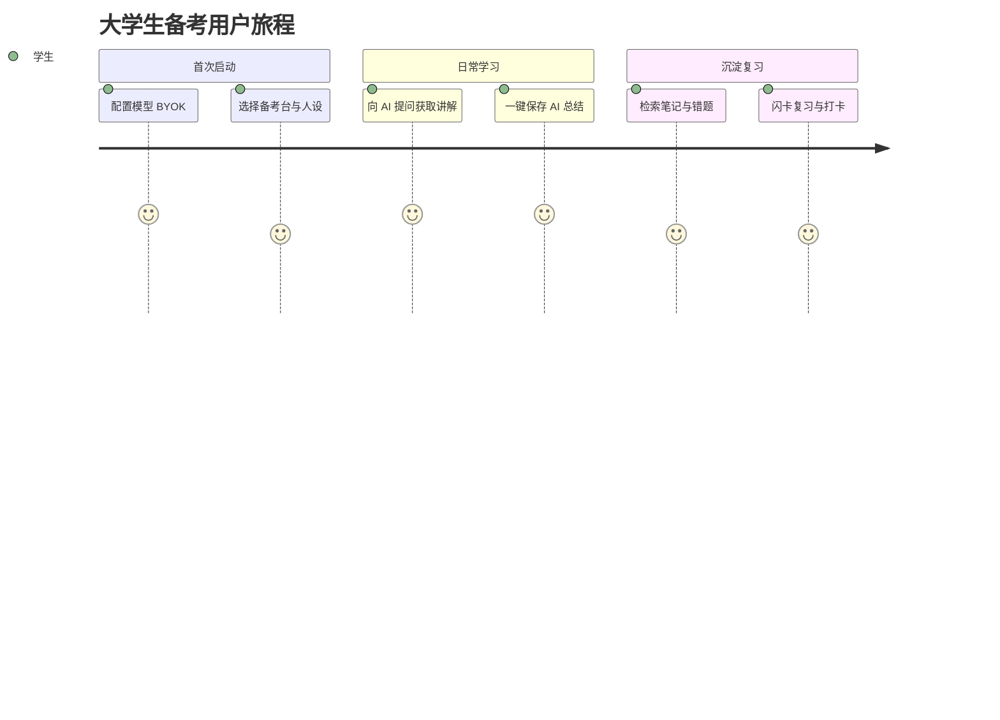
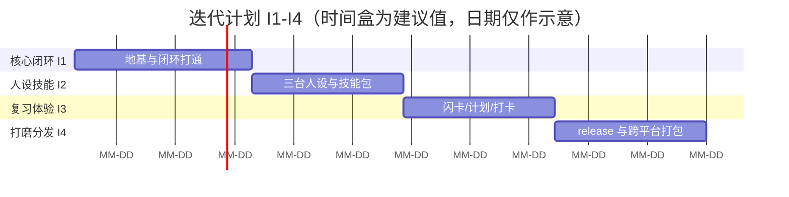

# 学伴 AI（StudyBuddy）产品需求文档（PRD）

- 文档编号：PRD-StudyBuddy-v1.1-20260908
- 版本：v1.1（按用户拍板修订：不做语音并隐藏现有入口、人设改为 AI 老师向并弃用 hiu 前缀、解除 R1/R3）
- 日期：2026-09-08
- 产品经理：许清楚（Xu）
- 依赖输入：架构师能力盘点文档 `capability-audit-2026-09-08.md`
- 文档语言：简体中文

---

## 0. 文档范围与阅读提示

本文档基于架构师已完成的能力盘点，落地一款二次开发产品的需求定义。所有功能均可在能力盘点文档的 A 档（直接复用）/ B 档（小幅改造）/ C 档（必须新写）中找到出处；凡是盘点未覆盖、也不在 C 档缺口清单中的功能，一律不纳入首期。第 9 章「能力映射表」即作为「不加功能」的护栏。

仓库内部代号保留 `HIU-WorkSpace` / `coworker`；本文档对外产品名重新设计为「学伴 AI（StudyBuddy）」，人设前缀使用 `xueban-*`（弃用 hiu 前缀）。

---

## 1. 项目背景与目标

### 1.1 二次开发来源

本项目基于开源 AI Agent 桌面应用 OpenWorker 二次开发（已改名 HIU-WorkSpace / coworker）。原项目技术基线为：Tauri 2 桌面壳 + 本地 Python 服务（FastAPI + aisuite）+ React 18 / TypeScript 前端 + SQLite 记忆，支持多模型提供商 BYOK，内置 16 个人设与技能包、定时自动化、长期记忆、语音 STT、审计视图等。

### 1.2 定位重构说明

原项目定位为通用 AI 工程/安全工作台，人设多为安全/工程向（13 个 `ships:false` 默认不分发），系统提示要求「对 LEAD 说话、绝不使用 ask_user」，不适用于学生单机会话。本次二次开发将其重构为：

- **产品本质**：基于上述开源桌面应用二次开发的通用大学生 AI 备考学习桌面应用。
- **形态**：桌面端为主、本地优先、学生自带模型 Key（BYOK）。
- **去校名化**：重新设计品牌与名称，去除院系/校名绑定，面向全体大学生、通用化。
- **首期主线**：四六级备考台、考研备考台、证书备考台（通用资格/语言类考证）；日常课业与编程课设不在首期。
- **语音边界**：本项目不做任何语音相关功能，关闭并隐藏现有语音识别入口（见 B-04）。

### 1.3 核心产品闭环

本产品区别于通用聊天工具的核心，是一条可沉淀的学习闭环：

> 学生向 AI 获取学习资料与讲解 → 将 AI 的总结**保存进系统本地** → 在本地沉淀、检索与复习。

### 1.4 成功度量指标

指标用于衡量闭环是否跑通，具体目标值需在首启灰度后据实校准，下表目标值标注（待确认）。

| 指标 | 定义 | 目标（待确认） |
|------|------|----------------|
| 模型激活率 | 完成 BYOK 配置并成功发起首次对话的用户占比 | （待确认） |
| 核心闭环完成率 | 单次会话内「获取讲解 → 保存本地 → 进入复习」路径完成率 | （待确认） |
| 人均周保存资料数 | 每活跃用户每周落盘笔记/错题/单词卡数 | （待确认） |
| 周留存率 | 次周仍有学习会话的用户占比 | （待确认） |
| 复习打卡完成率 | 定时复习任务按期完成占比 | （待确认） |

---

## 2. 用户画像与场景分析

### 2.1 学生端主画像

| 画像 | 描述 | 典型诉求 |
|------|------|----------|
| 四六级备考生 | 大一至大三，需集中突破听力/阅读/写作/翻译 | 高频词记忆、真题精解、作文批改 |
| 考研生 | 大三至大四，长线备考（政/英/数/专业课） | 长线冲刺计划、讲义整理、错题沉淀 |
| 证书备考生 | 各年级，备考通用资格/语言类证书 | 大纲/真题/案例解析、专有术语词库、节点计划 |

共性：自带模型 Key 意愿强、对隐私敏感、依赖本地资料沉淀与离线复习、希望界面为中文。

### 2.2 用户旅程

### 2.3 教师端需求差异描述（仅描述，不实现）

教师侧常见诉求包括：发布学习任务、查看班级学习进度、导出成绩/统计、批量分发资料。本产品**不实现教师端**，理由见第 10 章。

---

## 3. 核心功能模块规划

编号规则：公共基础 `B-xx`，四六级台 `C1-xx`，考研台 `C2-xx`，证书台 `C3-xx`；优先级仅以 P0/P1/P2 标注，不混入编号。

### 3.1 公共基础（B）

| 编号 | 功能 | 来源档位 | 对应盘点条目 | 优先级 | 说明 |
|------|------|----------|--------------|--------|------|
| B-01 | 多提供商 BYOK 接入 | A | #1 | P0 | 接入多家模型，Onboarding 推荐有免费额度的国产模型（DeepSeek/Kimi/Z AI GLM）降低门槛 |
| B-02 | 中文界面与国际化 | A | #2 | P0 | 复用现有 en/zh，默认中文 |
| B-03 | AI 对话与讲解（Markdown/流式） | A | #7 | P0 | 复用 Composer/Markdown/Transcript |
| B-04 | 语音功能边界：不做并隐藏 | B | #12 | P0 | 本项目不做任何语音功能；关闭并隐藏现有语音识别入口（Composer 语音按钮隐藏，STT 组件不随主流程启用） |
| B-05 | 一键沉淀本地（write_file） | C | #13 | P0 | 核心缺口：新增受 workspace 限定写文件工具，对齐 save_skill 预览-确认范式，落盘 `<workspace>/.xueban/notes/` |
| B-06 | 本地资料库与复习视图 | C/B | #14 | P0 | 笔记/错题/单词卡浏览、检索、闪卡复习、错题重练 |
| B-07 | 用户知识卡片（记忆封装） | B | #8 | P0 | 通用记忆封装为卡片类型（笔记/错题/单词）+ 复习字段 |
| B-08 | 备考技能包机制 | A | #3 | P0（机制）/P1（内容） | 新增真题解析/作文批改/单词卡生成等 SKILL.md 内容 |
| B-09 | 定时复习提醒与打卡 | A | #4 | P1 | 复用 Schedule 做每日复习提醒/打卡 |
| B-10 | 备考计划卡与待办模板 | B | #10 | P1 | 三台计划模板配置化（每日打卡/冲刺/阶段） |
| B-11 | 备考人设体系（AI 老师向） | B | #9 | P0 | 新增 xueban-cet / xueban-kaoyan / xueban-cert 三个「AI 老师」人设（用户是学生，AI 以老师角色讲解；弃用 hiu 前缀） |
| B-12 | 学习行为留痕/审计视图 | A | #11 | P2 | 可选启用，学习行为留痕 |
| B-13 | 本地资料导入与只读读取 | A | #6 | P0 | 手动导入真题/讲义等资料并只读读取 |
| B-14 | 本地全文检索（复用 grep） | A | #5 | P0 | 复用 ripgrep 检索落盘资料，支撑 B-06 |

### 3.2 四六级备考台（C1）

| 编号 | 功能 | 来源档位 | 对应盘点条目 | 优先级 | 说明 |
|------|------|----------|--------------|--------|------|
| C1-01 | 四六级人设 | B | #9 | P0（经 B-11 交付） | 听力/阅读/写作/翻译讲解风格与推荐模型 |
| C1-02 | 四六级核心词库与单词卡 | A/B | #3,#8 | P1 | 技能包生成词卡，沉淀为知识卡片 |
| C1-03 | 听读写译真题解析 | A | #3 | P1 | 阅读/翻译/写作模板解析技能 |
| C1-04 | 写作批改 | A | #3 | P1 | 作文批改技能包（维度评分+建议） |
| C1-05 | 每日打卡 + 阶段词汇计划 | B | #10 | P1 | 打卡 cron + 阶段性词表计划模板 |

### 3.3 考研备考台（C2）

| 编号 | 功能 | 来源档位 | 对应盘点条目 | 优先级 | 说明 |
|------|------|----------|--------------|--------|------|
| C2-01 | 考研人设 | B | #9 | P0（经 B-11 交付） | 政治/英语/数学/专业课讲解，长线冲刺 |
| C2-02 | 考研词库与单词卡 | A/B | #3,#8 | P1 | 英/政/专词库与词卡 |
| C2-03 | 真题解析与讲义整理 | A | #3 | P1 | 真题/讲义落盘为资料库条目 |
| C2-04 | 长线冲刺计划 | B | #10 | P1 | 按月/周计划模板 |

### 3.4 证书备考台（C3）

| 编号 | 功能 | 来源档位 | 对应盘点条目 | 优先级 | 说明 |
|------|------|----------|--------------|--------|------|
| C3-01 | 证书人设 | B | #9 | P0（经 B-11 交付） | 通用资格/语言类证书讲解边界与知识范围 |
| C3-02 | 专有术语词库与单词卡 | A/B | #3,#8 | P1 | 各证书术语词卡 |
| C3-03 | 科目真题/大纲/案例解析 | A | #3 | P1 | 大纲/真题/案例解析技能 |
| C3-04 | 报名-备考-冲刺节点计划 | B | #10 | P1 | 节点计划模板 |

---

## 4. 非功能需求

| 类别 | 要求 |
|------|------|
| 性能 | AI 响应流式展示；本地落盘与检索为本地操作，需低延迟；闪卡/复习交互即时响应 |
| 安全 | BYOK Key 本地加密存储，不落明文；write_file 受 workspace 限定并带覆盖保护；写入采用预览-确认审批，禁止静默写盘 |
| 兼容性 | 桌面端覆盖 Windows / macOS / Linux；模型侧兼容 OpenAI 兼容路径的多家提供商 |
| 隐私与本地优先 | 学习数据（笔记/错题/单词卡/计划/人设/技能）全部本地存储；不采集上传；不对接校方/第三方系统 |
| 离线可用性 | 本地资料检索与复习可离线使用；AI 讲解调用需联网（BYOK 推理在提供商侧，属预期）；语音功能不做 |

---

## 5. 交互设计规范

### 5.1 复用现有人设/记忆/技能/定时/计划卡 UI 骨架

- **人设选择**：复用 `PersonasTab`，切换三个 AI 老师人设。
- **记忆/资料库**：增强 `MemorySection` 为「资料库与复习」视图（B 档）。
- **技能包**：复用 `SkillsTab` 承载备考技能包。
- **定时任务**：复用 `ScheduledView` 做复习提醒/打卡。
- **语音**：不显示——现有 `Composer` 语音入口默认隐藏（B-04），本项目不做语音功能。
- **计划卡**：复用 `PlanCard` / `TodoPanel` 承载备考计划模板。

### 5.2 核心页面

1. 启动与 Onboarding（模型 BYOK 引导、备考台选择）
2. 备考台主页（四六级/考研/证书三台切换）
3. 对话讲解页（AI 讲解 + 一键保存）
4. 资料库与复习页（笔记/错题/单词卡浏览、检索、闪卡、错题重练）
5. 计划与打卡页（备考计划、定时复习打卡）
6. 设置页（模型/BYOK/隐私）

### 5.3 关键交互原则

- **一键沉淀**：AI 总结可一键保存，采用预览-确认审批，用户可见内容后落盘。
- **本地优先**：所有资料本地可见、可检索、可离线复习。
- **复习闭环**：讲解 → 保存 → 检索/闪卡/打卡 形成连续回路。
- **隐私透明**：明确提示数据本地存储、不对接外部系统。

---

## 6. 数据需求

所有数据存储于本地（SQLite + 文件），不对接校方系统，资料由用户手动导入。

| 数据对象 | 存储 | 说明 |
|----------|------|------|
| 用户知识卡片（笔记/错题/单词卡） | SQLite `memories` 表封装 | 含 scope/key/content/summary/type/复习字段 |
| 备考计划 | PlanCard / Todo 结构 | 三台计划模板文本 |
| 定时任务 | SQLite `Schedule` | cron/once，复习提醒/打卡 |
| 人设与技能包 | 本地 persona manifest + skills 文件夹 | xueban-* 人设、备考 SKILL.md |
| 落盘资料文件 | `<workspace>/.xueban/notes/` | write_file 落盘的 Markdown 资料 |

---

## 7. 项目里程碑与迭代计划

采用迭代制 I1-I4，时间盒为建议值（非承诺工期），工作量以 XS/S/M/L 表示，不绑定人日与周期。

| 迭代 | 目标 | 关键交付 | 工作量 | 时间盒建议 |
|------|------|----------|--------|------------|
| I1 | 核心闭环打通 | B-01/B-02/B-03/B-04（隐藏语音入口）/B-05/B-06/B-07/B-11/B-13、三个 AI 老师人设骨架 | L | 约 3 周 |
| I2 | 人设与技能内容 | C1-01~05/C2-01~04/C3-01~04 技能包与词库内容（A/B 配置层） | M | 约 2-3 周 |
| I3 | 复习体验深化 | B-09/B-10 计划与打卡、闪卡/错题重练 | M | 约 2-3 周 |
| I4 | 打磨与分发 | 人设分发纳入 release（R2）、跨平台打包（R5）、B-12 可选 | M | 约 2-3 周 |

---

## 8. 验收标准

按 P0 功能逐条给出可验收通过条件。

| 编号 | 验收通过条件 |
|------|--------------|
| B-01 | 用户可在设置中填入至少一家提供商 Key 并成功发起对话；Onboarding 能推荐国产免费额度模型 |
| B-02 | 应用默认中文界面，可切换语言并持久化 |
| B-03 | 对话支持流式 Markdown 渲染 |
| B-04 | 界面上不出现任何语音入口（Composer 语音按钮隐藏，STT 组件不随主流程加载），对话与复习全流程无语音依赖 |
| B-05 | 在对话中对 AI 总结触发「保存」后，经预览-确认落盘至 `<workspace>/.xueban/notes/`，目录自动创建、覆盖有保护 |
| B-06 | 资料库可浏览/检索笔记/错题/单词卡，支持闪卡复习与错题重练 |
| B-07 | 记忆封装为知识卡片，含类型与复习字段，可被 B-06 检索 |
| B-11 | 三个 AI 老师人设（xueban-cet / xueban-kaoyan / xueban-cert）可在 PersonasTab 选择并生效，不改 VALID_GROUPS 枚举 |
| B-13 | 可手动导入资料并只读读取；导入内容进入可检索范围 |
| B-14 | 复用 grep 对落盘资料全文检索，返回 file:line:text |

---

## 9. 能力映射表（护栏：已有能力 → 学生端功能 → 复用档位）

直接引自能力盘点文档第 1 节，作为「不加功能」的边界护栏。

| 盘点条目 | 已有能力 | 学生端功能 | 复用档位 |
|----------|----------|------------|----------|
| #1 | 多提供商 BYOK 接入 | B-01 | A |
| #2 | 中文界面（国际化） | B-02 | A |
| #3 | 技能包机制 | B-08、C1/C2/C3 各技能 | A |
| #4 | 定时自动化 | B-09 | A |
| #5 | 代码搜索（本地检索） | B-14 | A |
| #6 | 文件只读读取 | B-13 | A |
| #7 | 对话与 Markdown 渲染 | B-03 | A |
| #8 | 通用长期记忆（键值） | B-07 用户知识卡片 | B |
| #9 | 人设 / Persona 体系 | B-11、C1-01/C2-01/C3-01 | B |
| #10 | 计划卡 / 待办 | B-10 | B |
| #11 | 审计视图 | B-12 | A |
| #12 | 语音输入（STT，英文模型） | B-04（不做语音，关闭并隐藏入口） | B |
| #13 | 本地文件写入（缺失） | B-05 write_file | C |
| #14 | 本地资料检索/复习视图（缺失） | B-06 | C/B |

> 首期功能边界即 C 档两项（写文件工具、本地资料检索/复习视图）与 B 档项（记忆封装、AI 老师人设、人设分发、计划模板、语音入口隐藏）。语音相关功能明确不做。超出此范围的功能一律不纳入。

---

## 10. 双端边界章节

### 10.1 学生端实现范围

本文档全部功能（第 3 章 B/C1/C2/C3）均为学生端单机本地能力，覆盖核心闭环与三台备考场景。

### 10.2 教师端需求描述（仅描述，不实现）

教师侧通常期望：发布学习任务、查看班级/学生进度、导出统计报表、批量分发资料。这些需求在当前产品方向下不实现。

### 10.3 不做教师端的边界理由

1. **产品方向明确仅学生端**：决策已拍板只做学生端，不产出任何教师端功能。
2. **本地优先与隐私**：学生数据全部本地存储、不对接校方/第三方系统，教师端所需的集中式班级数据天然冲突。
3. **去校名化与通用化**：产品面向全体大学生，不绑定具体院校的组织结构与管理流程。
4. **范围收敛**：首期聚焦「获取-保存-复习」闭环与三台备考，教师端属另一产品形态，不在本次二次开发边界内。

---

## 11. 风险与待确认清单

### 11.1 前置改造风险

| 编号 | 风险 | 等级 | 说明 |
|------|------|------|------|
| R2 | 人设分发机制（ships/group/release） | 中 | 三个 xueban-* AI 老师人设如何进入 release 构建，避免仅内部构建可见 |
| R4 | BYOK 首次配置门槛 | 低 | 首次打开后配置 API Key 的功能已实现（沿用），仅需 Onboarding 推荐免费额度模型 |
| R5 | 跨平台打包 | 中 | Win/macOS/Linux 分发，模型与 sidecar 体积管控 |

> 原 R1（STT 模型）与 R3（sidecar 启动与首启引导）已按用户拍板解除：本项目不做语音功能并隐藏现有语音入口；打包沿用现有「安装即用」能力，首次打开仅需配置 API Key（已实现）。

### 11.2 需用户/校方拍板的阻断级问题

1. **人设分发进入 release 的机制（R2）**：三个 xueban-* AI 老师人设用 `ships:true` + `group:general`，还是调整 release 构建脚本将其纳入？（阻断级，影响人设是否对用户可见）

> 原 R1（STT 模型选型）与 R3（sidecar 启动与首启引导）已按用户拍板解除，见 11.1。

### 11.3 其他待确认

- 三个 AI 老师人设的具体 system_prompt 与技能包 SKILL.md 内容需学科专家/教研侧评审（待确认）。
- 复习打卡的默认 cron 与提醒文案需产品侧拍板（待确认）。
- 审计/学习行为留痕（B-12）是否首期启用（待确认）。

---

## 附录 A. 文档编号与术语约定

- **文档编号**：PRD-StudyBuddy-v1.1-20260908
- **内部代号**：HIU-WorkSpace / coworker（仓库名，保留不改）
- **对外产品名**：学伴 AI（英文代号 StudyBuddy）
- **BYOK**：Bring Your Own Key，学生自带模型 Key
- **备考台**：四六级/考研/证书三个备考场景入口
- **AI 老师人设**：xueban-cet / xueban-kaoyan / xueban-cert，用户是学生、AI 以老师角色讲解（弃用 hiu 前缀）
- **知识卡片**：基于通用记忆封装的笔记/错题/单词卡
- **能力档位**：A=直接复用，B=小幅改造，C=必须新写
- **优先级**：P0=必须有，P1=应该有，P2=可有

### 候选产品名（主推 1 个）

| 候选 | 英文代号 | 一句话定位 | 结论 |
|------|----------|------------|------|
| 学伴 AI | StudyBuddy | 面向全体大学生的本地优先 AI 备考学习搭子，陪你从听课、刷题到复习 | 主推 |
| 备考舱 | PrepHub | 一个装着四六级/考研/证书三个备考台的本地 AI 学习桌面，一站通关 | 备选 |
| 知考 | KnowPrep | 懂考试的本地 AI 学习桌面，把 AI 讲的内容真正存下来、练起来 | 备选 |

---

## 附录 B. 变更记录

| 版本 | 日期 | 作者 | 说明 |
|------|------|------|------|
| v1.0 | 2026-09-08 | 许清楚（产品经理） | 基于架构师能力盘点创建首版完整 PRD |
| v1.1 | 2026-09-08 | 许清楚（产品经理） | 按用户拍板修订：不做语音并隐藏现有语音入口（B-04 改写，删听力/复试口语项）；人设改为 AI 老师向并弃用 hiu 前缀（xueban-*，落盘目录改为 .xueban/notes）；R1/R3 解除，迭代 I1-I5 收敛为 I1-I4 |
