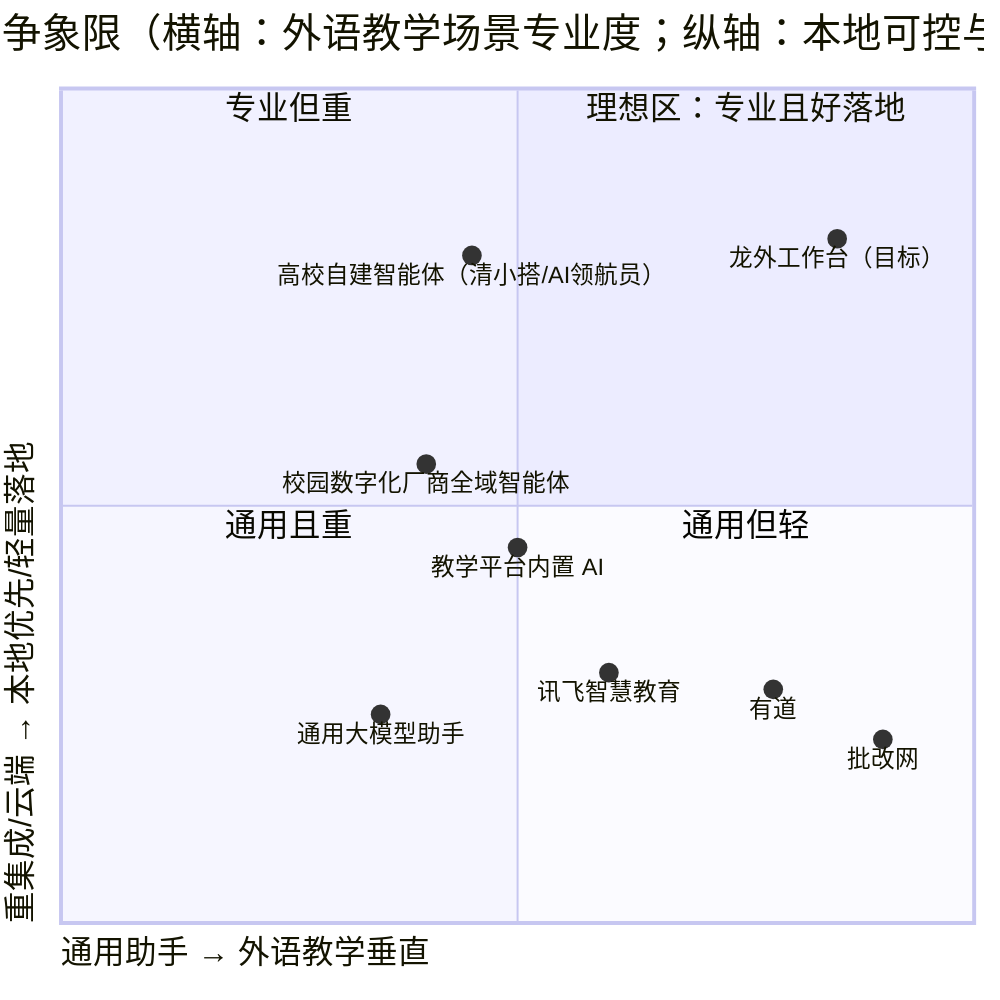
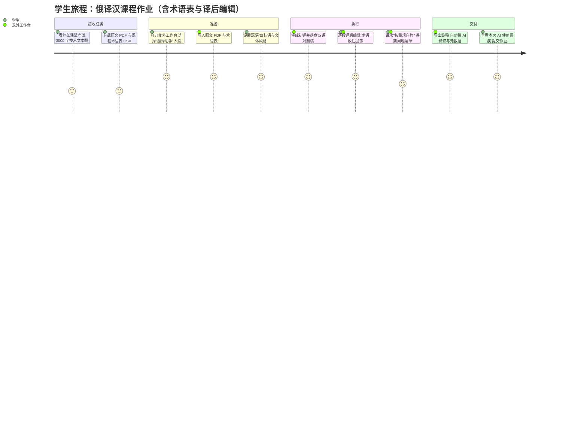
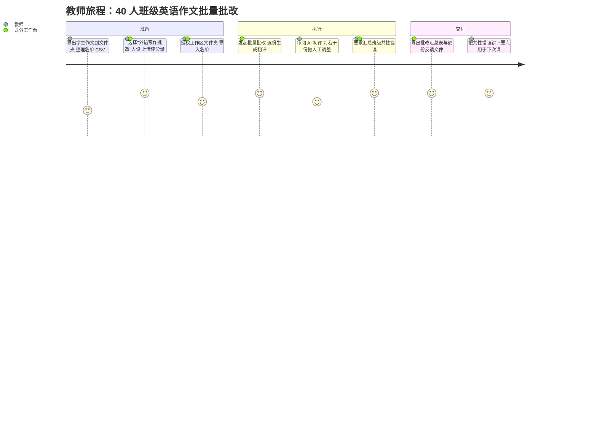
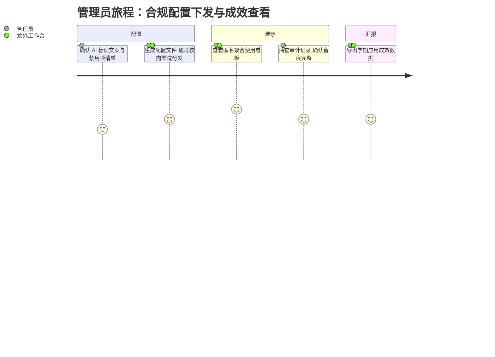
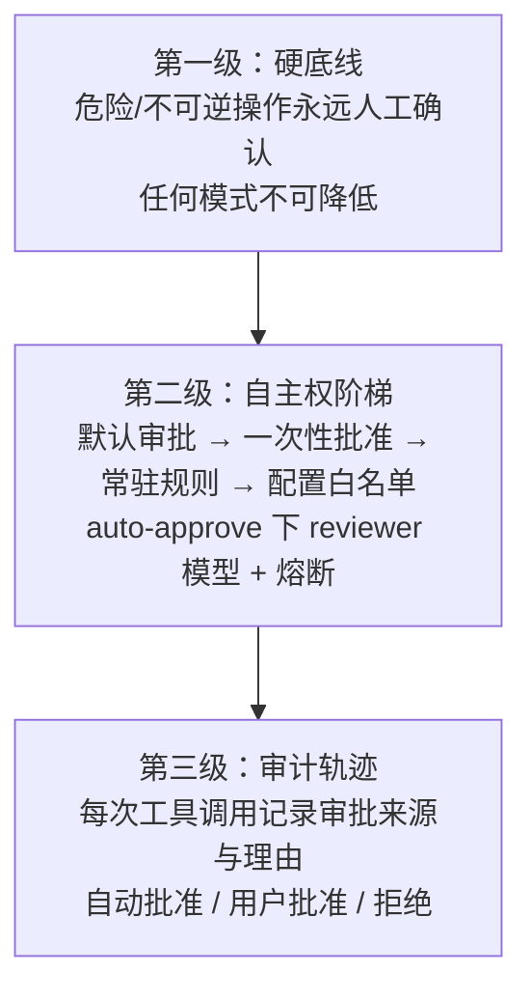
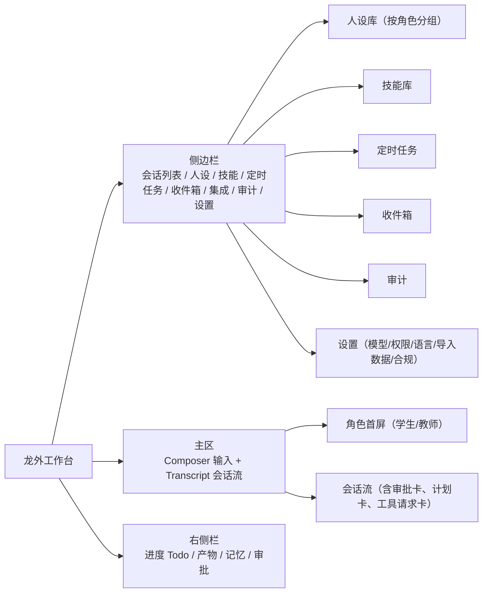
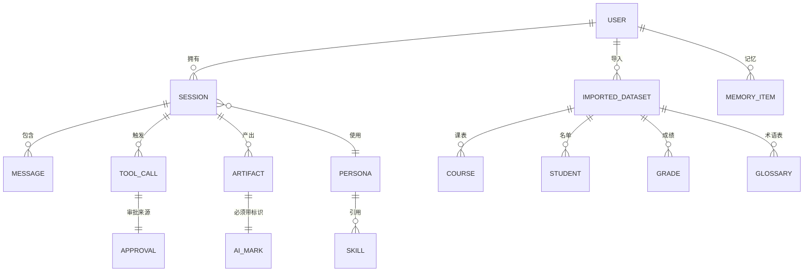
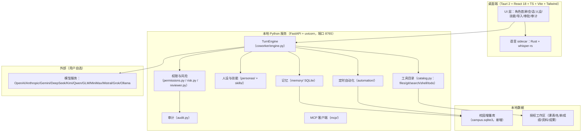
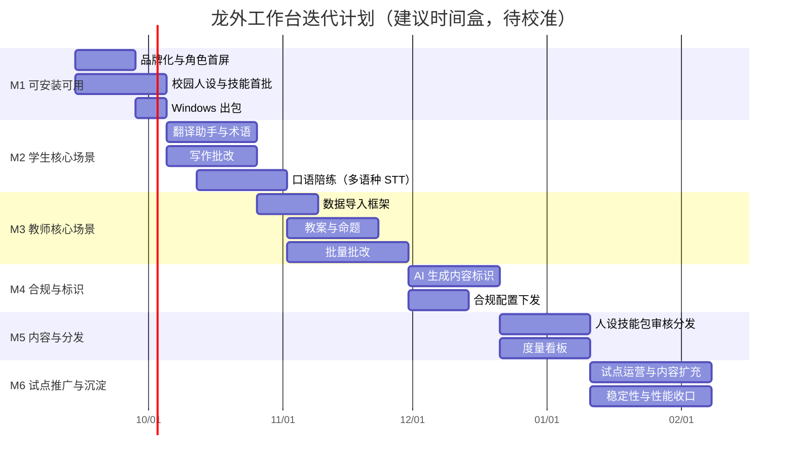

# 龙外工作台（HIU WorkSpace）产品需求文档

> 本文档为**完整版 PRD**，包含竞品分析、象限图、市场定位与推广路径。
> 写作约束：简体中文；无 emoji；凡涉及黑龙江外国语学院（下称"龙外"）的具体事实数据，均已标注来源与检索日期，未能核实的一律标注「（假设，待确认）」或列入第 15 章待确认清单。
> 所有功能均锚定本仓库 `D:\DeskTop\HIU-WorkSpace`（开源项目 OpenWorker，MIT 协议）中**真实存在**的代码能力，二次开发策略三选一：复用现有能力 / 改造现有能力 / 全新开发。

---

## 0. 文档信息与修订记录

| 项 | 内容 |
|---|---|
| 文档名称 | 龙外工作台（HIU WorkSpace）产品需求文档（完整版） |
| 版本号 | v1.0 |
| 文档状态 | 评审稿（待校方与项目组确认第 15 章开放问题） |
| 编写日期 | 2026-09-08 |
| 作者 | 许清楚（产品经理） |
| 交付负责人 | 齐活林（交付总监） |
| 目标客户 | 黑龙江外国语学院（HIU）学生、教师、教学管理人员 |
| 上游项目 | OpenWorker（`light-misty/HIU-WorkSpace`），MIT 协议，基于 aisuite 构建 |
| 本仓库路径 | `D:\DeskTop\HIU-WorkSpace` |
| 关联文档 | `README.md`、`AGENTS.md`、`docs/config.example.toml` |

### 修订记录

| 版本 | 日期 | 修订人 | 修订内容 |
|---|---|---|---|
| v0.1 | 2026-09-08 | 许清楚 | 仓库能力盘点，确认四个已拍板前提 |
| v0.5 | 2026-09-08 | 许清楚 | 竞品检索与政策合规检索，形成分析结论 |
| v1.0 | 2026-09-08 | 许清楚 | 完整版 PRD 成稿，含竞品分析、象限图、市场定位、分端需求、迭代计划 |

---

## 1. 项目背景与目标

### 1.1 立项背景

#### 1.1.1 政策与行业背景（均已核实来源）

| 时间 | 文件/事件 | 对本项目的意义 | 来源 |
|---|---|---|---|
| 2023-08-15 | 《生成式人工智能服务管理暂行办法》施行 | 生成式 AI 服务的基础合规框架 | 国家网信办等（新华社 2025-09-02 报道援引） |
| 2023-01-10 | 《互联网信息服务深度合成管理规定》施行 | 深度合成内容标识义务的上位依据 | 新华社 2025-03-17 |
| 2025-03-07 发布 / **2025-09-01 施行** | 《人工智能生成合成内容标识办法》（国信办通字〔2025〕2 号） | **强制显式标识 + 隐式元数据标识**，直接决定本产品"产物落盘"环节的设计 | 中央网信办 cac.gov.cn（2025-03-14）；新华社 2025-09-01 |
| 2025-05 | 《中小学人工智能通识教育指南（2025 年版）》《中小学生成式人工智能使用指南（2025 年版）》 | 明确**禁止学生直接复制 AI 生成内容作为作业或考试答案**；虽面向中小学，但为高校"学术诚信"设计提供参照口径 | 人民网教育频道 2025-05-13；教育部基础教育教学指导委员会 |
| 2026-04 | 教育部等 5 部门《"人工智能+教育"行动计划》 | 高等教育阶段推动人工智能成为高校公共基础课程 | 人民日报/中国共产党新闻网 2026-08-23 |
| 2026 | 《教育发展"十五五"规划》提出"推进人工智能全学段教育" | 校方立项的政策抓手 | 同上 |

补充数据（新华社 2025-09-01 报道）：截至报道时我国已有 **490 余款大模型**在国家网信办完成备案，**240 余款**在省级网信办完成登记，生成式人工智能产品用户规模达 **2.3 亿人**。

#### 1.1.2 校方背景（来源：hiu.edu.cn 各官方页面，检索日期 2026-09-08）

| 事实 | 数值 | 来源页面 | 备注 |
|---|---|---|---|
| 学校性质 | 黑龙江省**唯一一所语言类本科高校**，民办 | `www.hiu.edu.cn/zjlw1/lwjj.htm`、`hr.hiu.edu.cn/info/1010/1304.htm` | 已核实 |
| 外语语种 | **11 个外语语种** | 首页、`hr.hiu.edu.cn` | 已核实 |
| 本科专业数 | **32 个**（招聘启事）/ **34 个**（首页） | `hr.hiu.edu.cn`、`www.hiu.edu.cn` | **口径不一致，需确认** |
| 全日制本科在校生 | **11709 人** | `hr.hiu.edu.cn` | 另见 10136 人（简介页）、8822 人（信息公开页），均为更早口径 |
| 留学生 | 近百人（招聘启事）/ 91 人（简介页） | 同上 | 已核实，规模小 |
| 专任教师 | **523 人**，外籍教师 **28 人**（招聘启事）；562 人 / 60 余人（简介页） | 同上 | 口径不一致 |
| 二级学院 | **10 个** | `hr.hiu.edu.cn` | 已核实 |
| 国际合作 | 与 32 个国家和地区 100 余所高校合作（招聘启事）；首页称国际化合作院校 131 所 | 同上 | 口径不一致 |
| 一流专业 | 国家级/省级一流专业建设点 5 个；国家一流本科专业 1 个（英语） | 首页 | 已核实 |
| 信息化基础 | 华为全光校园网（万兆骨干、千兆桌面）、智慧教室 **198 间**、智慧教学云平台、教学实训软件 20 余个 | `hr.hiu.edu.cn` | 已核实 |
| AI 教学投入 | 翻译专业设"**智能翻译**"方向，英语专业设"**数智创新班**"；2026-08 承办全国"**人工智能赋能翻译教学研修班**"（全国翻译专业学位研究生教育指导委员会指导、中国翻译协会主办） | 首页新闻 | 已核实，说明校方对 AI+外语已有明确意愿 |
| 考点资源 | 首页称"国内外考试中心/考点 27 项" | 首页 | **具体构成未披露，待确认** |
| 学位建设 | 获批硕士学位授予立项建设单位；博士后创新实践基地 | 首页 | 已核实 |

**结论**：龙外是"外语语种多、小班化、国际化程度高、信息化底座好、且已在主动拥抱 AI+外语教学"的民办应用型本科高校。其规模（万人级）决定了**单校自建大模型既无必要也不经济**，但对"贴合外语教学流程的专用工具"有真实需求。

### 1.2 现状痛点

#### 1.2.1 学生端痛点

| 编号 | 痛点 | 说明 |
|---|---|---|
| S-P1 | 通用 AI 不懂外语专业的"评价标准" | 学生用通用大模型改作文，得到的是"更通顺的英文"，而不是按专四专八/雅思评分量规给出的分项诊断与可执行的修改路径 |
| S-P2 | 语料与术语不在手上 | 翻译练习、专业课作业缺乏统一术语表与双语语料，AI 输出与课堂要求脱节 |
| S-P3 | 口语/听力缺乏陪练 | 外语口语练习需要"有人听、有人纠"，课堂上师生比不允许（按 11709 名在校生 / 523 名专任教师估算约 **22:1**（估算，基于上述公开数据计算，非官方口径）） |
| S-P4 | AI 使用与学术诚信边界模糊 | 学校层面缺少统一口径，学生不清楚"哪些可以用、用了怎么标注" |
| S-P5 | 工具与资料散落 | 词典、翻译、语料、笔记、备考题库分散在多个 App，无法与课程进度联动 |
| S-P6 | BYOK 门槛 | 学生需要自行获取 API Key，存在费用与网络门槛（详见第 13 章） |

#### 1.2.2 教师端痛点

| 编号 | 痛点 | 说明 |
|---|---|---|
| T-P1 | 备课重复劳动重 | 教案、课件、课堂活动设计按学期循环，跨语种重复度高 |
| T-P2 | 外语作业批改负担极重 | 写作类作业（作文、翻译稿）逐份精批耗时巨大；班级规模下教师难以给每人足够反馈 |
| T-P3 | 学情数据无法驱动教学 | 成绩、作业、课堂表现分散在 Excel 与不同平台，缺少低成本的分析手段 |
| T-P4 | 缺少符合本校教学法的 AI 模板 | 通用 AI 给出的教案不符合外语教学法（如任务型教学、内容与语言融合教学 CLIL）要求 |
| T-P5 | 外教与留学生沟通成本 | 双语通知、跨文化说明材料需要反复手工翻译 |
| T-P6 | 无法确认学生是否违规使用 AI | 缺少"AI 使用留痕"机制，学术诚信管理靠人工判断 |

#### 1.2.3 教学管理端痛点

| 编号 | 痛点 |
|---|---|
| M-P1 | 缺少统一的校内 AI 工具入口，教师学生各自为战，质量与合规不可控 |
| M-P2 | 无法度量 AI 应用成效，难以形成可汇报的数字 |
| M-P3 | 与教务系统对接成本高、周期长，短期内无法落地（本项目一期明确回避，见 1.4） |

### 1.3 产品定位（一句话）

> **龙外工作台是一款运行在师生自己电脑上的、本地优先的 AI 协作伙伴桌面应用：以"外语教学专用人设 + 技能包"为核心，把翻译、写作、口语、备考、备课、批改等真实任务做成可交付的成果，并在每一次 AI 动作上保留可审计、可追责、可标识的治理痕迹。**

差异化定位关键词：**本地优先（数据不出机）· 外语教学垂直 · 人设与技能可校内分发 · 三级治理可审计 · BYOK 不绑定模型 · 不对接教务系统也能用**。

### 1.4 已拍板前提（不推翻，写进设计约束）

| 编号 | 前提 | 对设计的影响 |
|---|---|---|
| A1 | **首发交付形态为桌面端**（沿用现有 Tauri 2 + 本地 Python 服务架构），保持本地优先、数据不出机 | 一期不做 Web 端；所有功能必须在 Windows 桌面壳内可用；`packaging/build_windows.ps1` 为主要出包路径 |
| A2 | **暂不与学校现有系统对接**（教务、学工、一卡通、图书馆、统一身份认证）；课表/名单/成绩/教学资料一律**文件手动导入** | 数据层设计围绕"文件导入 + 本地解析"展开（第 9 章）；不设计任何需要校内系统 API 的功能；统一身份认证不适用，改用本地角色选择 |
| A3 | **模型资源：师生自带 API Key（BYOK）**，沿用项目现有多提供商接入方式 | 不设计学校统一配额/私有化 GPU 集群为主方案；必须做好"无 Key / Key 失效 / 余额耗尽"的降级与引导；提供商范围见 10.4 |
| A4 | **完整版 PRD**：含竞品分析（5-7 款）、Mermaid 象限图、市场定位与推广路径 | 第 2、3 章 |

### 1.5 产品目标（Product Goals）

| 编号 | 目标 | 可度量口径 |
|---|---|---|
| G1 | 让外语类高频学习任务在**本地**完成并产出可直接使用的成果，而非聊天建议 | 学生端"成果文件落盘数 / 会话数" ≥ 60%（P0 功能上线 3 个月后统计口径，待校准） |
| G2 | 让教师把外语作业批改与备课的重复劳动交给可控的 AI，同时保留人工终审 | 教师端"批量批改"任务平均单份耗时相对人工下降 ≥ 50%（试点班实测，待校准） |
| G3 | 让 AI 使用可审计、可标识、可追责，满足校方合规与学术诚信管理要求 | 100% 工具调用留痕；100% 落盘成果带显式标识与隐式元数据（对应《标识办法》要求） |

### 1.6 成功度量指标

| 层级 | 指标 | 定义 | 目标值（首年试点） |
|---|---|---|---|
| **北极星指标** | **WDAU（Weekly Deliverables per Active User，周活跃用户人均交付件数）** | 一周内活跃用户产生的"成功落盘的成果文件"数 / 周活跃用户数 | ≥ 3.0（假设，需在 M2 试点后校准） |
| 规模 | WAU（周活跃用户） | 一周内至少发起 1 次有效会话的去重用户 | 试点期 ≥ 300（假设，待确认校方试点范围） |
| 留存 | 次月留存 | 首月使用过的用户在次月仍活跃的比例 | ≥ 40%（假设） |
| 深度 | 人设使用率 | 使用过"龙外校园人设"（非通用助手）的会话占比 | ≥ 70% |
| 质量 | 成果采纳率 | 生成后被用户"保留/导出/继续使用"的成果占比 | ≥ 65%（假设） |
| 治理 | 审批 escalations / 千次工具调用 | 触发人工确认的次数 | 作为安全阀监控，过高说明权限规则不合理 |
| 治理 | 审计完整率 | 工具调用有完整 approval provenance 记录的比例 | 100%（P0 硬性） |
| 合规 | 标识覆盖率 | 落盘成果带显式 + 隐式标识的比例 | 100%（P0 硬性） |

---

## 2. 竞品分析

### 2.1 竞品选取说明

选取 7 款，覆盖四类竞争位：**通用大模型助手**（学生自发使用的默认选项）、**外语垂直工具**（写作批改/翻译/口语的既有在位者）、**高校自建智能体**（校方可能自建或采购的方向）、**校园数字化厂商全域智能体/教学平台 AI**（需要打通教务系统的重集成路线）。

### 2.2 逐款分析

#### 竞品 1：通用大模型助手（ChatGPT / Claude / 豆包 / DeepSeek 等，含其教育版）

| 项 | 内容 |
|---|---|
| 形态 | Web / App，云端 |
| 优势 | 能力最强、覆盖最广；学生零学习成本、已在用；支持多语种；具备文件上传与数据分析 |
| 劣势 | 不懂本校课程/教学法/评分标准；数据出机，教学资料与未发表作业上传到境外服务存在合规与隐私风险；无法与课堂流程耦合；无学术诚信留痕；费用与网络是门槛 |
| 对本项目的威胁 | **最高**。这是"不作为"的默认选项，学生对通用助手的满意度下限决定了我们的及格线 |
| 数据来源 | 公开产品体验；规模数据见新华社 2025-09-01（我国生成式 AI 产品用户规模 2.3 亿人） |

#### 竞品 2：批改网（句酷批改网，北京词网科技有限公司，pigai.org）

| 项 | 内容 |
|---|---|
| 形态 | Web，云端 |
| 关键数据 | 2011-06-28 上线；截至 2025-12 **累计批改作文超 11 亿篇**（百度百科，引用日期 2026-01）；官网首页自述"**超过 5000 所学校**在使用"，首页计数器显示"正在批改第 1,167,268,878 篇"（检索日 2026-09-08）；2018 年口径为覆盖约 6 万所学校、累计服务学生 1.2 亿（百度百科） |
| 优势 | 外语写作智能批改领域的**在位者**；按句点评、中式英语识别、抄袭检测、学习进度报告成熟；承办"批改网杯"全国大学生英语写作/翻译大赛，赛事运营天然绑定高校外语教师社群；有大学四六级、公共英语等版本 |
| 劣势 | 只解决"英语作文评分"这一件事，不覆盖翻译、口语、备课、备考；SaaS 云端，教学数据出机；反馈颗粒度偏"评分器"而非"教学法"；教师无法自定义本校评分量规（公开资料未披露深度自定义能力，**待确认**） |
| 对本项目的关系 | **既是竞品也是标杆**：我们的"外语写作批改"必须做到"可自定义量规 + 本地不出机 + 可导出批改留痕"才能形成差异化；同时它证明了高校外语教师的付费/使用意愿真实存在 |
| 数据来源 | pigai.org 官网（检索日 2026-09-08）；百度百科"批改网"词条（引用日期 2026-01/2026-02） |

#### 竞品 3：有道（有道翻译 / 有道领世 / 子曰大模型）

| 项 | 内容 |
|---|---|
| 形态 | App / Web / 硬件，云端 |
| 优势 | 外语学习与翻译的国民级心智；词典与语料积累深；多语种覆盖；C 端体验成熟 |
| 劣势 | 面向 C 端泛学习，不面向"本校教学流程"；无本地化部署；不解决教师批改与备课；学术诚信留痕缺失 |
| 对本项目的威胁 | 中等。学生在"查词/翻译"上会用有道，但不会用它完成课程作业流程 |
| 数据来源 | 公开产品体验；具体用户规模**公开资料未披露** |

#### 竞品 4：科大讯飞（星火大模型 + 智慧课堂 / 讯飞听见）

| 项 | 内容 |
|---|---|
| 形态 | 云端 + 软硬一体进校 |
| 优势 | 语音技术（识别、评测、同传字幕）在教育行业积累最深；有完整进校销售与服务体系；能做区域级/校级项目 |
| 劣势 | 重集成、重采购、周期长、费用高；民办高校预算敏感；与外语"教学法"结合有限（偏通用智慧课堂） |
| 对本项目的威胁 | **中等偏高**，尤其在"校方统一采购 AI 平台"的决策路径上会与我们正面竞争 |
| 数据来源 | 公开产品与行业报道；具体高校客户数与价格**公开资料未披露** |

#### 竞品 5：高校自建智能体（清华"清小搭"、北航"AI 领航员"、北大"工小成"系列、中南大学"小麓/小南"等）

| 项 | 内容 |
|---|---|
| 形态 | 校内平台 / 微信公众号 / 小程序，打通校内数据 |
| 关键数据 | 清华"清小搭"2026-08-01 上线，校方称基于校内大数据与知识增强生成技术，回答准确率**超 98%**（**学校自述，非第三方评测**）；北航"AI 领航员"服务 2026 级 5000 余名本科新生迎新；北邮 2026-09 起实施"人人有算力"计划，为每名本科新生配个人 AI 算力账户，平台集成 10 余种主流大模型；中南大学"小麓/小南"采用**本地化部署** |
| 优势 | 深度打通校内数据与流程（选课、报到、图书馆、实验室预约）；校方自主可控；学生信任度高 |
| 劣势 | **重资产**：需要校内算力、专职团队与系统对接，头部高校才有能力做；民办应用型高校难以复制；场景多偏"事务问答/迎新"，对"外语教学深水区"（批改、翻译、口语）覆盖有限 |
| 对本项目的关系 | **最佳参照系 + 潜在合作/被替代风险并存**。它们验证了"校方会为 AI 投入"，也暴露了"民办高校做不动重集成"——这正是龙外工作台"轻集成、本地优先、BYOK"路线的生存空间 |
| 数据来源 | 北京日报 2026-09-06；央视网 2026-08-31 |

#### 竞品 6：校园数字化厂商"全域智能体"方案（企鹅 AI 校园 / 胖乖 OS 等，及正方、新中新、强智等传统教务厂商的 AI 化）

| 项 | 内容 |
|---|---|
| 形态 | 校内平台 + 数据底座，项目制 |
| 关键数据 | 企鹅 AI 校园以自研"胖乖 OS"为底座，宣称搭建覆盖教学育人、学生服务、校园管理三大领域的 **500+ 校园专属智能体矩阵**，并配套"3 湖一体化"湖仓数据底座（中国产业经济信息网报道） |
| 优势 | 智能体数量与业务覆盖广；能打通教务/学工/后勤；有成熟交付体系 |
| 劣势 | **强依赖校内数据接入与系统对接**——这恰恰是本项目一期明确回避的部分；项目周期与费用高；外语教学专业性弱；数据集中在厂商侧 |
| 对本项目的威胁 | 中长期中等；**一期不冲突**（A2 前提） |
| 数据来源 | 中国产业经济信息网《全域智能体驱动教育革新：企鹅 AI 校园方案的落地实践》 |

#### 竞品 7：教学平台内置 AI 助教（雨课堂 / 超星学习通 / 智慧树 / Canvas + AI 等）

| 项 | 内容 |
|---|---|
| 形态 | 教学平台 SaaS，云端 |
| 优势 | 教师已在日常使用，切换成本低；与课程、班级、作业流程天然耦合；有课堂互动数据 |
| 劣势 | 外语教学专业性弱；AI 多为外挂单点功能（出题、摘要）；数据在平台侧；教师自定义空间有限 |
| 对本项目的威胁 | 中等。在"作业收发与课堂互动"上我们是互补而非替代 |
| 数据来源 | 公开产品体验；具体 AI 功能覆盖率**公开资料未披露** |

### 2.3 竞品对比总表

| 维度 | 龙外工作台（目标） | 通用大模型助手 | 批改网 | 有道 | 讯飞智慧教育 | 高校自建智能体 | 校园数字化厂商 | 教学平台 AI |
|---|---|---|---|---|---|---|---|---|
| 部署形态 | **本地桌面（Win 主 / macOS 兼）** | 云端 | 云端 | 云端 | 云端+硬件 | 校内云/本地 | 校内云 | 云端 SaaS |
| 数据不出机 | **是** | 否 | 否 | 否 | 否 | 部分（如中南大本地化） | 否 | 否 |
| 外语教学专业度 | **高（人设+技能可定制）** | 中 | **高（仅写作）** | 中高（仅学习侧） | 中（语音强） | 低-中 | 低 | 低-中 |
| 覆盖"翻译/写作/口语/备课/批改"全链路 | **是** | 部分 | 否（仅写作） | 否 | 部分 | 否 | 部分 | 部分 |
| 需对接校内系统 | **否（文件导入）** | 否 | 否 | 否 | 是 | **是** | **是** | 部分 |
| 模型可替换 / BYOK | **是** | 否（固定） | 否 | 否 | 否 | 部分 | 部分 | 否 |
| 人设/技能可由学校自建分发 | **是** | 否 | 否 | 否 | 否 | 是（自研） | 厂商定制 | 否 |
| 审批/审计/可追责 | **三级治理 + 全审计** | 无 | 无 | 无 | 弱 | 视实现 | 视实现 | 弱 |
| AI 生成内容标识（显式+隐式） | **P0 内建** | 部分平台有 | 不适用 | 不适用 | 视实现 | 视实现 | 视实现 | 视实现 |
| 落地周期 | 短（安装包分发） | 立即 | 立即 | 立即 | 长 | 长 | 长 | 中 |
| 单校投入成本 | **低** | 低（个人付费） | 低-中 | 低 | **高** | **高** | **高** | 中 |
| 主要短板 | BYOK 门槛、需自建人设内容 | 不专业/数据出机 | 场景单一 | 场景单一 | 贵/重 | 民办校难复制 | 依赖系统对接 | 专业性弱 |

### 2.4 竞争象限图



### 2.5 差异化结论

1. **空位明确**：象限右上角（"外语教学垂直" × "本地优先、轻量落地"）目前**无人占据**。批改网够专业但不本地、不覆盖全链路；高校自建与数字化厂商够本地/可控但重集成且不专业外语。
2. **不正面硬碰**：不与通用大模型比"谁更聪明"，不与批改网比"谁的语料更大"，不与数字化厂商比"谁打通的系统多"。
3. **三条护城河**：
   - **人设 + 技能的内容资产**：把龙外 11 个语种的教学法、评分量规、术语表沉淀成可分发、可版本化的人设包与 SKILL.md——这是竞品无法短期复制的校内知识资产（复用 `coworker/personas/`、`coworker/skills/`）。
   - **治理与合规的可信度**：三级治理 + 全审计 + AI 标识，把"AI 能不能用"的争议转化为"用得可查可控"的事实（复用 `coworker/permissions.py`、`risk.py`、`audit.py`）。
   - **不对接系统也能用**：绕开民办高校最难啃的系统集成，用文件导入把价值前置到第一个学期。
4. **最大风险位**：通用大模型的"够用就行"。因此 P0 必须锁定**通用模型做不好、而外语教学必须做**的三件事——**按量规批改**、**按术语表与风格指南翻译**、**可留痕的作业产出**。

---

## 3. 市场定位与推广路径

### 3.1 市场定位

| 项 | 定位 |
|---|---|
| 目标市场 | 中国民办/应用型外语类本科院校（单点突破：黑龙江外国语学院） |
| 切入细分 | 外语专业的"学"与"教"高频任务（翻译、写作、口语、备课、批改） |
| 价值主张 | 本地不出机 + 外语专业人设 + 可校内分发 + 全审计可追责 + 不绑定模型 |
| 不服务的场景 | 校内事务问答（报到、选课、一卡通）、教务系统流程、大规模在线考试、需要统一身份认证的场景 |
| 商业模式（假设，待确认） | 一期：校内免费试点，学校或院系提供人设内容共建资源；后续可选——校内授权、人设包定制服务、教师培训服务 |

### 3.2 目标市场规模（区间估计，需说明是估计）

- 直接可触达（龙外）：在校本科生约 **1.17 万人**（来源 `hr.hiu.edu.cn`，检索日 2026-09-08）+ 专任教师约 **523 人**（同上）。
- 可复制市场：全国民办本科高校约 **400 所左右**（**区间估计，未做权威核实，待确认**），其中语言类/外语特色院校数量更少（**公开统计口径不一，待确认**）。
- **结论**：单点市场规模有限，本项目价值在于**做出可复制的"外语院校 AI 工作台"样板与内容资产**，而非短期规模化营收。

### 3.3 冷启动与推广路径


#### 阶段一：种子用户（M1-M2，约 4-8 周）

| 动作 | 具体做法 | 二开/运营依据 |
|---|---|---|
| 选种子 | 优先选**已经主动拥抱 AI 的人群**：翻译专业（"智能翻译"方向）、英语专业（"数智创新班"）的教师与学生（依据：校方官网已设这两个方向，检索日 2026-09-08） | 校方已有意愿，阻力最小 |
| 建内容 | 与 3-5 名骨干教师共建首批 3 个人设包 + 5 个技能包（翻译、写作批改、口语陪练） | `coworker/personas/builtin/`、`coworker/skills/` |
| 降门槛 | 提供"模型接入指南 + 推荐低价模型清单 + 本地 Ollama 备选"（BYOK） | `coworker/providers/registry.py`、`surfaces/gui/src/providers/ProviderSetup.tsx` |
| 收反馈 | 每两周一次现场工作坊，收集"成果采纳率"与"人设使用率" | 度量见 1.6 |

#### 阶段二：院系试点（M2-M3）

- 选择 1-2 个系（建议俄语系/英语系，语种体量大）做整班试点：教师用批量批改，学生用写作/翻译/口语。
- 产出**可汇报的对比数据**：教师批改耗时下降幅度、学生作业修改轮次变化（复盘：清华张文霞教授基于批改网的"五步作文法"人机共评模式可作方法论参照，来源：百度百科批改网词条）。
- 形成 1 份校内简报与 1 份教学法案例。

#### 阶段三：全校公测（M3-M4）

- 通过校内渠道（智慧教学云平台公告、院系通知、学生社团）分发安装包。
- 建立"人设/技能包投稿与审核"流程：教师提交 SKILL.md → 院系审核 → 上架校内目录（复用 `/v1/skills` 上传与 `/v1/personas/install`）。
- 培训：面向教师的 2 小时工作坊（安装、模型配置、第一个人设、第一次批量批改）。

#### 阶段四：沉淀与外扩（M5-M6）

- 管理端使用度量看板上线，形成校方可汇报数据。
- 沉淀"外语院校 AI 工作台"实施方法论 + 人设包资产，向同类院校输出（**外扩为展望，非一期承诺**）。

### 3.4 关键推广杠杆

| 杠杆 | 说明 |
|---|---|
| 借势校方已有动作 | 校方 2026-08 已承办"人工智能赋能翻译教学研修班"，可争取在该研修班后续活动/校内培训中作为实践工具出现（**需校方确认**） |
| 借势赛事 | 龙外已有"龙译杯"全国外语领航联合大赛等赛事（校方通知公告，2025-12）；可争取赛事培训环节试点（**需校方确认**） |
| 教师社群 | 外语教师社群活跃（批改网赛事即为例证），以"教师共建人设包"为荣誉激励 |
| 学生口碑 | 口语陪练与写作批改是高频刚需，学生自发传播成本低 |

---

## 4. 用户画像与场景分析

### 4.1 学生画像（3 类 + 1 补充）

#### 画像 S1：外语专业"备考型"学生（主画像）

| 项 | 内容 |
|---|---|
| 代表 | 俄语/英语/日语专业大二学生，小语种零起点起步，正在准备专四/四六级/雅思 |
| 特征 | 每天有固定晨读与听力时间；手机与笔记本双端；对 AI 有基础认知（用过通用助手查词与改句）；**对费用敏感** |
| 目标 | 短期通过考试；中期提升口语与写作；长期获得翻译/外贸/留学机会 |
| 痛点 | S-P1（不懂评分标准）、S-P3（无陪练）、S-P5（工具散落）、S-P6（BYOK 门槛） |
| 典型场景故事 | 见 4.4 用户旅程 A |
| 关键设计启示 | 必须提供"按量规给分 + 给出可执行修改建议"；必须提供"低成本模型推荐"；口语陪练要能"一句一句来" |

#### 画像 S2：翻译方向"交付型"学生

| 项 | 内容 |
|---|---|
| 代表 | 翻译专业（含"智能翻译"方向）大三学生，接课程翻译项目与赛事 |
| 特征 | 已经在用 CAT 工具或双语对照；重视术语一致性与风格；会做译后编辑 |
| 目标 | 提高翻译吞吐与一致性；建立个人术语库；产出可用于作品集的译稿 |
| 痛点 | S-P2（术语不在手上）、S-P5（资料散落）、S-P4（AI 使用边界） |
| 典型场景故事 | "老师布置 3000 字俄译汉技术文本，要求附术语表与译后编辑说明" |
| 关键设计启示 | 必须支持"术语表/风格指南作为输入"；必须支持双语对照稿与差异高亮；必须能导出带 AI 标识的成果（合规） |

#### 画像 S3：经管/信息类"+外语"学生

| 项 | 内容 |
|---|---|
| 代表 | 国际商务（多语种强化）、电子商务（数智电商）、软件工程等专业学生，需要"专业+外语" |
| 特征 | 外语是工具不是专业；需要的是商务邮件、跨境电商平台文案、技术文档翻译 |
| 目标 | 用外语完成专业任务，不追求语言学研究深度 |
| 痛点 | S-P1、S-P5 |
| 典型场景故事 | "要写一封俄语开发信 + 一份双语产品说明书" |
| 关键设计启示 | 人设要"轻量、场景化、一次给成果"，不要术语学究气 |

#### 画像 S4（补充）：来华留学生 / 国际生

| 项 | 内容 |
|---|---|
| 代表 | 在校留学生（近百人，来源 `hr.hiu.edu.cn`） |
| 特征 | 中文为外语；需要中俄/中英对照的学习与生活支持 |
| 目标 | 听懂课、完成中文作业、处理在华事务文书 |
| 关键设计启示 | i18n 已有 `en.json`（复用），但**中文作为外语的支持与"外语作为中文"不同**，一期列为 P2（规模小：近百人 / 1.17 万人 ≈ 0.8%） |

### 4.2 教师画像（3 类 + 1 补充）

#### 画像 T1：外语技能课教师（主画像）

| 项 | 内容 |
|---|---|
| 代表 | 写作、笔译、口译、精读课程的教师；小班但班数多 |
| 特征 | 批改量极大（作文/译稿逐份精批）；已有自己的评分习惯与反馈模板；对 AI 有警惕也有兴趣 |
| 目标 | 减轻批改负担、提高反馈一致性、让反馈更有教学法依据 |
| 痛点 | T-P2（批改负担）、T-P4（不符合教学法）、T-P6（学术诚信） |
| 典型场景故事 | 见 4.4 用户旅程 B |
| 关键设计启示 | **批改流程必须"教师终审"**：AI 出初评 + 教师复核调整；评分量规必须可上传/可编辑；必须能导出批改留痕 |

#### 画像 T2：专业课/双语课教师

| 项 | 内容 |
|---|---|
| 代表 | 国际商务、跨文化交际、区域国别等课程教师；可能用双语授课 |
| 特征 | 需要案例、需要双语材料、需要课堂活动设计 |
| 目标 | 快速生成符合教学法的教案、课件与课堂活动 |
| 痛点 | T-P1（备课重复）、T-P4（教学法）、T-P5（外教/留学生沟通） |
| 典型场景故事 | "下周讲'中俄商务谈判中的文化差异'，需要一份 90 分钟教案 + 角色扮演卡 + 双语术语表" |
| 关键设计启示 | 教案生成要"结构化 + 可编辑 + 引用可追溯"；必须产出可落盘文件（md/docx/pptx） |

#### 画像 T3：外教 / 外籍专家

| 项 | 内容 |
|---|---|
| 代表 | 外籍教师（28 人，来源 `hr.hiu.edu.cn`） |
| 特征 | 中文有限；需要中文通知的理解与双语材料；习惯英文界面 |
| 目标 | 理解中文行政通知、生成双语教学材料 |
| 痛点 | T-P5 |
| 关键设计启示 | i18n `en.json` 已存在（复用）；需重点打磨"中英对照通知解读"场景 |

#### 画像 T4（补充）：青年教师（教研压力型）

| 项 | 内容 |
|---|---|
| 代表 | 需要发论文、做课题、参加教学比赛的青年教师 |
| 特征 | 时间紧、需要教研与论文写作辅助 |
| 目标 | 提高教研产出效率 |
| 关键设计启示 | 通用写作能力 + 教学反思模板（P1/P2） |

### 4.3 管理员 / 教务处画像

#### 画像 M1：教学运行管理者

| 项 | 内容 |
|---|---|
| 代表 | 教务处/教学质量管理岗 |
| 特征 | 关注合规、风险与可汇报成果；不直接使用工具，但决定能否推广 |
| 目标 | 确保 AI 使用可控可查；获得可向上汇报的应用成效数据 |
| 痛点 | M-P1（无统一入口）、M-P2（无法度量）、M-P3（对接成本高） |
| 关键设计启示 | **治理与度量是推广的前置条件**，不是附加功能；管理端只需"配置下发 + 匿名聚合看板"，不做系统对接（A2） |

#### 画像 M2：院系教学负责人（系主任/专业带头人）

| 项 | 内容 |
|---|---|
| 特征 | 决定本系是否试点；关注是否贴合本语种教学法 |
| 目标 | 形成本系的 AI 教学特色 |
| 关键设计启示 | 人设包的"院系可自建、可版本化、可审核上架"是打动他们的关键 |

### 4.4 用户旅程

#### 旅程 A：学生（俄语专业大二）完成一次俄译汉课程作业



#### 旅程 B：教师（写作课）完成一次班级作文批改



#### 旅程 C：管理员（教务处）完成一次合规配置下发



### 4.5 场景优先级矩阵

| 场景 | 用户价值 | 通用 AI 替代难度 | 落地成本 | 优先级 |
|---|---|---|---|---|
| 外语写作批改（按量规） | 高 | 高 | 低（人设+技能） | **P0** |
| 多语种翻译 + 译后编辑 | 高 | 中高 | 低 | **P0** |
| 口语陪练（转写 + 纠错） | 高 | 中 | 中（需改 stt） | **P0** |
| 教师教案/作业/试卷生成 | 高 | 中 | 低 | **P0** |
| 批量作业批改 | 高 | 高 | 中 | **P0** |
| 备考（四六级/专四专八/雅思托福） | 中高 | 中 | 低（需题库文件） | P1 |
| 课表/名单/成绩导入与学情分析 | 中高 | 中 | 中 | P1 |
| 词汇本/错词本 | 中 | 中 | 中（需结构化存储） | P1 |
| 听力材料转写与精听 | 中 | 中 | 中 | P1 |
| 跨文化交际案例 | 中 | 中 | 低 | P2 |
| 演讲/辩论准备 | 中 | 中 | 低 | P2 |
| 留学生中文支持 | 低（规模小） | 中 | 中 | P2 |
| 团队协作（看板/日志） | 低-中 | 低 | 低（已有能力） | P2 |

---

## 5. 核心功能模块规划

### 5.0 二开策略判定口径

| 策略 | 判定标准 |
|---|---|
| **复用现有能力** | 现有代码已能支撑，只需配置/内容（人设 manifest、SKILL.md、i18n 文案）即可上线 |
| **改造现有能力** | 现有代码提供了主干，但需修改行为、扩展数据模型或调整 UI 流程 |
| **全新开发** | 仓库中不存在对应基础设施，需新建模块/数据表/算法 |

### 5.1 功能地图

```mermaid
graph TD
    A["龙外工作台 HIU WorkSpace"] --> B["公共基础层"]
    A --> C["学生端"]
    A --> D["教师端"]
    A --> E["管理端"]

    B --> B1["身份与角色工作台"]
    B --> B2["人设与技能体系"]
    B --> B3["模型接入 BYOK"]
    B --> B4["治理 审批 审计"]
    B --> B5["文件导入与工作区授权"]
    B --> B6["定时自动化"]
    B --> B7["记忆与检索"]
    B --> B8["语音能力"]
    B --> B9["i18n 中英双语"]
    B --> B10["打包分发与更新"]
    B --> B11["AI 生成内容标识"]

    C --> C1["翻译助手与译后编辑"]
    C --> C2["写作批改与润色"]
    C --> C3["口语陪练"]
    C --> C4["听力精听"]
    C --> C5["备考训练"]
    C --> C6["词汇本"]
    C --> C7["课表与学习提醒"]
    C --> C8["跨文化/演讲辩论"]

    D --> D1["教案与课件生成"]
    D --> D2["作业与试卷生成"]
    D --> D3["批量批改与反馈"]
    D --> D4["名单/成绩导入与学情分析"]
    D --> D5["双语通知与外教服务"]
    D --> D6["教研与教学反思"]

    E --> E1["人设包审核与分发"]
    E --> E2["合规配置下发"]
    E --> E3["匿名聚合度量看板"]
```



### 5.2 公共基础层功能清单

| 编号 | 功能 | 功能描述 | 优先级 | 归属端 | 二开策略 | 依据（真实代码/目录） |
|---|---|---|---|---|---|---|
| B-01 | 角色化工作台 | 首次启动时选择"学生/教师/管理员"，据此展示不同的人设推荐、首页卡片与快捷入口 | P0 | 公共 | **改造现有能力** | 已有 `surfaces/gui/src/components/Onboarding.tsx`、`Sidebar.tsx`、`SessionIntro.tsx`，以及后端 `/v1/settings/onboarded`、`/v1/settings/nav-layout`、`/v1/settings/surfaces`；需新增角色字段与角色化首屏 |
| B-02 | 龙外校园人设包 | 新增校园人设目录（翻译助手、写作批改、口语陪练、备课助手、批改助手、备考教练等），每个人设一个 `manifest.md` + 可选 `skills/` | P0 | 公共 | **复用现有能力**（内容为新增） | 已有 `coworker/personas/builtin/`（现 16 个：`security`、`appsec-worker`、`dep-audit`、`cloud-posture`、`posture-worker`、`swe-worker`、`swe-lead`、`devops-lead`、`devsecops-lead`、`infra-worker`、`logs-worker`、`secrets-worker`、`change-worker`、`design-worker`、`test-worker`、`triage-lead`，均为安全/DevOps 向，需新增校园向）；格式见 `coworker/personas/manifest.py`（YAML frontmatter + markdown 系统提示，字段含 `id/name/icon/tagline/description/tools/requires_folder/subagents/scheduling/connectors/team/default_permission_mode/recommended_models/skills/mcp/version/recommends/ships/group`） |
| B-03 | 人设安装/导出/分享 | 教师或院系打包人设，校内分发安装 | P1 | 公共 | **复用现有能力** | `/v1/personas/install`、`/v1/personas/{id}/export`、`/v1/personas/{id}/enable`、`PersonasTab.tsx`、`PersonaView.tsx`、`GalleryModal.tsx` |
| B-04 | 技能体系（SKILL.md） | 把教学法、评分量规、术语规范写成技能，按需加载（渐进披露） | P0 | 公共 | **复用现有能力** | `coworker/skills/base.py`（SKILL.md + `load_skill` 渐进披露）、`coworker/skills/store.py`、`SkillsTab.tsx`、`/v1/skills` CRUD 与 `/v1/skills/upload` |
| B-05 | 多提供商 BYOK 接入 | 支持 OpenAI、Anthropic、Gemini、DeepSeek、Kimi、Qwen、GLM(Z.ai)、MiniMax、Mistral、Grok(xAI)、Ollama 本地模型等 | P0 | 公共 | **复用现有能力** | `coworker/providers/registry.py` 已注册 `openai`、`openai-codex`、`anthropic`、`gemini`、`bedrock`、`vertex`、`ollama`，以及 OpenAI 兼容厂商 `ark`(BytePlus)、`ark-agent-plan-cn`(Volcengine)、`zai`(GLM)、`deepseek`、`kimi`(Moonshot)、`minimax`、`qwen`(DashScope)、`xai`(Grok)、`mistral`、`meta`、`together`、`fireworks`、`openrouter`；前端 `surfaces/gui/src/providers/ProviderSetup.tsx`、`logos.ts`、`ModelChecklist.tsx` |
| B-06 | 模型能力矩阵与推荐 | 标注哪些模型已验证支持工具调用/PDF/视觉，给出推荐与降级建议 | P1 | 公共 | **复用现有能力** | `coworker/providers/matrix.py`、`capabilities.py`、`router.py`；`ModelChecklist.tsx` |
| B-07 | 三级治理（硬底线/自主权阶梯/审计） | 危险与不可逆操作永远人工确认；审批→一次性批准→常驻规则→配置白名单；auto-approve 下 reviewer 模型 + 熔断 | P0 | 公共 | **复用现有能力** | `coworker/permissions.py`（`Mode`: discuss/plan/interactive/custom/bypass-approvals/auto-approve；`Decision.allowed/needs_user/human_only/rule`）、`coworker/risk.py`（`RiskClass`: READ/EGRESS/WRITE_LOCAL/EXEC/EXTERNAL）、`coworker/reviewer.py`、`coworker/readonly.py`、`coworker/workspace_trust.py` |
| B-08 | 审批卡片与同意交互 | 模型每次"要做事"时弹出审批卡，含风险说明、路径/目标、来源规则、可选项 | P0 | 公共 | **复用现有能力** | `ApprovalCard.tsx`、`ToolRequestCard.tsx`、`DirectoryRequestCard.tsx`、`PlanCard.tsx`、`coworker/tools/toolreq.py` |
| B-09 | 审计轨迹视图 | 按会话查看每一次工具调用及审批来源（自动批准/用户批准/拒绝）与理由 | P0 | 公共 | **复用现有能力** | `coworker/audit.py`、`AuditView.tsx`、`/v1/audit` |
| B-10 | 工作区授权与目录申请 | 用户授权文件夹；Agent 需要更多目录时主动申请 | P0 | 公共 | **复用现有能力** | `FolderGate.tsx`、`AddFolderForm.tsx`、`RootRow.tsx`、`DirectoryRequestCard.tsx`、`coworker/tools/directories.py`、`coworker/roots.py`、`/v1/sessions/{id}/roots`、`coworker/workspace_trust.py`（`WorkspaceTrustPrompt.tsx`、`/v1/workspaces/trust`） |
| B-11 | 文件附件（图片/PDF/文本） | 会话中附加图片、PDF、文本作为输入 | P0 | 公共 | **复用现有能力** | `coworker/attachments.py`（`MAX_ATTACHMENTS=8`，图片上限约 8-9MB，PDF 上限约 10MB，文本 20 万字符）、`coworker/pdf_support.py`（本地 pypdf/pypdfium2 降级，支持 text/images 两种模式） |
| B-12 | Excel/CSV/Word/PPT 导入解析 | 支持导入课表、名单、成绩、教学资料等结构化文件 | P0 | 公共 | **改造现有能力** | 现有附件只处理 image/pdf/text 三类（`coworker/attachments.py`）；需新增表格与 Office 文档解析（前端已依赖 `xlsx`，见 `AGENTS.md`；后端需新增解析与校验） |
| B-13 | 定时自动化 | 定时执行学习提醒、晨读材料生成、周报等 | P1 | 公共 | **复用现有能力** | `coworker/automation/`（`models.py` 的 `Schedule` 支持 cron/once，`grant_entries` 支持"工具+目标"常驻规则）、`scheduler.py`、`store.py`；`ScheduledView.tsx`、`AutomationQuickstart.tsx`、`/v1/automations` |
| B-14 | 记忆（个人知识库） | 跨会话记住偏好、术语、错误模式（scope: global/workspace/session） | P1 | 公共 | **复用现有能力** | `coworker/memory/base.py`、`sqlite_store.py`、`settings.py`、`tools.py`；`MemorySection.tsx`、`/v1/memory*` |
| B-15 | 会话与产物检索 | 按关键词检索历史会话与生成的文件 | P1 | 公共 | **复用现有能力** | `SearchModal.tsx`、`coworker/tools/search.py`（grep）、`coworker/conversations.py` |
| B-16 | 收件箱（无人值守询问） | 无人值守运行时的询问停车到收件箱，等人回答 | P1 | 公共 | **复用现有能力** | `coworker/inbox.py`、`inbox_routing.py`、`unattended.py`、`InboxView.tsx`、`InboxItemCard.tsx`、`/v1/inbox*` |
| B-17 | 语音输入（听写） | 桌面端本地语音转文本输入 | P1 | 公共 | **改造现有能力** | `stt/src/lib.rs`（Rust + whisper-rs 0.16 + cpal）；前端 `Composer.tsx`、`surfaces/gui/src/tauri.ts`（`start_dictation`/`stop_dictation`/`download_dictation_model` 等命令）、`SettingsView.tsx`。**关键改造点：默认模型为 `ggml-base.en.bin`（英语专用），必须替换为多语种模型才能服务 11 个语种** |
| B-18 | 中英双语 i18n | 全量界面中英双语，含校园术语 | P0 | 公共 | **改造现有能力** | `surfaces/gui/src/locales/zh.json` / `en.json`（各 54 个顶层命名空间：`boot/common/sidebar/topbar/nav/hero/composer/transcript/rail/settings/onboarding/persona/personas/approval/audit/skills/memory/automations/inbox/integrations/models/provider/board/team/mcp/tools/...`）；需新增校园术语键并补充 `locales.test.ts` 的键一致性校验 |
| B-19 | 品牌化与校内定制 | 龙外名称、VI 配色、启动引导文案、关于页、人设图标 | P0 | 公共 | **改造现有能力** | `Onboarding.tsx`、`Sidebar.tsx`、`personaIcon.tsx`、`brandIcons.tsx`、`surfaces/gui/src/theme.ts`、`surfaces/gui/src-tauri/tauri.conf.json`（应用名与标识符） |
| B-20 | Windows 打包与分发 | 产出 MSI/NSIS 安装包，含 Python sidecar 打包 | P0 | 公共 | **复用现有能力** | `packaging/build_windows.ps1`、`packaging/openworker-server.spec`（PyInstaller）、`packaging/server_entry.py`、`packaging/setup_dev_env.sh` |
| B-21 | 自动更新 | 桌面端自动检查与更新 | P1 | 公共 | **复用现有能力** | `UpdateBanner.tsx`、`packaging/make_update_manifest.py`、`.github/workflows/release.yml` |
| B-22 | AI 生成内容标识（显式 + 隐式） | 落盘成果自动加显式标识（文字/水印/文件名约定）与隐式标识（文件元数据） | P0 | 公共 | **全新开发** | 仓库中不存在该能力；合规刚需（《人工智能生成合成内容标识办法》2025-09-01 施行）。需在产物落盘环节新增标识写入，并在导出/下载时保证标识不被剥离（可复用 `coworker/artifacts` 相关的 `/v1/sessions/{id}/artifacts*` 端点做挂载点） |
| B-23 | MCP 扩展点 | 通过 MCP 接入外部工具服务器，逐工具授权 | P2 | 公共 | **复用现有能力** | `coworker/mcp/`（`client.py`/`config.py`/`oauth.py`/`tools.py`）、`/v1/mcp*`、`IntegrationsView.tsx` |
| B-24 | 团队看板与协作 | 小组项目、教研组的任务看板与日志 | P2 | 公共 | **复用现有能力** | `coworker/teams/`（`model.py` 的 `ItemState`: open/in_progress/blocked/review/done/canceled；`journal.py`、`chat.py`、`mcp_server.py`）、`BoardPanel.tsx`、`TeamChatView.tsx`、`WorkItemsCard.tsx` |
| B-25 | 开源合规与上游同步 | 保留 MIT 与署名；建立上游同步分支策略，校园改动与上游解耦 | P0 | 公共 | **改造现有能力** | `LICENSE`（MIT）、`README.md`、`AGENTS.md`（"最小改动原则"、禁止列为贡献者等规范） |
| B-26 | 遥测与崩溃诊断（可选、默认关闭） | 本地日志与可选匿名诊断，用于排障 | P2 | 公共 | **改造现有能力** | 现有 `/v1/cloud/telemetry`、`/v1/cloud/status`；需改为默认关闭 + 显式同意 + 可导出本地日志 |

### 5.3 学生端功能清单

| 编号 | 功能 | 功能描述 | 优先级 | 二开策略 | 依据 |
|---|---|---|---|---|---|
| C-01 | 多语种翻译助手 | 按"源语/目标语 + 文体 + 领域"翻译，产出可编辑的双语对照稿 | P0 | **复用现有能力**（人设+技能承载） | 人设 manifest 承载风格与领域设定（`coworker/personas/manifest.py` 的 `system_prompt` + `skills`）；`files` 能力读写（`coworker/catalog.py` 的 `Capability(id="files")`）；PDF 输入走 `coworker/pdf_support.py` |
| C-02 | 术语表/风格指南驱动的一致性检查 | 导入 CSV 术语表，译后检查术语一致性与风格偏离 | P0 | **改造现有能力** | 需要 B-12 的 CSV 解析 + 新的"一致性检查"技能；主流程复用 `files` 与 `search`（`coworker/tools/search.py`） |
| C-03 | 译后编辑（PE）辅助 | 高亮 AI 改动、给出"为何改"的理由、保留修订痕迹 | P1 | **改造现有能力** | 现有 `coworker/tools/git.py` 提供 diff 能力（`git_status`/`git_diff`/`git_log`），可作为改动对比的参照；需在工作区层面向非 git 文件提供同等的"修订前后对比" |
| C-04 | 外语写作批改 | 按上传的评分量规（内容/结构/语言/规范）分项打分 + 按句点评 + 修改建议 | P0 | **复用现有能力**（量规与规则写成技能） | `coworker/skills/base.py` 的 SKILL.md 承载评分量规与点评规则；`files` 能力读写作文文件 |
| C-05 | 写作润色与改写 | 保持原意的润色、降重改写、学术化改写 | P1 | **复用现有能力** | 同上（技能） |
| C-06 | 口语陪练 | 角色扮演对话；语音输入 → 转写 → 流利度/语法/用词反馈 → 示范表达 | P0 | **改造现有能力** | 语音链路已有（B-17），但**默认 STT 模型仅支持英语**（`stt/src/lib.rs` 的 `ggml-base.en.bin`），需换多语种模型；对话与反馈由人设承载 |
| C-07 | 发音诊断 | 基于转写与音频的发音问题定位 | P2 | **全新开发** | 现有 `stt/` 只做转写（`stop_and_transcribe`），无评测算法 |
| C-08 | 听力材料转写与精听 | 导入音频/视频，转写为文本，生成精听练习（填空/听写/跟读） | P1 | **改造现有能力** | 转写能力存在（B-17）；需新增音频文件导入与分段/时间轴处理 |
| C-09 | 备考训练 | 四六级/专四专八/雅思托福的分题型练习与讲解 | P1 | **复用现有能力**（题库以文件导入 + 技能） | 题库作为工作区文件（B-10/B-12）+ 技能（B-04） |
| C-10 | 错词本/词汇本 | 从批改与练习中自动收集错词与错误模式，形成复习清单 | P1 | **改造现有能力** | `coworker/memory/` 提供存储（scope global/workspace/session，`MemoryItem` 含 `key`/`content`/`summary`），但**当前为自由文本**，需新增结构化 schema（错误类型、语种、来源、复习计数） |
| C-11 | 课表导入与学习提醒 | 导入课表 CSV/Excel，生成学习计划与定时提醒 | P1 | **全新开发**（依赖 B-12 + B-13） | 需新增课表数据模型与解析；定时复用 `coworker/automation/` |
| C-12 | 跨文化交际案例 | 提供跨文化场景案例与应对建议 | P2 | **复用现有能力**（语料 + 技能） | 语料以文件导入 |
| C-13 | 演讲与辩论准备 | 演讲稿、论点结构、反驳预判、双语提词卡 | P2 | **复用现有能力**（技能） | 技能 + 文件产出 |
| C-14 | 升学/留学文书辅助 | PS/CV/推荐信的多语种起草与润色 | P2 | **复用现有能力**（技能） | 同上 |
| C-15 | 学习进度与成果档案 | 汇总一段时间内的学习成果、修改轮次、错误趋势 | P2 | **改造现有能力** | 依赖 C-10 的结构化数据 + `coworker/teams/journal.py` 的日志思路 |

### 5.4 教师端功能清单

| 编号 | 功能 | 功能描述 | 优先级 | 二开策略 | 依据 |
|---|---|---|---|---|---|
| D-01 | 教案生成 | 按"课程/语种/课时/教学法"生成结构化教案（目标、流程、活动、评价、板书、作业） | P0 | **复用现有能力**（教学法写成技能） | 技能承载教学法模板（B-04）；`files` 能力产出 md/docx（B-02 人设） |
| D-02 | 课件生成 | 由教案生成课件大纲与逐页要点 | P1 | **改造现有能力** | 需新增 pptx 产出能力（现有未内置 Office 生成库，需评估引入） |
| D-03 | 课堂活动设计 | 任务型/交际法/CLIL 等活动卡片、角色扮演脚本、分组任务 | P1 | **复用现有能力**（技能） | 技能 |
| D-04 | 作业与试卷生成 | 按课程与难度生成多语种作业题、试卷与评分标准 | P0 | **复用现有能力**（技能 + 文件产出） | 技能 + `files` |
| D-05 | 批量作业批改 | 导入学生作业目录 → 按量规逐份初评 → 生成逐份反馈 + 班级汇总表 | P0 | **改造现有能力** | 需新增"批量遍历 + 逐份会话 + 汇总落盘"的流程编排；**可复用 `coworker/tools/subagent.py` 的 `explore` 只读子 Agent 扇出思路**（注意：`explore` 当前是只读研究子 Agent，直接复用需扩展其写权限或用主会话循环替代）；名单导入依赖 B-12 |
| D-06 | 评分量规管理 | 上传/编辑/版本化本校评分量规，供批改技能调用 | P0 | **复用现有能力**（技能 + 文件） | 量规以 SKILL.md 或工作区文件形式管理（B-04） |
| D-07 | 名单导入与分组 | 导入学生名单 CSV/Excel，支持分组与抽样 | P1 | **全新开发**（依赖 B-12） | 需新增名册数据模型 |
| D-08 | 成绩导入与学情分析 | 导入成绩 CSV/Excel，生成分布、薄弱知识点、个体趋势 | P1 | **改造现有能力** | 解析依赖 B-12；分析逻辑可复用 `coworker/tools/todo.py`/`plan.py` 的任务编排与 `files`；统计需新增（可评估本地 Python 科学计算库） |
| D-09 | 双语通知与外教服务 | 中文通知 → 多语种解读；双语材料生成 | P1 | **复用现有能力**（技能 + i18n） | i18n 已有 `en.json`；技能承载"通知解读" |
| D-10 | 教学反思与教学档案 | 定期生成教学反思模板与学期教学档案 | P2 | **复用现有能力** | `coworker/automation/`（定时）+ `coworker/memory/`（累积）+ 文件产出 |
| D-11 | 教研与论文辅助 | 文献梳理、课题申报书、论文润色 | P1 | **复用现有能力** | 通用写作 + `coworker/tools/search.py` + Web 检索（`coworker/web/`） |
| D-12 | 命题质量自检 | 对生成的题目做难度、区分度、重复度、答案正确性自检 | P2 | **改造现有能力** | 需新增自检技能与规则 |

### 5.5 管理端功能清单

| 编号 | 功能 | 功能描述 | 优先级 | 二开策略 | 依据 |
|---|---|---|---|---|---|
| E-01 | 人设/技能包审核与校内分发 | 教师投稿 → 院系审核 → 上架校内目录；版本管理与下架 | P1 | **改造现有能力** | 现有 `/v1/personas/install`、`/v1/skills/upload`、`/v1/gallery*`（`GalleryModal.tsx`、`/v1/cloud/gallery`）提供分发雏形；需新增"审核状态"与"校内目录源" |
| E-02 | 合规配置下发 | 下发 AI 标识文案、禁用操作清单、默认权限模式、数据留存策略 | P0 | **改造现有能力** | 现有分层配置：默认值 → 全局 `<state-dir>/config.toml` → 工作区 `<workspace>/.coworker/config.toml`（见 `docs/config.example.toml`、`coworker/config.py`）；需新增"校内基线配置"层与导入方式 |
| E-03 | 匿名聚合度量看板 | 采集匿名聚合使用数据（人设使用率、成果数、审批次数），导出报表 | P1 | **全新开发** | 仓库无此遥测；受 A1/A2 约束，只能做**本地采集 + 主动导出**，不能建设校内服务端 |
| E-04 | 审计抽查与导出 | 管理员抽查本机审计记录并导出留档 | P1 | **复用现有能力** | `AuditView.tsx` + `/v1/audit`；需新增"导出为文件" |
| E-05 | 培训与素材包 | 内置教师培训材料、快速上手指南、示例人设 | P1 | **全新开发**（内容为主） | 内容资产，依赖 B-19 品牌位 |

### 5.6 P0 功能汇总（一期必须交付）

| 层 | P0 功能 |
|---|---|
| 公共 | B-01 角色化工作台、B-02 龙外校园人设包、B-04 技能体系、B-05 BYOK 多提供商、B-07 三级治理、B-08 审批卡片、B-09 审计视图、B-10 工作区授权、B-11 附件（图/PDF/文本）、B-12 表格与 Office 导入解析、B-18 中英双语 i18n、B-19 品牌化、B-20 Windows 打包、B-22 AI 生成内容标识、B-25 开源合规 |
| 学生 | C-01 多语种翻译助手、C-02 术语一致性检查、C-04 外语写作批改、C-06 口语陪练 |
| 教师 | D-01 教案生成、D-04 作业与试卷生成、D-05 批量作业批改、D-06 评分量规管理 |
| 管理 | E-02 合规配置下发 |

---

## 6. 学生端与教师端差异化需求对照

### 6.1 总体对照

| 维度 | 学生端 | 教师端 | 管理端 |
|---|---|---|---|
| 核心诉求 | "帮我把作业做得更好，并让我知道为什么" | "帮我把重复劳动做完，但判断权在我" | "让我知道发生了什么，且可控可汇报" |
| 交付物形态 | 单个成果文件（译稿、作文、反馈、练习） | 批量成果（逐份反馈 + 班级汇总表 + 教案/试卷） | 配置文件 + 报表 |
| 会话特征 | 短、频繁、移动端思维（但桌面端） | 长、重、批量、需要中途干预 | 非常用，配置型 |
| 默认权限模式 | `interactive`（默认审批） | `interactive`（默认审批），批量场景可申请 `auto-approve` + reviewer | 不适用 |
| 风险主要面 | 学术诚信（AI 代写）、数据外泄 | 学生数据（成绩、名单）处理、批改结果误用 | 合规与责任 |
| 数据边界 | 本机个人数据；导入自己的课表/资料 | 本机 + **学生个人信息**（名单、成绩、作业原稿） | 仅配置与匿名聚合数据 |
| 网络依赖 | 必须（模型调用），除非 Ollama 本地 | 同左 | 几乎无（配置离线分发） |
| 成功标志 | 成果被采纳、能力有提升 | 批改/备课时间显著下降且质量不降 | 可汇报、无事故 |

### 6.2 功能归属对照表

| 功能 | 学生端 | 教师端 | 共享方式 |
|---|---|---|---|
| 人设体系 | 学生人设（翻译/写作/口语/备考） | 教师人设（备课/命题/批改/教研） | 同一套 `personas` 机制，`group` 字段区分（`coworker/personas/manifest.py` 现仅 `general`/`security`，**需扩展分组值**） |
| 技能包 | 学习技能 | 教学技能 | 同一套 `skills` 机制（B-04） |
| 评分量规 | 消费（按量规自检） | 生产 + 消费（上传/编辑/调用） | 同一份量规文件，权限不同 |
| 术语表 | 消费（翻译一致性） | 生产（课程术语表） + 消费 | 同一份 CSV |
| 名单/成绩 | 不适用 | 导入 + 分析 | 数据仅教师端可见，不能跨端同步（A2 无服务端） |
| 课表 | 导入 + 提醒 | 不适用 | 各自导入 |
| 批量处理 | 低需求 | **核心需求**（批改、命题） | 教师端独占 |
| 口语陪练 | **核心需求** | 低需求（可用于自身语言维持） | 学生端为主 |
| 定时自动化 | 学习提醒、晨读材料 | 教学档案、周期性报表 | 共用 `coworker/automation/` |
| 审计 | 个人留痕（自证合规） | 批改留痕（教学责任） | 抽查导出 |
| AI 标识 | 作业提交需要 | 下发的材料需要 | 强制全端 |

### 6.3 权限与数据边界对照

| 边界 | 学生端 | 教师端 | 实现依据 |
|---|---|---|---|
| 能看到学生个人信息吗 | 否（无来源，A2 无系统对接） | 是（自己导入的名单/成绩/作业） | 数据只存在于本机工作区；`coworker/roots.py` 的目录授权 + `workspace_trust.py` |
| 能跨用户共享数据吗 | 否（无服务端）；只能导出文件手动传递 | 同左 | A1 本地优先 |
| 谁能改合规配置 | 否 | 否 | 仅管理端下发 + 用户显式导入 |
| 谁能定义评分量规 | 只读使用 | 可创建/编辑 | 文件系统权限 + 人设/技能目录 |
| 谁能发布人设到校内目录 | 否（可投稿） | 可投稿，审核后上架 | E-01 |
| 删除权 | 可删除自己的会话、记忆、成果 | 可删除自己的数据，**含导入的学生数据** | `/v1/memory` DELETE、`/v1/sessions/{id}` DELETE；需新增"导入数据一键清除" |
| 留存期 | 由用户自己决定（建议默认学期末清理提示） | 学生数据建议随课程结束清理 | 见 9.5 数据生命周期 |

---

## 7. 非功能需求

### 7.1 性能

> 以下为目标值（假设，待实测校准）；测试基准机建议：Windows 11 / 16GB RAM / 四核及以上 / SSD。

| 指标 | 目标 | 说明 |
|---|---|---|
| 冷启动到可输入 | ≤ 8 秒（含 Python sidecar 启动） | 参照现有 `surfaces/gui/src-tauri` 监督 sidecar 的启动方式 |
| 首字延迟（TTFT） | 受模型与网络支配；UI 需在 300ms 内显示"思考中" | 已有 `ThinkingBlock`（`Transcript.tsx`） |
| UI 交互响应 | 常规操作 ≤ 100ms；大文件列表滚动不卡顿 | |
| 单份作文批改（约 500 词） | ≤ 45 秒（模型侧主导） | 需实测 |
| 批量批改吞吐（40 份 × 500 词） | ≤ 25 分钟，且可断点续跑、可中途查看已完成部分 | 需实测；依赖 D-05 编排 |
| 导入 1 万行 CSV | 解析 + 校验 ≤ 5 秒 | 依赖 B-12 |
| 语音转写（1 分钟音频） | ≤ 20 秒（base 级模型，CPU） | 需实测；`stt/src/lib.rs` |
| 内存占用（GUI + sidecar） | 常规 ≤ 800MB；批量任务峰值 ≤ 1.5GB | |
| 磁盘占用（安装后） | ≤ 800MB（不含模型）；Ollama/Whisper 模型另计 | |

### 7.2 安全与隐私

| 项 | 要求 | 依据/落点 |
|---|---|---|
| 数据本地化 | 数据默认不出机；出机仅发生在用户显式配置的模型调用与外部工具调用 | A1；`coworker/secrets.py` 本地密钥存储 |
| 密钥存储 | API Key 存本机密钥库，不明文落盘、不进入日志、不进入审计正文 | `coworker/secrets.py` |
| 网络出口可解释 | 每一次出网调用（模型、web_fetch、web_search、浏览器）都要能说清"去哪儿、带了什么"；`EGRESS` 风险类必须过闸 | `coworker/risk.py` 的 `RiskClass.EGRESS` 与 `EGRESS_TOOLS`（`web_fetch`/`web_search`/`browser_open_url` 等） |
| 目录越权 | 未授权目录不可读写；Agent 需要时必须申请 | `coworker/roots.py`、`coworker/tools/directories.py` |
| 学生个人信息 | 视为敏感数据；不上传、不同步、默认加密存储待评估（见 Q-09） | 第 9.6 隐私分级 |
| 日志脱敏 | 日志与审计中不记录密钥、Token；学生姓名/学号按配置脱敏 | 需新增脱敏策略（E-02） |
| 崩溃与诊断 | 崩溃日志本地保存，上报需显式同意 | B-26 |
| 供应链 | 锁定依赖版本；定期更新 `stt/Cargo.lock` 与 Python 依赖 | `pyproject.toml`、`stt/Cargo.lock` |

### 7.3 权限与治理（复用三级治理）



| 治理能力 | 现状（已实现） | 校园化改造 |
|---|---|---|
| 硬底线 | `coworker/permissions.py` 的 `Decision.human_only`；`READ_ONLY_MODES`（discuss/plan） | 校内基线配置追加"校园硬底线"：**批量删除学生数据、导出含学生个人信息的文件、向校外发送任何内容** |
| 自主权阶梯 | `Mode`: discuss → plan → interactive → custom → auto-approve → bypass-approvals | 学生端默认 `interactive`；教师端批量批改在显式同意后可启用 `auto-approve`（reviewer + 熔断） |
| 审计 | `coworker/audit.py`、`/v1/audit`、`AuditView.tsx` | 增加"教学场景语义"（课程、班级、作业名），便于教师解释"这份反馈怎么来的" |
| 熔断 | `coworker/reviewer.py`（重复拒绝触发熔断，交还人工） | 保留；阈值可配置 |
| 无人值守 | `coworker/unattended.py` + `inbox.py`（询问停车到收件箱，绝不自我批准） | 保留；教学场景常用（隔夜批量批改） |

### 7.4 可靠性

| 项 | 要求 |
|---|---|
| 崩溃恢复 | GUI 崩溃后重启可恢复上次会话上下文；sidecar 崩溃由 Tauri 监督重启 |
| 任务续跑 | 批量任务中断后可从断点继续，已完成部分不重复计费 |
| 模型失败降级 | 见 10.5 降级策略；失败时保留已产出部分并给出明确原因 |
| 数据不丢 | 会话、记忆、产物落盘即持久化；异常退出不丢已落盘数据 |
| 并发 | 单个用户同时最多 1 个交互会话 + 1 个后台自动化任务（**假设，需实测**） |

### 7.5 兼容性

| 项 | 要求 | 依据 |
|---|---|---|
| 主平台 | **Windows 10/11 x64** | A1；`packaging/build_windows.ps1`（MSI + NSIS） |
| 次平台 | macOS（Apple Silicon） | `packaging/build_dmg.sh`；`.github/workflows/release.yml` 已覆盖 macOS arm64/x64 |
| Python | 3.10+ | `pyproject.toml`、`AGENTS.md` |
| Node | 20+（构建期） | `AGENTS.md` |
| Rust | 1.77+（构建期，STT 与 Tauri 壳） | `AGENTS.md` |
| 端口 | 后端 8765；Vite 开发端口 1420；需支持端口占用时自动避让 | `docs/config.example.toml`、`README.md` |
| 状态目录 | `~/OpenWorker` 或 `%APPDATA%\coworker`，可用 `COWORKER_STATE_DIR` 覆盖 | `AGENTS.md` |
| 安装包签名 | Windows 构建**当前未代码签名**，SmartScreen 会告警（README 已说明）；校园分发前建议完成签名（见 Q-12） | `README.md` |
| 中文路径/文件名 | 必须支持中文、俄文、阿拉伯文等路径与文件名（11 语种场景） | 需专项测试 |
| 输入语言 | 支持中文、俄、英、日、法、西、德、意、阿、葡、朝 等输入与渲染（**含从右到左 RTL**） | 需专项测试与 i18n 补充 |

### 7.6 可扩展性

| 项 | 要求 | 依据 |
|---|---|---|
| 人设可扩展 | 新增人设只需新增目录 + manifest.md，不改代码 | `coworker/personas/builtin/`、`loading.py`、`registry.py` |
| 技能可扩展 | 新增技能只需文件夹 + SKILL.md，热加载（miss 时 rescan） | `coworker/skills/base.py`（`SkillLoader.rescan()`） |
| 工具目录封闭 | 平台自有能力目录（`code_files`/`files`/`git`/`search`/`shell`/`todo`）**不对第三方开放**；第三方扩展走 MCP | `coworker/catalog.py` 注释明确"platform-owned and closed" |
| 提供商可扩展 | OpenAI 兼容厂商通过 descriptor 快速接入 | `coworker/providers/registry.py` 的 `_openai_compat` |
| 语种可扩展 | 新增语种不应改代码，只需新增技能/语料 | 设计约束 |

### 7.7 可观测性

| 项 | 要求 | 依据 |
|---|---|---|
| 结构化日志 | 本地日志文件，按会话/任务分目录，可导出 | 需新增或改造（B-26） |
| 审计持久化 | 每次工具调用的 approval provenance 与会话一起持久化 | `coworker/audit.py` |
| 运行指标 | 令牌用量、耗时、工具调用次数、审批次数 | 已有 `surfaces/gui/src/usage.ts`、`/v1/sessions/{id}/reviewer-stats` |
| 问题定位 | 一键导出"诊断包"（配置去敏 + 日志 + 审计片段） | 需新增（B-26） |

### 7.8 合规性

| 合规项 | 要求 | 依据 |
|---|---|---|
| AI 生成内容标识 | **落盘成果必须带显式标识 + 隐式元数据标识**；提供下载/复制/导出功能时标识不被剥离；用户申请"无显式标识"时需通过用户协议明确其标识义务与责任并留存日志 | 《人工智能生成合成内容标识办法》（国信办通字〔2025〕2 号，2025-03-07 发布，**2025-09-01 施行**）第四、五、九条 |
| 生成式 AI 服务合规 | 本产品为**本地桌面工具**，自身不提供面向公众的生成式 AI 服务；但需在使用协议中明确：模型服务由用户自选的第三方提供 | 《生成式人工智能服务管理暂行办法》（2023-08-15 施行） |
| 学术诚信 | 明确禁止"直接复制 AI 生成内容作为作业或考试答案"的产品内提示；提供 AI 使用留痕；支持按课程要求关闭某些能力 | 参照《中小学生成式人工智能使用指南（2025 年版）》口径（教育部基础教育教学指导委员会，2025-05） |
| 教育数据 | 学生个人信息（学号、姓名、成绩、作业原稿）按敏感数据管理；不上传、不同步；提供一键清除 | 《个人信息保护法》；`coworker/` 本地存储 |
| 未成年人 | 在校本科生多数已成年，但可能存在未成年学生；需提供"未成年人模式"开关（**待确认校方是否存在未成年在校生，见 Q-11**） | 《个人信息保护法》《未成年人网络保护条例》 |
| 数据出境 | 使用境外模型服务时，输入内容会出境。**必须在模型配置页明确提示"使用该模型 = 内容将传输至境外"**，并对含学生个人信息的内容提供本地模型（Ollama）替代路径 | 《数据安全法》《个人信息保护法》；`coworker/providers/registry.py` 的 `ollama` |
| 开源协议 | 保留 MIT 许可与上游署名；校园改动建议以独立目录/分支承载，便于合规与同步 | `LICENSE`（MIT）；`AGENTS.md`（禁止将自身列为贡献者） |
| 应用分发 | 若通过应用商店/校内平台分发，需按《标识办法》第七条说明是否提供 AI 生成合成服务 | 《标识办法》第七条 |

---

## 8. 交互设计规范

### 8.1 信息架构



IA 依据（现有组件）：`Sidebar.tsx`、`Composer.tsx`、`Transcript.tsx`、`RightRail.tsx`、`PersonasTab.tsx`/`PersonaView.tsx`、`SkillsTab.tsx`、`ScheduledView.tsx`、`InboxView.tsx`、`IntegrationsView.tsx`、`AuditView.tsx`、`SettingsView.tsx`、`BoardPanel.tsx`、`TodoPanel.tsx`、`SearchModal.tsx`、`Onboarding.tsx`。

### 8.2 页面清单与线框描述

| 编号 | 页面/区域 | 线框描述 | 优先级 | 归属 | 依据组件 |
|---|---|---|---|---|---|
| P-01 | 启动引导（角色选择） | 全屏；顶部龙外标识；中部三张卡片「我是学生 / 我是教师 / 我是管理员」；底部语言切换（中文/English）；"下一步"进入模型配置 | P0 | 公共 | `Onboarding.tsx`（改造） |
| P-02 | 模型接入引导 | 提供商宫格（图标 + 名称，含国内厂商）；粘贴 Key；"测试连接"；"暂时跳过，稍后设置"；**"没有 Key？了解低成本方案 / 使用本地模型 Ollama"** 入口 | P0 | 公共 | `ProviderSetup.tsx`、`ModelChecklist.tsx`（复用） |
| P-03 | 角色首屏 | 学生：快捷卡片「翻译 / 写作批改 / 口语陪练 / 备考 / 我的课表」+ 最近会话；教师：快捷卡片「备课 / 命题 / 批量批改 / 学情分析」+ 最近会话 | P0 | 分端 | `SessionIntro.tsx`、`SessionSetupRow.tsx`（改造） |
| P-04 | 会话主界面 | 左：会话列表；中：Transcript（消息流 + 审批卡 + 计划卡 + 进度卡）；右：产物/记忆/待办；底：Composer（文本 + 附件 + 语音 + 人设选择 + 权限模式） | P0 | 公共 | `App.tsx`、`Transcript.tsx`、`Composer.tsx`、`RightRail.tsx`、`Sidebar.tsx` |
| P-05 | 人设库 | 按角色/语种分组的人设卡片（图标 + 名称 + 一句话 + 所需能力标签）；详情含"它用什么工具、需要哪些连接、默认权限模式、推荐模型" | P0 | 公共 | `PersonasTab.tsx`、`PersonaView.tsx`、`PersonaHero.tsx`（改造分组） |
| P-06 | 技能库 | 技能列表（名称 + 描述 + 启用开关 + 来源：内置/校内/自建）；上传入口 | P0 | 公共 | `SkillsTab.tsx`（复用） |
| P-07 | 审批卡片 | 卡片含：做什么（人类可读）、风险等级、影响范围（文件/网络/外部）、"谁批准的"（本次/常驻规则/自动批准+reviewer 理由）、[允许]/[允许并记住]/[拒绝]/[修改] | P0 | 公共 | `ApprovalCard.tsx`（复用） |
| P-08 | 审计视图 | 时间线；每条含工具、参数摘要、风险类、审批来源、耗时；筛选（时间/工具/风险/结果）；导出 | P0 | 公共 | `AuditView.tsx`（改造：增加教学语义与导出） |
| P-09 | 定时任务 | 任务列表（名称/触发时间的人类可读描述/上次运行/下次运行）；新建向导（目标 → 时间 → 权限授予） | P1 | 公共 | `ScheduledView.tsx`、`AutomationQuickstart.tsx`（复用） |
| P-10 | 收件箱 | 无人值守时的待答询问；逐条回答 | P1 | 公共 | `InboxView.tsx`、`InboxItemCard.tsx`（复用） |
| P-11 | 数据导入页 | 支持拖入 CSV/Excel/图片/PDF/文档；**模板下载**（课表/名单/成绩/术语表）；导入预览表（字段映射 + 校验结果 + 错误行高亮）；确认入库 | P0 | 公共 | **新增**（挂载点：可复用 `AddFolderForm.tsx` 的目录选择交互与 `/v1/sessions/{id}/roots` 的授权流程） |
| P-12 | 工作区与授权 | 已授权目录列表；新增/移除；Agent 申请目录时弹卡 | P0 | 公共 | `FolderGate.tsx`、`AddFolderForm.tsx`、`RootRow.tsx`、`DirectoryRequestCard.tsx`（复用） |
| P-13 | 设置 | 分组：模型 / 权限与安全 / 语言与外观 / 语音 / 记忆 / 导入数据管理 / 合规与标识 / 关于与开源许可 | P0 | 公共 | `SettingsView.tsx`、`AccessSection.tsx`、`MemorySection.tsx`（改造：新增分组） |
| P-14 | 批量批改工作台（教师） | 左侧：作业目录与名单；中部：进度（N/M）+ 当前文件；右侧：量规选择与汇总预览；底部：开始/暂停/继续/导出 | P0 | 教师 | **新增** |
| P-15 | 度量看板（管理） | 匿名聚合卡片（活跃、成果数、人设使用分布、审批次数）；导出按钮 | P1 | 管理 | **新增** |

### 8.3 设计语言与主题

| 项 | 规范 |
|---|---|
| 基础 | 沿用现有 Tailwind 主题（`surfaces/gui/tailwind.config.js`、`src/theme.ts`），不另起设计体系 |
| 品牌化 | 龙外 VI 主色注入（**具体色值待校方提供，见 Q-13**）；默认仍保留浅色/深色双主题 |
| 字体 | 必须覆盖中文（简繁）、西里尔字母（俄文）、日文假名/汉字、韩文、阿拉伯文（含 RTL 连写）；现有 `surfaces/gui/src/fonts/` 需补充字体族（**改造**） |
| 图标 | 人设图标复用 `personaIcon.tsx`；品牌图标 `brandIcons.tsx`；新增校园人设图标 |
| 密度 | 桌面端中等密度；长文本（译稿、作文）阅读区需足够行高与最大宽度 |
| 双语排版 | 双语对照稿采用左右或上下分栏，段落级对齐，可切换"仅原文/仅译文/对照" |

### 8.4 组件规范要点

| 组件 | 规范 |
|---|---|
| 审批卡 | 永不折叠风险等级；"常驻规则"必须显示规则全文（工具 + 目标），可一键撤销 |
| 进度卡 | 批量任务必须显示"已完成 / 总数 / 失败数"，失败项可单独重试 |
| 产物卡 | 每个落盘文件显示：路径、大小、是否含 AI 标识、打开/另存/复制 |
| 长任务 | 超过 30 秒的任务必须显示流式进度与"取消"按钮 |
| 表格 | 导入预览表格必须支持字段映射、错误行定位、逐行纠错 |

### 8.5 审批与确认交互

| 场景 | 交互 |
|---|---|
| 写入本地文件 | 审批卡显示路径与变更摘要（diff 预览优先） |
| 批量写入（批改 40 份） | **预先一次性授权目标目录 + 规则**，不在每份上打断；异常项单独弹出 |
| 网络出网 | 审批卡显示目标域名 + 将发送的数据摘要 + 风险类 `EGRESS` |
| 外部副作用（`EXTERNAL`） | 停车到收件箱等待人工（无人值守时） |
| 硬底线操作 | 强制人工确认，卡片标注"此操作需要你本人确认"，`auto-approve` 不可清除 |
| 学生端特殊 | 提供"作业模式"：该模式下所有产出自动带 AI 标识，且不允许关闭（E-02 可强制） |

### 8.6 空状态 / 加载 / 错误 / 中断

| 状态 | 规范 |
|---|---|
| 空状态 | 每个列表页必须有"空状态 + 下一步引导 + 示例入口"（如人设库空 → 推荐安装 3 个校园人设） |
| 加载 | 骨架屏优先；模型首字延迟用"思考中 + 可展开的推理摘要" |
| 无网络 | 明确区分"模型不可达"与"本机无网络"；提供"切换到本地模型 / 稍后重试" |
| Key 失效/余额不足 | 明确错误码含义与处理路径（更换 Key / 更换模型 / 使用本地模型），不显示原始堆栈 |
| 任务中断 | 保留已完成部分；提供"从断点继续"；说明失败原因与已消耗资源 |
| 文件损坏 | 导入失败时定位到具体行/列并给出可操作的修正建议 |
| 数据清除 | 二次确认 + 说明影响范围（会话/记忆/导入数据分别可清） |

### 8.7 无障碍

| 项 | 要求 |
|---|---|
| 键盘 | 全部核心流程可键盘完成；审批卡支持键盘快捷操作 |
| 对比度 | 文本对比度满足 WCAG AA（**待在设计评审中确认具体值**） |
| 屏幕阅读器 | 审批卡、进度、错误需有可读标签（`aria-label`）；Composer 已有 `aria-hidden` 处理波形（参照 `Composer.tsx`） |
| 动效 | 遵循系统"减少动效"设置 |
| 字体缩放 | 支持系统级缩放不破版 |

### 8.8 中英双语 i18n 要求

| 项 | 要求 | 依据 |
|---|---|---|
| 语种 | 中文（默认）、English | `surfaces/gui/src/locales/zh.json` / `en.json` |
| 键一致性 | 中英键必须一一对应；现有 `locales.test.ts` 已做校验，新增键需同步补充测试 | `surfaces/gui/src/locales/locales.test.ts`、`src/i18n.test.ts` |
| 新增命名空间 | 建议新增：`campus`（校园术语）、`import`（数据导入）、`grading`（批改）、`teaching`（备课）、`compliance`（合规与标识） | 现有 54 个命名空间 |
| 不可翻译项 | 语言名称（使用各语言自称）、模型名、文件路径、审计记录原文 |
| RTL | 阿拉伯语界面若上线需支持 RTL（**P2，待确认阿拉伯语专业是否有此需求，见 Q-14**） |

### 8.9 语音交互设计

| 项 | 要求 | 依据 |
|---|---|---|
| 入口 | Composer 麦克风按钮（发送键左侧） | `Composer.tsx`（现有） |
| 状态 | 未就绪（需下载模型）→ 就绪 → 录音中（实时波形 + 计时）→ 转写中 → 完成 | `Composer.tsx`（`voice-wave-bars`、`recordingSeconds`）、`tauri.ts` 的 `dictation_level` |
| 模型 | 需下载 Whisper 模型，带进度与取消；**默认模型当前为 `ggml-base.en.bin`（仅英语），校园版必须替换为多语种模型** | `stt/src/lib.rs`（`install_default_model_with_progress`、`verify_default_model`）、`SettingsView.tsx` |
| 隐私 | 录音与转写**全部在本机完成**，不上传音频（现有设计即如此，需在 UI 明示） | `stt/src/lib.rs`（本地 whisper-rs）；`surfaces/gui/src/tauri.ts` 注释明确"never ships audio anywhere" |
| 浏览器版 | 浏览器构建不可用语音（现有设计），桌面端才可用 | `tauri.ts` 注释 |
| 口语陪练 | 采用"回合制"：学生说 → 转写 → AI 反馈（含示范）→ 学生再说；全程可见转写原文 |

---

## 9. 数据需求

### 9.1 数据实体与关系



### 9.2 实体说明

| 实体 | 说明 | 现状 |
|---|---|---|
| `USER` | 本机用户；含角色（student/teacher/admin） | **新增**（现有无用户概念，单用户本地应用） |
| `SESSION` | 会话 | 已有 `coworker/sessions.py`、`conversations.py` |
| `MESSAGE` | 消息（含附件） | 已有，`coworker/attachments.py` |
| `TOOL_CALL` | 工具调用 | 已有，`coworker/audit.py` |
| `APPROVAL` | 审批决策与来源（用户/常驻规则/自动批准+reviewer 理由） | 已有，`coworker/permissions.py` 的 `Decision` |
| `ARTIFACT` | 落盘成果 | 已有 `/v1/sessions/{id}/artifacts*` |
| `PERSONA` / `SKILL` | 人设与技能 | 已有 `coworker/personas/`、`coworker/skills/` |
| `MEMORY_ITEM` | 记忆条目（scope: global/workspace/session） | 已有 `coworker/memory/base.py` |
| `IMPORTED_DATASET` | 一次导入的数据集及其来源文件、校验结果、清除状态 | **全新** |
| `COURSE` / `STUDENT` / `GRADE` / `GLOSSARY` | 课表 / 名单 / 成绩 / 术语表 | **全新** |
| `AI_MARK` | AI 生成内容标识记录（显式文案 + 隐式元数据摘要 + 生成时间 + 模型 + 会话 ID） | **全新**（B-22） |

### 9.3 存储方案（SQLite 现状 + 增量）

| 数据 | 现状存储 | 增量方案 |
|---|---|---|
| 记忆 | SQLite（`coworker/memory/sqlite_store.py`） | 复用；新增结构化字段（错误类型、语种、复习计数），建议以 JSON 存于 `content`/`key`，避免迁移风险 |
| 会话与消息 | 现有持久化（`coworker/conversations.py`、`sessions.py`） | 复用 |
| 审计 | 现有（`coworker/audit.py`） | 复用 |
| 定时任务 | 现有（`coworker/automation/store.py`） | 复用 |
| 团队看板/日志 | 现有 SQLite（`coworker/teams/store.py`、`journal.py`） | 复用（P2） |
| 导入数据集（课表/名单/成绩/术语表） | 无 | **新增独立 SQLite 库**（建议 `<state-dir>/campus.sqlite3`），与上游库分离，降低上游同步冲突（B-25） |
| AI 标识记录 | 无 | 同上，或写入产物所在工作区的隐藏元数据文件 + 本地索引（**待技术方案定，见 Q-15**） |
| 密钥 | `coworker/secrets.py` 本地密钥库 | 复用 |

> 设计原则：**校园增量数据独立于上游库**，避免 `coworker/memory/` 与上游 schema 演化冲突（对应第 13 章风险 R-05）。

### 9.4 导入数据格式规范

> 所有导入文件默认 UTF-8；Excel 支持 `.xlsx`；CSV 支持 UTF-8 BOM；字段顺序可映射，表头必须存在。行级校验失败不阻塞整体导入，逐行报错。

#### 9.4.1 课表 `timetable.csv` / `.xlsx`

| 字段 | 类型 | 必填 | 说明 | 校验 |
|---|---|---|---|---|
| `course_code` | 文本 | 是 | 课程代码 | 非空，长度 ≤ 32 |
| `course_name` | 文本 | 是 | 课程名称 | 非空 |
| `teacher_name` | 文本 | 否 | 授课教师 | |
| `department` | 文本 | 否 | 开课院系 | |
| `class_name` | 文本 | 否 | 教学班/行政班 | |
| `day_of_week` | 整数 | 是 | 1=周一 … 7=周日 | 1-7 |
| `start_period` | 整数 | 是 | 开始节次 | ≥ 1 |
| `end_period` | 整数 | 是 | 结束节次 | ≥ start_period |
| `location` | 文本 | 否 | 上课地点 | |
| `start_week` | 整数 | 否 | 起始周 | 1-30 |
| `end_week` | 整数 | 否 | 结束周 | ≥ start_week |
| `credit` | 数值 | 否 | 学分 | ≥ 0 |
| `language` | 文本 | 否 | 授课语种（如 ru/en/ja） | 建议 ISO 639-1 |

#### 9.4.2 名单 `roster.csv` / `.xlsx`

| 字段 | 类型 | 必填 | 说明 | 校验 |
|---|---|---|---|---|
| `student_id` | 文本 | 是 | 学号 | 唯一，非空 |
| `name` | 文本 | 是 | 姓名 | 非空 |
| `gender` | 文本 | 否 | 性别 | |
| `class_name` | 文本 | 否 | 班级 | |
| `major` | 文本 | 否 | 专业 | |
| `language_track` | 文本 | 否 | 语种方向 | 建议 ISO 639-1 |
| `level` | 文本 | 否 | 培养层次（本科/专升本等） | |
| `email` | 文本 | 否 | 邮箱 | 格式校验（如填写） |
| `note` | 文本 | 否 | 备注 | |

#### 9.4.3 成绩 `grades.csv` / `.xlsx`

| 字段 | 类型 | 必填 | 说明 | 校验 |
|---|---|---|---|---|
| `student_id` | 文本 | 是 | 学号 | 需在名单中存在（可仅警告） |
| `name` | 文本 | 否 | 姓名 | |
| `course_code` | 文本 | 是 | 课程代码 | |
| `course_name` | 文本 | 否 | 课程名称 | |
| `term` | 文本 | 是 | 学期（如 2026-2027-1） | 格式校验 |
| `usual_score` | 数值 | 否 | 平时成绩 | 0-100 |
| `midterm_score` | 数值 | 否 | 期中成绩 | 0-100 |
| `final_score` | 数值 | 否 | 期末成绩 | 0-100 |
| `total_score` | 数值 | 是 | 总评成绩 | 0-100 |
| `gpa` | 数值 | 否 | 绩点 | 0-5 |
| `note` | 文本 | 否 | 备注 | |

#### 9.4.4 术语表 `glossary.csv` / `.xlsx`

| 字段 | 类型 | 必填 | 说明 |
|---|---|---|---|
| `source_lang` | 文本 | 是 | 源语言（ISO 639-1） |
| `target_lang` | 文本 | 是 | 目标语言（ISO 639-1） |
| `source_term` | 文本 | 是 | 源词条 |
| `target_term` | 文本 | 是 | 目标词条 |
| `pos` | 文本 | 否 | 词性 |
| `domain` | 文本 | 否 | 领域（如 商务/法律/技术） |
| `forbidden_translation` | 文本 | 否 | 禁用译法（分号分隔） |
| `course_code` | 文本 | 否 | 适用课程 |
| `note` | 文本 | 否 | 备注 |

#### 9.4.5 教学资料索引 `materials.csv`（可选）

| 字段 | 类型 | 必填 | 说明 |
|---|---|---|---|
| `title` | 文本 | 是 | 资料名称 |
| `file_path` | 文本 | 是 | 相对工作区路径 |
| `kind` | 文本 | 否 | pdf/docx/pptx/image/audio/video/other |
| `course_code` | 文本 | 否 | 适用课程 |
| `language` | 文本 | 否 | 语种 |
| `tags` | 文本 | 否 | 标签（分号分隔） |
| `version` | 文本 | 否 | 版本 |
| `created_at` | 日期 | 否 | 创建日期（YYYY-MM-DD） |

#### 9.4.6 作业提交清单 `submissions.csv`（批量批改用，可由目录自动生成）

| 字段 | 类型 | 必填 | 说明 |
|---|---|---|---|
| `student_id` | 文本 | 是 | 学号 |
| `name` | 文本 | 否 | 姓名 |
| `assignment_name` | 文本 | 是 | 作业名称 |
| `file_path` | 文本 | 是 | 提交文件路径 |
| `submitted_at` | 日期时间 | 否 | 提交时间 |
| `status` | 文本 | 否 | pending/graded/failed（系统维护） |
| `score` | 数值 | 否 | 成绩（批改后写入） |
| `feedback_path` | 文本 | 否 | 反馈文件路径（批改后写入） |

### 9.5 数据生命周期与留存

| 数据类别 | 默认留存 | 清理方式 | 说明 |
|---|---|---|---|
| 会话与消息 | 用户手动删除；提供"按学期归档" | 一键删除 / 导出后删除 | |
| 记忆 | 长期；用户可逐条删除 | `/v1/memory` DELETE、`MemorySection.tsx` | |
| 导入的课表 | 到学期结束提示清理 | 一键清除导入数据 | 学生端 |
| 导入的名单/成绩/作业原稿（**敏感**） | **建议课程结束后 30 天内清理**，到期主动提醒 | 一键清除 + 到期提醒 | 教师端（见 Q-10 是否由校方规定） |
| 落盘成果 | 用户自管 | 随工作区文件 | |
| 审计记录 | 建议与会话同生命周期，或按校方要求保留 | 导出留档后删除 | 见 Q-08 |
| AI 标识记录 | 与产物同生命周期 | 随产物删除 | |
| 日志 | 最近 30 天轮转 | 自动 | |

### 9.6 隐私分级

| 级别 | 数据 | 处理要求 |
|---|---|---|
| L3 高敏 | 学生学号、姓名、成绩、作业原稿、个人身份信息 | 不上传、不同步；导入即标记；导出需二次确认；一键清除；审计中可脱敏 |
| L2 中敏 | 课表、班级结构、教学资料（含未发表教案/试卷） | 不随意外发；出网时提示 |
| L1 低敏 | 会话文本、通用知识、公开语料 | 按模型调用正常处理 |
| L0 公开 | 应用配置、人设/技能元数据（不含内容） | 无特殊要求 |

### 9.7 备份与迁移

| 项 | 要求 |
|---|---|
| 备份 | 提供"导出全部数据"为单个归档（含会话、记忆、导入数据集、人设、技能、配置去敏） |
| 迁移 | 换机时导入归档即可恢复；需处理绝对路径差异（工作区根目录可能变化） |
| 状态目录 | `~/OpenWorker` 或 `%APPDATA%\coworker`；`COWORKER_STATE_DIR` 可覆盖（`AGENTS.md`）——归档需包含该目录 |
| 版本兼容 | 归档必须带 schema 版本号，跨版本导入需提供兼容或明确拒绝 |

---

## 10. 技术方案概述（产品视角）

### 10.1 总体架构（沿用现有，增量改造）



### 10.2 增量改造思路（不改主干，挂增量）

| 原则 | 做法 |
|---|---|
| 不改上游主干 | 校园能力以**新增目录/新增人设/新增技能/新增独立数据库**承载，尽量不改 `coworker/engine.py` 等核心文件 |
| 内容驱动优先 | 能用"人设 manifest + SKILL.md + 导入文件"实现的，绝不写代码（对应 B-02/B-04） |
| 数据隔离 | 校园数据独立库（9.3），降低上游 schema 演化冲突 |
| 品牌与文案 | 集中在 i18n 与主题，不散落硬编码 |
| 上游同步 | 保留 `upstream` 远程；校园改动集中在可识别路径，便于 rebase |

### 10.3 人设/技能体系如何校园化

**人设（Persona）**：在 `coworker/personas/builtin/` 下新增校园人设目录。现有内置人设全部为安全/DevOps 向（`security`、`appsec-worker`、`dep-audit`、`cloud-posture`、`posture-worker`、`swe-worker`、`swe-lead`、`devops-lead`、`devsecops-lead`、`infra-worker`、`logs-worker`、`secrets-worker`、`change-worker`、`design-worker`、`test-worker`、`triage-lead`），与校园场景无关，**保留但不作为默认推荐**。

建议首批校园人设（manifest 字段严格遵循 `coworker/personas/manifest.py` 的校验规则）：

| 人设 id（建议） | 名称 | 归属 | 关键 frontmatter 设定 | 技能 |
|---|---|---|---|---|
| `hiu-translator` | 翻译助手 | 学生 | `tools: [files, search]`、`requires_folder: true`、`default_permission_mode: interactive` | 译后编辑、术语一致性 |
| `hiu-writing-coach` | 写作批改教练 | 学生 | `tools: [files, search]`、`requires_folder: true` | 评分量规、按句点评、中式英语识别 |
| `hiu-speaking-partner` | 口语陪练 | 学生 | `tools: [files]`、`requires_folder: false` | 场景对话、纠错反馈 |
| `hiu-exam-coach` | 备考教练 | 学生 | `tools: [files, search]` | 四六级/专四专八/雅思托福 |
| `hiu-teaching-designer` | 备课助手 | 教师 | `tools: [files, search]`、`requires_folder: true` | 教案、活动设计、命题 |
| `hiu-grading-assistant` | 批改助手 | 教师 | `tools: [files, search]`、`requires_folder: true` | 批量批改、量规、汇总 |
| `hiu-research-assistant` | 教研助手 | 教师 | `tools: [files, search]` | 文献、课题、论文 |

注意：`manifest.py` 中 `VALID_GROUPS` 目前仅 `{"general", "security"}`，若需"学生/教师"分组需**扩展该集合**（改造点，需同步上游兼容性评估）。替代方案：不扩展枚举，改用 `tagline`/`description` 文案与 `id` 前缀（`hiu-student-*`/`hiu-teacher-*`）区分，**优先选此方案以避免改上游**（见 Q-16）。

**技能（Skill）**：在技能目录新增 `SKILL.md` 文件夹。技能采用渐进披露（启动时只注入名称+描述目录，需要时用 `load_skill` 加载全文），因此**可以放很多技能而不挤占上下文**（`coworker/skills/base.py`）。

建议技能清单（示例）：

| 技能名（建议） | 内容 |
|---|---|
| `hiu-translation-pe` | 译后编辑流程、常见陷阱、双语对照格式 |
| `hiu-term-consistency` | 术语表驱动的检查规则 |
| `hiu-rubric-grading` | 通用外语写作评分量规模板与分项反馈话术 |
| `hiu-cet4-6` | 四六级题型、评分标准、备考策略 |
| `hiu-tem4-8` | 专四专八题型与评分标准 |
| `hiu-ielts-toefl` | 雅思/托福评分标准与练习设计 |
| `hiu-lesson-plan` | 外语教案结构（目标/流程/活动/评价/作业） |
| `hiu-clil-activity` | CLIL 与任务型课堂活动设计 |
| `hiu-item-writing` | 外语命题规范与质量自检 |
| `hiu-batch-grading` | 批量批改流程与汇总表格式 |
| `hiu-cross-culture` | 跨文化交际案例框架 |
| `hiu-ai-citation` | AI 使用声明与引用格式（合规） |

### 10.4 模型接入与降级策略

**已支持的提供商（已核实于 `coworker/providers/registry.py`）**

| 类别 | 提供商 id |
|---|---|
| 原生实现 | `openai`、`openai-codex`、`anthropic`、`gemini`、`bedrock`、`vertex`、`ollama` |
| OpenAI 兼容（国内常用） | `zai`（GLM / Z.ai）、`deepseek`、`kimi`（Moonshot）、`qwen`（DashScope，含国际站与北京站两个端点）、`minimax`、`ark`（BytePlus）、`ark-agent-plan-cn`（Volcengine） |
| OpenAI 兼容（海外） | `xai`（Grok）、`mistral`、`meta`、`together`、`fireworks`、`openrouter` |

> 用户要求的 DeepSeek、Kimi、Qwen、GLM、MiniMax、Mistral、Grok、Ollama **全部已在代码中实现**，无需新增提供商适配（关键结论）。

**降级策略（产品视角）**

| 情况 | 策略 |
|---|---|
| 未配置任何 Key | 引导页强制提示；允许"仅浏览"，不允许发起会话；提供本地模型（Ollama）路径说明 |
| 首选模型不可用（网络/限流/余额） | 按用户在设置中配置的"备选模型顺序"自动切换，并在会话中明确告知"已切换到 X" |
| 模型不支持工具调用 | 能力矩阵（`coworker/providers/matrix.py`、`capabilities.py`）检测后提示："该模型无法执行工具任务，将退化为纯对话" |
| 模型不支持 PDF | 本地降级：文本抽取或页面栅格化（`coworker/pdf_support.py` 的 `text` / `images` 两种模式，用户可在设置"Token 节省"中选择） |
| 模型不支持视觉 | 图片附件提示不可用，改为让用户提供文字描述 |
| 敏感内容（含 L3 学生数据） | 提示并建议切换到本地模型 Ollama；若必须使用云端模型，需用户显式确认"已知内容将出境" |
| 全部模型不可用 | 保留已产出内容；提供"导出会话与数据"路径 |

### 10.5 内容合规落点（B-22 AI 标识）

| 环节 | 设计 |
|---|---|
| 生成时 | 会话内每个 AI 生成段落/消息在 UI 上带"AI 生成"角标（显式） |
| 落盘时 | 成果文件：正文首/尾插入标识文字（如"本文含 AI 生成内容，生成时间 X，模型 Y，会话 ID Z"），并在元数据写入隐式标识 |
| 导出/复制时 | 提供"复制/下载"功能时确保标识随内容一起（对应《标识办法》第四条第二款） |
| 用户申请无标识 | 允许，但需通过用户协议明确其标识义务与责任，并留存提供对象信息日志（对应第九条，留存不少于六个月）——**日志本地留存** |
| 禁用篡改 | 产品内不提供去除标识的工具；用户协议明确禁止恶意删除/篡改/伪造标识（对应第十条） |

---

## 11. 项目里程碑与迭代计划

> 时间盒为**建议值**（假设，需按团队规模与校方节奏校准）。一个迭代 = 一个可交付版本。

### 11.1 迭代总览



### 11.2 各迭代详情

#### M1：可安装、可用、有校园味（时间盒 4 周）

| 项 | 内容 |
|---|---|
| 目标 | 产出一个"龙外师生装得上、打得开、能问出第一个成果"的 Windows 安装包 |
| 范围 | B-01 角色化工作台、B-02 首批 3 个校园人设（翻译/写作批改/口语陪练）、B-04 技能框架 + 3 个技能、B-05 BYOK 引导、B-18 i18n 校园术语、B-19 品牌化、B-20 Windows 出包、B-25 开源合规 |
| 交付物 | Windows MSI/NSIS 安装包；龙外品牌资源；3 人设 + 3 技能；中英双语；安装与配置指南 |
| 出口标准 | 全新 Windows 10/11 机器：安装 → 选角色 → 配 Key → 用"翻译助手"完成一次翻译并落盘成功，全程 ≤ 15 分钟；无未处理崩溃 |

#### M2：学生核心场景闭环（时间盒 4 周）

| 项 | 内容 |
|---|---|
| 目标 | 学生端三大高频场景（翻译、写作批改、口语陪练）达到可日常使用 |
| 范围 | C-01/C-02 翻译与术语一致性、C-04 写作批改、C-05 润色、C-06 口语陪练（**含 B-17 STT 多语种模型替换**）、B-07/B-08/B-09 治理与审计联动 |
| 交付物 | 学生端可用版本；术语表与量规导入支持；口语陪练完整链路 |
| 出口标准 | 20-30 名种子学生完成 ≥ 3 次真实任务；成果采纳率 ≥ 60%（假设）；口语转写在 ≥ 3 个语种可用 |

#### M3：教师核心场景闭环（时间盒 5 周）

| 项 | 内容 |
|---|---|
| 目标 | 教师端"备课 + 命题 + 批量批改"闭环，数据导入框架落地 |
| 范围 | B-12 表格/Office 导入解析、P-11 数据导入页、D-01 教案生成、D-04 作业与试卷生成、D-05 批量批改、D-06 评分量规管理、C-11 课表导入（复用导入框架） |
| 交付物 | 教师端可用版本；导入模板 4 套（课表/名单/成绩/术语表）；批量批改工作台 |
| 出口标准 | 1-2 个院系试点班：40 份作文批量批改跑通，教师复核后导出；批改耗时相对人工下降 ≥ 50%（试点实测，待校准） |

#### M4：合规与标识（时间盒 3 周）

| 项 | 内容 |
|---|---|
| 目标 | 满足《人工智能生成合成内容标识办法》要求，管理端合规下发可用 |
| 范围 | B-22 AI 生成内容标识（显式 + 隐式 + 导出不剥离 + 去标识申请与日志）、E-02 合规配置下发、E-04 审计导出、B-09 审计增加教学语义 |
| 交付物 | 合规版本；AI 标识规范文档；审计导出功能 |
| 出口标准 | 落盘成果 100% 带标识；导出文件标识随行；去标识流程有日志留存；合规配置可下发并被正确应用 |

#### M5：内容与分发（时间盒 4 周）

| 项 | 内容 |
|---|---|
| 目标 | 人设/技能包可在校内规模化生产与分发；校方能看到度量 |
| 范围 | E-01 人设/技能审核与分发、E-03 匿名聚合度量看板、E-05 培训素材包、B-13 定时自动化、B-14 记忆、B-15 检索、B-03 人设安装导出 |
| 交付物 | 校内目录原型；度量看板；教师培训包 |
| 出口标准 | ≥ 5 名教师成功投稿并被审核上架 ≥ 5 个技能包；看板数据与实际使用一致（抽样核对） |

#### M6：试点推广与沉淀（时间盒 6 周）

| 项 | 内容 |
|---|---|
| 目标 | 全校公测、稳定性收口、沉淀可复制样板 |
| 范围 | 全校公测运营；性能与兼容性收口（中文/西里尔/阿语路径、RTL）；C-09 备考、C-10 词汇本、D-08 学情分析、D-09 双语通知；文档与实施方法论 |
| 交付物 | 公测版本；实施方法论文档；学期成效报告 |
| 出口标准 | WAU ≥ 300（假设）；崩溃率 < 1%（假设）；P0 功能全部通过验收；形成对外可讲的版本 |

### 11.3 迭代优先级裁剪原则

若时间或资源不足，按以下顺序**从后往前裁剪**：

1. M6 的 C-09/C-10/D-08/D-09（P1 增强）
2. M5 的 E-03 度量看板（可先手工统计）
3. M3 的 D-08 学情分析、C-11 课表
4. M2 的 C-05 润色、C-09 备考
5. **不可裁剪**：B-22 AI 标识（合规）、B-07/B-08/B-09 治理与审计（卖点 + 合规）、B-20 打包、M1-M3 的 P0 场景

---

## 12. 验收标准

### 12.1 公共基础层

| 编号 | 验收项 | 可量化标准 | 验证方式 |
|---|---|---|---|
| A-B01 | 角色化工作台 | 3 种角色首屏内容正确区分；角色选择持久化，重启保持 | 手工 + e2e |
| A-B02 | 校园人设包 | ≥ 6 个校园人设可用；人设 manifest 全部通过 `parse_manifest` 校验，无 `ManifestError` | 单测 + 启动校验 |
| A-B04 | 技能体系 | 新增技能无需重启即可 `load_skill` 命中（`SkillLoader.rescan()`）；技能目录正确注入 | 单测 |
| A-B05 | BYOK | 已列 18 个提供商 id 中，**国内常用 8 个（deepseek/kimi/qwen/zai/minimax/ark/ark-agent-plan-cn/ollama）+ 海外 5 个（openai/anthropic/gemini/mistral/xai）** 均可配置并连通（有 Key 时） | 手工 + 连通性测试 |
| A-B07 | 三级治理 | 硬底线操作在 `bypass-approvals` 与 `auto-approve` 下**仍**弹人工确认；`human_only` 生效 | 单测 + 手工 |
| A-B08 | 审批卡 | 每张卡显示：动作、风险类、影响范围、审批来源（本次/规则/自动+理由）；常驻规则可一键撤销 | 手工 |
| A-B09 | 审计 | 100% 工具调用有记录，含 approval provenance；可按时间/工具/风险/结果筛选 | 单测 + 手工 |
| A-B10 | 工作区授权 | 未授权目录读写被拒；Agent 申请目录时弹卡；授权后可撤销 | 单测 + 手工 |
| A-B11 | 附件 | 图片（≤8-9MB）、PDF（≤10MB）、文本（≤20 万字符）均可附加；超限有明确提示不崩溃 | 单测 |
| A-B12 | 导入解析 | 4 套模板（课表/名单/成绩/术语表）导入成功；1 万行 ≤ 5 秒；错误行逐行定位可修正 | 单测 + 性能 |
| A-B18 | i18n | 中英文键一一对应；`npm test` 中 `locales.test.ts` 与 `i18n.test.ts` 全绿；无硬编码中文出现在英文模式 | 单测 |
| A-B19 | 品牌化 | 应用名、图标、启动页、关于页均为龙外品牌；MIT 许可与上游署名保留 | 手工 |
| A-B20 | 打包 | Windows 10/11 x64 全新机器安装成功；卸载干净（状态目录保留可选） | 手工 |
| A-B22 | AI 标识 | 落盘成果 100% 带显式标识；元数据含隐式标识；导出/复制后标识仍在；去标识流程有日志留存 | 单测 + 手工 |
| A-B25 | 开源合规 | LICENSE 保留；上游署名完整；校园改动路径可识别 | 人工评审 |

### 12.2 学生端

| 编号 | 验收项 | 可量化标准 |
|---|---|---|
| A-C01 | 翻译助手 | 支持 ≥ 8 个语种互译（ru/en/ja/fr/es/de/ko/ar，以龙外 11 语种为范围）；产出双语对照文件；支持 PDF/图片/文本输入 |
| A-C02 | 术语一致性 | 导入 ≥ 100 条术语表，译稿中术语一致性检查准确率 ≥ 90%（**假设，需实测校准**）；禁用译法被正确标记 |
| A-C04 | 写作批改 | 按上传量规输出分项分数 + 按句点评；**教师人工复核后与 AI 初评的一致性 ≥ 80%**（**假设，需试点校准**） |
| A-C06 | 口语陪练 | 语音输入在 ≥ 3 个语种（含中、俄、英）可用；转写文本可用于后续反馈；录音不上传（抓包验证） |
| A-C11 | 课表导入 | 导入课表后能生成学习提醒；提醒按配置时间触发 |

### 12.3 教师端

| 编号 | 验收项 | 可量化标准 |
|---|---|---|
| A-D01 | 教案生成 | 输出结构化教案（目标/流程/活动/评价/作业齐全）并落盘为可编辑文件 |
| A-D04 | 作业与试卷生成 | 可按语种/难度/题型生成；附答案与评分标准 |
| A-D05 | 批量批改 | 40 份 × 500 词作文：全流程 ≤ 25 分钟；可断点续跑；失败项单独重试；导出逐份反馈 + 班级汇总表；**教师复核后修改率 ≤ 40%**（**假设，待校准**） |
| A-D06 | 评分量规 | 量规可上传/编辑/版本化；批改时正确调用指定量规 |
| A-D07/D08 | 名单与成绩 | 名单/成绩导入成功率 100%（格式正确时）；学情分析输出分布与薄弱点 |

### 12.4 管理端

| 编号 | 验收项 | 可量化标准 |
|---|---|---|
| A-E02 | 合规配置下发 | 配置文件导入后：AI 标识文案、禁用操作、默认权限模式、留存策略全部生效；学生端"作业模式"可被强制开启 |
| A-E03 | 度量看板 | 数据与本地实际使用一致（抽样核对 10 条）；导出报表可用 |
| A-E04 | 审计导出 | 可导出指定时间范围内的审计记录为文件 |

### 12.5 冒烟验收清单（每次出包必跑）

```
[ ] 1. 全新机器安装成功，启动无报错
[ ] 2. 首次启动：角色选择 → 模型配置（含国内厂商）→ 进入首屏
[ ] 3. 中文界面无乱码、无硬编码英文；切换 English 后无硬编码中文
[ ] 4. 选一个校园人设，发起会话，得到回复
[ ] 5. 附加一个 PDF，模型能读取（或按 pdf_support 降级成功）
[ ] 6. 触发一次写文件动作，审批卡正常弹出；点"允许"后文件正确落盘
[ ] 7. 落盘文件带 AI 标识（显式 + 元数据）
[ ] 8. 打开审计视图，第 6 步记录存在且审批来源正确
[ ] 9. 导入课表 CSV 模板样例，导入成功且可在会话中被引用
[ ] 10. 语音按钮可用（模型已下载时）；转写结果进入输入框
[ ] 11. 断网后给出明确错误提示并可恢复
[ ] 12. 关闭再打开，会话与记忆保留
[ ] 13. 切换深色/浅色主题无破版
[ ] 14. 崩溃一次（模拟），重启后可恢复上次会话
[ ] 15. 卸载后重新安装，配置可恢复（导入归档场景）
```

### 12.6 测试要求（沿用现有测试体系）

| 层 | 现有 | 增量要求 |
|---|---|---|
| 后端 | `pytest tests -q`（`tests/` 约 135 个测试文件；`asyncio_mode=auto`；`isolated_state_dir` fixture） | 新增：人设 manifest 校验、导入解析、AI 标识、权限硬底线 |
| 前端单测 | Vitest（`npm test`） | 新增：导入页、批量批改工作台、度量看板 |
| 前端 e2e | Playwright（`npm run e2e`，hermetic） | 新增：角色首屏、数据导入、批量批改流程 |
| e2e-live | `npm run e2e:live`（`surfaces/gui/e2e-live/`） | 按需 |
| 类型检查 | `npx tsc --noEmit` | 必须全绿 |
| CI | `.github/workflows/ci.yml`（pytest / gui-unit / gui-e2e） | 校园分支需同样保持全绿 |

---

## 13. 风险与依赖

| 编号 | 风险/依赖 | 等级 | 描述 | 应对 |
|---|---|---|---|---|
| R-01 | **BYOK 门槛** | **高** | 学生需自行获取 API Key 并付费；民办高校学生对价格敏感；部分国内模型需实名与充值；网络可达性也是问题 | ① 模型配置页提供"低成本方案"指引与推荐清单；② 支持 Ollama 本地模型（已在 `registry.py` 实现）；③ 与校方探讨"院系统一采购少量共享 Key 用于试点"作为备选（**不违背 A3，因其为试点过渡手段，需列入 Q-01**）；④ 提供"无 Key 也能看"的只读模式 |
| R-02 | **学生付费意愿 / 活跃度** | **高** | 学生可能认为"通用 AI 免费够用"，不愿为外语垂直功能付出学习成本或费用 | ① P0 聚焦通用 AI 做不好的三件事（量规批改、术语一致、可留痕）；② 与课程作业绑定，由教师引导使用；③ 试点期争取院系/学校承担模型费用 |
| R-03 | **网络与算力** | 中 | 校内网络对境外模型服务可达性不确定；Ollama 本地模型对学生机性能要求高 | ① 默认推荐国内模型；② 明确 Ollama 硬件门槛并在 UI 提示；③ 提供"仅文本、不用视觉/PDF"的轻量配置 |
| R-04 | **合规风险（AI 标识、学术诚信、数据出境）** | **高** | 《标识办法》2025-09-01 已施行；若产品产出的作业/材料缺少标识，校方与学生在管理与责任上均有风险 | ① B-22 列为 P0 且不可裁剪；② 校内基线配置强制开启"作业模式"标识；③ 出网与出境提示；④ 用户协议明确标识义务与责任 |
| R-05 | **开源协议与上游同步冲突** | 中 | 上游 `light-misty/HIU-WorkSpace` 持续演进（Beta 阶段），校园改动可能与上游冲突；MIT 允许商用但需保留署名 | ① 校园改动集中在新增目录（人设、技能、校园库、i18n、品牌资源）；② 保留 `upstream` 远程，定期同步；③ 核心文件改动尽量以配置而非改代码；④ 遵守 `AGENTS.md` 的"最小改动原则" |
| R-06 | **数据安全（学生个人信息）** | **高** | 教师端会导入名单、成绩、作业原稿（L3 高敏）；本机丢失、共享电脑、误导出均可能造成泄露 | ① 明确隐私分级与一键清除；② 导出高敏数据需二次确认；③ 审计中可脱敏；④ 提供"课程结束后清理"提醒；⑤ **是否加密存储需拍板（Q-09）** |
| R-07 | **STT 多语种改造不确定** | 中 | 现有 whisper 默认模型 `ggml-base.en.bin` 仅英语（`stt/src/lib.rs`）；多语种模型体积更大、CPU 推理更慢；小语种（如阿拉伯语）识别质量不确定 | ① M2 前完成多语种模型选型与实测（base/small 多语种）；② 明确"至少保证中/俄/英三语可用"的出口标准；③ 小语种降级为"文本输入陪练" |
| R-08 | **Windows 未代码签名** | 中 | README 明确 Windows 构建未签名，SmartScreen 会告警；校园大规模分发时信任成本高 | ① 与校方确认是否需要代码签名证书（Q-12）；② 分发时附带校验值与安装说明 |
| R-09 | **内容资产生产依赖教师投入** | 中 | 人设与技能包的质量取决于骨干教师投入；教师时间有限 | ① 由项目组先产出 60 分版本，教师只需审阅与微调；② 建立投稿与荣誉激励；③ 优先做 2-3 个语种而非 11 个语种全覆盖 |
| R-10 | **校方决策与推进节奏** | 中 | 是否需要教务处正式立项、是否需要采购流程、谁对合规负责 | ① 早期明确校内对接人与决策路径（Q-02）；② M1 以"技术验证"轻量切入，降低决策门槛 |
| R-11 | **与通用大模型的竞争** | 中 | 通用模型能力持续增强，可能吞掉部分垂直场景 | ① 护城河放在"校内内容资产 + 治理合规 + 本地不出机"，而非模型能力；② 保持 BYOK 与模型可替换，随模型进步自动受益 |
| R-12 | **依赖：校方提供品牌与合规口径** | 中 | VI 色值、AI 使用管理办法、数据留存要求需校方提供 | 列入 Q-13、Q-08、Q-03 |
| R-13 | **依赖：试点院系与种子用户** | 中 | 无院系配合则无法验证教师端价值 | 早期锁定 1-2 个院系（Q-04） |
| R-14 | **A2 不对接系统的副作用** | 中 | 数据靠手工导入，可能造成"教师嫌麻烦"；课表/名单更新需重复导入 | ① 提供模板与"增量导入"；② 明确预期：一期不做对接（A2），二期评估对接教务导出的标准文件（如教务系统导出的 Excel）而非 API |
| R-15 | **多语种字体与 RTL 兼容** | 低-中 | 11 语种涉及西里尔、日文、韩文、阿拉伯文；RTL 排版可能破版 | ① 字体族补充；② 专项兼容测试；③ RTL 若成本高则一期仅保证阿语文本正确显示（不做全界面 RTL） |

---

## 14. 依赖关系汇总

| 依赖方 | 依赖项 | 影响 | 责任方 |
|---|---|---|---|
| 校方（教务处/院系） | 试点院系与种子用户 | 教师端价值验证 | 校方 + 项目组 |
| 校方 | AI 使用管理办法与合规口径 | B-22/E-02 的具体参数 | 校方 |
| 校方 | 品牌 VI 与名称授权 | B-19 | 校方 |
| 骨干教师 | 评分量规、教学法模板、术语表 | 人设/技能质量 | 教师 + 项目组共同生产 |
| 模型厂商 | 服务可用性、价格、合规资质 | 全部 AI 能力 | 用户（BYOK） |
| 上游 OpenWorker | 持续演进与 Bug 修复 | 基础能力稳定性 | 项目组（同步策略） |
| 团队 | Windows 签名证书（可选） | 分发信任度 | 项目组 |

---

## 15. 待确认问题清单（Open Questions）

> 以下事项需校方或用户拍板，标注「阻断」的将直接影响 M1-M3 的范围与排期。

### 15.1 阻断级（影响一期范围）

| 编号 | 问题 | 选项/建议 | 影响 |
|---|---|---|---|
| **Q-01** | 试点期间模型费用由谁承担？ | A. 学生/教师自付（严格 BYOK）；B. 院系统一采购少量共享 Key 供试点；C. 学校统一采购（**与 A3 冲突，需用户确认是否放开**） | 直接影响 R-01 与试点活跃率。建议 B 作为试点过渡 |
| **Q-02** | 校内对接人与决策路径是谁？教务处是否需正式立项？ | 需明确：业务对接人、技术对接人、合规责任人 | 影响 R-10 与整体节奏 |
| **Q-03** | 校方是否已有或将制定"AI 使用管理办法"？其内容（禁用场景、标识要求、留痕要求）是什么？ | 需提供文本或口徑 | 直接影响 B-22 与 E-02 的参数 |
| **Q-04** | 首批试点院系/专业与种子用户名单如何确定？ | 建议：翻译专业（"智能翻译"方向）+ 英语专业（"数智创新班"）+ 俄语系 | 影响 M2/M3 验收数据来源 |
| **Q-05** | 教师端是否允许导入并处理学生个人信息（学号、姓名、成绩、作业原稿）？ | 是/否；若否，D-05/D-07/D-08 需重设计 | **阻断 D-05 批量批改**（教师端 P0） |

### 15.2 重要级（影响设计与排期）

| 编号 | 问题 | 说明 |
|---|---|---|
| **Q-06** | 首批覆盖哪几个语种？11 个语种全覆盖是否必要？ | 建议首批 3-4 个（俄/英/日 + 1 个小语种），其余后续补齐 |
| **Q-07** | 是否需要 macOS 版本与 Windows 同等优先级？ | A1 已定 Windows 为主；macOS 是"兼顾"还是"同优先级"需明确（教师中用 Mac 的比例未知） |
| **Q-08** | 审计记录与 AI 标识日志的留存期要求？ | 建议与会话同生命周期；若校方要求长期留存需调整设计 |
| **Q-09** | 学生个人信息是否需加密存储（SQLite 加密）？ | 涉及性能与实现复杂度；若机器可能被多人使用，建议加密 |
| **Q-10** | 导入的学生数据清理是否有校方规定的期限？ | 建议课程结束后 30 天；需校方确认 |
| **Q-11** | 是否存在未成年在校生？是否需要"未成年人模式"？ | 涉及《个人信息保护法》《未成年人网络保护条例》 |
| **Q-12** | 是否需要 Windows 代码签名证书？ | 影响分发信任度与采购成本（R-08） |
| **Q-13** | 龙外 VI 主色与品牌资源（Logo、字体）由谁提供？ | B-19 依赖 |
| **Q-14** | 阿拉伯语专业是否需要界面级 RTL 支持？ | 若需要，成本显著上升，建议一期仅保证文本正确显示 |

### 15.3 技术级（影响实现方式）

| 编号 | 问题 | 说明 |
|---|---|---|
| **Q-15** | AI 隐式标识的落点：写入产物文件元数据，还是独立索引 +  sidecar 文件？ | 不同格式（md/docx/pdf/xlsx）可行性不同，需技术方案定 |
| **Q-16** | 人设分组：是否修改 `manifest.py` 的 `VALID_GROUPS` 增加"学生/教师"？ | 建议不改（避免上游冲突），改用 `id` 前缀 + 文案区分 |
| **Q-17** | 批量批改的编排：扩展现有只读 `explore` 子 Agent，还是主会话循环 + 新增编排？ | `coworker/tools/subagent.py` 的 `explore` 当前只读，需决策 |
| **Q-18** | pptx/docx 产出是否引入 Office 生成库（当前仓库未见内置）？ | 影响 D-02 课件生成与成果格式 |
| **Q-19** | 学情分析的统计实现：模型直接算，还是本地 Python 统计库算再由模型解读？ | 影响 D-08 的准确性与成本。建议后者（本地统计 + 模型解读） |
| **Q-20** | 是否需要"校内目录服务端"来分发人设/技能包？ | A2 明确不对接校内系统；若无服务端，E-01 只能退化为"文件包 + 人工分发"。需确认是否可接受 |
| **Q-21** | 度量数据（E-03）如何在无服务端前提下汇总到校方？ | 可选：本地导出 CSV 由院系收集 / 允许一个仅接收聚合数据的轻量端点（**与 A2 冲突，需确认**） |

### 15.4 数据核实级（本文档已标注但需校方确认口径）

| 编号 | 问题 | 本文档采用的口径与来源 |
|---|---|---|
| **Q-22** | 本科专业数究竟是 32 还是 34？ | 招聘启事页（hr.hiu.edu.cn）为 32，首页为 34；检索日 2026-09-08 |
| **Q-23** | 全日制本科在校生数、专任教师数、外籍教师数以哪个口径为准？ | 本文档采用 11709 人 / 523 人 / 28 人（hr.hiu.edu.cn 招聘启事，最新口径）；另有 10136 人 / 562 人 / 60 余人（简介页）与 8822 人（信息公开页）为更早口径 |
| **Q-24** | "国内外考试中心/考点 27 项"的具体构成是什么？是否包含雅思/托福/专四专八考点？ | 首页表述，具体构成未披露；直接影响 C-09 备考场景的优先级 |
| **Q-25** | 龙外是否已在用批改网、雨课堂、超星等平台？是否已有 AI 相关采购？ | 直接决定竞品替代难度与迁移成本 |
| **Q-26** | 11 个外语语种的具体清单是什么？ | 官网列举过英、俄、日、法、西、德、意、阿、葡、朝（韩）、蒙古语等，但不同页面口径不一；影响 C-01 语种覆盖与字体兼容测试范围 |

---

## 16. 附录

### 16.1 仓库能力 → PRD 功能映射速查

| 仓库路径 | 能力 | 对应功能 |
|---|---|---|
| `coworker/engine.py` | TurnEngine（模型↔工具循环） | 全部会话能力 |
| `coworker/agents/` | chat/code/cowork/myhelper 代理 | 会话基础 |
| `coworker/catalog.py` | 能力目录 `code_files`/`files`/`git`/`search`/`shell`/`todo`（平台封闭） | B-02 人设的 `tools` 字段取值 |
| `coworker/risk.py` | `RiskClass`: READ/EGRESS/WRITE_LOCAL/EXEC/EXTERNAL | B-07 治理、B-08 审批卡 |
| `coworker/permissions.py` | `Mode`: discuss/plan/interactive/custom/bypass-approvals/auto-approve；`Decision.human_only` | B-07 三级治理 |
| `coworker/reviewer.py` | 审核模型 + 熔断 | B-07 |
| `coworker/audit.py` | 审计轨迹 | B-09、E-04 |
| `coworker/unattended.py` / `inbox.py` / `inbox_routing.py` | 无人值守询问停车 | B-16 |
| `coworker/personas/manifest.py` + `builtin/` | 人设 manifest（YAML frontmatter + markdown）与 16 个内置人设 | B-02 |
| `coworker/skills/base.py` | SKILL.md + `load_skill` 渐进披露 | B-04 |
| `coworker/providers/registry.py` | 18 个提供商（含 deepseek/kimi/qwen/zai/minimax/xai/ollama 等） | B-05 |
| `coworker/providers/matrix.py` / `capabilities.py` | 能力矩阵与模型能力检测 | B-06、10.4 降级 |
| `coworker/providers/router.py` | `provider:model` 前缀路由 | B-05 |
| `coworker/tools/` | ask(ask_user)、files、shell、git、search、todo、plan(propose_plan)、subagent(explore)、directories(request_directory)、toolreq | B-08、B-10、C-03、D-05 |
| `coworker/connectors/` | 30+ 连接器（slack/gmail/google_calendar/github/hubspot/browser 等） | 一期不使用（A2），保留扩展位 |
| `coworker/memory/` | SQLite 记忆，scope global/workspace/session | B-14、C-10 |
| `coworker/automation/` | cron/once 调度 + 常驻权限规则 | B-13、C-11、D-10 |
| `coworker/teams/` | board/journal/chat/MCP server | B-24（P2） |
| `coworker/mcp/` | MCP 客户端 + OAuth + 逐工具授权 | B-23（P2） |
| `coworker/attachments.py` | 图片/PDF/文本附件（8 个 / ~10MB / 20 万字符） | B-11 |
| `coworker/pdf_support.py` | 本地 PDF 降级（pypdf 文本 / pypdfium2 图像） | B-11、10.4 |
| `coworker/secrets.py` | 本地密钥库 | 7.2 安全 |
| `coworker/roots.py` / `workspace_trust.py` | 目录授权与工作区信任 | B-10 |
| `coworker/server/app.py` | ~150 个 REST 端点 + 2 个 WebSocket | 前后端契约 |
| `surfaces/gui/src/components/` | 60+ 组件（Composer/Transcript/ApprovalCard/AuditView/PersonasTab/SkillsTab/ScheduledView/InboxView/IntegrationsView/SettingsView/BoardPanel/TodoPanel/Onboarding/SearchModal 等） | 第 8 章交互设计 |
| `surfaces/gui/src/locales/zh.json` / `en.json` | 54 个 i18n 命名空间 | B-18 |
| `surfaces/gui/src/providers/` | ProviderSetup、logos（18 个提供商图标） | B-05 |
| `surfaces/gui/src/tauri.ts` | Tauri 命令封装（含 dictation 系列） | B-17 |
| `stt/src/lib.rs` | Rust + whisper-rs 本地转写（**默认 `ggml-base.en.bin`，仅英语**） | B-17、R-07 |
| `packaging/` | `build_windows.ps1`（MSI/NSIS）、`build_dmg.sh`、`openworker-server.spec`（PyInstaller）、`make_update_manifest.py` | B-20、B-21 |
| `.github/workflows/` | `ci.yml`（pytest/gui-unit/gui-e2e）、`release.yml`（多平台构建） | 12.6 测试与出包 |

### 16.2 关键数据来源与检索日期

| 事实 | 来源 | 检索/发布日期 |
|---|---|---|
| 龙外：黑龙江省唯一语言类本科高校、11 语种、11709 名在校生、523 名专任教师、28 名外籍教师、10 个二级学院、与 32 个国家和地区 100 余所高校合作、智慧教室 198 间、翻译"智能翻译"方向、英语"数智创新班" | `www.hiu.edu.cn`、`hr.hiu.edu.cn/info/1010/1304.htm`、`www.hiu.edu.cn/zjlw1/lwjj.htm` | 2026-09-08 |
| 2026-08 龙外承办全国"人工智能赋能翻译教学研修班" | `www.hiu.edu.cn` 首页新闻 | 2026-09-08 |
| 《人工智能生成合成内容标识办法》2025-09-01 施行 | 中央网信办 `cac.gov.cn`（2025-03-14）；新华社（2025-09-01） | 2026-09-08 检索 |
| 《生成式人工智能服务管理暂行办法》2023-08-15 施行；《互联网信息服务深度合成管理规定》2023-01-10 施行 | 新华社（2025-03-17） | 2026-09-08 检索 |
| 我国 490 余款大模型完成网信办备案、生成式 AI 用户规模 2.3 亿人 | 新华社（2025-09-01） | 2026-09-08 检索 |
| 《中小学人工智能通识教育指南（2025 年版）》《中小学生成式人工智能使用指南（2025 年版）》 | 人民网教育频道（2025-05-13）；教育部基础教育教学指导委员会 | 2026-09-08 检索 |
| 2026-04 教育部等 5 部门《"人工智能+教育"行动计划》；《教育发展"十五五"规划》 | 人民日报 / 中国共产党新闻网（2026-08-23） | 2026-09-08 检索 |
| 清华"清小搭"2026-08-01 上线，校方称准确率超 98%；北航"AI 领航员"；北邮"人人有算力"计划 | 北京日报（2026-09-06）；央视网（2026-08-31） | 2026-09-08 检索 |
| 批改网：截至 2025-12 累计批改超 11 亿篇；官网称超 5000 所学校使用 | `pigai.org` 官网；百度百科"批改网"词条（引用日期 2026-01/02） | 2026-09-08 检索 |
| 企鹅 AI 校园 / 胖乖 OS：500+ 校园智能体矩阵 | 中国产业经济信息网 | 2026-09-08 检索 |

### 16.3 术语表

| 术语 | 含义 |
|---|---|
| 龙外 / HIU | 黑龙江外国语学院 |
| OpenWorker / coworker | 上游开源项目名 / 其 Python 包代号 |
| 人设（Persona） | 一个预置的"AI 同事"：系统提示 + 工具 + 技能 + 默认权限模式，定义在 `manifest.md` |
| 技能（Skill） | 一个 `SKILL.md` 文件夹，包含可按需加载的指令与资源 |
| 能力目录（Catalog） | 平台自有、封闭的工具能力集合（`code_files`/`files`/`git`/`search`/`shell`/`todo`），第三方不可新增 |
| 风险类（RiskClass） | 工具副作用分类：READ / EGRESS / WRITE_LOCAL / EXEC / EXTERNAL |
| 审批来源（Approval Provenance） | 一次工具调用是被用户批准、被常驻规则批准、被自动批准（含 reviewer 理由），还是被拒绝 |
| 硬底线（Hard Floor） | 任何模式下都必须人工确认的操作 |
| 常驻规则（Standing Rule） | "工具 + 目标"粒度的持久授权，可撤销 |
| BYOK | Bring Your Own Key，用户自带模型 API Key |
| WDAU | Weekly Deliverables per Active User，周活跃用户人均交付件数（北极星指标） |
| L3/L2/L1/L0 | 本文档定义的隐私分级（高敏/中敏/低敏/公开） |
| 显式标识 / 隐式标识 | 《标识办法》术语：用户可感知的标识 / 写入文件元数据的标识 |

### 16.4 本文档的诚实声明

1. 所有关于仓库能力的描述均基于对 `D:\DeskTop\HIU-WorkSpace` 的实际读取（目录清单、关键源文件与配置），未凭空假设基础设施。
2. 所有关于黑龙江外国语学院的事实均标注来源页面与检索日期；不同官方页面口径不一致处已并列呈现并列入 Q-22 至 Q-26。
3. 所有性能指标、采纳率、一致性阈值等量化目标，凡无实测支撑者均已标注「（假设，待校准）」或「（假设，需实测）」。
4. 竞品数据引用公开来源并标注日期；公开资料未披露者明确写"公开资料未披露"。
5. 全文未使用 emoji，符合项目规范（`AGENTS.md` 第 14 条）。

---

**文档结束**