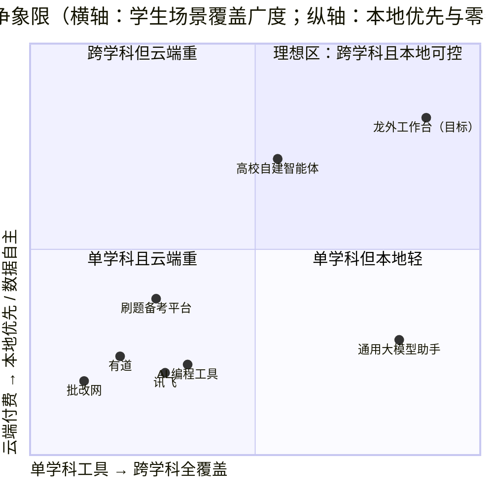
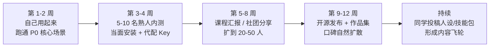
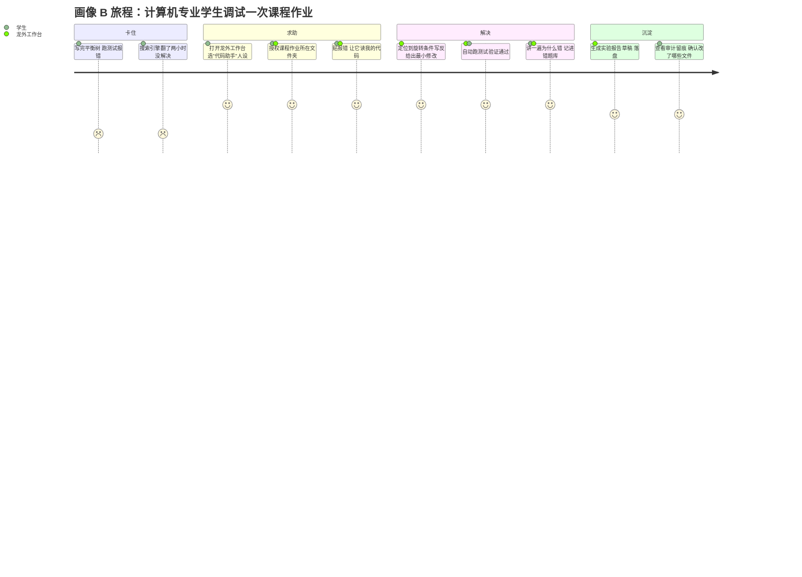
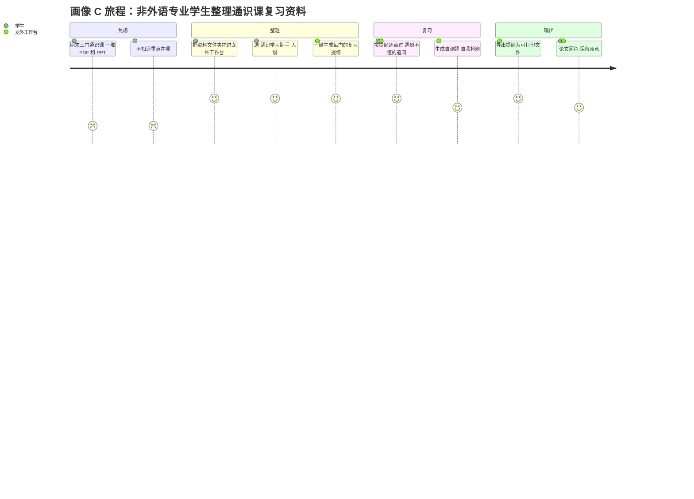
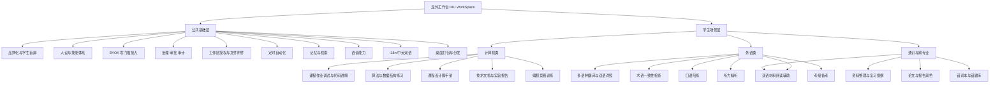
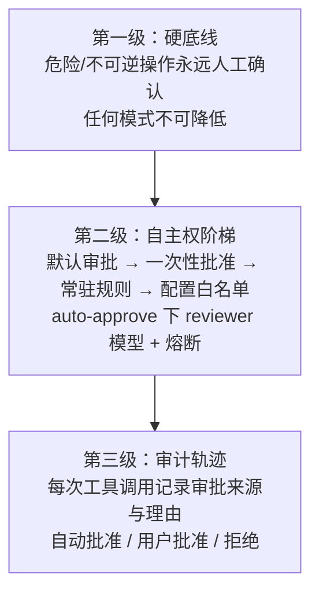
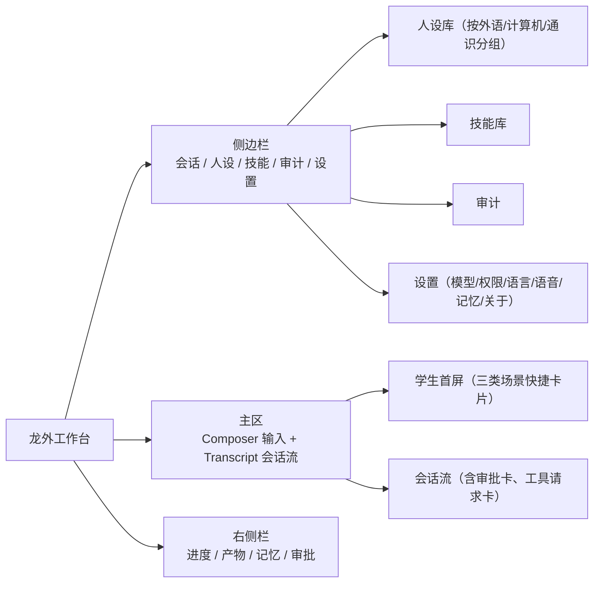
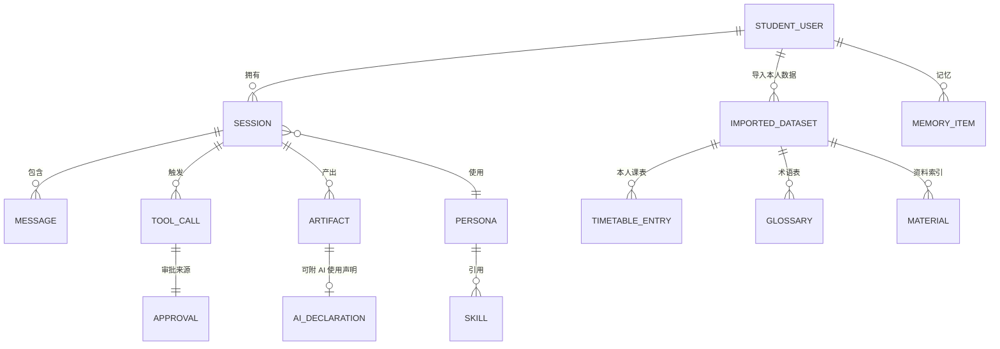
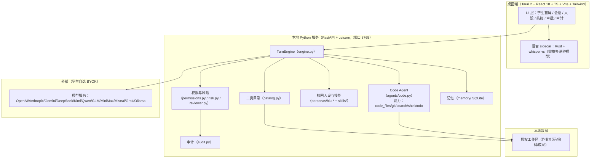
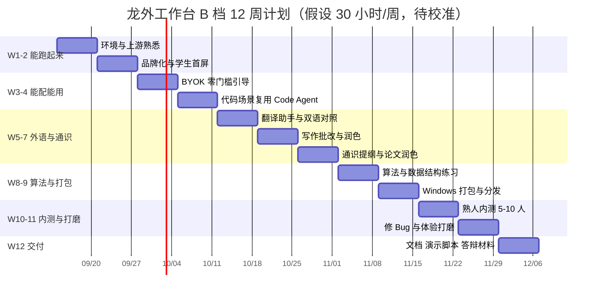

# 龙外工作台（HIU WorkSpace）产品需求文档

> 本文档为**完整版 PRD v2.0**。
> 写作约束：简体中文；无 emoji；凡涉及黑龙江外国语学院（下称"龙外"）的具体事实数据，均已标注来源与检索日期，未能核实的一律标注「（假设，待确认）」或列入第 15 章。
> 所有功能均锚定本仓库（开源项目 OpenWorker，MIT 协议）中**真实存在**的代码能力。二开策略三选一：复用现有能力 / 改造现有能力 / 全新开发。
> **重要声明**：本项目为**学生个人发起的课程作业 / 实践项目**，不代表黑龙江外国语学院官方立场。文中所有校方数据仅作为产品所处的环境背景使用。

---

## 0. 文档信息与修订记录

| 项 | 内容 |
|---|---|
| 文档名称 | 龙外工作台（HIU WorkSpace）产品需求文档（完整版） |
| 版本号 | **v2.0** |
| 文档状态 | 评审稿（第 15 章剩余开放问题待用户拍板） |
| 编写日期 | 2026-09-08 |
| 作者 | 许清楚（产品经理） |
| 交付负责人 | 齐活林（交付总监） |
| 项目性质 | **学生个人课程作业 / 实践项目**（非校方立项项目，无校内对接人） |
| 目标用户 | **仅黑龙江外国语学院的在校学生**（外语类 / 计算机类 / 其他非外语类） |
| 上游项目 | OpenWorker（`light-misty/HIU-WorkSpace`），MIT 协议，基于 aisuite 构建 |
| 本仓库路径 | `D:\DeskTop\HIU-WorkSpace` |
| 关联文档 | `README.md`、`AGENTS.md`、`docs/config.example.toml` |

### 修订记录

| 版本 | 日期 | 修订人 | 修订内容 |
|---|---|---|---|
| v0.1 | 2026-09-08 | 许清楚 | 仓库能力盘点，确认四个已拍板前提 |
| v0.5 | 2026-09-08 | 许清楚 | 竞品检索与政策合规检索，形成分析结论 |
| v1.0 | 2026-09-08 | 许清楚 | 完整版 PRD 成稿（学生 + 教师 + 管理员三端） |
| **v2.0** | **2026-09-08** | **许清楚** | **重大范围修订，见下表 v1.0 → v2.0 变更明细** |

### v1.0 → v2.0 变更明细

| 编号 | 变更类型 | 变更内容 | 触发原因 |
|---|---|---|---|
| C-01 | **用户答复** | Q-01 试点期模型费用确定为**严格 BYOK、学生自付 API Key**；删除"争取院系统一采购共享 Key"的全部表述 | 用户明确答复 |
| C-02 | **用户答复** | 确认**没有校内对接人**，本项目是用户本人（学生）的课程作业 / 个人项目；删除一切依赖校方立项、决策流程的表述 | 用户明确答复 |
| C-03 | **用户答复** | 确认**学校没有制定任何 AI 使用管理办法**；删除"合规配置下发""校方审核流程"等依赖校方制度的功能 | 用户明确答复 |
| C-04 | **用户答复** | 试点用户面向**任何普通学生**，取消院系/种子名单限定 | 用户明确答复 |
| C-05 | **范围收窄** | **产品角色从"学生 + 教师 + 管理员"三端收窄为"仅学生"单一角色** | 用户指示 |
| C-06 | **范围删除** | 删除全部教师端内容：教师画像、教师场景、教师端功能（教案/命题/批量批改/量规管理）、教师端权限与数据边界；里程碑 M3（教师核心场景）整体移除 | C-05 连带 |
| C-07 | **范围删除/降级** | 删除管理端；原管理端 P0「合规配置下发」降级为 P2「本地合规默认配置」 | C-03 连带 |
| C-08 | **结构重构** | 第 5 章功能规划重构为「公共基础 + 学生场景」两层，取消教师端/管理端分组；第 6 章改为「角色范围界定与后期扩展」 | C-05 连带 |
| C-09 | **P0 压缩** | P0 从 25 项压缩到 **12 项**，每项标注工作量判断依据；被降级项移至 P1/P2 并说明降级理由 | 用户指示（单人学生作业不可交付 25 项） |
| C-10 | **用户群体扩展** | 学生画像重做为三类：A 外语类、B 计算机/信息技术类、C 其他非外语类；每类独立的目标、痛点、场景与用户旅程；新增计算机专业场景并核实其可复用资产 | 用户指示 |
| C-11 | **立项理由改写** | 第 1 章立项理由由"校方需求"改为"学生自主发起的课程作业/实践项目"；校方数据降级为环境背景；WDAU 与"试点 ≥300 人"目标作废 | C-02 连带 |
| C-12 | **推广路径改写** | 第 3 章由"校方立项 + 院系试点"改为**同学自发传播路径**；商业模式章节改为"本项目不商业化" | C-02 连带 |
| C-13 | **合规重判** | 第 7 章合规驱动力改为"国家法规要求 + 学术诚信自律"；「AI 生成内容标识」由 P0 降为 **P1（保留最简显式标识）**，理由见 7.8 | 用户指示 + 产品判断 |
| C-14 | **数据模型简化** | 第 9 章取消"教师导入他人学生数据"相关的实体、表与清理策略；隐私分级重做 | C-05 连带 |
| C-15 | **里程碑重排** | 第 11 章由 26 周改为单人一学期量级，给出 **8 周 / 12 周 / 16 周**三档可裁剪方案 | 用户指示 |
| C-16 | **风险重写** | 第 13 章风险成因与应对重写：重点变为无校内对接人、单人开发人力、同学无 Key、课程评分标准不确定、上游同步；移除依赖校方决策的风险项 | C-02 连带 |
| C-17 | **问题清单重做** | 第 15 章删除已被答复的 Q-01~Q-05 与校方制度类问题，新增作业交付截止时间、评分标准、是否需要可运行原型、单人每周工时等 | 用户指示 |
| C-18 | **竞品调整** | 竞品集合改为学生视角 7 款：新增「AI 编程工具」与「刷题备考平台」，移除机构向的「校园数字化厂商全域智能体」「教学平台内置 AI」；象限图按"纯学生 + 多专业"定位重绘 | C-05/C-10 连带 |
| C-19 | **事实核实补充** | 核实工程向人设后发现：`swe-worker`/`test-worker`/`change-worker`/`design-worker` 均标 `ships: false` 且为 `team: worker`（只对 lead 说话、永不使用 ask_user），**不可直接复用给学生**；真正可直接复用的是 `coworker/agents/code.py` 这一 solo 编码代理。详见 10.3 与 16.1 | 自主核实 |

---

## 1. 项目背景与目标

### 1.1 项目性质（v2.0 重写）

| 项 | 说明 |
|---|---|
| 项目发起方 | **一名学生**（本项目作者本人），非校方、非院系 |
| 项目性质 | 课程作业 / 个人实践项目 |
| 是否有校内对接人 | **无** |
| 是否代表校方立场 | **否** |
| 是否有校方制度依托 | **无**（学校未制定任何 AI 使用管理办法） |
| 交付目标 | 向课程评审方证明：能在开源项目基础上完成一次有产品思考、有工程落地、可运行的二次开发 |
| 用户获取方式 | 同学自发传播（无组织渠道、无预算、无制度推动） |

> 这一性质决定了本 PRD 的所有取舍原则：**可交付 > 完整，可演示 > 全面，真实可用 > 规划宏大**。v1.0 中一切依赖"校方立项 / 院系试点 / 制度下发"的设计在本版本中全部作废。

### 1.2 环境背景（原"校方背景"，降级为环境描述）

> 以下数据用于说明产品所处的用户环境，**不代表本项目获得校方支持或授权**。来源：hiu.edu.cn 各官方页面，检索日期 2026-09-08。

| 事实 | 数值 | 来源页面 | 备注 |
|---|---|---|---|
| 学校性质 | 黑龙江省唯一一所语言类本科高校，民办 | `hiu.edu.cn/zjlw1/lwjj.htm`、`hr.hiu.edu.cn` | 已核实 |
| 外语语种 | **11 个外语语种** | 首页、`hr.hiu.edu.cn` | 已核实 |
| 本科专业数 | 32 个（招聘启事）/ 34 个（首页） | `hr.hiu.edu.cn`、`hiu.edu.cn` | **口径不一致，待确认** |
| **外语类 vs 非外语类专业各多少** | **官网无明确口径** | — | **（假设，待确认）**：从专业清单看，外语类约 10-12 个（英/俄/日/法/西/德/意/阿/葡/朝/翻译/商务英语），非外语类约 20 余个（计算机科学与技术、软件工程、数据科学与大数据技术、数字媒体技术、国际经济与贸易、市场营销、财务管理、人力资源管理、电子商务、国际商务、网络与新媒体、环境设计、视觉传达设计、动画、汉语言文学、汉语国际教育等）。**此为按公开专业名单人工归类的估计，非官方统计** |
| 全日制本科在校生 | 11709 人 | `hr.hiu.edu.cn` | 另见 10136 人（简介页）、8822 人（信息公开页），均为更早口径 |
| 二级学院 | 10 个 | `hr.hiu.edu.cn` | 已核实 |
| 信息化基础 | 华为全光校园网、智慧教室 198 间、智慧教学云平台 | `hr.hiu.edu.cn` | 已核实（本项目不使用、不对接） |
| 校方 AI 意愿 | 翻译专业设"智能翻译"方向、英语专业设"数智创新班"；2026-08 承办全国"人工智能赋能翻译教学研修班" | 首页新闻 | 已核实。说明校内对 AI+外语有氛围，利于同学自发传播，但**本项目与这些官方动作无关** |

**关键推论**：龙外并非只有外语专业。**计算机科学与技术、软件工程、数据科学与大数据技术、数字媒体技术**等工科专业同样存在（按公开专业名单，非外语类专业数量可能多于外语类专业——**（假设，待确认）**）。因此一个只做外语场景的工具会浪费掉一半以上的潜在同学用户。这是 v2.0 扩展学生群体的直接依据。

### 1.3 法规与行业背景（保留，作为合规判断依据）

| 时间 | 文件/事件 | 对本项目的意义 | 来源 |
|---|---|---|---|
| 2023-08-15 | 《生成式人工智能服务管理暂行办法》施行 | 规制对象是"**利用生成式人工智能技术向中华人民共和国境内公众提供生成式人工智能服务**"的主体；本项目为本地桌面工具、不向公众提供服务，不属于该办法的规制对象（判断见 7.8） | 新华社 2025-09-02 报道援引 |
| 2025-03-07 发布 / **2025-09-01 施行** | 《人工智能生成合成内容标识办法》（国信办通字〔2025〕2 号） | 第二条适用范围为"**网络信息服务提供者**"；第十条规定**用户**主动声明义务。义务主体判定见 7.8 | 中央网信办 cac.gov.cn（2025-03-14）；新华社（2025-09-01） |
| 2025-05 | 《中小学生成式人工智能使用指南（2025 年版）》 | 明确"禁止学生直接复制人工智能生成内容作为作业或考试答案"；虽面向中小学，但为本项目"学术诚信自律"设计提供参照口径 | 人民网教育频道 2025-05-13；教育部基础教育教学指导委员会 |
| 2026-04 | 教育部等 5 部门《"人工智能+教育"行动计划》 | 高等教育阶段推动人工智能成为公共基础课程，说明学生使用 AI 已是大势所趋 | 人民日报 / 中国共产党新闻网（2026-08-23） |

补充数据（新华社 2025-09-01）：我国已有 **490 余款大模型**在网信办备案，**240 余款**在省级网信办登记，生成式 AI 产品用户规模达 **2.3 亿人**。

### 1.4 现状痛点（学生视角，v2.0 重写）

#### 1.4.1 三类学生共有的痛点

| 编号 | 痛点 | 说明 |
|---|---|---|
| P-1 | 通用 AI 不懂"本校这门课的要求" | 通用大模型给的是通用答案，不知道老师的评分习惯、课程的知识点范围、教材的章节结构 |
| P-2 | 工具与资料散落 | 词典、翻译、IDE 插件、笔记、题库分散在多个 App，来回切换，上下文断裂 |
| P-3 | 学习过程没有沉淀 | 错题、错词、踩过的坑用完就散，下次从头再来 |
| P-4 | BYOK 门槛 | 需要自己搞到 API Key，还要会配置、会选型、会控制花费。这是同学使用本产品的**第一道也是最大的一道门槛** |
| P-5 | AI 使用与学术诚信边界模糊 | 学校没有管理办法，学生自己也不知道"用了该怎么说" |
| P-6 | 电脑配置与网络参差 | 学生机性能与网络条件不一，重依赖云端的方案对部分同学不可用 |

#### 1.4.2 外语类专业学生痛点

| 编号 | 痛点 |
|---|---|
| PA-1 | 通用 AI 改作文只给"更通顺的版本"，不给**按评分量规的分项诊断** |
| PA-2 | 翻译练习缺少统一术语表与风格约束，输出与课堂要求脱节 |
| PA-3 | 口语/听力缺少陪练对象：按 11709 名在校生 / 523 名专任教师估算师生比约 **22:1**（**估算，基于上述公开数据自算，非官方口径**），课堂练习时间有限 |
| PA-4 | 11 个语种中，小语种（阿、葡、意、朝等）的 AI 工具支持明显弱于英语 |

#### 1.4.3 计算机/信息技术类专业学生痛点

| 编号 | 痛点 |
|---|---|
| PB-1 | 课程作业调试靠"报错信息 + 搜索引擎"，缺少在自己代码库上下文里的连续排错 |
| PB-2 | 拿到别人的代码/开源项目看不懂，缺少"在我这份代码里讲给我听"的引导 |
| PB-3 | 算法与数据结构练习缺少"分题型、循序渐进、能当场验证"的陪练 |
| PB-4 | 课程设计/毕业设计从零搭脚手架耗时，且不知道业界常规结构 |
| PB-5 | 实验报告、技术文档、README 写作耗时且不被重视 |
| PB-6 | 编程竞赛训练缺少针对性复盘 |

#### 1.4.4 其他非外语专业学生痛点

| 编号 | 痛点 |
|---|---|
| PC-1 | 通识课资料杂（PDF、PPT、扫描件），复习时缺少结构化提纲 |
| PC-2 | 论文、读书报告、调研报告写作与润色耗时 |
| PC-3 | 同样要考四六级，但缺少专业化的备考辅助 |
| PC-4 | 部分课程有双语/外文材料，阅读门槛高 |

### 1.5 产品定位（一句话，v2.0 更新）

> **龙外工作台是一款运行在学生自己电脑上的、本地优先的 AI 学习伙伴桌面应用：用一个 App 同时服务外语类、计算机类和其他专业的同学，把翻译、写作、口语、代码调试、算法练习、复习提纲等真实学习任务做成可落盘的成果，并且每一次 AI 动作都留痕、可查、可控。**

差异化关键词：**本地优先（自己的电脑、自己的 Key、自己的数据）· 跨学科（外语 + 计算机 + 通识）· 人设与技能可自己扩展 · 三级治理可审计 · 不绑定模型 · 不联网到任何校内系统也能用**。

### 1.6 已拍板前提（v1.0 四项 + v2.0 新增三项）

| 编号 | 前提 | 来源 | 对设计的影响 |
|---|---|---|---|
| A1 | **首发交付形态为桌面端**（沿用现有 Tauri + 本地 Python 服务架构），本地优先、数据不出机 | v1.0 | 不做 Web 端；功能必须在 Windows 桌面壳内可用 |
| A2 | **暂不与学校现有系统对接**（教务、学工、一卡通、图书馆、统一身份认证）；课表等一律**文件手动导入** | v1.0 | 数据层围绕"文件导入 + 本地解析"；无统一身份认证 |
| A3 | **模型 BYOK，学生自付 API Key**，沿用现有多提供商接入 | v1.0 + 用户答复（严格化） | 不设计学校统一配额；必须做好"无 Key / Key 失效 / 余额耗尽"的降级与引导 |
| A4 | **完整版 PRD**：含竞品分析 5-7 款、Mermaid 象限图、市场定位与推广路径 | v1.0 | 第 2、3 章 |
| **A5** | **产品仅面向学生单一角色**，教师端与管理端不在范围内 | **v2.0 新增（用户指示）** | 全文删除教师/管理端；第 6 章说明后期扩展路径 |
| **A6** | **无校内对接人、无校方制度依托**，项目为学生个人课程作业 | **v2.0 新增（用户答复）** | 一切依赖校方组织与制度的设计作废；推广靠同学自发传播 |
| **A7** | **学生群体覆盖外语类、计算机类、其他非外语类三类** | **v2.0 新增（用户指示）** | 画像、场景、人设均需同时服务三类；计算机场景要充分利用仓库既有代码能力 |

### 1.7 产品目标（Product Goals，v2.0 重设）

| 编号 | 目标 | 可度量口径（作业可验证） |
|---|---|---|
| G1 | 让三类学生各自的高频学习任务能在**本地**完成并产出可落盘成果 | 三个 P0 场景（代码调试、外语写作批改、翻译）各完成 ≥ 10 次真实任务并成功落盘 |
| G2 | 用"人设 + 技能"承载学科差异，证明内容驱动的可扩展性 | 交付 ≥ 4 个校园人设 + ≥ 6 个技能包，全部可安装、可切换、可生效 |
| G3 | 保留上游治理能力，让 AI 使用可审计、可解释 | 100% 工具调用留痕并可在审计视图中回放 |
| G4 | 作为课程作业，证明对开源项目的理解与二开能力 | 明确区分"复用 / 改造 / 新建"并在交付文档中逐项说明 |

### 1.8 成功度量指标（v2.0 重设）

> 原 v1.0 的 WDAU 与"试点 ≥300 人"目标因项目性质变更**已作废**。以下为作业可验证的小规模目标，全部标注为假设。

| 层级 | 指标 | 定义 | 目标值（**假设，待校准**） |
|---|---|---|---|
| 交付 | P0 完成率 | 12 项 P0 中通过验收条目的比例 | 100% |
| 可用 | 核心场景任务成功率 | 随机抽取 15 个真实学习任务，能跑通并产出成果的比例 | ≥ 80% |
| 可用 | 冷启动成功率 | 让一个从未用过的同学从安装到完成第一个任务（无人指导）的成功率 | ≥ 60% |
| 规模 | 内测人数 | 实际安装并使用过的同学数 | 20-50 人 |
| 留存 | 二次使用率 | 内测同学中使用 ≥ 2 次的比例 | ≥ 50% |
| 质量 | 成果采纳率 | 生成的成果被"保留/导出/继续编辑"的比例 | ≥ 65% |
| 工程 | 治理完整率 | 工具调用有完整 approval provenance 的比例 | 100%（硬性） |
| 工程 | 二开可解释性 | 每项交付功能能说清"复用/改造/新建"及对应代码位置 | 100%（作业要求） |

---

## 2. 竞品分析

### 2.1 竞品选取说明（v2.0 调整）

产品定位收窄为"**仅面向学生**"后，竞品集合改为**学生视角** 7 款，覆盖四类：**学生日常在用的通用 AI**、**计算机学生的 AI 编程工具**、**外语学生的垂直工具**、**刷题备考平台**、以及**学校可能发给学生的替代方案**。

**v1.0 → v2.0 竞品集合变更**：

| 变更 | 竞品 | 原因 |
|---|---|---|
| 移除 | 校园数字化厂商全域智能体（企鹅 AI 校园等） | 面向校方采购与系统集成，与学生个人使用场景无关 |
| 移除 | 教学平台内置 AI（雨课堂/超星等） | 面向教师教学流程，与学生个人使用场景无关 |
| **新增** | **AI 编程工具（GitHub Copilot / Cursor / 通义灵码 / CodeGeeX）** | 计算机类专业学生是本次新增的目标用户，这是他们的默认选项 |
| **新增** | **刷题备考平台（LeetCode / 牛客 / 扇贝 / 墨墨等）** | 覆盖算法练习与考级备考场景 |

### 2.2 逐款分析

#### 竞品 1：通用大模型助手（ChatGPT / 豆包 / DeepSeek / Kimi 等）

| 项 | 内容 |
|---|---|
| 形态 | Web / App，云端 |
| 优势 | 能力最强、覆盖最广；学生零学习成本、已在用；支持多语种；可上传文件与数据分析；多数有免费额度 |
| 劣势 | 不懂本校课程要求；数据出机；无法与本地代码库/资料库联动；无学习沉淀；无审批与留痕；高峰期不稳定 |
| 威胁等级 | **最高**。这是"不作为"的默认选项，也是本项目所有场景的及格线 |
| 数据来源 | 公开产品体验；规模数据见新华社 2025-09-01（我国生成式 AI 产品用户规模 2.3 亿人） |

#### 竞品 2：AI 编程工具（GitHub Copilot / Cursor / 通义灵码 / CodeGeeX）

| 项 | 内容 |
|---|---|
| 形态 | IDE 插件 / 独立编辑器，云端 |
| 优势 | 深度嵌入编码流程；补全与重构体验成熟；Cursor 类产品可对话式操作整个代码库；Copilot 对学生**免费**（GitHub Student Pack，公开资料，具体政策以官方为准） |
| 劣势 | 只解决"写代码"，不解决"学编程"——不会按课程知识点循序渐进讲题、不会生成实验报告；数据出机；不覆盖外语与通识场景；付费版对无收入学生是门槛 |
| 威胁等级 | **高**（对计算机类学生）。这是本项目在计算机场景上不可回避的对手 |
| 差异化机会 | 本项目**不与它们比编码能力**，而是做它们不做的事：**结合本地代码库的连续调试 + 讲解**、**算法分题型陪练**、**课程设计脚手架**、**实验报告与技术文档生成** |
| 数据来源 | 公开产品体验；具体用户规模与价格**公开资料未披露** |

#### 竞品 3：批改网（句酷批改网，北京词网科技有限公司，pigai.org）

| 项 | 内容 |
|---|---|
| 形态 | Web，云端 |
| 关键数据 | 2011-06-28 上线；截至 2025-12 **累计批改作文超 11 亿篇**（百度百科，引用日期 2026-01）；官网自述"**超过 5000 所学校**在使用"，首页计数器显示"正在批改第 1,167,268,878 篇"（检索日 2026-09-08） |
| 优势 | 外语写作智能批改领域的在位者；按句点评、中式英语识别、抄袭检测成熟；承办"批改网杯"全国大学生英语写作/翻译大赛 |
| 劣势 | 只做英语作文评分一件事；SaaS 云端、数据出机；反馈颗粒度偏"评分器"而非"教学法"；教师/学生无法自定义本校量规（**公开资料未披露深度自定义能力，待确认**） |
| 威胁等级 | 中（外语类学生的写作场景） |
| 关系 | 既是竞品也是标杆：它证明了外语写作智能批改的需求真实存在；本项目以"本地不出机 + 量规可自定义"形成差异 |
| 数据来源 | pigai.org 官网（检索日 2026-09-08）；百度百科"批改网"词条（引用日期 2026-01/2026-02） |

#### 竞品 4：有道（有道翻译 / 有道领世 / 子曰大模型）

| 项 | 内容 |
|---|---|
| 形态 | App / Web / 硬件，云端 |
| 优势 | 外语学习与翻译国民级心智；词典与语料积累深；多语种；C 端体验成熟；免费额度充足 |
| 劣势 | 面向 C 端泛学习，不面向"本校课程流程"；无本地化；不解决计算机与通识场景；无学习沉淀 |
| 威胁等级 | 中 |
| 数据来源 | 公开产品体验；用户规模**公开资料未披露** |

#### 竞品 5：科大讯飞（星火大模型 / 讯飞听见）

| 项 | 内容 |
|---|---|
| 形态 | 云端 + 软硬一体 |
| 优势 | 语音技术（识别、评测、同传字幕）国内积累最深；听说训练场景成熟 |
| 劣势 | 重云端；口语评测是订阅服务；不覆盖计算机与通识；学生付费门槛 |
| 威胁等级 | 中（外语类学生的口语场景） |
| 数据来源 | 公开产品与行业报道；具体高校客户数与价格**公开资料未披露** |

#### 竞品 6：刷题备考平台（LeetCode / 牛客 / 扇贝 / 墨墨等）

| 项 | 内容 |
|---|---|
| 形态 | Web / App，云端 |
| 优势 | 题库与判题成熟；社区题解丰富；有打卡与进度体系；四六级/考研词汇类产品用户基数大 |
| 劣势 | 题库固定，不能按本人薄弱点动态生成；不结合本人代码与资料；数据出机；与本校课程无关 |
| 威胁等级 | 中 |
| 差异化机会 | 本项目做"**基于本人错题与本人资料**的个性化练习生成"，而非又一个题库 |
| 数据来源 | 公开产品体验；具体用户规模**公开资料未披露** |

#### 竞品 7：高校自建智能体（清华"清小搭"、北航"AI 领航员"、北邮"人人有算力"等）

| 项 | 内容 |
|---|---|
| 形态 | 校内平台 / 公众号 / 小程序，打通校内数据 |
| 关键数据 | 清华"清小搭"2026-08-01 上线，校方称基于校内大数据与知识增强生成技术，回答准确率**超 98%**（**学校自述，非第三方评测**）；北航"AI 领航员"服务 2026 级 5000 余名本科新生迎新；北邮 2026-09 起实施"人人有算力"计划，为每名本科新生配个人 AI 算力账户，平台集成 10 余种主流大模型；中南大学"小麓/小南"采用本地化部署 |
| 优势 | 打通校内数据与流程；校方背书，学生信任度高；算力与费用问题由学校解决 |
| 劣势 | 头部高校才有能力做；场景偏"事务问答/迎新"，对学习深水区（批改、翻译、算法陪练）覆盖有限；**龙外是否计划建设同类平台未知**（**假设，待确认**） |
| 威胁等级 | 中低（对本项目而言是"未来可能被替代"的风险，而非当下的直接对手） |
| 数据来源 | 北京日报（2026-09-06）；央视网（2026-08-31） |

### 2.3 竞品对比总表

| 维度 | 龙外工作台（目标） | 通用大模型助手 | AI 编程工具 | 批改网 | 有道 | 讯飞 | 刷题备考平台 | 高校自建智能体 |
|---|---|---|---|---|---|---|---|---|
| 部署形态 | **本地桌面** | 云端 | IDE/云端 | 云端 | 云端 | 云端 | 云端 | 校内平台 |
| 数据不出机 | **是** | 否 | 否 | 否 | 否 | 否 | 否 | 部分 |
| 覆盖外语场景 | **是** | 部分 | 否 | 仅写作 | 是 | 听说强 | 词汇/考级 | 弱 |
| 覆盖计算机场景 | **是** | 部分 | **强** | 否 | 否 | 否 | 算法题 | 弱 |
| 覆盖通识/跨专业 | **是** | 是 | 否 | 否 | 否 | 否 | 部分 | 弱 |
| 结合本人本地资料/代码库 | **是** | 否（需上传） | 是（代码库） | 否 | 否 | 否 | 否 | 部分 |
| 学习沉淀（错题/错词/记忆） | **是** | 弱 | 否 | 有进度报告 | 有单词本 | 有 | 有 | 弱 |
| 模型可替换 / BYOK | **是** | 否 | 部分 | 否 | 否 | 否 | 否 | 部分 |
| 人设/技能可自己扩展 | **是** | 否 | 否 | 否 | 否 | 否 | 否 | 否 |
| 审批 / 审计 / 留痕 | **三级治理 + 全审计** | 无 | 部分 | 无 | 无 | 无 | 无 | 视实现 |
| 学生获取成本 | 安装 + 自备 Key | 注册即用 | 安装（部分免费） | 注册即用 | 注册即用 | 注册即用 | 注册即用 | 学校发放 |
| 主要短板 | **需自备 Key、单人开发功能深度有限** | 不专业/数据出机 | 只做编码 | 场景单一 | 场景单一 | 场景单一 | 题库固定 | 依赖学校投入 |

### 2.4 竞争象限图（v2.0 重绘）



### 2.5 差异化结论

1. **空位依然存在，但性质变了**：v1.0 的空位是"外语教学垂直 × 本地轻量"；v2.0 的空位是"**跨学科全覆盖 × 本地可控**"——市面上没有任何一款学生工具同时服务外语、计算机和通识三类场景且数据留在本地。
2. **不正面硬碰**：不与 Copilot/Cursor 比编码能力，不与批改网比语料规模，不与通用大模型比聪明程度。
3. **本项目真正能赢的三点**：
   - **一个 App 管三类专业的学习任务**——这是所有单点工具做不到的；
   - **结合本人本地资料与本人代码库**——通用 AI 需要你上传，本项目直接读你的工作区；
   - **内容开放可扩展**——同学可以自己写人设和 SKILL.md，工具随课程演进（复用 `coworker/personas/`、`coworker/skills/`）。
4. **必须承认的劣势**：需要自备 API Key，这是所有云端竞品没有的门槛。BYOK 引导（P0-03）因此成为决定产品生死的环节，而非一个设置页。

---

## 3. 市场定位与推广路径

### 3.1 市场定位

| 项 | 定位 |
|---|---|
| 目标用户 | 龙外在读本科生，覆盖外语类 / 计算机类 / 其他非外语类三类 |
| 切入场景 | 学生的高频学习任务：代码调试、算法练习、翻译、外语写作、口语、复习提纲、论文润色 |
| 价值主张 | 一个 App 管三类专业 + 本地不出机 + 人设技能自己扩展 + 全审计可查 + 不绑定模型 |
| **不商业化** | **本项目不商业化**（课程作业性质）。无付费计划、无营收目标；所有模型费用由使用者（同学）自行承担（A3） |
| 不服务的场景 | 教师备课与批改（A5）、校内事务问答、教务流程、需要统一身份认证的场景 |

### 3.2 目标用户规模

- 可触达总规模：在校本科生约 **11709 人**（来源 `hr.hiu.edu.cn`，检索日 2026-09-08）。
- 现实内测目标：**20-50 人**（**假设，待校准**），来自作者本人的同学圈。
- 中期想象空间：若产品被同学自发接受，理论上限是全校本科生规模；但**本项目不以规模为目标**，以内测验证与作业交付为目标。

### 3.3 推广路径：同学自发传播（v2.0 重写）

> 无校方渠道、无预算、无制度推动。唯一可行的路径是**产品自身足够好用，让用过的人愿意推荐给下一个人**。



| 阶段 | 动作 | 关键成功因素 |
|---|---|---|
| **自己先用** | 作者本人把三个 P0 场景（代码调试、翻译、写作批改）用满两周，修掉所有"自己都不想用"的地方 | 自己都不用的功能不可能让同学用 |
| **熟人内测（5-10 人）** | 当面帮忙装、帮忙配 Key、陪跑第一个任务。**不要发链接让别人自己装** | 冷启动成功率是唯一 KPI；每人记录"卡在哪一步" |
| **课程汇报引爆** | 在课程汇报 / 答辩现场演示真实场景（不是截图）；会后提供一键安装包 + 三分钟上手视频 | 现场演示 > 任何文档 |
| **社群扩散** | 班级群、专业群、社团群、Lab 群发放；**每个群附一句"不会配 Key 的同学我可以帮你配"** | 降低 BYOK 门槛是扩散的前提 |
| **开源发布** | 以 MIT 协议发布到 GitHub，README 写清"基于 OpenWorker 二次开发"，作为作品集素材 | 遵守上游 MIT 与署名要求（`LICENSE`、`AGENTS.md`） |
| **内容飞轮** | 鼓励同学投稿自己写的人设/技能包，作者审核后收录 | 复用 `/v1/skills/upload` 与 `/v1/personas/install` |

### 3.4 推广杠杆与反杠杆

| 类型 | 项 | 说明 |
|---|---|---|
| 杠杆 | 课程汇报 / 答辩现场演示 | 本项目作为课程作业，汇报现场是最集中的曝光机会 |
| 杠杆 | 计算机专业同学的技术影响力 | 计算机类学生更愿意尝试新工具、也更愿意给反馈，是天然的种子用户 |
| 杠杆 | 开源与作品集价值 | 对计算机类同学而言"参与一个开源二开项目"本身就是吸引力 |
| 杠杆 | 校内 AI 氛围 | 校方已承办"人工智能赋能翻译教学研修班"（检索日 2026-09-08），同学对 AI 话题不陌生 |
| **反杠杆** | **BYOK 门槛** | 同学没有 Key、不会配 Key、怕花钱——这是扩散的最大阻力。必须靠"当面帮忙配 + 推荐低价模型 + Ollama 本地兜底"对冲 |
| **反杠杆** | **无组织背书** | 没有院系通知，只能靠个人信用背书传播，速度慢 |
| **反杠杆** | **Windows 未签名** | README 明确 Windows 构建未签名，SmartScreen 会告警，同学可能不敢装。需在安装说明中提前说明（见 Q-09） |

---

## 4. 用户画像与场景分析

### 4.1 画像 A：外语类专业学生

| 项 | 内容 |
|---|---|
| 代表 | 英语、俄语、日语、翻译、商务英语等专业学生（11 语种） |
| 特征 | 每天有固定晨读/听力时间；对 AI 有基础认知（用过通用助手查词改句）；**对费用敏感**；小语种同学可选工具明显少于英语 |
| 目标 | 短期通过专四专八 / 四六级 / 雅思托福；中期提升口语与写作；长期获得翻译、外贸、留学机会 |
| 痛点 | PA-1 至 PA-4 |
| 典型场景故事 | "老师布置 3000 字俄译汉技术文本，要求附术语表与译后编辑说明。我先在通用 AI 里翻了一版，术语前后不一致，改了三遍还是被退回来。" |
| 关键设计启示 | 必须提供**按量规的分项诊断 + 可执行修改路径**；必须支持**术语表约束**；口语陪练要能"一句一句来"；**小语种的支持质量不能明显低于英语** |


### 4.2 画像 B：计算机 / 信息技术类专业学生

| 项 | 内容 |
|---|---|
| 代表 | 计算机科学与技术、软件工程、数据科学与大数据技术、数字媒体技术等专业学生 |
| 特征 | 已在用 Copilot / Cursor / 通义灵码等工具；对命令行、Git、IDE 熟悉；愿意折腾配置（**API Key 门槛对这类同学最低**）；对工具质量挑剔 |
| 目标 | 快速完成课程作业与课程设计；提升算法与工程能力；做出能放进简历/作品集的项目 |
| 痛点 | PB-1 至 PB-6 |
| 典型场景故事 | "数据结构作业要求实现一个平衡树，我照着网上的代码抄了一份，跑不通，报错看不懂，在搜索引擎里翻了两个小时。" |
| 关键设计启示 | **不要和 Copilot 比补全**，要做"**在我这份代码里连续排错 + 讲清楚为什么**"；算法陪练要能**当场运行验证**；课程设计要有**可落地的脚手架**；实验报告生成要贴合本校模板 |



### 4.3 画像 C：其他非外语专业学生

| 项 | 内容 |
|---|---|
| 代表 | 国际经济与贸易、市场营销、财务管理、人力资源管理、电子商务、国际商务、汉语言文学、汉语国际教育、环境设计、视觉传达设计、动画、网络与新媒体等专业学生 |
| 特征 | 外语是工具不是专业；要考四六级；通识课多、资料杂；对技术工具的耐心低于计算机类同学 |
| 目标 | 用最少的时间完成通识课作业、论文、报告；顺手过四六级 |
| 痛点 | PC-1 至 PC-4 |
| 典型场景故事 | "期末三门通识课，每门都是一堆 PDF 和 PPT，我不知道重点在哪，也不知道从哪开始复习。" |
| 关键设计启示 | 必须**零配置可用**（这类同学最可能卡在 Key 配置）；资料整理要**一键拖入文件夹出提纲**；论文润色要"保留我的意思、只改表达"；界面要足够简单 |



### 4.4 三类画像的共性与差异

| 维度 | A 外语类 | B 计算机类 | C 其他非外语类 |
|---|---|---|---|
| 技术耐心 | 中 | **高** | **低** |
| BYOK 门槛承受度 | 中 | **高** | **低** |
| 首选场景 | 翻译 / 写作 / 口语 | 代码调试 / 算法 | 资料整理 / 论文润色 |
| 成果形态偏好 | 文稿（译稿、作文） | 代码 + 报告 | 提纲 + 文稿 |
| 对"人设"的理解成本 | 中 | 低 | **高**（需要更直白的命名） |
| 最可能流失的原因 | 小语种效果差 | 不如 Copilot 好用 | 配 Key 配不上 |

### 4.5 场景优先级矩阵

| 场景 | 归属画像 | 用户价值 | 竞品替代难度 | 单人开发成本 | 优先级 |
|---|---|---|---|---|---|
| 课程作业调试与代码讲解 | B | 高 | 中（Copilot 强） | **低（复用 Code Agent）** | **P0** |
| 多语种翻译 + 双语对照 | A | 高 | 中 | 低（技能） | **P0** |
| 外语写作批改与润色 | A | 高 | 中高 | 低（技能） | **P0** |
| 口语陪练（转写 + 纠错） | A | 高 | 中 | **中（STT 改造）** | **P0** |
| 算法与数据结构练习 | B | 中高 | 中 | 低（技能） | **P0** |
| 通识资料整理与复习提纲 | C | 高 | 中 | 中（导入解析） | **P0** |
| BYOK 零门槛配置引导 | 全部 | **极高** | 不适用 | 低 | **P0** |
| 论文 / 读书报告润色 | A/B/C | 中高 | 低 | 低（技能） | **P0** |
| 课程设计 / 毕业设计脚手架 | B | 中高 | 中 | 中（技能 + 模板） | P1 |
| 技术文档与实验报告生成 | B | 中 | 中 | 低（技能） | P1 |
| 考级备考（四六级/专四专八/雅思托福） | A/C | 中高 | 低（题库竞品多） | 中（需题库文件） | P1 |
| 术语表驱动的一致性检查 | A | 中 | 中 | 中（需 CSV 解析） | P1 |
| 错词本 / 错题库 | A/B | 中 | 中 | 中（需结构化存储） | P2 |
| 听力材料转写与精听 | A | 中 | 中 | 中 | P2 |
| 课表导入与学习提醒 | 全部 | 中 | 低 | 中 | P2 |
| 编程竞赛训练 | B | 中 | 低（LeetCode 强） | 中 | P2 |
| 跨文化交际案例 | A | 中 | 中 | 低 | P2 |

---

## 5. 核心功能模块规划

### 5.0 二开策略判定口径

| 策略 | 判定标准 | 单人开发工作量参考 |
|---|---|---|
| **复用现有能力** | 现有代码已能支撑，只需配置/内容（人设 manifest、SKILL.md、i18n 文案）即可上线 | 极小（0.5-2 人日） |
| **改造现有能力** | 现有代码提供了主干，但需修改行为、扩展数据模型或调整 UI 流程 | 中（3-8 人日） |
| **全新开发** | 仓库中不存在对应基础设施，需新建模块/数据表/算法 | 大（8 人日以上，本项目原则上避免） |

### 5.1 功能地图（v2.0：公共基础 + 学生场景两层）



### 5.2 公共基础层功能清单

| 编号 | 功能 | 功能描述 | 优先级 | 二开策略 | 工作量 | 依据（真实代码/目录） |
|---|---|---|---|---|---|---|
| B-01 | 品牌化与学生首屏 | 应用名/图标/主题改为龙外工作台；首屏按"外语 / 计算机 / 通识"三类场景分卡片 | **P0** | **改造现有能力** | 2 人日 | `Onboarding.tsx`、`Sidebar.tsx`、`SessionIntro.tsx`、`theme.ts`、`personaIcon.tsx`、`brandIcons.tsx`、`tauri.conf.json`；i18n 见 B-09 |
| B-02 | 校园人设包 | 新增校园人设目录，首批 4 个（代码助手、翻译助手、写作教练、通识学习助手） | **P0** | **复用现有能力**（内容为新增，零代码） | 4 人日（内容为主） | `coworker/personas/builtin/`（现有 16 个全部为安全/DevOps 向，不适用）；格式见 `coworker/personas/manifest.py` |
| B-03 | 技能体系（SKILL.md） | 把课程要求、评分量规、练习规则写成技能，按需加载（渐进披露） | **P0** | **复用现有能力** | 计入 B-02 | `coworker/skills/base.py`（SKILL.md + `load_skill`，miss 时 rescan）、`store.py`、`SkillsTab.tsx`、`/v1/skills` CRUD + upload |
| B-04 | BYOK 零门槛接入与引导 | 支持 OpenAI/Anthropic/Gemini/DeepSeek/Kimi/Qwen/GLM/MiniMax/Mistral/Grok/Ollama；提供"低成本模型推荐""本地 Ollama 兜底""配置自检" | **P0** | **复用现有能力** | 2 人日 | `coworker/providers/registry.py` 已注册 18 个提供商（含 `deepseek`/`kimi`/`qwen`/`zai`/`minimax`/`xai`/`ollama` 等）；前端 `ProviderSetup.tsx`、`logos.ts`、`ModelChecklist.tsx` |
| B-05 | 三级治理 + 审批卡 + 审计 | 硬底线 / 自主权阶梯 / 全审计 | **P0** | **复用现有能力**（近乎零代码） | 1 人日 | `permissions.py`（`Mode`、`Decision.human_only`）、`risk.py`（`RiskClass`）、`reviewer.py`、`audit.py`、`ApprovalCard.tsx`、`AuditView.tsx`、`/v1/audit` |
| B-06 | 工作区授权与文件附件 | 授权文件夹；会话中附加图片/PDF/文本 | **P0** | **复用现有能力**（近乎零代码） | 1 人日 | `FolderGate.tsx`、`AddFolderForm.tsx`、`DirectoryRequestCard.tsx`、`tools/directories.py`、`roots.py`、`workspace_trust.py`、`attachments.py`（8 个附件 / PDF 约 10MB / 文本 20 万字符）、`pdf_support.py` |
| B-07 | 中英双语 i18n | 界面中英双语 + 校园术语 | **P0** | **改造现有能力** | 计入 B-01 | `locales/zh.json`、`en.json`（各 54 个顶层命名空间）；键一致性由 `locales.test.ts`、`i18n.test.ts` 校验 |
| B-08 | Windows 桌面打包与分发 | 产出可安装桌面应用 | **P0** | **复用现有能力**（脚本已存在） | 4 人日（含踩坑） | `packaging/build_windows.ps1`（MSI/NSIS）、`openworker-server.spec`（PyInstaller）、`server_entry.py`；教学演示可用 `npm run tauri dev` 兜底 |
| B-09 | 语音输入（听写） | 本地语音转文本 | P1 | **改造现有能力** | 计入 C2-04 | `stt/src/lib.rs`（Rust + whisper-rs 0.16 + cpal）；`Composer.tsx`、`tauri.ts`（`start_dictation` 等）、`SettingsView.tsx`。**关键改造点：默认模型 `ggml-base.en.bin` 仅支持英语，必须替换为多语种模型** |
| B-10 | 定时自动化 | 每日学习提醒、周期性材料生成 | P2 | **复用现有能力** | 1 人日 | `coworker/automation/`（`Schedule` 支持 cron/once）、`ScheduledView.tsx`、`/v1/automations` |
| B-11 | 记忆（个人知识库） | 跨会话记住偏好、术语、错误模式（scope global/workspace/session） | P1 | **复用现有能力** | 1 人日 | `memory/base.py`、`sqlite_store.py`、`MemorySection.tsx`、`/v1/memory*` |
| B-12 | 会话与产物检索 | 检索历史会话与生成文件 | P2 | **复用现有能力** | 0.5 人日 | `SearchModal.tsx`、`tools/search.py`、`conversations.py` |
| B-13 | 收件箱（无人值守询问） | 后台任务中的询问停车等人回答 | P2 | **复用现有能力** | 0.5 人日 | `inbox.py`、`unattended.py`、`InboxView.tsx`、`/v1/inbox*` |
| B-14 | MCP 扩展点 | 接入外部 MCP 工具服务器，逐工具授权 | P2 | **复用现有能力** | 1 人日 | `mcp/`（`client.py`/`config.py`/`oauth.py`/`tools.py`）、`/v1/mcp*`、`IntegrationsView.tsx` |
| B-15 | 团队看板与协作 | 小组作业的任务看板 | P2 | **复用现有能力** | 1 人日 | `teams/`（`ItemState`: open/in_progress/blocked/review/done/canceled）、`BoardPanel.tsx`、`TeamChatView.tsx` |
| B-16 | 本地合规默认配置 | 内置一套默认配置：AI 使用声明文案、建议的默认权限模式、数据留存建议 | **P2（原管理端 P0「合规配置下发」降级）** | **改造现有能力** | 1 人日 | 分层配置机制见 `docs/config.example.toml`、`config.py`（默认值 → 全局 → 工作区）。**降级理由：学校无任何 AI 管理办法（用户答复），"由校方下发合规配置"失去前提；改为产品内置一套保守默认值，用户可自行改** |
| B-17 | AI 生成内容标识（最简显式） | 导出成果时插入一行 AI 使用声明；会话内 AI 段落带角标 | **P1（原 P0，降级）** | **全新开发**（最小实现） | 1 人日 | 仓库无此能力。**降级理由与判断依据见 7.8** |
| B-18 | 开源合规与上游同步 | 保留 MIT 与上游署名；校园改动独立承载便于同步 | **P0** | **改造现有能力** | 1 人日 | `LICENSE`（MIT）、`README.md`、`AGENTS.md`（最小改动原则、禁止列为贡献者） |

### 5.3 学生场景层功能清单

#### 5.3.1 计算机 / 信息技术类

| 编号 | 功能 | 功能描述 | 优先级 | 二开策略 | 工作量 | 依据 |
|---|---|---|---|---|---|---|
| C1-01 | **课程作业调试与代码讲解** | 在本人代码库上下文中排错：读代码 → 定位问题 → 最小修改 → 跑测试验证 → 讲清为什么 | **P0** | **复用现有能力** | 1 人日 | **`coworker/agents/code.py` 已是一个完整、可直接使用的 solo 编码代理**：`CODE_CAPABILITIES = ["code_files", "git", "search", "shell", "todo"]`，系统提示含"探索优先（grep/read_file）、匹配代码库风格、最小改动、改后跑测试验证、todo_write 计划、不提交 git、不记密钥"等完整工程规范。**把 Code Agent 暴露为学生可选的人设/入口即完成复用，几乎零代码** |
| C1-02 | **算法与数据结构练习** | 分题型出题 → 学生作答 → 当场运行验证 → 讲解思路 → 记录错题 | **P0** | **复用 + 新增技能** | 2 人日 | 复用 C1-01 的 Code Agent + `shell`（`tools/shell.py` 是持久化 shell，可跑测试，默认超时 120s、上限 600s，支持 `run_in_background`）；新增 SKILL.md 承载"分题型练习规则与讲解结构" |
| C1-03 | 代码库理解（读懂别人的代码） | 对大范围问题做只读检索并回报 | P1 | **复用现有能力** | 0.5 人日 | **`coworker/tools/subagent.py` 的 `explore` 正是为此设计的只读研究子 Agent**（独立上下文，只返回报告，可并行） |
| C1-04 | 课程设计 / 毕业设计脚手架 | 按技术栈生成项目结构与初始代码 | P1 | **复用 + 新增技能** | 2 人日 | 复用 Code Agent + `todo`/`plan`；新增技能承载项目结构模板 |
| C1-05 | 技术文档与实验报告生成 | 按本校模板生成 README、实验报告 | P1 | **复用 + 新增技能** | 1 人日 | 复用 `files` 能力产出 md；技能承载模板 |
| C1-06 | 编程竞赛训练 | 题解复盘、针对性练习 | P2 | **复用 + 新增技能** | 2 人日 | 复用 Code Agent + shell；技能承载训练规则 |

#### 5.3.2 外语类

| 编号 | 功能 | 功能描述 | 优先级 | 二开策略 | 工作量 | 依据 |
|---|---|---|---|---|---|---|
| C2-01 | **多语种翻译与双语对照** | 按源语/目标语 + 文体翻译，产出可编辑的双语对照稿 | **P0** | **复用 + 新增技能** | 3 人日 | 人设 manifest 承载风格与领域设定；`files` 能力读写（`catalog.py` 的 `Capability(id="files")`）；PDF 输入走 `pdf_support.py`（本地 pypdf/pypdfium2 降级） |
| C2-02 | **外语写作批改与润色** | 按评分量规分项打分 + 按句点评 + 修改建议；润色保留原意 | **P0** | **复用 + 新增技能** | 3 人日 | 评分量规与点评规则写成 SKILL.md（`skills/base.py` 渐进披露）；`files` 读写作文文件 |
| C2-03 | **口语陪练** | 角色扮演对话；语音输入 → 转写 → 流利度/语法/用词反馈 → 示范表达 | **P0** | **改造现有能力** | **6 人日** | 语音链路存在（B-09），但**默认 STT 模型 `ggml-base.en.bin` 仅英语**（`stt/src/lib.rs`），必须替换为多语种模型并实测；对话与反馈由人设承载。**这是 P0 中唯一的中等改造项** |
| C2-04 | 术语表驱动的一致性检查 | 导入 CSV 术语表，检查译稿术语一致性 | P1 | **改造现有能力** | 3 人日 | 需新增 CSV 解析（B-06 附件仅支持 image/pdf/text）；检查规则写成技能。**降级理由：依赖 CSV 解析能力，而该能力对 P0 三个画像非必需** |
| C2-05 | 考级备考（四六级/专四专八/雅思托福） | 分题型练习与讲解 | P1 | **复用 + 新增技能** | 3 人日 | 题库以工作区文件导入 + 技能。**降级理由：LeetCode/扇贝等成熟竞品多，且需题库内容投入** |
| C2-06 | 听力材料转写与精听 | 导入音频，转写并生成精听练习 | P2 | **改造现有能力** | 3 人日 | 转写能力存在；需新增音频导入与分段 |
| C2-07 | 发音诊断 | 基于转写与音频的发音问题定位 | P2 | **全新开发** | 大 | 现有 `stt/` 只做转写（`stop_and_transcribe`），无评测算法。**本项目不做** |
| C2-08 | 跨文化交际案例 | 跨文化场景案例与应对建议 | P2 | **复用 + 新增技能** | 1 人日 | 语料以文件导入 + 技能 |

#### 5.3.3 通识与跨专业

| 编号 | 功能 | 功能描述 | 优先级 | 二开策略 | 工作量 | 依据 |
|---|---|---|---|---|---|---|
| C3-01 | **资料整理与复习提纲** | 拖入资料文件夹 → 解析 PDF/文本 → 生成分章节提纲 + 自测题 | **P0** | **复用 + 新增技能** | 3 人日 | PDF/文本解析已有（`attachments.py` + `pdf_support.py`）；提纲与自测规则写成技能；工作区授权已有（B-06） |
| C3-02 | **论文与读书报告润色** | 保留原意的润色、结构建议、引用格式检查 | **P0** | **复用 + 新增技能** | 1 人日 | 技能承载润色规则与学术规范 |
| C3-03 | 双语材料阅读辅助 | 外文材料的对照阅读与术语解释 | P1 | **复用 + 新增技能** | 1 人日 | 复用 C2-01 的翻译能力 + 技能 |
| C3-04 | 错词本 / 错题库 | 从批改与练习中自动收集错误，形成复习清单 | P2 | **改造现有能力** | 3 人日 | `memory/` 提供存储但为自由文本（`MemoryItem` 含 `key`/`content`/`summary`），需新增结构化 schema。**降级理由：结构化存储改造成本高于P0 预算** |
| C3-05 | 课表导入与学习提醒 | 导入课表 CSV，生成提醒 | P2 | **改造现有能力** | 3 人日 | 需 CSV 解析（同 C2-04 依赖）；定时复用 `automation/`。**降级理由：A2 无教务对接，手工维护成本高** |

### 5.4 P0 清单（12 项）与工作量判断

| P0 编号 | 功能 | 二开策略 | 工作量（人日） | 判断依据 |
|---|---|---|---|---|
| **P0-01** | 品牌化与学生首屏（含 i18n 校园术语） | 改造 | 2 | 改 `Onboarding.tsx`/`Sidebar.tsx`/`theme.ts` + i18n 键值与 `tauri.conf.json`；无新逻辑 |
| **P0-02** | 校园人设包首批 4 个 + 6 个技能包 | 复用（纯内容） | 4 | 只写 `manifest.md` + `SKILL.md`，经 `parse_manifest` 校验即可；零后端代码 |
| **P0-03** | BYOK 零门槛接入与配置引导 | 复用 | 2 | 18 个提供商已在 `registry.py` 实现；只需在 `ProviderSetup.tsx` 加"低成本推荐/本地兜底/自检"引导文案与跳转 |
| **P0-04** | 三级治理 + 审批卡 + 审计视图 | 复用 | 1 | `permissions.py`/`risk.py`/`audit.py`/`ApprovalCard.tsx`/`AuditView.tsx` 全部现成；仅需确认校园场景下默认值 |
| **P0-05** | 工作区授权 + 文件附件（图/PDF/文本） | 复用 | 1 | `roots.py`/`attachments.py`/`pdf_support.py`/`FolderGate.tsx` 全部现成 |
| **P0-06** | 计算机：课程作业调试与代码讲解 | 复用 | 1 | `agents/code.py` 是完整 solo 编码代理，暴露为可选人设即可 |
| **P0-07** | 计算机：算法与数据结构练习 | 复用 + 技能 | 2 | 复用 Code Agent + 持久化 shell 跑测试；新增 1-2 个 SKILL.md |
| **P0-08** | 外语：多语种翻译与双语对照 | 复用 + 技能 | 3 | 人设 + `files` 能力 + PDF 降级；新增 1-2 个 SKILL.md |
| **P0-09** | 外语：写作批改与润色 | 复用 + 技能 | 3 | 评分量规与点评规则写成 SKILL.md；需实测校准 |
| **P0-10** | 外语：口语陪练（含 STT 多语种改造） | **改造** | **6** | **唯一中等改造项**：需选型号替换 `ggml-base.en.bin`、实测多语种识别质量与 CPU 推理速度、调整 UI 提示 |
| **P0-11** | 通识：资料整理/复习提纲 + 论文润色 | 复用 + 技能 | 3 | PDF/文本解析已有；新增 2 个 SKILL.md |
| **P0-12** | Windows 桌面打包与分发 | 复用 | 4 | `build_windows.ps1` + `openworker-server.spec` 已存在；预算含 PyInstaller sidecar 踩坑与未签名导致的说明工作 |
| | **P0 小计** | | **32 人日** | |

**非 P0 的必需开销（必须计入工期）**

| 项 | 工作量（人日） | 说明 |
|---|---|---|
| 环境搭建与上游熟悉 | 4 | `setup_dev_env.sh`、Tauri + Python + Rust 三套工具链、理解 `engine.py` 与 `server/app.py` |
| 测试与修 Bug | 6 | `pytest tests -q`、`npm test`、`npm run e2e`、三端联调 |
| 文档与汇报材料 | 4 | README、二开说明、演示脚本、答辩材料 |
| | **14 人日** | |

**总计** ≈ **46 人日 ≈ 368 小时**（按 8 小时/人日）。工期换算见 11.2。

### 5.5 从 v1.0 P0 降级的功能与降级理由

| v1.0 P0 | v2.0 优先级 | 降级理由 |
|---|---|---|
| 教师端全部（教案生成、作业试卷生成、批量批改、评分量规管理） | **删除** | 教师端整体取消（A5） |
| 管理端「合规配置下发」 | **P2（改为 B-16 本地合规默认配置）** | 学校无任何 AI 管理办法（用户答复），"校方下发"失去前提 |
| AI 生成内容标识 | **P1（保留最简显式标识）** | 判断依据见 7.8；工具本身非规制对象，义务在使用者 |
| Windows 打包 | **P0-12（保留）** | 同学自发传播需要可安装包，不能要求同学跑 dev server |
| 表格与 Office 导入解析（通用能力） | **P1（并入 C2-04/C3-05 的具体场景）** | 通用解析是手段不是目的；P0 场景靠 PDF/文本已能跑通 |
| 角色化工作台（学生/教师/管理员） | **P0-01（简化为单一学生角色首屏）** | 三端收窄为单端，工作量大幅下降 |
| 龙外校园人设包（原 6-7 个） | **P0-02（减为 4 个）** | 单人内容产出能力有限；先做 4 个覆盖三类画像 |
| 技能体系 | **P0-02（合并）** | 与人设包一起交付 |
| 三级治理 / 审批卡 / 审计视图 | **P0-04（保留）** | 零成本复用，且是产品差异化卖点 |
| 工作区授权 / 附件 | **P0-05（保留）** | 零成本复用 |
| 中英双语 i18n | **P0-01（合并）** | 品牌化一起做 |
| 开源合规 | **P0 保留（列为 B-18，未计入 12 项主清单，归入必需开销）** | 1 人日，作为工程基础要求而非功能项 |

---

## 6. 角色范围界定与后期扩展（原「学生端与教师端差异化需求对照」）

### 6.1 范围声明（v2.0）

> **本产品仅面向黑龙江外国语学院的在校学生，单一角色。教师端与管理端不在 v2.0 范围内。**

| 角色 | 是否在范围内 | 说明 |
|---|---|---|
| **学生**（外语类 / 计算机类 / 其他非外语类） | **是** | 唯一目标用户 |
| 教师 | **否** | v1.0 曾规划教案生成、作业试卷生成、批量批改、评分量规管理；因 A5 全部删除 |
| 教学管理员 / 教务处 | **否** | v1.0 曾规划合规配置下发、度量看板、人设审核分发；因 A5/A6 全部删除或降级 |

### 6.2 删除教师端后的连带影响

| 影响面 | v1.0 | v2.0 |
|---|---|---|
| 数据实体 | 需 `STUDENT`/`GRADE`/`SUBMISSION` 等他人学生数据实体 | **全部删除**；学生只处理本人数据（第 9 章） |
| 隐私分级 | L3 高敏（他人学号/姓名/成绩/作业原稿） | **L3 不再进入系统**（第 9 章） |
| 导入模板 | 6 套（含 roster/grades/submissions） | **3 套**（课表/术语表/资料索引），删除班级名单、全班成绩、作业提交清单 |
| 权限模式 | 教师端批量场景需 `auto-approve` + reviewer | 学生单人交互，默认 `interactive` 即可 |
| 里程碑 | M3「教师核心场景」5 周 | **整体移除** |
| 验收标准 | 含批量批改、教案生成等教师端条目 | 全部替换为三类学生场景条目 |

### 6.3 若后期要扩展教师端，需补充什么（不在本期范围，仅记录）

| 维度 | 需补充的内容 |
|---|---|
| 用户画像 | 外语技能课教师、专业课/双语课教师、外教、青年教师（v1.0 已有，可复用） |
| 功能 | 教案生成、课件生成、课堂活动设计、作业与试卷生成、**批量作业批改**、评分量规管理、名单与成绩导入、学情分析 |
| 数据 | 需新增 `STUDENT`/`GRADE`/`SUBMISSION` 实体与 roster/grades/submissions 三套导入模板（v1.0 已定义字段） |
| 隐私 | 需恢复 L3 高敏分级、一键清除、课程结束后清理提醒、导出二次确认 |
| 权限 | 批量场景需 `auto-approve` + reviewer + 熔断；需"教师终审"流程（AI 初评 + 人工复核） |
| 治理 | 需新增校园硬底线：批量删除学生数据、导出含学生个人信息的文件 |
| 前提 | **需先解决**：是否有校内对接人、校方是否允许处理学生个人信息、是否有制度依托（v2.0 三个前提均不成立） |

---

## 7. 非功能需求

### 7.1 性能

> 以下为目标值（**假设，需实测校准**）。测试基准机建议：Windows 11 / 16GB RAM / 四核及以上 / SSD（按学生机常见配置）。

| 指标 | 目标 | 说明 |
|---|---|---|
| 冷启动到可输入 | ≤ 8 秒（含 Python sidecar） | Tauri 监督 sidecar 启动 |
| UI 交互响应 | 常规操作 ≤ 100ms | |
| 单份作文批改（约 500 词） | ≤ 45 秒（模型侧主导） | 需实测 |
| 一次调试排错（读 5-10 个文件 + 跑一次测试） | ≤ 90 秒 | 需实测 |
| 语音转写（1 分钟音频） | ≤ 20 秒（base 级模型，CPU） | **需实测**，且多语种模型可能更慢 |
| 导入 200 页 PDF 生成提纲 | ≤ 60 秒 | 需实测 |
| 内存占用（GUI + sidecar） | 常规 ≤ 800MB | |
| 磁盘占用（安装后） | ≤ 800MB（不含模型） | Ollama/Whisper 模型另计 |

### 7.2 安全与隐私

| 项 | 要求 | 依据 |
|---|---|---|
| 数据本地化 | 数据默认不出机；出机仅发生在用户显式配置的模型调用与外部工具调用 | A1；`secrets.py` 本地密钥存储 |
| 密钥存储 | API Key 存本机密钥库，不明文落盘、不进日志、不进审计正文 | `coworker/secrets.py` |
| 网络出口可解释 | 每次出网调用能说清"去哪儿、带了什么"；`EGRESS` 风险类必须过闸 | `risk.py` 的 `RiskClass.EGRESS` 与 `EGRESS_TOOLS`（`web_fetch`/`web_search`/`browser_open_url`） |
| 目录越权 | 未授权目录不可读写；Agent 需要时必须申请 | `roots.py`、`tools/directories.py` |
| 日志脱敏 | 密钥/Token 不进日志 | 已有实践（`code.py` 明确"Never hardcode or log secrets or keys"） |
| 崩溃与诊断 | 崩溃日志本地保存；任何上报需显式同意 | 现有 `/v1/cloud/telemetry` 需默认关闭 |
| 供应链 | 锁定依赖版本 | `pyproject.toml`、`stt/Cargo.lock` |

### 7.3 权限与治理（复用三级治理）



| 治理能力 | 现状（已实现） | 学生场景适配 |
|---|---|---|
| 硬底线 | `Decision.human_only`；`READ_ONLY_MODES`（discuss/plan） | 保留。**学生场景特别重要**：删除文件、执行 shell 删除类命令、写出授权目录之外，必须人工确认 |
| 自主权阶梯 | `Mode`: discuss → plan → interactive → custom → auto-approve → bypass-approvals | **学生默认 `interactive`**；建议不向学生开放 `bypass-approvals`（避免误用） |
| 审计 | `audit.py`、`/v1/audit`、`AuditView.tsx` | 保留。对学生有实际价值：**向老师说明"这份作业的哪些部分、怎么来的"** |
| 熔断 | `reviewer.py`（重复拒绝触发熔断，交还人工） | 保留 |
| 无人值守 | `unattended.py` + `inbox.py` | 保留（P2 自动化场景） |

**学生场景下的权限设计要点**：学生可能不熟悉"权限模式"概念，UI 必须用直白语言（如"每次问你"/"只问危险的"）而非暴露 `interactive`/`auto-approve` 术语。

### 7.4 可靠性

| 项 | 要求 |
|---|---|
| 崩溃恢复 | GUI 崩溃后重启可恢复上次会话上下文；sidecar 崩溃由 Tauri 监督重启 |
| 模型失败降级 | 见 10.4；失败时保留已产出部分并给出明确原因 |
| 数据不丢 | 会话、记忆、产物落盘即持久化 |
| 并发 | 单用户同时最多 1 个交互会话（**假设，需实测**） |

### 7.5 兼容性

| 项 | 要求 | 依据 |
|---|---|---|
| 主平台 | **Windows 10/11 x64** | A1；`packaging/build_windows.ps1` |
| 次平台 | macOS（Apple Silicon），**仅在时间允许时** | `packaging/build_dmg.sh` |
| Python / Node / Rust | 3.10+ / 20+（构建期） / 1.77+（构建期） | `pyproject.toml`、`AGENTS.md` |
| 端口 | 后端 8765；Vite 开发端口 1420；需支持端口占用时自动避让 | `docs/config.example.toml`、`README.md` |
| 状态目录 | `~/OpenWorker` 或 `%APPDATA%\coworker`，`COWORKER_STATE_DIR` 可覆盖 | `AGENTS.md` |
| **安装包签名** | Windows 构建**当前未代码签名**，SmartScreen 会告警 | `README.md`。同学分发时需在说明中提前告知（见 Q-09） |
| **中文/多语种路径** | 必须支持中文、俄文、日文、阿拉伯文等路径与文件名 | 需专项测试（11 语种场景） |
| **RTL** | 阿拉伯语文本需正确显示；界面级 RTL 一期不做（成本高） | 见 Q-14 |

### 7.6 可扩展性

| 项 | 要求 | 依据 |
|---|---|---|
| 人设可扩展 | 新增人设只需新增目录 + `manifest.md`，不改代码 | `personas/builtin/`、`loading.py`、`registry.py` |
| 技能可扩展 | 新增技能只需文件夹 + `SKILL.md`，热加载（miss 时 rescan） | `skills/base.py` |
| 工具目录封闭 | 自有能力目录（`code_files`/`files`/`git`/`search`/`shell`/`todo`）不对第三方开放；第三方扩展走 MCP | `catalog.py` 注释明确"platform-owned and closed" |
| 提供商可扩展 | OpenAI 兼容厂商通过 descriptor 快速接入 | `registry.py` 的 `_openai_compat` |
| 语种可扩展 | 新增语种不应改代码，只需新增技能/语料 | 设计约束 |

### 7.7 可观测性

| 项 | 要求 | 依据 |
|---|---|---|
| 结构化日志 | 本地日志按会话分目录，可导出 | 需新增或改造 |
| 审计持久化 | 每次工具调用的 approval provenance 与会话一起持久化 | `audit.py` |
| 运行指标 | 令牌用量、耗时、工具调用次数 | 已有 `usage.ts`、`/v1/sessions/{id}/reviewer-stats` |
| 问题定位 | 一键导出"诊断包"（配置去敏 + 日志 + 审计片段） | 需新增 |

### 7.8 合规性（v2.0 重判）

#### 7.8.1 合规驱动力变化

| v1.0 | v2.0 |
|---|---|
| 驱动力：校方制度要求 + 国家法规 | 驱动力：**国家法规要求（如适用）+ 学术诚信自律** |
| 前提：校方会制定 AI 使用管理办法 | 前提：**学校没有任何管理办法（用户已答复）** |

#### 7.8.2 「AI 生成内容标识」优先级判定（最终结论：P1，保留最简显式标识）

**判定过程**：

| 判断项 | 分析 | 结论 |
|---|---|---|
| 本产品是否属于《标识办法》的"服务提供者"？ | 《标识办法》第二条规定适用范围为"符合《互联网信息服务算法推荐管理规定》《互联网信息服务深度合成管理规定》《生成式人工智能服务管理暂行办法》规定情形的**网络信息服务提供者**"。本产品是**运行在学生自己电脑上的本地桌面工具，不向公众提供网络信息服务**，不面向境内公众提供生成式 AI 服务 | **不属于规制对象** |
| 义务落在谁身上？ | 《标识办法》第十条："**用户**使用网络信息内容传播服务发布生成合成内容的，应当主动声明并使用服务提供者提供的标识功能进行标识。" 即当学生把 AI 生成的作业/报告提交给老师或发布到网上时，**义务人是学生本人** | **义务在使用者，不在工具** |
| 工具该做什么？ | 工具的价值是**帮助学生履行他自己的义务**，而非工具自身被强制标识 | 应提供"一键生成 AI 使用声明"能力 |

**最终判定**：

| 项 | 判定 |
|---|---|
| 优先级 | **P1（由 v1.0 的 P0 降级）** |
| 保留范围 | **最简显式标识**：① 会话内 AI 生成段落带"AI 生成"角标；② 导出/落盘成果时在文件首尾插入一行 AI 使用声明（含生成时间、模型、会话 ID） |
| **不做** | 隐式元数据标识（数字水印/文件元数据写入） |
| 工作量 | 约 1 人日 |

**为什么不做隐式标识（权衡说明）**：

1. **无强制义务**：本产品非"网络信息服务提供者"，不受《标识办法》第四条、第五条约束。v1.0 将其定为 P0 是因为假设了"校方会要求"，该前提已被用户答复推翻。
2. **单人开发成本不划算**：隐式标识需要在 md/docx/pdf/xlsx 等多种格式的**文件元数据**中写入，各格式写入方式差异大（PDF 元数据、docx 的 custom properties、xlsx 的 workbook 属性、md 无标准元数据位），实现与测试成本远超 1 人日，且容易在"另存为/复制"时丢失。
3. **容易做成半吊子**：做了一半的隐式标识比不做更糟——用户会误以为已合规。
4. **学术诚信的真实需求仍在**：学生确实需要"说明这份作业用了 AI"，但**最简显式声明已能满足这个需求**，成本极低。

**同时保留在 P0 的能力**：**AI 使用留痕**（P0-04 审计视图）。理由：审计能力是现成的（零成本复用），且对学生有直接价值——可以导出"本次作业中 AI 参与的部分与操作记录"向老师说明。这比标识更能解决"学术诚信"的实际焦虑。

#### 7.8.3 其他合规项

| 合规项 | 要求 | 依据 |
|---|---|---|
| 生成式 AI 服务 | 本产品为本地桌面工具，自身不提供面向公众的生成式 AI 服务；使用协议需明确：模型服务由用户自选的第三方提供 | 《生成式人工智能服务管理暂行办法》 |
| 学术诚信自律 | 产品内提示"不要直接复制 AI 生成内容作为作业或考试答案"；提供 AI 使用声明生成与留痕导出 | 参照《中小学生成式人工智能使用指南（2025 年版）》口径（教育部基础教育教学指导委员会，2025-05） |
| 个人信息 | 学生只处理**本人**数据；不上传、不同步 | 《个人信息保护法》 |
| 数据出境 | 使用境外模型服务时内容会出境。**必须在模型配置页明确提示**，并提供本地模型（Ollama）替代路径 | 《数据安全法》《个人信息保护法》；`registry.py` 的 `ollama` |
| 未成年人 | 在校本科生多数已成年；本项目面向作者的同学圈，若存在未成年用户需注意（**待确认，见 Q-11**） | 《个人信息保护法》《未成年人网络保护条例》 |
| 开源协议 | 保留 MIT 许可与上游署名；校园改动以独立目录承载 | `LICENSE`、`AGENTS.md` |
| 应用分发 | 若上架应用商店，需按《标识办法》第七条说明是否提供 AI 生成合成服务 | 《标识办法》第七条 |

---

## 8. 交互设计规范

### 8.1 信息架构



IA 依据（现有组件）：`Sidebar.tsx`、`Composer.tsx`、`Transcript.tsx`、`RightRail.tsx`、`PersonasTab.tsx`、`SkillsTab.tsx`、`AuditView.tsx`、`SettingsView.tsx`、`TodoPanel.tsx`、`SearchModal.tsx`、`Onboarding.tsx`。

### 8.2 页面清单与线框描述

| 编号 | 页面/区域 | 线框描述 | 优先级 | 依据组件 |
|---|---|---|---|---|
| P-01 | **启动引导（单角色）** | 全屏；龙外工作台标识；一句话价值主张；底部语言切换（中文/English）；"开始"进入模型配置。**无角色选择**（A5） | P0 | `Onboarding.tsx`（改造） |
| P-02 | **模型接入引导（关键页）** | 提供商宫格（图标 + 名称，国内厂商在前）；粘贴 Key；"测试连接"；**下方醒目三条**：① 推荐低成本模型（附实测单价区间说明）② 没有 Key？点这里看获取教程 ③ 不想花钱？用本地模型 Ollama；"暂时跳过"入口 | **P0** | `ProviderSetup.tsx`、`ModelChecklist.tsx`（改造）。**这是决定留存的第一页** |
| P-03 | **学生首屏** | 三张场景卡片：「外语学习」「编程与算法」「通识与论文」，每张下挂 2-3 个快捷入口（翻译/写作批改/口语陪练；代码调试/算法练习；资料提纲/论文润色）；下方最近会话 | **P0** | `SessionIntro.tsx`、`SessionSetupRow.tsx`（改造） |
| P-04 | 会话主界面 | 左会话列表；中 Transcript（消息流 + 审批卡 + 进度卡）；右产物/记忆/待办；底 Composer（文本 + 附件 + 语音 + 人设 + 权限模式） | P0 | `App.tsx`、`Transcript.tsx`、`Composer.tsx`、`RightRail.tsx` |
| P-05 | 人设库 | **按「外语 / 编程 / 通识」三组**卡片（图标 + 名称 + 一句话 + 所需能力）；详情含"它用什么工具、默认权限模式、推荐模型" | P0 | `PersonasTab.tsx`、`PersonaView.tsx`（改造分组） |
| P-06 | 技能库 | 技能列表（名称 + 描述 + 启用开关 + 来源）；上传入口 | P0 | `SkillsTab.tsx`（复用） |
| P-07 | 审批卡片 | 做什么、风险等级、影响范围、"谁批准的"、[允许]/[允许并记住]/[拒绝] | P0 | `ApprovalCard.tsx`（复用） |
| P-08 | 审计视图 | 时间线；每条含工具、参数摘要、风险类、审批来源、耗时；可导出 | P0 | `AuditView.tsx`（改造：增加导出） |
| P-09 | 工作区与授权 | 已授权目录列表；新增/移除；Agent 申请目录时弹卡 | P0 | `FolderGate.tsx`、`AddFolderForm.tsx`、`DirectoryRequestCard.tsx`（复用） |
| P-10 | 设置 | 模型 / 权限与安全 / 语言与外观 / 语音 / 记忆 / **AI 使用声明** / 关于与开源许可 | P0 | `SettingsView.tsx`、`AccessSection.tsx`、`MemorySection.tsx`（改造） |
| P-11 | 定时任务 | 任务列表与新建向导 | P2 | `ScheduledView.tsx`（复用） |
| P-12 | 收件箱 | 无人值守询问 | P2 | `InboxView.tsx`（复用） |

### 8.3 设计语言与主题

| 项 | 规范 |
|---|---|
| 基础 | 沿用现有 Tailwind 主题（`tailwind.config.js`、`theme.ts`），不另起设计体系 |
| 品牌化 | 应用名/图标/主色改为龙外工作台风格（**具体色值由作者自定，不依赖校方 VI**——因 A6 无校方授权，不应使用校方官方标识） |
| 字体 | 必须覆盖中文、西里尔字母（俄文）、日文假名/汉字、韩文、阿拉伯文；`fonts/` 需补充字体族（改造） |
| 图标 | 人设图标复用 `personaIcon.tsx`；新增校园人设图标 |
| 命名 | 面向非技术同学，功能命名要直白（如"帮我改代码"优于"代码代理"） |

### 8.4 组件规范要点

| 组件 | 规范 |
|---|---|
| 审批卡 | 永不折叠风险等级；"常驻规则"显示规则全文并可一键撤销 |
| 产物卡 | 显示路径、大小、是否含 AI 使用声明、打开/另存/复制 |
| 长任务 | 超过 30 秒的任务显示流式进度与"取消" |
| 场景卡片 | 首屏三张卡片必须用具体任务名（"改我的代码"），不用抽象能力名（"代码智能"） |

### 8.5 审批与确认交互

| 场景 | 交互 |
|---|---|
| 写入本地文件 | 显示路径与变更摘要（diff 预览优先） |
| 执行 shell 命令 | 显示命令全文 + 人类可读描述；删除类命令强制硬底线确认 |
| 网络出网 | 显示目标域名 + 将发送的数据摘要 + 风险类 `EGRESS` |
| 硬底线操作 | 强制人工确认，卡片标注"需要你本人确认" |
| **学生友好化** | 权限模式选择用直白语言："每次都问我" / "只问危险的" / "先给我看计划再动手"；不暴露 `interactive`/`auto-approve` 术语 |

### 8.6 空状态 / 加载 / 错误 / 中断

| 状态 | 规范 |
|---|---|
| 空状态 | 每个列表页有"空状态 + 下一步引导 + 示例入口" |
| **无 Key（最高频空状态）** | 首屏显著位置："还没有配置模型，先花 2 分钟配一下" + 一键跳转 + "看教程" / "用本地模型"两个备选 |
| Key 失效 / 余额不足 | 明确错误含义与处理路径（换 Key / 换模型 / 用本地模型），不显示原始堆栈 |
| 无网络 | 区分"模型不可达"与"本机无网络"；提供"切换本地模型 / 稍后重试" |
| 任务中断 | 保留已完成部分；说明失败原因 |
| 文件损坏 | 导入失败定位到具体位置并给出修正建议 |

### 8.7 无障碍

| 项 | 要求 |
|---|---|
| 键盘 | 核心流程可键盘完成；审批卡支持键盘操作 |
| 对比度 | 满足 WCAG AA（**待设计评审确认具体值**） |
| 屏幕阅读器 | 审批卡、进度、错误有可读标签 |
| 字体缩放 | 支持系统级缩放不破版 |

### 8.8 中英双语 i18n 要求

| 项 | 要求 | 依据 |
|---|---|---|
| 语种 | 中文（默认）、English | `locales/zh.json`、`en.json` |
| 键一致性 | 中英键一一对应；`locales.test.ts`、`i18n.test.ts` 必须全绿 | 现有 54 个命名空间 |
| 新增命名空间 | 建议新增 `campus`（校园术语）、`scenarios`（三类场景）、`aiuse`（AI 使用声明） | |
| 不可翻译项 | 语言名称用各语言自称、模型名、文件路径、审计记录原文 | |

### 8.9 语音交互设计

| 项 | 要求 | 依据 |
|---|---|---|
| 入口 | Composer 麦克风按钮 | `Composer.tsx` |
| 状态 | 未就绪（需下载模型）→ 就绪 → 录音中（波形 + 计时）→ 转写中 → 完成 | `Composer.tsx`、`tauri.ts` 的 `dictation_level` |
| **模型** | **必须替换为多语种模型**（当前 `ggml-base.en.bin` 仅英语）；带下载进度与取消 | `stt/src/lib.rs`；`SettingsView.tsx` |
| 隐私 | 录音与转写全部本机完成，不上传音频（UI 明示） | `stt/src/lib.rs`；`tauri.ts` 注释明确"never ships audio anywhere" |
| 口语陪练 | 回合制：学生说 → 转写 → AI 反馈（含示范）→ 学生再说；全程可见转写原文 | |

---

## 9. 数据需求

### 9.1 数据实体与关系（v2.0 简化）



**与 v1.0 的差异**：删除 `STUDENT`（他人名单）、`GRADE`（全班成绩）、`SUBMISSION`（作业提交）三个实体；删除 `AI_MARK`（强制标识）改为可选的 `AI_DECLARATION`（AI 使用声明）。

### 9.2 实体说明

| 实体 | 说明 | 现状 |
|---|---|---|
| `STUDENT_USER` | 本机用户（学生本人） | **新增概念但极简**：无账号体系，仅本机配置 |
| `SESSION` / `MESSAGE` / `TOOL_CALL` / `APPROVAL` / `ARTIFACT` | 会话、消息、工具调用、审批、产物 | 已有 `sessions.py`、`conversations.py`、`audit.py`、`permissions.py` |
| `PERSONA` / `SKILL` | 人设与技能 | 已有 `personas/`、`skills/` |
| `MEMORY_ITEM` | 记忆（scope global/workspace/session） | 已有 `memory/base.py` |
| `IMPORTED_DATASET` | 一次导入的本人数据集及校验结果 | **全新**（P1/P2 场景用） |
| `TIMETABLE_ENTRY` / `GLOSSARY` / `MATERIAL` | 本人课表 / 术语表 / 资料索引 | **全新**（P1/P2 场景用） |
| `AI_DECLARATION` | AI 使用声明（可选，附于产物） | **全新**（P1，B-17） |

> **P0 阶段说明**：P0 的 12 项功能**不依赖任何新增数据表**。导入数据与 AI 声明均为 P1/P2。这意味着 P0 可以完全跑在现有存储之上，风险最低。

### 9.3 存储方案

| 数据 | 现状存储 | v2.0 方案 |
|---|---|---|
| 记忆 | SQLite（`memory/sqlite_store.py`） | 复用 |
| 会话与消息 | 现有持久化 | 复用 |
| 审计 | 现有（`audit.py`） | 复用 |
| 定时任务 | 现有（`automation/store.py`） | 复用（P2） |
| 导入数据集（P1/P2） | 无 | **新增独立 SQLite 库**（建议 `<state-dir>/campus.sqlite3`），与上游库分离，降低上游同步冲突 |
| 密钥 | `secrets.py` 本地密钥库 | 复用 |

### 9.4 导入数据格式规范（v2.0：3 套，P1/P2 用）

> 所有导入文件默认 UTF-8；Excel 支持 `.xlsx`；CSV 支持 UTF-8 BOM；字段顺序可映射，表头必须存在。行级校验失败不阻塞整体导入。
> **已删除**：`roster.csv`（班级名单）、`grades.csv`（全班成绩）、`submissions.csv`（作业提交清单）——均为教师端场景，v2.0 已取消。

#### 9.4.1 本人课表 `timetable.csv` / `.xlsx`（P2）

| 字段 | 类型 | 必填 | 说明 | 校验 |
|---|---|---|---|---|
| `course_code` | 文本 | 是 | 课程代码 | 非空 |
| `course_name` | 文本 | 是 | 课程名称 | 非空 |
| `teacher_name` | 文本 | 否 | 授课教师 | |
| `day_of_week` | 整数 | 是 | 1=周一 … 7=周日 | 1-7 |
| `start_period` | 整数 | 是 | 开始节次 | ≥ 1 |
| `end_period` | 整数 | 是 | 结束节次 | ≥ start_period |
| `location` | 文本 | 否 | 上课地点 | |
| `start_week` | 整数 | 否 | 起始周 | 1-30 |
| `end_week` | 整数 | 否 | 结束周 | ≥ start_week |
| `credit` | 数值 | 否 | 学分 | ≥ 0 |
| `language` | 文本 | 否 | 授课语种（ISO 639-1） | |

#### 9.4.2 术语表 `glossary.csv` / `.xlsx`（P1）

| 字段 | 类型 | 必填 | 说明 |
|---|---|---|---|
| `source_lang` | 文本 | 是 | 源语言（ISO 639-1） |
| `target_lang` | 文本 | 是 | 目标语言（ISO 639-1） |
| `source_term` | 文本 | 是 | 源词条 |
| `target_term` | 文本 | 是 | 目标词条 |
| `pos` | 文本 | 否 | 词性 |
| `domain` | 文本 | 否 | 领域（商务/法律/技术） |
| `forbidden_translation` | 文本 | 否 | 禁用译法（分号分隔） |
| `course_code` | 文本 | 否 | 适用课程 |
| `note` | 文本 | 否 | 备注 |

#### 9.4.3 资料索引 `materials.csv`（P2，可由目录自动生成）

| 字段 | 类型 | 必填 | 说明 |
|---|---|---|---|
| `title` | 文本 | 是 | 资料名称 |
| `file_path` | 文本 | 是 | 相对工作区路径 |
| `kind` | 文本 | 否 | pdf/docx/pptx/image/audio/video/other |
| `course_code` | 文本 | 否 | 适用课程 |
| `language` | 文本 | 否 | 语种 |
| `tags` | 文本 | 否 | 标签（分号分隔） |
| `created_at` | 日期 | 否 | YYYY-MM-DD |

### 9.5 数据生命周期与留存（v2.0 简化）

| 数据类别 | 默认留存 | 清理方式 | 说明 |
|---|---|---|---|
| 会话与消息 | 用户手动删除；建议提供"按学期归档" | 一键删除 / 导出后删除 | |
| 记忆 | 长期；可逐条删除 | `/v1/memory` DELETE、`MemorySection.tsx` | |
| 导入的课表 / 术语表 / 资料索引 | 用户自管 | 一键清除 | **全部为本人数据，无他人数据，清理策略大幅简化** |
| 落盘成果 | 用户自管 | 随工作区文件 | |
| 审计记录 | 与会话同生命周期 | 导出留档后删除 | |
| 日志 | 最近 30 天轮转 | 自动 | |

**与 v1.0 的差异**：删除"教师导入学生数据"相关的留存期限、到期提醒、课程结束后 30 天清理等全部策略（该类数据不再进入系统）。

### 9.6 隐私分级（v2.0 重做）

| 级别 | 数据 | 处理要求 | v1.0 → v2.0 变化 |
|---|---|---|---|
| L3 高敏 | **他人**学号/姓名/成绩/作业原稿 | **不再进入系统**（教师端已取消） | 由"核心关注"变为"不适用" |
| L2 中敏 | **本人**学号、成绩、未发表作业/论文原稿 | 不上传、不同步；出网时提示；可一键清除 | 保留，但仅涉及本人 |
| L1 低敏 | 本人课表、学习资料、会话文本 | 按模型调用正常处理 | 保留 |
| L0 公开 | 应用配置、人设/技能元数据 | 无特殊要求 | 保留 |

**核心简化**：学生只处理**本人**数据，因此不存在"处理他人个人信息"的合规负担，也没有跨用户数据隔离问题（A1 本地单机、A2 无系统对接）。

### 9.7 备份与迁移

| 项 | 要求 |
|---|---|
| 备份 | 提供"导出全部数据"为单个归档（会话、记忆、导入数据集、人设、技能、配置去敏） |
| 迁移 | 换机时导入归档恢复；需处理绝对路径差异 |
| 状态目录 | `~/OpenWorker` 或 `%APPDATA%\coworker`，`COWORKER_STATE_DIR` 可覆盖 |
| 版本兼容 | 归档带 schema 版本号 |

---

## 10. 技术方案概述（产品视角）

### 10.1 总体架构（沿用现有，增量改造）



### 10.2 增量改造思路（不改主干，挂增量）

| 原则 | 做法 |
|---|---|
| 不改上游主干 | 校园能力以**新增人设/新增技能/新增 i18n/新增品牌资源**承载，尽量不改 `engine.py` 等核心文件 |
| 内容驱动优先 | 能用"人设 manifest + SKILL.md"实现的，绝不写代码 |
| 数据隔离 | 若新增数据表，独立库（9.3），降低上游 schema 演化冲突 |
| 上游同步 | 保留 upstream 远程；校园改动集中在可识别路径，便于 rebase |

### 10.3 人设 / 技能体系如何校园化（含重要核实结论）

#### 10.3.1 关键核实结论：工程向人设不可直接复用（v2.0 新增）

v1.0 曾假设 `swe-worker`、`test-worker`、`change-worker`、`design-worker` 等工程向人设可"直接复用或轻量改造"。**实际核实后发现不成立**，原因有二：

| 问题 | 实证 | 影响 |
|---|---|---|
| **① `ships: false`** | 这四个（以及 `appsec-worker`、`devops-lead`、`devsecops-lead`、`infra-worker`、`logs-worker`、`secrets-worker`、`swe-lead`、`triage-lead`、`posture-worker`，共 13 个）全部标了 `ships: false`。`manifest.py` 注释明确："ships:false coworkers exist in the codebase but are absent from release builds — internal builds opt them in via `OPENWORKER_UNSHIPPED=1`" | 默认发布版里**根本看不到**这些人设，需改 manifest 或设环境变量 |
| **② `team: worker`** | 它们全部是 `team: worker` 人设，系统提示首句即："Your interlocutor is the **LEAD**, not the end user — you **never use ask_user**; questions become item comments" | 学生单机会话使用它们时，Agent **不会对用户提问**，而是往看板里写评论，交互完全错乱 |

**结论**：这四个工程向人设**不可直接复用给学生**。

#### 10.3.2 真正可直接复用的计算机场景资产

| 资产 | 位置 | 为什么可用 | 复用方式 |
|---|---|---|---|
| **Code Agent（solo 编码代理）** | `coworker/agents/code.py` | 这是一个**完整的单人编码代理**（非 team persona），`CODE_CAPABILITIES = ["code_files", "git", "search", "shell", "todo"]`，系统提示含探索优先、匹配代码库风格、最小改动、改后跑测试、`todo_write` 计划、不提交 git、不记密钥、把文件内容当不可信数据等完整工程规范 | **直接暴露为学生可选人设，几乎零代码** |
| 能力目录 | `coworker/catalog.py` | `code_files`/`git`/`search`/`shell`/`todo` 六个能力均已实现 | 人设 `tools:` 字段直接引用 |
| 持久化 shell | `coworker/tools/shell.py` | 长驻 shell（`cd`/env 持久），支持前台（默认 120s、上限 600s）与后台任务（`run_in_background` + `shell_task_output` + `shell_task_kill`），Windows 用 powershell REPL | 算法练习当场跑测试 |
| 只读研究子 Agent | `coworker/tools/subagent.py` | `explore`：独立上下文、只读、只返回报告、可并行 | 代码库理解、大而全的问题 |
| Git 工具 | `coworker/tools/git.py` | `git_status`/`git_diff`/`git_log` | 改动对比、代码讲解 |
| 搜索工具 | `coworker/tools/search.py` | 基于 ripgrep、`.gitignore` 感知 | 代码库检索 |
| 计划与待办 | `coworker/tools/plan.py`、`todo.py` | `propose_plan`、`todo_write` | 课程设计脚手架的任务编排 |

> **这是 v2.0 相对 v1.0 最大的认识修正**：计算机场景的复用价值不在那些 worker 人设，而在 `agents/code.py` 这个**被低估的 solo 编码代理**——它本身就是为单人使用设计的，质量很高，直接可用。

#### 10.3.3 建议的校园人设（首批 4 个，P0-02）

| 人设 id（建议） | 名称 | 面向画像 | 关键 frontmatter 设定 | 能力来源 |
|---|---|---|---|---|
| `hiu-code-mentor` | 编程助教 | B 计算机类 | `tools: [code_files, git, search, shell, todo]`、`requires_folder: true`、`subagents: true`、`default_permission_mode: interactive` | **复用 `agents/code.py` 的指令为蓝本**，改为"讲解型"语气（面向学生，不只改代码还要讲清楚） |
| `hiu-translator` | 翻译助手 | A 外语类 | `tools: [files, search]`、`requires_folder: true` | 新增（人设 + 2 个技能） |
| `hiu-writing-coach` | 写作教练 | A 外语类 | `tools: [files, search]`、`requires_folder: true` | 新增（人设 + 2 个技能） |
| `hiu-study-assistant` | 通识学习助手 | C 其他非外语类 | `tools: [files, search]`、`requires_folder: true` | 新增（人设 + 2 个技能；资料整理/提纲/论文润色） |

补充（P0-10 口语陪练可复用 `hiu-writing-coach` 或单独 `hiu-speaking-partner`）。

**人设分组的实现建议**：`manifest.py` 的 `VALID_GROUPS` 目前仅 `{"general", "security"}`，若需"外语/编程/通识"分组需改上游。建议**不改**，改用 `id` 前缀（`hiu-lang-*` / `hiu-code-*` / `hiu-study-*`）+ UI 层分组展示，避免上游冲突（见 Q-13）。

#### 10.3.4 建议的技能包（首批 6 个，P0-02）

| 技能名（建议） | 面向 | 内容 |
|---|---|---|
| `hiu-code-debug` | B | 课程作业排错流程：复现 → 定位 → 最小修改 → 验证 → 讲清原因 |
| `hiu-algorithm-drill` | B | 算法分题型练习规则、讲解结构、当场验证要求 |
| `hiu-translation-pe` | A | 译后编辑流程、双语对照格式、常见陷阱 |
| `hiu-rubric-grading` | A | 外语写作分项评分量规与按句点评话术 |
| `hiu-study-outline` | C | 资料整理与分章节复习提纲生成规则 |
| `hiu-academic-polish` | A/B/C | 论文/报告润色规则：保留原意、学术化表达、结构建议 |

补充（P1）：`hiu-ai-declaration`（AI 使用声明生成）、`hiu-cet4-6`、`hiu-term-consistency`。

### 10.4 模型接入与降级策略

**已支持的提供商（已核实于 `coworker/providers/registry.py`）**

| 类别 | 提供商 id |
|---|---|
| 原生实现 | `openai`、`openai-codex`、`anthropic`、`gemini`、`bedrock`、`vertex`、`ollama` |
| OpenAI 兼容（国内，学生常用） | `zai`（GLM / Z.ai）、`deepseek`、`kimi`（Moonshot）、`qwen`（DashScope，含国际站与北京站端点）、`minimax`、`ark`（BytePlus）、`ark-agent-plan-cn`（Volcengine） |
| OpenAI 兼容（海外） | `xai`（Grok）、`mistral`、`meta`、`together`、`fireworks`、`openrouter` |

> v1.0 已确认：**用户要求的主流提供商全部已在代码中实现，无需新增适配**。这是本项目最大的成本优势。

**BYOK 零门槛引导设计（P0-03，决定留存的关键）**

| 情况 | 策略 |
|---|---|
| 没有任何 Key | 首屏与 Composer 显著引导；提供三条路径：① 推荐 2-3 个国内低价模型 + 获取教程链接 ② 免费额度说明 ③ 本地 Ollama（免 Key、免联网，但需下载模型与本机性能） |
| 不知选哪个模型 | 按场景推荐（代码类 / 外语类 / 长文档类各推荐一款），并标注"这是我们的实测建议，非厂商推广" |
| 担心花钱 | 显示本次会话已用 token 与估算花费（已有 `usage.ts` 可复用）；提供"设置月度预算提醒" |
| 首选模型不可用 | 按用户配置的备选顺序自动切换并明确告知 |
| 模型不支持工具调用 | 能力矩阵（`providers/matrix.py`、`capabilities.py`）检测后提示"该模型无法执行工具任务，将退化为纯对话" |
| 模型不支持 PDF | 本地降级（`pdf_support.py` 的 `text`/`images` 模式） |
| 敏感内容 | 提示并提供本地模型路径 |
| 全部不可用 | 保留已产出内容，提供导出路径 |

### 10.5 AI 使用声明落点（P1，B-17）

| 环节 | 设计 |
|---|---|
| 会话内 | AI 生成的段落带"AI 生成"角标 |
| 导出时 | 在成果文件首/尾插入一行声明："本文含 AI 生成内容。生成时间 X / 模型 Y / 会话 ID Z / 本工具仅辅助，内容由本人负责。" |
| 设置页 | 提供"AI 使用声明"模板，可自定义文案与格式 |
| 不做 | 隐式元数据标识（理由见 7.8.2） |
| 保留在 P0 | **AI 使用留痕**（审计视图导出），帮助学生向老师说明作业产出过程 |

---

## 11. 项目里程碑与迭代计划

### 11.1 工期换算（先算清楚，再排计划）

| 项 | 工作量 |
|---|---|
| P0 功能 | 32 人日 |
| 非 P0 必需开销（环境、测试、文档汇报） | 14 人日 |
| **合计** | **约 46 人日 ≈ 368 小时**（按 8 小时/人日） |

**按每周可投入工时的工期换算**（**每周工时为假设，待用户确认，见 Q-04**）：

| 每周投入 | 可用总工时 | 可覆盖工期 | 对应档位 |
|---|---|---|---|
| 15 小时/周 | — | 约 24.5 周 | 超出一学期，不推荐 |
| 20 小时/周 | — | 约 18.4 周 | 略超 16 周档 |
| 25 小时/周 | — | 约 14.7 周 | 接近 16 周档 |
| 30 小时/周 | — | 约 12.3 周 | 对应 12 周档 |
| 40 小时/周 | — | 约 9.2 周 | 对应 8 周档（满负荷） |

> **诚实提示**：12 项 P0 + 必需开销约需 46 人日。若每周只能投入 20 小时（约 2.5 个人日），实际需要 **18 周以上**。因此下表三档方案均标注了"所需周投入"，请按 Q-04 的实际工时选择档位。

### 11.2 三档可裁剪方案

| 档位 | 总工作量 | 所需周投入（假设） | 保留的 P0 | 裁剪的 P0 | 包含的 P1 |
|---|---|---|---|---|---|
| **A 档：8 周** | 约 28 人日 | 约 35-40 小时/周（高强度） | P0-01、P0-02（减为 3 人设）、P0-03、P0-04、P0-05、P0-06、P0-08、P0-09、P0-11（仅提纲） | **P0-07 算法练习**（并入代码助手技能）、**P0-10 口语陪练**（STT 改造成本高）、**P0-12 打包**（改用 `npm run tauri dev` 演示） | 无 |
| **B 档：12 周**（推荐基准） | 约 38 人日 | 约 30 小时/周 | **全部 12 项 P0 中的 11 项**：P0-01 ~ P0-09、P0-11、**P0-12 打包** | **P0-10 口语陪练**降为演示级（仅中英双语，用小模型） | 无 |
| **C 档：16 周** | 约 52 人日 | 约 25 小时/周 | **全部 12 项 P0** | 无 | P1 中的 4 项：术语一致性、考级备考、错词本、课程设计脚手架 |

**裁剪优先级（从先裁到最后裁）**：

1. P0-10 口语陪练（STT 多语种改造 6 人日，P0 中唯一的重改造项）
2. P0-07 算法练习（可降级为 `hiu-code-mentor` 的一个技能，不单独做）
3. P0-12 Windows 打包（可用 `npm run tauri dev` 演示替代，但同学分发会受阻）
4. P0-11 通识场景（可只保留"复习提纲"，砍掉"论文润色"）
5. P0-02 人设数量（4 个 → 3 个）
6. **不可裁剪**：P0-03 BYOK 引导（否则产品无法使用）、P0-04 治理与审计（差异化卖点且零成本）、P0-05 工作区与附件（零成本且是所有场景的基础）、P0-06 代码调试（零成本复用）、P0-01 品牌与首屏（作业门面）

### 11.3 B 档（12 周基准）迭代计划



| 阶段 | 周次 | 目标 | 交付物 | 出口标准 |
|---|---|---|---|---|
| **W1-2 能跑起来** | 1-2 | 环境跑通 + 品牌化 + 学生首屏 | 可启动的桌面应用（龙外工作台品牌）、三类场景快捷卡片 | `npm run tauri dev` 可启动；首屏三张卡片可点；中英切换无硬编码 |
| **W3-4 能配能用** | 3-4 | BYOK 引导 + 计算机场景闭环 | 模型配置引导页；`hiu-code-mentor` 人设 | 用本机一个代码作业目录，完成"读代码 → 定位 → 修改 → 跑测试 → 讲解"全流程 |
| **W5-7 外语与通识** | 5-7 | 外语两场景 + 通识场景 | `hiu-translator`、`hiu-writing-coach`、`hiu-study-assistant` 人设 + 6 个技能 | 各完成 10 次真实任务并成功落盘 |
| **W8-9 算法与打包** | 8-9 | 算法练习 + 可分发安装包 | `hiu-algorithm-drill` 技能；Windows 安装包 | 全新机器安装成功并完成第一个任务 |
| **W10-11 内测与打磨** | 10-11 | 5-10 名同学内测 | 内测问题清单与修复 | 冷启动成功率 ≥ 60%；核心场景任务成功率 ≥ 80% |
| **W12 交付** | 12 | 文档与答辩材料 | README、二开说明（复用/改造/新建逐项）、演示脚本、答辩材料 | 全部 P0 通过验收；冒烟清单全绿 |

### 11.4 A 档（8 周）与 C 档（16 周）差异

| 周次 | A 档（8 周） | C 档（16 周） |
|---|---|---|
| 1 | 环境 + 品牌化 + 首屏 | 同 B 档 W1-2 |
| 2 | BYOK 引导 + 代码场景 | 同 B 档 W3-4 |
| 3 | 翻译助手 | 同 B 档 W5 |
| 4 | 写作批改 | 同 B 档 W6 |
| 5 | 通识提纲 | 同 B 档 W7 |
| 6 | 内测 5 人 + 修 Bug | 同 B 档 W8-9 |
| 7 | 演示与文档 | **口语陪练（STT 多语种改造）** |
| 8 | 答辩 | 术语一致性 + 考级备考（P1） |
| 9-12 | — | 错词本 + 课程设计脚手架（P1）、内测扩到 20-50 人 |
| 13-16 | — | 深度打磨、macOS 包（可选）、开源发布与作品集 |

---

## 12. 验收标准

### 12.1 公共基础层

| 编号 | 验收项 | 可量化标准 | 验证方式 |
|---|---|---|---|
| A-B01 | 品牌化与学生首屏 | 应用名/图标/主题已更换；三类场景卡片正确跳转 | 手工 |
| A-B02 | 校园人设与技能 | ≥ 4 个人设 + ≥ 6 个技能可用；manifest 全部通过 `parse_manifest` 校验无 `ManifestError` | 启动校验 + 单测 |
| A-B03 | BYOK 引导 | 国内常用 8 个（deepseek/kimi/qwen/zai/minimax/ark/ark-agent-plan-cn/ollama）+ 海外 5 个（openai/anthropic/gemini/mistral/xai）均可配置；无 Key 时有明确三条引导路径 | 手工 + 连通性测试 |
| A-B04 | 三级治理与审计 | 硬底线操作在 `bypass-approvals`/`auto-approve` 下仍弹人工确认；100% 工具调用有 approval provenance | 单测 + 手工 |
| A-B05 | 工作区与附件 | 未授权目录读写被拒；图片（≤8-9MB）/PDF（≤10MB）/文本（≤20 万字符）可附加；超限明确提示 | 单测 |
| A-B07 | i18n | 中英键一一对应；`locales.test.ts`、`i18n.test.ts` 全绿；英文模式无硬编码中文 | 单测 |
| A-B08 | Windows 打包 | 全新 Windows 10/11 机器安装成功并启动 | 手工 |
| A-B18 | 开源合规 | LICENSE 保留；上游署名完整；校园改动路径可识别 | 人工评审 |

### 12.2 计算机类场景

| 编号 | 验收项 | 可量化标准 |
|---|---|---|
| A-C1-01 | 课程作业调试与代码讲解 | 在 ≥ 3 个真实课程作业目录上，能完成"定位 → 最小修改 → 跑测试验证 → 讲解原因"；**修改后测试通过率 100%**；给出 `file:line` 引用 |
| A-C1-02 | 算法与数据结构练习 | 能出分题型练习；学生作答后可当场运行验证；讲解含复杂度分析 |
| A-C1-03 | 代码库理解（P1） | 对 ≥ 10 个文件的代码库提问，能返回结构化报告 |

### 12.3 外语类场景

| 编号 | 验收项 | 可量化标准 |
|---|---|---|
| A-C2-01 | 多语种翻译 | 支持 ≥ 8 个语种互译（ru/en/ja/fr/es/de/ko/ar）；产出双语对照文件；支持 PDF/图片/文本输入 |
| A-C2-02 | 写作批改与润色 | 按量规输出分项分数 + 按句点评；润色保留原意（人工抽检 10 篇，语义偏离 ≤ 1 篇） |
| A-C2-03 | 口语陪练 | 语音输入在 ≥ 3 个语种（含中、俄、英）可用；转写结果可用于反馈；**抓包验证录音不上传** |

### 12.4 通识与跨专业场景

| 编号 | 验收项 | 可量化标准 |
|---|---|---|
| A-C3-01 | 资料整理与复习提纲 | 导入 ≥ 50 页 PDF，能生成分章节提纲 + ≥ 10 道自测题 |
| A-C3-02 | 论文与报告润色 | 保留原意；能给出结构与引用格式建议 |

### 12.5 P1 项（若实施）

| 编号 | 验收项 | 可量化标准 |
|---|---|---|
| A-B17 | AI 使用声明 | 导出成果 100% 可附声明；声明含时间/模型/会话 ID；文案可自定义 |
| A-C2-04 | 术语一致性 | 导入 ≥ 100 条术语表，一致性检查准确率 ≥ 90%（**假设，需实测校准**） |

### 12.6 冒烟验收清单（每次出包必跑）

```
[ ] 1. 全新机器安装成功，启动无报错
[ ] 2. 首次启动：品牌页 → 模型配置（含国内厂商）→ 学生首屏
[ ] 3. 无 Key 时显示三条引导路径（推荐低成本模型 / 获取教程 / 本地 Ollama）
[ ] 4. 中文界面无乱码；切换 English 后无硬编码中文
[ ] 5. 从首屏点"编程与算法" → 选代码助教程 → 授权一个代码目录 → 完成一次排错并跑通测试
[ ] 6. 从首屏点"外语学习" → 完成一次翻译并落盘双语对照稿
[ ] 7. 从首屏点"外语学习" → 完成一次作文批改并落盘反馈文件
[ ] 8. 从首屏点"通识与论文" → 导入 PDF 生成复习提纲
[ ] 9. 触发一次写文件动作，审批卡正常弹出；点"允许"后文件正确落盘
[ ] 10. 打开审计视图，第 9 步记录存在且审批来源正确
[ ] 11. 语音按钮可用（模型已下载时）；转写结果进入输入框
[ ] 12. 断网后给出明确错误提示并可恢复
[ ] 13. 关闭再打开，会话与记忆保留
[ ] 14. 切换深色/浅色主题无破版
[ ] 15. 中文/俄文路径与文件名的读写正常
```

### 12.7 测试要求（沿用现有测试体系）

| 层 | 现有 | v2.0 增量要求 |
|---|---|---|
| 后端 | `pytest tests -q`（`tests/`；`asyncio_mode=auto`；`isolated_state_dir` fixture） | 新增：校园人设 manifest 校验、Code Agent 人设加载 |
| 前端单测 | Vitest（`npm test`） | 新增：学生首屏、模型引导页 |
| 前端 e2e | Playwright（`npm run e2e`，hermetic） | 新增：三类场景各一条 happy path |
| 类型检查 | `npx tsc --noEmit` | 必须全绿 |
| CI | `.github/workflows/ci.yml` | 校园分支保持全绿 |

---

## 13. 风险与依赖（v2.0 重写）

| 编号 | 风险 | 等级 | 成因 | 应对 |
|---|---|---|---|---|
| R-01 | **BYOK 门槛导致同学用不起来** | **最高** | 无校方采购、学生自付；同学可能没有 Key、不会配、怕花钱 | ① P0-03 作为一等公民来做（不是设置页，是引导流程）；② 作者当面帮前 10 名同学配好；③ 推荐 2-3 个低价国内模型 + 教程；④ 明确 Ollama 本地兜底路径并标注硬件门槛 |
| R-02 | **无校内对接人 → 真实用户获取困难** | **高** | 没有院系通知、没有制度推动、没有预算，只能靠个人信用背书传播 | ① 降低内测目标到 20-50 人并接受这个量级；② 把"课程汇报现场演示"作为最集中的曝光机会；③ 先让计算机专业同学用起来（技术门槛最低、反馈质量最高） |
| R-03 | **单人开发人力风险** | **高** | 全部工作由一人承担；46 人日的估算在 20 小时/周下需要 18 周以上，超过一学期 | ① 先按 11.1 如实换算工期，按 Q-04 的实际工时选档位；② 严格按 11.2 的裁剪优先级砍功能；③ P0 优先选"复用"项（零成本），把"改造"项（P0-10 STT）放到最后 |
| R-04 | **同学无 Key 或不会配 Key** | **高** | 同 R-01，但聚焦"配置环节" | ① 配置页提供自检（连通性测试已有 `/v1/providers/verify`）；② 提供图文/视频教程；③ 提供"由作者代配"的当面支持 |
| R-05 | **课程评分标准不确定** | **高** | 不知道评审方看重功能完整度、代码质量、创新性还是文档；可能做了很多但评分点没覆盖 | **必须向用户确认（Q-02）**。在确认前，优先保证"可运行 + 能说清复用/改造/新建"这两条（G4） |
| R-06 | **依赖上游开源项目同步** | 中 | 上游 OpenWorker 处于 Beta 且在活跃演进；大版本变更可能冲掉校园改动；MIT 协议要求保留署名 | ① 校园改动集中在新增目录（人设、技能、i18n、品牌资源），不改核心文件；② 保留 upstream 远程，定期 rebase；③ 遵守 `AGENTS.md` 最小改动原则；④ 若上游大改，评估冻结版本（见 Q-15） |
| R-07 | **STT 多语种改造不确定** | 中 | 现有模型 `ggml-base.en.bin` 仅英语；多语种模型体积更大、CPU 推理更慢；小语种识别质量不确定 | ① 在 A/B 档中把口语陪练列为最后做或降级；② 若做，先实测 base/small 多语种模型在中文/俄文/英文上的质量与速度；③ 最坏情况降级为"仅中英双语 + 文本输入陪练" |
| R-08 | **学生机性能与网络参差** | 中 | 本地 Ollama 对内存/CPU 要求高；校园网对境外模型可达性不确定 | ① 默认推荐国内模型；② 明确 Ollama 硬件门槛并在 UI 提示；③ 提供"仅文本、不用视觉/PDF"的轻量配置 |
| R-09 | **Windows 未代码签名** | 中 | README 明确未签名，SmartScreen 会告警，同学可能不敢装 | ① 安装说明中提前说明"会出现蓝色提示，点'仍要运行'即可"；② 提供校验值；③ 若需要签名证书需采购（见 Q-09） |
| R-10 | **内容资产质量依赖作者一人** | 中 | 4 个人设 + 6 个技能的内容全靠作者写；外语教学法内容非作者专业 | ① 优先写"我自己能用"的场景（代码场景作者最熟）；② 外语场景的量规可参考资料并向外语专业同学请教；③ 降低预期：先做到"可用"而非"专业级" |
| R-11 | **与成熟竞品的体验差距** | 中 | Copilot/Cursor 在编码体验上远强于本项目；批改网在外语批改上语料更深 | ① 明确不比编码能力，比"讲解 + 结合本地上下文 + 跨学科"；② 在 README 与答辩中如实说明差异化定位 |
| R-12 | **多语种字体与 RTL 兼容** | 低-中 | 11 语种涉及西里尔、日文、韩文、阿拉伯文；RTL 可能破版 | ① 字体族补充；② 专项兼容测试；③ RTL 一期不做（见 Q-14） |
| R-13 | **A2 不对接系统的副作用** | 中 | 数据靠手工导入；课表等维护成本高 | ① 课表/术语表降为 P1/P2；② 明确预期：本项目不对接任何校内系统 |
| R-14 | **演示环境风险** | 中 | 答辩现场可能无网络、投影分辨率异常、模型限流 | ① 准备离线演示录像备份；② 提前实测现场网络；③ 准备 Ollama 本地兜底演示路径 |

### 13.1 依赖关系汇总

| 依赖方 | 依赖项 | 影响 | 责任方 |
|---|---|---|---|
| 作者本人 | 每周可投入工时 | 决定档位选择（A/B/C） | 用户（Q-04） |
| 课程评审方 | 评分标准与交付截止时间 | 决定取舍重点 | 用户（Q-01、Q-02） |
| 同学（内测） | 愿意安装、配 Key、给反馈 | 内测数据有效性 | 作者 |
| 模型厂商 | 服务可用性、价格、免费额度 | 全部 AI 能力 | 使用者（BYOK） |
| 上游 OpenWorker | 持续演进与 Bug 修复 | 基础能力稳定性 | 作者（同步策略） |
| 本机环境 | Windows 机器、Python 3.10+、Node 20+、Rust 1.77+ | 开发可行性 | 作者 |

---

## 14. 已明确事项（用户答复记录）

> 本章记录 v1.0 中已被用户明确答复的问题，供后续查阅。这些条目已从待确认清单中移除。

| 原编号（v1.0） | 问题 | 用户答复 | 影响 |
|---|---|---|---|
| v1.0-Q01 | 试点期模型费用由谁承担 | **严格 BYOK，学生自付 API Key**。院系统一采购方案作废 | P0-03 BYOK 引导成为决定性环节；R-01 升级为最高风险 |
| v1.0-Q02 | 校内对接人是谁 | **没有校内对接人**。本项目是学生个人的课程作业 / 个人项目 | 全文中"校方立项/决策/制度"相关设计作废；推广改为同学自发传播 |
| v1.0-Q03 | 校方是否有 AI 使用管理办法 | **学校没有制定任何管理办法** | 管理端「合规配置下发」降级为 P2「本地合规默认配置」；合规驱动力改为"国家法规（如适用）+ 学术诚信自律" |
| v1.0-Q04 | 试点院系与种子用户 | **面向任何普通学生**，不限定院系/种子名单 | 推广路径改为同学自发传播；画像扩展为外语/计算机/其他三类 |
| v1.0-Q05 | 教师端能否处理学生个人信息 | **自动消解**（教师端整体取消） | 第 9 章删除他人学生数据实体与分级 |
| （本轮新增） | 产品角色范围 | **仅学生单一角色**，教师端与管理端全部取消 | 全文骨架变更（C-05 至 C-08） |
| （本轮新增） | 学生群体是否扩展 | **必须覆盖计算机等非外语专业学生** | 画像重做三类；计算机场景重新规划并核实复用资产 |

> 说明：第 15 章的 Q-01 起为**本轮重新编号**的待确认问题，与上表的 v1.0-Qxx 无对应关系。

---

## 15. 待确认问题清单（Open Questions，v2.0 重做）

### 15.1 阻断级（直接影响能否按期交付）

| 编号 | 问题 | 选项 / 建议 | 影响 |
|---|---|---|---|
| **Q-01** | **作业交付截止日期是哪天？** | 需明确具体日期 | 决定档位选择（A 档 8 周 / B 档 12 周 / C 档 16 周）与裁剪范围。**这是最优先需要回答的问题** |
| **Q-02** | **课程评分标准是什么？评审方最看重什么？** | A. 功能完整度 B. 代码质量与工程规范 C. 创新性 D. 文档与表达 E. 真实可用性。建议明确权重 | 决定资源投向。若重"代码质量"，应多投入重构与测试；若重"功能完整度"，应优先铺场景；若重"创新性"，应强化"跨学科人设体系"的叙事 |
| **Q-03** | **是否需要交付真实可运行的原型，还是只交付设计与文档？** | A. 必须可运行（当前 PRD 的假设） B. 只要设计与文档 C. 可运行优先，文档次之 | 若只要设计文档，可大幅削减 P0-10/P0-12 等工程项 |
| **Q-04** | **单人每周可投入多少工时？** | 15 / 20 / 25 / 30 / 40 小时 | 直接决定档位可行性。按 11.1 换算：12 项 P0 需 46 人日 ≈ 368 小时；20 小时/周需 18 周以上 |

### 15.2 重要级（影响设计与资源分配）

| 编号 | 问题 | 说明 |
|---|---|---|
| **Q-05** | 演示环境是否有一台可用的 Windows 机器？ | 若无，需改用 macOS 或调整 A1 前提 |
| **Q-06** | 外语场景首批覆盖哪几个语种？ | 建议 3-4 个（中/英/俄 + 1 个小语种）。11 个语种全量验证不现实 |
| **Q-07** | 是否需要 macOS 版本？同学用 Mac 的比例大概多少？ | 影响是否投入 `build_dmg.sh` |
| **Q-08** | 内测同学范围大概多少？能否找到 5-10 人愿意配合？ | 影响内测数据有效性与 R-02 |
| **Q-09** | 是否需要采购 Windows 代码签名证书？ | 影响同学安装的信任成本（R-09）。若不需要，须在安装说明中解释 SmartScreen 告警 |
| **Q-10** | 是否接受"部分场景只做到演示级"？ | 如口语陪练只做中英双语、不做 11 语种。建议在档位压力下明确可接受的质量下限 |
| **Q-11** | 内测同学中是否有未成年人？ | 涉及《个人信息保护法》《未成年人网络保护条例》 |
| **Q-12** | 是否需要"AI 使用声明"功能（P1）？还是只保留审计留痕（P0）？ | 我的建议：P0 保留审计留痕，P1 做最简声明（见 7.8.2） |

### 15.3 技术级（影响实现方式）

| 编号 | 问题 | 说明 |
|---|---|---|
| **Q-13** | 人设分组：是否修改 `manifest.py` 的 `VALID_GROUPS`？ | 我建议**不改**（避免上游冲突），用 `hiu-lang-*`/`hiu-code-*`/`hiu-study-*` 前缀 + UI 分组展示 |
| **Q-14** | 阿拉伯语是否需要界面级 RTL？ | 我建议一期只保证阿语文本正确显示，不做界面 RTL（成本高） |
| **Q-15** | 上游 OpenWorker 若发生大版本变更，是同步还是冻结版本？ | 建议：开发期冻结到一个稳定 commit，避免上游变更打断；交付后再评估同步 |
| **Q-16** | STT 多语种模型选型：base 还是 small？ | 影响准确率与 CPU 推理速度。需实测。若时间紧，建议降级为 P1（见 R-07） |
| **Q-17** | 是否引入 Office 生成库做 docx/pptx 产出？ | 当前仓库未见内置。若通识场景只需 md 即可，可不做 |
| **Q-18** | 是否需要在产品内做 token/花费统计与预算提醒？ | 现有 `usage.ts` 可复用；对担心花钱的同学有实际价值 |

### 15.4 数据核实级（需确认或标注为假设）

| 编号 | 问题 | 当前处理 |
|---|---|---|
| **Q-19** | 龙外外语类专业 vs 非外语类专业各多少个？ | **官网无明确口径**。本文按公开专业名单人工估计：外语类约 10-12 个，非外语类约 20 余个，**已标注「（假设，待确认）」** |
| **Q-20** | 本科专业数究竟是 32 还是 34？ | 招聘启事页 32，首页 34；检索日 2026-09-08 |
| **Q-21** | 在校生数（11709 / 10136 / 8822）以哪个口径为准？ | 本文采用 11709（`hr.hiu.edu.cn` 招聘启事，最新口径） |
| **Q-22** | 11 个外语语种的具体清单？ | 官网不同页面列举不一，影响语种覆盖与字体测试范围 |
| **Q-23** | 龙外是否已在用批改网 / 雨课堂 / 超星等平台？ | 影响竞品替代难度与同学迁移成本 |
| **Q-24** | 龙外是否有计划建设校级 AI 平台（如"清小搭"同类）？ | 影响本项目的中长期价值（R: 高校自建智能体的潜在替代） |

---

## 16. 附录

### 16.1 仓库能力 → PRD 功能映射速查（v2.0 更新）

| 仓库路径 | 能力 | 对应功能 | v2.0 变化 |
|---|---|---|---|
| **`coworker/agents/code.py`** | **完整 solo 编码代理**（`CODE_CAPABILITIES = code_files/git/search/shell/todo`，含探索优先、匹配风格、最小改动、验证、计划、安全规范） | **C1-01 课程作业调试与代码讲解（P0-06）** | **v2.0 新增认定：这是计算机场景最核心的可复用资产** |
| `coworker/engine.py` | TurnEngine | 全部会话能力 | — |
| `coworker/catalog.py` | 能力目录（平台封闭） | 人设 `tools:` 取值 | — |
| `coworker/risk.py` | `RiskClass` | P0-04 治理 | — |
| `coworker/permissions.py` | `Mode`、`Decision.human_only` | P0-04 治理 | — |
| `coworker/reviewer.py` | 审核模型 + 熔断 | P0-04 | — |
| `coworker/audit.py` | 审计轨迹 | P0-04、AI 使用留痕 | — |
| `coworker/personas/manifest.py` + `builtin/` | 人设 manifest | P0-02 校园人设 | 现有 16 个中仅 `security`/`cloud-posture`/`dep-audit` 为 `ships: true`（默认分发），其余 13 个含全部工程向人设均为 `ships: false` |
| `coworker/personas/builtin/swe-worker`、`test-worker`、`change-worker`、`design-worker` | 工程向人设 | **不可直接复用** | **v2.0 核实：`ships: false` 且 `team: worker`（永不使用 ask_user，只对 lead 说话）** |
| `coworker/skills/base.py` | SKILL.md + `load_skill` 渐进披露 | P0-02 技能包 | — |
| `coworker/providers/registry.py` | 18 个提供商（含 deepseek/kimi/qwen/zai/minimax/xai/ollama） | P0-03 BYOK | — |
| `coworker/providers/matrix.py`、`capabilities.py` | 能力矩阵与降级检测 | P0-03 降级策略 | — |
| `coworker/tools/shell.py` | 持久化 shell（前台 120s/上限 600s、后台任务、Windows powershell REPL） | C1-02 算法练习跑测试 | v2.0 强化说明 |
| `coworker/tools/git.py` | `git_status`/`git_diff`/`git_log` | C1-01 改动对比 | — |
| `coworker/tools/search.py` | ripgrep 检索 | C1-01 | — |
| `coworker/tools/subagent.py` | `explore` 只读研究子 Agent | C1-03 代码库理解（P1） | v2.0 明确用途 |
| `coworker/tools/plan.py`、`todo.py` | `propose_plan`、`todo_write` | C1-04 课程设计脚手架（P1） | — |
| `coworker/tools/directories.py`、`roots.py`、`workspace_trust.py` | 目录授权 | P0-05 | — |
| `coworker/memory/` | SQLite 记忆 | B-11（P1） | — |
| `coworker/automation/` | cron/once 调度 | B-10（P2） | — |
| `coworker/teams/` | board/journal/chat | B-15（P2） | — |
| `coworker/mcp/` | MCP 客户端 | B-14（P2） | — |
| `coworker/attachments.py` | 图片/PDF/文本附件 | P0-05 | — |
| `coworker/pdf_support.py` | 本地 PDF 降级 | P0-05、C3-01 | — |
| `coworker/secrets.py` | 本地密钥库 | 7.2 安全 | — |
| `coworker/server/app.py` | ~150 个 REST 端点 + 2 个 WebSocket | 前后端契约 | — |
| `surfaces/gui/src/components/` | 60+ 组件 | 第 8 章交互设计 | — |
| `surfaces/gui/src/locales/` | zh.json / en.json（54 命名空间） | P0-01 i18n | — |
| `surfaces/gui/src/providers/` | ProviderSetup、18 个提供商图标 | P0-03 | — |
| `surfaces/gui/src/tauri.ts` | Tauri 命令封装（含 dictation 系列） | B-09 语音 | — |
| `stt/src/lib.rs` | Rust + whisper-rs（**默认 `ggml-base.en.bin`，仅英语**） | C2-03 口语陪练（P0-10，需改造） | v2.0 明确为 P0 中唯一的重改造项 |
| `packaging/` | `build_windows.ps1`、`build_dmg.sh`、`openworker-server.spec` | P0-12 打包 | — |
| `.github/workflows/` | ci.yml、release.yml | 12.7 测试与出包 | — |

### 16.2 关键数据来源与检索日期

| 事实 | 来源 | 检索/发布日期 |
|---|---|---|
| 龙外：黑龙江省唯一语言类本科高校、11 语种、11709 名在校生、10 个二级学院、智慧教室 198 间、翻译"智能翻译"方向、英语"数智创新班" | `www.hiu.edu.cn`、`hr.hiu.edu.cn`、`www.hiu.edu.cn/zjlw1/lwjj.htm` | 2026-09-08 |
| 2026-08 龙外承办全国"人工智能赋能翻译教学研修班" | `www.hiu.edu.cn` 首页新闻 | 2026-09-08 |
| 《人工智能生成合成内容标识办法》2025-09-01 施行 | 中央网信办 `cac.gov.cn`（2025-03-14）；新华社（2025-09-01） | 2026-09-08 检索 |
| 《生成式人工智能服务管理暂行办法》2023-08-15 施行 | 新华社（2025-09-02 报道援引、2025-03-17） | 2026-09-08 检索 |
| 我国 490 余款大模型完成网信办备案、生成式 AI 用户规模 2.3 亿人 | 新华社（2025-09-01） | 2026-09-08 检索 |
| 《中小学生成式人工智能使用指南（2025 年版）》 | 人民网教育频道（2025-05-13）；教育部基础教育教学指导委员会 | 2026-09-08 检索 |
| 2026-04 教育部等 5 部门《"人工智能+教育"行动计划》 | 人民日报 / 中国共产党新闻网（2026-08-23） | 2026-09-08 检索 |
| 清华"清小搭"2026-08-01 上线（校方称准确率超 98%）；北航"AI 领航员"；北邮"人人有算力"计划 | 北京日报（2026-09-06）；央视网（2026-08-31） | 2026-09-08 检索 |
| 批改网：截至 2025-12 累计批改超 11 亿篇；官网称超 5000 所学校使用 | `pigai.org`；百度百科"批改网"词条（引用日期 2026-01/02） | 2026-09-08 检索 |

### 16.3 术语表

| 术语 | 含义 |
|---|---|
| 龙外 / HIU | 黑龙江外国语学院 |
| OpenWorker / coworker | 上游开源项目名 / 其 Python 包代号 |
| 人设（Persona） | 预置的"AI 同事"：系统提示 + 工具 + 技能 + 默认权限模式，定义在 `manifest.md` |
| 技能（Skill） | 一个 `SKILL.md` 文件夹，含可按需加载的指令与资源 |
| 能力目录（Catalog） | 平台自有、封闭的工具能力集合（`code_files`/`files`/`git`/`search`/`shell`/`todo`），第三方不可新增 |
| 风险类（RiskClass） | 工具副作用分类：READ / EGRESS / WRITE_LOCAL / EXEC / EXTERNAL |
| 审批来源（Approval Provenance） | 一次工具调用是被用户批准、常驻规则批准、自动批准（含 reviewer 理由），还是被拒绝 |
| 硬底线（Hard Floor） | 任何模式下都必须人工确认的操作 |
| 常驻规则（Standing Rule） | "工具 + 目标"粒度的持久授权，可撤销 |
| `ships: false` | 人设 manifest 字段：该人设存在于代码库但**不随发布版分发**，需 `OPENWORKER_UNSHIPPED=1` |
| `team: worker` | 人设 manifest 字段：该人设为团队 worker，只对 lead 说话、永不使用 `ask_user`，不适合单机会话 |
| BYOK | Bring Your Own Key，用户自带模型 API Key |
| 人日 | 本文工作量单位，按 8 小时计 |
| L3/L2/L1/L0 | 本文隐私分级（他人高敏 / 本人中敏 / 低敏 / 公开） |
| 显式标识 / 隐式标识 | 《标识办法》术语：用户可感知的标识 / 写入文件元数据的标识 |

### 16.4 本文档的诚实声明

1. 所有关于仓库能力的描述均基于对 `D:\DeskTop\HIU-WorkSpace` 的实际读取，未凭空假设基础设施。**v2.0 特别核实了工程向人设的可用性，得出"不可直接复用"的结论并已写入正文（10.3.1）**。
2. 所有关于黑龙江外国语学院的事实均标注来源页面与检索日期；不同官方页面口径不一致处已并列呈现并列入 Q-19 至 Q-24。**外语类 vs 非外语类专业数量因官网无口径，已标注「（假设，待确认）」**。
3. 所有性能指标、成功率、工作量估算，凡无实测支撑者均已标注「（假设，待校准）」「（假设，需实测）」或「（假设，待确认）」。**工作量估算（46 人日）为产品经理估算，未经开发侧确认**。
4. 竞品数据引用公开来源并标注日期；公开资料未披露者明确写"公开资料未披露"。
5. 合规判断（7.8）为产品经理基于法规文本的分析，**非法律意见**；若用于正式场景应咨询专业法律意见。
6. 全文未使用 emoji，符合项目规范（`AGENTS.md` 第 14 条）。
7. **本项目为学生个人课程作业，不代表黑龙江外国语学院官方立场**；文中全部校方数据仅作环境背景使用。

---

**文档结束**
