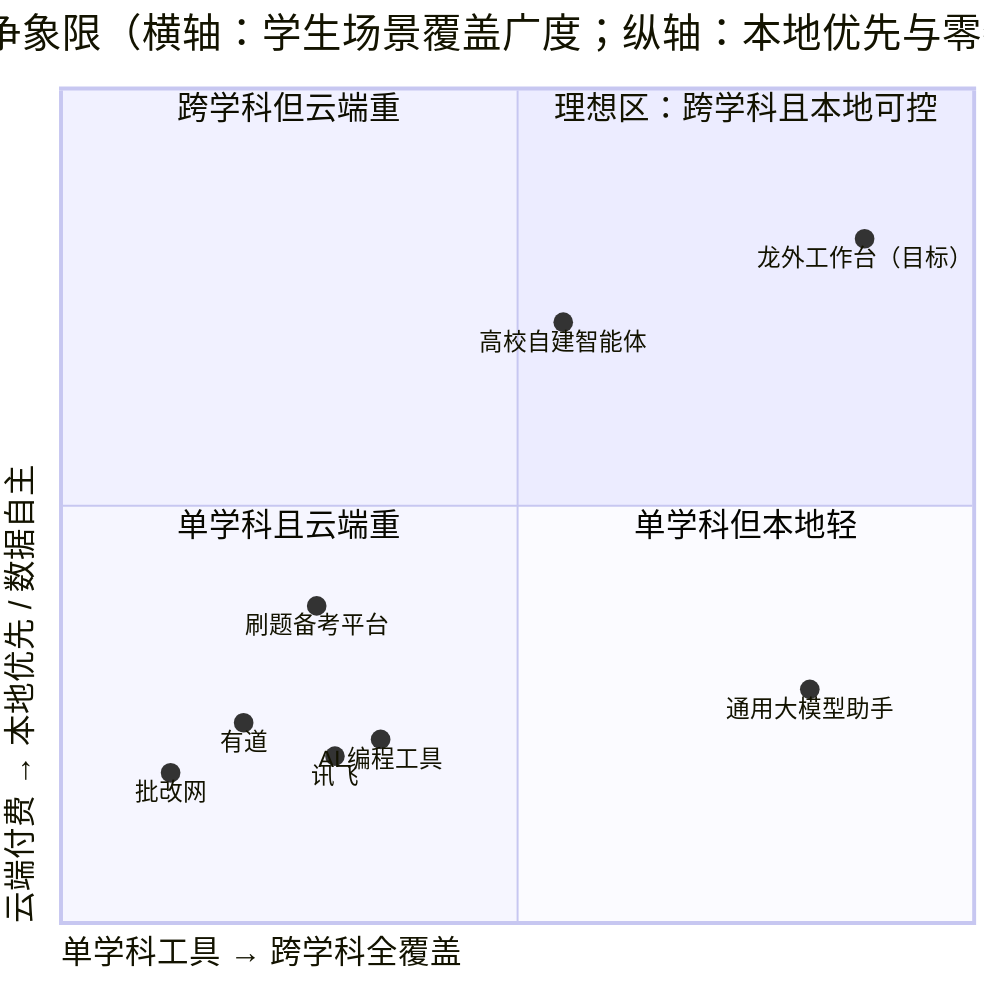
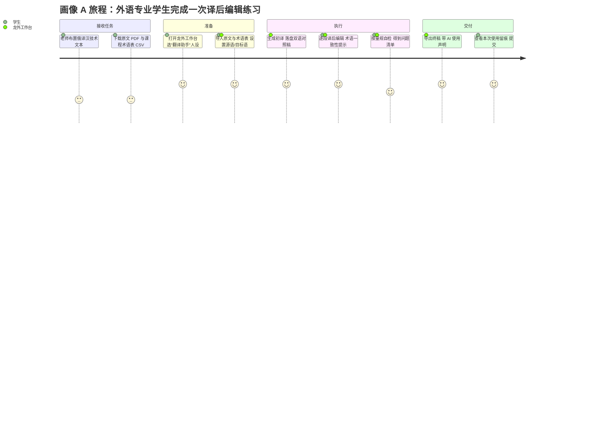
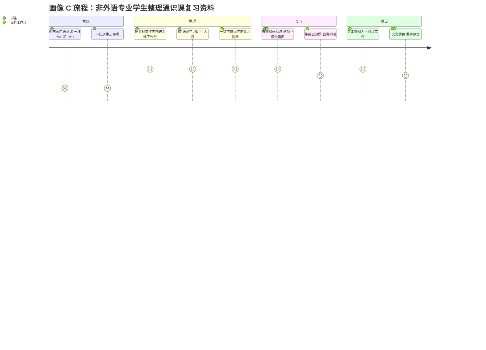
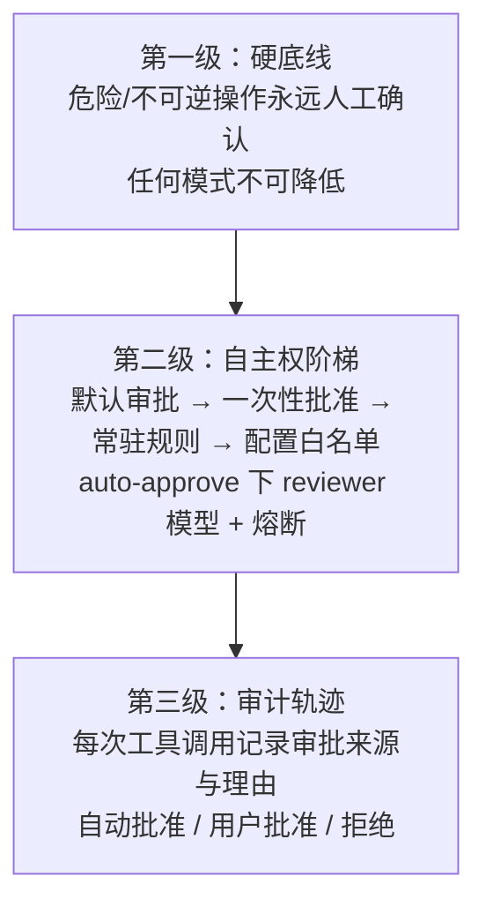
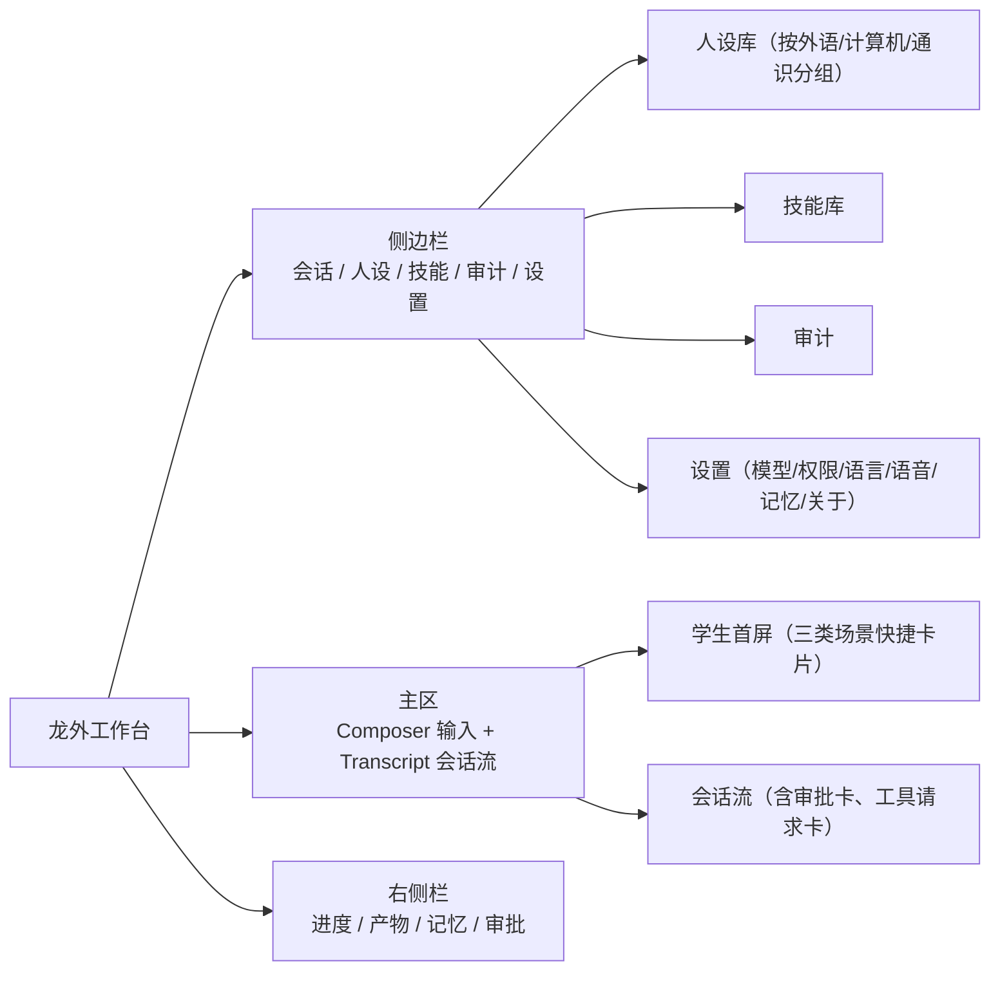
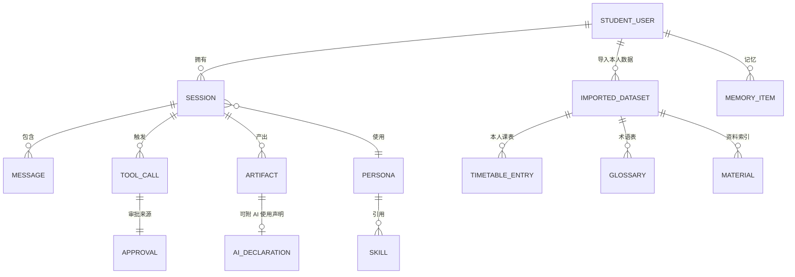
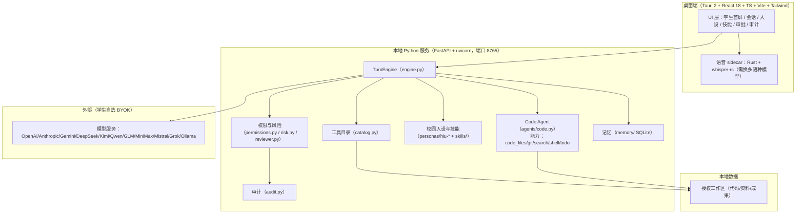
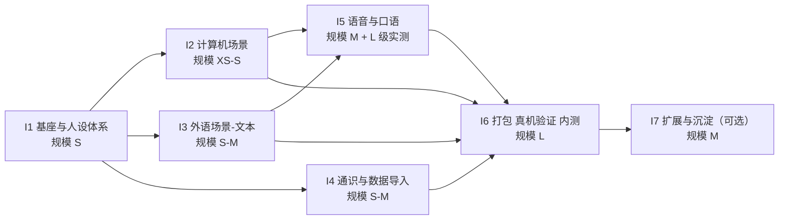

# 龙外工作台（HIU WorkSpace）产品需求文档

> 本文档为**完整版 PRD v3.0**。
> 写作约束：简体中文；无 emoji；凡涉及黑龙江外国语学院（下称"龙外"）的具体事实数据，均已标注来源与检索日期，未能核实的一律标注「（假设，待确认）」或列入第 15 章。
> 所有功能均锚定本仓库（开源项目 OpenWorker，MIT 协议）中**真实存在**的代码能力。二开策略三选一：复用现有能力 / 改造现有能力 / 全新开发。
> **项目性质声明**：本项目为面向龙外在校学生的产品研发项目，由团队开发并使用 AI Coding Agent 工具辅助。**无校内对接人、非校方立项**，不代表黑龙江外国语学院官方立场；文中校方数据仅作为产品所处的环境背景使用。

---

## 0. 文档信息与修订记录

| 项 | 内容 |
|---|---|
| 文档名称 | 龙外工作台（HIU WorkSpace）产品需求文档（完整版） |
| 版本号 | **v3.0** |
| 文档状态 | 评审稿（第 15 章剩余开放问题待确认） |
| 编写日期 | 2026-09-08 |
| 作者 | 许清楚（产品经理） |
| 交付负责人 | 齐活林（交付总监） |
| 项目性质 | **面向学生的产品研发项目**；团队开发，使用 AI Coding Agent 工具辅助 |
| 目标用户 | **仅黑龙江外国语学院的在校学生**（外语类 / 计算机类 / 其他非外语类） |
| 上游项目 | OpenWorker（`light-misty/HIU-WorkSpace`），MIT 协议，基于 aisuite 构建 |
| 本仓库路径 | `D:\DeskTop\HIU-WorkSpace` |
| 关联文档 | `README.md`、`AGENTS.md`、`docs/config.example.toml` |

### 修订记录

| 版本 | 日期 | 修订人 | 修订内容 |
|---|---|---|---|
| v0.1 | 2026-09-08 | 许清楚 | 仓库能力盘点，确认四个已拍板前提 |
| v0.5 | 2026-09-08 | 许清楚 | 竞品检索与政策合规检索，形成分析结论 |
| v1.0 | 2026-09-08 | 许清楚 | 完整版 PRD 成稿（学生 + 教师 + 管理员三端） |
| v2.0 | 2026-09-08 | 许清楚 | 重大范围修订（见 C-01~C-19） |
| **v3.0** | **2026-09-08** | **许清楚** | **交付口径修订（见 C-20~C-27）** |

### v1.0 → v2.0 变更明细（历史留存）

| 编号 | 变更类型 | 变更内容 | 触发原因 |
|---|---|---|---|
| C-01 | 用户答复 | 模型费用确定为**严格 BYOK、学生自付 API Key**；删除"争取院系统一采购共享 Key"的全部表述 | 用户明确答复 |
| C-02 | 用户答复 | 确认**没有校内对接人**；删除一切依赖校方立项、决策流程的表述 | 用户明确答复 |
| C-03 | 用户答复 | 确认**学校没有制定任何 AI 使用管理办法**；删除"合规配置下发""校方审核流程"等依赖校方制度的功能 | 用户明确答复 |
| C-04 | 用户答复 | 试点用户面向**任何普通学生**，取消院系/种子名单限定 | 用户明确答复 |
| C-05 | 范围收窄 | 产品角色从"学生 + 教师 + 管理员"三端收窄为"**仅学生**"单一角色 | 用户指示 |
| C-06 | 范围删除 | 删除全部教师端内容（画像、场景、功能、权限与数据边界）；里程碑 M3 整体移除 | C-05 连带 |
| C-07 | 范围删除/降级 | 删除管理端；原管理端 P0「合规配置下发」降级为 P2「本地合规默认配置」 | C-03 连带 |
| C-08 | 结构重构 | 第 5 章重构为「公共基础 + 学生场景」两层；第 6 章改为「角色范围界定与后期扩展」 | C-05 连带 |
| C-09 | P0 压缩 | P0 从 25 项压缩到 12 项，每项标注工作量判断依据 | 用户指示 |
| C-10 | 用户群体扩展 | 学生画像重做为三类：A 外语类、B 计算机/信息技术类、C 其他非外语类 | 用户指示 |
| C-11 | 立项理由改写 | 校方数据降级为环境背景；WDAU 与"试点 ≥300 人"目标作废 | C-02 连带 |
| C-12 | 推广路径改写 | 改为同学自发传播路径；商业模式改为"本项目不商业化" | C-02 连带 |
| C-13 | 合规重判 | 合规驱动力改为"国家法规要求 + 学术诚信自律"；AI 生成内容标识降为 P1 | 用户指示 + 产品判断 |
| C-14 | 数据模型简化 | 取消"教师导入他人学生数据"相关实体、表与清理策略；隐私分级重做 | C-05 连带 |
| C-15 | 里程碑重排 | 改为以周为单位的裁剪方案（8/12/16 周），v3.0 已再次重排 | 用户指示 |
| C-16 | 风险重写 | 风险成因与应对重写 | C-02 连带（v3.0 已再次重写） |
| C-17 | 问题清单重做 | 删除已答复条目，重新整理 | 用户指示（v3.0 已再次重做） |
| C-18 | 竞品调整 | 竞品改为学生视角 7 款：新增 AI 编程工具与刷题备考平台，移除机构向两款；象限图重绘 | C-05/C-10 连带 |
| C-19 | 事实核实补充 | 核实发现 `swe-worker`/`test-worker`/`change-worker`/`design-worker` 均标 `ships: false` 且为 `team: worker`，不可直接复用；真正可复用主资产是 `coworker/agents/code.py` | 自主核实 |

### v2.0 → v3.0 变更明细（本轮）

| 编号 | 变更类型 | 变更内容 | 触发原因 |
|---|---|---|---|
| **C-20** | **定位修订** | 项目定位改为**正常的产品研发项目**；全文清除此前把本项目描述为学业任务的一切表述（含进度期限、评判标准、评判方、个人投入等） | 用户指示："把它当成一个项目即可" |
| **C-21** | **交付口径修订** | 交付口径改为**团队开发 + AI Coding Agent 工具辅助**；全文清除一切基于个人投入推算工期的表述 | 用户指示："我们是团队开发，会使用 AI Coding Agent 工具快速开发" |
| **C-22** | **里程碑重写** | 第 11 章删除原"人天 ÷ 每周投入"的工期推算与三档工时裁剪方案；改为**以迭代为单位的顺序与依赖**（I1-I7），每个迭代含目标、范围、依赖、建议时间盒、出口标准 | C-21 连带 |
| **C-23** | **工作量表达更换** | 绝对工时数字全部替换为**相对规模 XS/S/M/L**，并说明依据（复用 / 改造 / 新建） | C-21 连带 |
| **C-24** | **新增判断章节** | 新增 10.6「AI Coding Agent 对二开策略的结构性影响」：内容型/配置型工作边际成本大幅下降，瓶颈转移到"调通链路 + 实测校准 + 真机验证" | 用户指示中"AI 编码工具快速开发"的推论 |
| **C-25** | **优先级重判** | 依据 C-24 重新判定 v2.0 中被降级的功能：**通用表格解析升为 P0**、**错词本升为 P1**、**口语陪练明确为不可裁剪**、**AI 标识维持 P1**（理由与产能无关）、**课表导入维持 P2** | C-24 连带 |
| **C-26** | **风险重写** | 第 13 章移除个人投入与周期类风险；补入 AI 生成代码一致性与可维护性、跨成员分支与冲突、上游同步冲突、内容缺乏真实语料校准等 | C-21 连带 |
| **C-27** | **问题清单重做** | 第 15 章删除学业任务语境下的 4 个问题（进度期限、评判标准、是否需可运行原型、个人投入工时），其余重新编号为 21 个 | C-20 连带 |
| **C-28** | **保留并强化** | 保留并强化 10.3.1「工程向人设不可复用」与 10.3.2「`agents/code.py` 是真正可复用主资产」两条结论；补充"能力清点是 AI 编码效率的前提" | 用户指示（对团队排期价值更高） |

> **术语消歧说明**：本版保留"课程设计/毕业设计""实验报告""课表""课程代码"等**面向学生用户的场景与字段名称**，它们描述的是学生要完成的学习任务，与本项目的研发性质无关；被清除的是一切把**本项目自身**描述为学业任务、或据其推算人力与周期的表述。

---

## 1. 项目背景与目标

### 1.1 项目性质

| 项 | 说明 |
|---|---|
| 项目发起方 | 本项目团队（非校方、非院系） |
| 项目性质 | **面向学生的产品研发项目** |
| 开发方式 | **团队开发，使用 AI Coding Agent 工具辅助** |
| 是否有校内对接人 | **无**（事实，用户已确认） |
| 是否代表校方立场 | **否** |
| 是否有校方制度依托 | **无**（学校未制定任何 AI 使用管理办法，用户已确认） |
| 商业模式 | **不商业化**。无付费计划、无营收目标；模型费用由使用者（学生）自行承担（A3） |
| 用户获取方式 | 同学自发传播（无组织渠道、无预算、无制度推动） |

> **取舍原则**：**可交付 > 完整，可演示 > 全面，真实可用 > 规划宏大**。凡依赖"校方立项 / 院系试点 / 制度下发"的设计一律不在范围内。

### 1.2 环境背景

> 以下数据用于说明产品所处的用户环境，**不代表本项目获得校方支持或授权**。来源：hiu.edu.cn 各官方页面，检索日期 2026-09-08。

| 事实 | 数值 | 来源页面 | 备注 |
|---|---|---|---|
| 学校性质 | 黑龙江省唯一一所语言类本科高校，民办 | `hiu.edu.cn/zjlw1/lwjj.htm`、`hr.hiu.edu.cn` | 已核实 |
| 外语语种 | **11 个外语语种** | 首页、`hr.hiu.edu.cn` | 已核实 |
| 本科专业数 | 32 个（招聘启事）/ 34 个（首页） | `hr.hiu.edu.cn`、`hiu.edu.cn` | **口径不一致，待确认** |
| **外语类 vs 非外语类专业各多少** | **官网无明确口径** | — | **（假设，待确认）**：按公开专业名单人工归类，外语类约 10-12 个（英/俄/日/法/西/德/意/阿/葡/朝/翻译/商务英语），非外语类约 20 余个（计算机科学与技术、软件工程、数据科学与大数据技术、数字媒体技术、国际经济与贸易、市场营销、财务管理、人力资源管理、电子商务、国际商务、网络与新媒体、环境设计、视觉传达设计、动画、汉语言文学、汉语国际教育等）。**此为估计，非官方统计** |
| 全日制本科在校生 | 11709 人 | `hr.hiu.edu.cn` | 另见 10136 人（简介页）、8822 人（信息公开页），均为更早口径 |
| 二级学院 | 10 个 | `hr.hiu.edu.cn` | 已核实 |
| 信息化基础 | 华为全光校园网、智慧教室 198 间、智慧教学云平台 | `hr.hiu.edu.cn` | 已核实（本项目不使用、不对接） |
| 校方 AI 氛围 | 翻译专业设"智能翻译"方向、英语专业设"数智创新班"；2026-08 承办全国"人工智能赋能翻译教学研修班" | 首页新闻 | 已核实。说明校内对 AI+外语有氛围，利于自发传播，但**本项目与这些官方动作无关** |

**关键推论**：龙外并非只有外语专业。**计算机科学与技术、软件工程、数据科学与大数据技术、数字媒体技术**等工科专业同样存在（按公开专业名单，非外语类专业数量可能多于外语类专业——**（假设，待确认）**）。只做外语场景会浪费掉一半以上的潜在学生用户，这是 v2.0 扩展学生群体的依据，v3.0 延续。

### 1.3 法规与行业背景

| 时间 | 文件/事件 | 对本项目的意义 | 来源 |
|---|---|---|---|
| 2023-08-15 | 《生成式人工智能服务管理暂行办法》施行 | 规制对象是"利用生成式人工智能技术向境内公众提供生成式人工智能服务"的主体；本项目为本地桌面工具、不向公众提供服务，不属于该办法规制对象（判断见 7.8） | 新华社 2025-09-02 报道援引 |
| 2025-03-07 发布 / **2025-09-01 施行** | 《人工智能生成合成内容标识办法》（国信办通字〔2025〕2 号） | 第二条适用范围为"**网络信息服务提供者**"；第十条规定**用户**主动声明义务。义务主体判定见 7.8 | 中央网信办 cac.gov.cn（2025-03-14）；新华社（2025-09-01） |
| 2025-05 | 《中小学生成式人工智能使用指南（2025 年版）》 | 明确"禁止学生直接复制人工智能生成内容作为作业或考试答案"；虽面向中小学，但为本项目"学术诚信自律"设计提供参照口径 | 人民网教育频道 2025-05-13；教育部基础教育教学指导委员会 |
| 2026-04 | 教育部等 5 部门《"人工智能+教育"行动计划》 | 高等教育阶段推动人工智能成为公共基础课程，说明学生使用 AI 已是大势所趋 | 人民日报 / 中国共产党新闻网（2026-08-23） |

补充数据（新华社 2025-09-01）：我国已有 **490 余款大模型**在网信办备案，**240 余款**在省级网信办登记，生成式 AI 产品用户规模达 **2.3 亿人**。

### 1.4 现状痛点（学生视角）

#### 1.4.1 三类学生共有的痛点

| 编号 | 痛点 | 说明 |
|---|---|---|
| P-1 | 通用 AI 不懂"本校这门课的要求" | 通用大模型给的是通用答案，不知道老师的评分习惯、课程的知识点范围、教材的章节结构 |
| P-2 | 工具与资料散落 | 词典、翻译、IDE 插件、笔记、题库分散在多个 App，来回切换，上下文断裂 |
| P-3 | 学习过程没有沉淀 | 错题、错词、踩过的坑用完就散，下次从头再来 |
| P-4 | BYOK 门槛 | 需要自己搞到 API Key，还要会配置、会选型、会控制花费。这是学生使用本产品的**第一道也是最大的一道门槛** |
| P-5 | AI 使用与学术诚信边界模糊 | 学校没有管理办法，学生自己也不知道"用了该怎么说" |
| P-6 | 电脑配置与网络参差 | 学生机性能与网络条件不一，重依赖云端的方案对部分学生不可用 |

#### 1.4.2 外语类专业学生痛点

| 编号 | 痛点 |
|---|---|
| PA-1 | 通用 AI 改作文只给"更通顺的版本"，不给**按评分量规的分项诊断** |
| PA-2 | 翻译练习缺少统一术语表与风格约束，输出与课堂要求脱节 |
| PA-3 | 口语/听力缺少陪练对象：按 11709 名在校生 / 523 名专任教师估算师生比约 **22:1**（**估算，基于上述公开数据自算，非官方口径**），课堂练习时间有限 |
| PA-4 | 11 个语种中，小语种（阿、葡、意、朝等）的 AI 工具支持明显弱于英语 |

#### 1.4.3 计算机 / 信息技术类专业学生痛点

| 编号 | 痛点 |
|---|---|
| PB-1 | 写代码遇到报错靠"报错信息 + 搜索引擎"，缺少在自己代码库上下文里的连续排错 |
| PB-2 | 拿到别人的代码/开源项目看不懂，缺少"在我这份代码里讲给我听"的引导 |
| PB-3 | 算法与数据结构练习缺少"分题型、循序渐进、能当场验证"的陪练 |
| PB-4 | 课程设计 / 毕业设计从零搭脚手架耗时，且不知道业界常规结构 |
| PB-5 | 实验报告、技术文档、README 写作耗时且不被重视 |
| PB-6 | 编程竞赛训练缺少针对性复盘 |

#### 1.4.4 其他非外语专业学生痛点

| 编号 | 痛点 |
|---|---|
| PC-1 | 通识课资料杂（PDF、PPT、扫描件），复习时缺少结构化提纲 |
| PC-2 | 论文、读书报告、调研报告写作与润色耗时 |
| PC-3 | 同样要考四六级，但缺少专业化的备考辅助 |
| PC-4 | 部分课程有双语/外文材料，阅读门槛高 |

### 1.5 产品定位（一句话）

> **龙外工作台是一款运行在学生自己电脑上的、本地优先的 AI 学习伙伴桌面应用：用一个 App 同时服务外语类、计算机类和其他专业的同学，把翻译、写作、口语、代码调试、算法练习、复习提纲等真实学习任务做成可落盘的成果，并且每一次 AI 动作都留痕、可查、可控。**

差异化关键词：**本地优先（自己的电脑、自己的 Key、自己的数据）· 跨学科（外语 + 计算机 + 通识）· 人设与技能可自己扩展 · 三级治理可审计 · 不绑定模型 · 不联网到任何校内系统也能用**。

### 1.6 已拍板前提

| 编号 | 前提 | 来源 | 对设计的影响 |
|---|---|---|---|
| A1 | **首发交付形态为桌面端**（沿用现有 Tauri + 本地 Python 服务架构），本地优先、数据不出机 | v1.0 | 不做 Web 端；功能必须在 Windows 桌面壳内可用 |
| A2 | **暂不与学校现有系统对接**（教务、学工、一卡通、图书馆、统一身份认证）；课表等一律**文件手动导入** | v1.0 | 数据层围绕"文件导入 + 本地解析"；无统一身份认证 |
| A3 | **模型 BYOK，学生自付 API Key**，沿用现有多提供商接入 | v1.0（v2.0 严格化） | 不设计学校统一配额；必须做好"无 Key / Key 失效 / 余额耗尽"的降级与引导 |
| A4 | **完整版 PRD**：含竞品分析 5-7 款、Mermaid 象限图、市场定位与推广路径 | v1.0 | 第 2、3 章 |
| A5 | **产品仅面向学生单一角色**，教师端与管理端不在范围内 | v2.0 | 全文无教师/管理端；第 6 章说明后期扩展路径 |
| A6 | **无校内对接人、无校方制度依托** | v2.0（用户答复） | 一切依赖校方组织与制度的设计作废；推广靠同学自发传播 |
| A7 | **学生群体覆盖外语类、计算机类、其他非外语类三类** | v2.0 | 画像、场景、人设均需同时服务三类 |
| **A8** | **团队开发 + AI Coding Agent 工具辅助** | **v3.0（用户答复）** | 排期以迭代为单位；工作量用相对规模；内容型/配置型工作可批量做（见 10.6） |

### 1.7 产品目标（Product Goals）

| 编号 | 目标 | 可度量口径 |
|---|---|---|
| G1 | 让三类学生各自的高频学习任务能在**本地**完成并产出可落盘成果 | 三个核心场景（代码调试、外语写作批改、翻译）各完成 ≥ 10 次真实任务并成功落盘 |
| G2 | 用"人设 + 技能"承载学科差异，证明内容驱动的可扩展性 | 交付 ≥ 4 个校园人设 + ≥ 6 个技能包，全部可安装、可切换、可生效 |
| G3 | 保留上游治理能力，让 AI 使用可审计、可解释 | 100% 工具调用留痕并可在审计视图中回放 |
| G4 | 清晰界定对开源项目的二开边界 | 每项交付功能能说清"复用 / 改造 / 新建"及对应代码位置 |

### 1.8 成功度量指标

> 以下为可验证的早期目标，全部标注为假设。

| 层级 | 指标 | 定义 | 目标值（**假设，待校准**） |
|---|---|---|---|
| 交付 | P0 完成率 | 13 项 P0 中通过验收条目的比例 | 100% |
| 可用 | 核心场景任务成功率 | 随机抽取 15 个真实学习任务，能跑通并产出成果的比例 | ≥ 80% |
| 可用 | 冷启动成功率 | 让一个从未用过的学生从安装到完成第一个任务（无人指导）的成功率 | ≥ 60% |
| 规模 | 内测人数 | 实际安装并使用过的学生数 | 20-50 人 |
| 留存 | 二次使用率 | 内测学生中使用 ≥ 2 次的比例 | ≥ 50% |
| 质量 | 成果采纳率 | 生成的成果被"保留/导出/继续编辑"的比例 | ≥ 65% |
| 工程 | 治理完整率 | 工具调用有完整 approval provenance 的比例 | 100%（硬性） |
| 工程 | 二开可解释性 | 每项交付功能能说清"复用/改造/新建"及对应代码位置 | 100% |

---

## 2. 竞品分析

### 2.1 竞品选取说明

定位为"**仅面向学生**"后，竞品集合取**学生视角** 7 款，覆盖四类：学生日常在用的通用 AI、计算机学生的 AI 编程工具、外语学生的垂直工具、刷题备考平台，以及学校可能发给学生作为替代的方案。

| 变更 | 竞品 | 原因 |
|---|---|---|
| 移除 | 校园数字化厂商全域智能体（企鹅 AI 校园等） | 面向校方采购与系统集成，与学生个人使用场景无关 |
| 移除 | 教学平台内置 AI（雨课堂/超星等） | 面向教师教学流程，与学生个人使用场景无关 |
| 新增 | **AI 编程工具（GitHub Copilot / Cursor / 通义灵码 / CodeGeeX）** | 计算机类专业学生是目标用户之一，这是他们的默认选项 |
| 新增 | **刷题备考平台（LeetCode / 牛客 / 扇贝 / 墨墨等）** | 覆盖算法练习与考级备考场景 |

### 2.2 逐款分析

#### 竞品 1：通用大模型助手（ChatGPT / 豆包 / DeepSeek / Kimi 等）

| 项 | 内容 |
|---|---|
| 形态 | Web / App，云端 |
| 优势 | 能力最强、覆盖最广；学生零学习成本、已在用；支持多语种；可上传文件与数据分析；多数有免费额度 |
| 劣势 | 不懂本校课程要求；数据出机；无法与本地代码库/资料库联动；无学习沉淀；无审批与留痕 |
| 威胁等级 | **最高**。这是"不作为"的默认选项，也是所有场景的及格线 |
| 数据来源 | 公开产品体验；规模数据见新华社 2025-09-01（我国生成式 AI 产品用户规模 2.3 亿人） |

#### 竞品 2：AI 编程工具（GitHub Copilot / Cursor / 通义灵码 / CodeGeeX）

| 项 | 内容 |
|---|---|
| 形态 | IDE 插件 / 独立编辑器，云端 |
| 优势 | 深度嵌入编码流程；补全与重构体验成熟；Cursor 类产品可对话式操作整个代码库；Copilot 对学生**免费**（GitHub Student Pack，公开资料，具体政策以官方为准） |
| 劣势 | 只解决"写代码"，不解决"学编程"——不会按课程知识点循序渐进讲题、不会生成实验报告；数据出机；不覆盖外语与通识场景 |
| 威胁等级 | **高**（对计算机类学生） |
| 差异化机会 | **不与它们比编码能力**，做它们不做的事：**结合本地代码库的连续排错 + 讲解**、**算法分题型陪练**、**课程设计脚手架**、**实验报告与技术文档生成** |
| 数据来源 | 公开产品体验；具体用户规模与价格**公开资料未披露** |

#### 竞品 3：批改网（句酷批改网，北京词网科技有限公司，pigai.org）

| 项 | 内容 |
|---|---|
| 形态 | Web，云端 |
| 关键数据 | 2011-06-28 上线；截至 2025-12 **累计批改作文超 11 亿篇**（百度百科，引用日期 2026-01）；官网自述"**超过 5000 所学校**在使用"，首页计数器显示"正在批改第 1,167,268,878 篇"（检索日 2026-09-08） |
| 优势 | 外语写作智能批改领域的在位者；按句点评、中式英语识别、抄袭检测成熟；承办"批改网杯"全国大学生英语写作/翻译大赛 |
| 劣势 | 只做英语作文评分一件事；SaaS 云端、数据出机；反馈颗粒度偏"评分器"而非"教学法"；自定义本校量规能力**公开资料未披露，待确认** |
| 威胁等级 | 中 |
| 关系 | 既是竞品也是标杆：它证明了外语写作智能批改需求真实存在；本项目以"本地不出机 + 量规可自定义"形成差异 |
| 数据来源 | pigai.org 官网（检索日 2026-09-08）；百度百科"批改网"词条（引用日期 2026-01/2026-02） |

#### 竞品 4：有道（有道翻译 / 有道领世 / 子曰大模型）

| 项 | 内容 |
|---|---|
| 形态 | App / Web / 硬件，云端 |
| 优势 | 外语学习与翻译国民级心智；词典与语料积累深；多语种；C 端体验成熟；免费额度充足 |
| 劣势 | 面向 C 端泛学习，不面向"本校课程流程"；无本地化；不覆盖计算机与通识；无学习沉淀 |
| 威胁等级 | 中 |
| 数据来源 | 公开产品体验；用户规模**公开资料未披露** |

#### 竞品 5：科大讯飞（星火大模型 / 讯飞听见）

| 项 | 内容 |
|---|---|
| 形态 | 云端 + 软硬一体 |
| 优势 | 语音技术（识别、评测、同传字幕）国内积累最深；听说训练场景成熟 |
| 劣势 | 重云端；口语评测是订阅服务；不覆盖计算机与通识 |
| 威胁等级 | 中 |
| 数据来源 | 公开产品与行业报道；具体客户数与价格**公开资料未披露** |

#### 竞品 6：刷题备考平台（LeetCode / 牛客 / 扇贝 / 墨墨等）

| 项 | 内容 |
|---|---|
| 形态 | Web / App，云端 |
| 优势 | 题库与判题成熟；社区题解丰富；有打卡与进度体系；四六级/考研词汇类产品用户基数大 |
| 劣势 | 题库固定，不能按本人薄弱点动态生成；不结合本人代码与资料；数据出机 |
| 威胁等级 | 中 |
| 差异化机会 | 做"**基于本人错题与本人资料**的个性化练习生成"，而非又一个题库 |
| 数据来源 | 公开产品体验；具体用户规模**公开资料未披露** |

#### 竞品 7：高校自建智能体（清华"清小搭"、北航"AI 领航员"、北邮"人人有算力"等）

| 项 | 内容 |
|---|---|
| 形态 | 校内平台 / 公众号 / 小程序，打通校内数据 |
| 关键数据 | 清华"清小搭"2026-08-01 上线，校方称基于校内大数据与知识增强生成技术，回答准确率**超 98%**（**学校自述，非第三方评测**）；北航"AI 领航员"服务 2026 级 5000 余名本科新生迎新；北邮 2026-09 起实施"人人有算力"计划，为每名本科新生配个人 AI 算力账户，平台集成 10 余种主流大模型；中南大学"小麓/小南"采用本地化部署 |
| 优势 | 打通校内数据与流程；校方背书，学生信任度高；算力与费用问题由学校解决 |
| 劣势 | 头部高校才有能力做；场景偏"事务问答/迎新"，对学习深水区（批改、翻译、算法陪练）覆盖有限；**龙外是否计划建设同类平台未知**（**假设，待确认**） |
| 威胁等级 | 中低（"未来可能被替代"的风险，而非当下直接对手） |
| 数据来源 | 北京日报（2026-09-06）；央视网（2026-08-31） |

### 2.3 竞品对比总表

| 维度 | 龙外工作台（目标） | 通用大模型助手 | AI 编程工具 | 批改网 | 有道 | 讯飞 | 刷题备考平台 | 高校自建智能体 |
|---|---|---|---|---|---|---|---|---|
| 部署形态 | **本地桌面** | 云端 | IDE/云端 | 云端 | 云端 | 云端 | 云端 | 校内平台 |
| 数据不出机 | **是** | 否 | 否 | 否 | 否 | 否 | 否 | 部分 |
| 覆盖外语场景 | **是** | 部分 | 否 | 仅写作 | 是 | 听说强 | 词汇/考级 | 弱 |
| 覆盖计算机场景 | **是** | 部分 | **强** | 否 | 否 | 否 | 算法题 | 弱 |
| 覆盖通识/跨专业 | **是** | 是 | 否 | 否 | 否 | 否 | 部分 | 弱 |
| 结合本人本地资料/代码库 | **是** | 否（需上传） | 是（代码库） | 否 | 否 | 否 | 否 | 部分 |
| 学习沉淀（错题/错词/记忆） | **是** | 弱 | 否 | 有进度报告 | 有单词本 | 有 | 有 | 弱 |
| 模型可替换 / BYOK | **是** | 否 | 部分 | 否 | 否 | 否 | 否 | 部分 |
| 人设/技能可自己扩展 | **是** | 否 | 否 | 否 | 否 | 否 | 否 | 否 |
| 审批 / 审计 / 留痕 | **三级治理 + 全审计** | 无 | 部分 | 无 | 无 | 无 | 无 | 视实现 |
| 学生获取成本 | 安装 + 自备 Key | 注册即用 | 安装（部分免费） | 注册即用 | 注册即用 | 注册即用 | 注册即用 | 学校发放 |
| 主要短板 | **需自备 Key** | 不专业/数据出机 | 只做编码 | 场景单一 | 场景单一 | 场景单一 | 题库固定 | 依赖学校投入 |

### 2.4 竞争象限图



### 2.5 差异化结论

1. **空位是"跨学科全覆盖 × 本地可控"**——市面上没有一款学生工具同时服务外语、计算机和通识三类场景且数据留在本地。
2. **不正面硬碰**：不与 Copilot/Cursor 比编码能力，不与批改网比语料规模，不与通用大模型比聪明程度。
3. **真正能赢的三点**：
   - **一个 App 管三类专业的学习任务**——所有单点工具做不到；
   - **结合本人本地资料与本人代码库**——通用 AI 需要你上传，本项目直接读你的工作区；
   - **内容开放可扩展**——可以自己写人设和 SKILL.md，工具随课程演进。
4. **必须承认的劣势**：需要自备 API Key，这是所有云端竞品没有的门槛。BYOK 引导（P0-03）因此是决定产品生死的环节，而非一个设置页。

---

## 3. 市场定位与推广路径

### 3.1 市场定位

| 项 | 定位 |
|---|---|
| 目标用户 | 龙外在读本科生，覆盖外语类 / 计算机类 / 其他非外语类三类 |
| 切入场景 | 学生的高频学习任务：代码调试、算法练习、翻译、外语写作、口语、复习提纲、论文润色 |
| 价值主张 | 一个 App 管三类专业 + 本地不出机 + 人设技能自己扩展 + 全审计可查 + 不绑定模型 |
| **不商业化** | **本项目不商业化**。无付费计划、无营收目标；所有模型费用由使用者（学生）自行承担（A3） |
| 不服务的场景 | 教师备课与批改（A5）、校内事务问答、教务流程、需要统一身份认证的场景 |

### 3.2 目标用户规模

- 可触达总规模：在校本科生约 **11709 人**（来源 `hr.hiu.edu.cn`，检索日 2026-09-08）。
- 现实内测目标：**20-50 人**（**假设，待校准**）。
- 本项目不以规模为目标，以**产品可用性与内容可扩展性**为目标。

### 3.3 推广路径：同学自发传播

> 无校方渠道、无预算、无制度推动。唯一可行的路径是**产品自身足够好用，让用过的人愿意推荐给下一个人**。


| 阶段 | 动作 | 关键成功因素 |
|---|---|---|
| **团队自用** | 团队先把三个核心场景（代码调试、翻译、写作批改）用满两周，修掉所有"自己都不想用"的地方 | 自己都不用的功能不可能让别人用 |
| **熟人内测（5-10 人）** | 当面帮忙装、帮忙配 Key、陪跑第一个任务。**不要发链接让别人自己装** | 冷启动成功率是唯一 KPI；每人记录"卡在哪一步" |
| **校园分享引爆** | 在校园技术分享 / 社团活动 / 公开演示中演示真实场景（不是截图）；会后提供一键安装包 + 三分钟上手视频 | 现场演示 > 任何文档 |
| **社群扩散** | 班级群、专业群、社团群发放；**每个群附一句"不会配 Key 的我可以帮你配"** | 降低 BYOK 门槛是扩散的前提 |
| **开源发布** | 以 MIT 协议发布到 GitHub，README 写清"基于 OpenWorker 二次开发" | 遵守上游 MIT 与署名要求（`LICENSE`、`AGENTS.md`） |
| **内容飞轮** | 鼓励学生投稿自己写的人设/技能包，团队审核后收录 | 复用 `/v1/skills/upload` 与 `/v1/personas/install` |

### 3.4 推广杠杆与反杠杆

| 类型 | 项 | 说明 |
|---|---|---|
| 杠杆 | 校园分享 / 公开演示 | 现场真实演示是最集中的曝光机会 |
| 杠杆 | 计算机专业学生的技术影响力 | 更愿意尝试新工具、也更愿意给反馈，是天然种子用户 |
| 杠杆 | 开源与作品集价值 | "参与一个开源二开项目"本身对计算机类学生有吸引力 |
| 杠杆 | 校内 AI 氛围 | 校方已承办"人工智能赋能翻译教学研修班"（检索日 2026-09-08），学生对 AI 话题不陌生 |
| **反杠杆** | **BYOK 门槛** | 学生没有 Key、不会配、怕花钱——最大阻力。靠"当面帮配 + 推荐低价模型 + Ollama 本地兜底"对冲 |
| **反杠杆** | **无组织背书** | 没有院系通知，只能靠个人信用背书传播，速度慢 |
| **反杠杆** | **Windows 未签名** | README 明确 Windows 构建未签名，SmartScreen 会告警。需在安装说明中提前说明（见 Q-05） |

---

## 4. 用户画像与场景分析

### 4.1 画像 A：外语类专业学生

| 项 | 内容 |
|---|---|
| 代表 | 英语、俄语、日语、翻译、商务英语等专业学生（11 语种） |
| 特征 | 每天有固定晨读/听力时间；对 AI 有基础认知（用过通用助手查词改句）；**对费用敏感**；小语种同学可选工具明显少于英语 |
| 目标 | 短期通过专四专八 / 四六级 / 雅思托福；中期提升口语与写作；长期获得翻译、外贸、留学机会 |
| 痛点 | PA-1 至 PA-4 |
| 典型场景故事 | "老师布置 3000 字俄译汉技术文本，要求附术语表与译后编辑说明。我先在通用 AI 里翻了一版，术语前后不一致，改了三遍还是被退回来。" |
| 关键设计启示 | 必须提供**按量规的分项诊断 + 可执行修改路径**；必须支持**术语表约束**；口语陪练要能"一句一句来"；**小语种的支持质量不能明显低于英语** |



### 4.2 画像 B：计算机 / 信息技术类专业学生

| 项 | 内容 |
|---|---|
| 代表 | 计算机科学与技术、软件工程、数据科学与大数据技术、数字媒体技术等专业学生 |
| 特征 | 已在用 Copilot / Cursor / 通义灵码等工具；熟悉命令行、Git、IDE；愿意折腾配置（**API Key 门槛对这类学生最低**）；对工具质量挑剔 |
| 目标 | 快速完成编程任务与课程设计；提升算法与工程能力；做出能放进简历/作品集的项目 |
| 痛点 | PB-1 至 PB-6 |
| 典型场景故事 | "数据结构要求实现一个平衡树，我照着网上的代码抄了一份，跑不通，报错看不懂，在搜索引擎里翻了两个小时。" |
| 关键设计启示 | **不要和 Copilot 比补全**，要做"**在我这份代码里连续排错 + 讲清楚为什么**"；算法陪练要能**当场运行验证**；课程设计要有**可落地的脚手架**；实验报告生成要贴合本校模板 |


### 4.3 画像 C：其他非外语专业学生

| 项 | 内容 |
|---|---|
| 代表 | 国际经济与贸易、市场营销、财务管理、人力资源管理、电子商务、国际商务、汉语言文学、汉语国际教育、环境设计、视觉传达设计、动画、网络与新媒体等专业学生 |
| 特征 | 外语是工具不是专业；要考四六级；通识课多、资料杂；对技术工具的耐心低于计算机类学生 |
| 目标 | 用最少的时间完成通识课任务、论文、报告；顺手过四六级 |
| 痛点 | PC-1 至 PC-4 |
| 典型场景故事 | "期末三门通识课，每门都是一堆 PDF 和 PPT，我不知道重点在哪，也不知道从哪开始复习。" |
| 关键设计启示 | 必须**零配置可用**（这类学生最可能卡在 Key 配置）；资料整理要**一键拖入文件夹出提纲**；论文润色要"保留我的意思、只改表达"；界面要足够简单 |



### 4.4 三类画像的共性与差异

| 维度 | A 外语类 | B 计算机类 | C 其他非外语类 |
|---|---|---|---|
| 技术耐心 | 中 | **高** | **低** |
| BYOK 门槛承受度 | 中 | **高** | **低** |
| 首选场景 | 翻译 / 写作 / 口语 | 代码调试 / 算法 | 资料整理 / 论文润色 |
| 成果形态偏好 | 文稿（译稿、作文） | 代码 + 报告 | 提纲 + 文稿 |
| 对"人设"的理解成本 | 中 | 低 | **高**（需要更直白的命名） |
| 最可能流失的原因 | 小语种效果差 | 不如 Copilot 好用 | 配 Key 配不上 |

### 4.5 场景优先级矩阵

| 场景 | 归属画像 | 用户价值 | 竞品替代难度 | 相对规模 | 优先级 |
|---|---|---|---|---|---|
| 代码调试与讲解 | B | 高 | 中（Copilot 强） | **XS（复用 Code Agent）** | **P0** |
| 多语种翻译 + 双语对照 | A | 高 | 中 | S | **P0** |
| 外语写作批改与润色 | A | 高 | 中高 | M | **P0** |
| 口语陪练（转写 + 纠错） | A | 高 | 中 | **M（含 L 级实测校准）** | **P0** |
| 算法与数据结构练习 | B | 中高 | 中 | S | **P0** |
| 通识资料整理与复习提纲 | C | 高 | 中 | M | **P0** |
| BYOK 零门槛配置引导 | 全部 | **极高** | 不适用 | S | **P0** |
| 论文 / 读书报告润色 | A/B/C | 中高 | 低 | S | **P0** |
| 表格与 Office 导入解析（基础能力） | 全部 | 中高 | 不适用 | **S（AI 编码友好）** | **P0（v3.0 升级）** |
| 课程设计 / 毕业设计脚手架 | B | 中高 | 中 | M | P1 |
| 技术文档与实验报告生成 | B | 中 | 中 | S | P1 |
| 考级备考（四六级/专四专八/雅思托福） | A/C | 中高 | 低（题库竞品多） | M（内容校准是瓶颈） | P1 |
| 术语表驱动的一致性检查 | A | 中 | 中 | S | P1 |
| 错词本 / 错题库 | A/B | 中 | 中 | M | **P1（v3.0 由 P2 升级）** |
| 听力材料转写与精听 | A | 中 | 中 | M | P2 |
| 课表导入与学习提醒 | 全部 | 中 | 低 | M | **P2（维持，理由见 5.5）** |
| 编程竞赛训练 | B | 中 | 低（LeetCode 强） | M | P2 |
| 跨文化交际案例 | A | 中 | 中 | S | P2 |

---

## 5. 核心功能模块规划

### 5.0 二开策略与相对规模口径

| 策略 | 判定标准 |
|---|---|
| **复用现有能力** | 现有代码已能支撑，只需配置/内容（人设 manifest、SKILL.md、i18n 文案）即可上线 |
| **改造现有能力** | 现有代码提供了主干，但需修改行为、扩展数据模型或调整 UI 流程 |
| **全新开发** | 仓库中不存在对应基础设施，需新建模块/数据表/算法 |

**相对规模定义（v3.0 起使用，不再给出绝对工时数字）**

| 规模 | 含义 | 典型情形 |
|---|---|---|
| **XS** | 近乎零代码：配置、暴露已有能力、文案 | 把已有 Agent 暴露为人设；复用现成组件 |
| **S** | 少量新增：一个技能包、一个解析函数、一个页面改造 | 新增 SKILL.md；CSV 解析；引导页文案与跳转 |
| **M** | 中等：多个技能 + 人设 + 前后端联调，或一个已有能力的改造 | 翻译/写作批改场景；STT 模型替换 |
| **L** | 大：跨层改造或需要大量实测校准与真机验证 | 端到端链路联调；多语种质量与性能实测；打包与分发验证 |

> 规模为产品经理的相对判断，**未经开发侧确认**，仅用于排优先级与排顺序，不用于推算工期。

### 5.1 功能地图

```mermaid
graph TD
    A["龙外工作台 HIU WorkSpace"] --> B["公共基础层"]
    A --> C["学生场景层"]

    B --> B1["品牌化与学生首屏"]
    B --> B2["人设与技能体系"]
    B --> B3["BYOK 零门槛接入"]
    B --> B4["治理 审批 审计"]
    B --> B5["工作区授权与文件附件"]
    B --> B6["表格与 Office 导入解析"]
    B --> B7["定时自动化"]
    B --> B8["记忆与检索"]
    B --> B9["语音能力"]
    B --> B10["i18n 中英双语"]
    B --> B11["桌面打包与分发"]

    C --> C1["计算机类"]
    C --> C2["外语类"]
    C --> C3["通识与跨专业"]

    C1 --> C1a["代码调试与讲解"]
    C1 --> C1b["算法与数据结构练习"]
    C1 --> C1c["课程设计脚手架"]
    C1 --> C1d["技术文档与实验报告"]
    C1 --> C1e["编程竞赛训练"]

    C2 --> C2a["多语种翻译与双语对照"]
    C2 --> C2b["术语一致性检查"]
    C2 --> C2c["写作批改与润色"]
    C2 --> C2d["口语陪练"]
    C2 --> C2e["听力精听"]
    C2 --> C2f["考级备考"]

    C3 --> C3a["资料整理与复习提纲"]
    C3 --> C3b["论文与报告润色"]
    C3 --> C3c["双语材料阅读辅助"]
    C3 --> C3d["错词本与错题库"]
```



### 5.2 公共基础层功能清单

| 编号 | 功能 | 功能描述 | 优先级 | 二开策略 | 规模 | 依据（真实代码/目录） |
|---|---|---|---|---|---|---|
| B-01 | 品牌化与学生首屏 | 应用名/图标/主题改为龙外工作台；首屏按"外语 / 计算机 / 通识"三类场景分卡片 | **P0** | 改造 | S | `Onboarding.tsx`、`Sidebar.tsx`、`SessionIntro.tsx`、`theme.ts`、`personaIcon.tsx`、`brandIcons.tsx`、`tauri.conf.json` |
| B-02 | 校园人设包 | 新增校园人设目录，首批 4 个（编程助教、翻译助手、写作教练、通识学习助手） | **P0** | 复用（内容新增，零后端代码） | S | `coworker/personas/builtin/`（现有 16 个全部为安全/DevOps 向，不适用）；格式见 `coworker/personas/manifest.py` |
| B-03 | 技能体系（SKILL.md） | 把课程要求、评分量规、练习规则写成技能，按需加载（渐进披露） | **P0** | 复用 | 计入 B-02 | `skills/base.py`（SKILL.md + `load_skill`，miss 时 rescan）、`store.py`、`SkillsTab.tsx`、`/v1/skills` CRUD + upload |
| B-04 | BYOK 零门槛接入与引导 | 支持 OpenAI/Anthropic/Gemini/DeepSeek/Kimi/Qwen/GLM/MiniMax/Mistral/Grok/Ollama；提供"低成本模型推荐""本地 Ollama 兜底""配置自检" | **P0** | 复用 | S | `providers/registry.py` 已注册 18 个提供商（含 `deepseek`/`kimi`/`qwen`/`zai`/`minimax`/`xai`/`ollama`）；前端 `ProviderSetup.tsx`、`logos.ts`、`ModelChecklist.tsx` |
| B-05 | 三级治理 + 审批卡 + 审计 | 硬底线 / 自主权阶梯 / 全审计 | **P0** | 复用（近乎零代码） | XS | `permissions.py`（`Mode`、`Decision.human_only`）、`risk.py`（`RiskClass`）、`reviewer.py`、`audit.py`、`ApprovalCard.tsx`、`AuditView.tsx`、`/v1/audit` |
| B-06 | 工作区授权与文件附件 | 授权文件夹；会话中附加图片/PDF/文本 | **P0** | 复用（近乎零代码） | XS | `FolderGate.tsx`、`AddFolderForm.tsx`、`DirectoryRequestCard.tsx`、`tools/directories.py`、`roots.py`、`workspace_trust.py`、`attachments.py`（8 个附件 / PDF 约 10MB / 文本 20 万字符）、`pdf_support.py` |
| **B-07** | **表格与 Office 导入解析** | 导入 CSV/Excel（UTF-8 与 BOM、字段映射、行级校验）；支撑术语表、课表、词汇表等结构化输入 | **P0（v3.0 由 P1 升级）** | **改造 + 部分新建** | **S** | 现有 `attachments.py` 仅支持 image/pdf/text；前端已依赖 `xlsx`（`AGENTS.md`）。**升级理由见 5.5** |
| B-08 | 中英双语 i18n | 界面中英双语 + 校园术语 | **P0** | 改造 | 计入 B-01 | `locales/zh.json`、`en.json`（各 54 个顶层命名空间）；键一致性由 `locales.test.ts`、`i18n.test.ts` 校验 |
| B-09 | Windows 桌面打包与分发 | 产出可安装桌面应用 | **P0** | 复用（脚本已存在） | M | `packaging/build_windows.ps1`（MSI/NSIS）、`openworker-server.spec`（PyInstaller）、`server_entry.py`；演示可用 `npm run tauri dev` 兜底 |
| B-10 | 开源合规与上游同步 | 保留 MIT 与上游署名；校园改动独立承载便于同步 | **P0** | 改造 | XS | `LICENSE`（MIT）、`README.md`、`AGENTS.md`（最小改动原则、禁止列为贡献者） |
| B-11 | 语音输入（听写） | 本地语音转文本 | **P0**（随 C2-03） | 改造 | M | `stt/src/lib.rs`（Rust + whisper-rs 0.16 + cpal）；`Composer.tsx`、`tauri.ts`（`start_dictation` 等）、`SettingsView.tsx`。**关键改造点：默认模型 `ggml-base.en.bin` 仅支持英语，必须替换为多语种模型** |
| B-12 | 记忆（个人知识库） | 跨会话记住偏好、术语、错误模式（scope global/workspace/session） | P1 | 复用 | S | `memory/base.py`、`sqlite_store.py`、`MemorySection.tsx`、`/v1/memory*` |
| B-13 | 定时自动化 | 每日学习提醒、周期性材料生成 | P2 | 复用 | S | `automation/`（`Schedule` 支持 cron/once）、`ScheduledView.tsx`、`/v1/automations` |
| B-14 | 会话与产物检索 | 检索历史会话与生成文件 | P2 | 复用 | XS | `SearchModal.tsx`、`tools/search.py`、`conversations.py` |
| B-15 | 收件箱（无人值守询问） | 后台任务中的询问停车等人回答 | P2 | 复用 | XS | `inbox.py`、`unattended.py`、`InboxView.tsx`、`/v1/inbox*` |
| B-16 | MCP 扩展点 | 接入外部 MCP 工具服务器，逐工具授权 | P2 | 复用 | S | `mcp/`（`client.py`/`config.py`/`oauth.py`/`tools.py`）、`/v1/mcp*`、`IntegrationsView.tsx` |
| B-17 | 团队看板与协作 | 小组任务看板 | P2 | 复用 | S | `teams/`（`ItemState`: open/in_progress/blocked/review/done/canceled）、`BoardPanel.tsx`、`TeamChatView.tsx` |
| B-18 | 本地合规默认配置 | 内置一套默认配置：AI 使用声明文案、建议的默认权限模式、数据留存建议 | P2 | 改造 | S | 分层配置机制见 `docs/config.example.toml`、`config.py`（默认值 → 全局 → 工作区）。**说明：学校无任何 AI 管理办法（用户答复），"由校方下发合规配置"失去前提，改为产品内置保守默认值** |
| B-19 | AI 生成内容标识（最简显式） | 导出成果时插入一行 AI 使用声明；会话内 AI 段落带角标 | **P1** | 全新开发（最小实现） | S | 仓库无此能力。**优先级判定见 7.8.2；维持 P1 的理由与产能无关** |

### 5.3 学生场景层功能清单

#### 5.3.1 计算机 / 信息技术类

| 编号 | 功能 | 功能描述 | 优先级 | 二开策略 | 规模 | 依据 |
|---|---|---|---|---|---|---|
| C1-01 | **代码调试与讲解** | 在本人代码库上下文中排错：读代码 → 定位问题 → 最小修改 → 跑测试验证 → 讲清为什么 | **P0** | **复用** | **XS** | **`coworker/agents/code.py` 已是一个完整、可直接使用的 solo 编码代理**：`CODE_CAPABILITIES = ["code_files", "git", "search", "shell", "todo"]`，系统提示含"探索优先（grep/read_file）、匹配代码库风格、最小改动、改后跑测试验证、`todo_write` 计划、不提交 git、不记密钥"等完整工程规范。**暴露为学生可选人设即完成复用** |
| C1-02 | **算法与数据结构练习** | 分题型出题 → 学生作答 → 当场运行验证 → 讲解思路 → 记录错题 | **P0** | 复用 + 新增技能 | S | 复用 C1-01 的 Code Agent + `shell`（`tools/shell.py` 是持久化 shell，可跑测试，默认超时 120s、上限 600s，支持 `run_in_background`）；新增 SKILL.md 承载"分题型练习规则与讲解结构" |
| C1-03 | 代码库理解（读懂别人的代码） | 对大范围问题做只读检索并回报 | P1 | **复用** | XS | **`coworker/tools/subagent.py` 的 `explore` 正是为此设计的只读研究子 Agent**（独立上下文，只返回报告，可并行） |
| C1-04 | 课程设计 / 毕业设计脚手架 | 按技术栈生成项目结构与初始代码 | P1 | 复用 + 新增技能 | M | 复用 Code Agent + `todo`/`plan`；新增技能承载项目结构模板 |
| C1-05 | 技术文档与实验报告生成 | 按本校模板生成 README、实验报告 | P1 | 复用 + 新增技能 | S | 复用 `files` 能力产出 md；技能承载模板 |
| C1-06 | 编程竞赛训练 | 题解复盘、针对性练习 | P2 | 复用 + 新增技能 | M | 复用 Code Agent + shell；技能承载训练规则 |

#### 5.3.2 外语类

| 编号 | 功能 | 功能描述 | 优先级 | 二开策略 | 规模 | 依据 |
|---|---|---|---|---|---|---|
| C2-01 | **多语种翻译与双语对照** | 按源语/目标语 + 文体翻译，产出可编辑的双语对照稿 | **P0** | 复用 + 新增技能 | S | 人设 manifest 承载风格与领域设定；`files` 能力读写（`catalog.py` 的 `Capability(id="files")`）；PDF 输入走 `pdf_support.py`（本地 pypdf/pypdfium2 降级） |
| C2-02 | **外语写作批改与润色** | 按评分量规分项打分 + 按句点评 + 修改建议；润色保留原意 | **P0** | 复用 + 新增技能 | M | 评分量规与点评规则写成 SKILL.md（`skills/base.py` 渐进披露）；`files` 读写作文文件。**M 主要来自"量规与人工评分一致性"的实测校准，而非编码** |
| C2-03 | **口语陪练** | 角色扮演对话；语音输入 → 转写 → 流利度/语法/用词反馈 → 示范表达 | **P0（不可裁剪）** | **改造** | **M（含 L 级实测）** | 语音链路存在（B-11），但**默认 STT 模型 `ggml-base.en.bin` 仅英语**（`stt/src/lib.rs`），必须替换为多语种模型并实测；对话与反馈由人设承载 |
| C2-04 | 术语表驱动的一致性检查 | 导入 CSV 术语表，检查译稿术语一致性 | P1 | 复用（依赖 B-07）+ 新增技能 | S | CSV 解析由 B-07 提供；检查规则写成技能。**B-07 升 P0 后本项的实现成本大幅下降，仅剩内容校准** |
| C2-05 | 考级备考（四六级/专四专八/雅思托福） | 分题型练习与讲解 | P1 | 复用 + 新增技能 | M | 题库以工作区文件导入 + 技能。**维持 P1 的理由是内容校准（需外语专业学生验证），不是编码成本** |
| C2-06 | 听力材料转写与精听 | 导入音频，转写并生成精听练习 | P2 | 改造 | M | 转写能力存在；需新增音频导入与分段 |
| C2-07 | 发音诊断 | 基于转写与音频的发音问题定位 | P2（不做） | 全新开发 | L | 现有 `stt/` 只做转写（`stop_and_transcribe`），无评测算法。**本项目不做** |
| C2-08 | 跨文化交际案例 | 跨文化场景案例与应对建议 | P2 | 复用 + 新增技能 | S | 语料以文件导入 + 技能 |

#### 5.3.3 通识与跨专业

| 编号 | 功能 | 功能描述 | 优先级 | 二开策略 | 规模 | 依据 |
|---|---|---|---|---|---|---|
| C3-01 | **资料整理与复习提纲** | 拖入资料文件夹 → 解析 PDF/文本 → 生成分章节提纲 + 自测题 | **P0** | 复用 + 新增技能 | M | PDF/文本解析已有（`attachments.py` + `pdf_support.py`）；提纲与自测规则写成技能；工作区授权已有（B-06） |
| C3-02 | **论文与读书报告润色** | 保留原意的润色、结构建议、引用格式检查 | **P0** | 复用 + 新增技能 | S | 技能承载润色规则与学术规范 |
| C3-03 | 双语材料阅读辅助 | 外文材料的对照阅读与术语解释 | P1 | 复用 + 新增技能 | S | 复用 C2-01 的翻译能力 + 技能 |
| C3-04 | 错词本 / 错题库 | 从批改与练习中自动收集错误，形成复习清单 | **P1（v3.0 由 P2 升级）** | 改造 + 新增技能 | M | `memory/` 提供存储但为自由文本（`MemoryItem` 含 `key`/`content`/`summary`），需新增结构化 schema。**升级理由见 5.5** |
| C3-05 | 课表导入与学习提醒 | 导入课表 CSV，生成提醒 | **P2（维持）** | 复用（依赖 B-07）+ 新增技能 | M | 需 CSV 解析（B-07）；定时复用 `automation/`。**维持 P2 的理由见 5.5** |

### 5.4 P0 清单（13 项）与相对规模

| P0 编号 | 功能 | 二开策略 | 规模 | 判断依据 |
|---|---|---|---|---|
| **P0-01** | 品牌化与学生首屏（含 i18n 校园术语） | 改造 | S | 改 `Onboarding.tsx`/`Sidebar.tsx`/`theme.ts` + i18n 键值 + `tauri.conf.json`，无新业务逻辑。**AI 编码工具擅长此类模式清晰的批量改造** |
| **P0-02** | 校园人设 4 个 + 技能 6 个 | 复用（纯内容） | S | 只写 `manifest.md` + `SKILL.md`，经 `parse_manifest` 校验即可；零后端代码。**内容型工作，AI 编码工具可批量产出初稿，人工负责校准** |
| **P0-03** | BYOK 零门槛接入与配置引导 | 复用 | S | 18 个提供商已在 `registry.py` 实现；只需在 `ProviderSetup.tsx` 增加"低成本推荐/本地兜底/自检"引导与跳转 |
| **P0-04** | 三级治理 + 审批卡 + 审计视图 | 复用 | XS | `permissions.py`/`risk.py`/`audit.py`/`ApprovalCard.tsx`/`AuditView.tsx` 全部现成；仅需确认学生场景下的默认值 |
| **P0-05** | 工作区授权 + 文件附件（图/PDF/文本） | 复用 | XS | `roots.py`/`attachments.py`/`pdf_support.py`/`FolderGate.tsx` 全部现成 |
| **P0-06** | 计算机：代码调试与讲解 | 复用 | XS | `agents/code.py` 是完整 solo 编码代理，暴露为可选人设即可 |
| **P0-07** | 计算机：算法与数据结构练习 | 复用 + 技能 | S | 复用 Code Agent + 持久化 shell 跑测试；新增 1-2 个 SKILL.md |
| **P0-08** | 外语：多语种翻译与双语对照 | 复用 + 技能 | S | 人设 + `files` 能力 + PDF 降级；新增 1-2 个 SKILL.md |
| **P0-09** | 外语：写作批改与润色 | 复用 + 技能 | M | 量规与点评规则写成 SKILL.md；**M 主要来自"与人工评分一致性"的实测校准** |
| **P0-10** | 外语：口语陪练（含 STT 多语种改造） | **改造** | **M（含 L 级实测）** | 代码改动本身是 S（替换默认模型 URL + 模型选择/下载），但**实测校准是 L**：需选型、实测多语种识别质量与 CPU 推理速度、调整 UI 提示。**v3.0 明确为不可裁剪** |
| **P0-11** | 通识：资料整理/复习提纲 + 论文润色 | 复用 + 技能 | M | PDF/文本解析已有；新增 2 个 SKILL.md；需实测长文档解析质量 |
| **P0-12** | Windows 桌面打包与分发 | 复用 | M | `build_windows.ps1` + `openworker-server.spec` 已存在；规模主要来自端到端联调与真机验证 |
| **P0-13** | **表格与 Office 导入解析（基础能力）** | **改造 + 部分新建** | **S** | 前端已依赖 `xlsx`；后端新增解析与行级校验。**v3.0 由 P1 升为 P0，理由见 5.5** |

> **编号对照（重要）**：P0-xx 是**上表的行号编号**，仅用于快速指代"P0 清单第 n 项"；B-xx / Cx-xx 才是**功能编号**，全文档（含第 11 章迭代计划、第 12 章验收标准、附录）以功能编号为准。二者对照如下，**引用时请勿混用**。

| P0 编号 | 对应功能编号 | 功能 |
|---|---|---|
| P0-01 | B-01 | 品牌化与学生首屏 |
| P0-02 | B-02 + B-03 | 校园人设 4 个 + 技能 6 个 |
| P0-03 | B-04 | BYOK 零门槛接入与配置引导 |
| P0-04 | B-05 | 三级治理 + 审批卡 + 审计 |
| P0-05 | B-06 | 工作区授权 + 文件附件 |
| P0-06 | C1-01 | 计算机：代码调试与讲解 |
| P0-07 | C1-02 | 计算机：算法与数据结构练习 |
| P0-08 | C2-01 | 外语：多语种翻译与双语对照 |
| P0-09 | C2-02 | 外语：写作批改与润色 |
| P0-10 | C2-03 | 外语：口语陪练（含 STT 多语种改造） |
| P0-11 | C3-01 + C3-02 | 通识：资料整理/复习提纲 + 论文润色 |
| P0-12 | B-09 | Windows 桌面打包与分发 |
| P0-13 | B-07 | 表格与 Office 导入解析 |
| （P0 配套，非独立项） | B-08 | 中英双语 i18n（规模计入 B-01） |
| （P0 配套，非独立项） | B-10 | 开源合规与上游同步 |
| （P0 配套，非独立项） | B-11 | 语音输入（听写，随 C2-03 交付） |

### 5.5 v3.0 优先级重判（依据 10.6 的产能结构判断）

> v2.0 中部分功能因"工期不够"被降级。v3.0 的产能结构已变（团队 + AI Coding Agent），瓶颈从"写代码"转移到"调通链路 + 实测校准 + 真机验证"，因此重新判定如下。

| 功能 | v2.0 | **v3.0** | 重判理由 |
|---|---|---|---|
| **表格与 Office 导入解析（B-07）** | P1（并入具体场景） | **P0** | ① 这是**模式清晰的解析代码**，AI 编码工具可快速产出，属于边际成本大幅下降的那类工作；② 前端已依赖 `xlsx`，后端解析无技术不确定性；③ 它解锁术语表、课表、词汇表三类真实输入，是多个场景的前置能力。升 P0 后 C2-04 的实现成本同步下降 |
| **口语陪练 / STT 多语种改造（C2-03）** | P0，但在裁剪档中"最先裁" | **P0，明确不可裁剪** | ① 外语类学生三大核心场景（翻译/写作/口语）缺一不可，口语是唯一无法被文本交互替代的；② 代码改动量本身小，团队可并行推进；③ 真正的成本是"实测校准"，而**实测正是新瓶颈本身**——因为难就砍掉，等于把产品最差异化的部分砍掉。正确做法是把它排成**独立的验证迭代**（见 I5）并留足校准时间 |
| **错词本 / 错题库（C3-04）** | P2 | **P1** | ① 实现是"结构化 schema + 技能"，模式清晰，AI 编码友好；② 它是"学习沉淀"这一差异化点（P-3 痛点）的唯一落地；③ 未升 P0 是因为它依赖 C1-02/C2-02 先产出错误数据，属于后置能力 |
| **考级备考（C2-05）** | P1 | **P1（维持）** | 编码成本确实下降了，但**瓶颈在内容校准**：四六级/专四专八的题型与评分标准需外语专业学生验证质量。这不是产能问题，是**验证资源**问题，因此不升级 |
| **AI 生成内容标识（B-19）** | P1 | **P1（维持）** | **与产能无关**：降级理由是"本产品非《标识办法》规制对象 + 半吊子的隐式标识比不做更糟"（见 7.8.2）。这是合规判断，不是成本判断，产能变化不影响结论 |
| **课表导入与学习提醒（C3-05）** | P2 | **P2（维持）** | ① A2 明确不对接教务系统，课表需手工维护，用户价值不确定；② 即使有了 B-07 的解析能力，"学生愿意维护课表吗"仍是未验证假设。**先验证需求，再决定是否投入** |
| **课程设计/毕设脚手架、技术文档与实验报告（C1-04/C1-05）** | P1 | **P1（维持）** | 依赖 C1-01 先跑通；编码成本下降但需模板内容，排期顺序上后置 |
| **听力精听（C2-06）、跨文化案例（C2-08）、编程竞赛（C1-06）** | P2 | **P2（维持）** | 属长尾场景，非三类画像的核心诉求 |

---

## 6. 角色范围界定与后期扩展

### 6.1 范围声明

> **本产品仅面向黑龙江外国语学院的在校学生，单一角色。教师端与管理端不在范围内。**

| 角色 | 是否在范围内 | 说明 |
|---|---|---|
| **学生**（外语类 / 计算机类 / 其他非外语类） | **是** | 唯一目标用户 |
| 教师 | **否** | v1.0 曾规划教案生成、命题、批量批改、量规管理；因 A5 全部删除 |
| 教学管理员 / 教务处 | **否** | v1.0 曾规划合规配置下发、度量看板、人设审核分发；因 A5/A6 全部删除或降级 |

### 6.2 删除教师端后的连带影响

| 影响面 | v1.0 | v2.0 / v3.0 |
|---|---|---|
| 数据实体 | 需 `STUDENT`/`GRADE`/`SUBMISSION` 等他人学生数据实体 | **全部删除**；学生只处理本人数据（第 9 章） |
| 隐私分级 | L3 高敏（他人学号/姓名/成绩/作业原稿） | **L3 不再进入系统**（第 9 章） |
| 导入模板 | 6 套（含 roster/grades/submissions） | **3 套**（课表/术语表/资料索引） |
| 权限模式 | 教师端批量场景需 `auto-approve` + reviewer | 学生单机交互，默认 `interactive` |
| 验收标准 | 含批量批改、教案生成等教师端条目 | 全部替换为三类学生场景条目 |

### 6.3 若后期要扩展教师端，需补充什么（不在本期范围，仅记录）

| 维度 | 需补充的内容 |
|---|---|
| 用户画像 | 外语技能课教师、专业课/双语课教师、外教、青年教师（v1.0 已有，可复用） |
| 功能 | 教案生成、课件生成、课堂活动设计、作业与试卷生成、**批量作业批改**、评分量规管理、名单与成绩导入、学情分析 |
| 数据 | 需新增 `STUDENT`/`GRADE`/`SUBMISSION` 实体与 roster/grades/submissions 三套导入模板（v1.0 已定义字段） |
| 隐私 | 需恢复 L3 高敏分级、一键清除、课程结束后清理提醒、导出二次确认 |
| 权限 | 批量场景需 `auto-approve` + reviewer + 熔断；需"教师终审"流程（AI 初评 + 人工复核） |
| 治理 | 需新增校园硬底线：批量删除学生数据、导出含学生个人信息的文件 |
| 前提 | **需先解决**：是否有校内对接人、校方是否允许处理学生个人信息、是否有制度依托（目前三个前提均不成立） |

---

## 7. 非功能需求

### 7.1 性能

> 以下为目标值（**假设，需实测校准**）。建议基准机：Windows 11 / 16GB RAM / 四核及以上 / SSD（按学生机常见配置）。

| 指标 | 目标 | 说明 |
|---|---|---|
| 冷启动到可输入 | ≤ 8 秒（含 Python sidecar） | Tauri 监督 sidecar 启动 |
| UI 交互响应 | 常规操作 ≤ 100ms | |
| 单份作文批改（约 500 词） | ≤ 45 秒（模型侧主导） | 需实测 |
| 一次调试排错（读 5-10 个文件 + 跑一次测试） | ≤ 90 秒 | 需实测 |
| 语音转写（1 分钟音频） | ≤ 20 秒（base 级模型，CPU） | **需实测**；多语种模型可能更慢 |
| 导入 200 页 PDF 生成提纲 | ≤ 60 秒 | 需实测 |
| 内存占用（GUI + sidecar） | 常规 ≤ 800MB | |
| 磁盘占用（安装后） | ≤ 800MB（不含模型） | Ollama/Whisper 模型另计 |

### 7.2 安全与隐私

| 项 | 要求 | 依据 |
|---|---|---|
| 数据本地化 | 数据默认不出机；出机仅发生在用户显式配置的模型调用与外部工具调用 | A1；`secrets.py` 本地密钥存储 |
| 密钥存储 | API Key 存本机密钥库，不明文落盘、不进日志、不进审计正文 | `coworker/secrets.py` |
| 网络出口可解释 | 每次出网调用能说清"去哪儿、带了什么"；`EGRESS` 风险类必须过闸 | `risk.py` 的 `RiskClass.EGRESS` 与 `EGRESS_TOOLS`（`web_fetch`/`web_search`/`browser_open_url`） |
| 目录越权 | 未授权目录不可读写；Agent 需要时必须申请 | `roots.py`、`tools/directories.py` |
| 日志脱敏 | 密钥/Token 不进日志 | 已有实践（`code.py` 明确"Never hardcode or log secrets or keys"） |
| 崩溃与诊断 | 崩溃日志本地保存；任何上报需显式同意 | 现有 `/v1/cloud/telemetry` 需默认关闭 |
| 供应链 | 锁定依赖版本 | `pyproject.toml`、`stt/Cargo.lock` |

### 7.3 权限与治理（复用三级治理）



| 治理能力 | 现状（已实现） | 学生场景适配 |
|---|---|---|
| 硬底线 | `Decision.human_only`；`READ_ONLY_MODES`（discuss/plan） | 保留。**学生场景特别重要**：删除文件、执行 shell 删除类命令、写出授权目录之外，必须人工确认 |
| 自主权阶梯 | `Mode`: discuss → plan → interactive → custom → auto-approve → bypass-approvals | **学生默认 `interactive`**；建议不向学生开放 `bypass-approvals` |
| 审计 | `audit.py`、`/v1/audit`、`AuditView.tsx` | 保留。对学生有实际价值：**向老师说明"这份成果的哪些部分、怎么来的"** |
| 熔断 | `reviewer.py`（重复拒绝触发熔断，交还人工） | 保留 |
| 无人值守 | `unattended.py` + `inbox.py` | 保留（P2 自动化场景） |

**学生场景下的权限设计要点**：学生可能不熟悉"权限模式"概念，UI 必须用直白语言（如"每次问你"/"只问危险的"），不暴露 `interactive`/`auto-approve` 术语。

### 7.4 可靠性

| 项 | 要求 |
|---|---|
| 崩溃恢复 | GUI 崩溃后重启可恢复上次会话上下文；sidecar 崩溃由 Tauri 监督重启 |
| 模型失败降级 | 见 10.5；失败时保留已产出部分并给出明确原因 |
| 数据不丢 | 会话、记忆、产物落盘即持久化 |
| 并发 | 单用户同时最多 1 个交互会话（**假设，需实测**） |

### 7.5 兼容性

| 项 | 要求 | 依据 |
|---|---|---|
| 主平台 | **Windows 10/11 x64** | A1；`packaging/build_windows.ps1` |
| 次平台 | macOS（Apple Silicon），视需要 | `packaging/build_dmg.sh` |
| Python / Node / Rust | 3.10+ / 20+（构建期）/ 1.77+（构建期） | `pyproject.toml`、`AGENTS.md` |
| 端口 | 后端 8765；Vite 开发端口 1420；需支持端口占用时自动避让 | `docs/config.example.toml`、`README.md` |
| 状态目录 | `~/OpenWorker` 或 `%APPDATA%\coworker`，`COWORKER_STATE_DIR` 可覆盖 | `AGENTS.md` |
| **安装包签名** | Windows 构建**当前未代码签名**，SmartScreen 会告警 | `README.md`。分发时需在安装说明中提前告知（见 Q-05） |
| **中文/多语种路径** | 必须支持中文、俄文、日文、阿拉伯文等路径与文件名 | 需专项测试（11 语种场景） |
| **RTL** | 阿拉伯语文本需正确显示；界面级 RTL 一期不做 | 见 Q-10 |

### 7.6 可扩展性

| 项 | 要求 | 依据 |
|---|---|---|
| 人设可扩展 | 新增人设只需新增目录 + `manifest.md`，不改代码 | `personas/builtin/`、`loading.py`、`registry.py` |
| 技能可扩展 | 新增技能只需文件夹 + `SKILL.md`，热加载（miss 时 rescan） | `skills/base.py` |
| 工具目录封闭 | 自有能力目录（`code_files`/`files`/`git`/`search`/`shell`/`todo`）不对第三方开放；第三方扩展走 MCP | `catalog.py` 注释明确"platform-owned and closed" |
| 提供商可扩展 | OpenAI 兼容厂商通过 descriptor 快速接入 | `registry.py` 的 `_openai_compat` |
| 语种可扩展 | 新增语种不应改代码，只需新增技能/语料 | 设计约束 |

### 7.7 可观测性

| 项 | 要求 | 依据 |
|---|---|---|
| 结构化日志 | 本地日志按会话分目录，可导出 | 需新增或改造 |
| 审计持久化 | 每次工具调用的 approval provenance 与会话一起持久化 | `audit.py` |
| 运行指标 | 令牌用量、耗时、工具调用次数 | 已有 `usage.ts`、`/v1/sessions/{id}/reviewer-stats` |
| 问题定位 | 一键导出"诊断包"（配置去敏 + 日志 + 审计片段） | 需新增 |

### 7.8 合规性

#### 7.8.1 合规驱动力

驱动力为：**国家法规要求（如适用）+ 学术诚信自律**。学校未制定任何 AI 使用管理办法（用户已答复），因此不存在校方制度约束。

#### 7.8.2 「AI 生成内容标识」优先级判定（结论：P1，保留最简显式标识）

| 判断项 | 分析 | 结论 |
|---|---|---|
| 本产品是否属于《标识办法》的"服务提供者"？ | 第二条适用范围为"符合《算法推荐规定》《深度合成规定》《生成式人工智能服务管理暂行办法》规定情形的**网络信息服务提供者**"。本产品是**运行在学生自己电脑上的本地桌面工具，不向公众提供网络信息服务** | **不属于规制对象** |
| 义务落在谁身上？ | 第十条："**用户**使用网络信息内容传播服务发布生成合成内容的，应当主动声明并使用服务提供者提供的标识功能进行标识。" 学生把 AI 生成的成果提交或发布时，**义务人是学生本人** | **义务在使用者，不在工具** |
| 工具该做什么？ | 工具的价值是**帮助学生履行他自己的义务**，而非工具自身被强制标识 | 应提供"一键生成 AI 使用声明"能力 |

| 项 | 判定 |
|---|---|
| 优先级 | **P1** |
| 保留范围 | ① 会话内 AI 生成段落带"AI 生成"角标；② 导出/落盘成果时插入一行 AI 使用声明（生成时间/模型/会话 ID） |
| **不做** | 隐式元数据标识（数字水印 / 文件元数据写入） |
| 规模 | S |

**为什么不做隐式标识**：
1. **无强制义务**——本产品非"网络信息服务提供者"，不受《标识办法》第四、五条约束。
2. **跨格式成本不划算**——md/docx/pdf/xlsx 四种格式的文件元数据写入方式差异大，且容易在"另存为/复制"时丢失。
3. **半吊子比不做更糟**——做了一半的隐式标识会让用户误以为已合规。

**保留在 P0 的能力**：**AI 使用留痕**（审计视图导出）。审计是现成的零成本复用，且对学生有直接价值——可导出"这次成果 AI 参与了哪些、怎么参与的"去向老师说明，比标识更能解决学术诚信的实际焦虑。

#### 7.8.3 其他合规项

| 合规项 | 要求 | 依据 |
|---|---|---|
| 生成式 AI 服务 | 本产品为本地桌面工具，自身不提供面向公众的生成式 AI 服务；使用协议需明确：模型服务由用户自选的第三方提供 | 《生成式人工智能服务管理暂行办法》 |
| 学术诚信自律 | 产品内提示"不要直接复制 AI 生成内容作为成果或考试答案"；提供 AI 使用声明生成与留痕导出 | 参照《中小学生成式人工智能使用指南（2025 年版）》口径（教育部基础教育教学指导委员会，2025-05） |
| 个人信息 | 学生只处理**本人**数据；不上传、不同步 | 《个人信息保护法》 |
| 数据出境 | 使用境外模型服务时内容会出境。**必须在模型配置页明确提示**，并提供本地模型（Ollama）替代路径 | 《数据安全法》《个人信息保护法》；`registry.py` 的 `ollama` |
| 未成年人 | 在校本科生多数已成年；若内测涉及未成年用户需注意（**待确认，见 Q-07**） | 《个人信息保护法》《未成年人网络保护条例》 |
| 开源协议 | 保留 MIT 许可与上游署名；校园改动以独立目录承载 | `LICENSE`、`AGENTS.md` |
| 应用分发 | 若上架应用商店，需按《标识办法》第七条说明是否提供 AI 生成合成服务 | 《标识办法》第七条 |

---

## 8. 交互设计规范

### 8.1 信息架构



IA 依据（现有组件）：`Sidebar.tsx`、`Composer.tsx`、`Transcript.tsx`、`RightRail.tsx`、`PersonasTab.tsx`、`SkillsTab.tsx`、`AuditView.tsx`、`SettingsView.tsx`、`TodoPanel.tsx`、`SearchModal.tsx`、`Onboarding.tsx`。

### 8.2 页面清单与线框描述

| 编号 | 页面/区域 | 线框描述 | 优先级 | 依据组件 |
|---|---|---|---|---|
| P-01 | **启动引导（单角色）** | 全屏；龙外工作台标识；一句话价值主张；底部语言切换（中文/English）；"开始"进入模型配置。**无角色选择**（A5） | P0 | `Onboarding.tsx`（改造） |
| P-02 | **模型接入引导（关键页）** | 提供商宫格（图标 + 名称，国内厂商在前）；粘贴 Key；"测试连接"；**下方醒目三条**：① 推荐低成本模型（附实测单价区间说明）② 没有 Key？获取教程 ③ 不想花钱？用本地模型 Ollama；"暂时跳过"入口 | **P0** | `ProviderSetup.tsx`、`ModelChecklist.tsx`（改造）。**这是决定留存的第一页** |
| P-03 | **学生首屏** | 三张场景卡片：「外语学习」「编程与算法」「通识与论文」，每张下挂 2-3 个快捷入口；下方最近会话 | **P0** | `SessionIntro.tsx`、`SessionSetupRow.tsx`（改造） |
| P-04 | 会话主界面 | 左会话列表；中 Transcript（消息流 + 审批卡 + 进度卡）；右产物/记忆/待办；底 Composer（文本 + 附件 + 语音 + 人设 + 权限模式） | P0 | `App.tsx`、`Transcript.tsx`、`Composer.tsx`、`RightRail.tsx` |
| P-05 | 人设库 | **按「外语 / 编程 / 通识」三组**卡片（图标 + 名称 + 一句话 + 所需能力）；详情含"它用什么工具、默认权限模式、推荐模型" | P0 | `PersonasTab.tsx`、`PersonaView.tsx`（改造分组） |
| P-06 | 技能库 | 技能列表（名称 + 描述 + 启用开关 + 来源）；上传入口 | P0 | `SkillsTab.tsx`（复用） |
| P-07 | 审批卡片 | 做什么、风险等级、影响范围、"谁批准的"、[允许]/[允许并记住]/[拒绝] | P0 | `ApprovalCard.tsx`（复用） |
| P-08 | 审计视图 | 时间线；每条含工具、参数摘要、风险类、审批来源、耗时；可导出 | P0 | `AuditView.tsx`（改造：增加导出） |
| P-09 | 工作区与授权 | 已授权目录列表；新增/移除；Agent 申请目录时弹卡 | P0 | `FolderGate.tsx`、`AddFolderForm.tsx`、`DirectoryRequestCard.tsx`（复用） |
| P-10 | **数据导入页** | 拖入 CSV/Excel；**模板下载**（术语表/课表/资料索引）；导入预览表（字段映射 + 校验结果 + 错误行高亮）；确认入库 | P1（依赖 B-07） | **新增**（可复用 `AddFolderForm.tsx` 的目录选择交互与 `/v1/sessions/{id}/roots` 授权流程） |
| P-11 | 设置 | 模型 / 权限与安全 / 语言与外观 / 语音 / 记忆 / **AI 使用声明** / 关于与开源许可 | P0 | `SettingsView.tsx`、`AccessSection.tsx`、`MemorySection.tsx`（改造） |
| P-12 | 定时任务 | 任务列表与新建向导 | P2 | `ScheduledView.tsx`（复用） |
| P-13 | 收件箱 | 无人值守询问 | P2 | `InboxView.tsx`（复用） |

### 8.3 设计语言与主题

| 项 | 规范 |
|---|---|
| 基础 | 沿用现有 Tailwind 主题（`tailwind.config.js`、`theme.ts`），不另起设计体系 |
| 品牌化 | 应用名/图标/主色由团队自定。**不应使用校方官方标识**——本项目非校方立项、无校方授权（A6） |
| 字体 | 必须覆盖中文、西里尔字母（俄文）、日文假名/汉字、韩文、阿拉伯文；`fonts/` 需补充字体族（改造） |
| 图标 | 人设图标复用 `personaIcon.tsx`；新增校园人设图标 |
| 命名 | 面向非技术学生，功能命名要直白（如"帮我改代码"优于"代码代理"） |

### 8.4 组件规范要点

| 组件 | 规范 |
|---|---|
| 审批卡 | 永不折叠风险等级；"常驻规则"显示规则全文并可一键撤销 |
| 产物卡 | 显示路径、大小、是否含 AI 使用声明、打开/另存/复制 |
| 长任务 | 超过 30 秒的任务显示流式进度与"取消" |
| 场景卡片 | 首屏三张卡片用具体任务名（"改我的代码"），不用抽象能力名（"代码智能"） |
| 导入预览表 | 支持字段映射、错误行定位、逐行纠错 |

### 8.5 审批与确认交互

| 场景 | 交互 |
|---|---|
| 写入本地文件 | 显示路径与变更摘要（diff 预览优先） |
| 执行 shell 命令 | 显示命令全文 + 人类可读描述；删除类命令强制硬底线确认 |
| 网络出网 | 显示目标域名 + 将发送的数据摘要 + 风险类 `EGRESS` |
| 硬底线操作 | 强制人工确认，卡片标注"需要你本人确认" |
| **学生友好化** | 权限模式用直白语言："每次都问我" / "只问危险的" / "先给我看计划再动手"；不暴露 `interactive`/`auto-approve` 术语 |

### 8.6 空状态 / 加载 / 错误 / 中断

| 状态 | 规范 |
|---|---|
| 空状态 | 每个列表页有"空状态 + 下一步引导 + 示例入口" |
| **无 Key（最高频空状态）** | 首屏显著位置："还没有配置模型，先花 2 分钟配一下" + 一键跳转 + "看教程" / "用本地模型"两个备选 |
| Key 失效 / 余额不足 | 明确错误含义与处理路径（换 Key / 换模型 / 用本地模型），不显示原始堆栈 |
| 无网络 | 区分"模型不可达"与"本机无网络"；提供"切换本地模型 / 稍后重试" |
| 任务中断 | 保留已完成部分；说明失败原因 |
| 文件损坏 | 导入失败定位到具体位置并给出修正建议 |

### 8.7 无障碍

| 项 | 要求 |
|---|---|
| 键盘 | 核心流程可键盘完成；审批卡支持键盘操作 |
| 对比度 | 满足 WCAG AA（**待设计评审确认具体值**） |
| 屏幕阅读器 | 审批卡、进度、错误有可读标签 |
| 字体缩放 | 支持系统级缩放不破版 |

### 8.8 中英双语 i18n 要求

| 项 | 要求 | 依据 |
|---|---|---|
| 语种 | 中文（默认）、English | `locales/zh.json`、`en.json` |
| 键一致性 | 中英键一一对应；`locales.test.ts`、`i18n.test.ts` 必须全绿 | 现有 54 个命名空间 |
| 新增命名空间 | 建议新增 `campus`（校园术语）、`scenarios`（三类场景）、`aiuse`（AI 使用声明）、`import`（数据导入） | |
| 不可翻译项 | 语言名称用各语言自称、模型名、文件路径、审计记录原文 | |

### 8.9 语音交互设计

| 项 | 要求 | 依据 |
|---|---|---|
| 入口 | Composer 麦克风按钮 | `Composer.tsx` |
| 状态 | 未就绪（需下载模型）→ 就绪 → 录音中（波形 + 计时）→ 转写中 → 完成 | `Composer.tsx`、`tauri.ts` 的 `dictation_level` |
| **模型** | **必须替换为多语种模型**（当前 `ggml-base.en.bin` 仅英语）；带下载进度与取消 | `stt/src/lib.rs`；`SettingsView.tsx` |
| 隐私 | 录音与转写全部本机完成，不上传音频（UI 明示） | `stt/src/lib.rs`；`tauri.ts` 注释明确"never ships audio anywhere" |
| 口语陪练 | 回合制：学生说 → 转写 → AI 反馈（含示范）→ 学生再说；全程可见转写原文 | |

---

## 9. 数据需求

### 9.1 数据实体与关系



**说明**：已删除 `STUDENT`（他人名单）、`GRADE`（全班成绩）、`SUBMISSION`（作业提交）三个实体（教师端已取消）；强制标识 `AI_MARK` 改为可选的 `AI_DECLARATION`。

### 9.2 实体说明

| 实体 | 说明 | 现状 |
|---|---|---|
| `STUDENT_USER` | 本机用户（学生本人） | **极简**：无账号体系，仅本机配置 |
| `SESSION` / `MESSAGE` / `TOOL_CALL` / `APPROVAL` / `ARTIFACT` | 会话、消息、工具调用、审批、产物 | 已有 `sessions.py`、`conversations.py`、`audit.py`、`permissions.py` |
| `PERSONA` / `SKILL` | 人设与技能 | 已有 `personas/`、`skills/` |
| `MEMORY_ITEM` | 记忆（scope global/workspace/session） | 已有 `memory/base.py` |
| `IMPORTED_DATASET` | 一次导入的本人数据集及校验结果 | **全新**（P1/P2 场景用） |
| `TIMETABLE_ENTRY` / `GLOSSARY` / `MATERIAL` | 本人课表 / 术语表 / 资料索引 | **全新**（P1/P2 场景用） |
| `AI_DECLARATION` | AI 使用声明（可选，附于产物） | **全新**（P1，B-19） |

> **P0 阶段说明**：P0 的核心场景（代码调试、翻译、写作批改、通识提纲）**不依赖任何新增数据表**；仅 B-07 表格解析会引入 `IMPORTED_DATASET` 的轻量形态。风险可控。

### 9.3 存储方案

| 数据 | 现状存储 | 方案 |
|---|---|---|
| 记忆 | SQLite（`memory/sqlite_store.py`） | 复用 |
| 会话与消息 | 现有持久化 | 复用 |
| 审计 | 现有（`audit.py`） | 复用 |
| 定时任务 | 现有（`automation/store.py`） | 复用（P2） |
| 导入数据集 | 无 | **新增独立 SQLite 库**（建议 `<state-dir>/campus.sqlite3`），与上游库分离，降低上游同步冲突 |
| 密钥 | `secrets.py` 本地密钥库 | 复用 |

### 9.4 导入数据格式规范（3 套）

> 所有导入文件默认 UTF-8；Excel 支持 `.xlsx`；CSV 支持 UTF-8 BOM；字段顺序可映射，表头必须存在。行级校验失败不阻塞整体导入。
> **已删除**：`roster.csv`（班级名单）、`grades.csv`（全班成绩）、`submissions.csv`（作业提交清单）——均为教师端场景，已取消。

#### 9.4.1 本人课表 `timetable.csv` / `.xlsx`（P2）

| 字段 | 类型 | 必填 | 说明 | 校验 |
|---|---|---|---|---|
| `course_code` | 文本 | 是 | 课程代码 | 非空 |
| `course_name` | 文本 | 是 | 课程名称 | 非空 |
| `teacher_name` | 文本 | 否 | 授课教师 | |
| `day_of_week` | 整数 | 是 | 1=周一 … 7=周日 | 1-7 |
| `start_period` | 整数 | 是 | 开始节次 | ≥ 1 |
| `end_period` | 整数 | 是 | 结束节次 | ≥ start_period |
| `location` | 文本 | 否 | 上课地点 | |
| `start_week` | 整数 | 否 | 起始周 | 1-30 |
| `end_week` | 整数 | 否 | 结束周 | ≥ start_week |
| `credit` | 数值 | 否 | 学分 | ≥ 0 |
| `language` | 文本 | 否 | 授课语种（ISO 639-1） | |

#### 9.4.2 术语表 `glossary.csv` / `.xlsx`（P1）

| 字段 | 类型 | 必填 | 说明 |
|---|---|---|---|
| `source_lang` | 文本 | 是 | 源语言（ISO 639-1） |
| `target_lang` | 文本 | 是 | 目标语言（ISO 639-1） |
| `source_term` | 文本 | 是 | 源词条 |
| `target_term` | 文本 | 是 | 目标词条 |
| `pos` | 文本 | 否 | 词性 |
| `domain` | 文本 | 否 | 领域（商务/法律/技术） |
| `forbidden_translation` | 文本 | 否 | 禁用译法（分号分隔） |
| `course_code` | 文本 | 否 | 适用课程 |
| `note` | 文本 | 否 | 备注 |

#### 9.4.3 资料索引 `materials.csv`（P2，可由目录自动生成）

| 字段 | 类型 | 必填 | 说明 |
|---|---|---|---|
| `title` | 文本 | 是 | 资料名称 |
| `file_path` | 文本 | 是 | 相对工作区路径 |
| `kind` | 文本 | 否 | pdf/docx/pptx/image/audio/video/other |
| `course_code` | 文本 | 否 | 适用课程 |
| `language` | 文本 | 否 | 语种 |
| `tags` | 文本 | 否 | 标签（分号分隔） |
| `created_at` | 日期 | 否 | YYYY-MM-DD |

### 9.5 数据生命周期与留存

| 数据类别 | 默认留存 | 清理方式 | 说明 |
|---|---|---|---|
| 会话与消息 | 用户手动删除；建议提供"按学期归档" | 一键删除 / 导出后删除 | |
| 记忆 | 长期；可逐条删除 | `/v1/memory` DELETE、`MemorySection.tsx` | |
| 导入的课表 / 术语表 / 资料索引 | 用户自管 | 一键清除 | **全部为本人数据，无他人数据，清理策略简化** |
| 落盘成果 | 用户自管 | 随工作区文件 | |
| 审计记录 | 与会话同生命周期 | 导出留档后删除 | |
| 日志 | 最近 30 天轮转 | 自动 | |

### 9.6 隐私分级

| 级别 | 数据 | 处理要求 | 说明 |
|---|---|---|---|
| L3 高敏 | **他人**学号/姓名/成绩/成果原稿 | **不再进入系统**（教师端已取消） | 由"核心关注"变为"不适用" |
| L2 中敏 | **本人**学号、成绩、未发表成果/论文原稿 | 不上传、不同步；出网时提示；可一键清除 | 仅涉及本人 |
| L1 低敏 | 本人课表、学习资料、会话文本 | 按模型调用正常处理 | |
| L0 公开 | 应用配置、人设/技能元数据 | 无特殊要求 | |

**核心简化**：学生只处理**本人**数据，不存在"处理他人个人信息"的合规负担，也没有跨用户数据隔离问题（A1 本地单机、A2 无系统对接）。

### 9.7 备份与迁移

| 项 | 要求 |
|---|---|
| 备份 | 提供"导出全部数据"为单个归档（会话、记忆、导入数据集、人设、技能、配置去敏） |
| 迁移 | 换机时导入归档恢复；需处理绝对路径差异 |
| 状态目录 | `~/OpenWorker` 或 `%APPDATA%\coworker`，`COWORKER_STATE_DIR` 可覆盖 |
| 版本兼容 | 归档带 schema 版本号 |

---

## 10. 技术方案概述（产品视角）

### 10.1 总体架构（沿用现有，增量改造）



### 10.2 增量改造思路（不改主干，挂增量）

| 原则 | 做法 |
|---|---|
| 不改上游主干 | 校园能力以**新增人设/新增技能/新增 i18n/新增品牌资源**承载，尽量不改 `engine.py` 等核心文件 |
| 内容驱动优先 | 能用"人设 manifest + SKILL.md"实现的，绝不写代码 |
| 数据隔离 | 若新增数据表，独立库（9.3），降低上游 schema 演化冲突 |
| 上游同步 | 保留 upstream 远程；校园改动集中在可识别路径，便于 rebase |

### 10.3 人设 / 技能体系如何校园化

#### 10.3.1 工程向人设不可直接复用（v2.0 核实结论，v3.0 强化）

> **这条结论对团队排期的价值在 v3.0 反而更高**：AI 编码工具的产出效率高度依赖"是否清楚哪些能力已经存在"。误把不可用的人设当资产，会直接导致返工。

| 问题 | 实证 | 影响 |
|---|---|---|
| **① `ships: false`** | 16 个内置人设中 **13 个**标了 `ships: false`，包括 `swe-worker`、`test-worker`、`change-worker`、`design-worker`、`appsec-worker`、`devops-lead`、`devsecops-lead`、`infra-worker`、`logs-worker`、`secrets-worker`、`swe-lead`、`triage-lead`、`posture-worker`。`manifest.py` 注释明确："ships:false coworkers exist in the codebase but are absent from release builds — internal builds opt them in via `OPENWORKER_UNSHIPPED=1`" | 默认发布版里**根本看不到**这些人设。默认分发的只有 `security`、`cloud-posture`、`dep-audit` 三个（全是安全向） |
| **② `team: worker`** | 它们全部是 `team: worker` 人设，系统提示首句："Your interlocutor is the **LEAD**, not the end user — you **never use ask_user**; questions become item comments" | 学生单机会话使用它们时，Agent **不会向用户提问**，而是往看板里写评论，交互完全错乱 |

**结论**：这四个工程向人设**不可直接复用给学生**。若想沿用其行为，正确做法是**以 `code.py` 的指令为蓝本新建 solo 人设**，而不是改 worker 人设。

#### 10.3.2 真正可直接复用的计算机场景主资产

| 资产 | 位置 | 为什么可用 | 复用方式 |
|---|---|---|---|
| **Code Agent（solo 编码代理）** | `coworker/agents/code.py` | **完整的单人编码代理**（非 team persona）：`CODE_CAPABILITIES = ["code_files", "git", "search", "shell", "todo"]`，系统提示含探索优先、匹配代码库风格、最小改动、改后跑测试验证、`todo_write` 计划、不提交 git、不记密钥、把文件内容当不可信数据等完整工程规范 | **直接暴露为学生可选人设，XS 级** |
| 能力目录 | `coworker/catalog.py` | `code_files`/`files`/`git`/`search`/`shell`/`todo` 六个能力均已实现 | 人设 `tools:` 字段直接引用 |
| 持久化 shell | `coworker/tools/shell.py` | 长驻 shell（`cd`/env 持久），支持前台（默认 120s、上限 600s）与后台任务（`run_in_background` + `shell_task_output` + `shell_task_kill`），Windows 用 powershell REPL | 算法练习当场跑测试 |
| 只读研究子 Agent | `coworker/tools/subagent.py` | `explore`：独立上下文、只读、只返回报告、可并行 | 代码库理解、大而全的问题 |
| Git 工具 | `coworker/tools/git.py` | `git_status`/`git_diff`/`git_log` | 改动对比、代码讲解 |
| 搜索工具 | `coworker/tools/search.py` | 基于 ripgrep、`.gitignore` 感知 | 代码库检索 |
| 计划与待办 | `coworker/tools/plan.py`、`todo.py` | `propose_plan`、`todo_write` | 课程设计脚手架的任务编排 |

#### 10.3.3 建议的校园人设（首批 4 个，P0-02）

| 人设 id（建议） | 名称 | 面向画像 | 关键 frontmatter 设定 | 能力来源 |
|---|---|---|---|---|
| `hiu-code-mentor` | 编程助教 | B 计算机类 | `tools: [code_files, git, search, shell, todo]`、`requires_folder: true`、`subagents: true`、`default_permission_mode: interactive` | **以 `agents/code.py` 的指令为蓝本**，语气改为面向学生的"讲解型"（不只改代码，还要讲清楚为什么） |
| `hiu-translator` | 翻译助手 | A 外语类 | `tools: [files, search]`、`requires_folder: true` | 新增（人设 + 2 个技能） |
| `hiu-writing-coach` | 写作教练 | A 外语类 | `tools: [files, search]`、`requires_folder: true` | 新增（人设 + 2 个技能） |
| `hiu-study-assistant` | 通识学习助手 | C 其他非外语类 | `tools: [files, search]`、`requires_folder: true` | 新增（人设 + 2 个技能；资料整理/提纲/论文润色） |

补充：口语陪练可用 `hiu-speaking-partner`（P0-10），或在 `hiu-writing-coach` 基础上扩展。

**人设分组实现建议**：`manifest.py` 的 `VALID_GROUPS` 目前仅 `{"general", "security"}`。建议**不改**，改用 `id` 前缀（`hiu-lang-*` / `hiu-code-*` / `hiu-study-*`）+ UI 层分组展示，避免上游冲突（见 Q-09）。

#### 10.3.4 建议的技能包（首批 6 个，P0-02）

| 技能名（建议） | 面向 | 内容 |
|---|---|---|
| `hiu-code-debug` | B | 排错流程：复现 → 定位 → 最小修改 → 验证 → 讲清原因 |
| `hiu-algorithm-drill` | B | 算法分题型练习规则、讲解结构、当场验证要求 |
| `hiu-translation-pe` | A | 译后编辑流程、双语对照格式、常见陷阱 |
| `hiu-rubric-grading` | A | 外语写作分项评分量规与按句点评话术 |
| `hiu-study-outline` | C | 资料整理与分章节复习提纲生成规则 |
| `hiu-academic-polish` | A/B/C | 论文/报告润色规则：保留原意、学术化表达、结构建议 |

补充（P1）：`hiu-ai-declaration`、`hiu-cet4-6`、`hiu-term-consistency`。

### 10.4 模型接入与降级策略

**已支持的提供商（已核实于 `coworker/providers/registry.py`）**

| 类别 | 提供商 id |
|---|---|
| 原生实现 | `openai`、`openai-codex`、`anthropic`、`gemini`、`bedrock`、`vertex`、`ollama` |
| OpenAI 兼容（国内，学生常用） | `zai`（GLM / Z.ai）、`deepseek`、`kimi`（Moonshot）、`qwen`（DashScope，含国际站与北京站端点）、`minimax`、`ark`（BytePlus）、`ark-agent-plan-cn`（Volcengine） |
| OpenAI 兼容（海外） | `xai`（Grok）、`mistral`、`meta`、`together`、`fireworks`、`openrouter` |

> 用户要求的主流提供商**全部已在代码中实现，无需新增适配**。这是本项目最大的成本优势。

**BYOK 零门槛引导设计（P0-03，决定留存的关键）**

| 情况 | 策略 |
|---|---|
| 没有任何 Key | 首屏与 Composer 显著引导；三条路径：① 推荐 2-3 个国内低价模型 + 获取教程 ② 免费额度说明 ③ 本地 Ollama（免 Key、免联网，但需下载模型与本机性能） |
| 不知选哪个模型 | 按场景推荐（代码类 / 外语类 / 长文档类各推荐一款），标注"这是实测建议，非厂商推广" |
| 担心花钱 | 显示本次会话已用 token 与估算花费（已有 `usage.ts` 可复用）；提供"设置月度预算提醒" |
| 首选模型不可用 | 按用户配置的备选顺序自动切换并明确告知 |
| 模型不支持工具调用 | 能力矩阵（`providers/matrix.py`、`capabilities.py`）检测后提示"该模型无法执行工具任务，将退化为纯对话" |
| 模型不支持 PDF | 本地降级（`pdf_support.py` 的 `text`/`images` 模式） |
| 敏感内容 | 提示并提供本地模型路径 |
| 全部不可用 | 保留已产出内容，提供导出路径 |

### 10.5 AI 使用声明落点（P1，B-19）

| 环节 | 设计 |
|---|---|
| 会话内 | AI 生成的段落带"AI 生成"角标 |
| 导出时 | 在成果文件首/尾插入一行声明："本文含 AI 生成内容。生成时间 X / 模型 Y / 会话 ID Z / 本工具仅辅助，内容由本人负责。" |
| 设置页 | 提供"AI 使用声明"模板，可自定义文案与格式 |
| 不做 | 隐式元数据标识（理由见 7.8.2） |
| 保留在 P0 | **AI 使用留痕**（审计视图导出） |

### 10.6 AI Coding Agent 对二开策略的结构性影响（v3.0 新增）

> 本节是本版优先级重判（5.5）与迭代排序（第 11 章）的依据。

#### 10.6.1 判断：边际成本下降的工作 vs 瓶颈所在的环节

| 类别 | 典型工作 | 成本变化 | 说明 |
|---|---|---|---|
| **成本大幅下降** | 新增技能包（SKILL.md）、新增人设（manifest.md）、i18n 键值批量补齐、前端页面/组件改造、CSV/Excel 解析、数据模型与 CRUD、单元测��骨架 | **↓ 显著** | 这类工作"模式清晰、可枚举、有现成样例可参照"，AI 编码工具可批量产出初稿，人工负责审阅与校准 |
| **成本基本不变** | 端到端链路联调（Tauri ↔ Python sidecar ↔ 模型 API）、跨语言/跨进程问题定位、性能与内存问题 | **→ 不变** | 需要真实运行与反复试错，无法靠生成代码绕过 |
| **成本基本不变甚至上升** | **实测校准**：多语种 STT 识别质量与 CPU 推理速度、评分量规与人工评分的一致性、长文档解析质量、模型能力矩阵实测；**真机验证**：全新 Windows 机安装、未签名 SmartScreen、中文/西里尔/阿语路径 | **↑ 相对占比上升** | 这类工作必须"跑真机、找真人、比真值"，AI 编码工具不产生收益 |

#### 10.6.2 由此得出的三条排期原则

1. **内容型/配置型工作前置并铺开。** 人设、技能、i18n、解析能力、页面改造——这些在 AI 编码下可以"批量做、一次做全"。v2.0 因为产能限制只敢做 4 个人设 6 个技能，v3.0 建议**在 I1 就把人设与技能框架一次搭到位**，后续迭代只做增量与校准。
2. **把"需要实测的"排成独立验证迭代，并留足时间。** 口语陪练（STT 多语种）、写作批改量规、长文档提纲——代码的编写很快，但"好不好用"必须靠实测。这类条目不应因"看起来难"而被裁剪，而应被**单独排期、单独验收**。
3. **优先做"已存在能力"的暴露与串联，而不是重写。** 能力清点是 AI 编码效率的前提：先确认 `code.py` 已经能做什么（10.3.2），再让它去生成。误把不可用资产（`ships: false` 的 worker 人设）当输入，会直接导致返工——这正是 10.3.1 结论在 v3.0 价值更高的原因。

#### 10.6.3 对 v2.0 优先级的影响

见 5.5「v3.0 优先级重判」。摘要：**升级**表格解析（B-07，P1→P0）、错词本（C3-04，P2→P1）；**明确不可裁剪**口语陪练（C2-03）；**维持**考级备考（内容校准瓶颈）、AI 标识（合规判断非成本判断）、课表导入（需求未验证）。

---

## 11. 项目里程碑与迭代计划

> **排期口径说明**：本章以**迭代（I1-I7）为单位描述顺序与依赖**。时间盒为**建议值**，团队可按 AI 编码工具的实际产能自行校准；工作量用相对规模（XS/S/M/L），不绑定人数与周期。依据见 10.6。

### 11.1 迭代依赖顺序



### 11.2 迭代详情

#### I1 基座与人设体系（建议时间盒：2 周）

| 项 | 内容 |
|---|---|
| **目标** | 让应用"装得上是龙外工作台、进得去、配得上模型、选得到人设" |
| **范围** | B-01 品牌化与学生首屏、B-02 校园人设 4 个、B-03 技能 6 个、B-04 BYOK 零门槛引导、B-05 三级治理 + 审批卡 + 审计、B-06 工作区授权与附件、**B-08 中英双语 i18n**、B-10 开源合规 |
| **依赖** | 无（起点迭代）。**前置动作：完成能力清点**（10.3.1 / 10.3.2），确认哪些能力已存在 |
| **相对规模** | S |
| **出口标准** | ① 全新机器 `npm run tauri dev` 可启动，品牌与首屏正确；② 4 个人设全部通过 `parse_manifest` 校验并在人设库可见；③ 6 个技能可被 `load_skill` 加载；④ 国内 8 个 + 海外 5 个提供商可配置，无 Key 时三条引导路径可见；⑤ 中英切换无硬编码；⑥ `pytest`、`npm test`、`npx tsc --noEmit` 全绿 |

#### I2 计算机场景链路（建议时间盒：2 周）

| 项 | 内容 |
|---|---|
| **目标** | 计算机类学生的两大核心场景闭环：**代码调试与讲解**、**算法练习** |
| **范围** | C1-01 代码调试与讲解、C1-02 算法与数据结构练习、（可选）C1-03 代码库理解 |
| **依赖** | I1（人设框架、工作区授权、治理） |
| **相对规模** | XS-S（主资产 `code.py` 为纯复用） |
| **出口标准** | ① 在 ≥ 3 个真实代码目录上完成"读代码 → 定位 → 最小修改 → 跑测试验证 → 讲解原因"全流程；② 修改后测试通过率 100%；③ 讲解给出 `file:line` 引用；④ 算法练习可出题、可当场运行验证、讲解含复杂度分析；⑤ 所有工具调用在审计视图可回放 |

#### I3 外语场景（文本部分）（建议时间盒：3 周）

| 项 | 内容 |
|---|---|
| **目标** | 外语类学生的两大文本场景闭环：**多语种翻译与双语对照**、**写作批改与润色** |
| **范围** | C2-01 翻译与双语对照、C2-02 写作批改与润色 |
| **依赖** | I1 |
| **相对规模** | S-M（M 主要来自评分量规的实测校准） |
| **出口标准** | ① 支持 ≥ 8 个语种互译（ru/en/ja/fr/es/de/ko/ar），产出双语对照文件；② 支持 PDF/图片/文本输入，PDF 走本地降级成功；③ 写作批改按量规输出分项分数 + 按句点评；④ 润色保留原意（人工抽检 10 篇，语义偏离 ≤ 1 篇）；⑤ 各完成 ≥ 10 次真实任务并成功落盘 |

#### I4 通识场景与数据导入（建议时间盒：2 周）

| 项 | 内容 |
|---|---|
| **目标** | 非外语类学生的核心场景闭环 + 通用数据导入能力 |
| **范围** | C3-01 资料整理/复习提纲、C3-02 论文与读书报告润色、**B-07 表格与 Office 导入解析** |
| **依赖** | I1（工作区授权、附件） |
| **相对规模** | S-M |
| **出口标准** | ① 导入 ≥ 50 页 PDF 可生成分章节提纲 + ≥ 10 道自测题；② 论文润色保留原意并给出结构与引用建议；③ CSV/Excel（UTF-8 与 BOM）导入成功，1 万行解析 ≤ 5 秒，错误行可逐行定位；④ 提供术语表/课表/资料索引三套模板下载 |

#### I5 语音与口语陪练（建议时间盒：3 周，含实测）

| 项 | 内容 |
|---|---|
| **目标** | 外语类学生的第三个核心场景闭环：**口语陪练**（含 STT 多语种改造） |
| **范围** | B-11 语音输入（多语种模型替换）、C2-03 口语陪练 |
| **依赖** | I1（人设框架）、I3（外语场景的人设与技能基础） |
| **相对规模** | **M（编码） + L（实测校准）** |
| **出口标准** | ① 语音输入在 ≥ 3 个语种（含中、俄、英）可用；② 转写结果可用于后续反馈；③ **抓包验证录音不上传**；④ 回合制对话可用（学生说 → 转写 → 反馈含示范 → 学生再说）；⑤ 实测报告：多语种识别质量与 CPU 推理速度（明确记录测试机型） |
| **备注** | **本迭代是瓶颈所在**（10.6）。若实测不达标，降级路径为"仅中英双语 + 文本输入陪练"，并如实记录 |

#### I6 打包、真机验证与内测（建议时间盒：3 周）

| 项 | 内容 |
|---|---|
| **目标** | 产出可分发的 Windows 桌面应用，并在真实环境与学生手中验证 |
| **范围** | B-09 Windows 打包与分发、全量真机验证、20-50 人内测与打磨 |
| **依赖** | I2、I3、I4、I5（功能齐备后才打包） |
| **相对规模** | **L**（端到端联调 + 真机 + 真人） |
| **出口标准** | ① 全新 Windows 10/11 机器安装成功并启动；② 冒烟清单 15 条全绿；③ 中文/俄文/阿文路径与文件名读写正常；④ 冷启动成功率 ≥ 60%；⑤ 核心场景任务成功率 ≥ 80%；⑥ 二次使用率 ≥ 50%；⑦ 内测问题清单闭环 |

#### I7 扩展与沉淀（可选，建议时间盒：3 周）

| 项 | 内容 |
|---|---|
| **目标** | 补齐 P1，沉淀可扩展性与社区 |
| **范围** | C2-04 术语一致性、C3-04 错词本、C2-05 考级备考、C1-04 课程设计脚手架、C1-05 技术文档与实验报告、B-19 AI 使用声明、（可选）macOS 包与开源发布 |
| **依赖** | I6（内测反馈决定优先级） |
| **相对规模** | M |
| **出口标准** | 各 P1 项通过 12.5 的对应验收条目；人设/技能投稿流程可用 |

### 11.3 迭代总览表

| 迭代 | 目标 | 主要范围 | 依赖 | 建议时间盒 | 规模 | 关键出口 |
|---|---|---|---|---|---|---|
| **I1** | 基座与人设体系 | B-01～B-06、B-08、B-10 | — | 2 周 | S | 能启动、能配 Key、能选人设 |
| **I2** | 计算机场景链路 | C1-01、C1-02、（C1-03） | I1 | 2 周 | XS-S | 排错闭环 + 测试通过率 100% |
| **I3** | 外语场景（文本） | C2-01、C2-02 | I1 | 3 周 | S-M | 8 语种互译 + 按量规批改 |
| **I4** | 通识与数据导入 | C3-01、C3-02、B-07 | I1 | 2 周 | S-M | PDF 提纲 + CSV/Excel 解析 |
| **I5** | 语音与口语陪练 | B-11、C2-03 | I1、I3 | 3 周 | **M + L 实测** | 3 语种可用 + 录音不出机 |
| **I6** | 打包、真机验证与内测 | B-09、全量验证 | I2-I5 | 3 周 | **L** | 全新机安装 + 内测达标 |
| **I7（可选）** | 扩展与沉淀 | P1 若干、B-19 | I6 | 3 周 | M | P1 验收通过 |

> **并行提示**：I2 / I3 / I4 **互不依赖**，可在 I1 完成后并行推进；I5 依赖 I3 的外语人设基础；I6 必须在 I2-I5 完成后启动。

---

## 12. 验收标准

### 12.1 公共基础层

| 编号 | 验收项 | 可量化标准 | 验证方式 |
|---|---|---|---|
| A-B01 | 品牌化与学生首屏 | 应用名/图标/主题已更换；三类场景卡片正确跳转 | 手工 |
| A-B02 | 校园人设与技能 | ≥ 4 个人设 + ≥ 6 个技能可用；manifest 全部通过 `parse_manifest` 校验无 `ManifestError` | 启动校验 + 单测 |
| A-B03 | BYOK 引导 | 国内常用 8 个（deepseek/kimi/qwen/zai/minimax/ark/ark-agent-plan-cn/ollama）+ 海外 5 个（openai/anthropic/gemini/mistral/xai）均可配置；无 Key 时有明确三条引导路径 | 手工 + 连通性测试 |
| A-B04 | 三级治理与审计 | 硬底线操作在 `bypass-approvals`/`auto-approve` 下仍弹人工确认；100% 工具调用有 approval provenance | 单测 + 手工 |
| A-B05 | 工作区与附件 | 未授权目录读写被拒；图片（≤8-9MB）/PDF（≤10MB）/文本（≤20 万字符）可附加；超限明确提示 | 单测 |
| A-B07 | 表格与 Office 导入解析 | CSV/Excel（UTF-8 与 BOM）导入成功；1 万行 ≤ 5 秒；错误行可定位；三套模板可下载 | 单测 + 性能 |
| A-B08 | i18n | 中英键一一对应；`locales.test.ts`、`i18n.test.ts` 全绿；英文模式无硬编码中文 | 单测 |
| A-B09 | Windows 打包 | 全新 Windows 10/11 机器安装成功并启动 | 手工 |
| A-B10 | 开源合规 | LICENSE 保留；上游署名完整；校园改动路径可识别 | 人工评审 |

### 12.2 计算机类场景

| 编号 | 验收项 | 可量化标准 |
|---|---|---|
| A-C1-01 | 代码调试与讲解 | 在 ≥ 3 个真实代码目录上完成"定位 → 最小修改 → 跑测试验证 → 讲解原因"；**修改后测试通过率 100%**；讲解给出 `file:line` 引用 |
| A-C1-02 | 算法与数据结构练习 | 能出分题型练习；作答后可当场运行验证；讲解含复杂度分析 |
| A-C1-03 | 代码库理解（P1） | 对 ≥ 10 个文件的代码库提问，能返回结构化报告 |

### 12.3 外语类场景

| 编号 | 验收项 | 可量化标准 |
|---|---|---|
| A-C2-01 | 多语种翻译 | 支持 ≥ 8 个语种互译（ru/en/ja/fr/es/de/ko/ar）；产出双语对照文件；支持 PDF/图片/文本输入 |
| A-C2-02 | 写作批改与润色 | 按量规输出分项分数 + 按句点评；润色保留原意（人工抽检 10 篇，语义偏离 ≤ 1 篇） |
| A-C2-03 | 口语陪练 | 语音输入在 ≥ 3 个语种（含中、俄、英）可用；转写结果可用于反馈；**抓包验证录音不上传**；有实测报告（含测试机型） |

### 12.4 通识与跨专业场景

| 编号 | 验收项 | 可量化标准 |
|---|---|---|
| A-C3-01 | 资料整理与复习提纲 | 导入 ≥ 50 页 PDF，能生成分章节提纲 + ≥ 10 道自测题 |
| A-C3-02 | 论文与报告润色 | 保留原意；能给出结构与引用格式建议 |

### 12.5 P1 项（若实施）

| 编号 | 验收项 | 可量化标准 |
|---|---|---|
| A-B19 | AI 使用声明 | 导出成果 100% 可附声明；声明含时间/模型/会话 ID；文案可自定义 |
| A-C2-04 | 术语一致性 | 导入 ≥ 100 条术语表，一致性检查准确率 ≥ 90%（**假设，需实测校准**） |
| A-C3-04 | 错词本/错题库 | 可从批改与练习中自动收集错误，形成可导出清单 |
| A-C2-05 | 考级备考 | 分题型练习可用；**需外语专业学生验证内容质量** |

### 12.6 冒烟验收清单（每次出包必跑）

```
[ ] 1. 全新机器安装成功，启动无报错
[ ] 2. 首次启动：品牌页 → 模型配置（含国内厂商）→ 学生首屏
[ ] 3. 无 Key 时显示三条引导路径（推荐低成本模型 / 获取教程 / 本地 Ollama）
[ ] 4. 中文界面无乱码；切换 English 后无硬编码中文
[ ] 5. 从首屏点"编程与算法" → 选编程助教 → 授权一个代码目录 → 完成一次排错并跑通测试
[ ] 6. 从首屏点"外语学习" → 完成一次翻译并落盘双语对照稿
[ ] 7. 从首屏点"外语学习" → 完成一次作文批改并落盘反馈文件
[ ] 8. 从首屏点"通识与论文" → 导入 PDF 生成复习提纲
[ ] 9. 导入一份 CSV/Excel，预览表字段映射与错误行定位正常
[ ] 10. 触发一次写文件动作，审批卡正常弹出；点"允许"后文件正确落盘
[ ] 11. 打开审计视图，第 10 步记录存在且审批来源正确
[ ] 12. 语音按钮可用（模型已下载时）；转写结果进入输入框
[ ] 13. 断网后给出明确错误提示并可恢复
[ ] 14. 关闭再打开，会话与记忆保留
[ ] 15. 中文/俄文/阿文路径与文件名的读写正常
```

### 12.7 测试要求（沿用现有测试体系）

| 层 | 现有 | v3.0 增量要求 |
|---|---|---|
| 后端 | `pytest tests -q`（`asyncio_mode=auto`；`isolated_state_dir` fixture） | 新增：校园人设 manifest 校验、Code Agent 人设加载、CSV/Excel 解析 |
| 前端单测 | Vitest（`npm test`） | 新增：学生首屏、模型引导页、导入预览表 |
| 前端 e2e | Playwright（`npm run e2e`，hermetic） | 新增：三类场景各一条 happy path |
| 类型检查 | `npx tsc --noEmit` | 必须全绿 |
| CI | `.github/workflows/ci.yml` | 校园分支保持全绿 |
| **代码评审** | — | **AI 生成代码必须经人工评审**（见 R-03），重点检查与现有代码风格、命名、注释规范的一致性（`AGENTS.md`） |

---

## 13. 风险与依赖（v3.0 重写）

| 编号 | 风险 | 等级 | 成因 | 应对 |
|---|---|---|---|---|
| R-01 | **BYOK 门槛导致学生用不起来** | **最高** | 无校方采购、学生自付；可能没有 Key、不会配、怕花钱 | ① P0-03 作为一等公民（不是设置页，是引导流程）；② 前 10 名内测学生当面帮配；③ 推荐 2-3 个低价国内模型 + 教程；④ Ollama 本地兜底并标注硬件门槛 |
| R-02 | **无校内背书 → 真实用户获取难** | **高** | 没有院系通知、没有制度推动、没有预算，只能靠个人信用传播 | ① 内测目标定为 20-50 人并接受这个量级；② 把校园分享/公开演示作为最集中曝光机会；③ 先让计算机类学生用起来（技术门槛最低、反馈质量最高） |
| R-03 | **AI 生成代码的一致性与可维护性** | **高** | 团队大量使用 AI 编码工具，易产生风格不一、命名混乱、过度抽象、与既有约定冲突的代码；本项目上游有严格规范（`AGENTS.md`：最小改动、不添加注释、snake_case/PascalCase 约定等） | ① 明确代码评审为必经环节，评审清单含"是否符合 `AGENTS.md` 约定"；② 复用优先于新写，减少生成面；③ CI 强制 `pytest` / `tsc --noEmit` / `npm test` 全绿；④ 校园改动集中在可识别目录，降低与上游风格混淆 |
| R-04 | **跨成员协作的分支与冲突** | **中高** | 多人同时改同一批文件（尤其 `App.tsx`、`locales/*.json`、`server/app.py` 等大文件）；AI 批量改动易产生大面积 diff | ① 提前约定分支策略与改动边界（校园改动优先落在新增目录）；② i18n 键值、人设 manifest 等"可枚举文件"分片到人；③ 小步提交、频繁 rebase；④ 约定上游同步窗口（见 Q-11） |
| R-05 | **上游开源项目同步冲突** | **中高** | 上游 OpenWorker 处于 Beta 且在活跃演进；大版本变更可能冲掉校园改动；MIT 要求保留署名 | ① 校园改动集中在新增目录（人设、技能、i18n、品牌资源），不改核心文件；② 保留 upstream 远程，定期 rebase；③ 遵守 `AGENTS.md` 最小改动原则；④ 若上游大改，评估冻结版本（见 Q-11） |
| R-06 | **人设 / 技能内容缺乏真实语料与场景校准** | **高** | 4 个人设 + 6 个技能的内容质量决定体验；外语教学法、评分量规、术语规范需要专业校验，而这正是"AI 编码无法替代"的部分（10.6） | ① 每个外语技能包必须经 ≥ 2 名外语类内测学生试用并反馈；② 优先做团队最熟的场景（代码类），外语类先做"可用"再迭代到"好用"；③ 内容校准排进独立迭代（I3、I5）而非附属于编码 |
| R-07 | **STT 多语种改造的实测不确定性** | **中高** | 现有模型 `ggml-base.en.bin` 仅英语；多语种模型体积更大、CPU 推理更慢；小语种识别质量不确定 | ① I5 独立排期并留足实测时间；② 先实测 base/small 多语种模型在中/俄/英上的质量与速度，记录机型；③ 最坏情况降级为"仅中英双语 + 文本输入陪练"并如实记录 |
| R-08 | **端到端链路联调风险** | **中高** | 涉及 Tauri 壳 ↔ Rust sidecar（STT）↔ Python 服务 ↔ 模型 API 四层，跨语言跨进程问题定位成本高（10.6：这类工作 AI 编码无收益） | ① I1 先跑通最小链路再加功能；② 打包（P0-12）单独排成 I6 而非最后附带；③ 准备诊断包导出（7.7）加速定位 |
| R-09 | **Windows 未代码签名** | 中 | README 明确未签名，SmartScreen 会告警，学生可能不敢装 | ① 安装说明提前说明"会出现提示，点'仍要运行'即可"；② 提供校验值；③ 若需签名证书需采购（见 Q-05） |
| R-10 | **学生机性能与网络参差** | 中 | 本地 Ollama 对内存/CPU 要求高；校园网对境外模型可达性不确定 | ① 默认推荐国内模型；② 明确 Ollama 硬件门槛并在 UI 提示；③ 提供"仅文本、不用视觉/PDF"的轻量配置 |
| R-11 | **与成熟竞品的体验差距** | 中 | Copilot/Cursor 在编码体验上远强于本项目；批改网在外语批改上语料更深 | ① 明确不比编码能力，比"讲解 + 结合本地上下文 + 跨学科"；② 在 README 与对外说明中如实表述差异化定位 |
| R-12 | **A2 不对接系统的副作用** | 中 | 数据靠手工导入；课表等维护成本高 | ① 课表/术语表按需提供（P1/P2）；② 明确预期：本项目不对接任何校内系统 |
| R-13 | **多语种字体与 RTL 兼容** | 低-中 | 11 语种涉及西里尔、日文、韩文、阿拉伯文；RTL 可能破版 | ① 字体族补充；② 专项兼容测试（已进冒烟清单第 15 条）；③ 界面级 RTL 一期不做（见 Q-10） |
| R-14 | **演示 / 真机环境风险** | 中 | 演示现场可能无网络、投影分辨率异常、模型限流 | ① 准备离线演示录像备份；② 提前实测现场网络；③ 准备 Ollama 本地兜底演示路径 |

### 13.1 依赖关系汇总

| 依赖方 | 依赖项 | 影响 | 责任方 |
|---|---|---|---|
| 团队 | 代码评审机制与分支策略 | 决定 AI 生成代码的可维护性（R-03/R-04） | 团队 |
| 内测学生 | 愿意安装、配 Key、给反馈 | 内测数据有效性（R-02） | 团队 |
| 外语类学生 | 参与技能包内容校准 | 外语场景质量（R-06） | 团队 |
| 模型厂商 | 服务可用性、价格、免费额度 | 全部 AI 能力 | 使用者（BYOK） |
| 上游 OpenWorker | 持续演进与 Bug 修复 | 基础能力稳定性（R-05） | 团队（同步策略） |
| 开发与验证环境 | Windows 机器、Python 3.10+、Node 20+、Rust 1.77+ | 开发与真机验证可行性 | 团队 |

---

## 14. 已明确事项（用户答复记录）

> 记录历轮已被用户明确答复的问题，供后续查阅。这些条目已从待确认清单中移除。

| 编号 | 问题 | 用户答复 | 影响 |
|---|---|---|---|
| v1.0-Q01 | 试点期模型费用由谁承担 | **严格 BYOK，学生自付 API Key**。院系统一采购方案作废 | P0-03 BYOK 引导成为决定性环节；R-01 升级为最高风险 |
| v1.0-Q02 | 校内对接人是谁 | **没有校内对接人** | 全文中"校方立项/决策/制度"相关设计作废；推广改为同学自发传播 |
| v1.0-Q03 | 校方是否有 AI 使用管理办法 | **学校没有制定任何管理办法** | 管理端「合规配置下发」降级为 P2「本地合规默认配置」；合规驱动力改为"国家法规（如适用）+ 学术诚信自律" |
| v1.0-Q04 | 试点院系与种子用户 | **面向任何普通学生**，不限定院系/种子名单 | 推广路径改为同学自发传播；画像扩展为外语/计算机/其他三类 |
| v1.0-Q05 | 教师端能否处理学生个人信息 | **自动消解**（教师端整体取消） | 第 9 章删除他人学生数据实体与分级 |
| v2.0-新增 | 产品角色范围 | **仅学生单一角色**，教师端与管理端全部取消 | 全文骨架变更（C-05 至 C-08） |
| v2.0-新增 | 学生群体是否扩展 | **必须覆盖计算机等非外语专业学生** | 画像重做三类；计算机场景重新规划并核实复用资产 |
| **v3.0-新增** | **项目应如何定位** | **按正常产品研发项目对待**；不纳入进度期限、评判标准、个人投入工时等学业任务相关考量 | C-20/C-21：全文清除学业任务与人力推算表述；立项改为产品研发 |
| **v3.0-新增** | **开发方式与产能假设** | **团队开发，使用 AI Coding Agent 工具快速开发** | C-22~C-28：里程碑改为迭代制；工作量改相对规模；新增 10.6 产能结构判断并据此重判优先级 |

> 说明：第 15 章的 Q-01 起为**本轮重新编号**的待确认问题，与上表的历史编号无对应关系。

---

## 15. 待确认问题清单（Open Questions，v3.0 重做）

### 15.1 产品决策类（影响范围与优先级）

| 编号 | 问题 | 选项 / 建议 | 影响 |
|---|---|---|---|
| **Q-01** | 外语场景首批覆盖哪几个语种？ | 建议 3-4 个（中/英/俄 + 1 个小语种）。11 个语种全量验证的成本主要在实测（10.6），不在编码 | 决定 I3/I5 的实测工作量与验收口径 |
| **Q-02** | 是否有可用的 Windows 真机用于验证？ | 需至少 1 台干净的 Windows 10/11 机器 | 影响 I6 打包与真机验证；若无真机，R-08/R-09 无法闭环 |
| **Q-03** | macOS 是否与 Windows 同优先级？ | 建议一期只做 Windows（A1），macOS 视内测学生设备构成决定 | 影响是否投入 `build_dmg.sh` |
| **Q-04** | 内测学生如何获取？能否找到 20-50 人？ | 建议先锁定 5-10 名熟人，再扩散 | 影响第 1.8 节度量数据的有效性与 R-02 |
| **Q-05** | 是否需要采购 Windows 代码签名证书？ | 若不需要，须在安装说明中解释 SmartScreen 告警 | 影响学生安装的信任成本（R-09） |
| **Q-06** | 是否接受部分场景只做到"演示级"？ | 如口语陪练先只做中英双语 | 影响 I5 的降级决策与对外表述 |
| **Q-07** | 内测学生中是否有未成年人？ | 涉及《个人信息保护法》《未成年人网络保护条例》 | 影响隐私设计与用户协议 |
| **Q-08** | 是否需要"AI 使用声明"功能（P1），还是只保留审计留痕（P0）？ | 我的建议：P0 保留审计留痕，P1 做最简声明（见 7.8.2） | 影响 B-19 是否进入 I7 |

### 15.2 技术实现类

| 编号 | 问题 | 说明 |
|---|---|---|
| **Q-09** | 人设分组：是否修改 `manifest.py` 的 `VALID_GROUPS`？ | 我建议**不改**（避免上游冲突），用 `hiu-lang-*`/`hiu-code-*`/`hiu-study-*` 前缀 + UI 分组展示 |
| **Q-10** | 阿拉伯语是否需要界面级 RTL？ | 我建议一期只保证阿语文本正确显示，不做界面 RTL |
| **Q-11** | 上游 OpenWorker 若发生大版本变更，是同步还是冻结版本？ | 建议开发期冻结到一个稳定 commit，避免上游变更打断；交付后再评估同步 |
| **Q-12** | STT 多语种模型选型：base 还是 small？ | 需实测准确率与 CPU 推理速度（R-07）。建议 I5 先做选型实测再决定 |
| **Q-13** | 是否引入 Office 生成库做 docx/pptx 产出？ | 当前仓库未见内置；若通识场景只需 md 即可，可不引入 |
| **Q-14** | 是否需要在产品内做 token/花费统计与预算提醒？ | 现有 `usage.ts` 可复用；对担心花钱的学生有实际价值 |
| **Q-15** | 团队的分支策略与代码评审机制如何约定？ | 直接关系 R-03/R-04。建议明确：校园改动目录边界、评审清单（含 `AGENTS.md` 规范符合性）、上游同步窗口 |

### 15.3 数据核实类（需确认或标注为假设）

| 编号 | 问题 | 当前处理 |
|---|---|---|
| **Q-16** | 龙外外语类专业 vs 非外语类专业各多少个？ | **官网无明确口径**。本文按公开专业名单人工估计：外语类约 10-12 个，非外语类约 20 余个，**已标注「（假设，待确认）」** |
| **Q-17** | 本科专业数究竟是 32 还是 34？ | 招聘启事页 32，首页 34；检索日 2026-09-08 |
| **Q-18** | 在校生数（11709 / 10136 / 8822）以哪个口径为准？ | 本文采用 11709（`hr.hiu.edu.cn` 招聘启事，最新口径） |
| **Q-19** | 11 个外语语种的具体清单？ | 官网不同页面列举不一，影响语种覆盖与字体测试范围 |
| **Q-20** | 龙外是否已在用批改网 / 雨课堂 / 超星等平台？ | 影响竞品替代难度与学生迁移成本 |
| **Q-21** | 龙外是否有计划建设校级 AI 平台（如"清小搭"同类）？ | 影响本项目的中长期价值（竞品 7 的潜在替代） |

---

## 16. 附录

### 16.1 仓库能力 → PRD 功能映射速查

| 仓库路径 | 能力 | 对应功能 | v3.0 变化 |
|---|---|---|---|
| **`coworker/agents/code.py`** | **完整 solo 编码代理**（`CODE_CAPABILITIES = code_files/git/search/shell/todo`，含探索优先、匹配风格、最小改动、验证、计划、安全规范） | **C1-01 代码调试与讲解（P0-06，XS）** | **v2.0 认定、v3.0 强化：计算机场景最核心的可复用主资产** |
| `coworker/engine.py` | TurnEngine | 全部会话能力 | — |
| `coworker/catalog.py` | 能力目录（平台封闭） | 人设 `tools:` 取值 | — |
| `coworker/risk.py` | `RiskClass` | P0-04 治理 | — |
| `coworker/permissions.py` | `Mode`、`Decision.human_only` | P0-04 治理 | — |
| `coworker/reviewer.py` | 审核模型 + 熔断 | P0-04 | — |
| `coworker/audit.py` | 审计轨迹 | P0-04、AI 使用留痕 | — |
| `coworker/personas/manifest.py` + `builtin/` | 人设 manifest | P0-02 校园人设 | 现有 16 个中仅 `security`/`cloud-posture`/`dep-audit` 为 `ships: true`，其余 13 个（含全部工程向人设）为 `ships: false` |
| `coworker/personas/builtin/swe-worker`、`test-worker`、`change-worker`、`design-worker` | 工程向人设 | **不可直接复用** | **v2.0 核实：`ships: false` 且 `team: worker`（永不使用 ask_user，只对 lead 说话）；v3.0 强化该结论的排期价值** |
| `coworker/skills/base.py` | SKILL.md + `load_skill` 渐进披露 | P0-02 技能包 | v3.0：内容型工作，AI 编码可批量产出初稿 |
| `coworker/providers/registry.py` | 18 个提供商（含 deepseek/kimi/qwen/zai/minimax/xai/ollama） | P0-03 BYOK | — |
| `coworker/providers/matrix.py`、`capabilities.py` | 能力矩阵与降级检测 | P0-03 降级策略 | — |
| `coworker/tools/shell.py` | 持久化 shell（前台 120s/上限 600s、后台任务、Windows powershell REPL） | C1-02 算法练习跑测试 | — |
| `coworker/tools/git.py` | `git_status`/`git_diff`/`git_log` | C1-01 改动对比 | — |
| `coworker/tools/search.py` | ripgrep 检索 | C1-01 | — |
| `coworker/tools/subagent.py` | `explore` 只读研究子 Agent | C1-03 代码库理解（P1） | — |
| `coworker/tools/plan.py`、`todo.py` | `propose_plan`、`todo_write` | C1-04 课程设计脚手架（P1） | — |
| `coworker/tools/directories.py`、`roots.py`、`workspace_trust.py` | 目录授权 | P0-05 | — |
| `coworker/memory/` | SQLite 记忆 | B-12（P1）、C3-04 错词本（P1） | — |
| `coworker/automation/` | cron/once 调度 | B-13（P2） | — |
| `coworker/teams/` | board/journal/chat | B-17（P2） | — |
| `coworker/mcp/` | MCP 客户端 | B-16（P2） | — |
| `coworker/attachments.py` | 图片/PDF/文本附件 | P0-05；**B-07 需在其基础上扩展表格解析** | v3.0：B-07 升 P0 |
| `coworker/pdf_support.py` | 本地 PDF 降级 | P0-05、C3-01 | — |
| `coworker/secrets.py` | 本地密钥库 | 7.2 安全 | — |
| `coworker/server/app.py` | ~150 个 REST 端点 + 2 个 WebSocket | 前后端契约 | — |
| `surfaces/gui/src/components/` | 60+ 组件 | 第 8 章交互设计 | — |
| `surfaces/gui/src/locales/` | zh.json / en.json（54 命名空间） | P0-01 i18n | — |
| `surfaces/gui/src/providers/` | ProviderSetup、18 个提供商图标 | P0-03 | — |
| `surfaces/gui/src/tauri.ts` | Tauri 命令封装（含 dictation 系列） | B-11 语音 | — |
| `stt/src/lib.rs` | Rust + whisper-rs（**默认 `ggml-base.en.bin`，仅英语**） | P0-10 口语陪练 | v3.0：明确为"M（编码）+ L（实测）"，不可裁剪 |
| `packaging/` | `build_windows.ps1`、`build_dmg.sh`、`openworker-server.spec` | P0-12 打包 | — |
| `.github/workflows/` | ci.yml、release.yml | 12.7 测试与出包 | v3.0：CI 作为 AI 生成代码的质量闸门 |

### 16.2 关键数据来源与检索日期

| 事实 | 来源 | 检索/发布日期 |
|---|---|---|
| 龙外：黑龙江省唯一语言类本科高校、11 语种、11709 名在校生、10 个二级学院、智慧教室 198 间、翻译"智能翻译"方向、英语"数智创新班" | `www.hiu.edu.cn`、`hr.hiu.edu.cn`、`www.hiu.edu.cn/zjlw1/lwjj.htm` | 2026-09-08 |
| 2026-08 龙外承办全国"人工智能赋能翻译教学研修班" | `www.hiu.edu.cn` 首页新闻 | 2026-09-08 |
| 《人工智能生成合成内容标识办法》2025-09-01 施行 | 中央网信办 `cac.gov.cn`（2025-03-14）；新华社（2025-09-01） | 2026-09-08 检索 |
| 《生成式人工智能服务管理暂行办法》2023-08-15 施行 | 新华社（2025-09-02 报道援引、2025-03-17） | 2026-09-08 检索 |
| 我国 490 余款大模型完成网信办备案、生成式 AI 用户规模 2.3 亿人 | 新华社（2025-09-01） | 2026-09-08 检索 |
| 《中小学生成式人工智能使用指南（2025 年版）》 | 人民网教育频道（2025-05-13）；教育部基础教育教学指导委员会 | 2026-09-08 检索 |
| 2026-04 教育部等 5 部门《"人工智能+教育"行动计划》 | 人民日报 / 中国共产党新闻网（2026-08-23） | 2026-09-08 检索 |
| 清华"清小搭"2026-08-01 上线（校方称准确率超 98%）；北航"AI 领航员"；北邮"人人有算力"计划 | 北京日报（2026-09-06）；央视网（2026-08-31） | 2026-09-08 检索 |
| 批改网：截至 2025-12 累计批改超 11 亿篇；官网称超 5000 所学校使用 | `pigai.org`；百度百科"批改网"词条（引用日期 2026-01/02） | 2026-09-08 检索 |

### 16.3 术语表

| 术语 | 含义 |
|---|---|
| 龙外 / HIU | 黑龙江外国语学院 |
| OpenWorker / coworker | 上游开源项目名 / 其 Python 包代号 |
| 人设（Persona） | 预置的"AI 同事"：系统提示 + 工具 + 技能 + 默认权限模式，定义在 `manifest.md` |
| 技能（Skill） | 一个 `SKILL.md` 文件夹，含可按需加载的指令与资源 |
| 能力目录（Catalog） | 平台自有、封闭的工具能力集合（`code_files`/`files`/`git`/`search`/`shell`/`todo`），第三方不可新增 |
| 风险类（RiskClass） | 工具副作用分类：READ / EGRESS / WRITE_LOCAL / EXEC / EXTERNAL |
| 审批来源（Approval Provenance） | 一次工具调用是被用户批准、常驻规则批准、自动批准（含 reviewer 理由），还是被拒绝 |
| 硬底线（Hard Floor） | 任何模式下都必须人工确认的操作 |
| 常驻规则（Standing Rule） | "工具 + 目标"粒度的持久授权，可撤销 |
| `ships: false` | 人设 manifest 字段：该人设存在于代码库但**不随发布版分发**，需 `OPENWORKER_UNSHIPPED=1` |
| `team: worker` | 人设 manifest 字段：该人设为团队 worker，只对 lead 说话、永不使用 `ask_user`，不适合单机会话 |
| BYOK | Bring Your Own Key，用户自带模型 API Key |
| **XS / S / M / L** | **相对规模（v3.0 起使用）**：XS 近乎零代码；S 少量新增；M 中等（含联调或一个能力改造）；L 跨层改造或大量实测/真机验证 |
| 迭代（I1-I7） | 第 11 章的交付单位，按依赖顺序排列 |
| L3/L2/L1/L0 | 本文隐私分级（他人高敏 / 本人中敏 / 低敏 / 公开） |
| 显式标识 / 隐式标识 | 《标识办法》术语：用户可感知的标识 / 写入文件元数据的标识 |

### 16.4 本文档的诚实声明

1. 所有关于仓库能力的描述均基于对 `D:\DeskTop\HIU-WorkSpace` 的实际读取，未凭空假设基础设施。**v2.0 核实、v3.0 强化了工程向人设不可复用的结论（10.3.1）**。
2. 所有关于黑龙江外国语学院的事实均标注来源页面与检索日期；不同官方页面口径不一致处已并列呈现并列入 Q-16 至 Q-21。**外语类 vs 非外语类专业数量因官网无口径，已标注「（假设，待确认）」**。
3. 所有性能指标、成功率目标均标注「（假设，待校准）」或「（假设，需实测）」。**相对规模（XS/S/M/L）为产品经理的相对判断，未经开发侧确认**，仅用于排优先级与排顺序，不用于推算工期。
4. 竞品数据引用公开来源并标注日期；公开资料未披露者明确写"公开资料未披露"。
5. 合规判断（7.8）为产品经理基于法规文本的分析，**非法律意见**；若用于正式场景应咨询专业法律意见。
6. 第 10.6 节关于 AI 编码工具成本结构的判断，是基于工作性质（模式清晰 vs 需实测）的**定性推断**，非实测数据。
7. 全文未使用 emoji，符合项目规范（`AGENTS.md` 第 14 条）。
8. **本项目为面向学生的产品研发项目，无校内对接人、非校方立项，不代表黑龙江外国语学院官方立场**；文中全部校方数据仅作环境背景使用。

---

**文档结束**
