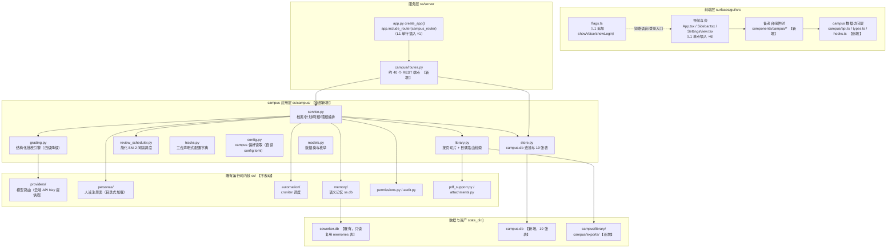
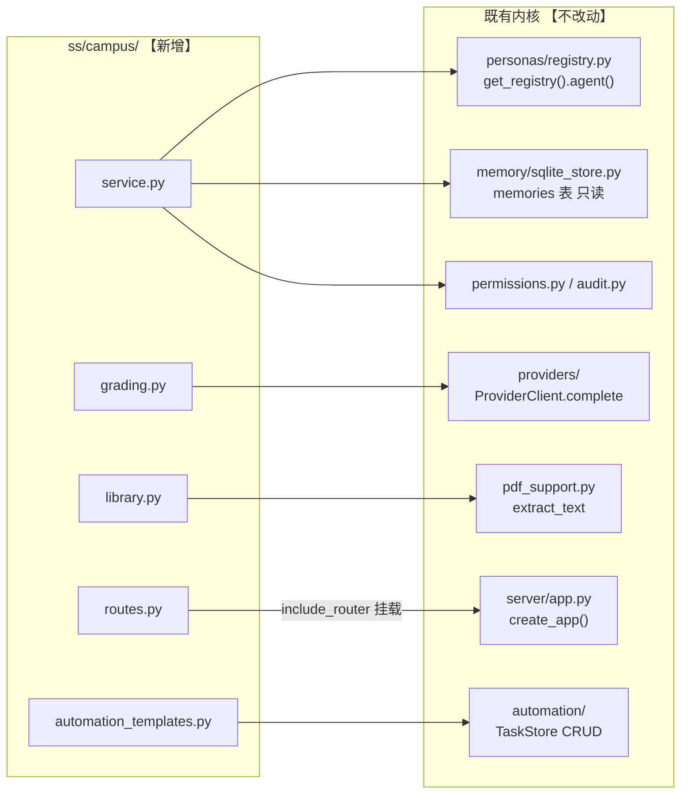
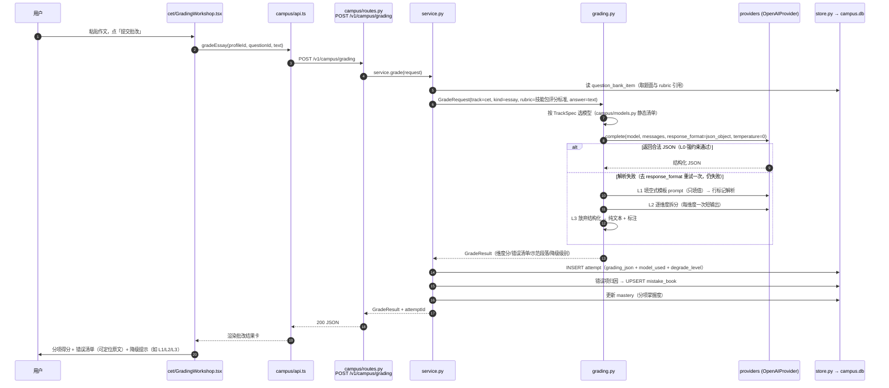
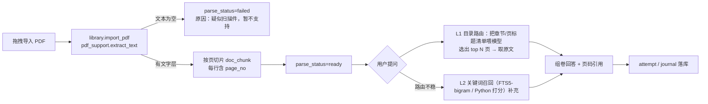
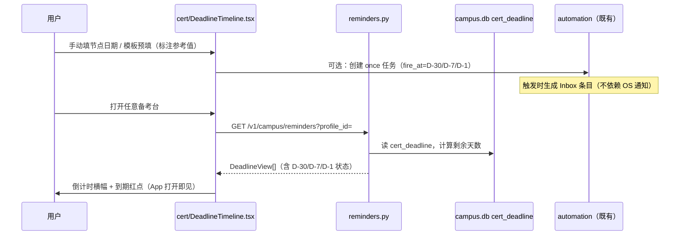

# 01 系统架构设计 — 偷偷学 StealthStudy

| 项 | 内容 |
|---|---|
| 文档编号 | dev/01 |
| 版本 | v1.0 |
| 日期 | 2026-09-08 |
| 作者 | 徐名可 |
| 上游依据 | `docs/PRD-CampusLearning.md` v1.1（已吸收 §13 技术可行性评审） |
| 读者 | 后端工程师 / 前端工程师 / QA |
| 关联文档 | `docs/dev/02-数据库设计.md`（表结构）、`03-API接口设计.md`（接口契约）、`04-前端设计.md`（组件与扩展点）、`05-人设与技能包设计.md`、`06-批改与检索引擎设计.md`、`07-开发任务分解.md`、`08-测试与验收方案.md` |

> 本文档回答四个问题：**新增什么、放在哪、怎么跟既有代码打交道、哪些既有代码绝对不能碰。**
> 所有对既有源码的行号引用以当前仓库基线为准（`D:\DeskTop\HIU-WorkSpace`），与 PRD §13 的核验结论一致。

---

## 1. 架构总览

### 1.1 设计原则：加法铁律的架构化表述

PRD §1.6 的"不删除、不大幅修改"在架构上落成**三级侵入等级**，本方案的全部改动都被限制在 L1 以内：

| 等级 | 定义 | 允许的形式 | 本方案中的数量 |
|---|---|---|---|
| **L0 纯新增** | 不触碰任何既有文件 | 新建文件 / 目录 / 表 / 配置项 / i18n key | 绝大多数（见 §2 模块清单） |
| **L1 单点插入** | 在既有文件的**渲染入口 / 路由分支 / 列表常量 / 函数体末尾**插入**不超过数行**的追加代码，不改任何既有函数的内部逻辑 | 条件短路、追加数组项、追加类型联合成员、`include_router` 一行 | **共 9 处**，见 §6 侵入点登记表 |
| **L2 修改** | 改既有函数内部逻辑 / 数据结构 / API 契约 | 禁止 | 0 处 |

### 1.2 总体分层图



### 1.3 一句话架构

> **campus 是挂在既有 Agent 运行时旁边的"平行应用层"：自己有独立的库文件、独立的路由器、独立的应用服务；对内核只做四种调用 —— 模型调用（providers）、人设解析（personas）、解析件（pdf_support）、调度注册（automation）；对权限与审计走既有引擎；对 `coworker.db` 只读 `memories` 表，绝不写入。**

---

## 2. 新增模块清单与职责

### 2.1 后端包 `ss/campus/`（11 个文件，全部 L0 纯新增）

| 文件 | 职责 | 关键公开接口（签名级） | 依赖的既有模块 |
|---|---|---|---|
| `__init__.py` | 包标识 | — | — |
| `models.py` | 数据类与枚举：`TrackType`、`Subject`、`Attribution`、`PlanTaskStatus`、`ParseStatus`、各表对应 dataclass | `class TrackType(str, Enum)` 等 | 无 |
| `store.py` | `campus.db` 连接管理 + 19 张表建表 + `schema_meta` 版本迁移。**照抄 `ss/memory/sqlite_store.py:13-43` 的连接模式**（`check_same_thread=False` + `threading.RLock` + 单连接），并补 `PRAGMA journal_mode=WAL` | `class CampusStore: __init__(self, path: str \| Path)`、`def migrate(self) -> int`、`def current_version(self) -> int`、各表 CRUD 方法 | `ss.secrets.state_dir` |
| `config.py` | campus 偏好读取。**自读** `global_config_path()` 的 TOML（含嵌套 `[campus.*]` 表），不修改 `ss/config.py`（该文件只认 18 个顶层 key，见 PRD §13-A4） | `def load_campus_config() -> CampusConfig`、`class CampusConfig` | `ss.config.global_config_path` |
| `tracks.py` | 三台声明式配置字典（id / 名称 / i18n key / 启用模块 / 默认人设 / 默认考试结构 / 默认科目轨）。第四场景 = 往字典加一项 | `TRACKS: dict[str, TrackSpec]`、`class TrackSpec` | 无 |
| `service.py` | 业务编排：备考档案 CRUD、定级测评、计划生成落库、刷题会话、错题本、掌握度、节点管理。所有查询强制携带 `profile_id`（多档案隔离的横切约束） | `class CampusService: __init__(self, store, cfg)`、`def create_profile(...)`、`def generate_plan(...)`、`def submit_attempt(...)` 等 | `store.py`、`tracks.py` |
| `grading.py` | 结构化批改引擎。**独立于 `ss/reviewer.py`**（见 ADR-01）。四级降级 L0→L3 | `class GradingEngine: __init__(self, provider, model)`、`async def grade(self, req: GradeRequest) -> GradeResult`、`@dataclass GradeRequest/GradeResult` | `ss.providers`（`ProviderClient.complete`） |
| `library.py` | 资料导入、按页切片（pypdf 逐页 + `page_no`）、目录路由检索（L1 主力）与关键词召回（L2 补充）。**不引入 embedding**（见 ADR-08） | `class CampusLibrary: __init__(self, store, lib_dir)`、`def import_pdf(self, profile_id, file_path) -> SourceDoc`、`def retrieve(self, profile_id, query, top_k=6) -> list[Chunk]` | `ss.pdf_support`（`extract_text`） |
| `review_scheduler.py` | 简化 SM-2 间隔调度：答对间隔 1/2/4/7/15 天递增、答错重置 1 天；到期项拉取 | `def next_interval(streak: int) -> int`、`def apply_result(item, correct: bool) -> ReviewItem`、`def due_items(store, profile_id) -> list` | `store.py` |
| `reminders.py` | 应用内提醒（CERT-13 新口径）：读 `cert_deadline` 计算倒计时，产生到期/临期横幅事件。**不走 OS 桌面通知**（见 ADR-12） | `def deadline_snapshot(store, profile_id) -> list[DeadlineView]` | `store.py` |
| `routes.py` | FastAPI `APIRouter`，约 40 个端点。契约详见 `03-API接口设计.md` | `router = APIRouter(prefix="/v1/campus")`、`def build_campus_router(manager) -> APIRouter` | `ss.server.app`（仅类型引用） |
| `automation_templates.py` | 4 个自动化模板定义（每日复习推送 / 周报复盘 / 冲刺 / 节点提醒），**通过既有 automation CRUD 创建，不新增调度器** | `TEMPLATES: list[AutomationTemplate]`、`def install_template(mgr, profile_id, tpl_id) -> list[str]` | `ss.server.manager`（task_store） |

**落点**：`ss/campus/`（与 `ss/memory/`、`ss/teams/` 平级）。

### 2.2 前端 `surfaces/gui/src/`（全部 L0 新增 + §6 登记的 L1 插入）

| 路径 | 职责 |
|---|---|
| `src/campus/types.ts` | 与后端契约对齐的 TS 类型（Profile / Plan / Task / Attempt / GradeResult / DeadlineView 等），不 import 既有 `types.ts` |
| `src/campus/api.ts` | 数据访问函数清单（约 30 个）。自建 `httpBase()` / `apiToken()`（照抄 `src/api.ts:8-18` 的 globalThis 读取，**不 import 既有 api.ts**，见 `04-前端设计.md` §5） |
| `src/campus/hooks.ts` | `useCampusProfile` / `usePlanTasks` / `useReviewQueue` 等数据 hook + 轮询 |
| `src/campus/utils.ts` | 倒计时计算、日期格式化、SM-2 展示 |
| `src/components/campus/CampusStationView.tsx` | 三台共用壳组件，prop `track: "cet" \| "kaoyan" \| "cert"`（见 `04-前端设计.md` §3） |
| `src/components/campus/ProfileSwitcher.tsx` | 备考档案切换器（G-03） |
| `src/components/campus/cet/*` | 定级测评 / 高频词 / 写译批改 / 模考 五组组件 |
| `src/components/campus/kaoyan/*` | 规划器 / 四轨工作台 / 资料问答 / 进度周报 / 院校档案 |
| `src/components/campus/cert/*` | 知识点树 / 刷题 / 错题本 / 节点时间轴 / 主观题批改 |
| `src/components/campus/shared/*` | 三台共享：错题本面板、复习队列卡、掌握度标记、批改结果卡、倒计时横幅（CERT-13 应用内提醒的载体） |

### 2.3 数据资产（结构详见 `02-数据库设计.md`）

| 资产 | 路径 | 说明 |
|---|---|---|
| 学习库 | `state_dir()/campus.db` | Windows 11 实际为 `C:\Users\<用户名>\AppData\Roaming\ss\campus.db`（`ss/secrets.py:28-44`）。19 张表 |
| 资料原件与切片 | `state_dir()/campus/library/` | 按 `<profile_id>/<doc_id>/` 分目录 |
| 导出目录 | `state_dir()/campus/exports/` | Markdown / JSON / CSV |
| 一键清除 | 删除 `campus.db` + `campus/` 目录 | 不影响主程序（无任何既有代码引用该路径） |

---

## 3. 共用内核 vs 三台差异层

正式化 PRD §13.6 的分层模型。原则：**共享能力沉到 L1，台面差异只允许出现在 L2 配置与 L3 组件里**；若 V0.2 复盘时发现三台共用代码率 < 60%，按 PRD §8.3 降级为"通用台 + 配置包"，届时只动 L2/L3，L0/L1 不动。

### 3.1 四层模型

| 层 | 内容 | 三台是否共用 |
|---|---|---|
| **L0 基础设施** | `store.py`（19 张表）、`config.py`、`routes.py`、`models.py`、flags/i18n/侵入点 | 完全共用 |
| **L1 共享领域能力** | 批改引擎 `grading.py`、资料库 `library.py`、间隔调度 `review_scheduler.py`、错题本与掌握度（`service.py` 的对应方法）、`shared/*` 组件 | 完全共用（数据用 `track_type` + `subject` 区分） |
| **L2 场景编排** | `tracks.py` 的 `TrackSpec`：每台启用哪些模块、默认人设、默认科目/题型骨架、目标函数（425 分 / 四轨阶段 / 覆盖率） | 每台一份配置 |
| **L3 台面 UI** | `cet/*`、`kaoyan/*`、`cert/*` 组件 | 每台独立组件，但必须只消费 L1 的接口与 L2 的配置 |

### 3.2 TrackSpec 声明式配置（`tracks.py` 骨架）

```python
@dataclass(frozen=True)
class TrackSpec:
    track: str                      # "cet" | "kaoyan" | "cert"（第四场景预留 "other"）
    i18n_key: str                   # "campus.track.cet" 等
    modules: tuple[str, ...]        # 启用的模块 id，如 ("assessment","vocab","grading","mock")
    default_personas: tuple[str, ...]   # ("cet-examiner","cet-grader")
    subject_skeleton: tuple[str, ...]   # CET: ("listening","reading","writing","translation")
                                        # KY:  ("politics","english","math","major")
                                        # CERT: 由 knowledge_point 树承担，留空
    target_model: str               # "score_breakdown" | "stage_plan" | "coverage"

TRACKS: dict[str, TrackSpec] = {"cet": CET_SPEC, "kaoyan": KY_SPEC, "cert": CERT_SPEC}
```

约束：`service.py` 禁止写 `if track == "cet"` 分支判断业务逻辑；台面差异一律通过 `TrackSpec` 的字段取值表达。出现分支即视为分层破坏，code review 卡点。

### 3.3 模块归属矩阵

| 能力 | CET | 考研 | 证书 | 归属层 |
|---|---|---|---|---|
| 定级测评 | 主场 | — | — | L3 cet |
| 高频词 + SM-2 复习 | 主场 | 复用（词汇） | 复用（知识点卡片） | L1 `review_scheduler` |
| 写译/主观题批改 | 主场 | 复用（英一英二/分析题） | 主场（rubric） | L1 `grading.py` |
| 错题本五分类归因 | 共用 | 共用 | 主场 | L1（`mistake_book` 全 track 汇入） |
| 四轨阶段计划 | — | 主场 | — | L2 KY spec |
| 资料导入 + 按页问答 | 复用（听力文本） | 主场 | 复用（考纲 PDF） | L1 `library.py` |
| 知识点树 + 覆盖率 | — | 复用（数学章节） | 主场 | L1（`knowledge_point`/`mastery`） |
| 阶段化计时模考 | 主场 | — | — | L3 cet |
| 节点提醒（应用内） | 复用 | 复用 | 主场 | L1 `reminders.py` |
| 周报 | — | 主场 | — | L3 kaoyan |

---

## 4. 与既有模块的调用关系

### 4.1 调用关系图（campus 只允许沿这 7 条边进入内核）



### 4.2 逐模块调用契约

| 既有模块 | campus 怎么用 | 边界 |
|---|---|---|
| `providers/` | `grading.py` 等直接持 `ProviderClient`，调 `complete(model=..., messages=..., **settings)`。**结构化输出通过 `**settings` 透传 `response_format={"type":"json_object"}`**（`openai_provider.py:189-193` 原样透传；失败按 `openai_provider.py:92-120` 的 re-raise 行为去掉该参数重试） | 不改 providers 任何文件；不做运行时能力探测（`ModelCapabilities` 无 json_mode 标记，改用静态推荐清单，见 ADR-06） |
| `personas/` | 只读：`get_registry().agent(persona_id)` 解析人设 Agent。学习人设以目录形式放在 `personas/builtin/<id>/`，**零代码生效**（`personas/registry.py:176-192` 目录扫描） | 遵守三条 manifest 硬约束（ADR-05）；不调 `set_enabled/set_default` 等写接口 |
| `automation/` | `automation_templates.py` 调既有 TaskStore CRUD 创建 4 类模板任务。**CERT-13 的 D-30/D-7/D-1 用 `Schedule.kind="once"` + `fire_at`**（`automation/models.py:71-75`），不用 cron | 不新增调度器；明确**不依赖它做 OS 通知**（通道不存在，`Cargo.toml:15-25` 无通知插件） |
| `memory/` | 语义记忆（"用户听力篇章弱"等自然语言记忆）经既有 memory 工具写入 `coworker.db` 的 `memories` 表 | **只通过既有 memory 工具链调用，不直连该库；不修改 `memories` 表结构** |
| `permissions.py / audit.py` | campus 的所有文件操作（资料导入/导出/删除）走既有权限引擎；批改调用产生审计记录沿用既有审计管道 | 不绕过；不新增权限模式 |
| `pdf_support.py` | `library.py` 调 `extract_text()` 做按页切片；**必须对返回空串判空**（扫描件静默返回空，`pdf_support.py:102-104`），标 `parse_status=failed`（见 ADR-09） | 不改 pdf_support 任何文件；栅格化/视觉兜底推迟到 V0.2 |
| `server/app.py` | 唯一改动：`create_app()` 内插入 `app.include_router(campus_router)`（`app.py:187` 的 `app = FastAPI(...)` 之后；该文件 2882 行 180 条内联路由、全项目无 APIRouter 先例，故 campus 自带 router 挂载） | campus 端点全部带前缀 `/v1/campus/*`，与既有 180 条路由零冲突；沿用既有 `X-StealthStudy-Token` 鉴权（`app.py` 的 `_request_authenticated`） |
| `ss/reviewer.py` | **不调用、不修改**。它是动作安全闸门（`reviewer.py:177, 349-357`），输出契约只有 `allow/deny/unsure`，与批改无关（ADR-01） | 批改引擎只借鉴其工程模式：`asyncio.wait_for` 超时、异常兜底不抛、token 计量 |
| `ss/teams/` | **V0.1 不调用写路径**。KY-03 降级为自建只读任务列表（ADR-11） | `board_card_id` 字段保留但不写入；V0.2 若做只读同步只调 `GET /v1/board/items` |
| `ss/compaction.py` | **不依赖**。资料问答走按页切片检索（ADR-08）；Compaction 仍服务于既有会话，campus 不触发它 | — |

### 4.3 对 `coworker.db` 与 `campus.db` 的隔离原则

1. 两个库、两条独立连接、两个独立 store 类；`campus.db` 的连接管理**照抄** `ss/memory/sqlite_store.py:13-43`（`check_same_thread=False` + `RLock` + 单连接），并补 `PRAGMA journal_mode=WAL`。
2. campus 不对 `coworker.db` 做任何写操作；`memories` 表的写入只通过既有 memory 工具链。
3. 删除 `campus.db` 与 `campus/` 目录后，主程序全部功能不受影响（无既有代码引用该路径，PRD §13-B6 已核验）。

---

## 5. 关键数据流

### 5.1 一次作文批改：从 UI 到落库的完整路径（V0.1 承重链路）



要点：`grading_json` 的结构由技能包固定（PRD §6.3），`degrade_level` 字段记录本次实际使用的降级档位，作为 V0.0 量化验收（`08-测试与验收方案.md` §4）与"两次批改一致性"承诺范围（仅推荐模型，PRD v1.1 B 类①）的数据依据。

### 5.2 资料导入与按页问答（KY-09 主链路）



### 5.3 定时提醒（CERT-13，应用内提醒口径）



---

## 6. 侵入点登记表（对既有文件的全部改动，原 9 处；设计落地的追加 4 处见 §6.1）

> 这是"只做加法"铁律的执行清单。**任何不在本表中的既有文件改动都必须回到 PRD §11 走变更申请。**
> 具体代码形态见 `04-前端设计.md` §4 与 `03-API接口设计.md` §2。

| # | 文件 | 位置 | 改动形式 | 目的 | 对应需求 |
|---|---|---|---|---|---|
| 1 | `surfaces/gui/src/App.tsx` | `:276-278` | 类型联合追加 3 个成员 `"cet" \| "kaoyan" \| "cert"` | surface state 扩展 | G-02 / INF-04 |
| 2 | `surfaces/gui/src/App.tsx` | `:1785`（`surface === "persona"` 分支后） | 三元链追加 3 个分支，渲染 `<CampusStationView track=.../>` | 路由接入 | G-02 |
| 3 | `surfaces/gui/src/components/Sidebar.tsx` | `:1033-1067` 按钮区（Automations 行之后） | 追加 3 个导航 `<button>`（照抄 Automations 行写法，label 走 `t()`） | 备考台入口。**不动 `:33` 的 `SURFACES`**（那是人设手风琴兜底，非导航） | G-02 |
| 4 | `surfaces/gui/src/components/SettingsView.tsx` | `:58` | `SetTab` 联合追加 `"campus"` | 设置页 tab | G-09 |
| 5 | `surfaces/gui/src/components/SettingsView.tsx` | `:70-78` | `SET_TABS` 追加 1 项（icon 用已存在的 `book`，在 `:69` 字面量联合内） | 同上 | G-09 |
| 6 | `surfaces/gui/src/components/SettingsView.tsx` | `:151` | 渲染三元链追加 `tab === "campus" ? <CampusSection/>`；并在 `:95` 的既有过滤链上追加 `voice` 过滤（同款先例：`.filter(tab => tab.key !== "personas")`） | campus tab + 语音 tab 隐藏 | G-09 / G-05 |
| 7 | `surfaces/gui/src/components/Composer.tsx` | `:733-757` | 麦克风按钮包一层 `showVoice() &&` 短路。**这是全应用语音唯一入口，禁止去改其余 22 个命中关键词的文件** | 语音入口关闭 | G-05 |
| 8 | `surfaces/gui/src/flags.ts` | 文件末尾 | 追加 `showVoice()` / `showLogin()`（复用既有 `flag(key, fallback)`，`:8-19`），以及登录区两处短路引用（`Sidebar.tsx:1166-1256` 账户区、`SettingsView`/`Onboarding` 登录块） | Feature Flag 机制复用，不新建配置文件 | G-05 / G-06 |
| 9 | `ss/server/app.py` | `:187`（`app = FastAPI(...)` 之后） | `app.include_router(build_campus_router(manager))` 单行 | campus 路由挂载 | INF-01 |

另有两处**追加式数据文件**改动（不计入代码侵入）：`locales/zh.json`、`en.json` 追加 `campus.*` 命名空间——必须双语同步，`locales.test.ts:31-38` 强制 key 集合相等，漏一边 CI 直接红。

### 6.1 设计落地追加登记（备考台原型落地，原 9 处之外）

| # | 文件 | 位置 | 改动形式 | 目的 |
|---|---|---|---|---|
| 10 | `surfaces/gui/src/main.tsx` | `./styles.css` 之后 | `import "./campus-station.css";` 单行 | 备考台样式层接入 |
| 11 | `surfaces/gui/src/styles.css` | 亮/暗两段末尾 | **只追加**设计令牌（圆角阶 `--r-*`、`--ring`、`--on-accent`、`--icon`、阴影四枚），既有规则一字不动 | 与原型令牌对齐 |
| 12 | `surfaces/gui/tailwind.config.js` | `theme.extend` | 追加 `inkOnAccent` 颜色映射与 `borderRadius.lg2/xl2` | 让 Tailwind 工具类引用同一批令牌 |
| 13 | `surfaces/gui/src/components/Icon.tsx` | `IconName` 联合 + default 分支 | 类型联合追加站点图标名，default 分支渲染站点几何；不改既有 12 个图标的分支 | 三个台子的线稿图标 |

两个**新增文件**也落在 campus 目录之外：`surfaces/gui/src/campus-station.css` 与 `surfaces/gui/src/components/campus-icons.tsx`。理由是它们必须能被 `main.tsx` / `Icon.tsx` 直接 import，而 `src/campus/**` 按约定只放数据层与面板；整层样式一律加 `.campus-station` 作用域前缀，因为 `styles.css` 里有 11 个同名类（`btn`/`dot`/`hero`/`ic`/`md`/`prose`/`sel`/`who` 等）会与之级联冲突。`ui-mocks/**` 是设计稿目录，不进构建产物，`test_intrusion_budget.py` 把它算作非生产树。

---

## 7. 关键设计决策记录（ADR）

> 编号与 PRD §13.5 / v1.1 §0.0 的 A 类（A1–A9）、B 类及产品决策一一对应。

### ADR-01 批改引擎独立于 Reviewer（对应 §13-A1）

- **背景**：PRD v1.0 曾假设"复用 Reviewer"。核验：`reviewer.py:349-357` 输入固定为 `request/history/tool_name/arguments/provenance`，无 rubric 参数；`Verdict`（`:180-200`）只有 `verdict/reason`；`parse_verdict`（`:177, 207-229`）只接受三枚举，其余 JSON 一律 fail-closed。
- **决策**：新建 `ss/campus/grading.py`，独立调用 `ProviderClient.complete`；**不修改 reviewer.py**——它是权限链路一部分（`config.py:45-54` Auto-Approve/Shadow 依赖），改它会污染安全语义。
- **借鉴**：reviewer 的工程模式——`asyncio.wait_for` 超时、异常兜底不抛、token 计量（`reviewer.py:349-396`）。

### ADR-02 技能包落点改为人设 bundle（对应 §13-A2）

- **背景**：`ss/skills/campus/` 不会被扫描——`SkillStore` 只认 `state_dir()/skills`（`skills/store.py:87`）与 `<workspace>/.coworker/skills`（`:93, 96-107`）两档。
- **决策**：7 个技能包放 `ss/personas/builtin/<persona-id>/skills/<skill-name>/SKILL.md`。依据：`personas/registry.py:184-192` 支持人设目录下 `skills/` 同级；`server/manager.py:5830-5843` 的 `persona_skill_scope()` 会把它作为 `extra_skill_dirs` 注入 `SkillLoader`（`skills/base.py:45-48` 按 `<dir>/<name>/SKILL.md` 发现）；`manifest.skills` 字段（`manifest.py:81, 333`）是 allowlist。
- **备选**：首启播种到 `state_dir()/skills/`。放弃原因：引入运行时写状态目录的副作用，且随人设卸载不同步。

### ADR-03 导航入口在按钮区，不在 SURFACES（对应 §13-A3）

- **背景**：`Sidebar.tsx:33` 的 `SURFACES` 仅在 personas 未加载时兜底（`:853-862`），渲染为"手风琴头 + 会话列表"（`:1080-1121`），点头只展开不切换 surface。
- **决策**：在 `Sidebar.tsx:1033-1067` 的导航按钮区（New session / Search / Automations 之后）追加 3 个 `<button>`，label 走 i18n（`SURFACES.label` 是硬编码英文，直接写中文违反 G5）。

### ADR-04 配置双轨：复用 flags.ts + campus 自读 TOML（对应 §13-A4）

- **背景**：`config.toml` 是扁平 KV，`load_config()`（`config.py:132-157`）只认 18 个顶层 key（`:78-95`）；写 `[features]` 会被静默忽略。
- **决策**：① 前端语音/登录开关复用 `surfaces/gui/src/flags.ts:8-19` 的 `flag(key, fallback)`（localStorage），追加 `showVoice()`/`showLogin()`，零新依赖且天然可逆；② 后端 `campus.*` 偏好由新增 `ss/campus/config.py` 自行 `tomllib.load(global_config_path())` 读嵌套表，不碰 `ss/config.py`。

### ADR-05 人设 manifest 三条硬约束（对应 §13-A5）

1. **不写 `ships` 字段**（默认 True，`manifest.py:91, 337`）。陷阱：现有 14 个 markdown 人设全部 `ships: false`，照抄模板 → 新人设全部隐身（`registry.py:247-250`：`_visible = ships or include_unshipped() or 显式启用`，后者需 `OPENWORKER_UNSHIPPED=1`）。
2. **`group` 只能 `general` 或 `security`**（`manifest.py:29`）。写 `campus` 抛 `ManifestError` 打断整个注册表加载。
3. **`team` 不填 `worker`**（否则 `default_surfaced=False`，`registry.py:211`）。
   附加：人设 `icon` 只能取 `personaIcon.tsx:19-33` 的 NAMED 集合（不含 `book`；可用 `pencil`/`clock`/`shield`/`table` 或 emoji），否则静默回退 `sparkle`。

### ADR-06 模型能力：静态推荐清单 + response_format 试错（对应 §13-A6）

- **背景**：`ModelCapabilities` 仅 `tools/vision/pdf/parallel_tool_calls/streaming` 五字段（`base.py:81-90`），无 json_mode 标记；`matrix.py` 未覆盖全部模型条目。运行时能力探测不可行。
- **决策**：① `ss/campus/models.py` 维护 `{任务 → [推荐模型, 最低可用模型]}` 静态清单，UI 明示建议；② 结构化输出以 `provider.complete(**{"response_format": {...}})` 试错（`openai_provider.py:189-193` 透传；`:92-120` 对未列举参数 re-raise，故 try/except 后去参重试）。

### ADR-07 路由用 APIRouter 单点挂载（对应 §13-A7）

- **背景**：`server/app.py` 2882 行、180 条内联路由、全项目无 `APIRouter`/`include_router` 先例。
- **决策**：campus 自带 `APIRouter(prefix="/v1/campus")`，在 `create_app()` 内 `app.include_router(...)` 单行挂载（侵入点 #9）。沿用既有 token 鉴权中间件。

### ADR-08 资料检索：按页切片 + 目录路由，不引入 embedding（对应 §13-A8）

- **背景**：Compaction 触发阈值在中等上下文模型上约 102,400 token（`compaction.py:23-26, 60-68`），200 页中文教材约 15 万 token 单份超限；且摘要有损（`:391`），与 KY-09"页码引用"验收冲突。全项目无向量/FTS 基础设施。
- **决策**：L1 目录路由为主力（章节/页标题清单喂模型选页，天然带页码、7B 可靠、零新依赖），L2 关键词召回补充（FTS5-bigram 或 Python 侧打分），**明确不引入 embedding/向量库**（与"本地轻量、复杂度适中"冲突）。数据层新增 `doc_chunk` 表（切片粒度与索引见 `02-数据库设计.md` §5）。

### ADR-09 扫描件判空标 failed（对应 §13-A9）

- **背景**：`pdf_support.py:102-104` 对扫描件**静默返回空字符串**（非报错），照常入库会产生"就绪但全是幻觉"的资料。
- **决策**：`library.import_pdf` 对提取文本判空（低于阈值同样按空处理），`parse_status=failed`，原因"疑似扫描件（无文字层），暂不支持"；OCR 不进 V0.x，视觉模型兜底推迟到 V0.2（复用既有 `rasterize()`，受 `RASTER_MAX_PAGES=100` 限制）。

### ADR-10 独立 campus.db + schema_meta 版本迁移（对应 v1.1 B 类④）

- **决策**：19 张表落独立 `campus.db`；连接管理照抄 `sqlite_store.py:13-43` 模式 + WAL；`schema_meta` 单行版本号 + 启动时顺序迁移（实现见 `02-数据库设计.md` §4）。

### ADR-11 看板自建只读列表，不用 Teams board 写路径（对应 v1.1 B 类③）

- **背景**：Teams 看板状态固定六态（`teams/model.py:16-22`）、`done` 为终态不可回退（`EDGES`，`:31-38`）、space 绑定真实工作区文件夹（`:79-84`），与备考语义三处硬冲突。
- **决策**：V0.1 备考看板由 `campus.db` 的 `plan_task.status` 自建（前端四列布局）；`board_card_id` 字段保留不写；V0.2 如做只读同步仅调 `GET /v1/board/items`（`server/app.py:863-876`）。
- **注意**：PRD v1.1 的 §4.4 KY1 正文、§4.8 KY-03 行、§5.1/§5.3 流程图、§6.1 存储决策表仍残留"同步到 Teams 看板 / 拖卡写回"表述（见交付回报中的残留清单），**以本 ADR 与 PRD §0.0 / §10.4 的修订口径为准**。

### ADR-12 CERT-13 走应用内提醒，不加 Tauri 插件（对应 v1.1 产品决策③）

- **背景**：`Cargo.toml:15-25` 无 `tauri-plugin-notification`；`_notify_task_done()`（`server/manager.py:4957-4990`）只有 WebSocket 广播 + 连接器两条路；调度器在 sidecar 内，App 关闭即停（`automation/scheduler.py:1-7`，错过任务下次启动补跑）。
- **决策**：节点提醒以 `cert_deadline` 为数据源、`reminders.py` 计算倒计时、`shared/DeadlineBanner` 应用内横幅呈现；自动化 `once` 任务仅作为补充（触发时生成 Inbox 条目）。验收口径：**打开应用即看到到期提醒**，不承诺 OS 级推送。

### ADR-13 V0.1 三台同时上线 + 内部优先级分层（对应 v1.1 产品决策①）

- **决策**：三台同一版本开放入口，但实现顺序内部分层：CET（定级→计划→高频词→批改）→ KY（规划→四轨→资料问答→周报）→ CERT（知识点树→刷题→归因→节点）。分层的依据是共享能力就绪顺序（批改引擎 → 资料库 → 复习调度），而非产品优先级。任务编排见 `07-开发任务分解.md`。

---

## 8. 非功能架构约束

| 约束 | 架构落点 |
|---|---|
| 性能预算（PRD §7.1） | 列表类查询全部带 `profile_id` + 分页；错题本 1000 条首屏 ≤500ms 由索引保证（`02-数据库设计.md` §6）；批改/问答走 `asyncio.to_thread` 包裹的阻塞 `complete()`（与 engine 同款模式），前端超时可中断 |
| 缺模型降级 | 无模型时 AI 功能按钮禁用并提示（PRD §7.6）；静态推荐清单驱动"哪些功能当前模型可用"的判定 |
| 错误处理 | 三原则：不静默失败（扫描件判空即 ADR-09）、AI 结果必标"仅供参考"（PRD §7.6 通用原则）、结构化解析失败必须降级而非报错（ADR-01 的 L0→L3） |
| Windows 11 | `state_dir()` 落 `%APPDATA%\ss`（隐藏目录，隐私面板用 `explorer.exe` 直开绝对路径）；时间 zone 用 `tzdata`（已在 `pyproject.toml`，Windows 无系统 tz 库）；`once` 任务 `fire_at` 存 ISO 本地时间 + timezone 字段 |
| 审计 | campus 文件操作与批改调用沿用既有 `permissions.py` / `audit.py` 管道，不新建审计表 |

---

## 9. 文档分工与交叉引用

| 本文档章节 | 展开位置 |
|---|---|
| §2.3 数据资产、§5 链路中的表操作 | `02-数据库设计.md`（19 张表字段、索引、迁移、`doc_chunk` 切片粒度） |
| §2.1 `routes.py`、§4.2 鉴权、侵入点 #9 | `03-API接口设计.md`（端点契约表、错误码、WS 结论） |
| §2.2 组件清单、§6 前端侵入点、ADR-03/04 | `04-前端设计.md`（组件树、prop 契约、扩展点代码形态、i18n 规范） |
| §4.2 personas 行、ADR-02/05 | `05-人设与技能包设计.md`（manifest 模板、SKILL.md 与 rubric 全文） |
| §5.1/§5.2 链路、ADR-01/06/08/09 | `06-批改与检索引擎设计.md`（grading 四级降级 prompt 策略、检索实现） |
| §3 分层、ADR-13 | `07-开发任务分解.md`（V0.0/V0.1 任务序列、估时） |
| §7 全部 ADR 的可验证性 | `08-测试与验收方案.md`（V0.0 三个 spike 量化标准、回归与 e2e 用例） |
