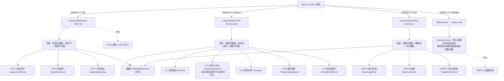

# 04 前端设计 — 备考台组件树与扩展点落地

| 项 | 内容 |
|---|---|
| 文档编号 | dev/04 |
| 版本 | v1.0 |
| 日期 | 2026-09-08 |
| 作者 | 徐名可 |
| 上游依据 | `docs/PRD-CampusLearning.md` v1.1 §3.2/§4.2–4.5、`docs/dev/01-系统架构设计.md` §2.2/§6（9 处侵入点登记）、`docs/dev/03-API接口设计.md`（72 端点契约） |
| 读者 | 前端工程师 / QA |
| 关联文档 | `01-系统架构设计.md`（分层与侵入点总表）、`05-人设与技能包设计.md`、`07-开发任务分解.md`（INF-04/05/07）、`08-测试与验收方案.md`（INF-06/07、回归） |

> 本文所有"既有文件"行号以当前仓库基线为准。**9 处侵入点编号沿用 01 文档 §6 登记表**，本文给出每处的精确代码形态（改动前 → 改动后）。

---

## 1. 总览

### 1.1 技术栈与既有约定（全部沿用，不引入新依赖）

| 项 | 约定 |
|---|---|
| 框架 | React 18 + TypeScript + Vite 5 + Tailwind CSS 3（不新增任何 npm 依赖；图标只用既有 `Icon.tsx` 的 `IconName`） |
| i18n | react-i18next，新增文案全部走 `campus.*` key（§7），禁硬编码 |
| 数据访问 | `campus/api.ts` 自建 fetch 封装（照抄 `api.ts:8-18` 的 globalThis 解析，**不 import 既有 api.ts**）；无 WebSocket（03 文档 §3 结论），长任务用轮询 |
| 状态 | 组件内 `useState`/`useMemo` + 跨组件用 React Context（`CampusProfileContext`）；**不引入状态库** |
| 测试 | Vitest + Testing Library（对齐既有 `*.test.tsx` 风格） |

### 1.2 新增文件清单（L0 纯新增）

```
surfaces/gui/src/
├── campus/
│   ├── types.ts          # 与 02 文档表结构对齐的 TS 类型
│   ├── api.ts            # 72 端点的函数封装（§6）
│   ├── hooks.ts          # useProfiles / useActiveProfile / usePlanTasks / useDueReviews / pollDocReady
│   └── utils.ts          # 倒计时、日期、SM-2 展示、campusApiError 归一
└── components/campus/
    ├── CampusStationView.tsx      # 三台共用壳（track prop）
    ├── ProfileSwitcher.tsx        # 档案切换器（G-03）
    ├── CampusSection.tsx          # 设置页 campus tab 面板（G-09）
    ├── shared/                    # 三台共享组件（§3.2）
    │   ├── DeadlineBanner.tsx     # 应用内提醒横幅（CERT-13，ADR-12）
    │   ├── MistakeBookPanel.tsx   # 错题本列表（含虚拟滚动）
    │   ├── ReviewQueueCard.tsx    # 今日复习卡
    │   ├── GradingResultCard.tsx  # 批改结果卡（degrade_level>=1 强提示）
    │   ├── MasteryDots.tsx        # 掌握度三态标记（颜色+图标+文字，PRD §7.4）
    │   └── EmptyModelGuide.tsx    # 未配置模型的引导条（PRD §7.6）
    ├── cet/    AssessmentPanel.tsx  VocabDailyCard.tsx  GradingWorkshop.tsx  MockExamConsole.tsx
    ├── kaoyan/ PlanGantt.tsx  SubjectWorkbench.tsx  LibraryQA.tsx  ProgressDashboard.tsx  WeeklyReportCard.tsx  SchoolProfileCard.tsx
    └── cert/   KnowledgeTree.tsx  PracticeSession.tsx  AttributionPie.tsx  DeadlineTimeline.tsx
```

---

## 2. 页面结构与导航

### 2.1 页面结构图



布局规则：三台共用"顶部状态带 + 主工作区"两段式；`CampusStationView` 顶部固定渲染 `ProfileSwitcher` + `EmptyModelGuide`（无模型时）+ 对应 track 的横幅（CET 倒计时 / KY 四轨环形 / CERT `DeadlineBanner`）。

### 2.2 导航接入（侵入点 #3）

见 §4.3。

---

## 3. CampusStationView 组件树与 prop 契约

### 3.1 顶层契约

```tsx
// components/campus/CampusStationView.tsx
export type CampusTrack = "cet" | "kaoyan" | "cert";

export function CampusStationView({ track }: { track: CampusTrack }): JSX.Element
```

| prop | 类型 | 说明 |
|---|---|---|
| `track` | `"cet" \| "kaoyan" \| "cert"` | 由 `App.tsx` 三元链分支传入字面量；组件内部**只读 `tracks` 配置对象决定渲染哪些面板**，不写 `if (track === "cet")` 业务分支（01 文档 §3.2 分层守则；台面组件的选择本身由 L2 配置驱动） |

内部数据流：`CampusStationView` 调 `useProfiles()` → 无档案时渲染引导卡（"先建档 / 做定级测评"）；有档案时经 `CampusProfileContext` 下发 `activeProfile`，子组件只消费 context，**不各自请求档案**。

### 3.2 共享组件 prop 契约（要点）

| 组件 | props | 契约要点 |
|---|---|---|
| `ProfileSwitcher` | `profiles`, `activeId`, `onSwitch`, `onCreate`, `onArchive` | 新建走 A2；归档（PATCH status=archived）后从列表隐藏；重启保持由 `app_state.active_profile_id`（A6/A7）保证 |
| `GradingResultCard` | `result: GradeResult`, `onLocate?(offset)`, `onAddToMistake?` | `degrade_level >= 1` 时顶部渲染 `t("campus.grading.degrade_notice_n")` 强提示（03 文档 C1 契约）；错误清单每条可点击定位原文（`offset`） |
| `MistakeBookPanel` | `profileId`, `filters?` | 列表用虚拟滚动（千条 ≤500ms，02 §6 索引支撑）；筛选变更触发 D1 重查；归因标签点击改走 D2 |
| `ReviewQueueCard` | `dueItems`, `onResult(id, correct)` | 提交 D6 后本地乐观更新间隔与下次到期 |
| `DeadlineBanner` | `views: DeadlineView[]` | `days_left ∈ {30,7,1,0}` 高亮；`is_reference=true` 追加"以官方公告为准"角标（CERT-12）；数据源 H10 |
| `EmptyModelGuide` | `capabilities` | 数据源 A8；仅列出当前模型不可用的功能，可用的不渲染 |
| `MasteryDots` | `level`, `size?` | 三态 = 颜色 + 图标 + 文字并列（PRD §7.4 无障碍要求，颜色不作唯一载体） |

### 3.3 各台主组件（关键 props 摘要）

| 组件 | 关键 props | 数据源（03 文档） |
|---|---|---|
| `AssessmentPanel` | `assessment`, `onAnswer(qid, answer)`, `onFinish` | F1/F2/F3/F4；draft 恢复由 GET F2 |
| `VocabDailyCard` | `today`, `onMark(id, mastery)`, `onMnemonic(id)` | F6/F7/F9 |
| `GradingWorkshop` | `history`, `onSubmit(kind, answer, rubricId?)` | C1/C3/C4；模板库（CET-11）为纯前端常量 |
| `MockExamConsole` | `mock`, `onStage(to)`, `onPause`, `onSubmit` | F10–F14；阶段锁定后作文区只读（`locked_stages`） |
| `PlanGantt` | `plans`, `tasks`, `onReschedule(date)` | F5/G3；甘特为 CSS Grid 自绘（不引图表库） |
| `SubjectWorkbench` | `subject`, `onAnswer`, `onExplain` | E5 + C1；四子页按 `subject` 切换 |
| `LibraryQA` | `docs`, `onAsk(question)`, `onGenerate(count)` | B1–B7；`citations` 渲染为可点击引用（doc+page） |
| `ProgressDashboard` | `progress` | G4；热力图 CSS Grid 自绘 |
| `KnowledgeTree` | `tree`, `onSetMastery(pointId, level)`, `onEdit` | H1/H2/H3/H5/H6；树用递归组件 + 折叠 |
| `PracticeSession` | `questions`, `onSubmitAttempt(qid, answer)` | E2/E5 |
| `DeadlineTimeline` | `deadlines`, `onCreateReminders(id)` | H7/H8/H9 |

---

## 4. 侵入点精确代码形态（9 处，编号沿用 01 文档 §6）

> 每处给出**改动前 → 改动后**或插入位置。全部为 L1 单点插入：不改任何既有函数内部逻辑。

### 4.1 侵入点 #1 — `App.tsx:276-278` surface 类型联合

```tsx
// 改动前
const [surface, setSurface] = useState<
  "session" | "scheduled" | "integrations" | "audit" | "inbox" | "persona" | "settings"
>("session");

// 改动后（追加 3 个联合成员，其余不动）
const [surface, setSurface] = useState<
  "session" | "scheduled" | "integrations" | "audit" | "inbox" | "persona" | "settings"
  | "cet" | "kaoyan" | "cert"
>("session");
```

### 4.2 侵入点 #2 — `App.tsx:1785` 三元链追加分支

在 `) : surface === "persona" ? ( <PersonaView ... /> ) : (` 的 `) : (` 之前插入三个分支；文件顶部追加一行 import：

```tsx
// 文件顶部（既有 import 块末尾追加）
import { CampusStationView } from "./components/campus/CampusStationView";

// :1785 处，PersonaView 分支后、最终 ) : ( 之前插入：
      ) : surface === "cet" ? (
        <CampusStationView track="cet" />
      ) : surface === "kaoyan" ? (
        <CampusStationView track="kaoyan" />
      ) : surface === "cert" ? (
        <CampusStationView track="cert" />
      ) : (
```

注意：三元链末尾 `: (` 的兜底分支（session 主视图）**保持不动**；`surface === "session"` 的辅助判断（`:1794` 等）不受影响。

### 4.3 侵入点 #3 — `Sidebar.tsx:1033-1067` 导航按钮区

**不要动 `:33` 的 `SURFACES` 常量**（那是人设手风琴的兜底数据，`Sidebar.tsx:853-862`；追加进去会渲染出 3 个带会话列表的"假人设"，且点头只展开不切换）。在 **Automations 导航行（`:1055-1067`）之后**追加同款 nav 行。文件顶部补 `CampusStationView` 无关——sidebar 只需要回调与图标：

```tsx
// props 新增三个回调（Sidebar 组件 props 类型追加，App.tsx 传入 setSurface）：
onOpenCampus: (track: "cet" | "kaoyan" | "cert") => void;
campusActive: string | null;

// :1067（Automations button 结束）之后插入，三个按钮共用本组的行样式：
<div className="px-2.5 mt-1">
  {([["cet", "book", "sidebar.campus_cet"],
     ["kaoyan", "clock", "sidebar.campus_kaoyan"],
     ["cert", "shield", "sidebar.campus_cert"]] as const).map(([tk, ic, key]) => (
    <button
      key={tk}
      className={"w-full flex items-center gap-2.5 px-2.5 py-2 rounded-lg text-[13px] text-left hover:bg-chromeHover hover:text-ink " +
        (props.campusActive === tk ? "text-ink bg-chromeHover" : "text-muted")}
      data-testid={"nav-campus-" + tk}
      onClick={() => props.onOpenCampus(tk)}
    >
      <Icon name={ic} size={15} />
      <span className="flex-1">{t(key)}</span>
    </button>
  ))}
</div>
```

要点：label 走 `t()`（`SURFACES.label` 是硬编码英文的教训，PRD §13-A3）；`book/clock/shield` 三个图标均存在于 `Icon.tsx` 的 `IconName`（`:11/:16/:36`），**不新增图标类型**（PRD §3.1-14 原判断正确）。注意 `personaIcon.tsx:19-33` 的 NAMED 集合不含 `book`，但那套只作用于**人设图标**，与本导航无关。

### 4.4 侵入点 #4 — `SettingsView.tsx:58` tab 类型联合

```tsx
// 改动前
type SetTab = "appearance" | "models" | "context" | "skills" | "voice" | "memory" | "personas";
// 改动后
type SetTab = "appearance" | "models" | "context" | "skills" | "voice" | "memory" | "personas" | "campus";
```

同步：`App.tsx:263-265` 的 `settingsTab` state 联合与 `:267` `openSettings` 参数联合**各追加 `"campus"`**（这两处属于侵入点 #1 的同文件追加，不单独计数）。

### 4.5 侵入点 #5 — `SettingsView.tsx:70-78` SET_TABS 列表

```tsx
// 数组末尾（personas 项之后）追加：
  { key: "campus", labelKey: "settings.tab.campus", icon: "book" },
```

`icon: "book"` 合法：`SET_TABS` 的 icon 字面量联合（`:69`）已含 `book`。

### 4.6 侵入点 #6 — `SettingsView.tsx:95` 过滤链 + `:151` 渲染链

```tsx
// :95 改动前（既有 personas 过滤，本项目的同款先例）
const tabs = personas ? SET_TABS : SET_TABS.filter((tab) => tab.key !== "personas");
// 改动后（链式追加 voice 过滤；campus tab 不参与过滤，恒显示）
const tabs = (personas ? SET_TABS : SET_TABS.filter((tab) => tab.key !== "personas"))
  .filter((tab) => showVoice() || tab.key !== "voice");

// :151 渲染三元链，voice 分支保持原位但在其外面包 showVoice()（防御深链）：
          ) : tab === "voice" ? (
            showVoice() ? <VoiceInputSection /> : null
          ) : tab === "campus" ? (
            <CampusSection />
          ) : tab === "memory" ? (
```

### 4.7 侵入点 #7 — `Composer.tsx:733-757` 麦克风按钮短路

既有结构是 `{isTauri() && ( <button .../> )}`（`:734`）。**只改这一个条件**：

```tsx
// 改动前
          {isTauri() && (
            <button ... > <Icon name={dictation?.recording ? "stop" : "mic"} size={16} /> </button>
          )}
// 改动后
          {isTauri() && showVoice() && (
            ...原 button 原样不动...
          )}
```

这是**全应用语音的唯一物理入口**：其余 22 个含 voice/mic 关键词的文件全部挂在 `dictation?.recording` / `voiceReady` / `api.ts` 的 STT 调用之下，录音不启动则全部不可达。**禁止扩散改动**（PRD v1.1 B⑤：明确禁止改 24 个命中文件）；`VoiceInputSection` 的配置页入口由侵入点 #6 关闭；Rust 侧 `stt/` crate 不动（不初始化、不下载模型即无麦克风权限请求，满足 G-04 验收 3）。

### 4.8 侵入点 #8 — flags.ts 追加 + 登录区短路

**（a）`flags.ts` 文件末尾追加**（实现见 §5）：

```ts
export const showVoice = () => flag("ocw.flag.voice", false);
export const showLogin = () => flag("ocw.flag.login", false);
```

**（b）`Sidebar.tsx` 账户菜单（`:1174-1198` 未登录分支）**：

```tsx
// 改动前：cloud?.signed_in ? (...) : ( <> not_signed_in 提示 + sign_in 按钮 </> )
// 改动后：else 分支内容包 showLogin()
                ) : showLogin() ? (
                  <>
                    ...not_signed_in 提示块与 sign_in 按钮原样...
                  </>
                ) : null}
```

**（c）`Sidebar.tsx:1255-1256` 账户行副标题**（账户行本身保留——它承载设置/收件箱菜单入口，不能整行删除）：

```tsx
// 改动前
            <span className={"truncate " + (cloud?.signed_in ? "" : "text-muted")}>
              {cloud?.signed_in ? accountName : t("sidebar.not_signed_in_row")}
            </span>
// 改动后（三元追加一档；flag 关闭且未登录时不再出现"未登录"字样）
            <span className={"truncate " + (cloud?.signed_in ? "" : "text-muted")}>
              {cloud?.signed_in ? accountName
                : showLogin() ? t("sidebar.not_signed_in_row")
                : "偷偷学"}
            </span>
```

**（d）`Onboarding.tsx` step 2 的登录提示带（约 `:240-280`，`onboarding.signin_for_oneclick` 文案带 + `ob-cloud-signin` 按钮）**：整块包 `{showLogin() && (...)}`。step 1 的 provider 表单（API Key / Ollama）**保留**——那是模型配置不是登录（PRD §3.3.3 边界定义），G-06 验收的是"无登录/注册/授权页面"。

不触碰：`api.ts` 的 `cloudLogin/waitForCloudSignIn` 等函数、`AccessSection.tsx`、连接器 OAuth 逻辑（归 Integrations，PRD §3.3.3"不授权也能 100% 用"）。

### 4.9 侵入点 #9 — `coworker/server/app.py:187`（后端）

代码形态见 `03-API接口设计.md` §2，此处不重复。

---

## 5. flags.ts 实现（Feature Flag 复用，ADR-04）

既有机制（`flags.ts:8-19`）：`flag(key, fallback)` 读 `localStorage`，`"1"/"0"` 强制、否则用 fallback；**渲染期读取**（非 import 期），测试与运行构建可翻转。追加两个导出：

```ts
/** CampusWorker v1.1（PRD G-05/G-06）：语音识别与云登录的入口开关。
 *  默认关闭 = 用户可感知层面无语音入口、无登录入口；代码与 i18n 文案全部保留，可逆。
 *  开发者模式验证可逆性（G-04 验收 7）：localStorage.setItem("ocw.flag.voice","1") 后刷新。 */
export const showVoice = () => flag("ocw.flag.voice", false);
export const showLogin = () => flag("ocw.flag.login", false);
```

设计说明：

1. **默认值 `false` 写死在代码里**，不读 config.toml、不读后端——保证"无任何配置文件时默认关闭"，且无需后端配合（PRD §3.3.1 ①的 `features.voice=false` 由本机制承担，不再新建 TOML 配置）。
2. `campus.config.py`（后端）只承载 `campus.*` 偏好（每日时长/推送时间等），**不承载这两个开关**——开关是前端渲染层概念（ADR-04 双轨划分）。
3. INF-07 回归测试直接用 `localStorage.setItem` 驱动两种状态（`08-测试与验收方案.md` §5）。

---

## 6. `campus/api.ts` 函数清单（与 03 文档 72 端点一一对应）

### 6.1 封装骨架（照抄 `api.ts:8-18` 的解析，不 import 既有 api.ts）

```ts
const httpBase = (): string =>
  (globalThis as any).__COWORKER_HTTP__ || (import.meta as any).env?.VITE_COWORKER_HTTP
  || "http://127.0.0.1:8765";
const apiToken = (): string =>
  (globalThis as any).__COWORKER_API_TOKEN__ || (import.meta as any).env?.VITE_COWORKER_API_TOKEN || "";

const fetch = async (path: string, init: RequestInit = {}): Promise<any> => {
  const headers = new Headers(init.headers);
  if (apiToken()) headers.set("X-StealthStudy-Token", apiToken());
  if (init.body && !headers.has("Content-Type")) headers.set("Content-Type", "application/json");
  const res = await globalThis.fetch(httpBase() + path, { ...init, headers });
  if (!res.ok) throw await toCampusError(res);          // 解包 {detail:{code,message,retryable}}
  return res.status === 204 ? null : res.json();
};

export class CampusApiError extends Error {
  constructor(public code: string, message: string, public retryable: boolean, public status: number) { super(message); }
}
```

### 6.2 函数清单（72 端点 → 函数）

| 03 编号 | 端点 | 函数签名（返回为 Promise） | 03 编号 | 端点 | 函数签名 |
|---|---|---|---|---|---|
| A1 | GET profiles | `listProfiles(track?, status?)` | F2 | GET assessments/{id} | `getAssessment(id)` |
| A2 | POST profiles | `createProfile(input)` | F3 | PATCH assessments/{id} | `patchAssessment(id, answers)` |
| A3 | GET profiles/{pid} | `getProfile(pid)` | F4 | POST …/finish | `finishAssessment(id)` |
| A4 | PATCH profiles/{pid} | `patchProfile(pid, patch)` | F5 | POST plans/generate | `generatePlan(profileId)` |
| A5 | DELETE profiles/{pid} | `deleteProfile(pid)` | F6 | GET vocab/today | `listVocabToday(profileId)` |
| A6 | GET app-state | `getAppState()` | F7 | PATCH vocab/{id} | `setVocabMastery(id, mastery)` |
| A7 | PATCH app-state | `patchAppState(patch)` | F8 | POST vocab/import | `importVocab(profileId, format, content)` |
| A8 | GET capabilities | `getCapabilities()` | F9 | POST vocab/mnemonic | `makeMnemonic(vocabId)` |
| A9 | GET privacy | `getPrivacy()` | F10 | POST mock-exams | `createMockExam(profileId, title)` |
| A10 | PATCH privacy | `setOfflineMode(on)` | F11 | GET mock-exams/{id} | `getMockExam(id)` |
| B1 | POST library/import | `importLibraryDoc(profileId, file)` (multipart) | F12 | POST …/stage | `advanceMockStage(id, to)` |
| B2 | GET library | `listLibraryDocs(profileId, status?)` | F13 | POST …/pause | `pauseMockExam(id)` |
| B3 | GET library/{id} | `getLibraryDoc(id)` | F14 | POST …/submit | `submitMockExam(id)` |
| B4 | DELETE library/{id} | `deleteLibraryDoc(id)` | G1 | GET tasks | `listTasks(profileId, q?)` |
| B5 | POST …/retry | `retryLibraryDoc(id)` | G2 | PATCH tasks/{id} | `patchTask(id, patch)` |
| B6 | POST qa | `askLibrary(profileId, question, docId?)` | G3 | POST plans/{id}/reschedule | `reschedulePlan(planId, newDate?)` |
| B7 | POST qa/generate-questions | `generateQuestionsFromDoc(input)` | G4 | GET progress | `getProgress(profileId)` |
| C1 | POST grading | `submitGrading(input)` | G5 | POST weekly-reports/generate | `generateWeeklyReport(profileId)` |
| C2 | GET grading/{id} | `getAttempt(id)` | G6 | GET weekly-reports | `listWeeklyReports(profileId)` |
| C3 | GET grading/history | `listGradingHistory(profileId, q?)` | G7 | GET school-profile | `getSchoolProfile(profileId)` |
| C4 | GET grading/common-errors | `getCommonErrors(profileId, kind?)` | G8 | PATCH school-profile | `patchSchoolProfile(profileId, patch)` |
| D1 | GET mistakes | `listMistakes(profileId, q?)` | G9 | POST …/extract | `extractSchoolProfile(profileId, text)` |
| D2 | PATCH mistakes/{id} | `patchMistake(id, patch)` | H1 | GET knowledge-tree | `getKnowledgeTree(profileId)` |
| D3 | GET mistakes/stats | `getMistakeStats(profileId)` | H2 | POST knowledge-points | `createKnowledgePoint(input)` |
| D4 | POST review/items | `addReviewItem(profileId, itemType, itemId)` | H3 | PATCH/DELETE knowledge-points/{id} | `patchKnowledgePoint` / `deleteKnowledgePoint` |
| D5 | GET review/due | `listDueReviews(profileId)` | H4 | POST knowledge-tree/generate | `generateKnowledgeTree(profileId, input)` |
| D6 | POST review/{id}/result | `submitReviewResult(rqId, correct)` | H5 | PATCH mastery | `setMastery(profileId, patch)` |
| D7 | POST review/attributions | `suggestAttributions(profileId, attemptIds)` | H6 | GET mastery/coverage | `getMasteryCoverage(profileId)` |
| E1 | POST questions/import | `importQuestions(profileId, format, content)` | H7 | POST deadlines | `createDeadline(profileId, input)` |
| E2 | GET questions | `listQuestions(profileId, q?)` | H8 | GET deadlines | `listDeadlines(profileId)` |
| E3 | POST questions | `createQuestion(input)` | H9 | POST …/reminders | `createDeadlineReminders(id)` |
| E4 | PATCH/DELETE questions/{qid} | `patchQuestion` / `deleteQuestion` | H10 | GET reminders | `getReminders(profileId)` |
| E5 | POST attempts | `submitAttempt(input)` | I1 | GET personas | `listCampusPersonas()` |
| F1 | POST assessments | `createAssessment(profileId)` | I2 | GET automation-templates | `listAutomationTemplates()` |
| | | | I3 | POST …/install | `installAutomationTemplate(tplId, profileId)` |
| | | | I4 | POST exports | `exportData(profileId, format)` |
| | | | I5 | GET exports/{filename} | 下载链接直用 `httpBase()`，不封装 |
| | | | I6 | POST exports/wipe | `wipeCampusData()` |

### 6.3 核心 TS 类型（`campus/types.ts` 节选，完整版对齐 02 文档 §4）

```ts
export type CampusTrack = "cet" | "kaoyan" | "cert";
export type MasteryLevel = "unknown" | "fuzzy" | "mastered";
export type Attribution = "concept_unclear" | "misread" | "calculation_or_operation"
  | "out_of_scope" | "time_short" | "pending";

export interface ExamProfile {
  id: string; track_type: CampusTrack | "other"; title: string;
  exam_date: string | null; target_score: number | null; current_estimate: number | null;
  subjects: string[]; daily_minutes: number;
  status: "active" | "archived" | "finished";
}
export interface GradeResult {
  attempt_id: string; degrade_level: 0 | 1 | 2 | 3; rubric: string;
  dimensions: { name: string; score: number; max: number; comment: string }[];
  errors: { original: string; suggestion: string; type: string; offset: number | null }[];
  model_answer_outline: string; model_used: string; notice: string | null;
}
export interface Citation { doc_id: string; page_no: number; snippet: string; }
export interface DeadlineView { id: string; node_type: string; date: string; days_left: number; is_reference: boolean; }
```

约定：字段名**保持后端 snake_case 原样**（与既有 `types.ts` 的 SessionInfo 等用法一致），不做 camelCase 转换层——省一层映射、避免前后端字段名漂移。

---

## 7. i18n `campus.*` key 规范

### 7.1 硬约束：双语强制（`locales.test.ts:31-38`）

`flatten()` 对比 zh/en 的**完整 key 集合**（复数后缀剥离后必须相等）。**每加一个 key 必须同时写进两个文件，否则测试直接红**。建议工作流：每完成一个组件，立刻在 zh.json / en.json 同一次提交里补齐两份 key；PRD 术语表（附录 B）作为译名基准。

### 7.2 key 树命名规范

```
campus.
├── nav.cet / nav.kaoyan / nav.cert          # 侧边栏入口（4.3 的 sidebar.campus_* 亦并入此处）
├── track.{cet|kaoyan|cert}.name / .tagline  # 台面名称（TrackSpec.i18n_key 消费）
├── common.
│   ├── mastery.{unknown|fuzzy|mastered}     # 掌握度三态
│   ├── attribution.{concept_unclear|misread|calculation_or_operation|out_of_scope|time_short|pending}
│   ├── subject.{listening|reading|writing|translation|politics|english|math|major}
│   ├── stage.{foundation|intensive|pastpaper|sprint}
│   ├── days_left / days_left_n              # 复数：_one/_other（en 需要，zh 仅 _other）
│   └── ai_notice                            # "AI 生成，仅供参考"
├── profile.*     # 档案新建/切换/归档
├── settings.*    # campus tab 面板（含 settings.tab.campus）
├── grading.*     # 提交/维度/错误清单/degrade_notice_{1,2,3}
├── mistake.* / review.* / question.* / library.*
├── cet.assessment.* / cet.vocab.* / cet.mock.*
├── kaoyan.plan.* / kaoyan.progress.* / kaoyan.school.*
├── cert.tree.* / cert.practice.* / cert.deadline.*
└── privacy.* / export.* / error.{code}        # error 段按 03 文档 §6 的 code 逐个映射
```

规则：

1. 层级 ≤3 段，全小写 snake_case；插值一律 `{{n}}` / `{{count}}`（i18next 语法）。
2. 英文需要复数时声明 `_one/_other`，中文只写 `_other`（`baseKeys()` 会剥离后缀比较，合法）。
3. **不修改、不删除任何既有 key**（只追加 `campus` 顶层命名空间与 `settings.tab.campus` 等——注意 `settings.tab.campus` 是加在既有 `settings` 对象内的追加项，仍属追加，不动既有 key）。
4. 术语统一以 PRD 附录 B 术语表为准（备考台=Station、错题本=Mistake Book、归因=Attribution……）。
5. 估算规模：全量 P0 约 **180–220 个 key**，双侧同步；04 文档随实现逐组件补齐，07 文档在对应任务里挂验收项。

---

## 8. 状态管理与交互约定

| 主题 | 约定 |
|---|---|
| 数据 hooks | `useProfiles()`（A1，App 启动即拉）、`useActiveProfile()`（A6 + A7 写回）、各台面板自取自身数据；跨组件共享只经 `CampusProfileContext` |
| 轮询 | 仅资料解析状态：`pollDocReady(docId, 1500ms)`，读到 `ready/failed` 即停（03 §3）；其余无轮询 |
| 加载/错误/空态 | 三态必备：骨架屏（复用既有 Tailwind 骨架风格）、`CampusApiError.retryable` 决定重试按钮、空态给引导动作（如无档案→引导卡，PRD §5.1） |
| 模型未配置 | `EmptyModelGuide` 数据源 A8，常驻备考台顶部（PRD §7.6：明确不静默） |
| 性能 | 错题本/题库列表虚拟滚动；三台切换 ≤300ms（纯本地渲染，无请求阻塞首屏——面板数据按需拉取）；计时类（模考/倒计时）全部以服务端时间为准（F11），前端只做展示插值 |
| 可访问性 | 键盘可达、掌握度三态非纯颜色、对比度 WCAG AA（PRD §7.4）；`data-testid` 覆盖全部导航与主操作（对齐既有 `nav-automations` 风格），供 08 文档 e2e 用例使用 |

---

## 9. 文档分工

| 本文档 | 展开位置 |
|---|---|
| §4 各侵入点的回归验证 | `08-测试与验收方案.md` §5（flag 关闭路径回归） |
| §6 后端契约细节 | `03-API接口设计.md`（为准） |
| §7 术语译名 | PRD 附录 B |
| 组件开发顺序与估时 | `07-开发任务分解.md`（INF-04/05 及各台 T 系列） |
