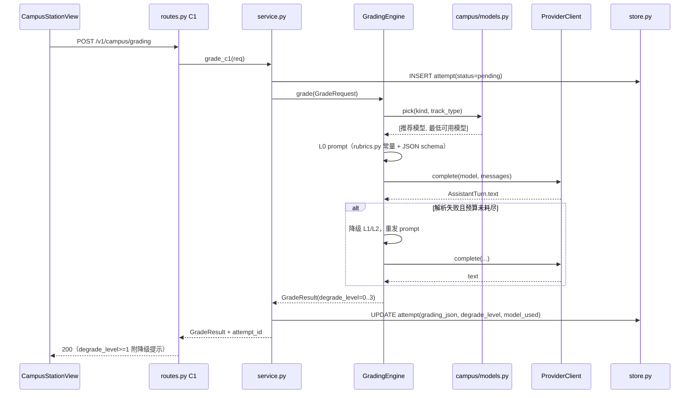

# 06 批改与检索引擎设计 — grading.py 四级降级 + library.py 按页切片检索

| 项 | 内容 |
|---|---|
| 文档编号 | dev/06 |
| 版本 | v1.0 |
| 日期 | 2026-09-08 |
| 作者 | 徐名可 |
| 上游依据 | `docs/PRD-CampusLearning.md` **v1.2**（CET-09/10、KY-05/06/09/10、CERT-07/14/15）、`docs/dev/01-系统架构设计.md` §5.1/§5.2、ADR-01/06/08/09、`docs/dev/02-数据库设计.md` §4.5/§4.6/§4.13/§5、`docs/dev/03-API接口设计.md` §4.2（B1-B7）/§4.3（C1-C4）、`docs/dev/05-人设与技能包设计.md` §4.2/§5（rubric 同源） |
| 读者 | 后端工程师 / Prompt 工程师 / QA |
| 关联文档 | `08-测试与验收方案.md`（V0.0 spike 量化验收、rubric 一致性测试、解析器单测） |

> **两条铁律（来自 §13 可行性评审的代码事实，本档所有设计在其约束内）**：
> ① `stealth_study/reviewer.py` 是动作安全闸门，`review()` 无 rubric 参数、输出只有 `allow/deny/unsure`（`reviewer.py:177, 349-357`）——批改**完全不经过它**，新建 `grading.py` 独立调 `ProviderClient.complete`（ADR-01），不改 reviewer.py 一行。
> ② `ModelCapabilities`（`providers/base.py:81-90`）只有 `tools/vision/pdf/parallel_tool_calls/streaming` 五个标志，**没有任何 JSON mode / structured output 标记**；`providers/capabilities.py` 是静态清单文件不是运行时探测器。**禁止**设计任何"先探测模型是否支持 JSON 再走 L0"的逻辑——降级只能由**输出解析失败驱动**（§3）。

---

## 1. 模块分工与调用边界

| 模块 | 职责 | 不负责 |
|---|---|---|
| `stealth_study/campus/rubrics.py` | rubric / 归因枚举的唯一权威常量（05 文档 §5） | 不含任何代码逻辑，纯文本模板字符串 |
| `stealth_study/campus/models.py` | `{任务 → [推荐模型, 最低可用模型]}` 静态清单（ADR-06），决定 grade 请求用哪个模型 | 不做运行时能力探测 |
| `stealth_study/campus/grading.py` | 结构化批改引擎：prompt 组装、模型调用、四级降级、输出校验 | 不落库（落库在 `service.py`）、不检索 |
| `stealth_study/campus/library.py` | 资料导入、按页切片、三级检索、QA 组装 | 不做批改；不改 `pdf_support.py` |
| `stealth_study/campus/service.py` | 编排：C1/E5 端点 → GradingEngine / CampusLibrary → `store.py` 落库（attempt.degrade_level、doc_chunk） | 不直接调 provider |

**依赖边界（全部为只读复用，零修改）**：`providers.base.ProviderClient.complete`（`providers/base.py:109-117`，阻塞式，签名 `complete(*, model, messages, tools=None, **settings) -> AssistantTurn`，结果取 `turn.text`）；`pdf_support` 的空文本判空约定（§6）；`attachments` 的体积上限口径（10MB，`attachments.py:19`）。**不引入任何新第三方依赖**（无 json_repair / 无 embedding / 无 OCR——V0.2 再议，§6.3）。

### 1.1 一次作文批改的完整调用链（C1）



要点：批改是**同步请求 + 线程内完成**（03 文档 §1：不做后台任务队列，与 engine 的 `asyncio.to_thread` 模式一致）；每次批改的模型调用次数受**重试预算**约束（§3.5），最坏路径 L0→L1→L2 = 1+1+N 轮。

---

## 2. grading.py 接口签名

### 2.1 数据类

```python
# stealth_study/campus/grading.py
from dataclasses import dataclass, field

@dataclass
class GradeRequest:
    profile_id: str
    track_type: str            # cet4 / cet6 / kaoyan / cert（models.py TrackType）
    kind: str                  # essay | translation | short_answer | essay_material | lesson_plan | practical（03 文档 C1 枚举）
    question: str              # 题目原文（作文题/翻译原文/简答题干）
    answer: str                # 学生作答全文
    rubric_id: str | None = None      # 内置 rubric 键：cet_essay / cet_translation / cert_short_answer ...
    custom_rubric: str | None = None  # 用户自填评分细则（CERT-07-4）；非空时覆盖 rubric_id
    subject: str | None = None        # 考研分科（ky_politics/ky_english/ky_math/ky_major）

@dataclass
class GradeResult:
    ok: bool                   # False = 连 L3 降级也失败（模型超时/拒答），service 层记 fail_reason
    degrade_level: int         # 0-3（本档 §3）；ok=False 时为 3
    model_used: str
    band: int | None = None           # 档位分（作文/翻译 15 分制原始分）
    dimension_scores: dict[str, int] = field(default_factory=dict)   # {"content":4,"structure":4,"language":4}
    errors: list[dict] = field(default_factory=list)                 # [{fragment, suggestion, type}]
    scoring_points: list[dict] = field(default_factory=list)         # 主观题得分点 [{point, hit, note}]
    upgraded_demo: str | None = None  # 升格示范（CET-09 验收 3）
    model_answer_outline: str | None = None
    raw_text: str | None = None       # L3 降级时的原文（未结构化）
    usage: dict | None = None         # token 统计（AssistantTurn.usage 摊平）
    fail_reason: str | None = None
```

`grading_json` 落库结构（02 文档 §4.13）= `GradeResult` 去掉 `ok/model_used/usage/fail_reason` 后的 JSON；`degrade_level` 单列存储（CET-09 一致性承诺只对 `degrade_level=0` 生效）。

### 2.2 引擎类

```python
class GradingEngine:
    def __init__(self, provider, model_picker):
        # provider: ProviderClient；model_picker: campus/models.py 的 pick(kind, track_type) -> (model, fallback)
    async def grade(self, req: GradeRequest) -> GradeResult:
        # 在 asyncio.to_thread 中执行阻塞的 provider.complete（与 engine 既有模式一致）
    def _build_prompt(self, level: int, req: GradeRequest) -> list[dict]:   # §3 各级 prompt 组装
    def _parse(self, level: int, text: str, req: GradeRequest) -> tuple[bool, dict, str]:  # (ok, data, reason)
```

校验器（`_parse` 内共用）：字段级白名单校验——`band` 必须 ∈ {0,2,5,8,11,14}（作文）或 0-15（翻译）；`dimension_scores` 三维各 0-5 且**之和落在该档区间**（05 文档 §4.3 的"档位矛盾"纪律在这里机器化执行）；`errors[].type` ∈ `rubrics.ERROR_TYPES_CET`。校验失败不算"解析失败"，按降级处理并记 reason=`schema_violation`。

### 2.3 响应格式参数的使用规则（ADR-06 落地）

- L0 尝试 `provider.complete(**{"response_format": {"type": "json_object"}})`；`openai_provider.py:92-120` 对未列举参数 re-raise → try/except 捕获后**去掉该参数原样重发一次**（prompt 不变，L0 的 JSON 约束由 prompt 文本独立承担，response_format 只是加分项不是前提）。
- **禁止**依据 response_format 是否被接受来判定"模型支持 JSON"——判定只看输出能否通过 `_parse(0, ...)`。

---

## 3. 四级降级方案（L0-L3）

### 3.1 总表

| 级别 | 名称 | 模型调用 | prompt 策略 | 解析器 | 适用条件 / 进入原因 |
|---|---|---|---|---|---|
| L0 | 强约束 JSON | 1 次 | rubric 全文 + 任务指令 + **末尾附 JSON schema 注释块** + "只输出一个 JSON 对象，不要任何其他文字" | 提取首个平衡大括号 JSON → `json.loads` → schema 校验 | 默认起点（所有 kind） |
| L1 | 填空式模板 | +1 次 | rubric 全文 + **行式填空模板**（见 3.3），"逐行填空，不要增删行" | 按行前缀正则提取槽位 | L0 解析失败（`json_invalid` / `schema_violation`） |
| L2 | 逐维度拆分 | +N 次（N≤3） | 每轮只问**一个维度**（作文：档位→三维→错误清单；主观题：逐得分点），每轮输出固定两行 | 每轮 2 行的极简正则；Python 侧聚合 | L1 失败，或 L1 结果校验发现档位矛盾 |
| L3 | 弃结构化 | 0 次（复用 L2 最后一轮，或 L0/L1 的原始输出） | 不再调用 | 不解析 | 预算耗尽；返回 `raw_text` + 前端降级提示卡（04 文档 §5，G5 双语 key） |

进入 L3 且没有任何可用文本（模型超时/空响应）时 `ok=False`，`fail_reason` 取 `MODEL_TIMEOUT` / `MODEL_EMPTY`，service 层按 03 文档错误码返回。

### 3.2 L0：prompt 组装（system + user 两段）

```text
[system]
{rubrics.CET_ESSAY_RUBRIC 全文}            # 05 文档 §4.3 逐字一致，pytest 全等锁定
你只能输出一个 JSON 对象，schema：
{"band": <0|2|5|8|11|14>, "dimension_scores": {"content": <0-5>, "structure": <0-5>, "language": <0-5>},
 "errors": [{"fragment": "...", "suggestion": "...", "type": "<ERROR_TYPES 之一>"}],
 "upgraded_demo": "...", "model_answer_outline": "..."}
[user]
题目：{req.question}
学生作文：{req.answer}
```

JSON 提取器（`_extract_json`，约 30 行，无第三方依赖）：剥 ```json 围栏 → 取首个 `{` 与其配对 `}`（栈式配对，容忍字符串内大括号）→ `json.loads`；失败 reason=`json_invalid`。**不做**激进修复（补引号/补逗号）——修出来的数据比降级更危险。

### 3.3 L1：填空式模板

弱模型对"自由 JSON"的失败模式是漏逗号/加注释/截断，但对"逐行填空"服从率高得多。模板按 kind 固定，示例（作文）：

```text
档位：<14|11|8|5|2|0>
内容分：<0-5>
结构分：<0-5>
语言分：<0-5>
错误1：<原文片段> || <修改建议> || <类型>
错误2：<同上，没有则留空>
升格示范：<一段改写>
```

解析：`^档位：\s*(\d+)$` 等逐行前缀正则；`||` 三段切分。错误行上限 8 条（防幻觉灌水），超出截断并记 `schema_violation:errors_truncated`（不触发降级，只裁剪）。

### 3.4 L2：逐维度拆分

三轮，每轮 prompt 只含：rubric 中**与该轮相关的一小节**（如仅"分项维度"节）+ 题目 + 作文 + 固定输出两行（`结论：<值>` / `依据：<一句>`）。三轮 = ① 定档 ② 三维分（一轮给三个数）③ 错误清单（每行一条，格式同 L1 错误行）。聚合后由 Python 重算 `band` 与三维和的一致性：仍矛盾 → 以三维为准反推档位（取包含该和的最高档），**记 `schema_violation:band_reconciled`**，`degrade_level=2` 照常落库。

### 3.5 重试预算与参数

| 参数 | 值 | 依据 |
|---|---|---|
| 单次批改模型调用上限 | 5（L0 1 + L1 1 + L2 3） | 同步请求 + 前端超时可中断（03 §1），5 轮 ≈ 弱模型 60-90s 上界 |
| provider 层超时 | 90s / 轮 | 沿用既有 provider settings，不新设 |
| 温度 | 0（批改判定任务，重一致性） | CET-09"两次批改一致性"验收 |
| 降级记忆 | `attempt.degrade_level` 记**最终**档位；中间失败 reason 拼进 `grading_json._degrade_trace`（列表） | 08 文档 V0.0 spike 按最终档位统计 L0/L1/L2 成功率 |
| custom_rubric | 非空时替换 system 段的 rubric 全文，schema 部分不变（得分点数量由用户细则决定时，`scoring_points` 替代 `dimension_scores`） | CERT-07-4 |

---

## 4. library.py 接口签名与切片

### 4.1 类与核心方法（与 01 文档 §3 一致）

```python
class CampusLibrary:
    def __init__(self, store, lib_dir): ...    # store: CampusStore；lib_dir: state_dir()/campus/library
    def import_pdf(self, profile_id: str, file_path: str) -> dict:          # 返回 SourceDoc dict
    def retry_parse(self, profile_id: str, doc_id: str) -> dict:            # 03 文档 B5
    def retrieve(self, profile_id: str, query: str, top_k: int = 6,
                 doc_id: str | None = None) -> list[dict]:                  # 返回 [{doc_id,page_no,chunk_seq,section_title,content,score}]
    def answer_qa(self, profile_id: str, question: str,
                  doc_id: str | None = None) -> dict:                       # 03 文档 B6：组装上下文 + 调 GradingEngine 同款 provider 链路
```

### 4.2 按页切片（细化并修正 01 文档 ：235 的表述）

**修正说明**：01 文档 `:235` 写"`library.py` 调 `extract_text()` 做按页切片"——`pdf_support.extract_text()`（`pdf_support.py:102-125`）返回**整本文本**，页边界在 join 时不可靠，拿不到 `page_no`。本档细化为：**library.py 直接用 pypdf 按页提取**（`PdfReader.pages` 循环 + `page.extract_text() or ""`，与 `pdf_support.py:117` 同款容错与 `MAX_EXTRACT_CHARS=200_000` 上限口径），**不调用也不修改 `pdf_support.py`**。这是实现细化非需求变更（pypdf 已是既有依赖，零新增）。

切片规则（与 02 文档 §5.1 一致，此处给执行口径）：

1. **一页一片**：`page_no` = PDF 物理页码（1 起）；`chunk_seq` 页内序号（0 起）。
2. **超长页二次切分**：单页 > 2000 字符时按段落边界（`\n\s*\n`）切分，每片 ≤2000、重叠 0；页内顺序 `chunk_seq` 递增。上限：单文档 3000 片，超出即中止导入（`fail_reason=too_many_chunks`）——200 页 × 平均 1.5 片/页 ≈ 300 片，余量 10 倍。
3. **章节标题归属**：每片 `section_title` 取"自文档开头到该片为止最近一次匹配的标题行"（标题行判据：`^\s*(第[一二三四五六七八九十\d]+[章讲部分节]|Chapter|章节编号\s+\S)` 且长度 ≤40 字符）；找不到任何标题的文档 `section_title=NULL`，L1 目录路由自动不可用，直接走 L2（§5.3）。
4. **MD/TXT 导入**（B1 允许）：按 `\n#{1,3} ` 标题切"伪页"，`page_no` 取文件内出现顺序，`section_title` 取标题文本。

### 4.3 Chunk 数据契约

切片直接落 02 文档 §4.6 `doc_chunk` 表（`doc_id, profile_id, page_no, chunk_seq, section_title, content, char_count`），内存侧不定义新 dataclass，`retrieve()` 返回 dict 列表（rows 摊平）。

---

## 5. 检索实现（KY-09 的三级策略）

### 5.1 总策略

| 层 | 触发条件 | 做法 | 输出标记 |
|---|---|---|---|
| L1 目录路由（主力） | 问题涉及章节/主题（默认起点），且 `section_title` 非空的切片占比 ≥50% | 取该文档目录清单（`SELECT DISTINCT section_title, MIN(page_no) ... GROUP BY section_title`，02 §5.2）→ 喂模型"选出与问题最相关的 ≤3 个章节"（温度 0，输出行式 `章节名`，正则提取）→ 在选中章节的切片上做 L2 关键词召回取 top_k | `used_retrieval="toc_route"` |
| L2 关键词召回（补充） | L1 不可用 / 章节内检索 | 从问题抽关键词（去停用词 + 2-gram），`WHERE doc_id=? AND (content LIKE ? OR ...)` 多词 OR，Python 侧按命中词数+位置评分排序 | `used_retrieval="keyword"` |
| L3 全扫兜底 | doc_id 未指定（跨档案检索） | 同 L2 但 `WHERE profile_id=?` 全库 LIKE | 同 `keyword` |

FTS5-trigram 加速档（02 §5.2 的 L2a）**只替换 L2/L3 的查询执行器**，不改变本档的层级行为：运行时探测 `ENABLE_FTS5` 失败则 LIKE 兜底，两态对上层透明。**明确不引入 embedding**（ADR-08：千片量级 LIKE 全扫 <50ms；云端模型也无可靠本地 embedding 服务）。

### 5.2 章节选择 prompt（L1 的唯一模型调用）

```text
你是检索路由器。以下是资料目录（章节名 → 起始页）：
{每行 "章节名（p.页码）"}
问题：{query}
只输出与回答该问题最相关的章节名，每行一个，最多 3 行，不要输出其他内容。
```

输出解析：逐行去首尾 → 与目录名做包含匹配（模型可能微调措辞）；0 行命中 → 降级走 L2，不重试（路由器失败不值得再花一轮）。

### 5.3 QA 组装（`answer_qa`，B6 契约）

1. `retrieve()` 取 top_k=6 片（总量 ≤12000 字符，防上下文爆炸；超出再截每片前 2000）。
2. prompt：检索片段（每片头部标 `[资料名 p.X]`）+ 问题 + 指令"只依据给定片段回答；片段不足以回答时明确说明；引用片段时标注 [p.X]"。
3. 响应组装：`answer`（模型文本）+ `citations`（从模型输出中的 `p.X` 标记反查 chunk，找不到标记的片段也附全部用到的切片作为"参考片段"）+ `used_retrieval` + `chunks_used`。**页码引用是 KY-03 的硬验收**（"至少 1 条可点击引用"），所以 citations 兜底必填，不允许返回空数组当 retrieval 成功过。
4. 出题（B7）复用同一检索，指令换成"基于片段出 N 道题，输出 L1 填空式模板"（直接吃 §3.3 的解析器，复用降级链）。

---

## 6. 扫描件与异常分支（ADR-09 落地）

### 6.1 判空分支（核心：不静默）

| 情形 | 检测点 | 行为 | 用户可见结果 |
|---|---|---|---|
| 整本无文字层（扫描件） | 按页提取后全库 `char_count` 合计 = 0 | `parse_status=failed` + `fail_reason="no_text_layer"`，**不写任何 doc_chunk**，不建 FTS 条目 | 资料卡标"解析失败：扫描件无文字层"；B5 retry 返回 `DOC_SCAN_EMPTY`（幂等，不再烧模型） |
| 部分页空 | 单页 `extract_text()` 返回 "" | 跳过该页，`source_doc.blank_pages` 累计；占比 >80% 时升级为整本 failed（同上） | 正常入库；资料详情显示"第 x、y 页无可提取文字" |
| 加密/损坏 PDF | `pypdf` 抛异常 | `parse_status=failed` + `fail_reason="pdf_broken"` | 资料卡标"文件无法解析" |
| 截断 | 单文档提取超 `MAX_EXTRACT_CHARS`（200k） | 停止提取后续页，`fail_reason="truncated_200k"`，已提取页正常入库 | 详情显示"仅解析前 N 页" |

判定时机在 `import_pdf()` 的同步解析阶段（03 文档 B1 返回 `parse_status=pending`，线程内完成解析后轮询 B3 读到 `ready/failed`，与 03 §1 长任务约定一致）。

### 6.2 为什么不静默返回空库

`pdf_support.py:104` 的 docstring 明言"Scanned PDFs legitimately return '' — callers surface that distinctly"——**上游契约就要求调用方显式 surface**。若静默入库空库，L2/L3 LIKE 永远返回空、B6 返回"资料里没有覆盖"，用户无从区分"资料没讲"与"根本没解析"，且静默失败违反 01 文档 §8 错误处理三原则（不静默失败）。

### 6.3 OCR 的取舍（维持 §13 结论）

V0.1 不引入 OCR：PaddleOCR 需捆绑 ~数百 MB 推理运行时且 Windows 安装链复杂；Tesseract 需独立系统安装 + 中文语言包，桌面应用分发不可控。扫描件场景给出**产品级替代**：提示用户"扫描件请配合 OCR 工具转文字版后再导入（支持 TXT/MD）"。是否进 V0.2 由 V0.0 spike 的扫描件占比数据决定（08 文档 §4）。

---

## 7. 测试衔接（详见 08 文档，此处列本档特有的锚点）

1. **解析器单测**：`_extract_json`（围栏/嵌套大括号/截断/首尾噪音 8 用例）、L1 行正则（缺行/超限/全角冒号 6 用例）、L2 聚合（档位矛盾反推 3 用例）——纯函数，pytest 全覆盖，不依赖模型。
2. **V0.0 spike 量化**（08 §4）：20 篇真实四六级作文 × {推荐模型, 最低可用模型} × {L0 裸 prompt, L0+response_format}，记录 L0/L1/L2 最终档位分布与 `schema_violation` 明细；L0 成功率（`degrade_level=0` 占比）目标 ≥60%，否则 V0.1 批改默认从 L1 起步（本档 §3 的起点改为可配置 `GRADING_START_LEVEL`，一行常量，提前留好）。
3. **rubric 一致性**：`rubrics.py` 常量 ↔ SKILL.md 逐字全等（05 文档 §4.2），CI 强制。
4. **检索评估 spike**：中文 PDF（含无书签、无目录页的讲义类——PM 风险 1）× 20 问，量化 L1 章节选择命中率与 L2 召回 top6 包含率；无书签文档的 `section_title` 抽取成功率给量化门槛（详见 08 §4）。
5. **扫描件分支**：构造无文字层 PDF fixture，断言 `parse_status=failed`、`fail_reason=no_text_layer`、零 doc_chunk、B5 幂等返回 `DOC_SCAN_EMPTY`。

---

## 8. 与前序文档的差异登记

| # | 差异 | 性质 | 说明 |
|---|---|---|---|
| 1 | 01 文档 `:235`"library.py 调 `extract_text()` 做按页切片"细化为 **pypdf 逐页直接提取** | 实现细化 | `extract_text()` 返回整本文本拿不到 `page_no`（§4.2）；pdf_support.py 零修改不变 |
| 2 | L0 的 `response_format` 只是加分项，**成败判定只看输出解析** | 实现细化 | `ModelCapabilities` 无 JSON 标志（`base.py:81-90`），探测式设计不成立（§2.3）；ADR-06 的"试错+去参重试"即此含义，本档给精确语义 |
| 3 | 新增 `GRADING_START_LEVEL` 一行常量（默认 0） | 实现预留 | V0.0 spike 若 L0 成功率 <60%，V0.1 一行改默认值，无需返工 |
| 4 | L1 路由章节选择失败**不重试**直接降 L2 | 设计细化 | 路由是单点辅助调用，重试期望收益低；`used_retrieval` 字段如实标记 |
