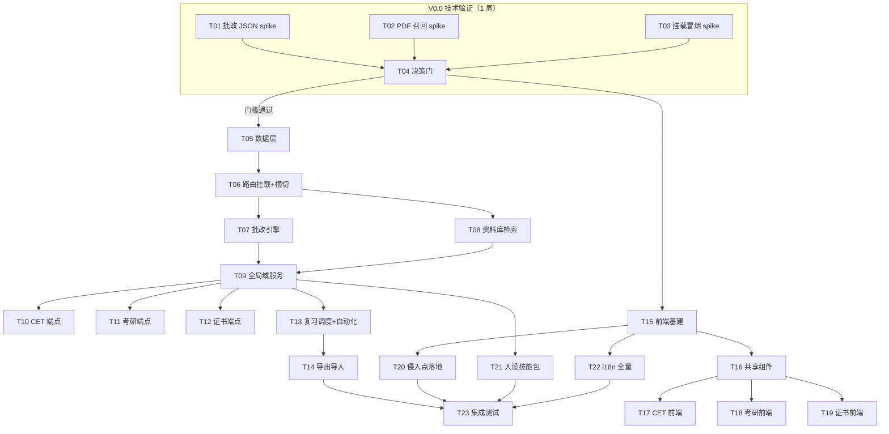

# 07 开发任务分解 — V0.0 技术验证 + V0.1 三台全量 P0

| 项 | 内容 |
|---|---|
| 文档编号 | dev/07 |
| 版本 | v1.0 |
| 日期 | 2026-09-08 |
| 作者 | 高见远（架构师） |
| 上游依据 | `docs/PRD-CampusLearning.md` **v1.2**（§8.2 里程碑）、`docs/dev/01-系统架构设计.md`（§2 模块清单、§6 侵入点登记、ADR-01~13）、`docs/dev/02-数据库设计.md`（INF-01/02/03）、`docs/dev/03-API接口设计.md`（72 端点契约）、`docs/dev/04-前端设计.md`（INF-04/05、9 处侵入点精确形态）、`docs/dev/05-人设与技能包设计.md`、`docs/dev/06-批改与检索引擎设计.md`（含 §8 差异登记） |
| 读者 | 工程师（寇豆码）/ QA（严过关）/ 主理人 |
| 关联文档 | `08-测试与验收方案.md`（各任务验收标准的测试化落地） |

> **口径约定**：① 端点总数一律写"**72 个（以 03 文档为准）**"；② 批改/切片实现一律**按 06 文档 §8-1 为准**（pypdf 逐页提取，`pdf_support.py` 零修改）；③ 侵入点编号沿用 01 文档 §6，**#8 含 4 个子改动**（04 文档 §4.8），估工按 4 计；④ 全部改动收敛在 9 处 L1 侵入点内，除登记表所列既有文件外**零既有文件改动**。

---

## 1. 编排总览

- **V0.0**：1 周（1 人 4.5 人日 + 评审 0.5 日），全部是**临时脚本 + 决策报告，不产生入库代码**（spike 脚本放 `scripts/v0-spikes/`，结论入 `docs/dev/` 报告）。
- **V0.1**：三台**同一版本全量上线**（PRD v1.2 §8.2），内部按 CET → KY → CERT 分层交付；后端泳道（T05-T14）与前端泳道（T15-T20）**可两人并行**（前端 T15 起 mock 数据即可开发）。
- **总量**：52 人日 ≈ 10.5 人周；两人并行约 **6 周**（含 T23 收尾缓冲）。

---

## 2. INF 编号总表（承接 02/03/04 文档的既有引用）

| 编号 | 名称 | 定义 | 承载任务 |
|---|---|---|---|
| INF-01 | campus.db 数据层与挂载 | `CampusStore` + 19 表 + `schema_meta` 迁移（02 §3）+ `include_router` 挂载（01 §6 #9） | T05、T06 |
| INF-02 | 导出 | `POST /v1/campus/exports` 等端点 + `campus/exports/`（02 §7.4、03 §4.9 I4-I5） | T14 |
| INF-03 | 导入 | I6 导入端点，I4 的逆过程（02 §7.4） | T14 |
| INF-04 | 前端 surface 接入 | `App.tsx` 类型联合/三元链、`Sidebar` 导航（01 §6 #1/#2/#3） | T20 |
| INF-05 | 前端基建 | `campus/api.ts` + `types.ts` + 共享组件 + i18n 骨架 | T15、T16、T22 |
| INF-06 | 测试基建 | pytest/Vitest 脚手架、spike 量化报告格式 | T01-T04、T23 |
| INF-07 | flag 关闭路径回归 | `showVoice()/showLogin()` 双态回归（04 §4.8、08 §5） | T20、T23 |
| INF-08 | 配置项 | `campus/config.py`（自读 TOML 嵌套表，01 §3）+ `models.py` 静态模型清单（ADR-06）；无端点 | T05、T07 |

---

## 3. V0.0 技术验证（T01-T04，1 周）

### T01 SPIKE-1：本地弱模型批改 JSON 输出成功率（INF-06）

- **目的**：验证 06 §3 四级降级的 L0/L1 成功率假设，定 `GRADING_START_LEVEL` 默认值。
- **涉及文件**：`scripts/v0-spikes/spike_grading.py`【新增，不入库亦可】；无既有文件改动。
- **做法**：20 篇真实四六级作文（10 篇带参考范文对照）× {Ollama qwen 7B/8B, 云端推荐模型对照} × {L0 裸 prompt, L0 + `response_format`}，按 06 §2 的校验器判档，记录 `degrade_level` 分布与 `schema_violation` 明细。
- **依赖**：无。
- **验收标准**：① 每格 ≥20 样本的降级分布表；② **L0 成功率（`degrade_level=0` 占比）≥60%** 则 V0.1 从 L0 起步，否则改 `GRADING_START_LEVEL=1`（06 §8-3 的一行常量）；③ L0+L1 合计成功率 ≥90%，低于则批改端点加"模型能力前置提示"（04 文档 `EmptyModelGuide` 文案）。
- **估时**：2 人日。

### T02 SPIKE-2：中文 PDF 按页召回验证，含无书签最差用例（INF-06）

- **目的**：验证 06 §4/§5 的按页切片 + 三级检索（PM 风险 1：无书签、无目录页的讲义类 PDF 最差情况）。
- **涉及文件**：`scripts/v0-spikes/spike_pdf.py`【新增】；语料 5 本中文 PDF（≥2 本无书签无目录页 + ≥2 本章节规范教材 + 1 本扫描件）。
- **做法**：pypdf 逐页提取（按 06 §8-1 为准）→ 切片 → 记录每本的 `section_title` 抽取情况 → 20 问评估（10 问章节型 / 10 问关键词型）L1 章节选择命中率与 top6 召回包含率。
- **依赖**：无。
- **验收标准**：① 5 本 × 页级提取成功率表（扫描件必须得出"零文字层"结论，验证 06 §6 判空分支）；② **有目录文档 L1 章节选择命中率 ≥80%、top6 包含率 ≥70%**；③ **无书签文档标题抽取成功率给出量化门槛 ≥60%**——达标则 L1 对该类文档可用，不达标则该类文档默认跳过 L1 直接走 L2（`section_title=NULL` 自然分流，06 §4.2-3 已覆盖，无需新代码）；④ 20 问人工判定答案可用率 ≥70%。
- **估时**：1.5 人日。

### T03 SPIKE-3：include_router 挂载冒烟（INF-06）

- **目的**：验证后端唯一既有文件改动点（01 §6 #9：`coworker/server/app.py:187` 后 2 行）的真实风险。
- **涉及文件**：`scripts/v0-spikes/spike_mount.py`【新增】；`coworker/server/app.py`（**临时插入、spike 后还原**，正式改动在 T06）。
- **做法**：写一个 10 行的临时 `build_campus_router()`（仅 `/v1/campus/health` 一个端点）挂进 `create_app()`，启动 Tauri GUI 全流程冒烟。
- **依赖**：无。
- **验收标准**：① GUI 启动 → `GET /v1/campus/health` 返回 200（apiToken 鉴权链路通过）；② 既有全部核心功能可点通（会话/设置/自动化各 1 项）；③ 退出无报错、`coworker.db` mtime 不变；④ 还原 app.py 后 `git diff` 为零。
- **估时**：0.5 人日。

### T04 V0.0 决策门（INF-06）

- **产出**：`docs/dev/v0.0-spike-report.md`【新增】——三份量化结论 + 三项决策：`GRADING_START_LEVEL` 取值；无书签 PDF 的 L1/L2 分流确认；OCR 是否立项 V0.2（06 §6.3）。
- **依赖**：T01、T02、T03。
- **验收标准**：报告含 08 文档 §4 要求的全部量化指标；三项决策逐条落字；**任一门槛不达标时给出 V0.1 范围缩减建议**（如批改默认 L1 起步、CERT 主观题批改降 P1），由主理人拍板后才进 T05。
- **估时**：0.5 人日。

---

## 4. V0.1 后端泳道（T05-T14）

### T05 campus 包骨架与数据层（INF-01、INF-08）

- **涉及文件**：【新增】`coworker/campus/__init__.py`、`coworker/campus/models.py`（01 §3：TrackType/Subject/Attribution/ParseStatus 等）、`coworker/campus/store.py`（19 表 + `schema_meta`，照抄 `memory/sqlite_store.py:13-43` 连接模式 + WAL，02 §2.1/§3）、`coworker/campus/config.py`（自读 TOML 嵌表，不改 `coworker/config.py`）、`coworker/campus/tracks.py`（TrackSpec 三台声明式配置，01 §4）。【新增】`tests/campus/test_store.py`、`tests/campus/test_migrate.py`。
- **依赖**：T04（决策门通过）。
- **验收标准**：① 首次启动建齐 19 表 + `schema_meta(version=1)`；② 迁移执行器通过 02 §3.5 的 V0.2 示例演练（加列 + 备份 + 版本倒挂拒绝启动）；③ 删 `campus.db` 重启自愈，`coworker.db` 不受影响；④ pytest 覆盖建表/迁移/并发写（RLock）。
- **估时**：3 人日。

### T06 路由挂载与 profile_id 横切（INF-01）

- **涉及文件**：【新增】`coworker/campus/routes.py`（骨架：`router = APIRouter(prefix="/v1/campus")`、`build_campus_router(manager)`、`/health`、错误体助手、**profile_id 依赖注入**）。【既有文件·单行插入】`coworker/server/app.py:187` 后 2 行 `from coworker.campus.routes import build_campus_router` + `app.include_router(build_campus_router(manager))`（T03 已验证形态）。
- **profile_id 横切设计**（team-lead 批复的 P0 横切任务）：`build_campus_router()` 内定义 `get_profile` 依赖——从 query/body 解析 `profile_id` → 校验存在（`PROFILE_NOT_FOUND`）与档案状态（`PROFILE_READ_ONLY`）→ 注入 `ExamProfile`；需要档案的端点一律 `Depends(get_profile)`，**禁止端点内裸收 `profile_id` 字符串直查**。子资源（attempt/doc/plan）不存在或不属于该档案 → `FORBIDDEN_PROFILE`（03 文档错误码表）；service 层所有查询强制 `WHERE profile_id=?` 双保险（01 §3 service.py 职责）。三条安全用例（不带 profile_id / 伪造 profile_id / 跨档案读取）在 08 文档 §3 固化。
- **依赖**：T05。
- **验收标准**：① 冒烟用例：`/v1/campus/health` 200；② 三条横切用例（作为 pytest 参数化测试先落 `tests/campus/test_profile_guard.py`）全绿；③ `git diff` 确认 app.py 仅 +2 行；④ 侵入点总数仍为 9 处。
- **估时**：1.5 人日。

### T07 rubrics.py + grading.py 批改引擎（INF-08）

- **涉及文件**：【新增】`coworker/campus/rubrics.py`（05 §5 的 5 个常量，注释头注明与 SKILL.md 逐字同步）、`coworker/campus/grading.py`（06 §2/§3：GradeRequest/GradeResult、GradingEngine、`_extract_json`、L1 填空正则、L2 三轮拆分、`GRADING_START_LEVEL`）、`tests/campus/test_grading_parse.py`（解析器 17 用例，06 §7-1）、`tests/campus/test_rubrics_consistency.py`（占位：SKILL.md 落盘前先测常量自洽）。
- **依赖**：T05（models.py 枚举）。
- **验收标准**：① 解析器单测全绿（纯函数，不依赖模型）；② 用 T01 的真实输出样本回放测试 L0/L1 解析；③ 温度 0、单次批改 ≤5 次调用、超时 90s 三项参数生效；④ 档位矛盾用例被"三维和反推档位"兜住并记 `band_reconciled`。
- **估时**：3 人日。

### T08 library.py 资料库与检索（按 06 §8-1 为准）

- **涉及文件**：【新增】`coworker/campus/library.py`（06 §4/§5：pypdf **逐页**提取——不调 `pdf_support.extract_text()` 整本接口、一页一片 + 超长页二切、`section_title` 归属、三级检索、`answer_qa`）、`tests/campus/test_library_slice.py`、`tests/campus/test_scan_empty.py`（无文字层 fixture）。
- **依赖**：T05（doc_chunk/source_doc 表）、T07（QA/路由复用 provider 链路，接口先行可 stub）。
- **验收标准**：① T02 的 5 本语料全部正确入库（页码/切片数与 spike 一致）；② 扫描件：`parse_status=failed` + `fail_reason=no_text_layer` + 零 chunk + B5 幂等（06 §6.1 四情形全覆盖）；③ FTS5 探测失败时 LIKE 兜底自动生效（02 §5.2）；④ L1 章节路由 0 命中时降 L2 且 `used_retrieval` 如实标记。
- **估时**：3 人日。

### T09 service.py 全局域端点

- **涉及文件**：【新增】`coworker/campus/service.py`（编排层，01 §3）。`routes.py` 补全局域端点：A 组 10 个（设置/档案 G-02/G-03）+ E 组 5 个（作答 E1-E5）+ G1（今日建议）。端点契约以 03 文档为准，累计 72 个中的 16 个。
- **依赖**：T06（横切）、T07（E5 主观题同步调 C1 链路）。
- **验收标准**：① 档案 CRUD + 归档只读（`PROFILE_READ_ONLY`）通过；② E5 客观题即判、主观题返回 `pending_grading` 并同步触发批改（03 §4.5）；③ 每个端点带 `FORBIDDEN_PROFILE` 负例测试。
- **估时**：2.5 人日。

### T10 CET 台端点（CET 组 14 个）

- **涉及文件**：`service.py` + `routes.py` 追加：定级测评（CET-01，中断续做）、词汇（CET-02）、听力文本精听（CET-03，无 STT）、作文/翻译批改挂 C1、常见错误 TOP3（CET-12）、模考状态机（CET-13：阶段控制 + 收卡锁定）。
- **依赖**：T09。
- **验收标准**：① 定级 20 题折算分与 425 差距表数值正确；② 模考听力阶段结束锁定作文/听力作答（状态机校验错误码生效）；③ CET-12 聚合按 `grading_json.errors[].type`（02 §4.13）≥3 次批改后非空。
- **估时**：3 人日。

### T11 考研台端点（KY 组 9 个）

- **涉及文件**：`service.py` + `routes.py` 追加：四轨计划生成/重排（KY-01/02，已完成任务保留）、周报（KY-04）、专业课问答挂 B6、长难句/分科作答（KY-05/06）。KY-03 看板为**自建只读任务列表**（ADR-11，`board_card_id` 保留不写）。
- **依赖**：T09。
- **验收标准**：① 计划生成：四轨周级+日级、每周任务数=周数、无空轨；② 重排保留全部已完成/进行中任务；③ 周报五段结构（05 §4.7）落 `weekly_report`。
- **估时**：2.5 人日。

### T12 证书台端点（CERT 组 10 个）+ reminders.py

- **涉及文件**：【新增】`coworker/campus/reminders.py`（CERT-13 新口径：`deadline_snapshot` 倒计时横幅事件，不走 OS 通知，01 §3）。`routes.py` 追加：考纲→知识树（CERT-02）、知识点掌握度、主观题批改（CERT-07/14 挂 C1，CERT-15 未命中得分点服务端降级掌握度）、考试节点 CRUD。
- **依赖**：T09。
- **验收标准**：① 知识树 1000 字考纲 ≥2 层 ≥15 节点（CERT-02 验收）；② CERT-15：批改响应中未命中得分点对应掌握度自动降级（服务端副作用，单事务）；③ `deadline_snapshot` 的 D-30/D-7/D-1 三档状态正确。
- **估时**：2 人日。

### T13 review_scheduler.py + automation_templates.py

- **涉及文件**：【新增】`coworker/campus/review_scheduler.py`（简化 SM-2：1/2/4/7/15 天递增、答错重置，01 §3）、`coworker/campus/automation_templates.py`（4 模板经既有 automation CRUD 创建；CERT-13 相关用 `Schedule.kind="once"` + `fire_at`，`automation/models.py:71-75`）。`routes.py` 追加 F 组自动化端点（03 §4.9，累计 72 个中的最后一批）。
- **依赖**：T10（复习队列数据源）。
- **验收标准**：① 间隔函数单测（0-5 连对的间隔序列）；② 模板安装幂等（重复安装不产生重复任务）；③ 不依赖 OS 通知——全部为应用内横幅 + 任务列表事件（ADR-12）。
- **估时**：2 人日。

### T14 导出 / 导入（INF-02/03）

- **涉及文件**：`service.py` + `routes.py` 追加 I1-I6（03 §4.9）：`campus/exports/` 落盘 md/json/csv、`Content-Disposition` 下载、导入带 `schema_version` 校验（02 §7.4）。
- **依赖**：T13（数据齐备）。
- **验收标准**：① 三格式导出可被重新导入且行数一致；② 低版本导出包导入时迁移提示；③ 路径穿越防护（filename 白名单校验）。
- **估时**：1.5 人日。

---

## 5. V0.1 前端泳道（T15-T20，与后端 T07 起并行）

### T15 前端基建：flags + api + types + i18n 骨架（INF-05）

- **涉及文件**：【新增】`surfaces/gui/src/campus/types.ts`（对齐 02 §4）、`surfaces/gui/src/campus/api.ts`（72 个端点的函数封装，骨架照抄 `api.ts:8-18`，不 import 既有 api.ts，04 §6.1）。【既有文件·追加】`surfaces/gui/src/flags.ts` 追加 `showVoice()/showLogin()`（默认 false 写死 + localStorage 可逆，04 §4.8 子改动 8.1）；`surfaces/gui/src/locales/zh.json` / `en.json` 追加 `campus.*` 一级命名空间骨架。
- **依赖**：T04（决策门）、T06（契约形状，可先按 03 文档 mock）。
- **验收标准**：① 72 个函数与 03 文档端点一一对应（脚本比对测试）；② flags 双态切换即改即生效；③ `locales.test.ts` 通过（zh/en key 集合相等，`locales.test.ts:31-38`）。
- **估时**：3 人日。

### T16 共享组件 + CampusStationView（INF-05）

- **涉及文件**：【新增】`surfaces/gui/src/components/campus/CampusStationView.tsx`（`{ track }: { track: CampusTrack }` 契约，04 §3）+ 共享组件：`ProfileSwitcher`、`ProfileCreateCard`、`EmptyModelGuide`、`GradingResultCard`（含 degrade 提示）、`MistakeBookPanel`、`ReviewQueuePanel`、`LibraryPanel`（导入/轮询/引用跳转）、`QAChatPanel`、`CountdownBanner`、`DegradeBadge` 等（04 §3 组件表为准）。
- **依赖**：T15。
- **验收标准**：① 无档案 → 引导卡；无模型 → `EmptyModelGuide`；② `degrade_level>=1` 必渲染降级提示（03 §5-3）；③ 组件禁 `if (track === ...)` 业务分支（分层守则，01 §4）。
- **估时**：4 人日。

### T17 CET 台前端组件

- **涉及文件**：【新增】`components/campus/cet/`：`AssessmentFlow`（中断续做）、`VocabPanel`、`ListeningDrill`、`EssayGradingPanel`、`TranslationGradingPanel`、`MockExamConsole`（阶段计时 + 收卡锁定 UI）、`CommonErrorsCard`。
- **依赖**：T16、T10（端点联调；先 mock 可并行起步）。
- **验收标准**：批改卡四段展示（分项/错误清单可定位原文/升格示范/老毛病）；模考收卡后作答区只读。
- **估时**：3 人日。

### T18 考研台前端组件

- **涉及文件**：【新增】`components/campus/kaoyan/`：`PlanBoard`（四轨环形 + 只读任务列表，ADR-11）、`PlanEditor`、`WeeklyReportView`、`SubjectTutorChat`、`MajorQAView`（页码引用可点击）。
- **依赖**：T16、T11。
- **验收标准**：四轨任务数=周数渲染正确；重排后已完成任务不移位；KY-03 列表确为只读（无拖拽/改状态交互）。
- **估时**：3 人日。

### T19 证书台前端组件

- **涉及文件**：【新增】`components/campus/cert/`：`KnowledgeTreePanel`（三层树 + 覆盖率 + 薄弱 TOP5）、`SubjectiveGradingPanel`（得分点三态）、`DeadlineBanner`（D-30/D-7/D-1 视觉分级）、`CertExamSetup`。
- **依赖**：T16、T12。
- **验收标准**：知识点树展开/勾选联动掌握度；DeadlineBanner 三档状态与 `deadline_snapshot` 一致。
- **估时**：2.5 人日。

### T20 侵入点落地（INF-04、INF-07）

- **涉及文件**（全部既有文件，精确形态见 04 §4，共 9 处 / 其中 #8 为 4 个子改动）：#1 `App.tsx:276-278` 类型联合【追加 3 成员】；#2 `App.tsx:1785` 三元链【追加 3 分支 + import】（另含 `App.tsx:263-267` settingsTab 联合追加 `"campus"`，属 #1 同文件追加不单计）；#3 `Sidebar.tsx:1055-1067` 后导航行【追加 3 行，**不动 `:33` SURFACES**】；#4 `SettingsView.tsx:58` tab 联合【追加 `"campus"`】；#5 `SettingsView.tsx:70-78` SET_TABS【追加】；#6 `SettingsView.tsx:95/151` 过滤+渲染链【追加 voice 过滤 + campus 分支】；#7 `Composer.tsx:733-757` 麦克风按钮【`showVoice()` 短路】；#8 四个子改动【flags.ts 追加（已含于 T15）、`Sidebar.tsx:1174-1198` 账户菜单短路、`Sidebar.tsx:1255-1256` 账户行短路、`Onboarding.tsx:240-280` 登录带跳过】；#9 已在 T06 完成。
- **依赖**：T15（flags）、T16（挂载目标）。
- **验收标准**：① 三台 surface 切换/导航/settings campus tab 全通；② `showVoice()/showLogin()` 关闭态下：麦克风按钮不渲染、无麦克风权限请求、Onboarding 无登录带、账户区仅剩本地状态（G-04/G-05/G-06 验收项，08 §5 回归）；③ 既有 settings tab 全部可达（回归兜底）；④ `git diff` 汇总 = 9 处侵入点，无扩散。
- **估时**：2 人日（#8 按 4 子改动计 0.5）。

---

## 6. 内容资产与集成（T21-T23）

### T21 人设与技能包落盘 + 一致性测试

- **涉及文件**：【新增】`coworker/personas/builtin/` 下 6 个人设目录：`cet-examiner/`（manifest.md + skills/×2）、`cet-grader/`（+×2）、`kaoyan-planner/`（+×1）、`kaoyan-subject-tutor/`（仅 manifest）、`cert-instructor/`（+×1）、`study-companion/`（+×1）——manifest 与 SKILL.md 全文照抄 05 文档 §3/§4（**三条硬约束注释随文件落盘**：不写 ships、group=general、不填 team）。`tests/campus/test_rubrics_consistency.py` 补齐 SKILL.md ↔ `rubrics.py` 全等比对（05 §4.2）。
- **依赖**：T07（rubrics.py 常量定稿）。
- **验收标准**：① GUI 新会话选择器可见 6 人设（ships 陷阱验证：现有 14 个 `ships: false` 人设行为不变）；② bundle 内 7 个技能在对应人设会话内可渐进加载；③ 一致性测试 CI 全绿；④ 非法人设注入负例（group=campus）被 `ManifestError` 拦截的测试通过。
- **估时**：1.5 人日。

### T22 i18n 双语全量（INF-05）

- **涉及文件**：【既有文件·追加】`surfaces/gui/src/locales/zh.json`、`en.json` 补齐 `campus.*` 全量（P0 约 180-220 key，04 §7：12 段命名、复数规则、降级提示、AI 免责声明）。
- **依赖**：T16-T19 组件定型。
- **验收标准**：① `locales.test.ts` 通过（zh/en key 集合严格相等）；② key 使用率扫描无死 key（组件引用与定义双向比对）；③ 语言切换实时生效。
- **估时**：1.5 人日。

### T23 集成测试与 e2e 冒烟（INF-06、INF-07）

- **涉及文件**：【新增】`tests/campus/` 收口（横切三条用例、批改链路 mock 回放、迁移演练、扫描件分支、导出回导）；【新增】`surfaces/gui/src/campus/__tests__/`（Vitest：api 封装、flags 双态、组件渲染快照，对齐既有测试水平）；e2e 冒烟清单执行（三台各 3 条主路径，08 文档 §6）。
- **依赖**：T14、T20、T21、T22。
- **验收标准**：08 文档 §3/§5/§6 的全部用例绿；CI 与既有测试同阈值（不降低既有覆盖率）。
- **估时**：3 人日。

---

## 7. 总工作量与关键路径

| 泳道 | 任务 | 小计 |
|---|---|---|
| V0.0 | T01-T04 | 4.5 人日 |
| 后端 | T05-T14 | 24 人日 |
| 前端 | T15-T20 | 17.5 人日 |
| 资产与集成 | T21-T23 | 6 人日 |
| **合计** | 23 个任务 | **52 人日 ≈ 10.5 人周** |

- **关键路径**：T04 → T05 → T06 → T09 → T10/T11/T12 → T14 → T23（后端主链 21 人日）；前端并行主链 T15 → T16 → T17/T18/T19（12.5 人日）。两人并行时总历时 ≈ **6 周**；单人串行 ≈ 10.5 周 + 缓冲。
- **并行安全**：前端 T15 起即可用 03 文档契约 mock 开发，仅 T17-T19 的联调验收依赖对应后端任务完成。
- **范围红线**：V0.1 只做 PRD P0；T04 决策门若触发范围缩减（批改默认 L1、CERT 主观题降 P1），缩减只发生在 T07/T12 的验收标准级别，任务结构不变。
- **交付节奏**：每任务一 commit（新增文件任务整目录提交；侵入点任务提交信息注明侵入点编号），T06/T20 两个"既有文件改动"任务必须单独提交以便回滚。
