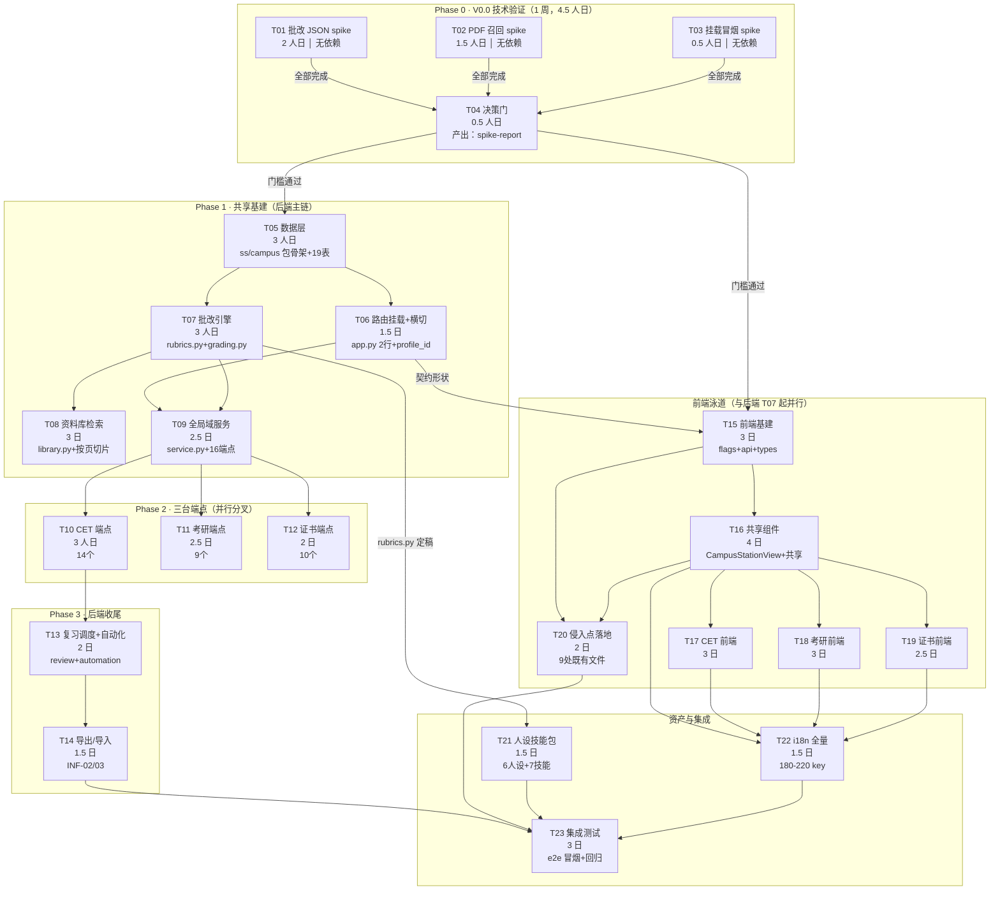

# 09 开发任务路径 — 并行与串行编排总图

| 项 | 内容 |
|---|---|
| 文档编号 | dev/09 |
| 版本 | v1.0 |
| 日期 | 2026-09-14 |
| 作者 | CatPaw（基于 dev/01~08 综合分析） |
| 上游依据 | `docs/dev/01-系统架构设计.md`（ADR-01~13、四层模型）、`docs/dev/07-开发任务分解.md`（T01-T23 任务序列与依赖）、`docs/dev/03-API接口设计.md`（72 端点契约）、`docs/dev/04-前端设计.md`（9 处侵入点）、`docs/dev/08-测试与验收方案.md` |
| 读者 | 工程师 / QA / 主理人 |
| 关联文档 | `docs/dev/01-08` 全部 |

---

## 1. 编排原则

三条铁律决定任务序列：

1. **决策门前置**：V0.0 spike（T01-T03）全部通过 T04 门槛后才能进入 V0.1，否则范围缩减或返工。
2. **后端契约先行**：前端 T15 起可用 03 文档契约 mock 开发，但 T17-T19 联调验收依赖对应后端任务完成。
3. **L0/L1 不动**：9 处侵入点 + 11 个 campus 后端文件全部 L0 新增，kernel 零改动。

---

## 2. 全局路径图



---

## 3. 并行执行矩阵

### 3.1 可并行的任务组

| 并行组 | 任务 | 并行条件 | 资源说明 |
|---|---|---|---|
| **S组**（spike 三件套） | T01 + T02 + T03 | 无相互依赖，全部无下游 spike 阻塞 | 可同人在一周内串行，或三人并行 |
| **后端 Hack 层分叉** | T06 ‖ T07 | T05 完成后，路由挂载与批改引擎互不依赖 | 需两人（或一人快速切换） |
| **三台端点分叉** | T10 ‖ T11 ‖ T12 | T09 全局域完成后，三组端点仅在 service.py/routes.py 追加，文件冲突风险低（分端点块追加） | 可三人并行或一人分阶段 |
| **三台前端分叉** | T17 ‖ T18 ‖ T19 | T16 共享组件定型后，三目录独立组件无文件冲突 | 可三人并行 |
| **资产与收尾** | T21 ‖ T22 | 人设落盘与 i18n 补全互不依赖 | 可两人并行 |
| **spike vs 决策** | T01-T03 完成后立即开始 T05 预研 | 不阻塞——准备性阅读不受决策门限制 | — |

### 3.2 必须串行的任务链

| 串行链 | 依赖原因 | 阻塞强度 |
|---|---|---|
| **T01/T02/T03 → T04** | 三 spike 全部输出量化指标后 T04 才能决策 | **硬阻塞**：T04 不过则 V0.1 不启动 |
| **T04 → T05** | 决策门通过是唯一入口条件 | **硬阻塞** |
| **T05 → T06 / T07** | 共用 models.py 枚举、store.py 19 表 | **硬阻塞** |
| **T05 + T07 → T08** | library.py 用 doc_chunk 表（T05）+ QA/路由复用 provider 链路接口（T07） | **硬阻塞** |
| **T06 + T07 → T09** | service.py 编排依赖横切注入（T06）+ 主观题调 C1 链路（T07） | **硬阻塞** |
| **T09 → T10/T11/T12** | 三台端点追加到 service.py/routes.py，依赖全局域骨架 | **硬阻塞**（文件冲突风险） |
| **T10 → T13** | 复习调度（review_scheduler）数据源来自 CET 词汇+错题 | **中阻塞**（T11/T12 复习队列数据源重叠可在 T09 后并行） |
| **T07 → T21** | rubrics.py 常量定稿后人设 SKILL.md 才能落盘 | **硬阻塞**（一致性测试前提） |
| **T14 + T20 + T21 + T22 → T23** | 集成测试必须全量就绪 | **硬阻塞** |

---

## 4. 执行时序（甘特逻辑）

### 4.1 周视图（两人并行 · 6 周总历时）

```
Week │ 后端泳道                          │ 前端泳道
─────┼────────────────────────────────────┼──────────────────────────────────
 W1  │ T01 T02 T03 → T04（决策门）        │ —
     │                                    │
 W2  │ T05（数据层）→ T06 + T07 并行启动  │ T15（前端基建：基于 03 契约 mock）
     │                                    │
 W3  │ T07 收 → T08（资料库）              │ T15 收 → T16（共享组件）
     │ T06 收 → T09（全局域）              │
     │                                    │
 W4  │ T09 收 → T10 + T11 + T12 并行      │ T16 收 → T17 + T18 + T19 并行起步
     │                                    │ T20（侵入点落地）
     │                                    │
 W5  │ T13（复习+自动化）→ T14（导出导入）│ T17/T18/T19 收尾 → T22（i18n）
     │                                    │ T21（人设技能包落盘）
     │                                    │
 W6  │ T23（集成测试+e2e 冒烟）收尾       │ 联调收尾 / Bug 修复缓冲
```

### 4.2 单日里程碑

| Day | 后端关键产出 | 前端关键产出 | 决策点 |
|---|---|---|---|
| D1-2 | T01 spike 脚本跑批完成 | — | — |
| D3-4 | T02 PDF 召回 + T03 挂载冒烟 | — | — |
| D5 | T04 spike-report 归档 | — | 主理人拍板：GRADING_START_LEVEL 取值 / 无书签 PDF 分流 / OCR 是否立项 |
| D6-8 | T05 数据层+19表通过 pytest | T15 启动：flags + api 72 函数骨架 | — |
| D9-10 | T06 路由挂载+横切三条用例绿 | T15 收尾 | — |
| D11-13 | T07 批改引擎+解析器 17 用例绿 | T16 启动 | — |
| D14-16 | T08 资料库+5 本 PDF 入库验证 | T16 共享组件 | — |
| D17-19 | T09 全局域 16 端点+档案 CRUD | T16 收 → T17/T18/T19 并行 | — |
| D20-22 | T10 CET 端点（T09 就绪后） | T17 CET 组件联调 | — |
| D23-24 | T11 考研端点 + T12 证书端点并行 | T18/T19 组件联调 | — |
| D25-26 | T13 复习调度 | T20 侵入点落地 | — |
| D27-28 | T14 导出/导入+回导验证 | T21 人设落盘 + T22 i18n 启动 | — |
| D29-30 | T14 收尾 → T23 启动 | T22 收尾 → T23 启动 | — |
| D31-33 | T23 集成测试全绿 | e2e 冒烟 8 用例全绿 | **发布候选** |

---

## 5. 关键路径分析

### 5.1 后端关键路径（21 人日）

```
T04 → T05 → T06 → T09 → T10 → T13 → T14 → T07 → T21 → T23
        ↓                    ↑
        └→ T07 → T08 ───────┘
        （T06 与 T07 并行，但 T07 入关键路径因 T21 依赖它）
```

**关键瓶颈**：T07（批改引擎）是 hidden 关键路径——它不仅解锁 T08（资料库），还解锁 T21（人设技能包），间接拖长 T23。

### 5.2 前端关键路径（12.5 人日）

```
T04 → T15 → T16 → T17（最长台）→ T22 → T23
                  ↘ T18       ↗
                  ↘ T19       /
                   T20（短, 不占关键）
```

### 5.3 关键汇合点

| 汇合 | 任务 | 风险 |
|---|---|---|
| **T09** | T06（横切）+ T07（批改引擎）双就绪 | 调试叠加风险 |
| **T17-T19** | 后端联调窗口期重叠 | 需后端 T10/T11/T12 分别 ready |
| **T23** | T14 + T20 + T21 + T22 全量集成 | 测试复杂度最高，留 3 日缓冲 |

---

## 6. 资源需求与角色分配建议

### 6.1 两人并行配置（最小可行）

| 角色 | 主要负责 | 协作点 |
|---|---|---|
| **工程师 A（后端）** | T01-T04 → T05-T14 + T21 + T23 后端测试 | T15 契约确认、T17-T19 联调支持 |
| **工程师 B（前端）** | T15-T20 + T22 + T23 e2e | T04 决策旁听、T21 人设 visible 验证 |

### 6.2 三人理想配置

| 角色 | 主要负责 | 并行收益 |
|---|---|---|
| **Backend Dev** | T05-T14、T23 后端集成 | T07-T14 一人贯穿，零 context switch |
| **Frontend Dev** | T15-T20、T22、e2e | 前端 T15 起可独立 mock 开发 |
| **QA / PM** | T01-T04 验收 + T21 + T23 全流程 | spike 量化与验收专业化 |

### 6.3 串行下限（单人）

单人串行耗时 ≈ 52 人日 + 缓冲 ≈ **11 周**。建议串行顺序严格按关键路径走：
T01 → T02 → T03 → T04 → T05 → T06 → T07 → T08 → T09 → T10 → T11 → T12 → T13 → T14 → T15 → T16 → T17 → T18 → T19 → T20 → T21 → T22 → T23

---

## 7. 决策门控制的范围裁剪预案

T04 决策门若触发门槛不达标，裁剪只发生在验收级别，任务结构不变：

| 触发条件 | 裁剪动作 | 影响范围 |
|---|---|---|
| T01 L0 成功率 <60% | `GRADING_START_LEVEL = 1`（06 §8-3 一行常量） | T07 验收标准，任务结构不变 |
| T01 L0+L1 <90% | 批改端点加"模型能力前置提示" | T09 C5 端点文案 |
| T02 无书签 PDF 标题抽取 <60% | 该类文档 `section_title=NULL` 自然分流走 L2 | T08 T02 验收确认 |
| T03 挂载冒烟失败 | 决策门阻塞，不可进 V0.1 | **全阻塞** |

---

## 8. 风险登记

| # | 风险 | 触发阶段 | 预案 |
|---|---|---|---|
| 1 | T07 批改引擎延期（hidden 关键路径） | W3-W4 | T08 stub provider 先行，T07 延期不阻塞 T16-T19 启动 |
| 2 | T10-T13 service.py 文件冲突 | W4 | 三台端点并行时按 router 分组（A/B/C/D/E/F/G/H/I）分人负责 |
| 3 | T17-T19 联调等待后端 | W4-W5 | 前端用 msw/mock 合约先行开发，联调窗口集中爆发 |
| 4 | T23 e2e Playwright 首批不稳定 | W6 | 08 §9 已备案：E2E-1 先行试跑一周，超 10min 移 nightly |
| 5 | T20 侵入点 git diff 超 9 处 | W5 | 08 §2 的 `test_intrusion_budget.py` CI 卡点外 = 0 |

---

## 9. 总工作量汇总

| 泳道 | 任务范围 | 估时 | 并行度 |
|---|---|---|---|
| V0.0 决策门 | T01-T04 | 4.5 人日 | T01/T02/T03 可并行 |
| 后端主链 | T05-T14 | 24 人日 | T06‖T07, T10‖T11‖T12 可并行 |
| 前端泳道 | T15-T20 | 17.5 人日 | T17‖T18‖T19 可并行 |
| 资产与集成 | T21-T23 | 6 人日 | T21‖T22 可并行 |
| **合计** | 23 任务 | **52 人日 ≈ 10.5 人周** | 两人并行约 6 周 |
